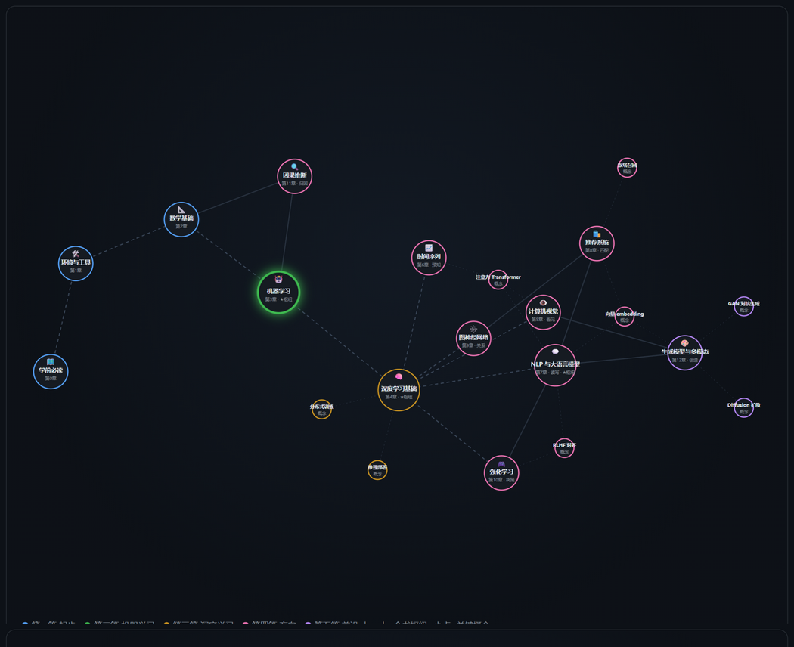
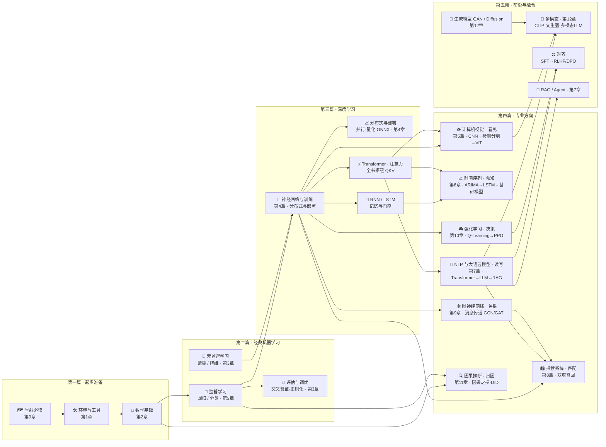

# 🌳 AI 模型知识树

### 从 0 到 1 的 AI 模型知识体系 · 通俗类比 + 图解 + 能跑的代码


> **不堆砌公式，不追逐热点：用类比和图把每个模型讲透，用能跑的代码把每个概念落地。**
> 像教材一样成体系，像百科一样好查阅——每个概念都挂在同一棵知识树上。

---

## 📖 简介

**《AI 模型知识树》是一本"讲人话"的开源 AI 模型知识库**，写给会一点 Python、想系统建立 AI 知识体系的你。全书按「**篇 → 章 → 节**」三级组织，覆盖从数学基础到前沿大模型的完整谱系：

| 维度 | 内容 |
|------|------|
| **结构** | 五篇 · 十三章 · 50+ 页：起步准备 → 经典机器学习 → 深度学习 → 七大专业方向（视觉 / 时序 / NLP 与 LLM / 推荐 / 图 / 强化学习 / 因果）→ 前沿与融合 |
| **每一页** | 七步结构：解决什么问题 → 通俗类比 → 📋 带数字的例子 → 图解原理（每个公式配一句"人话"）→ 能跑的代码 → 误区与折叠自测 |
| **每一章** | 收官一页「**生产实战**」：真实项目 0→1 的数据 / 算力 / 算法选型、场景选型表、真实工具链与踩坑实录 |
| **交互** | 🎮 交互实验场：交互式知识树、梯度下降炼丹炉、注意力热力图——本地双击即玩 |
| **扩展** | 新技术按三级机制持续往后挂：前沿地图登记 → 独立成页 → 独立成章（如 JEPA 类世界模型已有预留位） |

## 🗺️ 知识树

[](docs/知识树.md)

> 🖱️ **点击上图进入 [知识树总导航](docs/知识树.md)**——全景依赖图 + 逐章展开的页面清单 + 直达链接，GitHub 网页内直接可用。

- 📋 **[知识树总导航](docs/知识树.md)**（推荐入口）：一图看全书依赖 + 按篇折叠的逐章页面清单（点击展开）+ 三条贯穿主线；
- 🖼️ **速览图**：下方 mermaid 全局知识树，一图看依赖方向；
- 🌀 **动态版（可选，本地运行）**：`playground/knowledge-tree.html` 提供可拖拽的动态知识树。注意 GitHub 网页不渲染 HTML（打开会显示源码），请克隆仓库后本地双击体验。

---

## ✨ 这是一本什么样的知识库

| 常见痛点 | 本库的做法 |
|----------|------------|
| 资料一上来就是公式推导，劝退 | 每个模型**先用生活类比建立直觉**（下山找梯度、开卷考试的 RAG、造假者与鉴定师的 GAN），公式每个都配一句"人话" |
| 网上内容碎片化，学了很多却串不起来 | 所有内容长在**同一棵知识树**上：每页标明"上下游依赖"，章节间全部超链接可跳转 |
| 看懂了但不会用 | 每页附**最小可运行代码** + 常见误区 + 折叠自测，动手验证每个概念 |
| 学了原理，一到真实项目还是不会 | 每章收官一页「**99-生产实战**」：真实项目从 0 到 1 的数据/算力/算法选型、场景决策表、真实工具链与踩坑实录 |
| 图全是千篇一律的流程图 | 图按内容选型：**时间线 / 选型象限 / 预算饼图 / git 流程图**，另有可交互的 **playground 实验场** |
| 技术更新太快，教程三个月就过时 | 结构按**可扩展**设计：新技术先进"前沿技术地图"蓄水池登记，成熟后独立成页、成章（扩展流程见[贡献指南](./CONTRIBUTING.md)） |

## 🧭 编排逻辑：五篇递进，一条认知主线

全书按「**篇 → 章 → 节**」三级组织，五篇层层递进；第四篇七大方向对应机器的七种"能力"：

```
第一篇 起步准备      会读本库 · 装好环境 · 带上数学语言包          （第 0–2 章）
   ↓
第二篇 经典机器学习  数据 → 模型 → 评估 的世界观                  （第 3 章）
   ↓
第三篇 深度学习      神经网络地基 · 训练进阶 · 推理部署            （第 4 章）
   ↓
第四篇 专业方向      看见(5 视觉) · 预知(6 时序) · 读写(7 NLP/LLM)
                     · 匹配(8 推荐/双塔) · 关系(9 图) · 决策(10 强化) · 归因(11 因果)
   ↓
第五篇 前沿与融合    创造(12 生成模型与多模态)，站在前面所有内容之上
```

## 🌳 全局知识树



**怎么读这棵树**：箭头方向 = 依赖方向；**第四篇七个方向相互独立**，按需选读；**因果推断是横切方法论**；**Transformer 与向量表示（embedding）是两大枢纽**——前者通往 LLM / 现代时序 / 视觉前沿，后者串起词向量 → 双塔召回 → RAG 检索 → 多模态对整条线。

## 📚 目录

### [第一篇 · 起步准备 🧭](docs/1-起步准备/README.md)—— 工欲善其事（第 0–2 章）

| 章 | 标题 | 内容 | 难度 |
|----|------|------|------|
| 0 | 🗺️ [学前必读](docs/1-起步准备/00-学前必读/README.md) | 本知识库的使用方法 | ⭐ |
| 1 | 🛠️ [环境与工具](docs/1-起步准备/01-环境与工具/README.md) | Python 环境、数据集与工具链 | ⭐ |
| 2 | 📐 [数学基础](docs/1-起步准备/02-数学基础/README.md) | 线代 / 微积分 / 概率统计——AI 够用版 | ⭐⭐ |

### [第二篇 · 经典机器学习 🤖](docs/2-经典机器学习/README.md)—— 旧世界的方法（第 3 章）

| 章 | 标题 | 内容 | 难度 |
|----|------|------|------|
| 3 | 🤖 [机器学习](docs/2-经典机器学习/03-机器学习/README.md) | 回归、分类、判别 vs 生成、聚类降维、集成学习、评估调优 | ⭐⭐ |

### [第三篇 · 深度学习 🧠](docs/3-深度学习/README.md)—— 新世界的地基（第 4 章）

| 章 | 标题 | 内容 | 难度 |
|----|------|------|------|
| 4 | 🧠 [深度学习基础](docs/3-深度学习/04-深度学习基础/README.md) | 神经网络、训练全流程、PyTorch、**分布式训练与模型规模**、**推理与部署** | ⭐⭐⭐ |

### [第四篇 · 专业方向 🌐](docs/4-专业方向/README.md)—— 七大方向，七种能力（第 5–11 章）

| 章 | 标题 | 能力 | 内容 | 难度 |
|----|------|------|------|------|
| 5 | 👁️ [计算机视觉](docs/4-专业方向/05-计算机视觉/README.md) | 看见 | CNN、检测 / 分割、ViT | ⭐⭐⭐ |
| 6 | 📈 [时间序列](docs/4-专业方向/06-时间序列/README.md) | 预知 | ARIMA、RNN / LSTM、现代时序模型 | ⭐⭐⭐ |
| 7 | 💬 [NLP 与大语言模型](docs/4-专业方向/07-自然语言处理与LLM/README.md) | 读写 | 词向量、Transformer、架构细节与变体、LLM、对齐、RAG / Agent | ⭐⭐⭐⭐ |
| 8 | 🛍️ [推荐系统](docs/4-专业方向/08-推荐系统/README.md) | 匹配 | 协同过滤、矩阵分解、**双塔模型与向量召回**、排序模型 | ⭐⭐⭐ |
| 9 | 🕸️ [图神经网络](docs/4-专业方向/09-图神经网络/README.md) | 关系 | 消息传递、GCN / GAT | ⭐⭐⭐ |
| 10 | 🎮 [强化学习](docs/4-专业方向/10-强化学习/README.md) | 决策 | MDP、Q-Learning、DQN / PPO | ⭐⭐⭐ |
| 11 | 🔍 [因果推断](docs/4-专业方向/11-因果推断/README.md) | 归因 | 相关 ≠ 因果、因果之梯、DID、因果发现 | ⭐⭐⭐ |

### [第五篇 · 前沿与融合 🎨](docs/5-前沿与融合/README.md)—— 让机器创造（第 12 章）

| 章 | 标题 | 能力 | 内容 | 难度 |
|----|------|------|------|------|
| 12 | 🎨 [生成模型与多模态](docs/5-前沿与融合/12-生成模型与多模态/README.md) | 创造 | 生成全景、**GAN**、**Diffusion**、多模态、前沿地图 | ⭐⭐⭐⭐ |

**配套文件**：[🌳 知识树总导航](./docs/知识树.md) · [🗺️ 知识地图与阅读路线](./ROADMAP.md) · [🤝 贡献指南](./CONTRIBUTING.md) · [📝 更新日志](./CHANGELOG.md) · [📐 写作模板](templates/模型讲解模板.md)

## 🚀 快速开始

**方式一：直接在线阅读**（零配置）——从上方目录点进任何一章，图表在 GitHub 上原生渲染。

**方式二：克隆到本地**：

```bash
git clone https://github.com/lizhengzhong20-sketch/model_learning.git
```

本地阅读推荐 VS Code + 插件 *Markdown Preview Mermaid Support*，即可正常显示全部图表与公式。

## 🔬 一页正文长什么样

每一页都遵循同一套结构，保证质量稳定：

```
📌 解决什么问题 → 🌱 通俗理解（生活类比，零公式）
→ 📋 举个例子（带具体数字走一遍，长算例可折叠展开）
→ 🧠 核心原理（mermaid 图解 + 公式 + 每个公式的人话解释）
→ 💻 动手试试（能跑的代码 + 预期输出）→ 🔥 炼丹小灶（工业界配方与玄学）
→ 🖱️ 动手玩（playground / 经典交互工具链接）
→ 🔗 在知识树中的位置（上下游跳转） → ⚠️ 常见误区
→ 📝 小结与自测（点击展开答案） → 📚 延伸阅读
```

**易懂三件套**是每页的硬性标准：具体例子（带着数字走一遍）、配图（核心概念一图一义）、交互（折叠算例/推导、可玩的实验链接）。

页面顶部有难度 ⭐ / 所属分支 / 前置知识，底部有**上一页 / 下一页**翻页导航——像读教材一样顺。

## 🏭 每章收官：生产实战

每章正文讲完原理，最后一页固定是 `99-生产实战.md`，回答"**真实生产中到底怎么做**"：

- 一个真实项目从 0 到 1：需求 → 数据 → 设备与算力 → 算法选型 → 训练炼丹 → 评估 → 部署 → 监控迭代；
- 场景选型表（不同预算/延迟/数据量下的不同选择）、真实工具链（工具用真名）、踩坑实录、炼丹师大实话；
- 工具与数字均为行业通用实践与经验量级，不编造内部细节。

## 🎮 交互实验场 playground（克隆到本地玩）

> ⚠️ GitHub 网页**不渲染 HTML**（点开只会看到源码）。以下实验请**克隆仓库后本地双击**打开——单文件、无依赖、零构建：

| 实验 | 文件 | 玩什么 |
|------|------|--------|
| 🔥 梯度下降炼丹炉 | `playground/gradient-descent.html` | 拖学习率与动量，看小球如何下山、跨坑、以及步子太大时飞出山谷；对比 SGD / Momentum / Adam |
| 👀 注意力热力图 | `playground/attention.html` | 输入任意一句话，看注意力权重矩阵怎么算、长什么样 |
| 🌀 动态知识树 | `playground/knowledge-tree.html` | 拖拽节点、聚焦依赖链、搜索定位（导航页 `playground/index.html`） |

正文中的 🖱️「动手玩」小节链接的也是这些实验，同样需在本地打开。

## 📈 进度与规划

**已完成**

- [x] 五篇十三章框架 + 50+ 页正文（见上方目录）
- [x] 全局知识树、阅读路线、每章生产实战收官页
- [x] v0.2 全库深度化：每页机制四层递进（直觉→数学→成立条件→失效边界）+ 完整推导折叠 + 失败模式分析（13k → 21k+ 行）
- [x] 统一写作模板、扩展机制与贡献流程

**Backlog**（欢迎认领，详见 [CHANGELOG](./CHANGELOG.md)）

- [ ] 全库术语表 GLOSSARY.md（中英对照 + 一句话解释）
- [ ] 各章配套 Jupyter 实战 notebook
- [ ] 经典论文精读专栏（Attention is All You Need 等）
- [ ] playground 新实验：扩散去噪、卷积核滑动的可视化
- [ ] 英文版（en/ 目录）

## 🤝 贡献与致谢

本库按**小步提交、持续推送**的节奏演进：每次修订一个概念、新增一页，都按 [CONTRIBUTING.md](./CONTRIBUTING.md) 的规范完成并推送。欢迎同样节奏的参与——改错字、补新模型、加新方向都行；**新技术的登记与扩展流程**也写在贡献指南里。

**贡献者**：

<a href="https://github.com/lizhengzhong20-sketch/model_learning/graphs/contributors">
  
</a>

如果这个知识库对你有帮助，欢迎点一个 ⭐ Star。

## 📄 许可

[MIT](./LICENSE) © 2026 model_learning contributors
