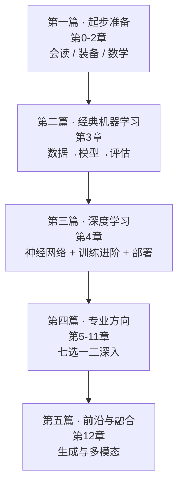

# 🗺️ 知识地图与阅读路线

> 这份地图回答三个问题：**内容按什么逻辑组织？按什么顺序读？不同目的的人从哪进入？**
> 配合根目录 [README.md](./README.md) 的知识树使用。

---

## 🧭 阅读总原则

1. **主线只有一条**：起步准备 → 经典机器学习 → 深度学习 → 专业方向 → 前沿与融合。其余连接都是支线。
2. **数学不用先啃完**：第 2 章第一遍只求"知道去哪查"，后续**用到再回看**。
3. **代码必须跟手跑**：每页"动手试试"不能只看——跑一遍、改一个参数、再看结果变化。
4. **知识树是地图，不是任务清单**：允许跳读，允许按需查阅。
5. **每章读完正文，别漏收官的「生产实战」页**：把原理对齐到真实工作流——选型、算力、工具与坑都在那里。

---

## 📊 五篇递进地图



| 篇 | 章 | 定位 | 读完的标志 |
|----|----|------|-----------|
| [第一篇 起步准备](docs/1-起步准备/README.md) | 0–2 | 会用本库、装好环境、带上数学语言包 | 能独立跑通一个 sklearn 示例；知道梯度、矩阵乘法、条件概率各自的直觉 |
| [第二篇 经典机器学习](docs/2-经典机器学习/README.md) | 3 | 建立"数据→模型→评估"完整闭环 | 能对一份表格数据完成回归 + 分类并正确评估 |
| [第三篇 深度学习](docs/3-深度学习/README.md) | 4 | 理解神经网络训练全过程；懂模型规模分级、分布式与推理部署的常识 | 能手写训练循环训一个 MLP；说得出什么时候需要多卡、什么时候要量化 |
| [第四篇 专业方向](docs/4-专业方向/README.md) | 5–11 | 七大方向按需选 1~2 个 | 能读懂该方向论文/项目的主体，并复现一个入门项目 |
| [第五篇 前沿与融合](docs/5-前沿与融合/README.md) | 12 | 生成模型与多模态，站在全书之上 | 能讲清"预训练→SFT→RLHF"、RAG、GAN 与 Diffusion 的原理 |

---

## 🚀 三种读法

### 读法 A：建立全局认知（跳读主干）

```
00 学前必读 → 02 数学基础（读"为什么要学数学"+ 各页"通俗理解"节）
→ 03 机器学习（全景 / 线性回归 / 逻辑回归 / 评估调优 四页精读，其余略读）
→ 04 深度学习基础 → 07 NLP 与 LLM（README → Transformer → LLM 全景）
→ 12 生成与多模态（README → 前沿技术地图）
```

适合：需要听懂算法团队在说什么的产品、管理、运营，以及想先看全景再决定深入的读者。

### 读法 B：系统通读（完整路线）

```
第一篇 → 第二篇 → 第三篇 → 第四篇（选 1~2 个方向）→ 第五篇

方向选择参考：
- 做图像相关 → 第 5 章 计算机视觉
- 做业务预测 / 经营分析 → 第 6 章 时间序列 + 第 11 章 因果推断
- 做文本 / 大模型应用 → 第 7 章 NLP 与 LLM（全读）+ 第 12 章
- 做搜索 / 推荐 / 个性化 → 第 8 章 推荐系统 + 第 9 章 图神经网络
- 做决策 / 游戏 / 机器人 → 第 10 章 强化学习
```

适合：想完整建立 AI 知识体系的读者。每页"动手试试"都值得跑。

### 读法 C：直奔大模型（有基础时）

```
第 7 章 NLP 与 LLM 全章（重点：02 Transformer → 03 架构细节 → 04 LLM 全景 → 05 微调与对齐 → 06 RAG 与 Agent）
→ 第 10 章 强化学习（只需入门页 + 深度强化学习中 RLHF 相关部分）
→ 第 12 章（GAN → Diffusion → 多模态 → 前沿地图）
```

适合：已会 Python 和基础机器学习、想转入大模型方向的读者。

---

## 📖 方法建议

1. **费曼技巧**：每读完一页，合上文件，用自己的话把"通俗理解"讲一遍——讲不顺就是没懂。
2. **每页自测**：底部"自测一下"要认真答，答案折叠在 `<details>` 里。
3. **改代码实验**：把示例的学习率 / 层数 / 数据量改一改，观察结果变化，建立手感；`playground/` 里的交互实验可以拖滑块建立直觉。
4. **输出倒逼输入**：读完一章写一篇小结，或直接按 [CONTRIBUTING.md](./CONTRIBUTING.md) 给本库提交修订。
5. **不求一次学懂**：知识树的价值在于"知道东西在哪、互相什么关系"。第一遍过主线，第二遍补细节。

---

[⬆️ 返回总目录](./README.md)
