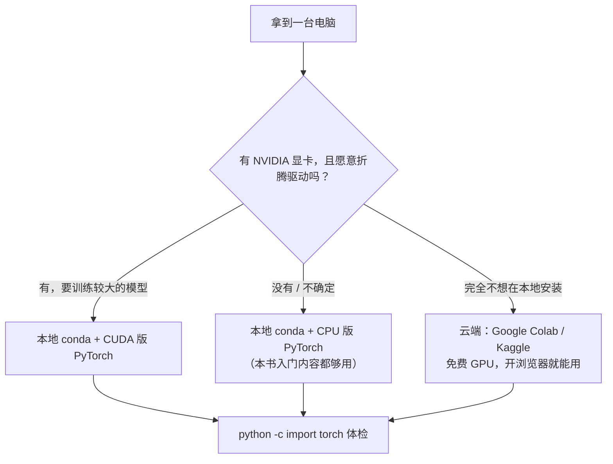

# 开发环境搭建

> **一句话理解**：在你自己的电脑（或免费的云端算力）上开出一块干净、隔离的"试验田"——装好 Python 环境与 PyTorch，让全书每一页的代码都有地方跑。

[⬆️ 返回总目录](../../../README.md) · [⬆️ 返回本篇](../README.md) · [⬅️ 返回本章目录](./README.md)

| 属性 | 说明 |
|------|------|
| 难度 | ⭐（不难，但细节多——照着做即可，报错去文末速查表对症下药） |
| 所属分支 | 通用基础 |
| 前置知识 | 无 |

---

## 📌 这一节解决什么问题

学 AI 遇到的第一只拦路虎，往往不是数学，而是装环境。

最常见的翻车方式：直接往系统自带的 Python 里装包。今天项目 A 要某个库的 1.x 版本，明天项目 B 要 2.x，互相打架，最后整个 Python "半残"，卸载重装比学模型还费劲。深度学习还多一层门槛：显卡（Graphics Processing Unit, GPU）、驱动、CUDA、PyTorch 版本要对上号，任何一环不对，代码就在别人电脑上能跑、在你电脑上报错。

这一节的思路是"先隔离，再安装"：用虚拟环境（Virtual Environment）给每个项目开一块独立试验田，再按自己机器的情况选一条安装路线，最后用一条命令验证装好了没有。

## 🌱 通俗理解

把装环境想象成开菜地：

- **虚拟环境 = 一块独立菜地**：A 项目这块地施化肥，B 项目那块地用有机肥，互不传染；一块地荒了，整块扔掉重开，心疼程度远低于重装系统。
- **conda = 开垦菜地的园丁工具箱**：随手开一块新地（`conda create`）、随时进出一块地（`activate` / `deactivate`）、列出所有地（`env list`）。
- **Colab / Kaggle = 租好的现成菜地**：带浇水系统（GPU）和预装农具（PyTorch 等库），拎包入住，浏览器打开就能干活；缺点是地是别人的——文件要记得及时搬回自己家。

## 📋 举个例子

场景：一台全新的 Windows 电脑，目标是从零到跑通 `import torch`。完整命令序列就这几条：

```bash
# ① 安装 Miniconda 后，从开始菜单打开 "Anaconda Prompt (miniconda3)"，创建名为 ai 的试验田
conda create -n ai python=3.10 -y
# ② 走进这块试验田（之后每次使用前都要先激活）
conda activate ai
# ③ pip 永久换国内源（只需设置一次，之后所有下载都提速）
pip config set global.index-url https://pypi.tuna.tsinghua.edu.cn/simple
# ④ 安装 CPU 版 PyTorch（无 NVIDIA 显卡 / 只想先学起来的选择）
pip install torch torchvision
# ⑤ 体检：能打印出版本号，环境就是好的
python -c "import torch; print(torch.__version__); print(torch.cuda.is_available())"
```

预期输出（CPU 版）：形如 `2.x.x+cpu` 和 `False`——**看到 `+cpu` 说明装好了**；`False` 只表示"当前没用显卡"，不是报错。

<details>
<summary>📊 展开完整算例：每一步发生了什么、预期输出长什么样</summary>

**第 ① 步 `conda create -n ai python=3.10 -y`**
屏幕会列出准备安装的包（python、pip 等），`-y` 表示自动确认。结束出现 `done.`。

**第 ② 步 `conda activate ai`**
命令行开头的 `(base)` 变成 `(ai)`——这个前缀就是你"站在哪块地里"的标志。退出用 `conda deactivate`。

**第 ③ 步 `pip config set global.index-url ...`**
输出 `Writing to C:\Users\你的用户名\AppData\Roaming\pip\pip.ini`——它把"以后下载走清华镜像源"写进了配置文件，只需做一次。

**第 ④ 步 `pip install torch torchvision`**
开始下载几百 MB 的包并安装。换过源后速度明显更快；如果中途断了，重跑同一条命令即可。

**第 ⑤ 步 `python -c "import torch; ..."`**
打印两行：第一行是 PyTorch 版本号（如 `2.x.x+cpu`），第二行是 `False`（CPU 版没有 CUDA，属正常）。没有任何红色 Traceback，即环境搭建成功。

**如果第 ④ 步想装 CUDA 版**（有 NVIDIA 显卡时）：先在官网选择器（见"动手玩"一节）生成命令，形如 `pip install torch torchvision --index-url https://download.pytorch.org/whl/cuXXX`，具体以官网当前给出的为准。

</details>

## 🧠 核心原理

### 整体流程

先做一道选择题：你的机器和需求，适合哪条路线？



### 方案对比：三种主流方案

| 方案 | 门槛 | 算力 | 优点 | 局限 |
|------|------|------|------|------|
| 本地 conda / venv | 装一次 Miniconda | 自己电脑的 CPU / GPU | 一次装好长期用；文件都在本地可控；最贴近真实工作环境 | 没有显卡时训练慢；排错靠自己 |
| Google Colab | 一个 Google 账号 | 免费 GPU（T4 级，以官网政策为准），可付费升级 | 零安装、预装 PyTorch；跑 notebook 最顺手 | 国内网络访问不稳定；空闲会话会被回收，文件记得及时保存到网盘或 GitHub |
| Kaggle Notebooks | 一个 Kaggle 账号 | 每周免费 GPU 时长（约 30 小时，以官网政策为准） | 海量数据集即点即用；社区 notebook 可直接参考学习 | 侧重比赛场景；自定义环境不如本地灵活 |

### 逐步拆解

#### 1. Miniconda 最小安装（Windows 为主）

- **下载**：去 Miniconda 官方页面（docs.conda.io）下载 Windows 64 位安装包，安装时一路默认即可（"Just Me" 安装更省心）。
- **入口**：装完在开始菜单找到 **Anaconda Prompt (miniconda3)**——以后都在这里敲命令，它自带 conda；不要直接用系统 PowerShell 敲 conda（除非执行过 `conda init`）。
- **验证**：`conda --version` 能打印形如 `conda 24.x.x` 即成功。
- **日常四命令**：

```bash
conda create -n 环境名 python=3.10   # 开一块新地
conda activate 环境名                 # 进入这块地
conda deactivate                      # 退回 base
conda env remove -n 环境名            # 整块地不要了（坏了就扔，别恋战）
```

<details>
<summary>🧮 展开看：Windows 安装的两个少坑细节</summary>

1. **安装路径避免中文与空格**：默认路径（在用户目录下）通常没问题；自定义路径时含中文或空格，是各种玄学报错的经典来源。
2. **conda init**：如果想在 PowerShell / Git Bash 里直接用 `conda`，执行一次 `conda init` 后重开终端即可；装完 conda 命令不识别，九成是终端没重开。

</details>

#### 2. pip 换国内源：一条命令

```bash
pip config set global.index-url https://pypi.tuna.tsinghua.edu.cn/simple
```

这是清华大学的 PyPI 镜像（Mirror）。设置一次永久生效，下载 torch 这类几百 MB 的大包时速度差别肉眼可见。想恢复默认：`pip config unset global.index-url`。

#### 3. Jupyter Lab 要点

```bash
pip install jupyterlab
jupyter lab        # 启动后自动打开浏览器
```

两个新手最容易踩的点：

- **内核要选对**：每个 notebook 右上角的内核（Kernel）显示的必须是你的环境名（如 `ai`），否则 `import torch` 会报"找不到模块"——因为 notebook 可能还挂在 base 环境上。
- **让环境出现在 Jupyter 里**（可选）：`python -m ipykernel install --user --name ai`。
- **关闭**：浏览器关掉页面后，回到终端按 `Ctrl + C` 结束服务。

#### 4. PyTorch 安装：CPU 还是 CUDA？

先回答一个问题：**你要训练多大的模型？** 本书入门示例（MLP、小型 CNN）CPU 完全够用；要训练较大的视觉模型或微调大语言模型，才需要 GPU。

- **CPU 版**：`pip install torch torchvision`。体积小、装完即用，是入门首选。
- **CUDA 版**：先在终端执行 `nvidia-smi`——有输出说明显卡驱动正常，右上角会显示驱动最高支持的 CUDA 版本；然后去官网"Start Locally"选择器按机器配置生成命令（形如 `--index-url https://download.pytorch.org/whl/cuXXX`，以官网当前为准）。
- **验证 GPU 版**：`torch.cuda.is_available()` 返回 `True`，且 `torch.cuda.get_device_name(0)` 能打印出显卡名。

## 💻 动手试试

```python
# env_check.py —— 环境体检脚本：确认 Python 与 PyTorch 都装好了
import sys
import torch

print("Python 版本 :", sys.version.split()[0])   # 你装环境时选的版本，如 3.10.x
print("PyTorch 版本:", torch.__version__)         # CPU 版形如 2.x.x+cpu
print("CUDA 可用   :", torch.cuda.is_available()) # CPU 版为 False，属正常

x = torch.arange(6).reshape(2, 3)                # 顺手做一次张量运算
print(x)
# 预期输出：
# Python 版本 : 3.10.x
# PyTorch 版本: 2.x.x+cpu
# CUDA 可用   : False
# tensor([[0, 1, 2],
#         [3, 4, 5]])
```

只要四行都能打印、最后一行是那个 2×3 的矩阵，你的环境就能跑全书的入门代码。

## 🔥 炼丹小灶

> 🔥 **炼丹小灶**：配环境的工业界经验——
> - 配方：新项目固定"python 主流稳定版 + CPU 版 torch"先跑通，确认要用 GPU 再升级 CUDA 版；base 环境永远不装项目包。
> - 玄学：环境坏了先整块删掉重建（`conda env remove`），通常比逐条排查快；长期没用的环境，用之前先跑一遍体检脚本；驱动类问题，重启大法真实有效。
> - ⚠️ 以上是经验参考，不是圣旨；换机器请重新对一遍官方命令。

## 🖱️ 动手玩

> 🕹️ [PyTorch 官方安装选择器](https://pytorch.org/get-started/locally/)——选系统、包管理器、算力类型，自动生成当前版本的安装命令；装 CUDA 版之前先来这里对一遍。
> 🕹️ [Google Colab](https://colab.research.google.com)——零安装体验：新建笔记本，菜单"代码执行程序 → 更改运行时类型 → GPU"，直接 `import torch` 就能用，感受"别人替你配好环境"的快乐。

## 🔗 在知识树中的位置

- **上游**：本章 [README](./README.md)（本章地图与用法）；本页无知识前置。
- **下游**：[数据集与工具链](./02-数据集与工具链.md)——环境好了去领数据；第 4 章 [PyTorch 快速上手](../../3-深度学习/04-深度学习基础/03-PyTorch快速上手.md)——本页装的正是它的门票；[生产实战](./99-生产实战.md)——团队里环境怎么管。
- **横向对比**：与[第 2 章：数学基础](../02-数学基础/README.md)并列同属起步准备——一个给硬件，一个给语言。

## ⚠️ 常见误区

- **误区一**："Python 装最新版最好" → 刚发布的 Python 版本可能还没被 PyTorch 等库适配；选发布一两年、生态成熟的主流稳定版更省心。
- **误区二**："conda 和 pip 混着用无所谓" → 同一环境里两边各装一半，依赖（Dependency）关系会乱成一团；常见做法是 conda 建环境 + pip 装包，一个环境以一种为主。
- **误区三**："`torch.cuda.is_available()` 返回 False 就是装错了" → 你装的很可能本来就是 CPU 版（版本号带 `+cpu`），学本书入门内容完全没问题，不是故障。
- **误区四**："在 base 环境里装包也没事" → base 是 conda 的自留地，装乱了连 conda 本体都可能罢工；永远为新项目开新环境。

**报错速查表**（配合上面的误区食用）：

| 报错关键词 | 典型样子 | 大概率原因 | 怎么办 |
|-----------|----------|-----------|--------|
| 版本冲突 | `ResolutionImpossible`、`dependency resolver` 警告 | 两个包要求同一依赖的不同版本 | 换一块全新的环境重装；或按报错提示固定某个包的版本；不要把所有库一锅炖进一个环境 |
| CUDA 不可用 | `torch.cuda.is_available()` 为 False；或 `Torch not compiled with CUDA enabled` | 装的是 CPU 版；或驱动太旧；或 CUDA 与 PyTorch 版本不匹配 | 装的是 CPU 版 → 需要就按官网命令重装 CUDA 版；有显卡 → 先 `nvidia-smi` 看驱动，再去官网选择器对命令 |
| 下载慢 / 超时 | `Read timed out`、进度条龟速或卡死 | 默认下载源在国外 | 执行上面的清华源命令换源后重试；大包超时可加 `--timeout 600` |
| conda 命令找不到 | `conda: command not found` | 用错了终端，或装完没重开终端 | Windows 从开始菜单开 "Anaconda Prompt"；或执行 `conda init` 后重开终端 |

## 📝 小结与自测

**要点回顾**

- 虚拟环境把每个项目的依赖隔离开，是"装环境"问题的根治方案；
- 三条路线：本地 conda（长期主力）、Colab / Kaggle（免费 GPU、零安装）；
- pip 换清华源一条命令，下载速度天差地别；
- CPU 版 PyTorch 足以跑完全书入门示例，需要 GPU 时再按官网命令装 CUDA 版。

**自测一下**（点击展开答案）

<details>
<summary>问题 1：为什么每个项目要单独建虚拟环境，而不是共用一个？</summary>

隔离依赖：不同项目可能要求同一个库的不同版本，共用必然打架；隔离之后，一个环境坏了只需删掉它自己重建，不伤及其他项目，更不伤系统 Python。

</details>

<details>
<summary>问题 2：电脑没有 NVIDIA 显卡，还能学这本书吗？</summary>

能。CPU 版 PyTorch 覆盖全书入门示例；需要 GPU 的实验可以用 Google Colab 或 Kaggle 的免费算力；只有训练较大模型时，本地显卡才是刚需。

</details>

## 📚 延伸阅读

- 官方教程：[PyTorch 官方安装指南（Start Locally）](https://pytorch.org/get-started/locally/)——安装命令以这里为最终准绳
- 官方文档：[Miniconda 官方页面](https://docs.conda.io/en/latest/miniconda.html)——下载与各平台安装说明
- 云端练手：[Google Colab](https://colab.research.google.com) · [Kaggle Notebooks](https://www.kaggle.com/code)

---

[⬅️ 上一页：第 1 章目录](./README.md) · [返回本章目录](./README.md) · [下一页：数据集与工具链 ➡️](./02-数据集与工具链.md)
