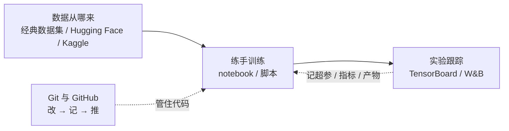
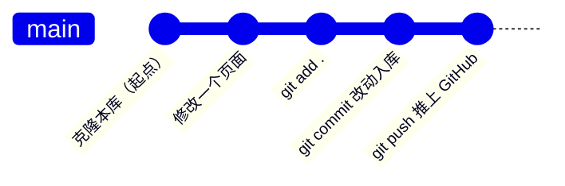

# 数据集与工具链

> **一句话理解**：给"练手"配齐食材与厨具——一张拿来即用的数据集清单，加上一套管住代码与实验记录的最小工具链（Git + 实验跟踪）。

[⬆️ 返回总目录](../../../README.md) · [⬆️ 返回本篇](../README.md) · [⬅️ 返回本章目录](./README.md)

| 属性 | 说明 |
|------|------|
| 难度 | ⭐ |
| 所属分支 | 通用基础 |
| 前置知识 | [开发环境搭建](./01-开发环境搭建.md) |

---

## 📌 这一节解决什么问题

环境装好之后，练手路上还有三个高频问题反复出现：

1. **"去哪找数据？"**——自己爬数据又慢又脏，清洗时间远超学模型的时间；
2. **"这份代码是哪一版？"**——文件名管理法的尽头是 `final_v2_真的最终版.py`；
3. **"上周那个 92% 的结果怎么跑出来的？"**——没人记得超参数，实验像失传的丹方。

这一页对症下药给三样东西：**经典数据集清单**（数据从哪来）、**Git 最小工作流**（代码怎么管）、**实验跟踪一句话**（结果怎么记）。

## 🌱 通俗理解

继续用做菜类比：

- **经典数据集 = 驾校练习车道**：全世界的人都在同一条车道上练车，你的水平才能和别人比较——"在 MNIST 上做到 97%"是什么档次，同行一听就懂；自己爬的数据像自家小区停车场，没人能验证你开得好不好。
- **Git = 给菜谱拍快照的照相机**：每按一次快门（commit），"这道菜此刻怎么做"就永久定格，随时翻回任何一张照片；照片再同步到云端相册（GitHub），电脑坏了也不怕。
- **实验跟踪 = 炼丹炉旁的记录本**：投了什么料（超参数）、炼了几炉（训练轮数）、成色如何（指标），一笔一笔记下来——否则"最灵的那炉丹"永远无法复现。

## 📋 举个例子

拿 Fashion-MNIST 数据集来"盘点食材"，数字如下：

| 项目 | 数值 |
|------|------|
| 类别数 | 10 类（T 恤、裤子、套衫、裙子、外套、凉鞋、衬衫、运动鞋、包、踝靴） |
| 训练集 | 60000 张 |
| 测试集 | 10000 张 |
| 单张图像 | 28×28 像素的灰度图 |

小场景：你在第 4 章写完第一个训练循环，正愁没数据验证——就用它。6 万张图、10 分类，规模刚好：一轮训练在普通 CPU 上就能完成，当天就能亲眼看到损失（Loss）从 1 点多一路往下走。这就是"标准练习车道"的价值：不快不慢，刚好够练。

<details>
<summary>📊 展开完整算例：三行代码把这组数字亲手数出来</summary>

用 torchvision 下载并盘点（完整可运行代码见下方"动手试试"，这里看过程）：

1. `FashionMNIST(root="./data", train=True, download=True)` 首次运行会打印 `Downloading http://fashion-mnist.s3-website...`，把约 30 MB 的压缩包下到 `./data/FashionMNIST/raw/`，解压出 4 个文件（训练图/训练标签/测试图/测试标签）；第二次运行直接读缓存，秒开。
2. `len(train)` 打印 `60000`，`len(test)` 打印 `10000`。
3. `train[0]` 取第一张，返回 `(图像, 标签)` 二元组；图像的 `size` 是 `(28, 28)`；标签是数字 `9`，查类别表 `train.classes[9]` 是 `Ankle boot`（踝靴）——Fashion-MNIST 的第一张训练图恰好是只踝靴，这是它的小彩蛋。

整个过程没有任何配置文件、注册账号或手动下载——"标准数据集 + 一行 download=True"是练手阶段性价比最高的数据获取方式。

</details>

## 🧠 核心原理

### 整体流程



数据喂给训练，代码由 Git 管住版本，实验由跟踪工具留痕——三者合起来才是完整的"练手工具链"。

### 练手数据集清单

| 数据集 | 内容 | 适合练什么 | 对应本书 |
|--------|------|-----------|----------|
| MNIST | 70000 张 28×28 手写数字（60000 训练 + 10000 测试） | 第一个神经网络、第一个训练循环 | 第 4 章 [训练一个模型的完整流程](../../3-深度学习/04-深度学习基础/02-训练一个模型的完整流程.md) |
| Fashion-MNIST | 与 MNIST 同规格的 10 类服饰图 | 分类入门，比数字稍难 | 第 4 章 [PyTorch 快速上手](../../3-深度学习/04-深度学习基础/03-PyTorch快速上手.md) |
| CIFAR-10 | 50000 训练 + 10000 测试的 32×32 彩色图，10 类 | CNN 卷积、数据增强 | 第 5 章 [CNN 卷积神经网络](../../4-专业方向/05-计算机视觉/01-CNN卷积神经网络.md) |
| IMDB 影评 | 50000 条影评，带正面/负面标签 | 文本分类、词向量 | 第 7 章 [词向量与 embedding](../../4-专业方向/07-自然语言处理与LLM/01-词向量与embedding.md) |
| 泰坦尼克（Kaggle） | 891 条训练 + 418 条测试的乘客表格数据（年龄、舱位、票价…） | 表格数据的特征工程与分类 | 第 3 章 [逻辑回归与分类](../../2-经典机器学习/03-机器学习/03-逻辑回归与分类.md)、[决策树与集成学习](../../2-经典机器学习/03-机器学习/04-决策树与集成学习.md) |
| Hugging Face datasets | 文本/图像/音频/多模态的海量数据集聚合 | 微调 LLM、各类 NLP 与多模态任务 | 第 7 章 [大语言模型 LLM 全景](../../4-专业方向/07-自然语言处理与LLM/04-大语言模型LLM全景.md) |
| Kaggle 数据集 | 各行各业的开放数据与比赛数据 | 完整项目实战、参考别人的 notebook | 第 3 章 [模型评估与调优](../../2-经典机器学习/03-机器学习/07-模型评估与调优.md) |

**怎么选**：练基本功选前三行（图像，torchvision 一行下载）；练表格数据选泰坦尼克；进 NLP 和大模型再进后两行。

### Hugging Face Hub：第 7 章的主战场

Hugging Face Hub 不只是"数据集网盘"，它是**模型、数据集、在线演示（Spaces）三位一体**的开放平台：几百万个数据集有统一的"数据集卡"（说明、预览、许可），`datasets` 库一行 `load_dataset("数据集名")` 就能下载并转成统一格式。学到第 7 章的微调与 RAG 时，你几乎每天都在和它打交道——本页先记住入口，把逛它当成逛技术超市。

### Git 与 GitHub：最小工作流五命令

| 命令 | 干什么 | 类比 |
|------|--------|------|
| `git clone 仓库地址` | 把云端仓库整体搬回本地 | 把菜谱本从书城买回家 |
| `git status` | 看哪些文件改了 | 翻一眼草稿，确认哪些要拍快照 |
| `git add .` | 把改动登记进"待拍快照"清单 | 把这几页草稿摆到相机前 |
| `git commit -m "说明"` | 拍下快照并写一句说明 | 咔嚓——这张照片永久存档 |
| `git push` | 把本地快照推上 GitHub | 把相册同步到云盘备份 |

这套"改 → 记 → 推"的循环，**本库自己就是活教材**：这个知识库按"小步提交、持续推送"的节奏一点点长出来，你在 GitHub 上看到的提交历史，就是全书的成长日记。



<details>
<summary>🧮 展开看：从 clone 到 push 的完整终端演练（含预期输出）</summary>

```bash
# ① 把本库搬回本地（地址以仓库首页为准）
git clone https://github.com/lizhengzhong20-sketch/model_learning.git
cd model_learning

# ② 随便编辑一个 .md 文件后，查看状态
git status
# 预期输出里有一行红字：modified:   docs/xxx.md

# ③ 登记改动，再看一次状态
git add .
git status
# 红字变绿字：Changes to be committed

# ④ 拍快照
git commit -m "docs(01-环境): 修正一处安装命令"
# 预期输出形如：1 file changed, 2 insertions(+), 1 deletion(-)

# ⑤ 推上云端
git push
# 输出 Enumerating objects... 一路无红色报错即完成
```

五条命令，一个循环。写笔记、改配置、维护文档，同样适用——Git 不只管代码。

</details>

### 实验跟踪：一句话版本

**每次训练都把超参数、指标曲线和产物（checkpoint，检查点）自动记下来**——TensorBoard 是本地轻量款，Weights & Biases（W&B）是云端团队款；第 4 章 [训练一个模型的完整流程](../../3-深度学习/04-深度学习基础/02-训练一个模型的完整流程.md)会正式用上，这里先混个脸熟。

## 💻 动手试试

```python
# dataset_check.py —— 三行代码盘点一个经典数据集（需先 pip install torchvision）
from torchvision.datasets import FashionMNIST

# download=True：本地没有就自动下载（首次约 30 MB），之后直接读缓存
train = FashionMNIST(root="./data", train=True, download=True)
test = FashionMNIST(root="./data", train=False, download=True)

print("训练集:", len(train), "张；测试集:", len(test), "张")
img, label = train[0]                       # 取第一张：返回 (图像, 标签) 二元组
print("单张尺寸:", img.size, "；类别数:", len(train.classes))
print("第 0 张的类别是:", train.classes[label])
# 预期输出：
# 训练集: 60000 张；测试集: 10000 张
# 单张尺寸: (28, 28) ；类别数: 10
# 第 0 张的类别是: Ankle boot
```

能用代码"数出"数据集的规模，你就再也不怕拿到一份数据不知从何看起了。

## 🔥 炼丹小灶

> 🔥 **炼丹小灶**：找数据与下数据的经验——
> - 配方：练手首选"一行代码下载"的经典集（torchvision / sklearn / Hugging Face `datasets`），把时间花在模型上而不是找数据上。
> - 玄学：Hugging Face 下载慢，常见做法是设置镜像端点（`HF_ENDPOINT` 环境变量）加速，具体以官方与镜像站当前说明为准；数据下到一半断了，直接重跑同一条命令，多数下载器支持续传或重下。
> - ⚠️ 以上是经验参考，不是圣旨；换数据源请重新确认网络与许可。

## 🖱️ 动手玩

> 🕹️ [Kaggle Datasets](https://www.kaggle.com/datasets)——按关键词搜你感兴趣的方向（sales、medical、sports 都行），点进任一数据集看 "Code" 页：别人用同一份数据写的 notebook，是最好的免费教材。
> 🕹️ [Hugging Face Datasets](https://huggingface.co/datasets)——点开任一数据集卡，看预览、下载量与配套模型，提前感受第 7 章的主战场长什么样。

## 🔗 在知识树中的位置

- **上游**：[开发环境搭建](./01-开发环境搭建.md)——先有环境，数据才装得进。
- **下游**：[生产实战](./99-生产实战.md)——团队里数据与实验怎么管；第 4 章 [PyTorch 快速上手](../../3-深度学习/04-深度学习基础/03-PyTorch快速上手.md)——清单里的数据集在那里随取随用；第 7 章 [NLP 与大语言模型](../../4-专业方向/07-自然语言处理与LLM/README.md)——Hugging Face 的主战场。
- **横向对比**：与第 3 章 [机器学习](../../2-经典机器学习/03-机器学习/README.md)互补——那边讲"拿到数据之后怎么办"，这边讲"数据从哪来、代码怎么管"。

## ⚠️ 常见误区

- **误区一**："经典数据集都被刷烂了，练它没价值" → 被刷烂的是榜单排名，不是学习价值；经典集是**公共标尺**——同样的数据上，你的结果可以直接和教材、论文、同行比较，对错一目了然。
- **误区二**："数据越大越好" → 练手阶段恰恰相反：小数据集几分钟一轮实验，反馈密度才是成长速度；大项目才需要大数据。
- **误区三**："Git 只用于写代码的项目" → 笔记、文档、配置同样受益——本库就是纯文档仓库；只要你想留历史、能回退，就值得用 Git。

## 📝 小结与自测

**要点回顾**

- 练手数据优先选一键下载的经典集：MNIST / Fashion-MNIST（图像入门）、泰坦尼克（表格）、IMDB（文本）、Hugging Face 与 Kaggle（进阶与实战）；
- Git 最小工作流五命令：clone / status / add / commit / push，构成"改 → 记 → 推"循环；
- 实验跟踪从第一天养成：超参、指标、产物都要留痕。

**自测一下**（点击展开答案）

<details>
<summary>问题 1：练手为什么优先选 MNIST 这类经典数据集，而不是自己爬数据？</summary>

三个理由：一键下载省时间；干净且切分标准（训练/测试固定），结果可信；全世界都用它，你的结果可以直接与同行比较。自己爬的数据，清洗和验证成本会把练模型的时间挤光。

</details>

<details>
<summary>问题 2：`git add` 和 `git commit` 分别在做什么？少了 `git push` 会怎样？</summary>

`git add` 把改动放进"待拍快照"的清单，`git commit` 才真正拍下快照写入本地历史；少了 `git push`，这些快照只存在于你自己电脑上——电脑一坏，历史全失，云端（GitHub）上什么都没有。

</details>

## 📚 延伸阅读

- 书：[Pro Git 中文版](https://git-scm.com/book/zh/v2)——Git 官方推荐书，前三章够用很久
- 文档：[Hugging Face Datasets 文档](https://huggingface.co/docs/datasets) · [torchvision.datasets 文档](https://pytorch.org/vision/stable/datasets.html)
- 课程：[Kaggle Learn](https://www.kaggle.com/learn)——免费短课，边看边在浏览器里练

---

[⬅️ 上一页：开发环境搭建](./01-开发环境搭建.md) · [返回本章目录](./README.md) · [下一页：生产实战 ➡️](./99-生产实战.md)
