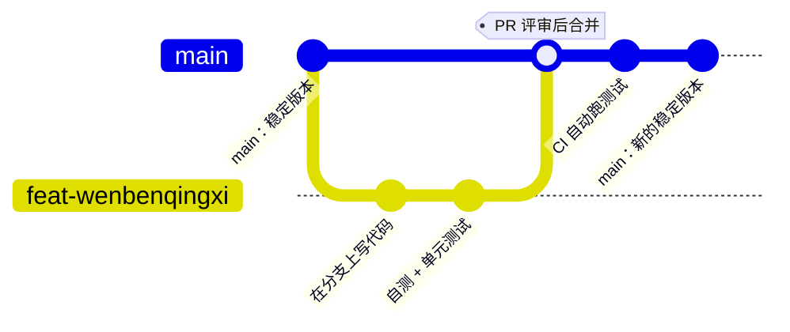

# 生产实战：真实团队的工程化日常

> **一句话理解**：课本教你"模型怎么训出来"，真实工作里至少一半时间在回答另外三个问题——这段代码谁改的、环境是谁的、上周那个 92% 的结果怎么复现；这一页讲一个团队怎么用一整套工具链，把这三个问题管起来。

[⬆️ 返回总目录](../../../README.md) · [⬆️ 返回本篇](../README.md) · [⬅️ 返回本章目录](./README.md)

| 属性 | 说明 |
|------|------|
| 难度 | ⭐⭐ |
| 所属分支 | 通用基础 |
| 前置知识 | 本章全部正文 |

---

## 🏭 一个真实项目从 0 到 1：从个人脚本到规范协作

场景（通用行业情景，人物为虚构）：算法工程师小张用 notebook 做出一个文本分类原型，离线准确率不错，业务方拍板立项；半年后团队变成 3 人（2 算法 + 1 工程）接手迭代——故事从"notebook 跑不动了"开始。


分阶段拆解（每个阶段说清"做什么、常见卡点"）：

- **阶段 1 · 个人脚本期**：做什么——notebook 里从读数到评估一口气跑完，靠文件名区分版本（`final_v2_真的最终.ipynb`）。卡点——只有小张的电脑能跑；"重跑一遍"等于"按上下执行一遍看命"；他休假，项目就停摆。
- **阶段 2 · 环境与依赖规范**：做什么——把"能跑"从某台电脑搬到一份文件里：
  - `requirements.txt`：`pip freeze > requirements.txt` 导出，别人 `pip install -r requirements.txt` 一键复原；
  - 进一步用 poetry 或 uv 生成锁文件（Lock File），把每个包连同传递依赖的确切版本一起钉死；
  - conda 与 uv 各有所长：conda 连 Python 解释器与 CUDA 工具链一起管，uv 胜在安装速度快——团队选一种、全员统一；
  - **为什么"我本地能跑"是团队毒瘤**：它把"能跑"绑定在某台机器看不见的状态上（一个偷偷装过的包、一版特殊的驱动）。工程上的翻译是——**没有锁版本的环境，等于没有环境**。

<details>
<summary>📋 展开看：requirements.txt 与锁文件的差别（最小示例）</summary>

```text
# requirements.txt —— 记录"你亲手装的"，像购物清单（版本可松可紧）
torch
pandas>=2.0
scikit-learn

# poetry.lock / uv.lock（示意）—— 记录"实际生效的整棵依赖树"，像购物小票
# torch 2.x.x  →  依赖 filelock==x.y.z、typing-extensions==x.y.z、nvidia-* 若干 …
# 每个传递依赖的确切版本与哈希都被钉死
```

差别一句话：清单保证"想买的一样"，小票才保证"买回来的一模一样"。个人项目清单够用，团队协作上小票（锁文件）。

</details>

- **阶段 3 · 协作规范（Git）**：做什么——main 分支保护起来，活在特性（feature）分支上干，干完提拉取请求（Pull Request, PR），至少一人代码评审（Code Review）通过后合并。卡点——有人习惯直接 push main（用分支保护规则堵死）；PR 堆成几百行的"巨无霸"（约定一次 PR 只做一件事，小步快走）。

### 🔀 Git 协作长什么样



看点：main 上永远是"能跑的稳定版"；所有试验发生在分支上；合并前有一道人肉关卡（评审）和一道机器关卡（CI，持续集成）。**合并那一刻，知识也完成了流动**——评审者是第二个懂这段代码的人。

- **阶段 4 · 留痕规范（实验与数据）**：做什么——用 W&B 或 MLflow 记录每次训练的超参、指标曲线与产物（checkpoint 与配置文件一起归档）；数据用 DVC 做版本控制（Data Version Control）——一句话：**git 管代码，DVC 管数据，用同样的提交习惯联动**。卡点——"这次实验我记得很清楚"（两周后没人记得，包括你自己）。
- **阶段 5 · 平台化**：做什么——统一 Docker 镜像、CI 自动化测试、内部 ML 平台统一调度训练与算力。到这一步多由平台团队支撑，算法同学按规范接入即可。

<details>
<summary>📋 展开一个真实的迭代故事</summary>

上线两个月后，运营反馈"模型好像变笨了"。排查发现：当周例行重训时，负责拼数据的新同事用另一台机器跑预处理脚本，两台机器的 pandas 版本不同，某个默认排序行为不一致——训练样本顺序变了，模型自然有细微漂移。

修复过程：先回滚到上一个归档的 checkpoint 止血；随后把数据预处理也纳入锁文件与 DVC，并规定"重训必须在统一镜像里跑"。事后复盘的结论只有一句：**凡是不被环境锁住的东西，终会在你最忙的那周悄悄变掉**。

</details>

## 🧭 场景选型表

| 场景 | 推荐 | 理由 | 不推荐 |
|------|------|------|--------|
| 个人项目 / 学习练手 | conda 或 venv + `requirements.txt` + GitHub 私有仓库 + TensorBoard | 学习成本几乎为零，把精力留给模型本身 | 一上来就 Docker + K8s + MLflow 全家桶——工具比项目还重 |
| 小团队（约 3~10 人） | poetry 或 uv 锁依赖 + 分支 / PR / Code Review + W&B 或 MLflow + DVC | 协作与复现的最小完整闭环，各工具均免费起步 | 靠群聊同步实验结果、靠网盘传模型文件 |
| 平台化大厂 | 统一镜像 / 内部 ML 平台 + 特征仓库（Feature Store）+ 调度系统 | 规模到了必须平台化：环境、数据、算力统一供给 | 人人自带环境各跑各的——等于无数个"我本地能跑" |

## 🧰 真实工具链

| 环节 | 常用工具 | 一句话点评 |
|------|----------|-----------|
| 依赖管理 | pip + requirements.txt / poetry / uv | 入门用前者；团队锁版本用后两者，选一种全员统一 |
| 环境隔离 | venv / conda / Docker | 本地开发前两者够用；要"到哪都一样"，只有容器 |
| 版本控制 | Git + GitHub / GitLab | 没有商量余地的那一项 |
| 协作评审 | Pull Request + Code Review | 知识在评审里流动，是新人成长的加速器 |
| 实验跟踪 | Weights & Biases / MLflow / TensorBoard | W&B 上手快、界面好；MLflow 开源可自托管；TensorBoard 本地零成本 |
| 数据版本 | DVC | git 管代码、DVC 管数据，提交习惯完全一致 |
| 持续集成 | GitHub Actions / GitLab CI | push 后自动装依赖、跑测试，环境问题当场暴露 |
| 大文件存储 | Git LFS / 对象存储 | 模型与数据不进 git 正文，仓库才能保持轻盈 |

## 💣 踩坑实录

- **坑 1 · 环境不锁版本**：本地离线准确率 91.3%，换台机器复现只跑到 89.8%，两人对了一下午代码毫无头绪——最后发现两台机器某个依赖版本不同，默认行为不一样 → 怎么救：`pip freeze` 固化应急，随后迁移到锁文件；立下规矩——**复现不了的结果一律不算数**。
- **坑 2 · 实验没记录**：想回到"上周三那个效果最好的模型"，翻遍聊天记录只找到一张截图，超参全靠回忆 → 怎么救：接入 W&B（核心就两行 `wandb.init()` / `wandb.log()`），每次运行（run）自动留档；最佳 run 的 checkpoint 与配置文件一起归档。
- **坑 3 · 大文件直接进 git**：有人把几个 GB 的数据集和 `.pt` 权重直接 commit，仓库体积暴涨、clone 一次半小时、历史几乎删不干净 → 怎么救：`.gitignore` 挡住数据目录；大文件走 DVC 或对象存储，Git LFS 兜底；真到了那一步，只能靠重写历史甚至换仓库"壮士断腕"。

## 🗣️ 炼丹师大实话

> "调模型三分钟，配环境三小时。"——这句话在圈子里流传，是因为它太真实。但也正因为如此，这一页的工具链值得每个入门者早点认识：**规范的代价只付一次，而它换回的，是此后每一次训练、每一次交接、每一次复现都不再赌运气。**

---

[⬅️ 上一页：数据集与工具链](./02-数据集与工具链.md) · [返回本章目录](./README.md) · [下一页：第 2 章：数学基础 ➡️](../02-数学基础/README.md)
