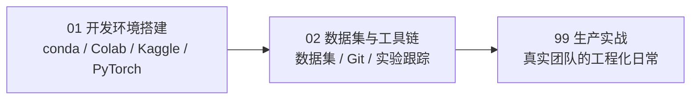

# 第 1 章：环境与工具 🛠️

> 工具箱章。这一章不讲模型，只解决"武器从哪来"：装一套能跑全书代码的环境，认一批练手数据集与趁手工具。**本章按需查阅**——环境装好一次，之后随用随回；不必像读正文页那样从头顺读到尾。

[⬆️ 返回总目录](../../../README.md) · [⬆️ 返回本篇](../README.md)

## 🗺️ 本章知识树

## 🧰 本章怎么用

- **还没装过环境**：按顺序读 01 页，照着命令敲一遍，跑通 `import torch` 就算出师；
- **环境出问题了**：直接跳到 01 页的"常见报错速查表"对症下药；
- **想找数据 / 学 Git**：直接进 02 页，那是一张拿来即用的清单；
- **好奇公司里怎么干活**：读收官页 99，看真实团队的工程化日常。

## 📖 推荐阅读顺序

| 顺序 | 页面 | 难度 | 一句话说明 |
|------|------|------|-----------|
| 1 | [开发环境搭建](./01-开发环境搭建.md) | ⭐ | 三种方案对比 + 一条命令序列从零跑通 `import torch` |
| 2 | [数据集与工具链](./02-数据集与工具链.md) | ⭐ | 练手数据集清单 + Git 最小工作流 + 实验跟踪一句话 |
| 收官 | [生产实战](./99-生产实战.md) | ⭐⭐ | 真实 ML 团队从个人脚本到规范协作的工程化日常 |

> ⚠️ **时效提醒**：环境类内容是全书最容易过时的部分——安装命令、镜像地址、免费算力政策都可能变化。本章命令以写作为准，**实际安装时请以官方文档为准**；两者冲突时，永远信官方。

## 🎯 读完本章你应该能

- 在本地装好一个与其他项目隔离的 Python 环境，并跑通 `import torch`；
- 说清楚本地 conda/venv、Google Colab、Kaggle 三种方案各自的适用场景；
- 知道去哪找练手数据集，并用 Git 完成最小的"改 → 记 → 推"循环；
- 理解团队协作中"锁版本、留记录"为什么是底线（见收官页）。

## 🔗 与其他章节的关系

- **前置章节**：[第 0 章：学前必读](../00-学前必读/README.md)——先会用这套知识库，再回来装装备。
- **后续章节**：[第 2 章：数学基础](../02-数学基础/README.md)——环境装好后顺路带上数学语言包；以及第 4 章的 [PyTorch 快速上手](../../3-深度学习/04-深度学习基础/03-PyTorch快速上手.md)——本章装的 PyTorch 正是为它准备的门票。

---

[⬅️ 上一章：第 0 章：学前必读](../00-学前必读/README.md) · [返回总目录](../../../README.md) · [下一章：第 2 章：数学基础 ➡️](../02-数学基础/README.md)
