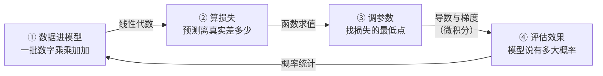

# 为什么要学数学

> **一句话理解**：AI 里的一切数学，拆开看都是带符号的加减乘除——学数学不是为了当数学家，而是为了**看到符号不慌、知道每一步在算什么**。

[⬆️ 返回总目录](../../../README.md) · [⬆️ 返回本篇](../README.md) · [⬅️ 返回本章目录](./README.md)

| 属性 | 说明 |
|------|------|
| 难度 | ⭐（入门） |
| 所属分支 | 通用基础 |
| 前置知识 | 无 |

---

## 📌 这一节解决什么问题

很多人学 AI 的开场都是这样的：兴冲冲点开一篇教程，第一屏挤满了求和号、下标和希腊字母，于是默默关掉页面。这一幕反复发生，根源不是数学难，而是**没人说清楚：AI 到底用多少数学、用在哪一步、要学到什么程度**。

于是走出了两种极端。一种人被符号劝退，从此只会复制代码：模型报错 `shapes (2, 3) and (2, 3) not aligned`，盯着屏幕干瞪眼，因为不知道"形状"说的是矩阵的行数和列数；调参全靠玄学，学习率（Learning Rate）抄来的 0.001 换个数据就失灵。另一种人立志"先补完数学再学 AI"，在高数课本第三章卡了半年，一次模型都没训练过——热情先耗尽了。

这一节换一种学法：把**一次完整的模型训练**当导游路线走一圈，看每个环节用了什么数学、它在那里干了什么活。读完你会发现，每个符号背后都是一件你早就熟悉的小事。

## 🌱 通俗理解

把训练模型想象成**学做一道没吃过的菜**：

- 做出来一版，先尝一口，判断"离好吃差多少"——这就是**算损失**；
- 尝完知道"咸了"，于是下次盐少放一点——"往哪个方向调、调多少"，这就是**算梯度、更新参数**；
- 再做、再尝、再调，循环往复，直到尝不出毛病——这就是**训练循环**。

整个过程你没写任何公式，但每一步都对应一个数学概念。数学公式只是把"尝一口、调一点"这件事**写得又短又准**的记号——就像菜谱写"盐 3 克"，而不是写"放一点点盐"。

所以先安抚一下最常见的劝退点：

> **你不需要会手算复杂积分，也不需要证明任何定理。**
> 你需要的是"看到符号不慌"——认得出它、知道它在算什么。就像你不需要会写法文菜单，只需要知道哪道菜是牛排。

## 📋 举个例子

一个大模型里有几百万个参数，训练时**每一个参数都在反复做下面这一行算术**。假设模型只有一个参数 $w$，现在 $w=2$；我们已经算出损失函数在这一点"往上的坡度"是 3（坡度怎么算，是下一节的事）；学习率（步长）取 0.1。那么一次参数更新就是：

$$
w \leftarrow 2 - 0.1 \times 3 = 2 - 0.3 = 1.7
$$

> 👉 **人话**：参数现在是 2；坡度说"往大会更差，灵敏程度是 3"；于是朝反方向挪坡度的一成（0.1 是步长），得到新参数 1.7。

逐个零件拆开看：

- `2`：参数现在的值（出发位置）；
- `3`：坡度——朝"更差"方向的陡峭程度（导游图上的箭头）；
- `0.1`：学习率——不敢迈大步，只走坡度的一成；
- `1.7`：新参数——朝"更好"的方向挪了一点。

全程用到的数学：**一次乘法、一次减法**。这就是"数学只是带符号的算术"的含义——大模型的训练，是把这一行算术并行做几百万遍、重复几千轮。

## 🧠 核心原理

### 整体流程

一次模型训练的旅程，每一站对应一门数学：



### 逐步拆解

**第 ① 步：数据进模型——矩阵运算（线性代数）**。一条数据在计算机里是一排数字（向量），一批数据是一张数字表（矩阵）；模型对它们做的核心动作是"乘权重、加起来"：

$$
\hat{y} = Xw + b
$$

> 👉 **人话**：每个输入乘上自己的权重，再加一个偏移，得到预测——本质是批量乘加，下一页细讲。

**第 ② 步：算损失——函数值**。预测得准不准，用一个数打分：

$$
L = \frac{1}{N}\sum_{i=1}^{N}(\hat{y}_i - y_i)^2
$$

> 👉 **人话**：每个样本"预测减真实"（差多少），平方去掉负号，全部加起来除以样本数——那个吓人的 Σ 就是一个 for 循环。

**第 ③ 步：调参数——导数与梯度（微积分）**。知道差多少还不够，还要知道每个参数**往哪调、调多少**：这就是梯度（Gradient）——损失函数在当前点的坡度，然后按上面 1.7 那一行更新。

**第 ④ 步：评估——概率统计**。模型输出的不是"是猫"三个字，而是"是猫的概率 0.93"；这个 0.93 可不可信、换一批数据会不会掉，都是统计问题。

<details>
<summary>🧮 展开看：AI 高频符号"解压表"（先混个脸熟）</summary>

| 符号 | 读法 | 解压后的意思 |
|------|------|--------------|
| $\sum_{i=1}^{N}$ | sigma，求和 | 一个 for 循环：把第 1 个到第 N 个加起来 |
| $\partial$ | round d，偏导 | "只拧这一个旋钮"时的影响，Delta 的多变量版 |
| $\nabla$ | nabla，梯度 | 把所有旋钮的影响打包成一支箭（向量） |
| $\leftarrow$ | 赋值 | 用右边的值更新左边（代码里的 `=`） |
| $\arg\min$ | 取最小值的参数 | "谁最小就选谁"，选的是参数，不是最小值本身 |
| $\log$ | 对数 | 把连乘变连加、把很小的概率变成好处理的负数 |

</details>

<details>
<summary>🧮 展开看：三个最容易劝退的符号，逐个拆</summary>

- **∂（偏导）**：音响有低音、高音、音量三个旋钮。$\partial L / \partial w$ 读作"只拧 $w$ 这一个旋钮、其他定住，$L$ 变多少"——就是"这一个旋钮各自的影响"。
- **∇（梯度）**：把所有旋钮各自的影响排成一排，打包成一个向量（Vector）——它指向"变陡最快"的方向，训练时朝反方向走。
- **∫（积分）**：连续版的 Σ，概率里常用来算"一段区间的总面积"。本库后续几乎不需要你手算它，认得即可。

</details>

## 💻 动手试试

```python
import numpy as np

# 3 套房子：面积（缩小 50 倍方便看数）→ 房价；真实规律是「面积 × 5」
X = np.array([1.0, 1.6, 2.0])    # 输入：面积
y = np.array([5.0, 7.8, 10.0])   # 真实：房价
w, lr = 4.0, 0.1                 # 参数从瞎猜的 4.0 出发；步长 0.1

for step in range(3):
    pred = X * w                        # ① 数据进模型：向量乘加（线性代数）
    loss = np.mean((pred - y) ** 2)     # ② 算损失：函数值（差的平方取平均）
    grad = np.mean(2 * (pred - y) * X)  # ③ 算梯度：损失对 w 的坡度（微积分）
    w = w - lr * grad                   # ④ 调参数：朝坡度反方向走一步
    print(f"第 {step + 1} 轮：loss = {loss:.2f}，w = {w:.3f}")

# 预期输出（loss 一路下降，w 一步步爬向真实值 5）：
# 第 1 轮：loss = 2.32，w = 4.483
# 第 2 轮：loss = 0.58，w = 4.722
# 第 3 轮：loss = 0.15，w = 4.841
```

数一数：①②③④各占一行，其余都是装修——这 10 行代码就是一次完整的训练，三门数学各站了一站。

## 🔥 炼丹小灶

> 🔥 **炼丹小灶**：读任何公式的"三问法"——
> - 配方：输入是什么？输出是什么？每个符号对应代码里哪个变量？三问答完，公式就变成了代码。
> - 玄学：把公式抄在纸上，手动代入一组很小的数字算一遍——八成的"看不懂"会当场痊愈。
> - ⚠️ 以上是经验参考，不是圣旨。

## 🖱️ 动手玩

> 🕹️ **延伸玩一玩**：[TensorFlow Playground](https://playground.tensorflow.org)——点一下播放键，亲眼看一次完整训练：数据点被曲线逐渐分开、loss 曲线一路下坡、每个神经元的影响在实时变化。本页的旅程图，在这里具象化。

## 🔗 在知识树中的位置

- **上游**：[学前必读](../00-学前必读/README.md)——知道这套库怎么读；[第 1 章：环境与工具](../01-环境与工具/README.md)——能跑起本页代码
- **下游**：[线性代数](./02-线性代数.md)、[微积分与梯度](./03-微积分与梯度.md)、[概率与统计](./04-概率与统计.md)——本页是三者的共同入口
- **横向对比**：本章收官的[生产实战](./99-生产实战.md)会回答另一个问题——工作以后，这些数学各用多少

## ⚠️ 常见误区

- **误区一**："要先补完高中加大学数学，才能开始学 AI" → 方向反了：带着模型里遇到的问题回头查数学，效率最高；本页 15 行代码里，三门数学已经全部登场。
- **误区二**："只会调包就不用学数学" → 报错信息、文档、调参界面全是数学语言；一句 `shape not aligned` 看不懂，就会寸步难行。
- **误区三**："数学好的人才学得动 AI" → AI 日常用到的数学只到"知道 + 会用"这两层，和数学竞赛是两个世界。

## 📝 小结与自测

**要点回顾**

- 训练一个模型的四步：数据进模型（线性代数）→ 算损失（函数值）→ 调参数（导数与梯度）→ 评估（概率统计）；
- 一行梯度更新 `w ← w − 0.1×3 = 1.7`，拆开只是乘法和减法；
- 目标不是会手算复杂积分，而是"看到符号不慌"——认得它、知道它在算什么。

**自测一下**（点击展开答案）

<details>
<summary>问题 1：训练一个模型的四个环节，分别对应哪门数学？</summary>

① 数据进模型 → 矩阵运算（线性代数）；② 算损失 → 函数求值；③ 调参数 → 导数与梯度（微积分）；④ 评估效果 → 概率统计。

</details>

<details>
<summary>问题 2：参数 w=2、当前坡度是 3、学习率 0.1，更新后 w 是多少？每个数各是什么角色？</summary>

$w \leftarrow 2 - 0.1 \times 3 = 1.7$。2 是参数现值，3 是坡度（朝"更差"方向的灵敏程度），0.1 是步长，1.7 是新参数。

</details>

<details>
<summary>问题 3：公式里的 Σ，用你熟悉的编程概念打个比方是什么？</summary>

一个 for 循环：从第 1 项累加到第 N 项，别无其他。

</details>

## 📚 延伸阅读

- 视频系列：3Blue1Brown《线性代数的本质》《微积分的本质》（B 站 / YouTube 均可搜到）
- 免费在线书：Mathematics for Machine Learning（mml-book.github.io）
- 课程：Khan Academy 的统计与概率入门（支持中文站）

---

[⬅️ 上一页：本章目录](./README.md) · [返回本章目录](./README.md) · [下一页：线性代数 ➡️](./02-线性代数.md)
