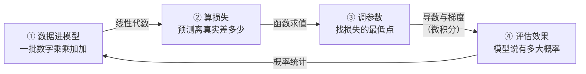
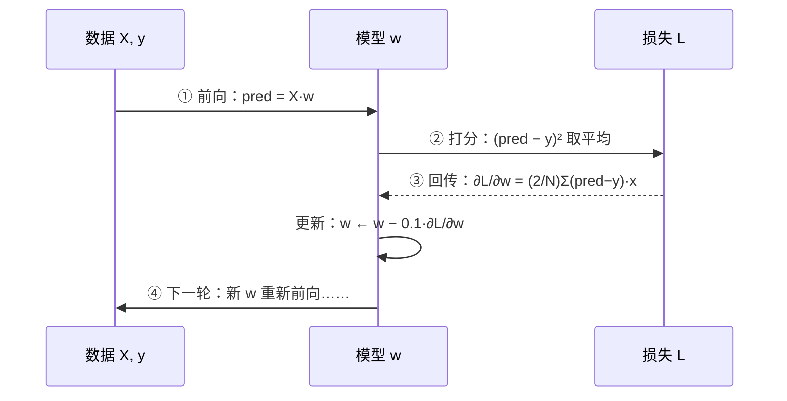
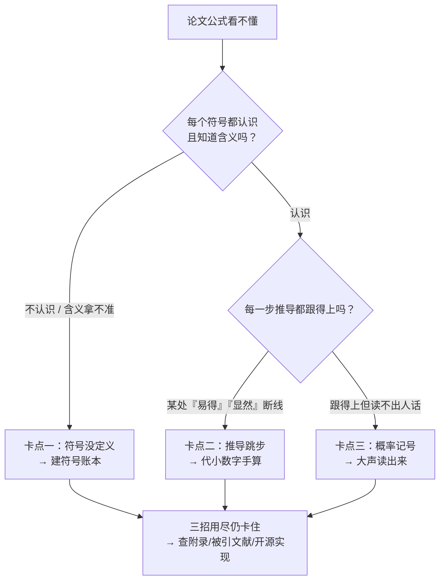

# 为什么要学数学

> **一句话理解**：AI 里的一切数学，拆开看都是带符号的加减乘除——学数学不是为了当数学家，而是为了**看到符号不慌、知道每一步在算什么**。

[⬆️ 返回总目录](../../../README.md) · [⬆️ 返回本篇](../README.md) · [⬅️ 返回本章目录](./README.md)

| 属性 | 说明 |
|------|------|
| 难度 | ⭐（入门） |
| 所属分支 | 通用基础 |
| 前置知识 | 无 |

---

## 📌 这一节解决什么问题

很多人学 AI 的开场都是这样的：兴冲冲点开一篇教程，第一屏挤满了求和号、下标和希腊字母，于是默默关掉页面。这一幕反复发生，根源不是数学难，而是**没人说清楚：AI 到底用多少数学、用在哪一步、要学到什么程度**。

于是走出了两种极端。一种人被符号劝退，从此只会复制代码：模型报错 `shapes (2, 3) and (2, 3) not aligned`，盯着屏幕干瞪眼，因为不知道"形状"说的是矩阵的行数和列数；调参全靠玄学，学习率（Learning Rate）抄来的 0.001 换个数据就失灵。另一种人立志"先补完数学再学 AI"，在高数课本第三章卡了半年，一次模型都没训练过——热情先耗尽了。

这一节换一种学法：把**一次完整的模型训练**当导游路线走一圈，看每个环节用了什么数学、它在那里干了什么活——而且每一站都给出**真实的公式片段和真实数字**，让你亲眼看到"训练"拆开之后到底在算什么。读完你会发现，每个符号背后都是一件你早就熟悉的小事。

## 🌱 通俗理解

把训练模型想象成**学做一道没吃过的菜**：

- 做出来一版，先尝一口，判断"离好吃差多少"——这就是**算损失**；
- 尝完知道"咸了"，于是下次盐少放一点——"往哪个方向调、调多少"，这就是**算梯度、更新参数**；
- 再做、再尝、再调，循环往复，直到尝不出毛病——这就是**训练循环**。

整个过程你没写任何公式，但每一步都对应一个数学概念。数学公式只是把"尝一口、调一点"这件事**写得又短又准**的记号——就像菜谱写"盐 3 克"，而不是写"放一点点盐"。

所以先安抚一下最常见的劝退点：

> **你不需要会手算复杂积分，也不需要证明任何定理。**
> 你需要的是"看到符号不慌"——认得出它、知道它在算什么。就像你不需要会写法文菜单，只需要知道哪道菜是牛排。

## 📋 举个例子

一个大模型里有几百万个参数，训练时**每一个参数都在反复做下面这一行算术**。假设模型只有一个参数 $w$，现在 $w=2$；我们已经算出损失函数在这一点"往上的坡度"是 3（坡度怎么算，是下一节的事）；学习率（步长）取 0.1。那么一次参数更新就是：

$$
w \leftarrow 2 - 0.1 \times 3 = 2 - 0.3 = 1.7
$$

> 👉 **人话**：参数现在是 2；坡度说"往大会更差，灵敏程度是 3"；于是朝反方向挪坡度的一成（0.1 是步长），得到新参数 1.7。

逐个零件拆开看：

- `2`：参数现在的值（出发位置）；
- `3`：坡度——朝"更差"方向的陡峭程度（导游图上的箭头）；
- `0.1`：学习率——不敢迈大步，只走坡度的一成；
- `1.7`：新参数——朝"更好"的方向挪了一点。

全程用到的数学：**一次乘法、一次减法**。这就是"数学只是带符号的算术"的含义——大模型的训练，是把这一行算术并行做几百万遍、重复几千轮。

同一行公式，换个数字立刻能看见两种"病情"（完整数值现场在[微积分与梯度](./03-微积分与梯度.md)整表展开）：

- **极端情况**：步长改成 3 → $w \leftarrow 2 - 3\times3 = -7$，一步跨过头弹到对面更陡的坡上，下一步坡度变成 $-14$，再走 $w \leftarrow -7 + 3\times14 = 35$——越走越远；
- **失败情况**：把 3 套房子的面积写成 $(3,1)$ 的表格去乘 $(3,)$ 的一排权重，numpy 当场报 `shapes (3,1) and (3,) not aligned`——齿轮没咬合上。看不懂这句话，就只能重启碰运气。

<details>
<summary>📊 展开失败现场：步长过大的三步复利表 + 形状报错的读法</summary>

**翻车一（步长过大，极端情况）**：还是 $w=2$、坡度公式 $2w$，但学习率取 3：

| 步数 | 当前 w | 坡度 2w | 新 w | loss = w² |
|------|--------|---------|------|-----------|
| 0 | 2.0 | 4.0 | — | 4.0 |
| 1 | 2.0 | 4.0 | −10.0 | 100.0 |
| 2 | −10.0 | −20.0 | 50.0 | 2500.0 |
| 3 | 50.0 | 100.0 | −250.0 | 62500.0 |

每步 $w$ 乘上 $1-2\times3=-5$：三步从 4 涨到 62500——真实训练里"loss 飞天变 NaN"的最小复现（完整病理在[微积分与梯度](./03-微积分与梯度.md)）。

**翻车二（形状不咬合，失败情况）**：跑 `np.array([[1.0],[1.6],[2.0]]) * np.array([4.0, 4.0])`，报 `shapes (3,1) and (2,) not aligned`。读法分两步：先看形状——左边是 3 行 1 列的表，右边是 2 个数的一排；再按"内圈相等"规则找错——右边本该是 1 个数（每行乘同一个权重）或转置成 (1,3) 对 (3,)。**报错信息是一句数学陈述，读得懂它，重启就不再是唯一手段。**

</details>

## 🧠 核心原理

### 整体流程

一次模型训练的旅程，每一站对应一门数学：



### 逐步拆解

**第 ① 步：数据进模型——矩阵运算（线性代数）**。一条数据在计算机里是一排数字（向量），一批数据是一张数字表（矩阵）；模型对它们做的核心动作是"乘权重、加起来"：

$$
\hat{y} = Xw + b
$$

> 👉 **人话**：每个输入乘上自己的权重，再加一个偏移，得到预测——本质是批量乘加。$X$ 是 $N\times d$ 的表（$N$ 条样本、每条 $d$ 个特征），$w$ 是 $d\times1$ 的一排权重，内圈 $d$ 对 $d$ 咬合成功，出来 $N\times1$ 的一排预测。

**第 ② 步：算损失——函数值**。预测得准不准，用一个数打分：

$$
L = \frac{1}{N}\sum_{i=1}^{N}(\hat{y}_i - y_i)^2
$$

> 👉 **人话**：每个样本"预测减真实"（差多少），平方去掉负号，全部加起来除以样本数——那个吓人的 Σ 就是一个 for 循环。

而 **backward（反向传播）之后**，损失交出来的不是数，是一条"每个参数各喊多大声"的公式：

$$
\frac{\partial L}{\partial w} = \frac{2}{N}\sum_{i=1}^{N}(\hat{y}_i - y_i)\,x_i
$$

> 👉 **人话**：每个样本的"差多少"乘回它自己的输入，平均后再乘 2——**差得越远的样本、数值越大的特征，喊得越响**。训练听的就是这一片喊声。

**第 ③ 步：调参数——导数与梯度（微积分）**。知道差多少还不够，还要知道每个参数**往哪调、调多少**：这就是梯度（Gradient）——损失函数在当前点的坡度，然后按上面 1.7 那一行更新。梯度的每一维，就是第 ② 步那条公式对对应参数算出的数。

**第 ④ 步：评估——概率统计**。分类模型输出的不是"是猫"三个字，而是"是猫的概率 0.93"。这个数怎么来？模型最后一层先打出原始分数（logits，比如猫 2.0、狗 0.5、其他 −1.0），再过一道**softmax**：

$$
P(\text{猫}) = \frac{e^{2.0}}{e^{2.0}+e^{0.5}+e^{-1.0}} = \frac{7.39}{9.41} \approx 0.79
$$

> 👉 **人话**：三个分数先各自取指数（全变正数、大分的差距进一步拉开），再归一成加起来等于 1 的三份概率：猫 79%、狗 17%、其他 4%。分类器报置信度、语言模型挑下一个词，用的都是这一步。

四步不是并列的展品，而是一条**循环的数字流水线**——同一批数字在四个工位间流转：



<details>
<summary>📊 展开完整算例：同一次训练的第 1 轮，四步的真实数字串起来看</summary>

沿用本页底部代码的数据：3 套房子面积 $X=[1.0,\ 1.6,\ 2.0]$，真实房价 $y=[5.0,\ 7.8,\ 10.0]$，参数从 $w=4.0$ 出发，学习率 0.1。

- **① 前向（乘加）**：$\hat{y} = X\times w = [4.0,\ 6.4,\ 8.0]$
- **② 损失（减、方、平均）**：差 $= [-1.0,\ -1.4,\ -2.0]$；平方 $= [1.00,\ 1.96,\ 4.00]$；平均 $L = 6.96/3 = 2.32$
- **③ 梯度（backward 公式代入）**：

$$
\frac{\partial L}{\partial w} = \frac{2}{3}\times(-1.0\times1.0 \;-\; 1.4\times1.6 \;-\; 2.0\times2.0) = \frac{2}{3}\times(-7.24) \approx -4.83
$$

  更新：$w \leftarrow 4 - 0.1\times(-4.83) = 4.483$（面积被低估 → 坡度为负 → 参数调大，方向正确）

- **④ 评估（指数归一）**：新模型在一条测试数据上打出 logits $[2.0,\ 0.5,\ -1.0]$ → softmax → $[0.79,\ 0.17,\ 0.04]$

四步的算术清单：**乘加 → 减方平均 → 差乘输入再平均 → 指数归一**。没有一个操作超出小学算术加一个 $e^x$。你跑一遍本页底部代码打印的 `loss = 2.32, w = 4.483`，和这里手算的逐位一致。

</details>

<details>
<summary>🧮 展开看：AI 高频符号"解压表"（先混个脸熟）</summary>

| 符号 | 读法 | 解压后的意思 |
|------|------|--------------|
| $\sum_{i=1}^{N}$ | sigma，求和 | 一个 for 循环：把第 1 个到第 N 个加起来 |
| $\partial$ | round d，偏导 | "只拧这一个旋钮"时的影响，Delta 的多变量版 |
| $\nabla$ | nabla，梯度 | 把所有旋钮的影响打包成一支箭（向量） |
| $\leftarrow$ | 赋值 | 用右边的值更新左边（代码里的 `=`） |
| $\arg\min$ | 取最小值的参数 | "谁最小就选谁"，选的是参数，不是最小值本身 |
| $\log$ | 对数 | 把连乘变连加、把很小的概率变成好处理的负数 |

</details>

<details>
<summary>🧮 展开看：三个最容易劝退的符号，逐个拆</summary>

- **∂（偏导）**：音响有低音、高音、音量三个旋钮。$\partial L / \partial w$ 读作"只拧 $w$ 这一个旋钮、其他定住，$L$ 变多少"——就是"这一个旋钮各自的影响"。
- **∇（梯度）**：把所有旋钮各自的影响排成一排，打包成一个向量（Vector）——它指向"变陡最快"的方向，训练时朝反方向走。
- **∫（积分）**：连续版的 Σ，概率里常用来算"一段区间的总面积"。本库后续几乎不需要你手算它，认得即可。

</details>

## 💻 动手试试

```python
import numpy as np

# 3 套房子：面积（缩小 50 倍方便看数）→ 房价；真实规律是「面积 × 5」
X = np.array([1.0, 1.6, 2.0])    # 输入：面积
y = np.array([5.0, 7.8, 10.0])   # 真实：房价
w, lr = 4.0, 0.1                 # 参数从瞎猜的 4.0 出发；步长 0.1

for step in range(3):
    pred = X * w                        # ① 数据进模型：向量乘加（线性代数）
    loss = np.mean((pred - y) ** 2)     # ② 算损失：函数值（差的平方取平均）
    grad = np.mean(2 * (pred - y) * X)  # ③ 算梯度：损失对 w 的坡度（微积分）
    print(f"  pred={pred}, diff={pred - y}")   # 打中间变量：预测与差值
    w = w - lr * grad                   # ④ 调参数：朝坡度反方向走一步
    print(f"第 {step + 1} 轮：loss = {loss:.2f}，grad = {grad:.2f}，w = {w:.3f}")

# 预期输出（loss 一路下降，w 一步步爬向真实值 5）：
#   pred=[4. 6.4 8.], diff=[-1. -1.4 -2.]
#   第 1 轮：loss = 2.32，grad = -4.83，w = 4.483
#   第 2 轮：loss = 0.58，w = 4.722
#   第 3 轮：loss = 0.15，w = 4.841
```

数一数：①②③④各占一行，其余都是装修——这 10 行代码就是一次完整的训练，三门数学各站了一站。

**改什么、看什么**（每改一处，对照上面的"病情清单"）：

- 把 `lr` 改成 `0.01`：loss 下降明显变慢——龟速下山；
- 把 `lr` 改成 `1.0`：loss 先降后升、来回震荡——步子太大跨过谷底；
- 把 `w = 4.0` 改成 `w = 6.0`：梯度变成正数、参数自动往下调——从另一侧坡照样能下山，这就是"坡度指哪、参数打哪"。

## 🔥 炼丹小灶

> 🔥 **炼丹小灶**：读任何公式的"三问法"——
> - 配方：输入是什么？输出是什么？每个符号对应代码里哪个变量？三问答完，公式就变成了代码。
> - 玄学：把公式抄在纸上，手动代入一组很小的数字算一遍——八成的"看不懂"会当场痊愈。
> - ⚠️ 以上是经验参考，不是圣旨。

## 🧱 看不懂论文数学的三种卡点与对策

代码能跑、教程能看，一读论文就卡——几乎都卡在下面三个地方。先诊断卡在哪一种，再对症下药，比硬啃快三倍：



<details>
<summary>卡点一：符号没定义（最高频，八成"假难"）</summary>

**现场**：GAN 的目标函数长这样——$\min_G \max_D\; E_{x\sim p_{data}}[\log D(x)] + E_{z\sim p_z}[\log(1-D(G(z)))]$。$E$、$\sim$、$D(\cdot)$、$G(\cdot)$ 没有一个当面自我介绍过，于是整行像乱码。

**对策：建一张"符号账本"**，四列——符号 / 含义 / 取值形状 / 对应代码里的哪个变量。读论文先翻 notation 段落和图注，边读边记账；查不到含义的，先按最合理的方式猜一个并打上问号，读完全文回头验证（多数时候上下文会替你确认）。上面那行 GAN 公式，账本记到第三行就开始降伏了：

| 符号 | 含义 | 取值形状 | 对应代码变量 |
|------|------|----------|--------------|
| $x\sim p_{data}$ | 从真实数据抽的样本 | 一张图 / 一批图 | `real_batch` |
| $z\sim p_z$ | 从噪声分布抽的向量 | 一维随机向量 | `noise` |
| $D(\cdot)$ | 判别器：输入样本，输出"是真实图的概率" | 图 → [0,1] | `discriminator(x)` |
| $G(\cdot)$ | 生成器：输入噪声，输出假图 | 噪声 → 图 | `generator(z)` |
| $E_{x\sim p}[\cdot]$ | 按分布 p 取平均（期望） | — | `xxx.mean()` |

**常用速查**：$E_{x\sim p}[\cdot]$ = "对 $x$ 按分布 $p$ 抽样后取平均"（期望）；$\sim$ = "服从分布"；$\mid$ = "在……条件下"；分号 $\theta$ = "在参数为 θ 的模型里"；$\arg\max$ = "取让后面最大的那个**参数**"。

经验：账本记到第 20 个符号，你会发现一篇论文真正的新符号通常只有三五个，其余全是老熟人换了字体。

</details>

<details>
<summary>卡点二：推导跳步（"易得""显然""不难看出"）</summary>

**现场**：论文写"易得 $\nabla_w L = 2X^T(Xw-y)/N$"，你盯了十分钟没看出来易在哪。

**对策：代入小数字手算**。取 $N=1$、$x=2$、$w=4$、$y=5$：

- 损失 $L = (xw-y)^2 = (8-5)^2 = 9$；
- 按定义直接求导：$L = (2w-5)^2$，导数 $= 2\times2\times(2w-5)$，代入 $w=4$ 得 $2\times2\times3 = 12$；
- 论文公式给：$2x(xw-y)/1 = 2\times2\times3 = 12$。✅ 对上了，跳步自己补上了。

小数字（一维、一两个样本）能把 90% 的"易得"还原成"确实可得"。补不上的再看附录或被引文献；最后的验算交给 SymPy——符号计算不会累。

</details>

<details>
<summary>卡点三：概率记号连环（竖线、下标、连乘挤一行）</summary>

**现场**：语言模型的目标 $P(w_{1:T}) = \prod_{t=1}^{T} P(w_t \mid w_{<t};\theta)$——竖线、小于号下标、分号、连乘号挤在一行，认识每个字，读不懂整句。

**对策：把公式"读出声"**。逐段翻译：$w_{<t}$ 读"第 t 个词之前的所有词"；$P(w_t\mid w_{<t};\theta)$ 读"在参数 θ 的模型里、看到前文的条件下，下一个词是 $w_t$ 的概率"；$\prod_t$ 读"把每个位置的概率连乘起来"。读出声之后整句人话是：**"语言模型给一句话打分 = 把它对每个词的预测概率连乘"**——这句话本身就是第 7 章语言模型的定义，你刚刚提前读懂了它。

同类高频记号还有：联合 $P(A, B)$ 读"A 和 B 同时发生"；期望下标 $E_{x\sim D}$ 读"在数据分布 D 上取平均"；$\mathcal{N}(\mu, \sigma^2)$ 读"均值为 μ、方差为 σ² 的正态分布"。

</details>

## 🖱️ 动手玩

> 🕹️ **延伸玩一玩**：[TensorFlow Playground](https://playground.tensorflow.org)——点一下播放键，亲眼看一次完整训练：数据点被曲线逐渐分开、loss 曲线一路下坡、每个神经元的影响在实时变化。本页的旅程图，在这里具象化。

## 🔗 在知识树中的位置

- **上游**：[学前必读](../00-学前必读/README.md)——知道这套库怎么读；[第 1 章：环境与工具](../01-环境与工具/README.md)——能跑起本页代码
- **下游**：[线性代数](./02-线性代数.md)、[微积分与梯度](./03-微积分与梯度.md)、[概率与统计](./04-概率与统计.md)——本页是三者的共同入口
- **横向对比**：本章收官的[生产实战](./99-生产实战.md)会回答另一个问题——工作以后，这些数学各用多少；其中的"读公式操作流程"是本页三种卡点的工程版

## ⚠️ 常见误区

- **误区一**："要先补完高中加大学数学，才能开始学 AI" → 方向反了：带着模型里遇到的问题回头查数学，效率最高；本页 15 行代码里，三门数学已经全部登场。
- **误区二**："只会调包就不用学数学" → 报错信息、文档、调参界面全是数学语言；一句 `shape not aligned` 看不懂，就会寸步难行。
- **误区三**："数学好的人才学得动 AI" → AI 日常用到的数学只到"知道 + 会用"这两层，和数学竞赛是两个世界。
- **误区四**："读不懂论文是因为数学不够" → 多数时候是三种卡点之一（符号没定义 / 推导跳步 / 概率记号），对症处理比回头啃教材快得多。

## 📝 小结与自测

**要点回顾**

- 训练一个模型的四步：数据进模型（线性代数）→ 算损失（函数值）→ 调参数（导数与梯度）→ 评估（概率统计）；
- 每一站都有真实公式：前向 $Xw$、损失 $\frac{1}{N}\sum(\hat{y}-y)^2$、backward 后梯度 $\frac{2}{N}\sum(\hat{y}-y)x$、评估 softmax——拆开全是加减乘除；
- 一行梯度更新 `w ← w − 0.1×3 = 1.7`，拆开只是乘法和减法；步长过大它会越走越远，形状不匹配它会当场报错；
- 读论文卡住先分诊：符号没定义 → 建账本；推导跳步 → 代小数字；概率记号 → 读出声。

**自测一下**（点击展开答案）

<details>
<summary>问题 1：训练一个模型的四个环节，分别对应哪门数学？</summary>

① 数据进模型 → 矩阵运算（线性代数）；② 算损失 → 函数求值；③ 调参数 → 导数与梯度（微积分）；④ 评估效果 → 概率统计。

</details>

<details>
<summary>问题 2：参数 w=2、当前坡度是 3、学习率 0.1，更新后 w 是多少？每个数各是什么角色？</summary>

$w \leftarrow 2 - 0.1 \times 3 = 1.7$。2 是参数现值，3 是坡度（朝"更差"方向的灵敏程度），0.1 是步长，1.7 是新参数。

</details>

<details>
<summary>问题 3：公式里的 Σ，用你熟悉的编程概念打个比方是什么？</summary>

一个 for 循环：从第 1 项累加到第 N 项，别无其他。

</details>

<details>
<summary>问题 4：损失 $L=\frac{1}{N}\sum(\hat{y}_i-y_i)^2$ 反向传播后，对 $w$ 的梯度长什么样？它最像代码里的哪一行？</summary>

$\frac{\partial L}{\partial w} = \frac{2}{N}\sum(\hat{y}_i - y_i)\,x_i$：每个样本的误差乘回自己的输入再平均。对应代码里的 `grad = np.mean(2 * (pred - y) * X)`——误差大的样本、数值大的特征，对梯度的贡献大。

</details>

## 📚 延伸阅读

- 视频系列：3Blue1Brown《线性代数的本质》《微积分的本质》（B 站 / YouTube 均可搜到）
- 免费在线书：Mathematics for Machine Learning（mml-book.github.io）
- 课程：Khan Academy 的统计与概率入门（支持中文站）

---

[⬅️ 上一页：本章目录](./README.md) · [返回本章目录](./README.md) · [下一页：线性代数 ➡️](./02-线性代数.md)
