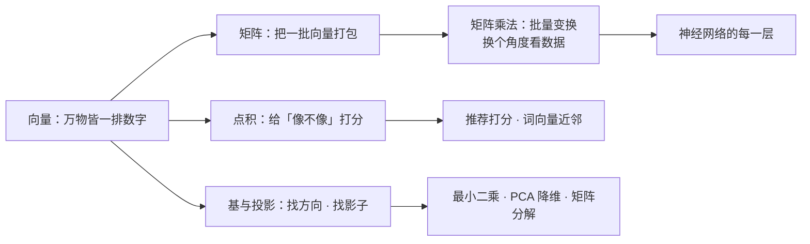
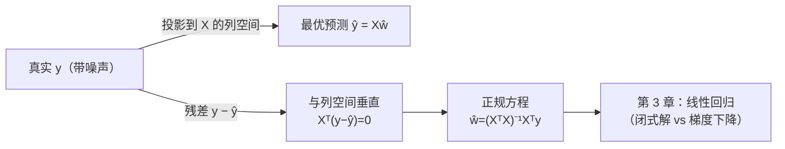
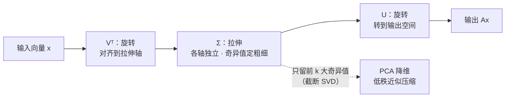

# 线性代数

> **一句话理解**：线性代数（Linear Algebra）研究**向量**（一排数字）和**矩阵**（数字表格）怎么运算、怎么变换——在 AI 世界里万物皆向量，模型的每一次"思考"，本质上都是一串矩阵乘法。

[⬆️ 返回总目录](../../../README.md) · [⬆️ 返回本篇](../README.md) · [⬅️ 返回本章目录](./README.md)

| 属性 | 说明 |
|------|------|
| 难度 | ⭐⭐（进阶） |
| 所属分支 | 通用基础 |
| 前置知识 | [为什么要学数学](./01-为什么要学数学.md) |

---

## 📌 这一节解决什么问题

计算机不认识猫的照片，也不认识"我爱看科幻片"这句话。想让机器处理它们，第一步都是**变成数字**：一张图变成一长排像素值，一个用户变成"年龄、消费、点击历史"的一排数，一个词变成几百个维度的一排数。

变成数字之后，四个问题立刻摆在面前：

1. **怎么比较两排数字？**——哪个商品和这个用户的口味最像？哪两个词意思接近？
2. **怎么一次处理几百万排数字？**——总不能一条条写 for 循环。
3. **怎么知道数字排得对不对？**——行数列数不匹配，代码当场报错。
4. **怎么在几百万维的空间里找"主干方向"、去掉冗余？**——不是每个维度都值得保留，特征之间还可能互相重复。

线性代数就是这四个问题的标准答案：**点积（Dot Product）**管比较，**矩阵（Matrix）**管批量，**形状（Shape）**管对错，**基、投影与分解（SVD）**管方向与冗余。神经网络的每一层、推荐系统的每一次召回、词向量的每一次近邻查找，都在反复使用这四件工具。

## 🌱 通俗理解

- **向量：一排数字，也是一支箭。** 想象一张体检报告单：[身高 175, 体重 68, 血压 110]——这就是一个三维向量（Vector）。换个角度看，它也是空间里的一支箭：有方向（偏向哪）、有长度（数值多大）。"国王"这个词在计算机里同样是一排数（比如 300 个数），方向编码了它的含义——这是后面词向量的伏笔。
- **点积：口味匹配打分器。** 你给三种口味的打分是 [火锅 5, 烧烤 1, 沙拉 0]，朋友 A 是 [4, 2, 1]，朋友 B 是 [0, 5, 5]。逐项相乘再相加，得分高的就是"口味方向一致"的人。**方向越一致，得分越高**——推荐系统给商品打分的核心动作就是它。
- **矩阵：一台数字机器。** 一排数字进去，一排新数字出来；同一台机器还能一次处理一整车皮的数据（批量）。神经网络的一层就是一台这样的机器：进去 784 个像素值，出来 128 个特征。
- **形状：插头与插座。** 2×3 的插头（2 行 3 列）要插进 3×2 的插座才咬合得上——**中间那个数必须相等**，否则就报 `not aligned`。深度学习报错的九成来源，就是齿轮没咬合上。
- **基（Basis）：调色的三原色。** 任何颜色都能用红绿蓝三原色调出来——三原色就是颜色空间的"基"。同理，任何向量都能写成几个基向量的加权组合；**基就是这套空间里的"基本配方"，坐标就是配比表**。
- **投影（Projection）：影子。** 阳光下旗杆在地面留一道影子——影子是旗杆"最接近的地面点"。数据拟合的本质就是投影：真实答案没法完美表达时，找它在"模型能表达的范围"里的影子。

## 📋 举个例子

**手算一次点积（相似度打分）**。三款商品最近三天的销量：

| 商品 | 周一 | 周二 | 周三 |
|------|------|------|------|
| A（辣条） | 5 | 1 | 0 |
| B（薯片） | 4 | 2 | 1 |
| C（沙拉） | 0 | 5 | 5 |

商品 A 和 B 的点积，逐项相乘再相加：

$$
[5,1,0]\cdot[4,2,1] = 5\times4 + 1\times2 + 0\times1 = 20+2+0 = 22
$$

> 👉 **人话**：A、B 都是周一大卖、越到周末越冷清——"卖法"方向一致，所以得 22 分。

再算 A 和 C：$[5,1,0]\cdot[0,5,5] = 0+5+0 = 5$。一个赶在周初卖、一个周末才好卖，方向不合拍，只有 5 分。**点积把"像不像"变成了一个可以排序的数字**——推荐系统给候选商品打分、搜索引擎给网页排序，底层都是大规模点积。

**再来一次形状检查**：一个 2×3 矩阵乘一个 3×2 矩阵，内圈 3 对 3，齿轮咬合成功，结果形状是 2×2。

**手算一次投影（本节第二个算例）**。把箭 $\mathbf{b}=[3,4]$ 投到方向 $\mathbf{a}=[1,1]$ 上：

$$
\mathrm{proj}_{\mathbf{a}}\mathbf{b} = \frac{\mathbf{b}\cdot\mathbf{a}}{\mathbf{a}\cdot\mathbf{a}}\,\mathbf{a} = \frac{3+4}{1+1}\,[1,1] = 3.5\times[1,1] = [3.5,\ 3.5]
$$

> 👉 **人话**：先算 b 在 a 方向上"有多少分量"（内积 7 除以 a 的长度平方 2，得 3.5），再按 a 的方向放出这么多——影子是 [3.5, 3.5]。残差 $\mathbf{b}-\text{影子} = [-0.5, 0.5]$，它与 a 的内积 $= -0.5+0.5 = 0$：**残差恰好与投影方向垂直**。这不是巧合，是投影的定义性性质，下面"最小二乘"全靠它。

<details>
<summary>📊 展开完整算例：把矩阵乘法一格一格算出来</summary>

$$
\begin{bmatrix} 1 & 2 & 3 \\ 4 & 5 & 6 \end{bmatrix}_{2\times3}
\begin{bmatrix} 7 & 8 \\ 9 & 10 \\ 11 & 12 \end{bmatrix}_{3\times2}
=
\begin{bmatrix} 58 & 64 \\ 139 & 154 \end{bmatrix}_{2\times2}
$$

- 第 (1,1) 格 = 左第 1 行点积右第 1 列 = 1×7 + 2×9 + 3×11 = 7+18+33 = **58**
- 第 (1,2) 格 = 左第 1 行点积右第 2 列 = 1×8 + 2×10 + 3×12 = 8+20+36 = **64**
- 第 (2,1) 格 = 左第 2 行点积右第 1 列 = 4×7 + 5×9 + 6×11 = 28+45+66 = **139**
- 第 (2,2) 格 = 左第 2 行点积右第 2 列 = 4×8 + 5×10 + 6×12 = 32+50+72 = **154**

形状检查：左 (2×3)、右 (3×2)，内圈 3 = 3，咬合成功；结果取外圈，得 (2×2)。

反例：若右边也是 (2×3)，内圈 3 ≠ 2，齿轮咬合失败——numpy 会报 `shapes (2,3) and (2,3) not aligned`。

</details>

## 🧠 核心原理

### 整体流程



### 逐步拆解

**① 向量与点积：给"像不像"打分**

$$
\mathbf{a}\cdot\mathbf{b} = \sum_{i=1}^{n} a_i\, b_i
$$

> 👉 **人话**：两排数字对齐相乘、再全部相加，得到一个数——"方向合拍程度"的分数。

方向一致得高分，方向相反得负分，互相垂直得 0。但点积受"箭的长度"影响（销量大的商品跟谁点积都高），只想比方向时要先做归一化（Normalization）——各除以自己的长度：

$$
\cos\theta = \frac{\mathbf{a}\cdot\mathbf{b}}{\lVert\mathbf{a}\rVert\,\lVert\mathbf{b}\rVert}
$$

> 👉 **人话**：先把两支箭都削成单位长度再打分，只比方向、不比手长——这就是余弦相似度（Cosine Similarity），推荐系统和词向量检索的标配。

**成立条件与失效边界**：点积要求两向量同维（内圈咬合）；量纲不一致时（一个特征是年龄、一个是收入），数值大的特征会主导分数——先标准化，见本节第 ⑨ 段。

**② 矩阵乘法：批量变换，也是换坐标系**

$$
\mathbf{y} = W\mathbf{x}
$$

> 👉 **人话**：一排数字进机器、一排新数字出来；$W$ 就是这台机器的内部结构。神经网络的一层 = "乘个矩阵、加个偏置、过一个激活函数"。

为什么说是"换坐标系"？矩阵可以把数据旋转、拉伸、投影——同一份数据换个角度描述，有些特征就显形了（图片里的"边缘"、用户身上的"消费力"）。矩阵连乘 = 变换叠加，这正是神经网络"层层提炼特征"的数学本质。

同一个 $MN$，其实有**三种视角**，各有各的用处（注意力机制用的就是第三种）：

- **行视角**：结果的第 $i$ 行 = "左边的第 $i$ 行被 $N$ 变换了一下"——数据逐条被加工；
- **列视角**：结果的第 $j$ 列 = "左矩阵的各列按 $N$ 第 $j$ 列的权重线性组合"——新特征的每一列都是旧特征的配方；
- **秩一累加视角**：$MN = \sum_k (\text{左第 } k \text{ 列})\times(\text{右第 } k \text{ 行})$——整台机器是 $k$ 台"一列乘一行"的简单机器之和。

<details>
<summary>📊 展开算例：用三种视角算同一个矩阵乘法（结果必须一致）</summary>

取 $M=\begin{bmatrix}1&2\\3&4\end{bmatrix}$，$N=\begin{bmatrix}5&6\\7&8\end{bmatrix}$：

- **行视角**：第 1 行 $[1,2]$ 过 $N$：$[1\times5+2\times7,\ 1\times6+2\times8]=[19,22]$；第 2 行 $[3,4]$ 过 $N$：$[43,50]$。
- **列视角**：第 1 列 = $M\times[5,7]^T = [1\times5+2\times7,\ 3\times5+4\times7]=[19,43]$；第 2 列 = $M\times[6,8]^T=[22,50]$。
- **秩一累加**：$[1,3]^T[5,6] + [2,4]^T[7,8] = \begin{bmatrix}5&6\\15&18\end{bmatrix} + \begin{bmatrix}14&16\\28&32\end{bmatrix} = \begin{bmatrix}19&22\\43&50\end{bmatrix}$。

三种视角殊途同归。第三种最有用：**注意力输出 = 各 value 向量按注意力权重加权求和**，"加权和"正是"列视角组合"；而每个打分 $q\cdot k$ 本身又是一个"秩一"的内积——读[注意力机制](../../4-专业方向/07-自然语言处理与LLM/02-Transformer与注意力机制.md)时你会反复见到这两种身影。

</details>

**③ 形状规则（背下来能救命）**

$$
(m\times n)\cdot(n\times k) \;\Rightarrow\; (m\times k)
$$

> 👉 **人话**：**内圈必须相等，结果取外圈**。每次遇到 `not aligned`，先打印两个矩阵的 `.shape`，检查内圈对没对上。

**④ 特征值与特征向量：一段科普**。矩阵作用在大多数向量上会"又转又拉"，但总有几个特殊方向只被拉伸、不转向：

$$
A\mathbf{v} = \lambda\mathbf{v}
$$

> 👉 **人话**：$\lambda$ 是拉伸倍数（特征值，Eigenvalue），$\mathbf{v}$ 是不转向的主干方向（特征向量，Eigenvector）。数据最重要的"主心骨"往往就藏在这几个方向上——降维方法 PCA 就是找方差最大的几根主心骨，详见[聚类与降维](../../2-经典机器学习/03-机器学习/06-聚类与降维.md)。现阶段记住"有这个概念"即可。

**⑤ 基与线性无关：空间的"基本配方"**

一组向量 $\mathbf{v}_1,\dots,\mathbf{v}_k$ 是**线性无关（Linearly Independent）**的，当且仅当"把它们组合成零向量的唯一办法是全部权重取零"：

$$
c_1\mathbf{v}_1 + \cdots + c_k\mathbf{v}_k = \mathbf{0} \;\Rightarrow\; c_1=\cdots=c_k=0
$$

> 👉 **人话**：配方里没有一个人是多余的——谁都造不了假。若某个基向量能被别人凑出来（线性相关），它就是冗余的，删掉不损失任何表达能力。

**为什么 embedding 空间需要基？** 一个 300 维的词向量，读法是"300 根语义基轴上的坐标"：某根轴多代表" royalty（王权）"多一点、某根轴多代表"gender（性别）"多一点……基不必真的是这几根轴（模型自己学出来的基通常是几根"语义混合轴"），但**"向量 = 基的加权和"这个结构必须有**，"国王 − 男人 + 女人 ≈ 女王"这类方向运算才成立。one-hot 编码用的是"词表基"——每个词一根独占轴，互相垂直但彼此无关、没有泛化能力；embedding 做的正是把词从这套稀疏基"翻译"到一套稠密、有意义的基上去，详见[词向量与 embedding](../../4-专业方向/07-自然语言处理与LLM/01-词向量与embedding.md)。

**失效边界**：一组基若线性相关（有冗余），同一个点会有多种表示——这在回归里就是"系数不唯一"的祸根，见下面第 ⑥ 段的极端算例。

**⑥ 投影的几何意义：最小二乘 = 找影子**

回归问题"让平方误差最小"看似是优化技巧，几何上其实是**投影**：真实值 $\mathbf{y}$ 通常**不在**特征列空间（Column Space，所有 $X\mathbf{w}$ 能张成的空间）里（因为有噪声），最好的预测就是 $\mathbf{y}$ 在列空间上的影子：

$$
X\hat{w} = \mathrm{Proj}_{\text{列空间}}(\mathbf{y}) \quad\Longleftrightarrow\quad X^T(\mathbf{y}-X\hat{w})=\mathbf{0}
$$

> 👉 **人话**：影子是列空间里离 $\mathbf{y}$ 最近的点；"最近"意味着残差最短，而残差必须与整个列空间垂直（否则还能再挪近一点）——$X^T(\text{残差})=0$ 就是"垂直"的代数写法。

由 $X^T(\mathbf{y}-X\hat{w})=0$ 移项，就得到教科书里的**正规方程（Normal Equation）**：

$$
\hat{w} = (X^TX)^{-1}X^T\mathbf{y}
$$

> 👉 **人话**：最小二乘的闭式解。它是第 3 章[线性回归](../../2-经典机器学习/03-机器学习/02-线性回归.md)的主角——那里你会看到它和梯度下降是同一座山的两条上山路线。



**成立条件**：$X^TX$ 必须可逆，等价于 $X$ 的列向量线性无关（列满秩）。**失效边界**就在这里——特征共线时方程直接崩，见下面的极端算例。

<details>
<summary>📊 展开极端算例：共线特征会让最小二乘"原地爆炸"</summary>

3 个样本、1 个特征，拟合 $y\approx w\,x$：$x=[1,2,3]$，$y=[2,2,4]$。一维版正规方程 $\hat{w} = x^T\mathbf{y}/x^Tx = 18/14 \approx 1.286$；预测 $[1.286, 2.571, 3.857]$；残差 $[0.714, -0.571, 0.143]$。验证投影性质：$x^T(\text{残差}) = 1\times0.714 + 2\times(-0.571) + 3\times0.143 = 0$ ✅——残差确实与列空间垂直。

现在加第二个特征 $x_2 = 2x_1$（比如"面积（平方米）"和"面积（平方英尺的一半）"这种换算特征）。列空间还是原来那条直线（$x_2$ 没带来任何新方向），但 $X^TX$ 变成**奇异矩阵（Singular Matrix）**——不可逆，正规方程无解；而 $(w_1, w_2)=(1.286, 0)$ 与 $(0, 0.643)$ 给出**一模一样的预测**：解无穷多，`numpy` 会报 `LinAlgError: Singular matrix`。

**失败模式三件套**（后面章节反复出现）：

- **症状**：矩阵求逆/求解报错；或数值上"近乎奇异"时不报错但更凶险——回归系数大到离谱、正负号乱跳、换一批数据结论全变；
- **诊断**：看特征两两相关系数（接近 ±1 就是共线）、看 $X^TX$ 的条件数（Condition Number，大到 $10^{10}$ 量级就要警惕）；
- **补救**：删掉冗余特征 / 加正则化（L2 往 $X^TX$ 对角线上加一点，把它从"奇异"拉回"可逆"——这正是岭回归的几何出身）/ 用伪逆 `np.linalg.pinv`。

</details>

**⑦ SVD：任何矩阵都是"旋转 × 拉伸 × 旋转"**

$$
A = U\Sigma V^T
$$

> 👉 **人话**：再复杂的矩阵变换，都可以拆成三步连招——先转正（$V^T$ 旋转坐标系）、再拉伸（$\Sigma$ 只在每个轴上各自拉长或压扁，不做混合）、再转到目的地（$U$ 旋转）。$\Sigma$ 对角线上的数叫奇异值（Singular Value），从大到小排——**它们就是各根"主心骨"的粗细**。

**成立条件**很宽：任何实矩阵都存在 SVD，这也是它比特征分解（只对方阵有）用得广的原因。**失效边界**不在数学在工程：大矩阵完整分解的计算和存储都贵，实践只取前几根最粗的主心骨（截断 SVD）。

它在后续章节的三次登场：

- **PCA 降维**：对中心化后的数据做 SVD，右奇异向量就是主成分方向，截断 SVD = 只留方差最大的几个方向——详见[聚类与降维](../../2-经典机器学习/03-机器学习/06-聚类与降维.md)；
- **推荐矩阵分解**：用户×商品的巨大评分矩阵（大量格子缺失），用 $M\approx U V^T$ 两个瘦矩阵的乘积补全——详见[协同过滤与矩阵分解](../../4-专业方向/08-推荐系统/02-协同过滤与矩阵分解.md)；
- **双塔召回**：用户塔和商品塔学出的向量共用一套"语义基"，打分 $q\cdot k$ 就是在这套基下量夹角——详见[双塔模型与向量召回](../../4-专业方向/08-推荐系统/03-双塔模型与向量召回.md)。



**⑧ 范数家族：量"长度"的四种尺子**

$$
\lVert\mathbf{x}\rVert_p = \left(\textstyle\sum_i \lvert x_i\rvert^p\right)^{1/p}
$$

> 👉 **人话**：范数（Norm）就是"这支箭有多长"，但长度有不同量法，量法不同、用途不同。

| 范数 | 量法（以 $[3,-4]$ 为例） | 直觉 | 在 AI 里干什么 |
|------|--------------------------|------|----------------|
| L0 | 非零元素的个数（=2） | 稀疏度 | 数一个向量里有几个"活着的"分量；不可导，实践中用 L1 替 |
| L1 | 各分量绝对值之和（=7） | 曼哈顿距离：只能横平竖直地走 | 稀疏正则（Lasso）：逼出不重要的零，做特征选择 |
| L2 | 平方和开根（=5） | 直线距离：斜穿广场 | 距离度量（kNN）、平滑正则（权重衰减）、embedding 的模长 |
| L∞ | 绝对值最大的分量（=4） | 最大误差 | 数值稳定界：一次运算最坏错多少；对抗扰动的大小 |

**用法速记**：量"两向量隔多远"用 L2；逼"参数向量变稀疏"用 L1；压"参数整体别太大"用 L2（这时常写成平方 $\lVert w\rVert_2^2$，求导更干净）；谈"最坏情况"用 L∞。正则化的完整故事见[模型评估与调优](../../2-经典机器学习/03-机器学习/07-模型评估与调优.md)。

**⑨ 数值稳定：为什么深度学习怕量纲差异大**

两个用户只差"年龄 10 岁、收入 1000 元"。用 L2 量距离：$\sqrt{10^2+1000^2}\approx 1000.05$——**年龄的差异被收入彻底淹没**，两人几乎"没差别"。

> 👉 **人话**：特征量纲不统一时，数值范围大的特征会独占距离、点积和梯度，模型实际上只在看那一个特征；同时损失面的等高线被拉成极扁的椭圆，梯度下降走一步弹一步，收敛极慢。

**诊断**：画出各特征的直方图/看标准差，相差几个数量级就有问题。**补救**：标准化（Standardization，减均值除标准差）或归一到 [0,1]——处理完，年龄差贡献 $\sqrt{1^2+0.5^2}\approx 1.1$，两个特征重新"平权"。神经网络输入层前的 StandardScaler、批归一化（Batch Normalization）干的都是这件事。

<details>
<summary>🧮 展开看：点积为什么能量"像不像"（几何视角）</summary>

二维里最容易画：$\mathbf{a}\cdot\mathbf{b} = \lVert\mathbf{a}\rVert\lVert\mathbf{b}\rVert\cos\theta$。

- 夹角 0°（同向）：$\cos\theta = 1$，得分最大——口味完全合拍；
- 夹角 90°（垂直）：得 0——井水不犯河水，没什么关系；
- 夹角 180°（反向）：得负分——专门跟你反着来。

所以"方向越一致、点积越大"不是玄学，是余弦函数的性质。词向量之所以能算出"国王 − 男人 + 女人 ≈ 女王"，靠的正是这种方向运算——详见[词向量与 embedding](../../4-专业方向/07-自然语言处理与LLM/01-词向量与embedding.md)。

</details>

## 💻 动手试试

```python
import numpy as np

# ── ① 点积与余弦：三款商品 ──
A = np.array([5, 1, 0])   # 辣条：周一大卖
B = np.array([4, 2, 1])   # 薯片：卖法和辣条有点像
C = np.array([0, 5, 5])   # 沙拉：周末才好卖

print("A·B =", A @ B)     # 22：卖法合拍
print("A·C =", A @ C)     # 5：卖法不合拍

def cos(a, b):  # 余弦相似度：削成单位长度再打分，只比方向
    return a @ b / (np.linalg.norm(a) * np.linalg.norm(b))

print(f"cos(A,B) = {cos(A, B):.3f}")   # 0.942：非常像
print(f"cos(A,C) = {cos(A, C):.3f}")   # 0.139：基本不像

# ── ② 投影：把 b=[3,4] 投到 a=[1,1] 方向 ──
b = np.array([3.0, 4.0])
a = np.array([1.0, 1.0])
coef = b @ a / (a @ a)        # 投影系数 = 内积 / 长度²（本页手算的 3.5）
proj = coef * a               # 影子 [3.5, 3.5]
resid = b - proj              # 残差 [-0.5, 0.5]
print("影子 =", proj, "残差 =", resid, "残差⊥a? 内积 =", a @ resid)  # 0.0 → 垂直实锤

# ── ③ 最小二乘迷你版：过原点拟合 3 个点，验证「残差⊥列空间」──
x = np.array([1.0, 2.0, 3.0])
y = np.array([2.0, 2.0, 4.0])
w_hat = x @ y / (x @ x)       # 正规方程一维版：ŵ = xᵀy / xᵀx ≈ 1.286
print("ŵ =", round(w_hat, 3), "，xᵀ·残差 =", x @ (y - w_hat * x))    # ≈ 0

# ── ④ 失败现场：共线特征 → 奇异矩阵 ──
X_bad = np.array([[1.0, 2.0], [2.0, 4.0], [3.0, 6.0]])   # 第 2 列 = 第 1 列 × 2
M = X_bad.T @ X_bad
print("行列式 =", np.linalg.det(M))   # ≈ 0（机器精度噪声），数值上「奇异」
try:
    np.linalg.solve(M, X_bad.T @ y)   # 正规方程直接解 → 报错
except np.linalg.LinAlgError as e:
    print("报错现场：", e)             # Singular matrix

# 预期输出（节选）：A·B=22；cos(A,B)=0.942；影子=[3.5 3.5]；ŵ=1.286；
# 行列式≈-2.6e-30；报错现场：Singular matrix
```

**改什么、看什么**：

- 把 ② 的 `a` 改成 `[1,0]`：影子变成 `[3,0]`、残差 `[0,4]`——投到坐标轴就是"取出该坐标分量"；
- 把 ③ 的 `y` 改成 `[2, 4, 6]`（点恰好排在直线上）：残差全 0，$\hat{w}=2$ 完美拟合——此时 $\mathbf{y}$ 本来就在列空间里，投影就是它自己；
- 把 ④ 的第 2 列改成 `[2.0, 4.1, 6.0]`（近似共线）：行列式从 0 变成很小的正数，`solve` 不再报错但解会非常大且不稳定——**"不报错"比"报错"更危险**；
- 把 ① 的 A 改成 `[50, 10, 0]`（销量×10）：`A·C` 从 5 涨到 50，但 `cos(A,C)` 不变——亲眼看到"长度污染点积、污染不了余弦"。

## 🔥 炼丹小灶

> 🔥 **炼丹小灶**：形状与相似度的工程习惯——
> - 配方：拿到任何数组先 `print(x.shape)` 再动手；比相似度一律先归一化（用余弦）；能矩阵化的计算不要写 Python for 循环；特征先标准化再进模型。
> - 玄学：同一段计算，向量化之后在 GPU 上常常快一两个数量级——"慢"很多时候不是模型大，是循环多；回归系数大到离谱先查特征共线，别急着换模型。
> - ⚠️ 以上是经验参考，不是圣旨；不同框架细节有差异。

## 🖱️ 动手玩

> 🎮 **本库实验场**：[注意力热力图](../../../playground/attention.html)——热力图上的每一个格子，就是一次点积打分：输入不同句子，看"谁在关注谁"的分数怎么变。
> 🕹️ **延伸玩一玩**：[Embedding Projector](https://projector.tensorflow.org)——几千个词向量投影到三维空间，点选一个词看它的"邻居团"：意思相近的词在空间里真的挨在一起，"方向即含义"眼见为实。

## 🔗 在知识树中的位置

- **上游**：[为什么要学数学](./01-为什么要学数学.md)——旅程图里"数据进模型"的那一站
- **下游**：[词向量与 embedding](../../4-专业方向/07-自然语言处理与LLM/01-词向量与embedding.md)——词语变成向量后的一切玩法；[双塔模型与向量召回](../../4-专业方向/08-推荐系统/03-双塔模型与向量召回.md)——用点积给亿万商品打分；[聚类与降维](../../2-经典机器学习/03-机器学习/06-聚类与降维.md)——PCA 用特征方向压缩数据；[线性回归](../../2-经典机器学习/03-机器学习/02-线性回归.md)——投影与正规方程的完整落地；[协同过滤与矩阵分解](../../4-专业方向/08-推荐系统/02-协同过滤与矩阵分解.md)——SVD 的低秩近似补全评分矩阵
- **横向对比**：点积 vs 余弦相似度——点积保留长度信息（适合"销量大就是好"的打分场景）；余弦只看方向（适合比较"口味/语义"这类纯相似度场景）。L1 vs L2 正则——L1 逼稀疏（选特征），L2 压大小（防过拟合），详见[模型评估与调优](../../2-经典机器学习/03-机器学习/07-模型评估与调优.md)

## ⚠️ 常见误区

- **误区一**："点积大就是相似" → 长度会捣乱：销量大的商品跟谁点积都高。先归一化，或直接用余弦相似度。
- **误区二**："矩阵乘法满足交换律" → $MN \neq NM$，连结果形状都可能不同；先左后右，顺序就是含义。
- **误区三**："特征值是课本文物" → PCA、谱聚类、PageRank 的地基都是它；后面章节会反复遇到"找主方向"这个动作。
- **误区四**："维度越高越好，特征越多越好" → 冗余特征（线性相关）会让最小二乘奇异或病态：系数乱跳、解释失真。宁可删共线特征，或用正则化压住。
- **误区五**："模型自己会搞定量纲" → 数值范围差几个量级的特征会独占梯度，收敛慢还容易数值不稳；标准化是基本功，不是可选项。

## 📝 小结与自测

**要点回顾**

- 向量 = 一排数字 = 一支箭；文字、图片、用户，进计算机都是向量；
- 点积 = 方向合拍分数；配上余弦相似度，就是推荐、搜索、词向量的标准打分器；
- 矩阵乘法 = 批量变换/换坐标系，有行、列、秩一累加三种视角；内圈相等才咬合，形状对不上是报错第一来源；
- 基 = 空间的基本配方，embedding 是把词翻译到一套稠密、有意义的基上；
- 投影 = 找影子，最小二乘就是把答案投影到列空间，正规方程是它的代数版；共线特征会让它失效（奇异/病态）；
- SVD = 旋转 × 拉伸 × 旋转，PCA、矩阵分解、双塔共用的底层语言；
- 范数家族各司其职：L1 稀疏、L2 距离与平滑、L∞ 最坏界；量纲差异大会淹没小特征，先标准化。

**自测一下**（点击展开答案）

<details>
<summary>问题 1：[2, 1]·[3, 4] 等于多少？手算一遍。</summary>

$2\times3 + 1\times4 = 6 + 4 = 10$。对齐相乘，再相加，就这么两步。

</details>

<details>
<summary>问题 2：(3×4) 矩阵乘 (4×5) 矩阵，结果的形状是什么？</summary>

内圈 4 = 4，咬合成功；结果取外圈，是 (3×5)。

</details>

<details>
<summary>问题 3：比较两款商品的"卖法像不像"，为什么通常先归一化再点积？</summary>

不归一化时，销量规模（箭的长度）会主导分数——爆款跟谁都"像"。归一化（用余弦）只比卖法方向，把规模的影响去掉。

</details>

<details>
<summary>问题 4：把 b=[2,3] 投到 a=[1,0] 上，影子和残差各是多少？两者与 a 的关系？</summary>

系数 = (2×1+3×0)/(1×1) = 2，影子 = [2, 0]，残差 = [0, 3]。残差与 a 的内积为 0——垂直；且影子是 a 所在直线上离 b 最近的点。这正是"最小二乘 = 投影"的一维现场。

</details>

<details>
<summary>问题 5：两个特征完全共线时，正规方程会发生什么？怎么救？</summary>

$X^TX$ 奇异不可逆，解无穷多（或直接报 Singular matrix）。救法：删冗余特征、加 L2 正则（岭回归）、或用伪逆。

</details>

## 📚 延伸阅读

- 视频系列：3Blue1Brown《线性代数的本质》（Essence of Linear Algebra）
- 免费在线书：Mathematics for Machine Learning 第 2 章（mml-book.github.io）
- 经典课程：MIT 18.06 Linear Algebra（Gilbert Strang）

---

[⬅️ 上一页：为什么要学数学](./01-为什么要学数学.md) · [返回本章目录](./README.md) · [下一页：微积分与梯度 ➡️](./03-微积分与梯度.md)
