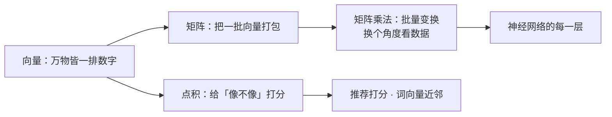

# 线性代数

> **一句话理解**：线性代数（Linear Algebra）研究**向量**（一排数字）和**矩阵**（数字表格）怎么运算、怎么变换——在 AI 世界里万物皆向量，模型的每一次"思考"，本质上都是一串矩阵乘法。

[⬆️ 返回总目录](../../../README.md) · [⬆️ 返回本篇](../README.md) · [⬅️ 返回本章目录](./README.md)

| 属性 | 说明 |
|------|------|
| 难度 | ⭐⭐（进阶） |
| 所属分支 | 通用基础 |
| 前置知识 | [为什么要学数学](./01-为什么要学数学.md) |

---

## 📌 这一节解决什么问题

计算机不认识猫的照片，也不认识"我爱看科幻片"这句话。想让机器处理它们，第一步都是**变成数字**：一张图变成一长排像素值，一个用户变成"年龄、消费、点击历史"的一排数，一个词变成几百个维度的一排数。

变成数字之后，三个问题立刻摆在面前：

1. **怎么比较两排数字？**——哪个商品和这个用户的口味最像？哪两个词意思接近？
2. **怎么一次处理几百万排数字？**——总不能一条条写 for 循环。
3. **怎么知道数字排得对不对？**——行数列数不匹配，代码当场报错。

线性代数就是这三个问题的标准答案：**点积（Dot Product）**管比较，**矩阵（Matrix）**管批量，**形状（Shape）**管对错。神经网络的每一层、推荐系统的每一次召回、词向量的每一次近邻查找，都在反复使用这三件工具。

## 🌱 通俗理解

- **向量：一排数字，也是一支箭。** 想象一张体检报告单：[身高 175, 体重 68, 血压 110]——这就是一个三维向量（Vector）。换个角度看，它也是空间里的一支箭：有方向（偏向哪）、有长度（数值多大）。"国王"这个词在计算机里同样是一排数（比如 300 个数），方向编码了它的含义——这是后面词向量的伏笔。
- **点积：口味匹配打分器。** 你给三种口味的打分是 [火锅 5, 烧烤 1, 沙拉 0]，朋友 A 是 [4, 2, 1]，朋友 B 是 [0, 5, 5]。逐项相乘再相加，得分高的就是"口味方向一致"的人。**方向越一致，得分越高**——推荐系统给商品打分的核心动作就是它。
- **矩阵：一台数字机器。** 一排数字进去，一排新数字出来；同一台机器还能一次处理一整车皮的数据（批量）。神经网络的一层就是一台这样的机器：进去 784 个像素值，出来 128 个特征。
- **形状：插头与插座。** 2×3 的插头（2 行 3 列）要插进 3×2 的插座才咬合得上——**中间那个数必须相等**，否则就报 `not aligned`。深度学习报错的九成来源，就是齿轮没咬合上。

## 📋 举个例子

**手算一次点积（相似度打分）**。三款商品最近三天的销量：

| 商品 | 周一 | 周二 | 周三 |
|------|------|------|------|
| A（辣条） | 5 | 1 | 0 |
| B（薯片） | 4 | 2 | 1 |
| C（沙拉） | 0 | 5 | 5 |

商品 A 和 B 的点积，逐项相乘再相加：

$$
[5,1,0]\cdot[4,2,1] = 5\times4 + 1\times2 + 0\times1 = 20+2+0 = 22
$$

> 👉 **人话**：A、B 都是周一大卖、越到周末越冷清——"卖法"方向一致，所以得 22 分。

再算 A 和 C：$[5,1,0]\cdot[0,5,5] = 0+5+0 = 5$。一个赶在周初卖、一个周末才好卖，方向不合拍，只有 5 分。**点积把"像不像"变成了一个可以排序的数字**——推荐系统给候选商品打分、搜索引擎给网页排序，底层都是大规模点积。

**再来一次形状检查**：一个 2×3 矩阵乘一个 3×2 矩阵，内圈 3 对 3，齿轮咬合成功，结果形状是 2×2。

<details>
<summary>📊 展开完整算例：把这次矩阵乘法一格一格算出来</summary>

$$
\begin{bmatrix} 1 & 2 & 3 \\ 4 & 5 & 6 \end{bmatrix}_{2\times3}
\begin{bmatrix} 7 & 8 \\ 9 & 10 \\ 11 & 12 \end{bmatrix}_{3\times2}
=
\begin{bmatrix} 58 & 64 \\ 139 & 154 \end{bmatrix}_{2\times2}
$$

- 第 (1,1) 格 = 左第 1 行点积右第 1 列 = 1×7 + 2×9 + 3×11 = 7+18+33 = **58**
- 第 (1,2) 格 = 左第 1 行点积右第 2 列 = 1×8 + 2×10 + 3×12 = 8+20+36 = **64**
- 第 (2,1) 格 = 左第 2 行点积右第 1 列 = 4×7 + 5×9 + 6×11 = 28+45+66 = **139**
- 第 (2,2) 格 = 左第 2 行点积右第 2 列 = 4×8 + 5×10 + 6×12 = 32+50+72 = **154**

形状检查：左 (2×3)、右 (3×2)，内圈 3 = 3，咬合成功；结果取外圈，得 (2×2)。

反例：若右边也是 (2×3)，内圈 3 ≠ 2，齿轮咬合失败——numpy 会报 `shapes (2,3) and (2,3) not aligned`。

</details>

## 🧠 核心原理

### 整体流程



### 逐步拆解

**① 向量与点积：给"像不像"打分**

$$
\mathbf{a}\cdot\mathbf{b} = \sum_{i=1}^{n} a_i\, b_i
$$

> 👉 **人话**：两排数字对齐相乘、再全部相加，得到一个数——"方向合拍程度"的分数。

方向一致得高分，方向相反得负分，互相垂直得 0。但点积受"箭的长度"影响（销量大的商品跟谁点积都高），只想比方向时要先做归一化（Normalization）——各除以自己的长度：

$$
\cos\theta = \frac{\mathbf{a}\cdot\mathbf{b}}{\lVert\mathbf{a}\rVert\,\lVert\mathbf{b}\rVert}
$$

> 👉 **人话**：先把两支箭都削成单位长度再打分，只比方向、不比手长——这就是余弦相似度（Cosine Similarity），推荐系统和词向量检索的标配。

**② 矩阵乘法：批量变换，也是换坐标系**

$$
\mathbf{y} = W\mathbf{x}
$$

> 👉 **人话**：一排数字进机器、一排新数字出来；$W$ 就是这台机器的内部结构。神经网络的一层 = "乘个矩阵、加个偏置、过一个激活函数"。

为什么说是"换坐标系"？矩阵可以把数据旋转、拉伸、投影——同一份数据换个角度描述，有些特征就显形了（图片里的"边缘"、用户身上的"消费力"）。矩阵连乘 = 变换叠加，这正是神经网络"层层提炼特征"的数学本质。

**③ 形状规则（背下来能救命）**

$$
(m\times n)\cdot(n\times k) \;\Rightarrow\; (m\times k)
$$

> 👉 **人话**：**内圈必须相等，结果取外圈**。每次遇到 `not aligned`，先打印两个矩阵的 `.shape`，检查内圈对没对上。

**④ 特征值与特征向量：一段科普**。矩阵作用在大多数向量上会"又转又拉"，但总有几个特殊方向只被拉伸、不转向：

$$
A\mathbf{v} = \lambda\mathbf{v}
$$

> 👉 **人话**：$\lambda$ 是拉伸倍数（特征值，Eigenvalue），$\mathbf{v}$ 是不转向的主干方向（特征向量，Eigenvector）。数据最重要的"主心骨"往往就藏在这几个方向上——降维方法 PCA 就是找方差最大的几根主心骨，详见[聚类与降维](../../2-经典机器学习/03-机器学习/06-聚类与降维.md)。现阶段记住"有这个概念"即可。

<details>
<summary>🧮 展开看：点积为什么能量"像不像"（几何视角）</summary>

二维里最容易画：$\mathbf{a}\cdot\mathbf{b} = \lVert\mathbf{a}\rVert\lVert\mathbf{b}\rVert\cos\theta$。

- 夹角 0°（同向）：$\cos\theta = 1$，得分最大——口味完全合拍；
- 夹角 90°（垂直）：得 0——井水不犯河水，没什么关系；
- 夹角 180°（反向）：得负分——专门跟你反着来。

所以"方向越一致、点积越大"不是玄学，是余弦函数的性质。词向量之所以能算出"国王 − 男人 + 女人 ≈ 女王"，靠的正是这种方向运算——详见[词向量与 embedding](../../4-专业方向/07-自然语言处理与LLM/01-词向量与embedding.md)。

</details>

## 💻 动手试试

```python
import numpy as np

# 三款商品最近三天的销量（每个商品是一个向量）
A = np.array([5, 1, 0])   # 辣条：周一大卖
B = np.array([4, 2, 1])   # 薯片：卖法和辣条有点像
C = np.array([0, 5, 5])   # 沙拉：周末才好卖

print("A·B =", A @ B)     # 5*4 + 1*2 + 0*1 = 22
print("A·C =", A @ C)     # 5*0 + 1*5 + 0*5 = 5
# A、B 方向更一致 → 点积更大 → 「更像」

def cos(a, b):  # 余弦相似度：削成单位长度再打分，只比方向
    return a @ b / (np.linalg.norm(a) * np.linalg.norm(b))

print(f"cos(A,B) = {cos(A, B):.3f}")   # 0.942：非常像
print(f"cos(A,C) = {cos(A, C):.3f}")   # 0.139：基本不像

# 矩阵乘法：内圈相等才能咬合
M = np.array([[1, 2, 3],
              [4, 5, 6]])    # 形状 (2, 3)
N = np.array([[7, 8],
              [9, 10],
              [11, 12]])     # 形状 (3, 2)
print("M @ N =\n", M @ N)    # (2,3)@(3,2) → (2,2)
print("N @ M =\n", N @ M)    # (3,2)@(2,3) → (3,3)：能算，但结果完全不同

# 预期输出：M@N = [[58, 64], [139, 154]]；N@M = [[39, 54, 69], [49, 68, 87], [59, 82, 105]]
```

注意最后两行：$MN$ 和 $NM$ 都能算，但形状和数值都不一样——**矩阵乘法不满足交换律，顺序就是含义**。

## 🔥 炼丹小灶

> 🔥 **炼丹小灶**：形状与相似度的工程习惯——
> - 配方：拿到任何数组先 `print(x.shape)` 再动手；比相似度一律先归一化（用余弦）；能矩阵化的计算不要写 Python for 循环。
> - 玄学：同一段计算，向量化之后在 GPU 上常常快一两个数量级——"慢"很多时候不是模型大，是循环多。
> - ⚠️ 以上是经验参考，不是圣旨；不同框架细节有差异。

## 🖱️ 动手玩

> 🕹️ **延伸玩一玩**：[Embedding Projector](https://projector.tensorflow.org)——几千个词向量投影到三维空间，点选一个词看它的"邻居团"：意思相近的词在空间里真的挨在一起，"方向即含义"眼见为实。

## 🔗 在知识树中的位置

- **上游**：[为什么要学数学](./01-为什么要学数学.md)——旅程图里"数据进模型"的那一站
- **下游**：[词向量与 embedding](../../4-专业方向/07-自然语言处理与LLM/01-词向量与embedding.md)——词语变成向量后的一切玩法；[双塔模型与向量召回](../../4-专业方向/08-推荐系统/03-双塔模型与向量召回.md)——用点积给亿万商品打分；[聚类与降维](../../2-经典机器学习/03-机器学习/06-聚类与降维.md)——PCA 用特征方向压缩数据
- **横向对比**：点积 vs 余弦相似度——点积保留长度信息（适合"销量大就是好"的打分场景）；余弦只看方向（适合比较"口味/语义"这类纯相似度场景）

## ⚠️ 常见误区

- **误区一**："点积大就是相似" → 长度会捣乱：销量大的商品跟谁点积都高。先归一化，或直接用余弦相似度。
- **误区二**："矩阵乘法满足交换律" → $MN \neq NM$，连结果形状都可能不同（上例一个 2×2、一个 3×3）；先左后右，顺序就是含义。
- **误区三**："特征值是课本文物" → PCA、谱聚类、PageRank 的地基都是它；后面章节会反复遇到"找主方向"这个动作。

## 📝 小结与自测

**要点回顾**

- 向量 = 一排数字 = 一支箭；文字、图片、用户，进计算机都是向量；
- 点积 = 方向合拍分数；配上余弦相似度，就是推荐、搜索、词向量的标准打分器；
- 矩阵乘法 = 批量变换/换坐标系；内圈相等才咬合，形状对不上是报错第一来源；
- 特征向量 = 矩阵不转向的主干方向，降维（PCA）找的就是它。

**自测一下**（点击展开答案）

<details>
<summary>问题 1：[2, 1]·[3, 4] 等于多少？手算一遍。</summary>

$2\times3 + 1\times4 = 6 + 4 = 10$。对齐相乘，再相加，就这么两步。

</details>

<details>
<summary>问题 2：(3×4) 矩阵乘 (4×5) 矩阵，结果的形状是什么？</summary>

内圈 4 = 4，咬合成功；结果取外圈，是 (3×5)。

</details>

<details>
<summary>问题 3：比较两款商品的"卖法像不像"，为什么通常先归一化再点积？</summary>

不归一化时，销量规模（箭的长度）会主导分数——爆款跟谁都"像"。归一化（用余弦）只比卖法方向，把规模的影响去掉。

</details>

## 📚 延伸阅读

- 视频系列：3Blue1Brown《线性代数的本质》（Essence of Linear Algebra）
- 免费在线书：Mathematics for Machine Learning 第 2 章（mml-book.github.io）
- 经典课程：MIT 18.06 Linear Algebra（Gilbert Strang）

---

[⬅️ 上一页：为什么要学数学](./01-为什么要学数学.md) · [返回本章目录](./README.md) · [下一页：微积分与梯度 ➡️](./03-微积分与梯度.md)
