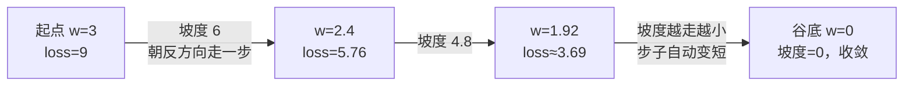

# 微积分与梯度

> **一句话理解**：微积分（Calculus）回答"动一点点，结果变多少"；梯度（Gradient）把答案打包成一支箭——训练模型，就是沿着梯度的**反**方向一步一步下山。

[⬆️ 返回总目录](../../../README.md) · [⬆️ 返回本篇](../README.md) · [⬅️ 返回本章目录](./README.md)

| 属性 | 说明 |
|------|------|
| 难度 | ⭐⭐（进阶） |
| 所属分支 | 通用基础 |
| 前置知识 | [线性代数](./02-线性代数.md)（梯度本身就是一个向量） |

---

## 📌 这一节解决什么问题

一个模型可能有上亿个参数。训练时，每个参数都面临同一个问题：**我该调大还是调小？调多少？**

靠人试是不可能的：把某个参数加 0.001、跑一遍看损失——一亿个参数、每秒试一次也要三年多。微积分给了一条捷径：**不用真去试**，只要求出损失函数在每个参数上的坡度（导数），就知道"往哪调、大约调多少"。而一次反向传播（Backpropagation）能同时算出所有参数的坡度——这就是训练在计算上可行的根本原因。

## 🌱 通俗理解

- **导数（Derivative）= 灵敏度。** 踩一点油门，车速提多少？"油门 → 车速"这条链路的灵敏度就是导数。灵敏度大：轻轻一踩车就窜；灵敏度小：踩到底也慢悠悠。
- **偏导数（Partial Derivative）= 多旋钮音响的"各自影响"。** 低音、高音、音量三个旋钮同时影响听感；偏导就是"只拧这一个旋钮、其他定住，听感变多少"——每个旋钮各记一笔。
- **梯度 = 把所有偏导打包成一支箭。** 它指向当前点"变陡最快"的方向。想下山？朝**反方向**走。大雾天在山里，看不见全局，只能感到脚下哪边最陡——靠本地信息、走一步看一步，这就是梯度下降（Gradient Descent）。
- **学习率（Learning Rate）= 步长。** 步子太大，容易一步跨过谷底、在两侧越弹越高；步子太小，天黑了也走不到山脚。
- **链式法则（Chain Rule）= 流水线逐级追责。** 产品不合格，责任不是最后一个车间独自扛：先算成品对该车间的锅，再一级一级往上游分。模型层层嵌套，某层参数的坡度 = 下游分来的锅 × 本地的影响，一级一级乘回去。

## 📋 举个例子

**手算两步梯度下降**。设损失函数 $f(w) = w^2$（一口碗，谷底在 $w=0$），从 $w = 3$ 出发，学习率 $\eta = 0.1$。

先要拿到坡度：$f$ 的导数是 $f'(w) = 2w$，意思是"在 $w$ 这一点，参数每动 1 单位，损失大约变 $2w$"。

- **第 1 步**：$w=3$，坡度 $= 2\times3 = 6$（此处往右是上坡）。朝反方向走：

  $w \leftarrow 3 - 0.1\times6 = 3 - 0.6 = 2.4$

- **第 2 步**：$w=2.4$，坡度 $= 2\times2.4 = 4.8$。再走一步：

  $w \leftarrow 2.4 - 0.1\times4.8 = 2.4 - 0.48 = 1.92$

两步就把离谷底的距离从 3 缩到了 1.92。注意第 2 步的坡度（4.8）比第 1 步（6）小，所以步子自动变小——**离谷底越近走得越慢，不会冲过头**，这是梯度下降自带的刹车。

<details>
<summary>📊 展开完整算例：接着再走 8 步，看它如何逼近谷底</summary>

每一步都执行 $w \leftarrow w - 0.1\times(2w)$，也就是每步把 $w$ 乘以 $0.8$：

| 步数 | 当前 w | 坡度 2w | 新 w |
|------|--------|---------|------|
| 1 | 3.000 | 6.00 | 2.400 |
| 2 | 2.400 | 4.80 | 1.920 |
| 3 | 1.920 | 3.84 | 1.536 |
| 4 | 1.536 | 3.07 | 1.229 |
| 5 | 1.229 | 2.46 | 0.983 |
| 6 | 0.983 | 1.97 | 0.786 |
| 7 | 0.786 | 1.57 | 0.629 |
| 8 | 0.629 | 1.26 | 0.503 |
| 9 | 0.503 | 1.01 | 0.403 |
| 10 | 0.403 | 0.81 | 0.322 |

10 步后离谷底只剩 0.32；按每步乘 0.8 的节奏，100 步后距离约为 $3\times0.8^{100} \approx 4\times10^{-10}$——理论上无限逼近、永不精确到达，工程上早就当它到了。

</details>

## 🧠 核心原理

### 整体流程



### 逐步拆解

**① 导数：动一点，变多少**

$$
f'(x) = \lim_{\Delta x \to 0}\frac{f(x+\Delta x)-f(x)}{\Delta x}
$$

> 👉 **人话**：自变量挪一小格，函数值跟着变了多少——"变化量 ÷ 挪动量"，挪动量趋于 0 时的极限。它就是那条链路的灵敏度。

**② 偏导与梯度：每个旋钮记一笔，打包成一支箭**

$$
\nabla f = \left[\frac{\partial f}{\partial w_1},\ \frac{\partial f}{\partial w_2},\ \cdots,\ \frac{\partial f}{\partial w_n}\right]
$$

> 👉 **人话**：把每个参数各自的坡度排成一排——一个向量（线性代数又来了）。它指向损失上升最快的方向，训练就朝它的反方向走。

$$
w \leftarrow w - \eta\,\nabla f
$$

> 👉 **人话**：新位置 = 老位置 − 步长 × 坡度。几乎所有训练代码的核心就是这一行。

**③ 学习率：唯一要先拍板的超参数**（预告）

| 学习率 | 本例（f=w²）中的现象 |
|--------|----------------------|
| 太小（如 0.01） | 每步只挪一点，龟速下山 |
| 合适（如 0.1） | 稳步下山，步子自动收紧 |
| 太大（如 1.1） | 一步跨过谷底弹到对面更高的坡上，越跳越远 |

**④ 链式法则：责任逐级回传**

$$
\frac{\partial L}{\partial w} = \frac{\partial L}{\partial h}\cdot\frac{\partial h}{\partial w}
$$

> 👉 **人话**：参数 $w$ 先影响中间结果 $h$，$h$ 再影响损失 $L$；那 $w$ 的总影响 = 两段影响相乘。流水线有三道工序，就乘三项——这就是反向传播的全部原理，详见[训练一个模型的完整流程](../../3-深度学习/04-深度学习基础/02-训练一个模型的完整流程.md)。

<details>
<summary>📊 展开看：把学习率调到 1.1 会发生什么（发散现场）</summary>

还是 $f(w)=w^2$、$w=3$，但 $\eta = 1.1$：

- 第 1 步：$w \leftarrow 3 - 1.1\times6 = -3.6$（一步跨过谷底，弹到对面**更高**的坡上）
- 第 2 步：坡度 $= 2\times(-3.6) = -7.2$，$w \leftarrow -3.6 - 1.1\times(-7.2) = 4.32$
- 第 3 步：坡度 $= 8.64$，$w \leftarrow 4.32 - 1.1\times 8.64 = -5.184$——越来越远！

每步相当于把 $w$ 乘上 $1-2\eta = -1.2$：绝对值越滚越大、正负来回横跳——这就是"loss 飞天 / 变 NaN"的最小模型版。真实模型里它有名字：梯度爆炸（Gradient Explosion）。

</details>

## 💻 动手试试

```python
import numpy as np

def f(x, y):
    return x**2 + 3 * y**2          # 一口「二维锅」，谷底在 (0, 0)

def num_grad(x, y, eps=1e-5):       # 数值梯度：在旁边挪一小步，看变化多少
    gx = (f(x + eps, y) - f(x - eps, y)) / (2 * eps)
    gy = (f(x, y + eps) - f(x, y - eps)) / (2 * eps)
    return np.array([gx, gy])

p = np.array([2.0, 1.0])
g = num_grad(*p)                    # 两个旋钮各自的坡度，打包成向量
print("数值梯度 =", g)               # [4. 6.]（手算：∂f/∂x=2x=4，∂f/∂y=6y=6）

q = p - 0.1 * g                     # 沿梯度「反」方向走一步（学习率 0.1）
print("走一步后 =", q)               # [1.6 0.4]
print(f"loss：{f(*p):.2f} → {f(*q):.2f}")   # 7.00 → 3.04，真的在下山
```

你刚才用"挪一小步"数值地验证了梯度——PyTorch 的自动微分（Automatic Differentiation）做的是同一件事的精确版，而且对上亿个参数一次算完。

## 🔥 炼丹小灶

> 🔥 **炼丹小灶**：学习率的工业界起点——
> - 配方：玩具问题从 0.1 起步；真实模型常用 Adam 优化器、lr=1e-3 起步，按十倍往下试。
> - 玄学：loss 不降先把学习率降一个数量级；loss 突然变 NaN 多半是学习率太大或 log(0)；梯度范数飙升先回滚到上一个能跑的配置。
> - ⚠️ 以上是经验参考，不是圣旨；换数据集请重新炼。

## 🖱️ 动手玩

> 🎮 **本库实验场**：[梯度下降炼丹炉](../../../playground/gradient-descent.html)——拖动学习率看小球下山：调到 0.01 看它龟速爬行，调到 1.1 看它一步飞出山谷，亲手复现上面的发散现场。

## 🔗 在知识树中的位置

- **上游**：[线性代数](./02-线性代数.md)——梯度是一个向量，"最陡方向"靠向量的语言表达；[为什么要学数学](./01-为什么要学数学.md)——旅程图里"调参数"的那一站
- **下游**：[训练一个模型的完整流程](../../3-深度学习/04-深度学习基础/02-训练一个模型的完整流程.md)——链式法则的工业化版本：反向传播；[线性回归](../../2-经典机器学习/03-机器学习/02-线性回归.md)——第一个全程用梯度训练的真模型
- **横向对比**：多卡训练时，梯度还要在各张卡之间同步求平均（AllReduce），见[分布式训练与模型规模](../../3-深度学习/04-深度学习基础/04-分布式训练与模型规模.md)

## ⚠️ 常见误区

- **误区一**："梯度指向谷底" → 梯度指向**当前位置上升最快**的方向，训练走的是它的反方向；而且它只看脚下，看不见远处的谷（所以会停在局部低点或鞍点上）。
- **误区二**："学习率越大收敛越快" → 超过临界值后会在谷底两侧越弹越高（见 1.1 的算例），直接发散，比走得慢惨得多。
- **误区三**："坡度等于 0 就是找到了最优解" → 也可能是鞍点（一边上一边下的山口）或局部高点；深度学习的损失曲面上，大量"平坦的鞍点"才是常态。

## 📝 小结与自测

**要点回顾**

- 导数 = 灵敏度；偏导 = 各旋钮各自的影响；梯度 = 所有偏导打包成的向量；
- 训练 = 沿梯度反方向下山：$w \leftarrow w - \eta\nabla f$，学习率是步长；
- 离谷底越近坡度越小、步子自动收紧——梯度下降自带刹车；
- 链式法则把责任逐级回传，是反向传播的全部原理。

**自测一下**（点击展开答案）

<details>
<summary>问题 1：f(w) = w² + 1，当前 w = 2，学习率 0.25，走一步后 w 是多少？</summary>

坡度 $f'(w)=2w=4$；更新：$w \leftarrow 2 - 0.25\times4 = 1$。（"+1"只是把碗垫高，不影响坡度。）

</details>

<details>
<summary>问题 2：为什么训练沿梯度的"反"方向走？</summary>

梯度指向当前点损失**上升最快**的方向；要下山，自然是朝它的反方向走，那里是局部下降最快的方向。

</details>

<details>
<summary>问题 3：链式法则在模型里解决什么问题？</summary>

模型是层层嵌套的函数，深层参数的影响要经过多层才传到损失；链式法则把总坡度拆成"逐段影响相乘"，从损失端一级级乘回去——反向传播就是它的工程化。

</details>

## 📚 延伸阅读

- 视频系列：3Blue1Brown《微积分的本质》（Essence of Calculus）
- 书：Goodfellow 等《深度学习》（Deep Learning）第 4 章"数值计算"
- 交互：本库 playground 的[梯度下降炼丹炉](../../../playground/gradient-descent.html)（上文"动手玩"）

---

[⬅️ 上一页：线性代数](./02-线性代数.md) · [返回本章目录](./README.md) · [下一页：概率与统计 ➡️](./04-概率与统计.md)
