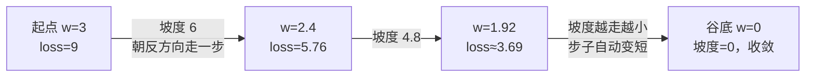
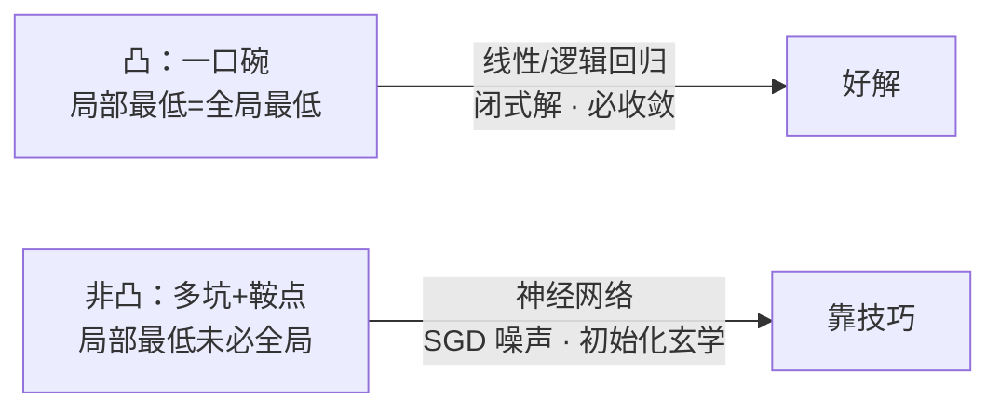
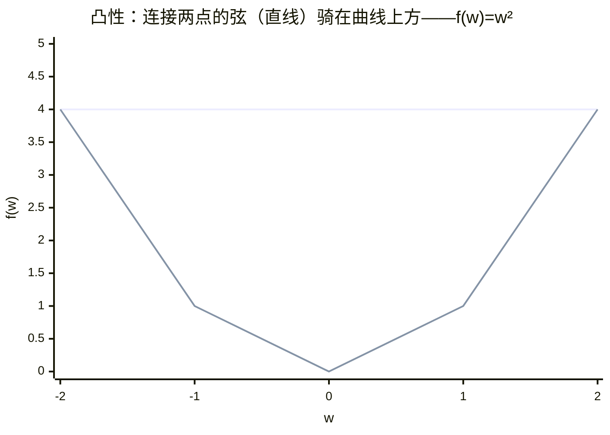

# 微积分与梯度

> **一句话理解**：微积分（Calculus）回答"动一点点，结果变多少"；梯度（Gradient）把答案打包成一支箭——训练模型，就是沿着梯度的**反**方向一步一步下山。

[⬆️ 返回总目录](../../../README.md) · [⬆️ 返回本篇](../README.md) · [⬅️ 返回本章目录](./README.md)

| 属性 | 说明 |
|------|------|
| 难度 | ⭐⭐（进阶） |
| 所属分支 | 通用基础 |
| 前置知识 | [线性代数](./02-线性代数.md)（梯度本身就是一个向量） |

---

## 📌 这一节解决什么问题

一个模型可能有上亿个参数。训练时，每个参数都面临同一个问题：**我该调大还是调小？调多少？**

靠人试是不可能的：把某个参数加 0.001、跑一遍看损失——一亿个参数、每秒试一次也要三年多。微积分给了一条捷径：**不用真去试**，只要求出损失函数在每个参数上的坡度（导数），就知道"往哪调、大约调多少"。而一次反向传播（Backpropagation）能同时算出所有参数的坡度——这就是训练在计算上可行的根本原因。

但只知道"往哪走"还不够，实践中真正的成败往往在三个细节上：**步子能迈多大**（步长为什么有上限，泰勒展开给出精确答案）；**走到了低点就是终点吗**（凸与非凸的区别）；**方向抖来抖去怎么办**（动量为什么有效）。本节把这四件事一起讲透。

## 🌱 通俗理解

- **导数（Derivative）= 灵敏度。** 踩一点油门，车速提多少？"油门 → 车速"这条链路的灵敏度就是导数。灵敏度大：轻轻一踩车就窜；灵敏度小：踩到底也慢悠悠。
- **偏导数（Partial Derivative）= 多旋钮音响的"各自影响"。** 低音、高音、音量三个旋钮同时影响听感；偏导就是"只拧这一个旋钮、其他定住，听感变多少"——每个旋钮各记一笔。
- **梯度 = 把所有偏导打包成一支箭。** 它指向当前点"变陡最快"的方向。想下山？朝**反方向**走。大雾天在山里，看不见全局，只能感到脚下哪边最陡——靠本地信息、走一步看一步，这就是梯度下降（Gradient Descent）。
- **学习率（Learning Rate）= 步长。** 步子太大，容易一步跨过谷底、在两侧越弹越高；步子太小，天黑了也走不到山脚。为什么"太大"会有精确的临界值？因为梯度下降本质是**一阶近似**——近似只在"一小步"内可信，这是本节核心原理第 ⑤ 段的主角。
- **链式法则（Chain Rule）= 流水线逐级追责。** 产品不合格，责任不是最后一个车间独自扛：先算成品对该车间的锅，再一级一级往上游分。模型层层嵌套，某层参数的坡度 = 下游分来的锅 × 本地的影响，一级一级乘回去。
- **动量（Momentum）= 重球滚下山。** 轻球顺着坡随波逐流、谷底两侧来回蹭；重球有惯性，来回震荡的分量互相抵消、一致的分量越滚越快——它的数学其实就是"最近几步梯度的加权平均"。

## 📋 举个例子

**手算两步梯度下降**。设损失函数 $f(w) = w^2$（一口碗，谷底在 $w=0$），从 $w = 3$ 出发，学习率 $\eta = 0.1$。

先要拿到坡度：$f$ 的导数是 $f'(w) = 2w$，意思是"在 $w$ 这一点，参数每动 1 单位，损失大约变 $2w$"。

- **第 1 步**：$w=3$，坡度 $= 2\times3 = 6$（此处往右是上坡）。朝反方向走：

  $w \leftarrow 3 - 0.1\times6 = 3 - 0.6 = 2.4$

- **第 2 步**：$w=2.4$，坡度 $= 2\times2.4 = 4.8$。再走一步：

  $w \leftarrow 2.4 - 0.1\times4.8 = 2.4 - 0.48 = 1.92$

两步就把离谷底的距离从 3 缩到了 1.92。注意第 2 步的坡度（4.8）比第 1 步（6）小，所以步子自动变小——**离谷底越近走得越慢，不会冲过头**，这是梯度下降自带的刹车。

<details>
<summary>📊 展开完整算例：接着再走 8 步，看它如何逼近谷底</summary>

每一步都执行 $w \leftarrow w - 0.1\times(2w)$，也就是每步把 $w$ 乘以 $0.8$：

| 步数 | 当前 w | 坡度 2w | 新 w |
|------|--------|---------|------|
| 1 | 3.000 | 6.00 | 2.400 |
| 2 | 2.400 | 4.80 | 1.920 |
| 3 | 1.920 | 3.84 | 1.536 |
| 4 | 1.536 | 3.07 | 1.229 |
| 5 | 1.229 | 2.46 | 0.983 |
| 6 | 0.983 | 1.97 | 0.786 |
| 7 | 0.786 | 1.57 | 0.629 |
| 8 | 0.629 | 1.26 | 0.503 |
| 9 | 0.503 | 1.01 | 0.403 |
| 10 | 0.403 | 0.81 | 0.322 |

10 步后离谷底只剩 0.32；按每步乘 0.8 的节奏，100 步后距离约为 $3\times0.8^{100} \approx 4\times10^{-10}$——理论上无限逼近、永不精确到达，工程上早就当它到了。

</details>

## 🧠 核心原理

### 整体流程



### 逐步拆解

**① 导数：动一点，变多少**

$$
f'(x) = \lim_{\Delta x \to 0}\frac{f(x+\Delta x)-f(x)}{\Delta x}
$$

> 👉 **人话**：自变量挪一小格，函数值跟着变了多少——"变化量 ÷ 挪动量"，挪动量趋于 0 时的极限。它就是那条链路的灵敏度。

**② 偏导与梯度：每个旋钮记一笔，打包成一支箭**

$$
\nabla f = \left[\frac{\partial f}{\partial w_1},\ \frac{\partial f}{\partial w_2},\ \cdots,\ \frac{\partial f}{\partial w_n}\right]
$$

> 👉 **人话**：把每个参数各自的坡度排成一排——一个向量（线性代数又来了）。它指向损失上升最快的方向，训练就朝它的反方向走。

$$
w \leftarrow w - \eta\,\nabla f
$$

> 👉 **人话**：新位置 = 老位置 − 步长 × 坡度。几乎所有训练代码的核心就是这一行。

**③ 学习率：唯一要先拍板的超参数**（预告）

| 学习率 | 本例（f=w²）中的现象 |
|--------|----------------------|
| 太小（如 0.01） | 每步只挪一点，龟速下山 |
| 合适（如 0.1） | 稳步下山，步子自动收紧 |
| 太大（如 1.1） | 一步跨过谷底弹到对面更高的坡上，越跳越远 |

"太大"到底从哪一步开始太大？第 ⑤ 段的泰勒展开会给出精确答案：对 $f=w^2$ 这个例子，临界值恰好是 $\eta=1$。

**④ 链式法则：责任逐级回传**

$$
\frac{\partial L}{\partial w} = \frac{\partial L}{\partial h}\cdot\frac{\partial h}{\partial w}
$$

> 👉 **人话**：参数 $w$ 先影响中间结果 $h$，$h$ 再影响损失 $L$；那 $w$ 的总影响 = 两段影响相乘。流水线有三道工序，就乘三项——这就是反向传播的全部原理，详见[训练一个模型的完整流程](../../3-深度学习/04-深度学习基础/02-训练一个模型的完整流程.md)。

写成**矩阵形式**就是反向传播的真实样子。设一层线性变换 $\mathbf{z} = W\mathbf{x}$、损失为 $L$，记上游传回的误差信号 $\boldsymbol{\delta} = \partial L/\partial \mathbf{z}$，则：

$$
\frac{\partial L}{\partial \mathbf{x}} = W^{T}\boldsymbol{\delta}, \qquad \frac{\partial L}{\partial W} = \boldsymbol{\delta}\,\mathbf{x}^{T}
$$

> 👉 **人话**：误差往回传一层，要乘一次 $W$ 的**转置**——反向传播代码里满天飞的 `.t()`、`transpose`，全是链式法则矩阵形式（雅可比矩阵，Jacobian Matrix）的自然产物；而对权重本身的梯度，是"上游误差 × 本层输入"的外积——第 2 页矩阵乘法的"秩一视角"在这里兑现。

**⑤ 泰勒展开：梯度下降为什么"只能走一小步"**

把损失在当前位置 $w$ 附近展开：

$$
f(w+\Delta) \approx f(w) + f'(w)\,\Delta + \tfrac{1}{2}f''(w)\,\Delta^2
$$

> 👉 **人话**：走一小步之后损失变多少，可以用"现在的值 + 一阶坡度 × 步子 + 二阶曲率 × 步子平方/2"来预告。梯度下降**只看了前两项**（一阶近似）：沿着 $-f'(w)$ 走，一阶项一定变小；但被扔掉的二阶项是 $\frac{1}{2}f''\Delta^2$——**步子 $\Delta$ 一大，平方增长的四阶惩罚就反客为主**，"下降的预告"变成"上升的现实"。这就是"步长不能大"的数学原产地。

<details>
<summary>🧮 展开推导：对 f=w²，学习率的精确临界值是 1</summary>

把更新式代入 $f(w)=w^2,\ f'(w)=2w$：

$$
w_{t+1} = w_t - \eta\cdot 2w_t = (1-2\eta)\,w_t
$$

每步相当于把 $w$ 乘上一个固定因子 $(1-2\eta)$。几何级数的命运由因子的绝对值决定：

| 学习率 | 因子 $1-2\eta$ | $\lvert 1-2\eta\rvert$ | 结局 |
|--------|----------------|------------------------|------|
| $\eta = 0.1$ | $0.8$ | $<1$ | 单调收敛，每步缩到 0.8 倍 |
| $\eta = 0.5$ | $0$ | $=0$ | **一步精确到谷底**（此例的最优步长） |
| $\eta = 0.75$ | $-0.5$ | $<1$ | 两侧来回跳，但幅度减半，仍收敛 |
| $\eta = 1.0$ | $-1$ | $=1$ | 在 $w$ 与 $-w$ 之间永久振荡 |
| $\eta = 1.1$ | $-1.2$ | $>1$ | 两侧弹得一次比一次远——发散 |

结论：本例收敛的充要条件是 $0<\eta<1$。这不是巧合——对二次函数，临界学习率 $\eta = 1/f''$（曲率的倒数）：**坡面越陡（曲率越大），安全步长越小**。真实损失面各处曲率不同，所以"一套全局学习率"天生勉强的，这正是后面 Adam 这类"每个参数自带步长"方法的动机。

</details>

**⑥ 凸与非凸：哪些问题"好解"，哪些靠命和技巧**

$$
f\big(\theta x + (1-\theta)y\big) \le \theta f(x) + (1-\theta)f(y),\quad \theta\in[0,1]
$$

> 👉 **人话**：任取两点，函数在连线段上都不高于两端连线——**图像没有一个"坑中坑"**（凸函数，Convex Function）。等价的好消息：局部最低点 = 全局最低点，梯度下降只要坡度归零就赢了。

线性回归、逻辑回归的损失都是凸的——所以第 3 章敢给闭式解、敢说"收敛到最优"。**神经网络的损失是非凸的**：层层复合 + 权重可互换（隐层两个神经元对调权重，模型不变，损失面因此有大量对称的坑）。但实践照样 work，原因一句话：**高维空间里"坏局部极小值"其实稀少、鞍点（Saddle Point，一边上一边下的山口）才是常态**，而随机梯度下降自带的噪声恰好能把参数从鞍点附近晃出去。详见[训练一个模型的完整流程](../../3-深度学习/04-深度学习基础/02-训练一个模型的完整流程.md)。



**⑦ 动量：梯度的指数移动平均**

$$
v_t = \beta\,v_{t-1} + (1-\beta)\,g_t, \qquad w \leftarrow w - \eta\, v_t
$$

> 👉 **人话**：这一步真正迈出的方向 $v_t$，不是当前梯度 $g_t$，而是**最近若干步梯度的加权平均**——最新的梯度权重 $(1-\beta)$，上一步的权重 $(1-\beta)\beta$，再上一步 $(1-\beta)\beta^2$……权重随时间指数衰减（指数移动平均，Exponential Moving Average）。$\beta=0.9$ 时有效平均窗口约 $1/(1-\beta)=10$ 步。

两个方向、两种命运（数字验证见"动手试试"③）：

- **来回震荡的方向**（峡谷两壁，梯度正负交替）：新旧梯度一正一负，平均后大幅抵消——震荡被抹平；
- **持续一致的方向**（直冲谷底，梯度同号）：权重累加，$v_t \to$ 稳态值（$\beta=0.9$ 时约放大 10 倍）——越走越快。

**失效边界**：$\beta$ 太大（如 0.999，窗口约 1000 步）时惯性过强，谷底附近刹不住车来回冲；收敛后期通常要么衰减学习率、要么减小 $\beta$。

**⑧ 二阶视角：牛顿法为什么快但贵**

$$
w \leftarrow w - \frac{f'(w)}{f''(w)}
$$

> 👉 **人话**：一阶方法只看坡度，牛顿法连**曲率**（坡度的坡度）一起用：坡陡就少走、坡缓就多走，步长自动适配。对 $f=w^2$ 这类二次函数，$f''=2$ 处处相同，牛顿法**一步精确跳到谷底**——对比梯度下降的十步百步，这就是二阶信息的威力。

**失效边界（成本）**：$n$ 个参数时曲率是 $n\times n$ 的海森矩阵（Hessian Matrix）——上亿参数意味着存不下、求逆 $O(n^3)$ 算不动。于是有了两条退路：**拟牛顿法**（L-BFGS：只用最近几步梯度近似海森）和 **Adam**（对每个参数分别维护"梯度的移动平均"和"梯度平方的移动平均"，相当于给每个参数配一个便宜的自适应步长）——第 4 章训练实战的标配优化器，一眼看去一堆超参，拆开全是本节的加法。

<details>
<summary>📊 展开失败算例：把学习率调到 1.1，六步发散的完整现场</summary>

还是 $f(w)=w^2$、$w=3$，但 $\eta = 1.1$（每步 $w$ 乘上 $1-2\eta=-1.2$）：

| 步数 | 当前 w | 坡度 2w | 新 w | loss = w² |
|------|---------|---------|------|-----------|
| 0 | 3.000 | 6.00 | — | 9.00 |
| 1 | 3.000 | 6.00 | −3.600 | 12.96 |
| 2 | −3.600 | −7.20 | 4.320 | 18.66 |
| 3 | 4.320 | 8.64 | −5.184 | 26.87 |
| 4 | −5.184 | −10.37 | 6.221 | 38.70 |
| 5 | 6.221 | 12.44 | −7.465 | 55.73 |
| 6 | −7.465 | −14.93 | 8.958 | 80.25 |

三个特征一望而知：$w$ **正负来回横跳**（每步变号）；**幅度每步 ×1.2**（复利式增长）；**loss 每步 ×1.44**——六步就从 9 涨到 80，再往后就是浮点上限溢出变 `inf`、再变 `NaN`。真实模型里它有名字：梯度爆炸（Gradient Explosion），症状、诊断、补救见下面"动手试试"后的失败模式表。

</details>

<details>
<summary>📊 展开算例：同一学习率伺候不了两个方向（病态曲率现场）</summary>

换一口"长扁锅" $f(x,y) = x^2 + 3y^2$（$y$ 方向曲率 6，是 $x$ 方向的 3 倍），从 $(2,1)$ 出发。

**梯度并不指向谷底**。此处 $\nabla f = (4, 6)$，取反得 $(-4,-6)$；而从 $(2,1)$ 直指谷底（原点）的方向是 $(-2,-1)$。两者夹角：

$$
\cos\theta = \frac{(-4)(-2)+(-6)(-1)}{\sqrt{52}\cdot\sqrt{5}} = \frac{14}{16.12} \approx 0.868 \;\Rightarrow\; \theta \approx 30^\circ
$$

梯度方向比"直奔谷底"偏了约 30°——它被更陡的 $y$ 方向带偏了。等高线是椭圆时，**最陡的方向≠通向谷底的方向**，这是几何事实，不是算法 bug。

**一个学习率，两种命运**。更新式 $x \leftarrow (1-2\eta)x$、$y \leftarrow (1-6\eta)y$——同一个 $\eta$ 在两个方向上的"收缩因子"完全不同：

| 学习率 | x 方向因子 | y 方向因子 | 结局 |
|--------|-----------|-----------|------|
| 0.1 | 0.8 | 0.4 | 都收敛，y 快 x 慢 |
| 0.5 | 0 | −2 | **x 一步精确到 0；y 发散** |
| 0.15 | 0.7 | 0.1 | 都收敛且均衡——贴着安全边界走 |

$\eta=0.5$ 的情形最扎心：对 $x$ 是最优步长、对 $y$ 是灾难——安全步长被**曲率最大的方向**卡死。出路就是第 ⑧ 段说的自适应方法（Adam 按参数分方向定步长），或先做特征标准化让各方向曲率接近（第 2 页第 ⑨ 段）。

</details>

### 📐 数学深潜：凸函数的二阶判定——f″≥0 ⇒ 凸

**⑥说**凸函数"局部最低点 = 全局最低点"，但没说**怎么判断**一个函数凸不凸。总不能把每两点都连一遍线——好在二阶导数给出一个可以**逐点检查**的判据："坡度的坡度"处处不低头，函数就凸。

**严格陈述。** 设 $f$ 在区间 $I$ 上二阶可导。则

$$
f''(x)\ \ge\ 0\quad\forall x\in I\qquad\Longrightarrow\qquad f\ \text{在}\ I\ \text{上凸}
$$

（反向也成立：凸 + 二阶可导 ⟹ $f''\ge0$——凸函数的割线斜率单调不减，取极限得 $f'$ 单调，故 $f''\ge0$。本模块完整证明"⇒"方向。）

> 👉 **人话**：一阶导数说"坡朝哪边"，二阶导数说"坡度自己怎么变"。$f''\ge0$ = 坡度只增不减 = 没有往里凹的肚膛 = 整体凸——判据从"检查所有点对"（无穷多）缩成"逐点查曲率"（局部）。

**完整推导：$f''\ge0$ ⟹ 凸，两步走（切线托底 + 加权平均的代数）。**

<details>
<summary>🧮 展开推导：拉格朗日余项一步到位，两头一夹即得凸性定义</summary>

**第一步：$f''\ge0$ ⟹ "切线托底"。** 要证对任意 $x,y\in I$：$f(y)\ \ge\ f(x)+f'(x)(y-x)$。用带拉格朗日余项的泰勒展开（⑤ 的展开把余项写精确）：在 $x$ 与 $y$ 之间存在某点 $\xi$，使

$$
f(y) = f(x) + f'(x)(y-x) + \tfrac{1}{2}f''(\xi)(y-x)^2
$$

（余项是"二阶导数在某中间点取值 × 步长平方的一半"。）由假设 $f''\ge0$ **处处**成立（$\xi\in I$ 逃不掉），余项 $\ge0$，故 $f(y)\ge f(x)+f'(x)(y-x)$。∎——曲率非负 ⟹ 曲线整体骑在每条切线上方。

**第二步："切线托底" ⟹ 凸性定义。** 任取 $x_1,x_2\in I$、$\theta\in(0,1)$，记 $x_\theta=\theta x_1+(1-\theta)x_2$。把托底不等式的切点取在 $x_\theta$，对 $x_1$、$x_2$ 各写一遍：

$$
f(x_1)\ \ge\ f(x_\theta)+f'(x_\theta)(x_1-x_\theta),\qquad
f(x_2)\ \ge\ f(x_\theta)+f'(x_\theta)(x_2-x_\theta)
$$

第一式乘 $\theta$、第二式乘 $(1-\theta)$（非负数乘不等式方向不变），相加：

$$
\theta f(x_1)+(1-\theta)f(x_2)\ \ge\ f(x_\theta)\big[\theta+1-\theta\big]\ +\ f'(x_\theta)\big[\theta(x_1-x_\theta)+(1-\theta)(x_2-x_\theta)\big]
$$

两个方括号逐个算：第一个 $=1$；第二个 $=\theta x_1+(1-\theta)x_2-x_\theta=x_\theta-x_\theta=0$（正是 $x_\theta$ 的定义）。于是

$$
f\big(\theta x_1+(1-\theta)x_2\big)=f(x_\theta)\ \le\ \theta f(x_1)+(1-\theta)f(x_2)\qquad\blacksquare
$$

**数字抽查。** $f(w)=e^w$：$f''=e^w>0$ 判凸；取 $x_1=0,\ x_2=2,\ \theta=0.5$：左边 $f(1)=e\approx2.718$，右边 $\frac{1+e^2}{2}\approx\frac{1+7.389}{2}=4.19$ ✓ 弦在曲线上方。

</details>

**几何图景（弦 vs 曲线）：**



> 👉 **人话**：第一条线是连接 $(−2,4)$ 与 $(2,4)$ 的弦，第二条是曲线本身——弦全程在曲线上方，且换成任何两点都如此，这就是"凸"。切线托底（第一步）与弦在上方（第二步）一体两面：**托底的切线把弦顶了上去**。

**反例与边界。**

1. **$f''\ge0$ 必须全区间成立**：$f(w)=w^3$ 的 $f''=6w$ 在负半轴为负——只在 $[0,\infty)$ 凸、在 $\mathbb{R}$ 上不凸。数值反例：$f(-2)=-8$、$f(1)=1$、$\theta=0.5$：中点 $f(-0.5)=-0.125$，两端平均 $=-3.5$，$-0.125\le-3.5$ 不成立——凸性定义被击穿；
2. **二阶判定需要二阶可导，凸性本身不需要**：$f(w)=\lvert w\rvert$ 凸（三角不等式的推论），但 0 点不可导、$f''(0)$ 不存在——此时用一阶判据"$f'$ 单调不减"（允许多值）。ReLU、hinge 损失都是"凸但分段线性"，深度学习里它们合法服役靠**次梯度**（[第 4 章](../../3-深度学习/04-深度学习基础/01-神经网络是怎么炼成的.md)深潜的"折点不可导"讨论）；
3. **高维版**：$\nabla^2f\succeq0$（Hessian 半正定：任意方向 $v$ 都有 $v^{\top}(\nabla^2f)v\ge0$）⟺ 凸——下一章[逻辑回归](../../2-经典机器学习/03-机器学习/03-逻辑回归与分类.md)的深潜就用它证明交叉熵损失凸；"凸 ⟹ 局部即全局"的完整证明见[训练一个模型的完整流程](../../3-深度学习/04-深度学习基础/02-训练一个模型的完整流程.md)的损失曲面深潜。

> 👉 **人话总结**："坡度只增不减"（f″≥0）的函数没有坑中坑——切线永远托底、弦永远骑在上面，于是坡度归零处必然是全局谷底；梯度下降敢在凸问题上"见零收工"，底气全在这条判据。

### 📐 数学深潜：Jensen 不等式——凸性搬进概率世界

**⑥给了凸性的确定性版本（两点、一根弦）**。把它搬进概率世界——"加权平均"升级成"期望"——就得到贯穿机器学习的一条不等式：从方差公式到 AM-GM，再到第 12 章的 ELBO，全是它的化身。

**严格陈述。** 设 $\varphi$ 是凸函数，$X$ 是期望存在的随机变量。则

$$
\varphi\big(\mathbb{E}[X]\big)\ \le\ \mathbb{E}\big[\varphi(X)\big]
$$

> 👉 **人话**：**先平均、再过凸函数**，结果必不大于**先过凸函数、再平均**——凸变换面前，"先融合"占不到便宜。若 $\varphi$ 严格凸，等号当且仅当 $X$ 几乎必然取常值（没有波动可平均）。

**完整推导：从两点（定义）到 n 点（归纳），再到期望（加权平均的极限）。**

<details>
<summary>🧮 展开推导：凸性定义 → 有限点加权和的归纳 → 期望 + 骰子算例</summary>

**第一步：n=2 就是对的。** 凸性定义本身：$\varphi\big(\theta x_1+(1-\theta)x_2\big)\le\theta\varphi(x_1)+(1-\theta)\varphi(x_2)$。

**第二步：归纳到 n 点。** 设结论对 $n-1$ 个点、任意非负权重（和为 1）成立。给定 $\theta_1,\dots,\theta_n\ge0$、$\sum_i\theta_i=1$；记 $s=\theta_1+\cdots+\theta_{n-1}$（若 $s=0$ 则 $\theta_n=1$，退化为单点，平凡）。把 n 点加权和**改写成"2 点加权和套 (n−1) 点加权和"**：

$$
\sum_{i=1}^{n}\theta_ix_i\ =\ s\cdot\underbrace{\frac{\theta_1x_1+\cdots+\theta_{n-1}x_{n-1}}{s}}_{=:\,y}\ +\ \theta_nx_n
$$

（通分验证：$s\cdot\frac{1}{s}\sum_{i<n}\theta_ix_i=\sum_{i<n}\theta_ix_i$ ✓；权重 $\{s,\ \theta_n\}$ 非负且和为 1 ✓。）对两点 $\{y,\ x_n\}$ 用 n=2 情形：

$$
\varphi\Big(\sum_i\theta_ix_i\Big)=\varphi(s\,y+\theta_nx_n)\ \le\ s\,\varphi(y)+\theta_n\varphi(x_n)
$$

再对 $\varphi(y)$ 用归纳假设（权重 $\theta_i/s$ 非负、和为 1）：$\varphi(y)\le\sum_{i<n}\frac{\theta_i}{s}\varphi(x_i)$，两边乘 $s$：$s\,\varphi(y)\le\sum_{i<n}\theta_i\varphi(x_i)$。串联两式：

$$
\varphi\Big(\sum_i\theta_ix_i\Big)\ \le\ \sum_{i<n}\theta_i\varphi(x_i)+\theta_n\varphi(x_n)=\sum_{i=1}^{n}\theta_i\varphi(x_i)
$$

归纳完成。∎

**第三步：从有限点到期望。** 离散随机变量 $P(X=x_i)=p_i$ 正是"权重非负、和为 1"，$\mathbb{E}[X]=\sum_ip_ix_i$、$\mathbb{E}[\varphi(X)]=\sum_ip_i\varphi(x_i)$——第二步直接就是结论。一般随机变量是"无穷细分的加权平均"，用简单函数逼近取极限严格化（测度论细节属教材；直觉：期望就是无穷多点的凸组合，n 点不等式让过去，极限也让过去）。∎

**数字小算例（掷骰子 + $\varphi(x)=x^2$）。** $\mathbb{E}[X]=3.5$，$\varphi(\mathbb{E}[X])=3.5^2=12.25$；$\mathbb{E}[X^2]=\frac{1+4+9+16+25+36}{6}=\frac{91}{6}\approx15.17$。$12.25\le15.17$ ✓，且**缺口恰好等于方差**：

$$
\mathbb{E}[X^2]-\big(\mathbb{E}[X]\big)^2 = 15.17-12.25 = 2.92\ \Big(=\tfrac{35}{12}=\mathrm{Var}(X)\Big)
$$

</details>

**概率图景（ASCII）——"先平均后变换"输给"先变换后平均"：**

```text
  φ(x) = x²（凸）
    |                        ▲ E[φ(X)]：先各自平方、再平均 → 高（15.17）
    |                     ╱‾‾‾
    |                 ╱        ↑
    |              ╱            ┆ Jensen 缺口 = Var(X)（x² 时恰好是方差）
    |           ╱                ↓
    |—————————●——————————————————● φ(E[X])：先平均成 3.5、再平方 → 低（12.25）
    |         ↑
    |       E[X]
    +————————————————————————————————→ x
      1   2   3  3.5  4   5   6    （骰子六点等概率）
```

> 👉 **人话**：把六个点的质量先坍缩到均值再上抛物线，只到 12.25；先让每个点各自上抛物线再平均，得到 15.17——**波动经过凸函数会被放大记账**，这个记账差在 $x^2$ 时就是方差本身。

**反例与边界。**

1. **凹函数不等号反向**：$\varphi=\log$（凹）时 $\log\mathbb{E}[X]\ \ge\ \mathbb{E}[\log X]$。取两点、权重各半，两边取指数即得算术–几何平均不等式 $\frac{x_1+x_2}{2}\ge\sqrt{x_1x_2}$——AM-GM 是 Jensen 的特例；
2. **期望必须存在**：重尾分布（如柯西）$\mathbb{E}[X]$ 不存在，不等式两边都是未定义——先查期望，再谈 Jensen；
3. **伏笔一（EM / ELBO，第 12 章）**：对凹的 $\log$，$\log\mathbb{E}[\cdot]\ \ge\ \mathbb{E}[\log\cdot]$——变分推断正是用它把"难以处理的 $\log$ 期望"垫成"期望的 $\log$"得到证据下界 ELBO，**Jensen 缺口 = KL 散度**，见[第 12 章生成模型](../../5-前沿与融合/12-生成模型与多模态/README.md)；[聚类与降维](../../2-经典机器学习/03-机器学习/06-聚类与降维.md)的 EM 收敛性一句话里它也已提前登场；
4. **伏笔二（算法分析）**：随机梯度下降的期望收敛、重要性采样的方差加权，背后都是"凸函数 + 期望"的移动——认出它比背它重要。

> 👉 **人话总结**：凸函数面前"先平均后变换"必不优于"先变换后平均"——波动被凸变换放大记账：缺口在 $x^2$ 时是方差、在 $\log$ 时（反向）撑起 AM-GM 与 ELBO。一条不等式，从骰子一路用到生成模型。

## 💻 动手试试

```python
import numpy as np

def f(x, y):
    return x**2 + 3 * y**2          # 一口「二维锅」，谷底在 (0, 0)

def num_grad(x, y, eps=1e-5):       # 数值梯度：在旁边挪一小步，看变化多少
    gx = (f(x + eps, y) - f(x - eps, y)) / (2 * eps)
    gy = (f(x, y + eps) - f(x, y - eps)) / (2 * eps)
    return np.array([gx, gy])

p = np.array([2.0, 1.0])
g = num_grad(*p)                    # 两个旋钮各自的坡度，打包成向量
print("数值梯度 =", g)               # [4. 6.]（手算：∂f/∂x=2x=4，∂f/∂y=6y=6）

q = p - 0.1 * g                     # 沿梯度「反」方向走一步（学习率 0.1）
print("走一步后 =", q)               # [1.6 0.4]
print(f"loss：{f(*p):.2f} → {f(*q):.2f}")   # 7.00 → 3.04，真的在下山
```

你刚才用"挪一小步"数值地验证了梯度——PyTorch 的自动微分（Automatic Differentiation）做的是同一件事的精确版，而且对上亿个参数一次算完。

```python
import numpy as np

# ① 复现发散现场：f=w²，lr=1.1（对照上文六步表格）
w, lr = 3.0, 1.1
for step in range(6):
    g = 2 * w
    w_new = w - lr * g                     # 等效于 w × (1−2η) = w × (−1.2)
    print(f"第{step+1}步: w={w:8.3f} 坡度={g:8.3f} loss={w*w:8.2f} → 新w={w_new:8.3f}")
    w = w_new                              # 观察：loss 9 → 12.96 → 18.66 → … 每步×1.44

# ② 一个学习率伺候不了两个方向：f = x² + 3y²，lr=0.5
x, y, lr = 2.0, 1.0, 0.5
for step in range(3):
    gx, gy = 2 * x, 6 * y                  # 两方向的坡度
    x, y = x - lr * gx, y - lr * gy        # x 因子=1−0.5×2=0（一步到 0）；y 因子=1−0.5×6=−2（发散）
    print(f"x={x:7.3f}, y={y:8.3f}, loss={x*x + 3*y*y:9.2f}")

# ③ 动量：震荡方向的梯度互相抵消，一致方向的梯度累加
v_osc, v_dir, beta = 0.0, 0.0, 0.9
for t in range(1, 6):
    g_osc = 1.0 if t % 2 == 1 else -1.0    # 峡谷方向：+1,−1,+1,−1 来回震
    g_dir = 1.0                            # 直谷底方向：恒为 +1
    v_osc = beta * v_osc + (1 - beta) * g_osc
    v_dir = beta * v_dir + (1 - beta) * g_dir
    print(f"t={t}: 震荡方向动量 v={v_osc:+.3f}（抵消，≈±0.1）  一致方向动量 v={v_dir:+.3f}（→1，放大10倍）")

# 预期输出（节选）：①第6步 loss≈80.25；②x 第1步归零、y 翻倍发散；
# ③震荡方向 |v|≤0.1，一致方向 v = 1−0.9^t → 0.651(t=5)
```

**改什么、看什么**：

- ① 把 `lr` 从 1.1 改成 0.9（因子 −0.8）：仍横跳但幅度衰减——从发散变震荡收敛；改成 0.5：一步到 0；
- ② 把 `lr` 改成 0.15：两个方向一起稳收；把 $3y^2$ 的系数 3 改成 1（锅变圆）：任何 $\eta<1$ 都均衡收敛——**病态来自方向曲率差异**；
- ③ 把 `beta` 改成 0.99：一致方向趋近 1 更慢但窗口更长（≈100 步）；改成 0.5：几乎退回普通梯度下降（窗口≈2 步）。

**失败模式速查表**（训练现场的急诊卡片）：

| 症状 | 常见病因 | 诊断动作 | 补救 |
|------|----------|----------|------|
| loss 飙升 / 变 NaN / inf | 学习率过大、梯度爆炸、log(0) | 打印每层梯度范数；看 loss 曲线是否×常数增长 | lr 降一个数量级、梯度裁剪（clip）、log 前加 eps、warmup |
| loss 卡住不动 | 鞍点/平台区、lr 过小、ReLU 大面积死亡 | 梯度范数是否≈0？换初始化重跑对比 | 换初始化、加动量、lr 翻倍试探 |
| loss 锯齿震荡不收敛 | 病态曲率（峡谷）、lr 贴边界 | loss 曲线来回弹、两个方向步长需求差数倍 | 降 lr、加动量、换 Adam、特征标准化 |

## 🔥 炼丹小灶

> 🔥 **炼丹小灶**：学习率的工业界起点——
> - 配方：玩具问题从 0.1 起步；真实模型常用 Adam 优化器、lr=1e-3 起步，按十倍往下试；大模型标配 warmup（前几百步从 0 缓升）+ 余弦衰减——先避开初期梯度混乱，再精细进谷。
> - 玄学：loss 不降先把学习率降一个数量级；loss 突然变 NaN 多半是学习率太大或 log(0)；梯度范数飙升先回滚到上一个能跑的配置。
> - ⚠️ 以上是经验参考，不是圣旨；换数据集请重新炼。

## 🖱️ 动手玩

> 🎮 **本库实验场**：[梯度下降炼丹炉](../../../playground/gradient-descent.html)——拖动学习率看小球下山：调到 0.01 看它龟速爬行，调到 1.1 看它一步飞出山谷，亲手复现上面的发散现场。

## 🔗 在知识树中的位置

- **上游**：[线性代数](./02-线性代数.md)——梯度是一个向量，"最陡方向"靠向量的语言表达；[为什么要学数学](./01-为什么要学数学.md)——旅程图里"调参数"的那一站
- **下游**：[训练一个模型的完整流程](../../3-深度学习/04-深度学习基础/02-训练一个模型的完整流程.md)——链式法则的工业化版本：反向传播；[线性回归](../../2-经典机器学习/03-机器学习/02-线性回归.md)——第一个全程用梯度训练的真模型
- **横向对比**：多卡训练时，梯度还要在各张卡之间同步求平均（AllReduce），见[分布式训练与模型规模](../../3-深度学习/04-深度学习基础/04-分布式训练与模型规模.md)

## ⚠️ 常见误区

- **误区一**："梯度指向谷底" → 梯度指向**当前位置上升最快**的方向，训练走的是它的反方向；而且它只看脚下，看不见远处的谷（所以会停在局部低点或鞍点上）。椭圆等高线上，它甚至比"直指谷底"的方向偏 30°（见上文算例）。
- **误区二**："学习率越大收敛越快" → 超过临界值（本例 $\eta=1$）后会在谷底两侧越弹越高（1.1 的六步现场），直接发散，比走得慢惨得多；安全步长由**曲率最大的方向**决定，不由你决定。
- **误区三**："坡度等于 0 就是找到了最优解" → 也可能是鞍点（一边上一边下的山口）或局部高点；深度学习的损失曲面上，大量"平坦的鞍点"才是常态。
- **误区四**："动量是玄学调参" → 它是梯度的指数移动平均：震荡相消、一致相加，$\beta$ 就是"平均窗口"的旋钮（0.9 ≈ 最近 10 步）——数学清清楚楚。

## 📝 小结与自测

**要点回顾**

- 导数 = 灵敏度；偏导 = 各旋钮各自的影响；梯度 = 所有偏导打包成的向量；
- 训练 = 沿梯度反方向下山：$w \leftarrow w - \eta\nabla f$，学习率是步长；
- 梯度下降 = 一阶泰勒近似走一小步：二阶项 $\frac{1}{2}f''\Delta^2$ 被忽略，所以步子不能大；对 $f=w^2$，收敛要求 $0<\eta<1$，临界值恰为曲率的倒数；
- 链式法则的矩阵形式（雅可比）解释了反向传播里满屏的转置；凸问题"坡度归零即全局最优"，神经网络非凸但靠鞍点稀少 + SGD 噪声照常 work；
- 动量 = 梯度的指数移动平均，β 定窗口；牛顿法用曲率一步到位但海森太贵，Adam 是它的平民版。

**自测一下**（点击展开答案）

<details>
<summary>问题 1：f(w) = w² + 1，当前 w = 2，学习率 0.25，走一步后 w 是多少？</summary>

坡度 $f'(w)=2w=4$；更新：$w \leftarrow 2 - 0.25\times4 = 1$。（"+1"只是把碗垫高，不影响坡度。）

</details>

<details>
<summary>问题 2：为什么训练沿梯度的"反"方向走？</summary>

梯度指向当前点损失**上升最快**的方向；要下山，自然是朝它的反方向走，那里是局部下降最快的方向。

</details>

<details>
<summary>问题 3：f(w)=w² 上学习率 1.05 会发生什么？和 0.95 比有什么本质区别？</summary>

每步 $w$ 乘上 $1-2\eta$：1.05 时因子 $-1.1$，绝对值大于 1，正负横跳且幅度递增——发散；0.95 时因子 $-0.9$，同样横跳但幅度递减——震荡收敛。临界线恰在 $\eta=1$（因子绝对值 =1 处）。

</details>

<details>
<summary>问题 4：反向传播代码里那么多 .t()（转置）是从哪来的？</summary>

链式法则的矩阵形式：误差从上层 $\mathbf{z}=W\mathbf{x}$ 传回 $\mathbf{x}$ 要乘 $W^T$——转置是雅可比矩阵的自然产物，不是工程巧合。

</details>

<details>
<summary>问题 5：动量 β=0.9 时，最近第 1、2、3 步的梯度各占多大权重？</summary>

$(1-\beta)=0.1$、$(1-\beta)\beta=0.09$、$(1-\beta)\beta^2=0.081$——指数衰减，有效窗口约 $1/(1-\beta)=10$ 步。

</details>

## 📚 延伸阅读

- 视频系列：3Blue1Brown《微积分的本质》（Essence of Calculus）
- 书：Goodfellow 等《深度学习》（Deep Learning）第 4 章"数值计算"与第 8 章"优化"
- 交互：本库 playground 的[梯度下降炼丹炉](../../../playground/gradient-descent.html)（上文"动手玩"）

---

[⬅️ 上一页：线性代数](./02-线性代数.md) · [返回本章目录](./README.md) · [下一页：概率与统计 ➡️](./04-概率与统计.md)
