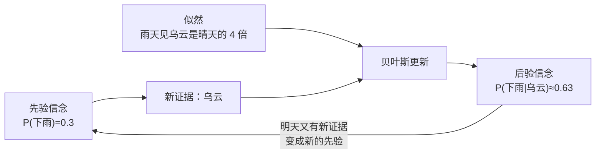
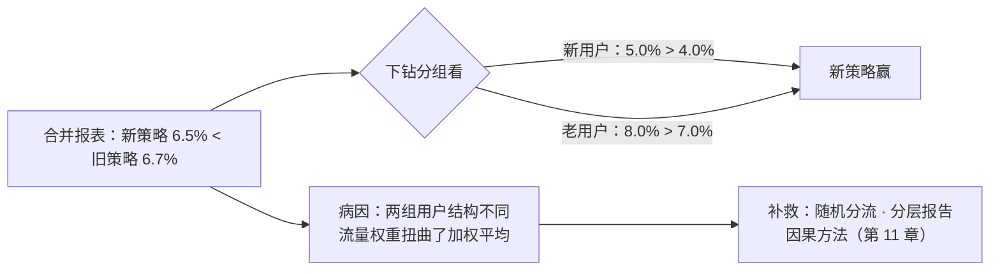
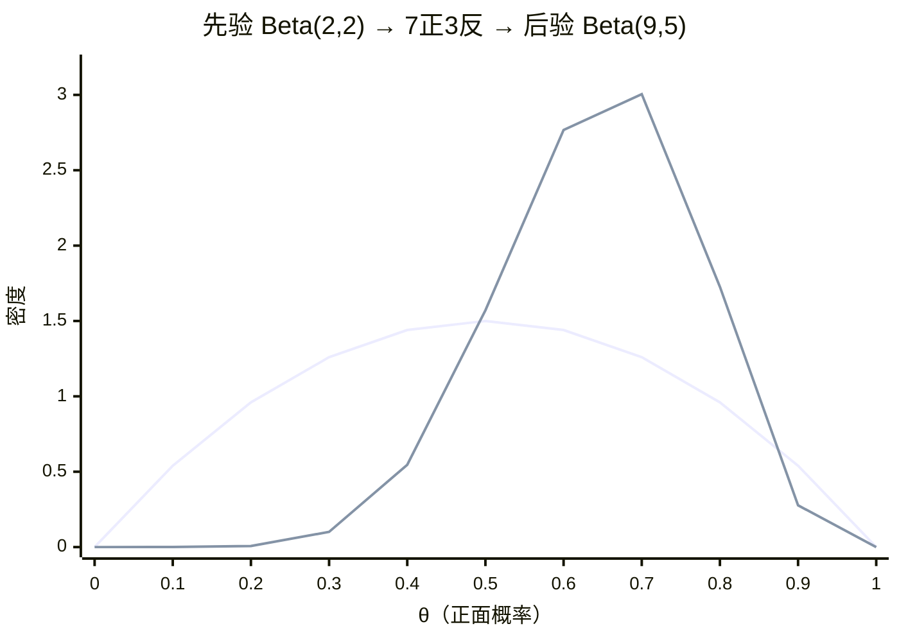

# 概率与统计

> **一句话理解**：概率与统计（Probability and Statistics）给你一套**在不确定中量化信念**的语言——模型输出的"把握有多大"、实验结论的"有多可信"、数据里是"规律"还是"噪声"，全靠它分辨。

[⬆️ 返回总目录](../../../README.md) · [⬆️ 返回本篇](../README.md) · [⬅️ 返回本章目录](./README.md)

| 属性 | 说明 |
|------|------|
| 难度 | ⭐⭐（进阶） |
| 所属分支 | 通用基础 |
| 前置知识 | [微积分与梯度](./03-微积分与梯度.md) |

---

## 📌 这一节解决什么问题

现实世界充满噪声：模型今天准确率 92%、明天 89%，是退步了还是正常波动？上线一个推荐策略，点击率涨了 0.2%，是真有效还是运气好？手里的数据永远只是样本、不是全世界——**你看到的，未必是全貌**。

机器学习恰好是一门"从样本学规律"的手艺，所以它需要一门语言来谈"可能性"与"可信度"。更巧的是，模型自己的输出也是概率（"是猫的概率 0.93"），连损失函数都是从概率里推出来的。可以说，概率统计是 AI 的**不确定性会计**。

本节把这条线走完整：分布怎么选、贝叶斯怎么更新、训练目标怎么从"最大化似然"推出来、为什么正态无处不在，以及两个最容易翻车的统计陷阱——小样本波动和辛普森悖论。

## 🌱 通俗理解

- **随机变量（Random Variable）**：还不知道结果、但知道所有可能性的量——明天的骰子、下一个刷到的视频。每种可能性配一个概率，合起来就是**分布（Distribution）**。
- **正态分布（Normal Distribution）= 身高曲线**：中间多、两头少、左右对称的钟形。人的身高、测量误差、模型预测的偏差，大量自然现象都长这样。
- **期望（Expectation）与方差（Variance）= 平均与波动**：两个班平均分都是 75，一个班 70~80 齐刷刷，另一个 50~100 两极分化——平均数一样，方差告诉你另一个故事。选方案如同选班级：期望看收益，方差看风险。
- **条件概率与贝叶斯（Bayes' Theorem）= 用证据更新信念**：出门前觉得"下雨概率 30%"；一抬头乌云密布，你心里默默把概率调高——人人都会本能地做贝叶斯，公式只是把这个动作写下来。
- **抽样 = 尝汤**：一锅汤咸不咸，喝一勺就知道（前提是搅匀了）。数据就是从"世界这锅汤"里舀的几勺——勺越多越准；勺太少，容易被一粒胡椒骗到。
- **熵（Entropy）= 平均惊讶程度**：越是"五五开"的事情，结果越让你惊讶（信息量大）；"十拿九稳"的事情，结果毫不意外。熵就是给"不确定性"记账的数——它将成为第 7 章损失函数的主角之一。

## 📋 举个例子

**掷 10 次骰子：感受"样本有波动"**。骰子的理论期望是 $(1+2+\cdots+6)/6 = 3.5$——没有任何一次能掷出 3.5，它只是"长期重复后的平均值"。真掷 10 次，比如得到：

$$
[3, 5, 1, 6, 2, 4, 1, 6, 3, 3]\;\Rightarrow\;\text{样本均值} = \frac{3+5+1+6+2+4+1+6+3+3}{10} = \frac{34}{10} = 3.4
$$

> 👉 **人话**：这 10 次的均值是 3.4，离理论值 3.5 差 0.1，这回运气不错。换一批 10 次，可能掷出 3.1 或 3.8——**样本有波动；次数越多，均值越向 3.5 收拢**。

这条直觉直接预言了机器学习里最重要的一条警戒线：**样本太少时，"样本里的规律"可能只是波动**——模型要是把波动也背下来，就是过拟合（Overfitting）的雏形，详见[模型评估与调优](../../2-经典机器学习/03-机器学习/07-模型评估与调优.md)。

**贝叶斯：看到乌云，更新下雨概率**。出门前的先验是 P(下雨)=0.3；你记得"雨天出现乌云的频率是晴天的 4 倍"（似然比 4）。更新后 P(下雨|乌云) 是多少？答案约 **0.63**——手算过程放折叠框：

<details>
<summary>📊 展开完整算例：贝叶斯更新一步一步算</summary>

最直观的算法是**按比例分蛋糕**：

- 出门前的信念（写成比例）：下雨 : 不下雨 = 0.3 : 0.7 = 3 : 7
- 乌云这条证据的调整：设雨天见乌云的概率是 0.8、晴天是 0.2（正好 4 倍），比例乘上调整：3×4 : 7×1 = 12 : 7
- 归一化成概率：$12/(12+7) = 12/19 \approx 0.63$

用标准公式验算（把"晴天也可能有乌云"算进分母）：

$$
P(\text{雨}\mid\text{乌云}) = \frac{0.8\times0.3}{0.8\times0.3 + 0.2\times0.7} = \frac{0.24}{0.38} \approx 0.63
$$

> 👉 **人话**：分子是"下雨且看到乌云"，分母再加上"晴天也看到乌云"的情况——乌云到底指向谁，两边一比就知道。

看到乌云，下雨的信念从 30% 跳到 63%——证据没有推翻先验，只是**重新称了它的重量**。垃圾邮件过滤、医学检验判读、语言模型挑下一个词，走的都是这一步。

</details>

**抛硬币的极大似然：训练目标的第一次手算**。掷 10 次硬币出 7 次正面，"正面概率 θ 最可能是多少"——完整手算放折叠框，答案是 $\hat{\theta}=0.7$。

<details>
<summary>📊 展开完整算例：抛硬币的极大似然估计（MLE）从零推一遍</summary>

设正面概率为 $\theta$，7 正 3 反这批数据的似然（这批数据被这枚硬币生成的概率）：

$$
L(\theta) = \theta^{7}(1-\theta)^{3}
$$

> 👉 **人话**：每次正面贡献一个 $\theta$、每次反面贡献一个 $1-\theta$，连乘起来。

连乘难求导，取对数变连加（$\log$ 单调，不改变最大值位置）：

$$
\ell(\theta) = 7\log\theta + 3\log(1-\theta)
$$

对 $\theta$ 求导并令其为零：

$$
\frac{7}{\theta} - \frac{3}{1-\theta} = 0 \;\Rightarrow\; 7(1-\theta) = 3\theta \;\Rightarrow\; 10\theta = 7 \;\Rightarrow\; \hat{\theta} = 0.7
$$

> 👉 **人话**：对数求导后，"7 次正面"和"3 次反面"拔河，平衡点恰好在 7/10——直觉答案就是数学答案。一般结论：$\hat{\theta} = \text{正面次数}/\text{总次数}$。

这正是"最小化交叉熵损失 = 最大化似然"的最小样本版——语言模型在亿万句子上做的事，骨架与这五行推导一模一样。

</details>

## 🧠 核心原理

### 整体流程



### 逐步拆解

**① 期望与方差：平均与波动**

$$
E[X] = \sum_{i} x_i \, p_i
$$

> 👉 **人话**：每个可能结果乘它的概率再加总——"如果反复玩很多次，平均每次能拿多少"。

$$
\mathrm{Var}(X) = E\left[(X - E[X])^2\right]
$$

> 👉 **人话**：每个点离平均数有多远，平方后取平均——波动（风险）的标尺。方差开根号就是标准差（Standard Deviation）；正态分布里，均值 ±1 个标准差大约盖住 68% 的样本。

**② 条件概率与贝叶斯：用证据更新信念**

$$
P(A\mid B) = \frac{P(B\mid A)\,P(A)}{P(B)}
$$

> 👉 **人话**：看到 B 之后 A 的可信度 = 原来的可信度乘上证据的调整，再归一化。"看到了证据 ≠ 找到了原因"——把这件事讲严格的，是[相关不等于因果](../../4-专业方向/11-因果推断/01-相关不等于因果.md)。

把公式的四个零件各自命名，就是**贝叶斯完整链路**：

| 零件 | 记号 | 在乌云例子里是 | 人话 |
|------|------|----------------|------|
| 先验 Prior | $P(A)$ | P(下雨)=0.3 | 看到证据之前，你原有的信念 |
| 似然 Likelihood | $P(B\mid A)$ | 雨天见乌云 0.8 | "若是它，证据有多像" |
| 证据 Evidence | $P(B)$ | 0.38（分母） | **所有可能世界**里看到这条证据的总概率 |
| 后验 Posterior | $P(A\mid B)$ | ≈0.63 | 更新后的信念，也是明天的先验 |

一句话版本：**后验 ∝ 先验 × 似然**。

**证据为什么难算、以及后人怎么办**：分母 $P(B)=\sum_{A} P(B\mid A)P(A)$ 要对**所有可能的假设**求和——参数是连续的（比如"θ 是 0~1 之间任意实数"）就变成积分，参数是百万维神经网络的权重时根本无法穷举。于是出现三条退路：(a) 干脆不要分母——比较后验相对大小只需要分子（很多判别任务够用）；(b) 近似它——变分推断、MCMC 采样（概率图模型的看家本领）；(c) 只取后验最大的那一个点——最大后验（MAP）/极大似然（MLE），**现代深度学习训练走的基本是这条路**：不追完整的后验分布，只找最可能的那组参数。

**③ 最大似然估计（Maximum Likelihood Estimation, MLE）：训练的另一种视角**

$$
\hat{\theta} = \arg\max_{\theta}\; P(D\mid\theta)
$$

> 👉 **人话**：反过来问——哪组参数最可能"生成"我手里这批数据？就选它。硬币掷 10 次出 7 次正面，你脱口而出"这硬币正面概率约 0.7"，就是在做最大似然。

训练模型时"最小化交叉熵损失"，本质就是"最大化似然"——**损失函数不是拍脑袋定的，是从概率里推出来的**。这也是"把业务目标写成损失"的思想源头（见本章收官页）。

<details>
<summary>🧮 展开推导：高斯噪声下，最小二乘 = 最大似然（完整版）</summary>

设每个样本的真实关系是 $y_i = \mathbf{x}_i^T w + \varepsilon_i$，噪声 $\varepsilon_i \sim N(0, \sigma^2)$ 独立同分布。那么在参数 $w$ 下"看到这批数据"的概率是各样本概率的连乘：

$$
P(D\mid w) = \prod_{i=1}^{N} \frac{1}{\sqrt{2\pi\sigma^2}}\exp\!\left(-\frac{(y_i-\mathbf{x}_i^T w)^2}{2\sigma^2}\right)
$$

取对数（连乘变连加）：

$$
\log P(D\mid w) = -\frac{N}{2}\log(2\pi\sigma^2) - \frac{1}{2\sigma^2}\sum_{i=1}^{N}(y_i-\mathbf{x}_i^T w)^2
$$

> 👉 **人话**：第一项与 $w$ 无关；第二项就是"误差平方和"乘了一个负系数。

最大化 $\log P(D\mid w)$ ⟺ 最小化 $\sum_i (y_i-\mathbf{x}_i^T w)^2$——**最小二乘的"平方"，是"噪声服从正态"这个假设的影子**。换噪声假设就会推出别的损失：噪声服从拉普拉斯分布推出绝对值损失（MAE），重尾噪声推出 Huber——第 3 章[线性回归](../../2-经典机器学习/03-机器学习/02-线性回归.md)会用到这个结论：**选损失 = 隐含选噪声假设**。

</details>

**④ 大数定律与中心极限定理：抽样的两条铁律**

$$
\bar{X}_n \;\longrightarrow\; \mu \quad (n \to \infty)
$$

> 👉 **人话**（大数定律，Law of Large Numbers）：样本越多，样本均值越贴近真值——汤搅匀了，多喝几勺总不会错。反过来：**勺太少时尝到的咸淡不足为凭**，这正是过拟合与"假显著"的温床。

大数定律只说"均值会到哪"，**中心极限定理（Central Limit Theorem, CLT）更进一步说"它怎么晃过去"**：不管原始分布长什么样（骰子？收入？点击数？），只要独立、方差有限，样本均值标准化之后都趋向正态，晃动的标准差按 $\sigma/\sqrt{n}$ 缩小：

$$
\bar{X}_n \approx N\!\left(\mu,\ \frac{\sigma^2}{n}\right)
$$

> 👉 **人话**：均值围绕真值晃，样本量翻 4 倍，晃动半径减半。骰子单次 σ≈1.71，掷 10 次的均值标准差 ≈ 0.54——所以掷出 3.1（离 3.5 约 0.74σ）完全正常；掷 10000 次时晃动半径只剩 0.017，均值自然稳稳贴住 3.5。上一节代码里"10 次=3.1、100 次=3.73、10000 次=3.47"的现象，被这一个公式全部解释。

| 定律 | 回答的问题 | 一句话 |
|------|-----------|--------|
| 大数定律 LLN | 均值**收敛到哪** | 次数够多，均值贴住真值 |
| 中心极限 CLT | 均值**怎么晃、晃多快** | 均值的分布趋向正态，幅度 $\sigma/\sqrt{n}$ |

**为什么"到处是正态"**：现实中大量指标是"许多独立小因素相加"的结果——身高（基因+营养+环境…）、测量误差、模型预测偏差。加法会把各种奇怪形状的分布叠加成钟形（CLT 的直接推论）。连扩散模型的"逐步加噪"，加的也是高斯噪声——见[扩散模型](../../5-前沿与融合/12-生成模型与多模态/03-扩散模型Diffusion.md)。**失效边界**：金融收入这类**重尾（Heavy Tail）**数据方差极大甚至无限，CLT 收敛极慢——"样本量大就正态"的直觉在此失灵，建模前先画图看尾巴。

**⑤ 常见分布族：给现象挑对"模板"**

| 分布 | 一句话模型 | AI 里的出场 |
|------|-----------|-------------|
| 伯努利 Bernoulli | 单次试验的成/败 | 一次曝光点/不点；逻辑回归的输出就是一个伯努利的 θ，见[逻辑回归与分类](../../2-经典机器学习/03-机器学习/03-逻辑回归与分类.md) |
| 二项 Binomial | n 次独立试验的成功次数 | 一千次曝光的点击数；A/B 实验样本量计算的底座 |
| 泊松 Poisson | 单位时间/空间内的事件数 | 每秒请求数、每页广告点击数等稀疏计数 |
| 均匀 Uniform | 各点等可能 | 权重随机初始化；A/B 流量随机分桶 |
| 正态 Normal | 多因素叠加的噪声 | 回归噪声假设、测量误差、CLT 产物、扩散模型加噪 |
| 指数 Exponential | 两次事件的间隔时长 | 用户停留时长、下次点击的等待时间；"无记忆性" |

> 👉 **人话**：拿到数据先问"它是计数、比例、时长还是误差？"——计数想泊松，成败想伯努利/二项，间隔想指数，多因素噪声想正态。挑对模板，后面的推断才有的放矢。

**⑥ 信息熵与交叉熵：损失函数的概率出身**

$$
H(p) = -\sum_i p_i \log p_i
$$

> 👉 **人话**：熵（Entropy）= 平均惊讶程度。四选一纯猜（$p=0.25$ 每项）熵 = 2 比特；十拿九稳的事熵 ≈ 0.47 比特——越不确定，熵越大；完全确定，熵为 0。

$$
H(p, q) = -\sum_i p_i \log q_i
$$

> 👉 **人话**：交叉熵（Cross Entropy）= **用模型的答案 q 去编码真实世界 p** 时的平均惊讶程度。模型把真话的概率猜得越低，你越惊讶，惩罚越大。三分类小算例：真实是"猫"（$p=[1,0,0]$）——模型说 $q=[0.9, 0.1, 0]$，交叉熵 $=-\log 0.9 \approx 0.105$；模型说 $q=[0.5, 0.5, 0]$，$-\log 0.5 \approx 0.693$；模型彻底猜反 $q=[0.1, 0.9, 0]$，$-\log 0.1 \approx 2.30$——**猜错方向比"不知道"罚得重得多**。

这就是第 7 章语言模型损失函数的形状：训练 = 最小化"真实下一个词分布 $p$"与"模型分布 $q$"的交叉熵；且 $H(p,q) = H(p) + \mathrm{KL}(p\Vert q)$，$p$ 固定时最小化交叉熵 = 把模型的 $q$ 拉近真实 $p$（KL 散度，Kullback–Leibler Divergence，衡量两个分布差多远）。见[大语言模型 LLM 全景](../../4-专业方向/07-自然语言处理与LLM/04-大语言模型LLM全景.md)。

**⑦ 辛普森悖论：分组全赢、合并翻车**

一场 A/B 实验：新策略在新用户、老用户里**点击率都更高**，合并报表却**更低**——这不是算错，是可能真实发生的事。小数字现场：

| 分组 | 新策略 CTR | 旧策略 CTR | 谁赢 |
|------|-----------|-----------|------|
| 新用户 | 5000/100000 = **5.0%** | 400/10000 = 4.0% | 新策略 |
| 老用户 | 8000/100000 = **8.0%** | 6300/90000 = 7.0% | 新策略 |
| 合并 | 13000/200000 = 6.5% | 6700/100000 = **6.7%** | 旧策略？！ |

> 👉 **人话**：概率视角看破绽——合并概率是**加权平均**：$P(\text{点击}\mid\text{策略}) = \sum_s P(\text{点击}\mid\text{策略}, s)\,P(s\mid\text{策略})$，权重是**该策略各组流量的占比**。本例旧策略 90% 流量给了天生点击率高的老用户、新策略新老对半——**两组的用户结构不同**，结构差淹没了策略差。像"巧克力销量与诺奖得主数相关"一样，合并数字里藏着一个混淆变量。



**症状**：分维度看和看总体的结论打架。**诊断**：永远做分层下钻（新老、渠道、地区），检查两组的流量结构是否一致。**补救**：实验分流必须随机（结构相同才能直接比总数）；报表分层呈现；要看"策略本身"的效果就得靠因果推断——见[相关不等于因果](../../4-专业方向/11-因果推断/01-相关不等于因果.md)与[因果推断方法工具箱](../../4-专业方向/11-因果推断/02-因果推断方法工具箱.md)。

<details>
<summary>📊 展开算例：朴素贝叶斯垃圾邮件过滤（3 个词，手算到底）</summary>

训练集统计（20 封邮件：垃圾 8 封、正常 12 封）：

- $P(\text{垃圾})=0.4$，$P(\text{正常})=0.6$
- "中奖"：垃圾邮件中 6/8 = 0.75；正常邮件中 1/12 ≈ 0.083
- "发票"：垃圾 4/8 = 0.5；正常 1/12 ≈ 0.083
- "会议"：垃圾 1/8 = 0.125；正常 8/12 ≈ 0.667

新邮件包含【中奖、发票、会议】。朴素贝叶斯（Naive Bayes）假设**各词在给定类别下相互独立**，概率连乘：

$$
P(\text{垃圾}\mid\text{邮件}) \propto 0.4 \times 0.75 \times 0.5 \times 0.125 = 0.01875
$$

$$
P(\text{正常}\mid\text{邮件}) \propto 0.6 \times 0.083 \times 0.083 \times 0.667 \approx 0.00278
$$

归一化：$0.01875/(0.01875+0.00278) \approx 87\%$——判为垃圾邮件。整个推断就是贝叶斯公式 + "词独立"这个朴素假设，它是**生成式模型**（先学"类别长什么样"再反推）的最小样板，同族思想见[机器学习全景](../../2-经典机器学习/03-机器学习/01-机器学习全景.md)。

**失败模式**：若"发票"在正常邮件中出现 0 次，$P(\text{发票}\mid\text{正常})=0$，一个词就把正常类**一票否决**（连乘里乘 0）——训练数据没见过 ≠ 世界里没有。**补救**：拉普拉斯平滑（Laplace Smoothing），每个计数加 1（分母加类别数）：$(0+1)/(12+2)\approx 0.071$，零概率被托底。另一个失效：词之间并不独立（"中奖"和"发票"常同现），连乘会**过度自信**——朴素假设的代价，工程上取对数求和并用词频加权缓解。

</details>

### 📐 数学深潜：条件期望是最优预测子——E[Y|X] 的冠军证明

**③把训练目标从概率里推了出来；这一节回答一个更基础的问题**：在所有"只看 X 猜 Y"的函数里，谁是均方误差的冠军？答案是条件期望（Conditional Expectation）$\mathbb{E}[Y\mid X]$——冠军身份可以完整证明，证明还白送一条误差地板公式。

**严格陈述。** 在所有"只看 X"的函数 $g(X)$ 中：

$$
g^{\star}=\mathbb{E}[Y\mid X]\quad\text{最小化}\quad \mathbb{E}\big[(Y-g(X))^2\big]
$$

且冠军成绩为 $\mathbb{E}\big[\mathrm{Var}(Y\mid X)\big]$——**条件方差的期望，不可消除的误差地板**。

> 👉 **人话**：只许看特征 X、按平方算账，理论最优预测就是"每个 X 分组内部的平均值"；哪怕冠军上场，误差也剩 E[Var(Y|X)]——组内还剩的随机性，谁也猜不掉。

**完整推导：把误差拆成"地板 + 你的差距"，冠军一步登顶。**

<details>
<summary>🧮 展开推导：加一项减一项，塔式期望把交叉项逐个收掉</summary>

**工具：塔式期望（重期望公式）。** 对任意期望存在的 $U$：$\mathbb{E}[U]=\mathbb{E}\big[\mathbb{E}[U\mid X]\big]$——先组内平均、再跨组平均，等于直接平均。记 $m(X)=\mathbb{E}[Y\mid X]$（条件期望是 X 的函数），则 $\mathbb{E}[Y-m(X)\mid X]=m(X)-m(X)=0$（每组内 Y 围绕自己的组均值波动、均值为零）。

**主推导。** 任取 $g(X)$，记 $h(X)=m(X)-g(X)$，加减 $m(X)$：$Y-g(X)=\big(Y-m(X)\big)+h(X)$。平方取期望，用 $\mathbb{E}[(A+B)^2]=\mathbb{E}[A^2]+2\mathbb{E}[AB]+\mathbb{E}[B^2]$：

$$
\mathbb{E}\big[(Y-g)^2\big]=\underbrace{\mathbb{E}\big[(Y-m)^2\big]}_{\text{①地板}}+\underbrace{2\,\mathbb{E}\big[(Y-m)\,h(X)\big]}_{\text{②交叉项}}+\underbrace{\mathbb{E}\big[h(X)^2\big]}_{\text{③差距}}
$$

**交叉项 = 0（整个证明的枢纽）**：$h(X)$ 是 X 的函数，条件期望内可以"先固定、提出来"：

$$
\mathbb{E}\big[(Y-m)h(X)\big]=\mathbb{E}\Big[\mathbb{E}\big[(Y-m(X))h(X)\ \big|\ X\big]\Big]=\mathbb{E}\Big[h(X)\cdot\mathbb{E}\big[Y-m(X)\ \big|\ X\big]\Big]=\mathbb{E}\big[h(X)\cdot0\big]=0
$$

（第一步用塔式期望；第二步把条件内的常数 $h(X)$ 提出条件号；第三步代入组内零均值。）

**地板 = E[Var(Y|X)]**：条件内"离组均值平方的期望"正是条件方差的定义：

$$
\mathbb{E}\big[(Y-m)^2\big]=\mathbb{E}\Big[\mathbb{E}\big[(Y-m)^2\ \big|\ X\big]\Big]=\mathbb{E}\big[\mathrm{Var}(Y\mid X)\big]
$$

**拼起来**：

$$
\mathbb{E}\big[(Y-g(X))^2\big]\ =\ \mathbb{E}\big[\mathrm{Var}(Y\mid X)\big]\ +\ \mathbb{E}\big[\big(m(X)-g(X)\big)^2\big]\ \ge\ \mathbb{E}\big[\mathrm{Var}(Y\mid X)\big]
$$

等号当且仅当 $g(X)=m(X)$（③为零）——**冠军唯一：$g^{\star}=\mathbb{E}[Y\mid X]$**。∎

**数字小算例。** $X=$ 是否下雨，$Y=$ 外卖时长（分钟）：不下雨组均值 30、方差 25；下雨组均值 50、方差 25；下雨概率 0.5。
- 冠军 $g^{\star}=m(X)$（30 / 50）：成绩 $=25$（地板）；
- 无脑常数 $g\equiv40=\mathbb{E}[Y]$：地板 $25$ + 差距 $\frac{(30-40)^2+(50-40)^2}{2}=100$ → 成绩 **125**；
- 分解式逐项可验：$125=25+100$ ✓——"看 X"这一步把误差砍掉 100。

</details>

**概率图景（ASCII）——Y 的方差被 X 切成两块：**

```text
 Var(Y)（不看 X 的总波动）
 ├── 组间部分：Var(m(X))   ← m(X) 随 X 摆动 —— 被"看 X"吃掉的部分
 └── 组内部分：E[Var(Y|X)] ← 给定 X 后仍随机 —— 冠军也拿不走的误差地板

 两本账互通（全方差公式）：Var(Y) = E[Var(Y|X)] + Var(E[Y|X])
 上例验算：125 = 25 + 100 ✓
```

**反例与边界。**

1. **换损失函数，冠军换人**：绝对值损失下最优是**条件中位数**（对离群点稳健）；0-1 损失下是**条件众数**。"条件期望最优"是平方损失专属——而选平方损失 ⟺ 假设高斯噪声（本页 ③ 的闭环：损失函数不是拍脑袋，是噪声假设的投影）；
2. **现实里 $\mathbb{E}[Y\mid X]$ 未知**：它是无限样本的量，机器学习模型全是它的**估计**——回归树分段逼近、神经网络全局逼近。过拟合的本质：把 $\mathbb{E}[\mathrm{Var}(Y\mid X)]$ 这块地板也试图背下来（[模型评估与调优](../../2-经典机器学习/03-机器学习/07-模型评估与调优.md)的偏差-方差分解与本式同源：地板=噪声项）；
3. **$Y$ 与 $X$ 独立时冠军退化**：$m(X)\equiv\mathbb{E}[Y]$ 常数——再多特征也只配"猜均值"（[机器学习全景](../../2-经典机器学习/03-机器学习/01-机器学习全景.md)里"见房就报 316.7 万"的理论解释）。

> 👉 **人话总结**：平方损失下"最优预测"有标准答案——每个 X 分组的组内均值；误差被拆成"组内噪声地板 + 你离组均值的差距"，一切监督学习都是在逼近这张"组均值表"，谁也压不过地板。

### 📐 数学深潜：Beta–二项共轭——先验 + 数据 = 后验的完整算例

**②的贝叶斯链路（后验 ∝ 先验 × 似然）**通常算不出闭式（分母要对所有假设求和）。但有一对黄金搭档能一步到位：**Beta 先验配二项数据**——后验还是 Beta，参数直接往里加。这就是**共轭（Conjugacy）**，也是贝叶斯方法能"流式滚动更新"的数学基础。

**严格陈述。** 先验 $\theta\sim\mathrm{Beta}(\alpha,\beta)$，密度

$$
p(\theta)=\frac{\theta^{\alpha-1}(1-\theta)^{\beta-1}}{B(\alpha,\beta)},\qquad B(\alpha,\beta)=\frac{\Gamma(\alpha)\Gamma(\beta)}{\Gamma(\alpha+\beta)}
$$

> 👉 **人话**：Beta 分布活在 $[0,1]$ 上（恰好是"概率的概率"）：$\alpha$ 数成功、$\beta$ 数失败，$\alpha+\beta$ 是"先验虚拟样本数"（先验多强硬），$\frac{\alpha}{\alpha+\beta}$ 是先验均值。

观测 $n$ 次独立试验、成功 $k$ 次（$K\sim\mathrm{Binomial}(n,\theta)$），则后验**仍是 Beta**：

$$
\theta\ \big|\ K=k\ \sim\ \mathrm{Beta}(\alpha+k,\ \beta+n-k)
$$

> 👉 **人话**：数据来了直接**加账**：成功次数加到 α、失败次数加到 β——"昨天算完的后验，今天当先验接着加"，一条流水线永不换公式。

**完整推导：贝叶斯公式逐项代入，指数一对上就认出同族。**

<details>
<summary>🧮 展开推导：先验 × 似然 → 同底数幂合并 → 归一化系数自动到位</summary>

**第一步：写似然。** 给定 $\theta$，$n$ 次里恰好 $k$ 次成功（二项分布）：

$$
P(K=k\mid\theta)=\binom{n}{k}\ \theta^{k}(1-\theta)^{n-k}
$$

**第二步：贝叶斯公式，只留 θ 的因子。**

$$
p(\theta\mid K=k)=\frac{P(K=k\mid\theta)\,p(\theta)}{\int_0^1P(K=k\mid\theta')\,p(\theta')\ \mathrm{d}\theta'}\ \propto\ \theta^{k}(1-\theta)^{n-k}\cdot\theta^{\alpha-1}(1-\theta)^{\beta-1}
$$

（分母是对 θ 的积分，与 θ 无关；$B(\alpha,\beta)$、$\binom{n}{k}$ 同样与 θ 无关——全部收进"常数"。）**同底数幂相加**：

$$
p(\theta\mid k)\ \propto\ \theta^{\alpha+k-1}\,(1-\theta)^{\,\beta+n-k-1}
$$

**第三步：认出同族。** 这个"指数形状"与 Beta 密度的形状 $\theta^{a-1}(1-\theta)^{b-1}$ 完全一致（$a=\alpha+k$、$b=\beta+n-k$）；归一化常数由"密度积分为 1"唯一确定——形状是 Beta，常数就**只能**是 $\frac{1}{B(a,b)}$。故 $\theta\mid k\sim\mathrm{Beta}(\alpha+k,\ \beta+n-k)$。∎

**流式更新自洽性检查**：两批数据 $(k_1,n_1)$、$(k_2,n_2)$——先更新成 $\mathrm{Beta}(\alpha+k_1,\ \beta+n_1-k_1)$ 再当先验叠加第二批，得 $\mathrm{Beta}(\alpha+k_1+k_2,\ \beta+n_1+n_2-k_1-k_2)$；与"合并成 $(k_1+k_2,\ n_1+n_2)$ 一次更新"**结果完全相同**——贝叶斯的"今天 posterior = 明天 prior"没有缝。

</details>

**完整小算例：一枚可疑的硬币。**

| 阶段 | 模型 | 均值 $\frac{\alpha}{\alpha+\beta}$ | 解读 |
|------|------|------|------|
| 先验 | Beta(2, 2) | 0.500 | "温和怀疑不均匀"——相当于 4 次虚拟投掷（2 正 2 反） |
| 抛 10 次 7 正 3 反 | Beta(2+7, 2+3) = **Beta(9, 5)** | 9/14 ≈ **0.643** | 虚拟 4 次 + 真实 10 次合并：14 次 9 正 |
| 再抛 10 次 5 正 5 反 | Beta(9+5, 5+5) = **Beta(14, 10)** | 14/24 ≈ **0.583** | 24 次里 14 正，先验占比被冲稀 |

> 👉 **人话**：后验均值 0.643 被拉离先验的 0.5、又没到 MLE 的 0.7——先验像"4 次虚拟投掷"混进真实 10 次；第二批数据到了继续加账，均值滑向 0.583。**数据越多，"虚拟票"占比越小，后验越被数据接管**——贝叶斯版的大数定律。预测下一次正面朝上的概率 = 后验均值（0.643），一步到手。

**概率图景（先验 → 后验的形状迁移）：**



> 👉 **人话**：先验是对称的缓丘（"哪儿都可能"）；数据一到，密度整体向右搬、且**变尖**（不确定性收缩）——峰在 9/14≈0.64 附近，正是"虚拟票 + 真实票"合算出的均值。

**反例与边界。**

1. **共轭是数学便利，不是物理必然**：它要求先验族与似然"配套"（Beta 配伯努利/二项，高斯配高斯均值）。先验换形状（混合 Beta、或深度网络的百万维权重先验），后验没有闭式——只能走本页 ② 的三条退路（只比分子 / 变分与 MCMC 近似 / 只取 MAP 点）；
2. **先验强度的双刃剑**：$\alpha+\beta$ 越大后验越"顽固"——小数据上先验主导（生成式方法小样本友好的来源之一）；但 Beta(9999, 1) 这类先验会看淡几乎一切数据（后验均值锁在 0.9998 附近）——"先验错得离谱，后验一本正经地错下去"（本页误区五的公式版）。工程默认 Beta(1,1)=均匀（不表态）或 Jeffreys 先验 Beta(0.5, 0.5)；
3. **似然前提是"给定 θ 独立同分布"**：样本相关（同一用户重复点击、时间序列自相关）时 $\theta^k(1-\theta)^{n-k}$ 连乘失效，公式不适用——先核对独立性再套共轭。

> 👉 **人话总结**：Beta 先验像"赛前已投的虚拟票"（α 正 β 负），真实数据到了往票堆里直接加；先验、似然、后验全在 Beta 一族里无缝滚动——这就是共轭，贝叶斯更新最省力的一条流水线。

## 💻 动手试试

```python
import numpy as np

rng = np.random.default_rng(42)        # 固定种子，结果可复现

# ① 掷骰子：次数越多，样本均值越贴近理论期望 3.5（LLN）
for n in [10, 100, 10_000]:
    dice = rng.integers(1, 7, size=n)  # 掷 n 次骰子（1~6 均匀分布）
    print(f"掷 {n:>5} 次：样本均值 = {dice.mean():.3f}")

# ② 正态抽样：模拟身高分布 N(170, 7²)
heights = rng.normal(loc=170, scale=7, size=100_000)
print(f"身高：均值 = {heights.mean():.2f}，标准差 = {heights.std():.2f}")
share = np.mean(np.abs(heights - 170) < 7)   # 落在 ±1 个标准差内的比例
print(f"170±7cm 内占比：{share:.1%}")

# ③ 中心极限定理：把「均匀分布」的样本均值反复抽样，看它长成钟形
means = [rng.integers(1, 7, 10).mean() for _ in range(5000)]  # 5000 组「掷 10 次的均值」
means = np.array(means)
print(f"均值之均值 = {means.mean():.3f}（→3.5），均值之标准差 = {means.std():.3f}（理论 σ/√n ≈ {1.708/np.sqrt(10):.3f}）")

# ④ 朴素贝叶斯垃圾邮件：复现上面的手算
p_spam, p_ham = 0.4, 0.6
like = {"中奖": (0.75, 1/12), "发票": (0.5, 1/12), "会议": (0.125, 8/12)}
score_spam = p_spam * np.prod([w[0] for w in like.values()])   # 垃圾分支：先验×似然连乘
score_ham  = p_ham  * np.prod([w[1] for w in like.values()])   # 正常分支
print(f"判垃圾概率 = {score_spam / (score_spam + score_ham):.1%}")   # ≈87%

# 预期输出（种子 42，节选）：
# 掷    10 次：样本均值 = 3.100   ← 10 次时飘到 3.1，很正常（CLT：±0.54 内）
# 掷   100 次：样本均值 = 3.730   ← 100 次仍可能偏到 3.7
# 掷 10000 次：样本均值 = 3.474   ← 一万次稳稳贴住 3.5
# 身高：均值 = 169.97，标准差 = 7.03；170±7cm 内占比：68.2%  ← 68-95-99.7 规律
# 均值之均值 = 3.500，均值之标准差 ≈ 0.54  ← 均匀分布的均值也趋于正态（CLT）
# 判垃圾概率 = 87.1%
```

**改什么、看什么**：

- ③ 把每组次数从 10 改成 40：均值之标准差减半（$\sigma/\sqrt{n}$ 的现场）；把骰子改成 `rng.random(10)`（0~1 均匀）：均值照样钟形、照样收敛——**原始分布长啥样不重要**；
- ④ 把"会议"的正常邮件计数从 8 改成 0（`like` 里改成 0）：正常分支直接归零、判垃圾概率变 100%——一票否决现场；再给每个计数 +1（拉普拉斯平滑）看概率如何回到合理区间。

## 🔥 炼丹小灶

> 🔥 **炼丹小灶**：损失与实验的统计起点——
> - 配方：分类默认交叉熵、回归默认 MSE，目标噪声大就换 Huber（= 换噪声假设）；建模前先画直方图看分布和尾巴，别只对着均值谈恋爱。
> - 玄学：线上效果判断永远走 A/B 实验并看显著性——离线涨的那半个百分点，常常只是抽样波动（±2σ/√n 心算一下就知道）；报表结论和分组结论打架时，先怀疑辛普森，再怀疑人生。
> - ⚠️ 以上是经验参考，不是圣旨。

## 🖱️ 动手玩

> 🕹️ **延伸玩一玩**：[Seeing Theory](https://seeing-theory.brown.edu)——布朗大学出品的可视化概率教材，拖动滑块就能"看见"分布、期望和贝叶斯更新，本页每个概念都有动画版。

## 🔗 在知识树中的位置

- **上游**：[微积分与梯度](./03-微积分与梯度.md)——最大似然"取对数再求导"的套路与梯度一脉相承；[为什么要学数学](./01-为什么要学数学.md)——旅程图里"评估效果"的那一站
- **下游**：[相关不等于因果](../../4-专业方向/11-因果推断/01-相关不等于因果.md)——证据里的"相关性"怎么被混淆变量污染；[模型评估与调优](../../2-经典机器学习/03-机器学习/07-模型评估与调优.md)——过拟合就是"把抽样波动当规律"；[大语言模型 LLM 全景](../../4-专业方向/07-自然语言处理与LLM/04-大语言模型LLM全景.md)——语言模型的本质是"下一个词的概率分布"，训练目标是交叉熵；[扩散模型](../../5-前沿与融合/12-生成模型与多模态/03-扩散模型Diffusion.md)——"逐步加高斯噪声再去噪"的生成范式
- **横向对比**：频率派 vs 贝叶斯派——一句话：一个问"数据能证明什么"，一个问"我该信多少"。本库不站队，两种工具箱都会用到。

## ⚠️ 常见误区

- **误区一**："相关就是因果" → 一个经典例子：某国巧克力销量与诺贝尔奖得主数高度相关，但吃巧克力并不会得诺奖。辛普森悖论更进一步：连"方向"都能被混淆变量翻转（分组全赢、合并全输）。分辨相关背后的因果，要靠专门的方法，见[相关不等于因果](../../4-专业方向/11-因果推断/01-相关不等于因果.md)。
- **误区二**："小样本里看出的规律也很可靠" → 10 次骰子均值都能飘到 3.1（见上面的代码）；样本小的时候，波动大到能把噪声扮成规律。
- **误区三**："期望相同，两个方案就一样好" → 平均收益相同，方差小的先活下来；风控场景里，方差往往比期望更致命。
- **误区四**："样本量大了自然就是正态" → CLT 有前提：独立、方差有限。收入、极端事件这类重尾数据收敛极慢，"大样本直觉"会给出错误的安全感——先看尾巴。
- **误区五**："贝叶斯给出了定量答案，答案就可信" → 后验 = 先验 × 似然，先验错得离谱（或似然假设错了），后验会一本正经地错下去——垃圾进、垃圾出。

## 📝 小结与自测

**要点回顾**

- 随机变量 + 分布描述不确定性；分布族各有分工（计数想泊松、成败想伯努利、间隔想指数、噪声想正态）；
- 期望 = 平均，方差 = 波动；评估方案两把尺子都要看；
- 贝叶斯完整链路：后验 ∝ 先验 × 似然，证据是分母、也是它最难算——深度学习选了"只找后验最优点"的退路；
- 最大似然 = 找最可能"生成"这批数据的参数；高斯噪声下它推出的正是最小二乘——选损失 = 隐含选噪声假设；
- 大数定律说"均值到哪"，中心极限说"怎么晃"（正态、$\sigma/\sqrt{n}$）——到处是正态是 CLT 的加法效应；
- 交叉熵 = 用模型编码现实的平均惊讶度，猜错方向罚得最重——语言模型损失的概率出身；
- 辛普森悖论：合并报表被流量结构扭曲，结论和分组打架时先下钻、再谈因果。

**自测一下**（点击展开答案）

<details>
<summary>问题 1：掷 10 次骰子，样本均值一定接近 3.5 吗？</summary>

不一定。本页代码（种子 42）掷 10 次的均值是 3.100。大数定律只在"次数足够多"时兑现——10000 次时均值 3.474，才稳稳贴住 3.5。CLT 进一步定量：10 次时均值的标准差约 0.54，飘到 3.1 在 1.5σ 以内，很正常。

</details>

<details>
<summary>问题 2：先验 P(下雨)=0.3，乌云的似然比是 4（雨天见乌云是晴天的 4 倍），后验是多少？</summary>

比例法：3 : 7 先乘上 4 : 1，得 12 : 7；归一化 $12/19 \approx 0.63$。看到乌云后，下雨的信念从 30% 升到约 63%。

</details>

<details>
<summary>问题 3：为什么说"过拟合"本质上是个统计问题？</summary>

训练集只是从真实世界抽的一小撮样本，样本里天然带抽样波动；模型容量一大，就会把波动也当成规律背下来——在训练集上很准，换一批数据就露馅。

</details>

<details>
<summary>问题 4：掷 10 次硬币 7 次正面，MLE 给出的 θ 是多少？写出关键一步。</summary>

$\hat{\theta}=7/10=0.7$。对数似然 $\ell(\theta)=7\log\theta+3\log(1-\theta)$ 求导置零：$7/\theta = 3/(1-\theta)$，解得 $\theta=0.7$。

</details>

<details>
<summary>问题 5：真实是"猫"，模型 A 猜猫 0.9、模型 B 猜猫 0.5，交叉熵各是多少？说明什么？</summary>

A：$-\log 0.9\approx 0.105$；B：$-\log 0.5\approx 0.693$。模型越准，交叉熵越小；若猜 0.1 则 $-\log 0.1\approx 2.30$——猜错方向比"不知道"罚得更重，这是它当损失函数的核心气质。

</details>

<details>
<summary>问题 6：A/B 实验里新策略在每一层用户都赢，合并却输了，最可能发生了什么？</summary>

辛普森悖论：两组流量结构不同，合并概率是按各组占比加权的，结构差淹没了策略差。对策：确认分流随机、做分层报告；要估计策略本身的因果效应，用第 11 章的因果方法。

</details>

## 📚 延伸阅读

- 交互教材：Seeing Theory（seeing-theory.brown.edu，中文可切换）
- 免费书：An Introduction to Statistical Learning（statlearning.com）
- 视频频道：StatQuest with Josh Starmer（YouTube）

---

[⬅️ 上一页：微积分与梯度](./03-微积分与梯度.md) · [返回本章目录](./README.md) · [下一页：生产实战 ➡️](./99-生产实战.md)
