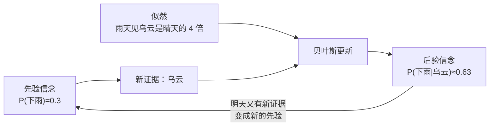

# 概率与统计

> **一句话理解**：概率与统计（Probability and Statistics）给你一套**在不确定中量化信念**的语言——模型输出的"把握有多大"、实验结论的"有多可信"、数据里是"规律"还是"噪声"，全靠它分辨。

[⬆️ 返回总目录](../../../README.md) · [⬆️ 返回本篇](../README.md) · [⬅️ 返回本章目录](./README.md)

| 属性 | 说明 |
|------|------|
| 难度 | ⭐⭐（进阶） |
| 所属分支 | 通用基础 |
| 前置知识 | [微积分与梯度](./03-微积分与梯度.md) |

---

## 📌 这一节解决什么问题

现实世界充满噪声：模型今天准确率 92%、明天 89%，是退步了还是正常波动？上线一个推荐策略，点击率涨了 0.2%，是真有效还是运气好？手里的数据永远只是样本、不是全世界——**你看到的，未必是全貌**。

机器学习恰好是一门"从样本学规律"的手艺，所以它需要一门语言来谈"可能性"与"可信度"。更巧的是，模型自己的输出也是概率（"是猫的概率 0.93"），连损失函数都是从概率里推出来的。可以说，概率统计是 AI 的**不确定性会计**。

## 🌱 通俗理解

- **随机变量（Random Variable）**：还不知道结果、但知道所有可能性的量——明天的骰子、下一个刷到的视频。每种可能性配一个概率，合起来就是**分布（Distribution）**。
- **正态分布（Normal Distribution）= 身高曲线**：中间多、两头少、左右对称的钟形。人的身高、测量误差、模型预测的偏差，大量自然现象都长这样。
- **期望（Expectation）与方差（Variance）= 平均与波动**：两个班平均分都是 75，一个班 70~80 齐刷刷，另一个 50~100 两极分化——平均数一样，方差告诉你另一个故事。选方案如同选班级：期望看收益，方差看风险。
- **条件概率与贝叶斯（Bayes' Theorem）= 用证据更新信念**：出门前觉得"下雨概率 30%"；一抬头乌云密布，你心里默默把概率调高——人人都会本能地做贝叶斯，公式只是把这个动作写下来。
- **抽样 = 尝汤**：一锅汤咸不咸，喝一勺就知道（前提是搅匀了）。数据就是从"世界这锅汤"里舀的几勺——勺越多越准；勺太少，容易被一粒胡椒骗到。

## 📋 举个例子

**掷 10 次骰子：感受"样本有波动"**。骰子的理论期望是 $(1+2+\cdots+6)/6 = 3.5$——没有任何一次能掷出 3.5，它只是"长期重复后的平均值"。真掷 10 次，比如得到：

$$
[3, 5, 1, 6, 2, 4, 1, 6, 3, 3]\;\Rightarrow\;\text{样本均值} = \frac{3+5+1+6+2+4+1+6+3+3}{10} = \frac{34}{10} = 3.4
$$

> 👉 **人话**：这 10 次的均值是 3.4，离理论值 3.5 差 0.1，这回运气不错。换一批 10 次，可能掷出 3.1 或 3.8——**样本有波动；次数越多，均值越向 3.5 收拢**。

这条直觉直接预言了机器学习里最重要的一条警戒线：**样本太少时，"样本里的规律"可能只是波动**——模型要是把波动也背下来，就是过拟合（Overfitting）的雏形，详见[模型评估与调优](../../2-经典机器学习/03-机器学习/07-模型评估与调优.md)。

**贝叶斯：看到乌云，更新下雨概率**。出门前的先验是 P(下雨)=0.3；你记得"雨天出现乌云的频率是晴天的 4 倍"（似然比 4）。更新后 P(下雨|乌云) 是多少？答案约 **0.63**——手算过程放折叠框：

<details>
<summary>📊 展开完整算例：贝叶斯更新一步一步算</summary>

最直观的算法是**按比例分蛋糕**：

- 出门前的信念（写成比例）：下雨 : 不下雨 = 0.3 : 0.7 = 3 : 7
- 乌云这条证据的调整：设雨天见乌云的概率是 0.8、晴天是 0.2（正好 4 倍），比例乘上调整：3×4 : 7×1 = 12 : 7
- 归一化成概率：$12/(12+7) = 12/19 \approx 0.63$

用标准公式验算（把"晴天也可能有乌云"算进分母）：

$$
P(\text{雨}\mid\text{乌云}) = \frac{0.8\times0.3}{0.8\times0.3 + 0.2\times0.7} = \frac{0.24}{0.38} \approx 0.63
$$

> 👉 **人话**：分子是"下雨且看到乌云"，分母再加上"晴天也看到乌云"的情况——乌云到底指向谁，两边一比就知道。

看到乌云，下雨的信念从 30% 跳到 63%——证据没有推翻先验，只是**重新称了它的重量**。垃圾邮件过滤、医学检验判读、语言模型挑下一个词，走的都是这一步。

</details>

## 🧠 核心原理

### 整体流程



### 逐步拆解

**① 期望与方差：平均与波动**

$$
E[X] = \sum_{i} x_i \, p_i
$$

> 👉 **人话**：每个可能结果乘它的概率再加总——"如果反复玩很多次，平均每次能拿多少"。

$$
\mathrm{Var}(X) = E\left[(X - E[X])^2\right]
$$

> 👉 **人话**：每个点离平均数有多远，平方后取平均——波动（风险）的标尺。方差开根号就是标准差（Standard Deviation）；正态分布里，均值 ±1 个标准差大约盖住 68% 的样本。

**② 条件概率与贝叶斯：用证据更新信念**

$$
P(A\mid B) = \frac{P(B\mid A)\,P(A)}{P(B)}
$$

> 👉 **人话**：看到 B 之后 A 的可信度 = 原来的可信度乘上证据的调整，再归一化。"看到了证据 ≠ 找到了原因"——把这件事讲严格的，是[相关不等于因果](../../4-专业方向/11-因果推断/01-相关不等于因果.md)。

**③ 最大似然估计（Maximum Likelihood Estimation, MLE）：训练的另一种视角**

$$
\hat{\theta} = \arg\max_{\theta}\; P(D\mid\theta)
$$

> 👉 **人话**：反过来问——哪组参数最可能"生成"我手里这批数据？就选它。硬币掷 10 次出 7 次正面，你脱口而出"这硬币正面概率约 0.7"，就是在做最大似然。

训练模型时"最小化交叉熵损失"，本质就是"最大化似然"——**损失函数不是拍脑袋定的，是从概率里推出来的**。这也是"把业务目标写成损失"的思想源头（见本章收官页）。

**④ 大数定律（Law of Large Numbers）：抽样直觉的地基**

$$
\bar{X}_n \;\longrightarrow\; \mu \quad (n \to \infty)
$$

> 👉 **人话**：样本越多，样本均值越贴近真值——汤搅匀了，多喝几勺总不会错。反过来：**勺太少时尝到的咸淡不足为凭**，这正是过拟合与"假显著"的温床。

<details>
<summary>🧮 展开看：最小二乘 = 高斯噪声下的最大似然（选讲）</summary>

线性回归最小化"误差平方和"，看似是拍脑袋的约定，其实有概率出身：假设每个样本的噪声服从正态分布 $N(0, \sigma^2)$，写出这批数据被这组参数"生成"的概率（似然），取对数后最大化它——化简出来恰好等价于最小化平方和。所以"平方"不是随便选的，是"噪声是正态的"这个假设的影子。本段看不懂可跳过，记住结论即可。

</details>

## 💻 动手试试

```python
import numpy as np

rng = np.random.default_rng(42)        # 固定种子，结果可复现

# ① 掷骰子：次数越多，样本均值越贴近理论期望 3.5
for n in [10, 100, 10_000]:
    dice = rng.integers(1, 7, size=n)  # 掷 n 次骰子（1~6 均匀分布）
    print(f"掷 {n:>5} 次：样本均值 = {dice.mean():.3f}")

# ② 正态抽样：模拟身高分布 N(170, 7²)
heights = rng.normal(loc=170, scale=7, size=100_000)
print(f"身高：均值 = {heights.mean():.2f}，标准差 = {heights.std():.2f}")
share = np.mean(np.abs(heights - 170) < 7)   # 落在 ±1 个标准差内的比例
print(f"170±7cm 内占比：{share:.1%}")

# 预期输出（种子 42）：
# 掷    10 次：样本均值 = 3.100   ← 10 次时飘到 3.1，很正常
# 掷   100 次：样本均值 = 3.730   ← 100 次仍可能偏到 3.7
# 掷 10000 次：样本均值 = 3.474   ← 一万次稳稳贴住 3.5
# 身高：均值 = 169.97，标准差 = 7.03
# 170±7cm 内占比：68.2%          ← 正态分布著名的 68-95-99.7 规律
```

## 🔥 炼丹小灶

> 🔥 **炼丹小灶**：损失与实验的统计起点——
> - 配方：分类默认交叉熵、回归默认 MSE，目标噪声大就换 Huber；建模前先画直方图看分布，别只对着均值谈恋爱。
> - 玄学：线上效果判断永远走 A/B 实验并看显著性——离线涨的那半个百分点，常常只是抽样波动。
> - ⚠️ 以上是经验参考，不是圣旨。

## 🖱️ 动手玩

> 🕹️ **延伸玩一玩**：[Seeing Theory](https://seeing-theory.brown.edu)——布朗大学出品的可视化概率教材，拖动滑块就能"看见"分布、期望和贝叶斯更新，本页每个概念都有动画版。

## 🔗 在知识树中的位置

- **上游**：[微积分与梯度](./03-微积分与梯度.md)——最大似然"取对数再求导"的套路与梯度一脉相承；[为什么要学数学](./01-为什么要学数学.md)——旅程图里"评估效果"的那一站
- **下游**：[相关不等于因果](../../4-专业方向/11-因果推断/01-相关不等于因果.md)——证据里的"相关性"怎么被混淆变量污染；[模型评估与调优](../../2-经典机器学习/03-机器学习/07-模型评估与调优.md)——过拟合就是"把抽样波动当规律"；[大语言模型 LLM 全景](../../4-专业方向/07-自然语言处理与LLM/04-大语言模型LLM全景.md)——语言模型的本质是"下一个词的概率分布"
- **横向对比**：频率派 vs 贝叶斯派——一句话：一个问"数据能证明什么"，一个问"我该信多少"。本库不站队，两种工具箱都会用到。

## ⚠️ 常见误区

- **误区一**："相关就是因果" → 一个经典例子：某国巧克力销量与诺贝尔奖得主数高度相关，但吃巧克力并不会得诺奖。分辨相关背后的因果，要靠专门的方法，见[相关不等于因果](../../4-专业方向/11-因果推断/01-相关不等于因果.md)。
- **误区二**："小样本里看出的规律也很可靠" → 10 次骰子均值都能飘到 3.1（见上面的代码）；样本小的时候，波动大到能把噪声扮成规律。
- **误区三**："期望相同，两个方案就一样好" → 平均收益相同，方差小的先活下来；风控场景里，方差往往比期望更致命。

## 📝 小结与自测

**要点回顾**

- 随机变量 + 分布描述不确定性；正态分布（钟形曲线）是最常见的模样；
- 期望 = 平均，方差 = 波动；评估方案两把尺子都要看；
- 贝叶斯 = 用证据更新信念：后验 ∝ 先验 × 似然（乌云把 0.3 更新到 0.63）；
- 最大似然 = 找最可能"生成"这批数据的参数——训练的另一种视角；
- 大数定律 = 多喝几勺汤才准；勺太少，就是把过拟合请进门。

**自测一下**（点击展开答案）

<details>
<summary>问题 1：掷 10 次骰子，样本均值一定接近 3.5 吗？</summary>

不一定。本页代码（种子 42）掷 10 次的均值是 3.100。大数定律只在"次数足够多"时兑现——10000 次时均值 3.474，才稳稳贴住 3.5。

</details>

<details>
<summary>问题 2：先验 P(下雨)=0.3，乌云的似然比是 4（雨天见乌云是晴天的 4 倍），后验是多少？</summary>

比例法：3 : 7 先乘上 4 : 1，得 12 : 7；归一化 $12/19 \approx 0.63$。看到乌云后，下雨的信念从 30% 升到约 63%。

</details>

<details>
<summary>问题 3：为什么说"过拟合"本质上是个统计问题？</summary>

训练集只是从真实世界抽的一小撮样本，样本里天然带抽样波动；模型容量一大，就会把波动也当成规律背下来——在训练集上很准，换一批数据就露馅。

</details>

## 📚 延伸阅读

- 交互教材：Seeing Theory（seeing-theory.brown.edu，中文可切换）
- 免费书：An Introduction to Statistical Learning（statlearning.com）
- 视频频道：StatQuest with Josh Starmer（YouTube）

---

[⬅️ 上一页：微积分与梯度](./03-微积分与梯度.md) · [返回本章目录](./README.md) · [下一页：生产实战 ➡️](./99-生产实战.md)
