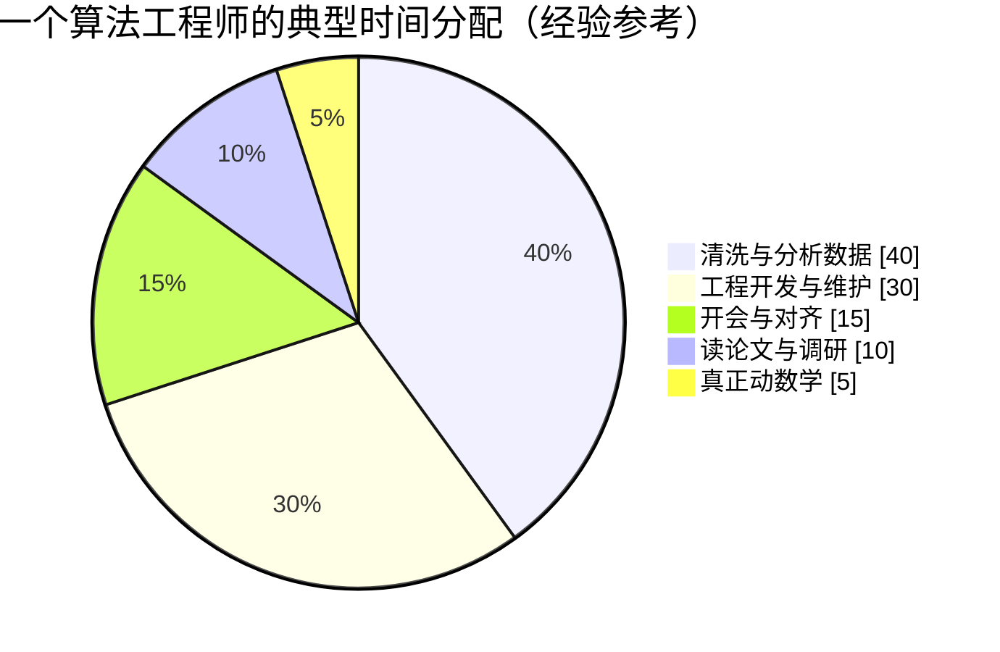

# 生产实战：工作中到底用多少数学

> **一句话理解**：真实工作里，自动微分（Automatic Differentiation）替你把导数全算完了——真正稀缺的不是计算能力，而是两件小事：**把业务目标写成公式（设公式）**，以及**读懂论文里的公式（读公式）**。

[⬆️ 返回总目录](../../../README.md) · [⬆️ 返回本篇](../README.md) · [⬅️ 返回本章目录](./README.md)

| 属性 | 说明 |
|------|------|
| 难度 | ⭐⭐（进阶） |
| 所属分支 | 通用基础 |
| 前置知识 | 本章全部正文 |

---

## 🏭 一个真实项目从 0 到 1

拿一个常见业务当样本：**给短视频信息流迭代一个"用户还会不会继续看"的排序模型**。沿生命周期走一遍，重点标注每一段用了多少数学、什么数学。


先把"真实感"说清楚（经验参考，不同公司量级有差异）：

- **时间花在哪**：6~7 成在数据，1 成在训练调参，剩下的在对齐、评审、写文档；
- **钱花在哪**：人力是大头；算力上，这类排序模型的训练往往单机多卡即可，真正烧钱的是每天线上推理的集群；
- **谁参与**：算法工程师（建模）、数据/平台工程（管道与上线）、业务与运营（定目标、看效果）——数学翻译这一步，通常是算法工程师和业务方一起完成的。

分阶段拆解（每个阶段说清"做什么、数学浓度多高"）：

- **需求定义**（1~2 周，几乎全是沟通）：和业务方把"看什么"翻译成指标——完播、时长、留存怎么加权。数学浓度：低，但最值钱——把"既要点击又要时长"写成一行加权损失，是全项目数学含金量最高的一行（下面"三个真实瞬间"会把它拆到底）。
- **数据**（占整个项目 6~7 成时间，经验参考）：从日志抽样本、清洗、查分布、防泄漏。数学浓度：中——全是统计直觉：这个特征长尾分布怎么办？训练集和测试集是不是同一批人？时间分割做错，前面全白干。
- **设备与算力**：排序模型通常单机多卡可训，线上批量推理 CPU 集群就够（经验参考）。数学浓度：低——估算一下 batch × 特征维度的矩阵规模，别把显存撑爆即可。
- **算法选型**：读 3~5 篇论文，决定"用成熟结构微调"还是"引入新结构"。数学浓度：中——读的正是论文的公式部分：损失怎么定义、结构图里每个模块在算什么。读不懂公式，就只能"看起来厉害就用它"。
- **训练炼丹**：设损失、选优化器、调学习率、盯 loss 曲线。数学浓度：中——梯度是自动微分算的，但学习率大了要飞、loss 突然 NaN 要排查，全靠第 3 节的微积分直觉。
- **评估**：离线 AUC / GAUC + 小流量 A/B 实验。数学浓度：中高——离线涨 0.5 个点是真是假？样本量多大才显著？这是纯统计战场。
- **部署**：导出模型、压测、灰度上线。数学浓度：几乎为零。
- **监控与迭代**：盯指标、盯特征分布漂移，定期重训。数学浓度：低到中——"分布变了没有"本身就是统计判断。实操（经验参考）：给关键特征的分位数（P50/P95）和训练时的值做对比，偏移超过阈值就报警重训；指标异动先做辛普森下钻（分新老用户/分渠道看），再怀疑模型。

<details>
<summary>📋 展开一个真实的迭代故事（综合常见模式改写）</summary>

模型上线首周一切正常：离线 AUC +1.2%，在线人均时长 +3%。第三周时长突然阴跌。排查发现：为了压制"标题党"，训练目标给"点击但 3 秒退出"的样本加了 4 倍惩罚权重；而运营同期上线了一个新活动页，大量样本的"退出"来自页面跳转而不是内容差——**损失函数忠实地学错了东西**。修复：把"退出"重新定义为"回到首页且当日不再回来"，惩罚权重降到 2 倍，重训回滚。教训：公式没有错，是公式所描述的世界变了。

数学复盘：损失 $\mathcal{L}=\mathcal{L}_{\text{点击}}+\beta\,\mathcal{L}_{\text{负反馈}}$ 里的"负反馈"是一个**条件事件**，$P(\text{负反馈}\mid\text{点击})$ 的语义随产品改版悄悄变了——同一个公式、同一个 β，学的东西已经不同。这是"设公式"时最容易漏的一步：**给公式里的每个事件写清业务定义，并写进监控**。

</details>

## 🌈 数学用量光谱：你的岗位在哪一格

| 光谱位置 | 典型角色 | 数学要求 | 标志性能力 |
|----------|----------|----------|-----------|
| 左端：调包工程师 | 大量业务落地岗 | 看得懂文档与报错 | 知道每个参数是干嘛的；`shape not aligned` 一眼定位；看得懂评估报告 |
| 中间：应用算法工程师 | **多数岗位落在这里（中间偏左）** | 能把业务目标写成损失、能改模型结构 | 多目标加权损失、负采样比例、特征分布诊断、读论文公式部分 |
| 右端：研究员 | 少数研究岗 | 推公式、证明性质 | 推导收敛性、设计新目标函数、从概率模型出发生成新方法 |

**多数岗位落在中间偏左**：日常以工程与业务为主，数学在"读得懂、写得出、排得掉"三个动作里出现。下面这张饼图是一个算法工程师典型的时间分配（经验参考，不同团队差异很大）：



注意"真正动数学"只占约 5%——但那 5%，往往出现在项目最关键的时刻（见下面三个瞬间）。

<details>
<summary>📋 展开看：把光谱当镜子——三个自测问题</summary>

1. 打开你常用模型的文档，能说出每个参数在数学上是什么角色吗？（对应"看得懂文档"）
2. 业务方说"既要 A 又要 B"，你能当场写出一行加权损失并说出权重的含义吗？（对应"设公式"）
3. 训练半夜 loss 变 NaN，你有明确的排查顺序吗？（对应"排得掉"）

三问都在左侧（调包端），放心做业务，数学按需回看本章即可；想往光谱右端走，再把第 2、3、4 节的折叠框逐个展开精读。

</details>

## ⚡ 三个真实瞬间：数学在什么时候突然登场

1. **读论文的公式部分**。想借鉴一篇多目标排序论文，正文可以跳读，公式不能——每个符号对应代码里哪个变量、损失是怎么拼起来的，读懂了才敢搬进生产。操作流程见本节末尾的折叠清单。
2. **排查 loss NaN 与梯度爆炸**。训练半夜挂了，loss 变 NaN。数学细节展开：两个最常见的病源——(a) `log(0)`：某样本模型给出概率 0，$-\log 0 = -\infty$，反传时 $\infty\times 0$ 或 $\infty-\infty$ 变 NaN，一个 NaN 进了 batch 平均，**整批参数一步污染**；(b) 学习率过大：梯度每步乘上绝对值大于 1 的因子（第 3 节六步发散表的复利版），loss 曲线呈"×常数"节节攀升，直到浮点上限变 `inf` 再变 NaN。动作清单：打日志看哪一层的梯度范数起飞 → 学习率降一个数量级 → 查 log(0)、exp 上溢 → 加梯度裁剪或换 logsumexp。整套动作就是第 3 节微积分的急诊版。对应到代码，三行防御长这样（PyTorch 风格）：

```python
loss = F.cross_entropy(logits + 1e-7, labels)     # ① log 前托底：eps 防 log(0)
torch.nn.utils.clip_grad_norm_(model.parameters(), 1.0)  # ② 梯度裁剪：范数超 1 就整体缩回
loss = -torch.logsumexp(scores, dim=-1)           # ③ exp→logsumexp：防大数溢出
```
3. **把"既要点击又要时长"写成加权损失**：

$$
\mathcal{L} = \mathcal{L}_{\text{点击}} + \alpha\,\mathcal{L}_{\text{时长}} + \beta\,\mathcal{L}_{\text{负反馈}}
$$

> 👉 **人话**：把三个业务诉求各写成一项损失，乘上各自的"重要程度"再相加——调 $\alpha,\beta$ 就是调业务取舍，各项量纲还要先拉平（比如都归一到 0~1）。

**权重怎么调（工程细节展开）**：

- **第 0 步，拉平量纲**：各项损失初始值可能差一个量级（点击 0.5、时长 3.1、负反馈 0.08——经验量级）。谁数值大谁的梯度就响，$\alpha$ 就形同虚设。先各自除以**第一轮的初始 loss**，把三项都归到 1 附近，再谈权重；
- **第 1 步，从 1 开始网格**：$\alpha\in\{0.1,\ 0.3,\ 1,\ 3\}$ 二维小网格（β 同理），每个点训一版看离线指标；
- **第 2 步，设护栏**：业务方提前约定"点击率跌幅 ≤ 2%"这类底线，破线版本直接出局——多目标没有免费午餐，**权重调的是帕累托前沿上选哪个点**，不是全赢；
- **第 3 步，线上校验**：离线涨的只是候选，最终以小流量 A/B 为准。

一次典型的调参记录（经验参考的样式，数字为示意）：

| 版本 | α（时长） | β（负反馈） | 离线 AUC | 在线点击 | 在线时长 | 结论 |
|------|-----------|-------------|----------|----------|----------|------|
| 基线 | — | — | — | — | — | 起跑线 |
| v1 | 0.3 | 1 | +1.2% | +1.0% | +0.4% | 时长没吃到权重 |
| v2 | 1 | 1 | +0.9% | +0.5% | +2.1% | 护栏内，放量 |
| v3 | 3 | 2 | +0.4% | −1.8% | +3.6% | 点击跌破护栏，回退 |

<details>
<summary>📋 展开看：读懂一篇论文公式的操作流程（七步清单）</summary>

以"借鉴一篇多目标排序论文"为例，按顺序做，一步不停留太久：

1. **先翻符号表**：notation 段、图注、附录。建"符号账本"四列——符号 / 含义 / 取值形状 / 对应代码变量。查不到的先猜并打问号（对应第 1 节"卡点一"）；
2. **先读损失定义**：找到 $\mathcal{L}=...$ 那一行，问三个问题——优化的是什么事件的概率？各项权重是多少？对谁求平均（样本级/会话级/用户级）？损失定义读懂，论文就懂了一半；
3. **代入小数字**：拿 2 个样本、3 个特征，把前向和损失手算一遍（对应"卡点二"）。算不下去的地方，就是没读懂的地方；
4. **分清"训练公式"和"推理公式"**：有些模块只在训练出现（辅助损失、蒸馏项），上线时根本不用搬——抄错这段是常见事故；
5. **对照开源实现**：找到论文官方代码（或第三方复现），把公式逐项映射到代码行；两边对不上的地方，通常藏着 trick（实现细节常常决定成败）；
6. **写出五行伪代码复述**：合上论文，用自己的话把方法写成伪代码。写不出来的段落，就是没消化的段落；
7. **小规模复现再上生产**：先在采样的小数据集上跑通、对齐论文报告的量级，再考虑接入业务。

</details>

<details>
<summary>📋 展开看：面试数学 vs 工作数学对照表（加厚版）</summary>

| 主题 | 面试常问 | 日常工作真实用法 | 差距说明 |
|------|----------|------------------|----------|
| 矩阵求导 | 手推反向传播、$\partial L/\partial W$ | autograd 全包；但要看懂 `shape` 报错和显存估算 | 面试考推导是考"懂原理"，工作考的是"能定位" |
| 梯度与优化 | SGD 更新式、动量公式默写 | 读懂 warmup/余弦衰减配置、NaN 排查 | 工作版微积分是"读曲线 + 排故障" |
| 概率 | 全概率/贝叶斯公式手算 | A/B 显著性判断、辛普森下钻、先验拍超参 | 工作版概率是"别被波动骗" |
| 损失函数 | 推导交叉熵与 MLE 的关系 | 把三个业务指标拼成一行加权损失并调权重 | 一个是"证明出身"，一个是"承担后果" |
| 线性代数 | 特征值/秩的定义 | 特征共线诊断、embedding 维度与显存预算 | 工作版是"工程直觉 + 一条命令验证" |
| 统计检验 | t 检验公式 | 样本量估算、p 值判读、防多重检验 | 工作里宁可保守，"没把握"就加流量再跑 |
| 信息论 | 熵/交叉熵定义 | 读 perplexity 报告、解释"模型变笨了多少" | 概念认得即可，公式现查 |

结论不是"面试数学没用"，而是**两种数学都要会一点：前者是门票，后者是饭碗**——并且工作数学可以后补，面试数学只能提前练。

</details>

## 🤖 工具现实：自动微分时代，你要会什么

框架（PyTorch / JAX）的自动微分会替你算对所有导数；scipy / sklearn 把检验和拟合包成了函数调用。**计算不值钱了，"设公式"和"读公式"反而更值钱**：

- **设公式**：把业务目标翻译成损失函数（上面的加权损失）、决定正则项、设计评估口径；
- **读公式**：读懂论文里每个模块在算什么、报错信息里的数学名词、评估报告里的置信区间。

### 🚑 数学急救包：遇到什么，回看哪节

| 工作现场的症状 | 背后的数学 | 回看 |
|----------------|-----------|------|
| `shape not aligned`、维度对不上 | 矩阵形状规则 | [线性代数](./02-线性代数.md) |
| 回归系数大到离谱、换个种子就变号 | 特征共线、奇异/病态矩阵 | [线性代数](./02-线性代数.md)（投影与正规方程一节） |
| loss 不降 / 飞天 / 变 NaN、不知道学习率怎么调 | 导数、梯度、学习率、泰勒近似的步长上限 | [微积分与梯度](./03-微积分与梯度.md) |
| 离线涨点在线不涨、A/B 结果看不懂 | 抽样波动、显著性、分布 | [概率与统计](./04-概率与统计.md) |
| 分组都赢、合并却输（或反过来） | 辛普森悖论、混淆变量 | [概率与统计](./04-概率与统计.md)（辛普森一节） |
| 论文里的损失函数看不懂 | 最大似然与损失的关系 | [概率与统计](./04-概率与统计.md) |

## 🧭 场景选型表

| 岗位 / 场景 | 数学浓度 | 重点掌握 | 可以放过 |
|-------------|----------|----------|----------|
| 业务调参岗（大量业务落地） | ★★☆☆☆ | 损失与指标的含义、分布直觉、A/B 显著性 | 手推反向传播、矩阵求导 |
| 平台 / 工程岗（训练与推理平台） | ★★☆☆☆ | 并行切分的形状与显存估算、数值稳定性 | 概率图模型、测度论 |
| 研究岗（新方法、新结构） | ★★★★★ | 纸笔推导、收敛性分析、概率建模 | 无——但这类岗位很少 |

## 🧰 真实工具链

| 环节 | 常用工具 | 一句话点评 |
|------|----------|-----------|
| 符号计算（Symbolic Computation） | SymPy | 手推 loss 怕出错，让它替你符号化地验一遍，免费且够用 |
| 函数可视化 | Desmos / GeoGebra | 调学习率前先看一眼损失曲线长什么样，直觉立刻回来 |
| 自动微分 | PyTorch autograd / JAX | 时代红利：导数全自动，你只负责设公式 |
| 看数据分布 | matplotlib / seaborn | 看数据的第一眼永远是画图，不是算均值 |
| 快速查积分 / 极限 | Wolfram Alpha | 免登录查一个积分，比翻公式表快十倍 |

## 💣 踩坑实录

- **坑 1**："等我补完数学再开工" → 最贵的坑。正确姿势是**边用边补**：项目逼你查的那个知识点，记得最牢。本章的定位就是"用到再回看"。
- **坑 2**：损失方向写反 → 把"最大化时长"写成最小化、加权符号抄错，表现为 loss 一路欢快下降、线上指标一路阴跌。对策：新损失上线前，先拿一小批样本手算一次数值对不对。
- **坑 3**：数值不稳 → log(0)、exp(x) 溢出、大数相减，都会产出 NaN 再污染整个模型。对策：log 前加一个小 eps、exp 换 logsumexp、梯度加裁剪（clip）。
- **坑 4**：加权损失忘了拉平量纲 → 一项 loss 初始值是另一项的 10 倍，"权重 1:1"实际上是 10:1，调了一周 α 全在陪跑。对策：除以首轮初始 loss 归一后再调权（见上面"三个真实瞬间"的展开）。

## 🗣️ 炼丹师大实话

> **"面试问的数学和日常工作用的数学，是两种数学。"** 面试爱问手推反向传播、矩阵求导；日常靠的是"读公式、设损失、看分布"。别因为第一种数学劝退自己，也别因为会调包就轻视第二种——前者是门票，后者是饭碗。

---

[⬅️ 上一页：概率与统计](./04-概率与统计.md) · [返回本章目录](./README.md) · [下一章：第 3 章：机器学习 ➡️](../../2-经典机器学习/03-机器学习/README.md)
