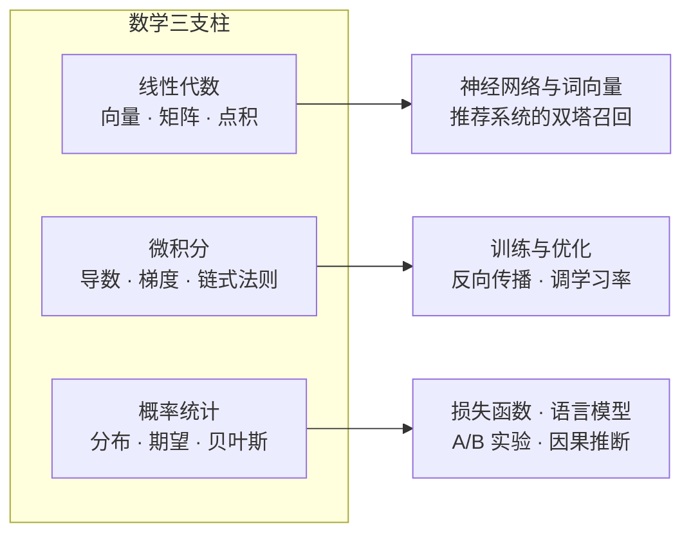

# 第 2 章：数学基础 📐

> 本章不是一本数学教材，而是一张 **"AI 用到的数学"速查地图**。训练一个模型的每一步——数据进模型、算损失、调参数、评估效果——背后各站着一位数学家：线性代数、函数、微积分、概率统计。读完本章，你不需要会推导定理，只需要**看到符号不慌、知道每一步在算什么、报错时知道去哪查**。

[⬆️ 返回总目录](../../../README.md) · [⬆️ 返回本篇](../README.md)

## 🗺️ 本章知识树

三条数学支流，分别汇入全书不同的后续章节——这张图就是贯穿全书的那条"数学暗线"：

- **线性代数**：数据怎么表示、怎么算相似、怎么批量变换——神经网络的每一层都是矩阵乘法；
- **微积分**：参数该往哪调、调多少——训练的核心动作就是沿梯度反方向下山；
- **概率统计**：怎么度量"可能性"与"可信度"——损失函数、语言模型、实验评估都出自这里。

## 📏 "够用就好"三层策略

学 AI 的数学不是考数学系，先想清楚自己要练到哪一层：

| 层级 | 标志性能力 | 本库覆盖 |
|------|-----------|----------|
| ① 知道 | 看到公式知道每个符号是什么、这一步在算什么，不慌 | ✅ 主攻 |
| ② 会用 | 能把业务目标写成损失、能改代码、能看报错定位问题 | ✅ 主攻 |
| ③ 精通 | 能独立推导公式、证明性质、发明新方法 | ❌ 不在本书范围 |

本库瞄准前两层：**先把"知道"和"会用"打通，第三层留给日后按需深入。**

## 📖 推荐阅读顺序

| 顺序 | 页面 | 难度 | 一句话说明 |
|------|------|------|-----------|
| 1 | [为什么要学数学](./01-为什么要学数学.md) | ⭐ | 跟着一次模型训练走一圈，看每步用了什么数学 |
| 2 | [线性代数](./02-线性代数.md) | ⭐⭐ | 向量、点积、矩阵乘法——AI 世界的通用货币 |
| 3 | [微积分与梯度](./03-微积分与梯度.md) | ⭐⭐ | 导数是灵敏度，训练就是沿梯度反方向下山 |
| 4 | [概率与统计](./04-概率与统计.md) | ⭐⭐ | 用证据更新信念，在不确定中做判断 |
| 收官 | [生产实战](./99-生产实战.md) | ⭐⭐ | 工作中到底用多少数学：光谱、场景与工具 |

> 第一遍不必逐行啃：先通读，建立"知道去哪查"的印象；后续章节**用到再回看**——这本身就是学数学最高效的姿势。

## 🎯 读完本章你应该能

- 看到 Σ、∂、∇ 这类符号不再心跳加速，知道各自在说什么；
- 亲手算过一次点积、两步梯度下降、一次贝叶斯更新（都只是加减乘除）；
- 说得出"训练一个模型"的四个环节分别对应哪门数学；
- 对照收官页的岗位光谱，判断自己的目标方向需要把数学练到哪一层。

## 🔗 与其他章节的关系

- **前置章节**：[第 1 章：环境与工具](../01-环境与工具/README.md)——有能跑代码的环境，本章每个例子都能亲手验证；
- **后续章节**：[第 3 章：机器学习](../../2-经典机器学习/03-机器学习/README.md)——从这里开始数学符号全面登场，你会不断回看本章。

---

[⬅️ 上一章：第 1 章：环境与工具](../01-环境与工具/README.md) · [返回总目录](../../../README.md) · [下一章：第 3 章：机器学习 ➡️](../../2-经典机器学习/03-机器学习/README.md)
