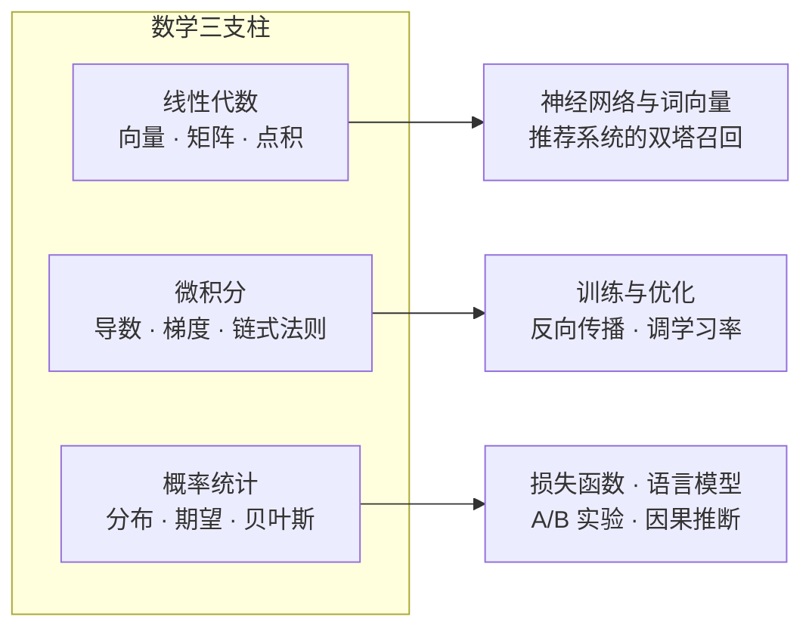

# 第 2 章：数学基础 📐

> 本章不是一本数学教材，而是一张 **"AI 用到的数学"速查地图**。训练一个模型的每一步——数据进模型、算损失、调参数、评估效果——背后各站着一位数学家：线性代数、函数、微积分、概率统计。读完本章，你不需要会推导定理，只需要**看到符号不慌、知道每一步在算什么、报错时知道去哪查**。

[⬆️ 返回总目录](../../../README.md) · [⬆️ 返回本篇](../README.md)

## 🗺️ 本章知识树

三条数学支流，分别汇入全书不同的后续章节——这张图就是贯穿全书的那条"数学暗线"：

- **线性代数**：数据怎么表示、怎么算相似、怎么批量变换——神经网络的每一层都是矩阵乘法；
- **微积分**：参数该往哪调、调多少——训练的核心动作就是沿梯度反方向下山；
- **概率统计**：怎么度量"可能性"与"可信度"——损失函数、语言模型、实验评估都出自这里。

## 🔬 数学 → 模型：每个工具落在哪一步公式

这张表是本章的总账本。右两列不是"某章会用到"这种含糊话，而是**这个数学工具落进某个真实模型时的那一行公式**。现在不必看懂，混个脸熟即可；日后在后续章节撞见眼熟的符号，回这张表对号入座。

| 数学工具 | 它的那一行 | 落在模型的哪一步 | 落点章节 |
|----------|-----------|------------------|----------|
| 点积 | $s(q,k) = q\cdot k / \sqrt{d}$ | 注意力：给"每个词该看谁"打分；双塔召回：给"用户 × 商品"打分 | [Transformer 与注意力机制](../../4-专业方向/07-自然语言处理与LLM/02-Transformer与注意力机制.md)、[双塔模型与向量召回](../../4-专业方向/08-推荐系统/03-双塔模型与向量召回.md) |
| 矩阵乘法 | $h = Wx + b$ | 神经网络的每一层：一批输入乘权重矩阵再加偏置 | [神经网络是怎么炼成的](../../3-深度学习/04-深度学习基础/01-神经网络是怎么炼成的.md) |
| 导数与链式法则 | $\frac{\partial L}{\partial w} = \frac{\partial L}{\partial h}\cdot\frac{\partial h}{\partial w}$ | 反向传播：损失对上亿个参数逐层求坡度 | [训练一个模型的完整流程](../../3-深度学习/04-深度学习基础/02-训练一个模型的完整流程.md) |
| 梯度 | $w \leftarrow w - \eta\,\nabla L$ | 优化器更新参数的那一行（一切训练代码的核心） | [微积分与梯度](./03-微积分与梯度.md) |
| 投影与最小二乘 | $\hat{w} = (X^TX)^{-1}X^Ty$ | 线性回归闭式解：把答案投影到特征张成的空间 | [线性回归](../../2-经典机器学习/03-机器学习/02-线性回归.md) |
| 特征值 / SVD | $A = U\Sigma V^T$ | PCA 降维找"主方向"；矩阵分解补全评分矩阵 | [聚类与降维](../../2-经典机器学习/03-机器学习/06-聚类与降维.md)、[协同过滤与矩阵分解](../../4-专业方向/08-推荐系统/02-协同过滤与矩阵分解.md) |
| 范数 | $\lVert x\rVert_2 = \sqrt{\textstyle\sum_i x_i^2}$ | kNN 量距离、权重衰减压参数、embedding 归一化 | [模型评估与调优](../../2-经典机器学习/03-机器学习/07-模型评估与调优.md) |
| softmax 与条件概率 | $P(w_t \mid w_{<t})$ | 语言模型：给定上文，输出"下一个词的分布"再采样 | [大语言模型 LLM 全景](../../4-专业方向/07-自然语言处理与LLM/04-大语言模型LLM全景.md) |
| 交叉熵 | $L = -\sum_i y_i \log \hat{p}_i$ | 分类与语言模型的损失函数（从"最大似然"推出来的） | [概率与统计](./04-概率与统计.md)、[逻辑回归与分类](../../2-经典机器学习/03-机器学习/03-逻辑回归与分类.md) |
| 贝叶斯 | $P(A\mid B) \propto P(B\mid A)\,P(A)$ | 垃圾邮件过滤；因果推断里"控制混杂后重新称重" | [因果推断方法工具箱](../../4-专业方向/11-因果推断/02-因果推断方法工具箱.md) |
| 假设检验 | $\text{p 值} = P(\text{至少这么大的差异}\mid\text{没有真实差异})$ | A/B 实验：判断"涨 0.2% 是真是假" | [模型评估与调优](../../2-经典机器学习/03-机器学习/07-模型评估与调优.md) |

三条使用说明：

- **正向用**：本章各节会把表里每一行拆到只剩加减乘除——公式现在看不全懂是正常的；
- **反向用**：日后看不懂某个模型的某一步，先来这里查它用的是哪门数学，再回对应小节补课；
- **复合用**：生成模型（如扩散模型"加噪再去噪"）用的也不是新数学，只是这几样工具的复合——高斯分布 + 梯度 + 矩阵运算层层叠出来的。

## 📏 "够用就好"三层策略

学 AI 的数学不是考数学系，先想清楚自己要练到哪一层：

| 层级 | 标志性能力 | 本库覆盖 |
|------|-----------|----------|
| ① 知道 | 看到公式知道每个符号是什么、这一步在算什么，不慌 | ✅ 主攻 |
| ② 会用 | 能把业务目标写成损失、能改代码、能看报错定位问题 | ✅ 主攻 |
| ③ 精通 | 能独立推导公式、证明性质、发明新方法 | ❌ 不在本书范围 |

本库瞄准前两层：**先把"知道"和"会用"打通，第三层留给日后按需深入。**

## 📖 推荐阅读顺序

| 顺序 | 页面 | 难度 | 一句话说明 |
|------|------|------|-----------|
| 1 | [为什么要学数学](./01-为什么要学数学.md) | ⭐ | 跟着一次模型训练走一圈，看每步用了什么数学 |
| 2 | [线性代数](./02-线性代数.md) | ⭐⭐ | 向量、点积、矩阵乘法——AI 世界的通用货币 |
| 3 | [微积分与梯度](./03-微积分与梯度.md) | ⭐⭐ | 导数是灵敏度，训练就是沿梯度反方向下山 |
| 4 | [概率与统计](./04-概率与统计.md) | ⭐⭐ | 用证据更新信念，在不确定中做判断 |
| 收官 | [生产实战](./99-生产实战.md) | ⭐⭐ | 工作中到底用多少数学：光谱、场景与工具 |

> 第一遍不必逐行啃：先通读，建立"知道去哪查"的印象；后续章节**用到再回看**——这本身就是学数学最高效的姿势。

## 🎯 读完本章你应该能

- 看到 Σ、∂、∇ 这类符号不再心跳加速，知道各自在说什么；
- 亲手算过一次点积、两步梯度下降、一次贝叶斯更新（都只是加减乘除）；
- 说得出"训练一个模型"的四个环节分别对应哪门数学，并能指着上表说出每个工具落点的那行公式；
- 对照收官页的岗位光谱，判断自己的目标方向需要把数学练到哪一层。

## 🔗 与其他章节的关系

- **前置章节**：[第 1 章：环境与工具](../01-环境与工具/README.md)——有能跑代码的环境，本章每个例子都能亲手验证；
- **后续章节**：[第 3 章：机器学习](../../2-经典机器学习/03-机器学习/README.md)——从这里开始数学符号全面登场，你会不断回看本章。

---

[⬅️ 上一章：第 1 章：环境与工具](../01-环境与工具/README.md) · [返回总目录](../../../README.md) · [下一章：第 3 章：机器学习 ➡️](../../2-经典机器学习/03-机器学习/README.md)
