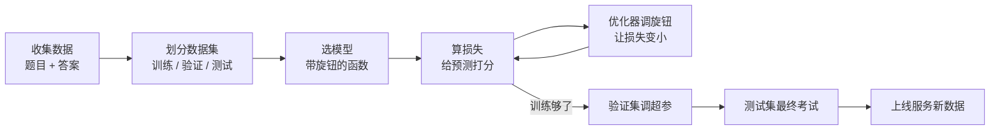
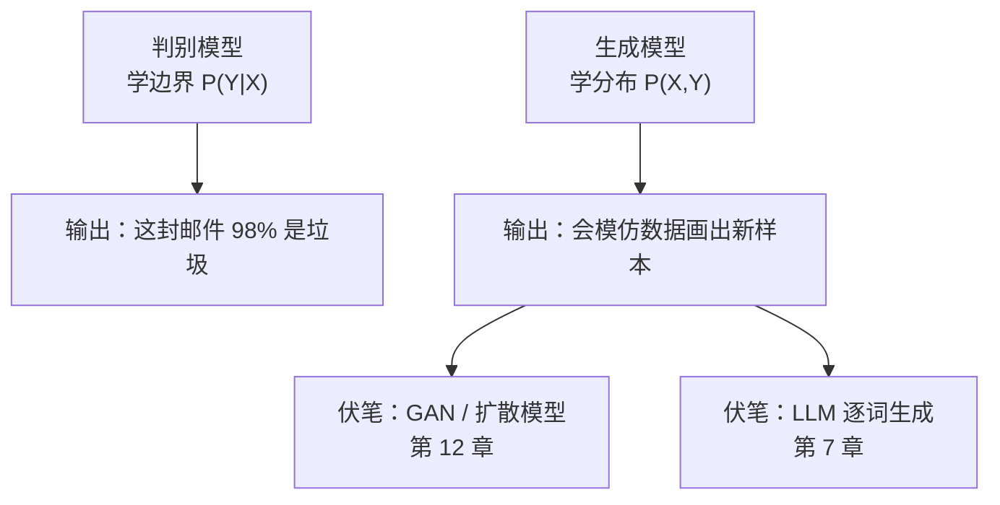
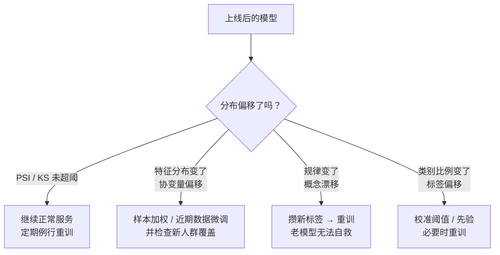
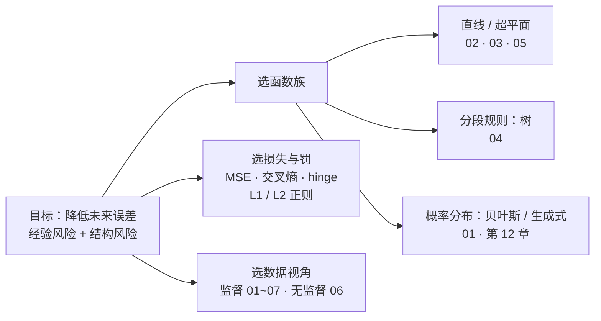

# 机器学习全景

> **一句话理解**：机器学习（Machine Learning）就是不再由人一条条写规则，而是给机器一堆"题目 + 答案"（或只有题目），让它自己从数据里把规律学出来。

[⬆️ 返回总目录](../../../README.md) · [⬆️ 返回本篇](../README.md) · [⬅️ 返回本章目录](./README.md)

| 属性 | 说明 |
|------|------|
| 难度 | ⭐⭐（进阶） |
| 所属分支 | 通用基础 |
| 前置知识 | [第 2 章：数学基础](../../1-起步准备/02-数学基础/README.md) |

---

## 📌 这一节解决什么问题

在机器学习流行之前，想让计算机干活，靠的是**人写规则**：垃圾邮件过滤器写成千上万条"包含这个词就拦截"，信贷风控写一整套专家打分表。规则越写越多，麻烦随之而来：规则互相打架、新骗术出现就得连夜加规则、换个业务全部推倒重写——**人写规则，跟不上世界的变化速度**。

机器学习把思路掉了个头：**与其写规则，不如给例子**。你想让机器识别垃圾邮件？不用写规则，给它十万封标好"垃圾 / 正常"的邮件，让它自己总结出规律。规则不再是人写的，而是**从数据里学出来的**——这就是范式转变。

这一页先把机器学习的通用世界观搭起来：数据怎么分、模型是什么、损失怎么算、学习在学什么、完整工作流长什么样。后面几页讲的具体模型（回归、分类、树、聚类……），全都装在这套框架里。

## 🌱 通俗理解

把机器学习想成一个**学生刷题**的过程：

- **特征（Feature）**：题目里的已知条件——"面积 90 平、朝南、地铁 500 米"，就是一道题的题干；
- **标签（Label）**：这道题的标准答案——"成交价 350 万"；
- **模型（Model）**：学生脑中的解题方法，本质是一个**带旋钮的函数**——旋钮（参数）拧的位置不同，方法就不同；
- **损失（Loss）**：阅卷打分器，量出"你的答案和标准答案差多远"；
- **学习（Learning）**：考完一次，看看哪类题错得多，把脑内旋钮往"错得更少"的方向拧一点，再考、再拧……

监督学习就是**有答案刷题**；无监督学习是**发下一堆没答案的题，让你自己把题目分分类**；强化学习是**没有标准答案、做对了发小红花**（见[本章 README](./README.md) 的三大流派图）。

## 📋 举个例子

三个点的迷你数据集——按面积预测房价：

| 面积 x（平） | 成交价 y（万） |
|---|---|
| 50 | 205 |
| 80 | 315 |
| 110 | 430 |

**第 0 步，瞎猜**：随便说"所有房子 250 万"。误差：50 平的差 45 万，110 平的差 180 万——不行。

**第 1 步，猜常数**：用最省脑子的办法——猜均值。三套房价均值 ≈ 316.7 万，于是"见房就报 316.7"。误差小了一点（50 平的差 111.7 万，110 平的差 113.3 万），但依然巨大，因为**房价明明跟着面积涨，这个方法完全无视了面积**。

**第 2 步，换一条带旋钮的直线**：$\hat{y} = wx + b$，此时有两个旋钮 $w$（斜率）和 $b$（截距）。拿这三个点去调，调到 $w \approx 3.75$、$b \approx 17$ 时：50 平预测 204 万（误差 1 万）、80 平预测 317 万（误差 2 万）、110 平预测 429 万（误差 1 万）——误差从"上百万"缩到"一二十万分之一"量级。

这就是机器学习的全部骨架：**换一个更合适的函数（模型），拧它的旋钮（参数），让损失（误差）变小**。后面的整章内容，都是在回答两个问题：用什么函数？怎么拧旋钮？

但这里已经埋着一个更深的问题：上面"调到 $w \approx 3.75$"是在**这三个点**上调的，凭什么保证对**下一套没见过的房子**也准？——这正是本页新增的"经验风险 vs 结构风险"要回答的事，见核心原理 ⑤。

## 🧠 核心原理

### 整体流程



### 逐步拆解

**① 数据集三分：平时作业 / 模拟考 / 高考**

| 数据集 | 类比 | 作用 |
|--------|------|------|
| 训练集（Training Set） | 平时作业 | 模型对着它拧旋钮，可以反复做 |
| 验证集（Validation Set） | 模拟考 | 换个模型、调超参数时用来对比选优 |
| 测试集（Test Set） | 高考 | **只考一次**，考出多少分就是模型的真实水平 |

为什么不能偷看测试集？因为一旦你反复用测试集挑模型，就等于**提前看过高考试卷再选复习策略**——考出来的高分是虚的，上了真正的考场（新用户、新数据）就现原形。

<details>
<summary>📋 展开：偷看测试集是怎么悄悄发生的</summary>

常见的"无意识偷看"有三种：

1. **反复用测试集调参**：试了 50 组超参数，每组都看一次测试集分数，最后报最高的那组——测试集被你"用"了 50 次，它已经在帮你过拟合了；
2. **先合并数据再做预处理**：用全部数据的均值、方差做标准化之后才划分训练 / 测试——测试集的信息（未来统计量）提前渗进了训练过程，这叫**数据泄漏（Data Leakage）**，[07-模型评估与调优](./07-模型评估与调优.md)会专门拆解；
3. **按时间排列的数据随机划分**：用"未来"的样本训练、去预测"过去"，相当于开了天眼——时间序列场景必须按时间切分。

正确姿势：训练集随便用；验证集用来选模型选超参；测试集只在**最后一次**拿出来，考完就封卷。

</details>

**② 模型 = 带旋钮的函数**

$$
\hat{y} = f_\theta(x)
$$

> 👉 **人话**：模型就是一个函数，喂进去特征 $x$（面积），吐出预测 $\hat{y}$（房价）；$\theta$ 是它的旋钮。直线、决策树、神经网络，区别只是"函数长什么样、有几个旋钮"。

**③ 损失 = 打分器**。以最常用的均方误差为例：

$$
\text{MSE} = \frac{1}{n}\sum_{i=1}^{n}(y_i - \hat{y}_i)^2
$$

> 👉 **人话**：把每道题的误差（预测 − 真实）平方后取平均。平方有两个好处：负误差不会和正误差抵消，而且大错罚得比小错狠得多——预测差 100 万的罪过远大于差 10 万。

**④ 学习 = 调旋钮降损失**

$$
\theta \leftarrow \theta - \eta \cdot \nabla_\theta L
$$

> 👉 **人话**：这就是梯度下降（Gradient Descent）——算出损失对每个旋钮的"斜率"（梯度），然后把旋钮往斜率相反的方向拧一小步，步长由学习率 $\eta$ 控制。反复"拧一步、看一眼分数"，损失一路走低，模型就"学会"了。

**⑤ 学习到底在最小化什么：经验风险 vs 结构风险**

上面 ③④ 只顾着把**训练集**的误差压低，但训练集只是从真实世界抽来的一小把样本。机器学习真正的目标是**未来新数据上的误差**（泛化误差），两者的关系是这一页最值得想清楚的一块：

$$
\hat{\theta} = \arg\min_{\theta}\ \underbrace{\frac{1}{n}\sum_{i=1}^{n} L\big(f_\theta(x_i), y_i\big)}_{\text{经验风险（Empirical Risk）}} + \underbrace{\lambda\, \Omega(\theta)}_{\text{结构风险（Structural Risk）}}
$$

> 👉 **人话**：**经验风险 = 在训练集上的平均错误**——"平时作业刷得多好"；**结构风险 = 对模型复杂度的罚分**——"你带了多少作弊小抄进考场"。只把作业刷到满分不难：模型够复杂就能把每道题（连噪声）全背下来，但高考未必好；加上结构风险这一罚，模型被迫用**更简单**的规律解释数据，而简单规律更可能是真规律。$\lambda$ 是罚率旋钮：调大偏简单、调小偏复杂。

这套"经验风险 + 结构风险"的语言贯穿全书：[线性回归](./02-线性回归.md)的岭回归、[逻辑回归](./03-逻辑回归与分类.md)的 L2 罚、[决策树的剪枝](./04-决策树与集成学习.md)、[第 4 章](../../3-深度学习/04-深度学习基础/README.md)的 Dropout / 权重衰减——全是它的具体形态。

<details>
<summary>🧮 展开：为什么"训练误差小"不等于"未来误差小"——复杂度从哪来插一脚</summary>

设训练样本 $(x_i, y_i)$ 是从某个真实分布 $P(X, Y)$ 独立抽出来的。我们真正想最小化的是**期望风险**（未来新数据上的平均损失）：

$$
R(\theta) = \mathbb{E}_{(x,y)\sim P}\big[L(f_\theta(x), y)\big]
$$

但 $P$ 未知，只能用训练集上的**经验风险** $\hat{R}(\theta)$ 代替。统计学习理论给出的定性结论是：

$$
R(\theta) \le \hat{R}(\theta) + \text{（与模型容量有关的复杂度项）}
$$

> 👉 **人话**：未来误差 ≤ 训练误差 + 一笔"复杂度税"。模型容量越大，训练误差可以压得越低，但"税"越高——两头一拉锯，最优点往往在中间。这就是"结构风险"必须进目标函数的原因。

**模型容量怎么量？VC 维（Vapnik–Chervonenkis Dimension）** 给了一个经典刻度，一句话直觉：**VC 维 = 模型"想怎么分就怎么分"最多能摆平多少个点**。二维直线能任意标注 3 个点、但 4 个点就存在摆不平的摆法，所以直线 VC 维 = 3；参数越多、函数形状越野的模型 VC 维越大。容量大 = 表达力强 = 也更擅长背题（过拟合）。它主要用来**建立直觉**，实践里我们用验证集曲线和正则化来控制复杂度，不真去数 VC 维。

</details>

**⑥ 没有免费午餐：为什么不存在万能算法**

一个常被追问的问题："哪个算法最好？"——统计学习给过一个冷峻的回答，**没有免费午餐定理（No Free Lunch Theorem）**：如果把**所有可能的问题**平均起来看，任何两个学习算法的期望表现完全一样，谁也不比谁聪明。

> 👉 **人话**：一个算法在某类问题上白赚的，必然在另一类问题上白亏——它的"聪明"来自对世界的**假设**。直线假设"变化是成比例的"，树假设"规律是分段 / 组合条件式的"，K-Means 假设"簇是圆形的"。这些假设有个正式名字：**归纳偏置（Inductive Bias）**。数据和算法的假设对上了，模型就白赚；对不上，再炫的模型也白搭。

这就是本书反复强调"先看数据、再挑模型"的理论根据：**选模型，本质是选一组你相信的假设**。也是为什么后面每一页都要讲"什么时候不 work"——失效边界，就是假设破产的地方。

### 判别模型 vs 生成模型

同样是"学规律"，学的东西可以不一样，由此分出两大门派：

- **判别模型（Discriminative Model）= 学边界，直接下判断**：只学"在什么条件下是什么答案"，即条件概率 $P(Y \mid X)$。像一位只管判卷的老师：给他一张卷子，他能判断及不及格，但自己未必会做这套题。
- **生成模型（Generative Model）= 学数据分布，会"画画"再判断**：学"数据和答案长什么样"，即联合分布 $P(X, Y)$，先学会把样本"画"出来，判断时再比较"更像哪一类"。朴素贝叶斯（Naive Bayes）是生成式最简单的代表——它先估计每一类的分布长什么样，新样本来了看它"更像哪个分布"。

两派不是死对头，中间有一座桥——**贝叶斯公式**：

$$
P(Y \mid X) = \frac{P(X, Y)}{P(X)}
$$

> 👉 **人话**：判别式直接学左边的"看到 X 时 Y 是什么"；生成式先学右边的"X 和 Y 一起出现的完整图景"，需要判断时用贝叶斯公式**反推**出左边。生成式多学的东西是代价也是资产：多花了建模功夫，换来"会画新样本"和"小样本也能开工"的本事。

| 对比 | 判别模型 | 生成模型 |
|------|----------|----------|
| 学什么 | $P(Y \mid X)$：条件关系 | $P(X, Y)$：整体分布 |
| 直觉 | 学边界、下判断 | 学分布、会"画画" |
| 简单代表 | 逻辑回归、SVM | 朴素贝叶斯 |
| 强项 | 分类边界准、直接 | 能生成新样本、能做无监督、小样本友好 |
| 弱点 | 不会"画画" | 建模更难、需要更多假设（假设错了全盘输） |



伏笔先埋在这里：全书后面的[第 12 章生成模型](../../5-前沿与融合/12-生成模型与多模态/README.md)（GAN、扩散模型）和[第 7 章大语言模型](../../4-专业方向/07-自然语言处理与LLM/README.md)，都是生成式家族的成员——它们的看家本领正是"会画画 / 会写文章"。

<details>
<summary>🧮 展开：生成式的最简代表——朴素贝叶斯怎么"先画分布再判断"</summary>

朴素贝叶斯把联合分布拆成"类别的先验 × 特征在类内的分布"，再加一个大胆的简化（**条件独立假设**：给定类别后各特征互相独立）：

$$
P(Y \mid X) \propto P(Y)\prod_{j=1}^{d} P(x_j \mid Y)
$$

> 👉 **人话**：判断一封邮件是不是垃圾，先数"垃圾邮件的基础占比"，再连乘"每个词在垃圾邮件里出现的频率"——每个词独立投票。生成式流程一目了然：先统计每一类"长什么样"（垃圾邮件里'中奖'出现 5%、正常邮件里 0.01%），新样本来了比较"在哪类下更像"。

这个假设现实中几乎从不成立（词与词明显相关），但朴素贝叶斯照样常年能用——**生成式模型的宿命：假设越强，小样本越占便宜，假设破产时输得越彻底**。贝叶斯一族更展开的讲法见[概率与统计](../../1-起步准备/02-数学基础/04-概率与统计.md)。

</details>

### 过拟合与欠拟合：初讲

- **欠拟合（Underfitting）= 没学会**：上面例子里"见房就报均值 316.7 万"，连最基本的"面积越大越贵"都没学进去——模型太简单，训练集都考不好；
- **过拟合（Overfitting）= 把题库背下来了**：模型复杂到把训练集里的**噪声**（比如"恰好这家的卖家急售降价 30 万"）也当成规律背熟，作业满分、高考崩盘——训练分很高，新数据上一塌糊涂。

用 ⑤ 的语言重说一遍：**欠拟合 = 经验风险就压不下去（容量不够）；过拟合 = 经验风险很小、结构风险爆表（容量过剩下的背题）**。怎么诊断、怎么治（正则化、交叉验证），[07-模型评估与调优](./07-模型评估与调优.md)整页展开。

### 数据分布偏移：训练的世界 ≠ 上线的世界

前面所有讨论都建立在一个隐含假设上：**训练数据和未来数据来自同一个分布**（独立同分布，i.i.d.）。真实业务里这个假设经常碎——**分布偏移（Distribution Shift）**：训练分布 ≠ 线上分布。三种最常见的形态：

| 偏移类型 | 什么变了 | 业务例子 | 典型症状 |
|----------|----------|----------|----------|
| 协变量偏移（Covariate Shift） | 输入 $P(X)$ 变了，$P(Y \mid X)$ 没变 | 模型用北上广数据训练，上线扩展到三四线城市 | 线上特征分布直方图和训练集对不上，分数整体偏移 |
| 概念漂移（Concept Drift） | 规律本身 $P(Y \mid X)$ 变了 | 骗子研究了你的风控规则，改了作案手法 | 特征分布没变，命中率 / 准确率持续下滑 |
| 标签偏移（Label Shift） | 类别比例 $P(Y)$ 变了 | 营销拉来一堆新用户，流失占比翻倍 | 正负样本比例变化，阈值 0.5 不再对应原来的含义 |

> 👉 **人话**：第一种是"考题变了范围"（题型没变），第二种是"评分标准改了"（同样的答法不再得分），第三种是"两种题的占比变了"（原来的时间分配失灵）。

**对策一览**（详细落地见 [99-生产实战](./99-生产实战.md) 的监控与重训体系）：

- **监控先行**：对特征分布算 PSI（群体稳定性指标）、对分数分布做 KS 检验，超阈值报警——不监控，模型坏了三个月都不知道；
- **重新训练**：概念漂移基本只能靠带新标签的数据重训（规律变了，老模型无从适应）；
- **重新加权 / 微调**：协变量偏移较轻时，可按分布差异对训练样本加权，或用近期数据微调；
- **防御性设计**：训练时就覆盖多地域 / 多时段样本、少用易漂移的特征（如"当前流行品类"），给模型留出缓冲。



### 学习在学什么：一页串起来

到此可以把整章的地图画出来——所有具体模型，都是在这套框架里换"函数族"和"损失"：



## 💻 动手试试

sklearn 十行走完"拿数据 → 划分 → 训练 → 预测 → 报准确率"全流程：

```python
from sklearn.datasets import load_iris
from sklearn.model_selection import train_test_split
from sklearn.linear_model import LogisticRegression

X, y = load_iris(return_X_y=True)           # 特征 X：花瓣/花萼的长宽；标签 y：3 种鸢尾花
X_tr, X_te, y_tr, y_te = train_test_split(  # 划分：70% 训练（平时作业），30% 测试（高考）
    X, y, test_size=0.3, random_state=42)
model = LogisticRegression(max_iter=200)    # 选一个"带旋钮的函数"
model.fit(X_tr, y_tr)                       # 学习：自动拧旋钮，把损失降下来
print("测试集准确率:", model.score(X_te, y_te))
# 预期输出：测试集准确率: 1.0
# —— 45 朵测试鸢尾花全部分对（这个经典数据集确实好分）
```

改动一个小地方再跑一次：把 `test_size` 改成 `0.3`→`0.2`，或换一个 `random_state`，分数可能会动——**单次划分的分数本来就有随机波动**，这正是后面要用交叉验证的原因。

**再做一个"分布偏移"迷你实验**：故意让测试集的分布和训练集不一样，亲眼看分数怎么塌：

```python
from sklearn.datasets import make_classification
from sklearn.linear_model import LogisticRegression

# 训练世界：两个类别中心分得比较开
X_tr, y_tr = make_classification(n_samples=500, n_features=2, n_redundant=0,
                                 class_sep=1.5, random_state=0)
# 上线世界：同样的问题，但类别重叠严重（规律的信噪比变了）
X_te, y_te = make_classification(n_samples=500, n_features=2, n_redundant=0,
                                 class_sep=0.3, random_state=1)

model = LogisticRegression().fit(X_tr, y_tr)
print("同分布测试分 :", round(model.score(X_tr, y_tr), 3))   # 训练世界自测
print("偏移后测试分 :", round(model.score(X_te, y_te), 3))   # 上线世界实测

# 预期输出（可复现）：
# 同分布测试分 : 0.928
# 偏移后测试分 : 0.62 左右
# —— 模型一行代码没改，换了个世界，分数就从 0.93 掉到 0.6x
```

改什么、看什么：把 `class_sep` 从 0.3 逐步调回 1.5，看分数如何随"两个世界的差异"平滑回升——**分布偏移的伤害是连续的，不是悬崖**，所以监控指标（PSI）也要设阈值而不是等肉眼发现。

## 🔥 炼丹小灶

> 🔥 **炼丹小灶**：工业界常用起点配方与玄学——
> - 配方：任何新任务，**先跑一个最笨的基线**（猜众数 / 猜均值 / 逻辑回归），拿到参考分再谈复杂模型；没有基线的分数都是空中楼阁；
> - 玄学：上线首日分数就崩，先别怀疑模型——八成是特征管道口径不一致或分布偏移，回去对拍数据和特征（见 [99-生产实战](./99-生产实战.md)）；
> - ⚠️ 以上是经验参考值，不是圣旨；换数据集请重新炼。

## 🖱️ 动手玩

> 🕹️ **延伸玩一玩**：[TensorFlow Playground](https://playground.tensorflow.org)——虽然是神经网络的实验场，但可以直接观察本页的两个概念：拧旋钮时训练损失（误差）如何一路下降，以及把模型复杂度拉满后训练误差几乎为 0、测试误差却回升的过拟合现场。

## 🔗 在知识树中的位置

- **上游**：[第 2 章：数学基础](../../1-起步准备/02-数学基础/README.md)——损失、梯度、概率分布是本页公式背后的语言。
- **下游**：[线性回归](./02-线性回归.md)（第一个具体模型）、[聚类与降维](./06-聚类与降维.md)（无监督分支）、[模型评估与调优](./07-模型评估与调优.md)（把五步工作流做严谨）。
- **横向对比**：判别 vs 生成的门派之分，贯穿到[第 7 章 LLM](../../4-专业方向/07-自然语言处理与LLM/README.md) 与[第 12 章生成模型](../../5-前沿与融合/12-生成模型与多模态/README.md)；分布偏移的监控落地在[99-生产实战](./99-生产实战.md)。

## ⚠️ 常见误区

- **误区一**："机器学习 = 全自动，丢数据进去就行" → 数据划分、特征质量、指标选择都要人把关；垃圾进、垃圾出（Garbage In, Garbage Out），模型救不了坏数据。
- **误区二**："测试集分数可以反复看" → 测试集只能最后一次使用；反复用它挑模型等于提前看高考试卷，分数会虚高。
- **误区三**："训练集准确率高 = 模型好" → 还要看过拟合：训练分和测试分的**差距**比训练分本身更重要。
- **误区四**："存在一个最强的算法，找到它就一劳永逸" → 没有免费午餐定理直接否掉了这条路：任何算法的优势都来自假设，换一类数据优势就变成劣势。选模型 = 选假设。
- **误区五**："离线分数好，上线就一定好" → 中间隔着分布偏移和工程一致性两道坎；离线好只是入场券（本页"分布偏移"小节 + [99-生产实战](./99-生产实战.md)）。

## 📝 小结与自测

**要点回顾**

- 机器学习 = 从数据学规则：模型是带旋钮的函数，损失是打分器，学习就是调旋钮降损失；
- 真正要最小化的是**经验风险 + 结构风险**：只刷作业会背题（过拟合），只求简单会没学会（欠拟合）；模型容量（VC 维直觉）是那笔"复杂度税"；
- 没有免费午餐：不存在万能算法，每个算法的优势来自它的归纳偏置，假设错了就翻车；
- 判别模型学 $P(Y \mid X)$ 直接下判断，生成模型学 $P(X, Y)$ 会"画画"，贝叶斯公式是两派之间的桥；
- 数据集三分：训练 / 验证 / 测试 = 平时作业 / 模拟考 / 高考，测试集只能考一次；
- 分布偏移三种形态（协变量 / 概念 / 标签）：上线分数崩，先查世界变没变，再怀疑模型。

**自测一下**（点击展开答案）

<details>
<summary>问题 1：验证集和测试集都能给模型打分，为什么不能合二为一？</summary>

用途不同：验证集用于**选模型、调超参**，会被反复使用，它的分数会被"优化"得偏乐观；测试集代表从未参与任何决策的最终考试，只在最后一次评估。如果合并，等于允许拿高考成绩反复挑复习策略，最终报出的分数虚高，无法代表真实水平。

</details>

<details>
<summary>问题 2：判别模型和生成模型各适合什么任务？各举一例。</summary>

判别模型适合"只关心判断对不对"的任务，如垃圾邮件分类（逻辑回归、SVM 都是判别式）；生成模型适合"需要产出新内容或利用无标签数据"的任务，如图片生成、文本生成（朴素贝叶斯是最简单的生成式代表，大语言模型逐词预测下一词也是生成式思路）。

</details>

<details>
<summary>问题 3：线上模型命中率连跌三周，但特征分布（PSI）完全没动。更可能是哪种分布偏移？为什么？</summary>

更可能是**概念漂移**：特征分布 $P(X)$ 没变（PSI 稳）说明"输入的世界没变"，但命中率（本质上反映 $P(Y \mid X)$ 的规律）在跌——同样的输入，正确答案的比例变了。协变量偏移会先反映在特征分布上，所以排除。对策：攒新标签重训，老模型自己救不了自己。

</details>

<details>
<summary>问题 4：把训练误差压到 0 的模型，为什么反而是个危险信号？</summary>

真实数据都带噪声，规律不可能解释 100% 的变化。训练误差 = 0 意味着模型连噪声都拟合了——经验风险最小化的极端，结构风险（复杂度税）爆表，泛化误差上界反而更大。看到训练集满分，第一反应不该是庆祝，而是去查测试集分数差多少。

</details>

## 📚 延伸阅读

- 书：周志华《机器学习》（西瓜书）第 1 章——中文经典教材的全景引入
- 书：Christopher Bishop《Pattern Recognition and Machine Learning》第 1 章——判别 / 生成的更 formal 讲法
- 论文：David Wolpert, *The Lack of A Priori Distinctions Between Learning Algorithms*（1996）——没有免费午餐定理的出处
- 课程：吴恩达 Machine Learning Specialization（Coursera）第一门课前三周

---

[⬅️ 上一页：本章目录](./README.md) · [返回本章目录](./README.md) · [下一页：线性回归 ➡️](./02-线性回归.md)
