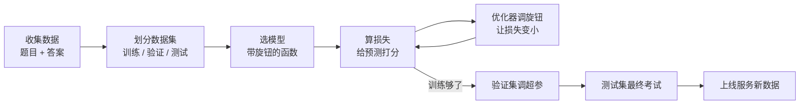
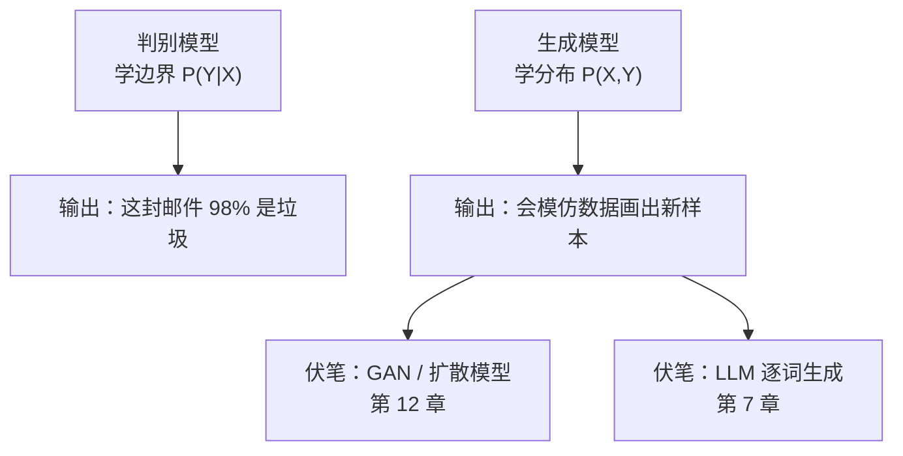

# 机器学习全景

> **一句话理解**：机器学习（Machine Learning）就是不再由人一条条写规则，而是给机器一堆"题目 + 答案"（或只有题目），让它自己从数据里把规律学出来。

[⬆️ 返回总目录](../../../README.md) · [⬆️ 返回本篇](../README.md) · [⬅️ 返回本章目录](./README.md)

| 属性 | 说明 |
|------|------|
| 难度 | ⭐⭐（进阶） |
| 所属分支 | 通用基础 |
| 前置知识 | [第 2 章：数学基础](../../1-起步准备/02-数学基础/README.md) |

---

## 📌 这一节解决什么问题

在机器学习流行之前，想让计算机干活，靠的是**人写规则**：垃圾邮件过滤器写成千上万条"包含这个词就拦截"，信贷风控写一整套专家打分表。规则越写越多，麻烦随之而来：规则互相打架、新骗术出现就得连夜加规则、换个业务全部推倒重写——**人写规则，跟不上世界的变化速度**。

机器学习把思路掉了个头：**与其写规则，不如给例子**。你想让机器识别垃圾邮件？不用写规则，给它十万封标好"垃圾 / 正常"的邮件，让它自己总结出规律。规则不再是人写的，而是**从数据里学出来的**——这就是范式转变。

这一页先把机器学习的通用世界观搭起来：数据怎么分、模型是什么、损失怎么算、学习在学什么、完整工作流长什么样。后面几页讲的具体模型（回归、分类、树、聚类……），全都装在这套框架里。

## 🌱 通俗理解

把机器学习想成一个**学生刷题**的过程：

- **特征（Feature）**：题目里的已知条件——"面积 90 平、朝南、地铁 500 米"，就是一道题的题干；
- **标签（Label）**：这道题的标准答案——"成交价 350 万"；
- **模型（Model）**：学生脑中的解题方法，本质是一个**带旋钮的函数**——旋钮（参数）拧的位置不同，方法就不同；
- **损失（Loss）**：阅卷打分器，量出"你的答案和标准答案差多远"；
- **学习（Learning）**：考完一次，看看哪类题错得多，把脑内旋钮往"错得更少"的方向拧一点，再考、再拧……

监督学习就是**有答案刷题**；无监督学习是**发下一堆没答案的题，让你自己把题目分分类**；强化学习是**没有标准答案、做对了发小红花**（见[本章 README](./README.md) 的三大流派图）。

## 📋 举个例子

三个点的迷你数据集——按面积预测房价：

| 面积 x（平） | 成交价 y（万） |
|---|---|
| 50 | 205 |
| 80 | 315 |
| 110 | 430 |

**第 0 步，瞎猜**：随便说"所有房子 250 万"。误差：50 平的差 45 万，110 平的差 180 万——不行。

**第 1 步，猜常数**：用最省脑子的办法——猜均值。三套房价均值 ≈ 316.7 万，于是"见房就报 316.7"。误差小了一点（50 平的差 111.7 万，110 平的差 113.3 万），但依然巨大，因为**房价明明跟着面积涨，这个方法完全无视了面积**。

**第 2 步，换一条带旋钮的直线**：$\hat{y} = wx + b$，此时有两个旋钮 $w$（斜率）和 $b$（截距）。拿这三个点去调，调到 $w \approx 3.75$、$b \approx 17$ 时：50 平预测 204 万（误差 1 万）、80 平预测 317 万（误差 2 万）、110 平预测 429 万（误差 1 万）——误差从"上百万"缩到"一二十万分之一"量级。

这就是机器学习的全部骨架：**换一个更合适的函数（模型），拧它的旋钮（参数），让损失（误差）变小**。后面的整章内容，都是在回答两个问题：用什么函数？怎么拧旋钮？

## 🧠 核心原理

### 整体流程



### 逐步拆解

**① 数据集三分：平时作业 / 模拟考 / 高考**

| 数据集 | 类比 | 作用 |
|--------|------|------|
| 训练集（Training Set） | 平时作业 | 模型对着它拧旋钮，可以反复做 |
| 验证集（Validation Set） | 模拟考 | 换个模型、调超参数时用来对比选优 |
| 测试集（Test Set） | 高考 | **只考一次**，考出多少分就是模型的真实水平 |

为什么不能偷看测试集？因为一旦你反复用测试集挑模型，就等于**提前看过高考试卷再选复习策略**——考出来的高分是虚的，上了真正的考场（新用户、新数据）就现原形。

<details>
<summary>📋 展开：偷看测试集是怎么悄悄发生的</summary>

常见的"无意识偷看"有三种：

1. **反复用测试集调参**：试了 50 组超参数，每组都看一次测试集分数，最后报最高的那组——测试集被你"用"了 50 次，它已经在帮你过拟合了；
2. **先合并数据再做预处理**：用全部数据的均值、方差做标准化之后才划分训练 / 测试——测试集的信息（未来统计量）提前渗进了训练过程，这叫**数据泄漏（Data Leakage）**，[07-模型评估与调优](./07-模型评估与调优.md)会专门拆解；
3. **按时间排列的数据随机划分**：用"未来"的样本训练、去预测"过去"，相当于开了天眼——时间序列场景必须按时间切分。

正确姿势：训练集随便用；验证集用来选模型选超参；测试集只在**最后一次**拿出来，考完就封卷。

</details>

**② 模型 = 带旋钮的函数**

$$
\hat{y} = f_\theta(x)
$$

> 👉 **人话**：模型就是一个函数，喂进去特征 $x$（面积），吐出预测 $\hat{y}$（房价）；$\theta$ 是它的旋钮。直线、决策树、神经网络，区别只是"函数长什么样、有几个旋钮"。

**③ 损失 = 打分器**。以最常用的均方误差为例：

$$
\text{MSE} = \frac{1}{n}\sum_{i=1}^{n}(y_i - \hat{y}_i)^2
$$

> 👉 **人话**：把每道题的误差（预测 − 真实）平方后取平均。平方有两个好处：负误差不会和正误差抵消，而且大错罚得比小错狠得多——预测差 100 万的罪过远大于差 10 万。

**④ 学习 = 调旋钮降损失**

$$
\theta \leftarrow \theta - \eta \cdot \nabla_\theta L
$$

> 👉 **人话**：这就是梯度下降（Gradient Descent）——算出损失对每个旋钮的"斜率"（梯度），然后把旋钮往斜率相反的方向拧一小步，步长由学习率 $\eta$ 控制。反复"拧一步、看一眼分数"，损失一路走低，模型就"学会"了。

### 判别模型 vs 生成模型

同样是"学规律"，学的东西可以不一样，由此分出两大门派：

- **判别模型（Discriminative Model）= 学边界，直接下判断**：只学"在什么条件下是什么答案"，即条件概率 $P(Y \mid X)$。像一位只管判卷的老师：给他一张卷子，他能判断及不及格，但自己未必会做这套题。
- **生成模型（Generative Model）= 学数据分布，会"画画"再判断**：学"数据和答案长什么样"，即联合分布 $P(X, Y)$，先学会把样本"画"出来，判断时再比较"更像哪一类"。朴素贝叶斯（Naive Bayes）是生成式最简单的代表——它先估计每一类的分布长什么样，新样本来了看它"更像哪个分布"。

| 对比 | 判别模型 | 生成模型 |
|------|----------|----------|
| 学什么 | $P(Y \mid X)$：条件关系 | $P(X, Y)$：整体分布 |
| 直觉 | 学边界、下判断 | 学分布、会"画画" |
| 简单代表 | 逻辑回归、SVM | 朴素贝叶斯 |
| 强项 | 分类边界准、直接 | 能生成新样本、能做无监督 |
| 弱点 | 不会"画画" | 建模更难、需要更多假设 |



伏笔先埋在这里：全书后面的[第 12 章生成模型](../../5-前沿与融合/12-生成模型与多模态/README.md)（GAN、扩散模型）和[第 7 章大语言模型](../../4-专业方向/07-自然语言处理与LLM/README.md)，都是生成式家族的成员——它们的看家本领正是"会画画 / 会写文章"。

### 过拟合与欠拟合：初讲

- **欠拟合（Underfitting）= 没学会**：上面例子里"见房就报均值 316.7 万"，连最基本的"面积越大越贵"都没学进去——模型太简单，训练集都考不好；
- **过拟合（Overfitting）= 把题库背下来了**：模型复杂到把训练集里的**噪声**（比如"恰好这家的卖家急售降价 30 万"）也当成规律背熟，作业满分、高考崩盘——训练分很高，新数据上一塌糊涂。

怎么诊断、怎么治（正则化、交叉验证），[07-模型评估与调优](./07-模型评估与调优.md)整页展开。

## 💻 动手试试

sklearn 十行走完"拿数据 → 划分 → 训练 → 预测 → 报准确率"全流程：

```python
from sklearn.datasets import load_iris
from sklearn.model_selection import train_test_split
from sklearn.linear_model import LogisticRegression

X, y = load_iris(return_X_y=True)           # 特征 X：花瓣/花萼的长宽；标签 y：3 种鸢尾花
X_tr, X_te, y_tr, y_te = train_test_split(  # 划分：70% 训练（平时作业），30% 测试（高考）
    X, y, test_size=0.3, random_state=42)
model = LogisticRegression(max_iter=200)    # 选一个"带旋钮的函数"
model.fit(X_tr, y_tr)                       # 学习：自动拧旋钮，把损失降下来
print("测试集准确率:", model.score(X_te, y_te))
# 预期输出：测试集准确率: 1.0
# —— 45 朵测试鸢尾花全部分对（这个经典数据集确实好分）
```

改动一个小地方再跑一次：把 `test_size` 改成 `0.3`→`0.2`，或换一个 `random_state`，分数可能会动——**单次划分的分数本来就有随机波动**，这正是后面要用交叉验证的原因。

## 🖱️ 动手玩

> 🕹️ **延伸玩一玩**：[TensorFlow Playground](https://playground.tensorflow.org)——虽然是神经网络的实验场，但可以直接观察本页的两个概念：拧旋钮时训练损失（误差）如何一路下降，以及把模型复杂度拉满后训练误差几乎为 0、测试误差却回升的过拟合现场。

## 🔗 在知识树中的位置

- **上游**：[第 2 章：数学基础](../../1-起步准备/02-数学基础/README.md)——损失、梯度、概率分布是本页公式背后的语言。
- **下游**：[线性回归](./02-线性回归.md)（第一个具体模型）、[聚类与降维](./06-聚类与降维.md)（无监督分支）、[模型评估与调优](./07-模型评估与调优.md)（把五步工作流做严谨）。
- **横向对比**：判别 vs 生成的门派之分，贯穿到[第 7 章 LLM](../../4-专业方向/07-自然语言处理与LLM/README.md) 与[第 12 章生成模型](../../5-前沿与融合/12-生成模型与多模态/README.md)。

## ⚠️ 常见误区

- **误区一**："机器学习 = 全自动，丢数据进去就行" → 数据划分、特征质量、指标选择都要人把关；垃圾进、垃圾出（Garbage In, Garbage Out），模型救不了坏数据。
- **误区二**："测试集分数可以反复看" → 测试集只能最后一次使用；反复用它挑模型等于提前看高考试卷，分数会虚高。
- **误区三**："训练集准确率高 = 模型好" → 还要看过拟合：训练分和测试分的**差距**比训练分本身更重要。

## 📝 小结与自测

**要点回顾**

- 机器学习 = 从数据学规则：模型是带旋钮的函数，损失是打分器，学习就是调旋钮降损失；
- 数据集三分：训练 / 验证 / 测试 = 平时作业 / 模拟考 / 高考，测试集只能考一次；
- 判别模型学边界直接下判断，生成模型学分布会"画画"；过拟合是背题库，欠拟合是没学会。

**自测一下**（点击展开答案）

<details>
<summary>问题 1：验证集和测试集都能给模型打分，为什么不能合二为一？</summary>

用途不同：验证集用于**选模型、调超参**，会被反复使用，它的分数会被"优化"得偏乐观；测试集代表从未参与任何决策的最终考试，只在最后一次评估。如果合并，等于允许拿高考成绩反复挑复习策略，最终报出的分数虚高，无法代表真实水平。

</details>

<details>
<summary>问题 2：判别模型和生成模型各适合什么任务？各举一例。</summary>

判别模型适合"只关心判断对不对"的任务，如垃圾邮件分类（逻辑回归、SVM 都是判别式）；生成模型适合"需要产出新内容或利用无标签数据"的任务，如图片生成、文本生成（朴素贝叶斯是最简单的生成式代表，大语言模型逐词预测下一词也是生成式思路）。

</details>

## 📚 延伸阅读

- 书：周志华《机器学习》（西瓜书）第 1 章——中文经典教材的全景引入
- 书：Christopher Bishop《Pattern Recognition and Machine Learning》第 1 章——判别 / 生成的更 formal 讲法
- 课程：吴恩达 Machine Learning Specialization（Coursera）第一门课前三周

---

[⬅️ 上一页：本章目录](./README.md) · [返回本章目录](./README.md) · [下一页：线性回归 ➡️](./02-线性回归.md)
