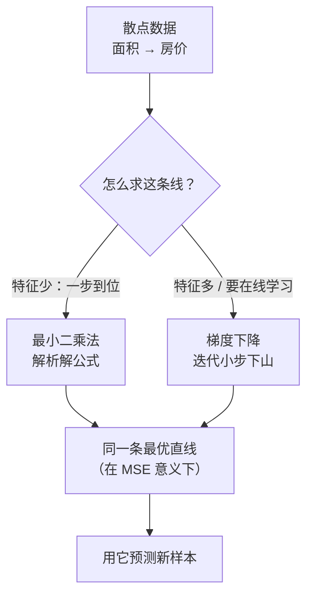

# 线性回归

> **一句话理解**：线性回归（Linear Regression）就是拿一条直线（多维时是超平面）去"穿过"历史数据点，然后用这条线预测下一个连续数值——预测房价、销量、温度，它都是第一块积木。

[⬆️ 返回总目录](../../../README.md) · [⬆️ 返回本篇](../README.md) · [⬅️ 返回本章目录](./README.md)

| 属性 | 说明 |
|------|------|
| 难度 | ⭐⭐（进阶） |
| 所属分支 | 通用基础 |
| 前置知识 | [机器学习全景](./01-机器学习全景.md)；[微积分与梯度](../../1-起步准备/02-数学基础/03-微积分与梯度.md) |

---

## 📌 这一节解决什么问题

你想预测房价：手上有过去一年的成交记录——面积 50 平卖了 180 万、60 平卖了 210 万……问题：**下一套 100 平的房子，该挂多少万？**

这不是分类题（答案不是"贵 / 便宜"），而是**回归（Regression）题**：预测一个连续数值。最自然的假设是"房价和面积大致成比例"——在图上就是一条直线。于是问题变成两小问：

1. 这条直线长什么样（斜率、截距怎么定）？
2. 定成什么样才算"拟合得好"？

线性回归给出的答案简洁到惊人：**让所有点到直线的"铅垂距离"平方和最小**的那条直线，就是最好的。它 200 多年前就被用在行星轨道计算里，今天仍然是所有预测项目的第一个基线（Baseline）——打不过它的复杂模型，多半是白折腾。

## 🌱 通俗理解

想象一块软木板，上面钉着几十枚图钉（每个图钉是一个数据点：横轴面积、纵轴房价）。现在要**拉一根橡皮筋穿过所有图钉中间**：

- 橡皮筋会自动停在"上方图钉的拉力 = 下方图钉的拉力"的平衡位置——这正是"平方和最小"的直觉版：谁离得远，往回拽的劲就越大；
- 图钉散得越开、越像一条直线，橡皮筋越"稳"，预测越可信；图钉乱成一团，橡皮筋怎么拉都别扭——这时候别怪橡皮筋，是数据本身没啥线性规律。

那"求出这条直线"有几种办法？两种：**一种是一步算出来**（最小二乘的解析解，像用公式直接解方程）；**另一种是小步走过去**（梯度下降，蒙眼下山，每步朝更低的方走一点）。下面核心原理里对比。

## 📋 举个例子

5 套房的成交数据（面积单位：平；房价单位：万）：

| 面积 x | 50 | 60 | 80 | 100 | 120 |
|---|---|---|---|---|---|
| 房价 y | 180 | 210 | 280 | 350 | 420 |

肉眼可见"每平大约 3.5 万"。我们用最简单的模型 **$\hat{y} = w \cdot x$**（只有一个旋钮 $w$，先不管截距），手动走**一步**梯度下降：

1. **初始**：$w = 3.0$。预测 100 平 = $3.0 \times 100 = 300$ 万，真实 350 万，**误差 50 万**（预测偏低）；
2. **看梯度**：只看这一个点，损失对 $w$ 的斜率约为 $2 \times \text{误差} \times x = 2 \times 50 \times 100 = 10000$。误差为负方向……先别慌符号，记住结论：**预测偏低，说明 $w$ 该调大；预测偏高，该调小；误差越大调得越多**；
3. **走一步**：取学习率 $\eta = 0.00001$，调整量 $= \eta \times 10000 = 0.1$，于是 $w: 3.0 \to 3.1$；
4. **验证**：新预测 100 平 = 310 万，离 350 更近了——误差从 50 缩到 40。

一步只挪了 0.1，但方向对了；循环几十步，$w$ 会一路爬到 3.5 附近。全程数字见下面的折叠框。

<details>
<summary>📊 展开完整三步算例（全批梯度下降，η = 0.00002）</summary>

用全部 5 个点算梯度（这才是真正的"全批梯度下降"，公式 $\frac{\partial L}{\partial w} = \frac{2}{5}\sum(\hat{y}_i - y_i)\,x_i$，可整理成 $\frac{2}{5}(w\sum x_i^2 - \sum x_i y_i)$）。

先备好两个和：$\sum x_i^2 = 36900$，$\sum x_i y_i = 129400$（理论最优 $w^* = 129400/36900 \approx 3.507$）。

| 轮次 | w | 五个预测 | 五个误差 | 均方误差 MSE | 梯度 | 更新后 w |
|---|---|---|---|---|---|---|
| 1 | 3.00 | 150/180/240/300/360 | −30/−30/−40/−50/−60 | 1900 | −7480 | 3.15 |
| 2 | 3.15 | 157/189/252/315/378 | −23/−21/−28/−35/−42 | 946 | −5272 | 3.25 |
| 3 | 3.25 | 163/195/260/325/390 | −17/−15/−20/−25/−30 | 472 | −3716 | 3.33 |

看两件事：**MSE 一路下跌**（1900 → 946 → 472，理论最低约 4.7）；**步子自动变小**（梯度从 −7480 缩到 −3716）——离谷底越近，坡越缓，步子越小，这就是梯度下降"自带刹车"的特性。再迭代几十轮，$w$ 稳定在 3.51 附近。

</details>

## 🧠 核心原理

### 整体流程



### 逐步拆解

**① 模型：直线，或者高维空间里的"超平面"**

$$
\hat{y} = w_1 x_1 + w_2 x_2 + \cdots + w_d x_d + b
$$

> 👉 **人话**：房价不只看面积，还能加进卧室数、地铁距离……每多一个特征就多一个旋钮 $w$，每个 $w$ 表示"这个条件每变一单位，房价变多少万"。二维时是直线，三维是平面，更高维叫超平面——本质没变。

**② 损失：均方误差**

$$
\text{MSE} = \frac{1}{n}\sum_{i=1}^{n}(y_i - \hat{y}_i)^2
$$

> 👉 **人话**：每个点"竖着量"到直线的距离，平方（消灭正负号、重罚大错）后取平均。它就是"这条线拟合得好不好"的唯一分数。

**③ 解法一：最小二乘法（Least Squares）——一步算出**

$$
w = (X^\top X)^{-1}X^\top y
$$

> 👉 **人话**：数学家已经把"橡皮筋平衡位置"解成了公式，把数据代进去**一步**得到最优旋钮，不用迭代。代价：特征一多（上万维），矩阵求逆又慢又占内存——所以它适合"特征少"的场景。

**④ 解法二：梯度下降——小步下山**

$$
w \leftarrow w - \eta \cdot \frac{\partial \text{MSE}}{\partial w}
$$

> 👉 **人话**：蒙眼站在山坡上（损失曲面），用脚感受"哪边更陡"，往低处挪一小步；重复到几乎不动。特征再多也能算，还是[第 4 章](../../3-深度学习/04-深度学习基础/README.md)训练神经网络的发动机——从这块积木开始它就要陪我们走完全书。

**⑤ 评估指标：光有 MSE 不够**

| 指标 | 直觉 | 单位 | 人话 |
|------|------|------|------|
| MSE | 误差平方的均值 | 万²（平方了，不好懂） | 大错重罚，数学友好但读着别扭 |
| RMSE | $\sqrt{\text{MSE}}$ | 万（回到原始单位） | "平均差大约 15 万"，直接能跟业务说 |
| MAE | 误差绝对值的均值 | 万 | 对离群点宽容：一套急售房拉不歪它 |
| R² | $1 - \dfrac{\text{模型误差}}{\text{直接猜均值的误差}}$ | 无量纲，≤1 | **模型解释了房价变化的百分之多少**：R²=0.95 即"房价的起伏，95% 被这条线讲清楚了" |

$$
R^2 = 1 - \frac{\sum_i (y_i - \hat{y}_i)^2}{\sum_i (y_i - \bar{y})^2}
$$

> 👉 **人话**：分母是"最笨的办法（见房就报均价）的总误差"，分子是"你的模型的总误差"。R² = 1 − 两者之比：模型误差压到笨办法的 5%，R² 就是 0.95。

**⑥ 多项式回归（Polynomial Regression）：给直线加上"弯"**

数据明显是弯的（房价随面积先涨后平）？把 $x^2, x^3$ 也当新特征塞进模型：

$$
\hat{y} = w_1 x + w_2 x^2 + w_3 x^3 + b
$$

> 👉 **人话**：模型对旋钮 $w$ 仍是线性的（所以还叫线性回归家族），但画出来的线能弯了。⚠️ **过拟合预警**：次数给太高（比如 15 次），曲线会把噪声也一丝不苟地背下来——训练分漂亮，新数据上翻车，[07-模型评估与调优](./07-模型评估与调优.md)细讲。

## 💻 动手试试

造一条"正弦 + 噪声"的数据，看直线 vs 多项式的差距，顺便预览过拟合：

```python
import numpy as np
from sklearn.linear_model import LinearRegression
from sklearn.preprocessing import PolynomialFeatures
from sklearn.pipeline import make_pipeline
from sklearn.model_selection import train_test_split

rng = np.random.RandomState(42)
X = np.sort(rng.uniform(0, 6, 60)).reshape(-1, 1)   # 60 个输入点
y = np.sin(X).ravel() + rng.normal(0, 0.2, 60)      # 正弦曲线 + 噪声
X_tr, X_te, y_tr, y_te = train_test_split(X, y, test_size=0.3, random_state=42)

for degree, name in [(1, "直线"), (3, "三次多项式"), (15, "十五次多项式")]:
    model = make_pipeline(PolynomialFeatures(degree),   # 自动生成 x²、x³… 等高次特征
                          LinearRegression()).fit(X_tr, y_tr)
    print(f"{name:8s} 训练 R²={model.score(X_tr, y_tr):.3f}  测试 R²={model.score(X_te, y_te):.3f}")

# 预期输出（随机种子固定，可复现）：
# 直线      训练 R²=0.656  测试 R²=0.425   ← 直线弯不过来，欠拟合
# 三次多项式 训练 R²=0.941  测试 R²=0.936   ← 弯度刚好，训练测试齐头并进
# 十五次多项式 训练 R²=0.956 测试 R²=0.909  ← 训练还在涨、测试开始掉头，过拟合冒头
```

重点看最后一行的"剪刀差"：复杂度加码后**训练分数仍在涨、测试分数开始跌**——这就是过拟合的信号灯。

## 🔥 炼丹小灶

> 🔥 **炼丹小灶**：工业界常用起点配方与玄学——
> - 配方：任何回归项目**第一步永远先跑线性回归基线**（特征标准化后），拿到 RMSE / R² 再谈复杂模型；多项式次数从 2、3 试起，很少超过 5；
> - 玄学：基线 R² < 0.3 时先别换模型，回去翻数据和特征——大概率是特征没找对，不是模型不够炫；RMSE 一定要换回原始单位报给业务方，"MSE = 225"没人听得懂，"平均差 15 万"人人能懂；
> - ⚠️ 以上是经验参考值，不是圣旨；换数据集请重新炼。

## 🔗 在知识树中的位置

- **上游**：[机器学习全景](./01-机器学习全景.md)的"模型 = 带旋钮的函数、学习 = 调旋钮降损失"在本页完整落地。
- **下游**：[逻辑回归与分类](./03-逻辑回归与分类.md)（给线性打分器接一个 sigmoid 就能做分类）；[第 4 章：深度学习基础](../../3-深度学习/04-深度学习基础/README.md)（神经网络 = 一层线性变换 + 激活函数反复堆叠）。
- **横向对比**：非线性厉害的规律交给[决策树与集成学习](./04-决策树与集成学习.md)；但"要系数可解释、要外推趋势"时，线性回归仍无可替代。

## ⚠️ 常见误区

- **误区一**："线性回归只能画直线" → 加多项式特征后它能拟合曲线；"线性"指的是**对参数 $w$ 线性**，不是对 $x$ 线性。
- **误区二**："R² 越高模型越好" → 在训练集上，加特征、加次数 R² **只会升不会降**；要盯"测试集 R²"和训练测试的差距。
- **误区三**："斜率大 = 这个特征重要" → 特征没标准化时，单位不同系数没法直接比（面积系数 3.5 vs 地铁距离系数 −20，不代表地铁更重要）。

## 📝 小结与自测

**要点回顾**

- 线性回归 = 用直线/超平面拟合数据、预测连续数值；最优标准是"铅垂距离平方和最小"；
- 两种解法：最小二乘一步到位（特征少），梯度下降迭代逼近（特征多、可扩展到神经网络）；
- 指标四件套：MSE（数学友好）、RMSE（单位还原）、MAE（抗离群）、R²（解释了多少变化）；
- 多项式回归能弯，但次数过高 = 把噪声背下来 = 过拟合。

**自测一下**（点击展开答案）

<details>
<summary>问题 1：MSE 都是 400 的两个模型，怎么判断哪个更值得上线？</summary>

MSE 相同只说明"平均平方误差"一样，还要看：(1) MAE / 离群点表现——一个模型可能被少数极端样本拖累，多数样本其实更准；(2) 误差分布——是均匀的小错还是偶尔的大错，业务后果完全不同；(3) 残差有没有系统性规律（比如高价房系统性低估），有规律说明模型还欠东西。

</details>

<details>
<summary>问题 2：什么时候选最小二乘解析解，什么时候选梯度下降？</summary>

特征维度不高（几千维以内）、数据装得进内存时，解析解一步出结果，快且精确；特征极多、数据量大到要分批读（或模型要在线持续更新）时，梯度下降（及其变体 SGD / 小批量）更现实。另外一旦模型变成非线性的复杂结构（如神经网络），解析解根本不存在，只能靠梯度下降族。

</details>

## 📚 延伸阅读

- 书：周志华《机器学习》第 3 章——线性模型的系统讲法
- 课程：吴恩达 Machine Learning Specialization（Coursera）——回归与梯度下降的经典入门
- 博客：sklearn 官方文档 Linear Models 章节——正则化变体（Ridge / Lasso）的第一手资料

---

[⬅️ 上一页：机器学习全景](./01-机器学习全景.md) · [返回本章目录](./README.md) · [下一页：逻辑回归与分类 ➡️](./03-逻辑回归与分类.md)
