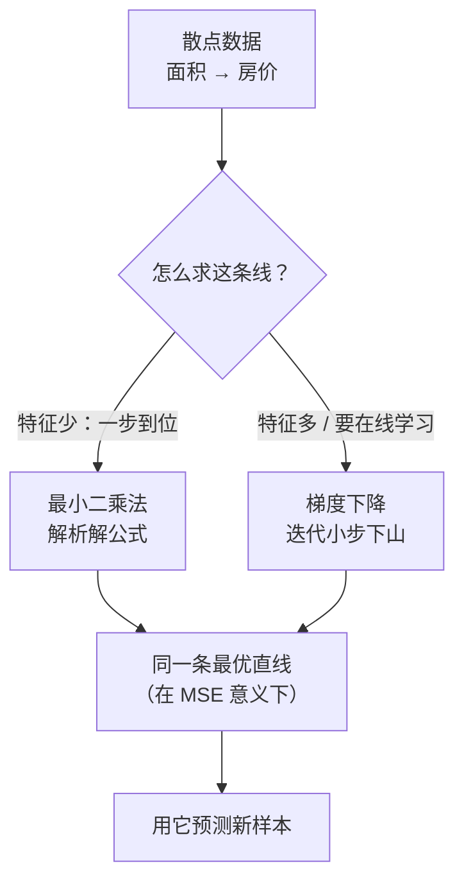

# 线性回归

> **一句话理解**：线性回归（Linear Regression）就是拿一条直线（多维时是超平面）去"穿过"历史数据点，然后用这条线预测下一个连续数值——预测房价、销量、温度，它都是第一块积木。

[⬆️ 返回总目录](../../../README.md) · [⬆️ 返回本篇](../README.md) · [⬅️ 返回本章目录](./README.md)

| 属性 | 说明 |
|------|------|
| 难度 | ⭐⭐（进阶） |
| 所属分支 | 通用基础 |
| 前置知识 | [机器学习全景](./01-机器学习全景.md)；[微积分与梯度](../../1-起步准备/02-数学基础/03-微积分与梯度.md)、[线性代数](../../1-起步准备/02-数学基础/02-线性代数.md) |

---

## 📌 这一节解决什么问题

你想预测房价：手上有过去一年的成交记录——面积 50 平卖了 180 万、60 平卖了 210 万……问题：**下一套 100 平的房子，该挂多少万？**

这不是分类题（答案不是"贵 / 便宜"），而是**回归（Regression）题**：预测一个连续数值。最自然的假设是"房价和面积大致成比例"——在图上就是一条直线。于是问题变成两小问：

1. 这条直线长什么样（斜率、截距怎么定）？
2. 定成什么样才算"拟合得好"？

线性回归给出的答案简洁到惊人：**让所有点到直线的"铅垂距离"平方和最小**的那条直线，就是最好的。它 200 多年前就被用在行星轨道计算里，今天仍然是所有预测项目的第一个基线（Baseline）——打不过它的复杂模型，多半是白折腾。

## 🌱 通俗理解

想象一块软木板，上面钉着几十枚图钉（每个图钉是一个数据点：横轴面积、纵轴房价）。现在要**拉一根橡皮筋穿过所有图钉中间**：

- 橡皮筋会自动停在"上方图钉的拉力 = 下方图钉的拉力"的平衡位置——这正是"平方和最小"的直觉版：谁离得远，往回拽的劲就越大；
- 图钉散得越开、越像一条直线，橡皮筋越"稳"，预测越可信；图钉乱成一团，橡皮筋怎么拉都别扭——这时候别怪橡皮筋，是数据本身没啥线性规律。

那"求出这条直线"有几种办法？两种：**一种是一步算出来**（最小二乘的解析解，像用公式直接解方程）；**另一种是小步走过去**（梯度下降，蒙眼下山，每步朝更低的方向走一点）。下面核心原理里对比。

还有一个更深的视角可以提前剧透：最小二乘解**在几何上是把答案"投影"到模型能表达的平面上**——$y$ 向量垂直落到"由特征张成的平面"上的那个落点，就是最优预测。这句话现在看很玄，读完本页的投影小节再回头看，会有"原来如此"的瞬间。

## 📋 举个例子

5 套房的成交数据（面积单位：平；房价单位：万）：

| 面积 x | 50 | 60 | 80 | 100 | 120 |
|---|---|---|---|---|---|
| 房价 y | 180 | 210 | 280 | 350 | 420 |

肉眼可见"每平大约 3.5 万"。我们用最简单的模型 **$\hat{y} = w \cdot x$**（只有一个旋钮 $w$，先不管截距），手动走**一步**梯度下降：

1. **初始**：$w = 3.0$。预测 100 平 = $3.0 \times 100 = 300$ 万，真实 350 万，**误差 50 万**（预测偏低）；
2. **看梯度**：只看这一个点，损失对 $w$ 的斜率约为 $2 \times \text{误差} \times x = 2 \times 50 \times 100 = 10000$。误差为负方向……先别慌符号，记住结论：**预测偏低，说明 $w$ 该调大；预测偏高，该调小；误差越大调得越多**；
3. **走一步**：取学习率 $\eta = 0.00001$，调整量 $= \eta \times 10000 = 0.1$，于是 $w: 3.0 \to 3.1$；
4. **验证**：新预测 100 平 = 310 万，离 350 更近了——误差从 50 缩到 40。

一步只挪了 0.1，但方向对了；循环几十步，$w$ 会一路爬到 3.5 附近。全程数字见下面的折叠框。

<details>
<summary>📊 展开完整三步算例（全批梯度下降，η = 0.00002）</summary>

用全部 5 个点算梯度（这才是真正的"全批梯度下降"，公式 $\frac{\partial L}{\partial w} = \frac{2}{5}\sum(\hat{y}_i - y_i)\,x_i$，可整理成 $\frac{2}{5}(w\sum x_i^2 - \sum x_i y_i)$）。

先备好两个和：$\sum x_i^2 = 36900$，$\sum x_i y_i = 129400$（理论最优 $w^* = 129400/36900 \approx 3.507$）。

| 轮次 | w | 五个预测 | 五个误差 | 均方误差 MSE | 梯度 | 更新后 w |
|---|---|---|---|---|---|---|
| 1 | 3.00 | 150/180/240/300/360 | −30/−30/−40/−50/−60 | 1900 | −7480 | 3.15 |
| 2 | 3.15 | 157/189/252/315/378 | −23/−21/−28/−35/−42 | 946 | −5272 | 3.25 |
| 3 | 3.25 | 163/195/260/325/390 | −17/−15/−20/−25/−30 | 472 | −3716 | 3.33 |

看两件事：**MSE 一路下跌**（1900 → 946 → 472，理论最低约 4.7）；**步子自动变小**（梯度从 −7480 缩到 −3716）——离谷底越近，坡越缓，步子越小，这就是梯度下降"自带刹车"的特性。再迭代几十轮，$w$ 稳定在 3.51 附近。

</details>

**再算一个"失败情况"**：把 5 个点换成面积完全相同的 5 套房（x 全是 80 平，房价 250~400 万不等）。此时 $\sum x_i^2 = 5 \times 6400$、$\sum x_i y_i$ 仍可算，$w^*$ 也有值——但这条"线"只在一个点上有信息，**只要 x 变一点点（81 平），预测就纯靠外推**，方差巨大。这预告了后文"外推危险"与"共线性"两块内容：拟合好 ≠ 哪里都能信。

## 🧠 核心原理

### 整体流程



### 逐步拆解

**① 模型：直线，或者高维空间里的"超平面"**

$$
\hat{y} = w_1 x_1 + w_2 x_2 + \cdots + w_d x_d + b
$$

> 👉 **人话**：房价不只看面积，还能加进卧室数、地铁距离……每多一个特征就多一个旋钮 $w$，每个 $w$ 表示"这个条件每变一单位，房价变多少万"。二维时是直线，三维是平面，更高维叫超平面——本质没变。

把所有样本摞成矩阵 $X$（每行一个样本、再加一列全 1 对应截距），模型写成一行：

$$
\hat{y} = Xw, \qquad X \in \mathbb{R}^{n\times(d+1)}
$$

> 👉 **人话**：5 套房的预测可以一次算完——5 行数据乘以旋钮向量。这个"摞起来"的写法是后面正规方程推导的舞台。

**② 损失：均方误差**

$$
\text{MSE} = \frac{1}{n}\sum_{i=1}^{n}(y_i - \hat{y}_i)^2
$$

> 👉 **人话**：每个点"竖着量"到直线的距离，平方（消灭正负号、重罚大错）后取平均。它就是"这条线拟合得好不好"的唯一分数。

**③ 解法一：最小二乘法（Least Squares）——一步算出**

$$
\hat{w} = (X^\top X)^{-1}X^\top y
$$

> 👉 **人话**：数学家已经把"橡皮筋平衡位置"解成了公式，把数据代进去**一步**得到最优旋钮，不用迭代。代价：特征一多（上万维），矩阵求逆又慢又占内存——所以它适合"特征少"的场景。

这个公式不是天上掉下来的，它就是"令梯度 = 0"解出来的：

<details>
<summary>🧮 展开：正规方程（Normal Equation）完整推导</summary>

目标是最小化 $J(w) = \|y - Xw\|^2 = (y - Xw)^\top (y - Xw)$。展开：

$$
J(w) = y^\top y - 2\,w^\top X^\top y + w^\top X^\top X\,w
$$

（交叉两项 $w^\top X^\top y$ 与 $y^\top X w$ 是同一个数，合并成 $-2w^\top X^\top y$。）

对向量 $w$ 求梯度并令其为 0（矩阵求导两条规则：$\nabla_w (w^\top a) = a$，$\nabla_w (w^\top A w) = 2Aw$，要求 $A$ 对称，而 $X^\top X$ 天然对称）：

$$
\nabla_w J = -2X^\top y + 2X^\top X w \overset{!}{=} 0
\;\Longrightarrow\;
X^\top X\, w = X^\top y
$$

这就是**正规方程**：一个 $(d{+}1)$ 元线性方程组。当 $X^\top X$ 可逆时：

$$
\hat{w} = (X^\top X)^{-1}\,X^\top y
$$

**几何解释（投影视角）**：正规方程移项得 $X^\top (y - X\hat{w}) = 0$，即**残差向量 $y - \hat{y}$ 与 $X$ 的每一列都垂直（正交）**。$Xw$ 的所有可能取值构成"特征张成的平面"（列空间），所以最优解 $\hat{y} = X\hat{w}$ 恰是 $y$ **垂直投影**到这个平面上的落点——就像把一根杆子（真实答案）的影子垂直打到墙面（模型能表达的世界）上。墙内最近的点，就是投影点；再怎么换 $w$，都不可能比影子离杆子更近。

验证它在二维的特例：单特征无截距时 $X^\top X = \sum x_i^2$、$X^\top y = \sum x_i y_i$，公式退化为 $w^* = \sum x_i y_i / \sum x_i^2 = 129400/36900 \approx 3.507$——正是 📋 算例里梯度下降一路逼近的那个值。

</details>

**④ XᵀX 什么时候不可逆：两类经典翻车**

$(X^\top X)^{-1}$ 存在的前提是 $X$ 各列线性无关。翻车就两种：

| 情形 | 例子 | 数学本质 | 症状 |
|------|------|----------|------|
| **完全共线性** | 一个特征是另一个的倍数（"面积（平米）"和"面积（平方英尺）"都放进了模型） | $X$ 的某一列 = 其他列的线性组合，$X^\top X$ 奇异 | 求逆报错 / 解不唯一：无穷多组 $w$ 给出同样的预测 |
| **特征多于样本** | 基因数据：200 个病人 × 20000 个基因 | 秩最多为 $n$，$X^\top X$ 秩亏（$d+1 > n$） | 同上；高维小样本的常态 |

> 👉 **人话**：方程组"题目不够、未知数太多"，或者"两道题其实是同一道题抄了两遍"——没有唯一解。三副药：(1) **删掉冗余特征**（治本，先看相关矩阵 / VIF）；(2) **岭回归**：给 $X^\top X$ 加 $\lambda I$ 再求逆，$X^\top X + \lambda I$ 几乎总能可逆——这正是 L2 正则最实际的工程红利之一；(3) **伪逆** `np.linalg.pinv`（数值上取"最小范数解"，sklearn 的 `LinearRegression` 内部就是这么兜底的）。

**⑤ 解法二：梯度下降——小步下山**

$$
w \leftarrow w - \eta \cdot \frac{\partial \text{MSE}}{\partial w}
$$

> 👉 **人话**：蒙眼站在山坡上（损失曲面），用脚感受"哪边更陡"，往低处挪一小步；重复到几乎不动。特征再多也能算，还是[第 4 章](../../3-深度学习/04-深度学习基础/README.md)训练神经网络的发动机——从这块积木开始它就要陪我们走完全书。

两条路怎么选，一张表说清：

| | 正规方程（一步解） | 梯度下降（迭代） |
|---|---|---|
| 适用规模 | 特征几千维以内、数据装进内存 | 特征 / 样本任意大，可流式、可在线更新 |
| 学习率 | 不需要 | 要调 $\eta$，调坏不收敛或极慢 |
| 结果性质 | 全局唯一最优（凸问题的精确解） | 逼近解，受超参与数值精度影响 |
| 计算瓶颈 | 矩阵求逆 $O(d^3)$，$d$ 一大就爆 | 每轮 $O(nd)$，按轮数付费 |
| 能否扩展到非线性模型 | 不能（神经网络没有解析解） | 能——这是它真正的王座 |
| 一句话 | 小题直接解方程 | 大题与复杂模型只有这条路 |

**⑥ 评估指标：光有 MSE 不够**

| 指标 | 直觉 | 单位 | 人话 |
|------|------|------|------|
| MSE | 误差平方的均值 | 万²（平方了，不好懂） | 大错重罚，数学友好但读着别扭 |
| RMSE | $\sqrt{\text{MSE}}$ | 万（回到原始单位） | "平均差大约 15 万"，直接能跟业务说 |
| MAE | 误差绝对值的均值 | 万 | 对离群点宽容：一套急售房拉不歪它 |
| R² | $1 - \dfrac{\text{模型误差}}{\text{直接猜均值的误差}}$ | 无量纲，≤1 | **模型解释了房价变化的百分之多少**：R²=0.95 即"房价的起伏，95% 被这条线讲清楚了" |

$$
R^2 = 1 - \frac{\sum_i (y_i - \hat{y}_i)^2}{\sum_i (y_i - \bar{y})^2}
$$

> 👉 **人话**：分母是"最笨的办法（见房就报均价）的总误差"，分子是"你的模型的总误差"。R² = 1 − 两者之比：模型误差压到笨办法的 5%，R² 就是 0.95。

**⑦ 残差分析：看"错在哪"比看"错多少"更重要**

残差（Residual）$= y_i - \hat{y}_i$，即每个点"没被模型讲清楚的部分"。把它对着预测值 $\hat{y}$（或每个特征、或时间）画散点图，**健康的残差应该像无规律的星空**；一旦出现规律，就是模型在报警。四种典型形态：

```text
① 健康：随机散布，无任何形状        ② 弯曲：漏了非线性
   |  ·    ·     ·  ·                 |          ·   ·
   |    ·   ·   ·    ·                |   ·   ·        ·
   | ·    ·    ·  ·   ·               |  ·   ·  ·   ·     ← 先降后升的 U 形
   |   ·    ·  ·    ·                 |   ·  ·  ·  ·
   +--------------------→ ŷ           +--------------------→ ŷ
   解读：线性假设成立                   解读：加 x² 项 / 换树模型

③ 漏斗形：异方差（方差不齐）         ④ 随时间漂移：自相关 / 分布变了
   |·                   ·             |    ···     ······
   | ·      ··        ·  ·            |  ···  ·····
   |  ··   ····   ··    ·             | ··  ····
   |   ········                       |··
   +--------------------→ ŷ           +--------------------→ 时间
   解读：大房价预测更不准              解读：残差扎堆 / 有趋势 →
   补救：log 变换 y、加权最小二乘        加时间特征 / 按时间重切分验证
```

> 👉 **人话**：① 剩下的全是随机噪声，模型把能讲的都讲了；② 剩余误差自己会"弯"，说明还有系统性规律没捡起来；③ 误差的"喇叭口"随预测值张大，说明高低价区间的可靠度不一样；④ 残差随时间扎堆，说明世界在变（呼应[全景页的分布偏移](./01-机器学习全景.md)）。**回归做完先画残差图，是老工程师的肌肉记忆。**

**⑧ 多重共线性（Multicollinearity）：系数乱跳的隐形病**

完全共线性让求解崩溃，**近似**共线性更阴险——不报错，但悄悄毁掉可解释性：

- **症状**：微调一两条样本、或换一次随机划分，某几个系数就大幅跳动甚至**正负号翻转**；某个理论上该有正作用的特征，系数却是负的。
- **机理**：两个高度相关的特征（如"面积"和"房间数"）像两个互相推诿的合伙人——预测由"它们的组合"贡献，但**功劳怎么分（系数怎么分）极不唯一**：$w_1$ 大 $w_2$ 小和 $w_1$ 小 $w_2$ 大预测一样好，数据稍动，最优分割点就大幅摆动。**预测受影响小，解释受影响大**。
- **诊断**：方差膨胀因子（Variance Inflation Factor，VIF）——第 $j$ 个特征的 VIF ≈ 它能被其余特征线性解释的程度，**经验上 VIF > 10 报警**（`statsmodels` 一行可算）。
- **补救**：删掉高 VIF 里的冗余特征 / 合并成比率 / 主成分回归（[06-聚类与降维](./06-聚类与降维.md)）/ 岭回归（L2 罚把系数分割方式稳定下来）。要解读系数，先治共线性；只要预测，可稍微宽容。

**⑨ L2 正则 = 高斯先验：贝叶斯视角的岭回归**

给损失加 $\lambda \sum w_j^2$ 得到岭回归（Ridge）。这个"罚金"在贝叶斯眼里另有身份：

$$
L_{ridge} = \underbrace{\sum_i (y_i - \hat{y}_i)^2}_{\text{数据说了算}} + \lambda\sum_j w_j^2
$$

> 👉 **人话**：最小二乘 = 只听数据的（频率派）；岭回归 = 数据 + 一条**先验信念**"系数大概都不大"（贝叶斯派）。$\lambda$ 调的是你多信这条信念：数据又多又准时听数据的，数据又少又噪时听信念的。同一件事的两种叙事，殊途同归。

<details>
<summary>🧮 展开：从"高斯先验 + 高斯噪声"推出岭回归</summary>

设贝叶斯线性回归：先验 $w \sim \mathcal{N}(0, \tau^2 I)$（"我猜每个系数都不大，散布半径 $\tau$"），噪声 $y - Xw \sim \mathcal{N}(0, \sigma^2)$。由[贝叶斯公式](../../1-起步准备/02-数学基础/04-概率与统计.md)，后验 ∝ 似然 × 先验：

$$
P(w \mid y, X) \propto \exp\!\Big(-\frac{\|y - Xw\|^2}{2\sigma^2}\Big) \cdot \exp\!\Big(-\frac{\|w\|^2}{2\tau^2}\Big)
$$

取负对数（最大化后验 MAP ⟺ 最小化负对数）：

$$
-\log P(w \mid y, X) = \frac{1}{2\sigma^2}\|y - Xw\|^2 + \frac{1}{2\tau^2}\|w\|^2 + \text{常数}
$$

两边乘 $2\sigma^2$，记 $\lambda = \sigma^2 / \tau^2$：

$$
\min_w\ \|y - Xw\|^2 + \lambda \|w\|^2 \quad\Longleftrightarrow\quad \text{岭回归}
$$

> 👉 **人话**：$\lambda = \sigma^2/\tau^2$ 是"噪声方差 ÷ 先验方差"——数据越吵（$\sigma^2$ 大），越该压系数；先验越紧（$\tau^2$ 小），也越该压系数。反过来，$\lambda \to 0$ 时先验完全放任，退回最小二乘。把 $\lambda$ 理解成"对数据的信任折扣"，调参就不是玄学而是立场表态。（贝叶斯思想在第 11 章因果推断、第 12 章生成模型里还会反复登场。）

</details>

**⑩ 多项式回归（Polynomial Regression）：给直线加上"弯"**

数据明显是弯的（房价随面积先涨后平）？把 $x^2, x^3$ 也当新特征塞进模型：

$$
\hat{y} = w_1 x + w_2 x^2 + w_3 x^3 + b
$$

> 👉 **人话**：模型对旋钮 $w$ 仍是线性的（所以还叫线性回归家族），但画出来的线能弯了。⚠️ **过拟合预警**：次数给太高（比如 15 次），曲线会把噪声也一丝不苟地背下来——训练分漂亮，新数据上翻车，[07-模型评估与调优](./07-模型评估与调优.md)细讲。另一个常被忽视的坑：**多项式外推极危险**——15 次曲线在训练范围之外会垂直发射，预测 130 平的房子可能给出天文数字（**模型只在"见过的 x 范围"内负责**，这是所有回归的通用边界）。

### 📐 数学深潜：帽子矩阵 H = X(XᵀX)⁻¹Xᵀ——幂等、对称与杠杆

**③的正规方程 ŵ=(XᵀX)⁻¹Xᵀy 与它折叠框里的投影视角之间，站着一个把两者缝起来的矩阵**：帽子矩阵（Hat Matrix）$H=X(X^{\top}X)^{-1}X^{\top}$——"给 y 戴上帽子 ŷ"。它的两条代数性质（对称、幂等）正是"正交投影"的矩阵指纹，对角线还藏着每个样本的"话语权"。

**严格陈述。** 设 $X\in\mathbb{R}^{n\times(d+1)}$ 列满秩，$\hat y=X\hat w=Hy$。则：

1. **对称**：$H^{\top}=H$；　**幂等（idempotent）**：$H^2=H$（戴两次帽子 = 戴一次）；
2. **几何身份**：$H$ 是到 $X$ 列空间上的正交投影矩阵——残差 $(I-H)y$ 垂直于列空间；
3. **对角线**：$h_{ii}=x_i^{\top}(X^{\top}X)^{-1}x_i\in[0,1]$，且 $\sum_ih_{ii}=d+1$——$h_{ii}$ 叫第 i 个样本的**杠杆值（Leverage）**。

> 👉 **人话**：H 是"压影子"机器——把 y 垂直压进列空间。压两次等于压一次（影子还是影子）；对角线是配额表——每个样本"拽直线"的权力，总额固定为 d+1，x 取值越极端配额越高。

**完整推导：对称、幂等、投影身份、配额表，逐条算。**

<details>
<summary>🧮 展开推导：转置与逆的规则、结合律消元、迹的轮换、h_ii 的上下界</summary>

**工具（三条规则）**：$(AB)^{\top}=B^{\top}A^{\top}$；$(A^{\top})^{\top}=A$；$(A^{-1})^{\top}=(A^{\top})^{-1}$（逆与转置可换序：$A^{\top}(A^{-1})^{\top}=(A^{-1}A)^{\top}=I$）。

**① 对称。** $X^{\top}X$ 显然对称（$(X^{\top}X)^{\top}=X^{\top}X$），于是其逆也对称：$\big[(X^{\top}X)^{-1}\big]^{\top}=\big[(X^{\top}X)^{\top}\big]^{-1}=(X^{\top}X)^{-1}$。逐层剥转置：

$$
H^{\top}=\big[X(X^{\top}X)^{-1}X^{\top}\big]^{\top}=X\ \big[(X^{\top}X)^{-1}\big]^{\top}\ X^{\top}=X(X^{\top}X)^{-1}X^{\top}=H\quad\blacksquare
$$

**② 幂等。** 从左往右乘，中间 $(X^{\top}X)^{-1}$ 与 $X^{\top}X$ 相消：

$$
H^2=X\underbrace{(X^{\top}X)^{-1}}_{}\ X^{\top}X\ \underbrace{(X^{\top}X)^{-1}}_{}\ X^{\top}=X\,(X^{\top}X)^{-1}\,X^{\top}=H\quad\blacksquare
$$

（结合律重排括号：$H\cdot H=X\big[(X^{\top}X)^{-1}(X^{\top}X)\big]\,(X^{\top}X)^{-1}X^{\top}$，中括号内 $A^{-1}A=I$。）

**③ 投影身份。** 两行各证一件事：
- 影子在列空间：$Hy=X\big[(X^{\top}X)^{-1}X^{\top}y\big]$ 是"X 的列 × 某系数向量"——列空间成员；
- 残差垂直于列空间：$X^{\top}(I-H)=X^{\top}-X^{\top}X(X^{\top}X)^{-1}X^{\top}=X^{\top}-X^{\top}=\mathbf 0$——与每一列都垂直。

两条合起来正是[线性代数](../../1-起步准备/02-数学基础/02-线性代数.md)正交投影定理的刻画——**H = 投影定理的矩阵化身**；幂等性的几何读法（影子再投一次还是影子）、对称性的几何读法（正交投影必对称）至此对上号。

**④ 配额表：总和与上下界。**
- 总和用迹的轮换性 $\mathrm{tr}(AB)=\mathrm{tr}(BA)$：

$$
\sum_ih_{ii}=\mathrm{tr}(H)=\mathrm{tr}\big(X(X^{\top}X)^{-1}X^{\top}\big)=\mathrm{tr}\big((X^{\top}X)^{-1}X^{\top}X\big)=\mathrm{tr}(I_{d+1})=d+1
$$

- 上下界：$H$ 幂等且对称 ⟹ $H=H^{\top}H$（幂等代入、再用对称），看第 i 个对角元：

$$
h_{ii}=(H^{\top}H)_{ii}=\sum_jh_{ji}^2=\sum_jh_{ij}^2\ \ge\ h_{ii}^2\ \Longrightarrow\ h_{ii}^2\le h_{ii}\ \Longrightarrow\ 0\le h_{ii}\le1
$$

（$h_{ii}\ge0$ 因为它是平方和；而 $h^2\le h$ 只在 $[0,1]$ 上成立。）∎

**数字小算例（3 个点、1 个特征 + 截距）。** $x=[1,2,3]$，$X=\begin{bmatrix}1&1\\1&2\\1&3\end{bmatrix}$：$X^{\top}X=\begin{bmatrix}3&6\\6&14\end{bmatrix}$，行列式 $42-36=6$，逆 $=\frac16\begin{bmatrix}14&-6\\-6&3\end{bmatrix}$。逐行算 $h_{ii}=x_i^{\top}(X^{\top}X)^{-1}x_i$：

| 样本 | $x_i$ | $h_{ii}$ | 计算过程 |
|---|---|---|---|
| 1 | (1, 1) | **5/6 ≈ 0.833** | $\frac16[1,1]\begin{bmatrix}14&-6\\-6&3\end{bmatrix}[1,1]^{\top}=\frac{8-3}{6}$ |
| 2 | (1, 2) | **1/3 ≈ 0.333** | $\frac16[1,2]\begin{bmatrix}14&-6\\-6&3\end{bmatrix}[1,2]^{\top}=\frac{2+0}{6}$ |
| 3 | (1, 3) | **5/6 ≈ 0.833** | $\frac16[1,3]\begin{bmatrix}14&-6\\-6&3\end{bmatrix}[1,3]^{\top}=\frac{-4+9}{6}$ |

核对：总和 $=\frac56+\frac13+\frac56=2=d+1$ ✓。**两端样本杠杆 0.833、中心样本 0.333**——离数据中心越远，拽直线的权力越大。

</details>

**几何图景（ASCII）：**

```text
   H：把 y 垂直压进列空间              杠杆 h_ii：谁在替直线做主
        y ●                              0.9│        ●           ●
         \ \                                │      3     1     3   ← h_ii
          \ ↘ 压                            │    ●───●───●───●───●
           \  ● ŷ = Hy（影子）              0 │    1   2   3   4   5  x
   —————————●—/———————— 列空间                端点的 x 撬动整条直线
           x                                   （中心点只挪自己附近）
   H²=H：影子再压还是它          Σh_ii = d+1：权力总额固定，端点多分
```

**反例与边界。**

1. **杠杆高 ≠ 预测错**：$h_{ii}$ 只看 X 不看 y——它量的是"**如果**这个点的 y 异常，破坏力有多大"。真正的危险度 = 杠杆 × 残差（Cook 距离）：高杠杆 + 大残差的点才是把直线拽歪的元凶（诊断动作：statsmodels 的 `get_influence()`）；
2. **X 列不满秩时 H 无定义**（$(X^{\top}X)^{-1}$ 不存在）——本页 ④ 的两类翻车；伪逆版 $X(X^{\top}X)^{+}X^{\top}$ 仍是投影（影子唯一），只是"坐标 w"不唯一——解释权再次让位给预测；
3. **H 是 n×n**：样本十万级时显式构造 H 存不下也无必要——工程只在回归诊断时按行取 $h_{ii}=x_i^{\top}(X^{\top}X)^{-1}x_i$（一行公式，无需整表）。

> 👉 **人话总结**：帽子矩阵把"投影"翻译成矩阵——戴帽子（ŷ=Hy）= 把 y 垂直压进模型能表达的空间；H²=H 说影子不变两次，对角线 h_ii 说每个样本撬动直线的配额（总额 d+1、端点吃大头）。"杠杆点"一句话：**x 站得越偏，直线越听它的话**。

## 💻 动手试试

造一条"正弦 + 噪声"的数据，看直线 vs 多项式的差距，顺便预览过拟合：

```python
import numpy as np
from sklearn.linear_model import LinearRegression
from sklearn.preprocessing import PolynomialFeatures
from sklearn.pipeline import make_pipeline
from sklearn.model_selection import train_test_split

rng = np.random.RandomState(42)
X = np.sort(rng.uniform(0, 6, 60)).reshape(-1, 1)   # 60 个输入点
y = np.sin(X).ravel() + rng.normal(0, 0.2, 60)      # 正弦曲线 + 噪声
X_tr, X_te, y_tr, y_te = train_test_split(X, y, test_size=0.3, random_state=42)

for degree, name in [(1, "直线"), (3, "三次多项式"), (15, "十五次多项式")]:
    model = make_pipeline(PolynomialFeatures(degree),   # 自动生成 x²、x³… 等高次特征
                          LinearRegression()).fit(X_tr, y_tr)
    print(f"{name:8s} 训练 R²={model.score(X_tr, y_tr):.3f}  测试 R²={model.score(X_te, y_te):.3f}")

# 预期输出（随机种子固定，可复现）：
# 直线      训练 R²=0.656  测试 R²=0.425   ← 直线弯不过来，欠拟合
# 三次多项式 训练 R²=0.941  测试 R²=0.936   ← 弯度刚好，训练测试齐头并进
# 十五次多项式 训练 R²=0.956 测试 R²=0.909  ← 训练还在涨、测试开始掉头，过拟合冒头
```

重点看最后一行的"剪刀差"：复杂度加码后**训练分数仍在涨、测试分数开始跌**——这就是过拟合的信号灯。

**再看"共线性 + 岭回归救场"的小实验**：故意造一个重复特征，看系数怎么乱、L2 怎么稳住它：

```python
import numpy as np
from sklearn.linear_model import LinearRegression, Ridge

rng = np.random.RandomState(0)
x1 = rng.uniform(0, 10, 200)                    # 真实特征
X_dup = np.c_[x1, 2 * x1 + rng.normal(0, 0.01, 200)]   # 第二列 ≈ 第一列的 2 倍（近似共线）
y = 3 * x1 + rng.normal(0, 1, 200)              # 真实规律：只有 x1 在起作用

for trial in range(3):
    lr = LinearRegression().fit(X_dup, y)       # 最小二乘：伪逆取最小范数解，但极不稳
    ridge = Ridge(alpha=1.0).fit(X_dup, y)      # 岭回归：L2 罚把分割方式稳定下来
    print(f"第{trial+1}次  OLS 系数: {lr.coef_.round(2)}   Ridge 系数: {ridge.coef_.round(2)}")

# 预期输出（数值随 trial 波动）：
# 第1次  OLS 系数: [ 3.02 -0.01]   Ridge 系数: [2.7  0.54]
# 第2次  OLS 系数: [ 2.55  0.24]   Ridge 系数: [2.7  0.55]
# 第3次  OLS 系数: [ 2.98 -0. ]    Ridge 系数: [2.7  0.56]
# —— 两列预测加起来都 ≈ 3×x1，但 OLS 的"功劳分配"每次都在跳，Ridge 几乎不动
```

改什么、看什么：把第二列的噪声从 `0.01` 调大到 `0.5`（共线性减弱），OLS 系数会稳定下来；把 `alpha` 调成 `100`，Ridge 系数会被压得过小（欠拟合）——**正则强度是"稳定性 vs 拟合力"的旋钮**。

## 🔥 炼丹小灶

> 🔥 **炼丹小灶**：工业界常用起点配方与玄学——
> - 配方：任何回归项目**第一步永远先跑线性回归基线**（特征标准化后），拿到 RMSE / R² 再谈复杂模型；多项式次数从 2、3 试起，很少超过 5；连续长尾目标（房价、收入）先试 `log1p` 变换再拟合；
> - 玄学：基线 R² < 0.3 时先别换模型，回去翻数据和特征——大概率是特征没找对，不是模型不够炫；RMSE 一定要换回原始单位报给业务方，"MSE = 225"没人听得懂，"平均差 15 万"人人能懂；系数符号和业务直觉打架时，先查共线性（VIF），别急着下"模型错了"的结论；
> - ⚠️ 以上是经验参考值，不是圣旨；换数据集请重新炼。

## 🔗 在知识树中的位置

- **上游**：[机器学习全景](./01-机器学习全景.md)的"模型 = 带旋钮的函数、学习 = 调旋钮降损失"在本页完整落地；"经验风险 + 结构风险"落地为最小二乘 + 岭回归罚金。
- **下游**：[逻辑回归与分类](./03-逻辑回归与分类.md)（给线性打分器接一个 sigmoid 就能做分类）；[第 4 章：深度学习基础](../../3-深度学习/04-深度学习基础/README.md)（神经网络 = 一层线性变换 + 激活函数反复堆叠）。
- **横向对比**：非线性厉害的规律交给[决策树与集成学习](./04-决策树与集成学习.md)；但"要系数可解释、要外推趋势"时，线性回归仍无可替代。L1 / L2 正则化的系统对比在[模型评估与调优](./07-模型评估与调优.md)。

## 🎓 深度视角

线性回归是"最简单的模型"，但它在 2026 年的真实身份是**现代机器学习系统里分布最广的组件**——不是作为主角，而是作为零件：评分卡最后一层的加权求和、深度推荐模型的输出层、校准管线里的 Platt 缩放与温度缩放（对一维分数做的线性再拟合）、可解释性研究里的线性探针（Linear Probe，在冻结的神经网络表示上训一个线性模型，探测"表示里有没有某种信息"）。**理解线性层的最好方式不是"它太简单"，而是"所有复杂系统最终都收口到一层线性变换"**——这一页的投影几何与正规方程，就是读懂那个收口点的语法。

学术与工业的取舍也不同：统计学家在乎系数的假设检验与置信区间（模型设定要"对"），ML 工程师在乎交叉验证分数与管道稳定（预测要"准"）。两边对同一个 $\hat{w}$ 的读法完全不同——前者要求一堆假设成立才能解读，后者根本不解读系数，只消费预测。

<details>
<summary>❓ 深问一：为什么深度 CTR 模型（Wide&Deep、DeepFM 这类）的最后一层仍然是线性回归 / 逻辑回归？</summary>

因为整个网络本质上是"特征工厂 + 线性打分器"：前面几十层把原始特征加工成 embedding 表示，最后一层对这些表示做线性加权求和——数学形态与本页的 $w^\top x + b$ 一字不差。所以训练一个深度排序模型，可以理解为"让机器自动学出几百维新特征，然后在这些特征上跑本页的线性回归（分类版见[03 页](./03-逻辑回归与分类.md)）"。这也解释了为什么本页的知识（共线性、正则、外推边界）在深度模型时代依然天天在用——见[第 8 章排序模型](../../4-专业方向/08-推荐系统/04-排序模型.md)。

</details>

<details>
<summary>❓ 深问二：回归系数的 p 值（显著性）在机器学习工作流里还能信吗？</summary>

要打折扣。p 值的可信依赖三件事：模型设定正确（线性关系、误差独立同分布）、无选择偏差、没有多重检验。而真实 ML 流程里，你试了上百个特征组合、按分数挑了一版模型再回头看 p 值——选择过程早就污染了检验的前提（这是"研究者自由度"问题）。ML 的务实做法：变量取舍看交叉验证与业务逻辑，不看单次拟合的 p 值；p 值留给预先注册了假设的实验设计场景。

</details>

<details>
<summary>❓ 深问三：岭回归的 λ 到底在收缩什么？为什么标准化会改变岭回归结果？</summary>

收缩的不是"每个系数"而是"每个方向"。把 $X^\top X$ 做特征值分解后，岭回归把每个特征方向上的分量按 $\frac{\lambda_j}{\lambda_j+\lambda}$ 缩水——数据证据充分的方向（特征值 $\lambda_j$ 大）几乎照抄，证据稀薄的方向被砍掉。标准化会改变特征值谱（各方向的"证据量"重新分配），所以岭回归对标准化敏感、而最小二乘不敏感（它一步到位不收缩）。完整谱分析在[08 进阶专题](./08-进阶专题-经典ML理论高地.md)展开。

</details>

## 🔬 SOTA 演进

**线性模型作为现代系统组件**。三个 2026 年仍然活跃的生态位：其一，**最后的校准层**——Platt 缩放、Isotonic 回归、温度缩放，本质都是在模型输出分数上再拟合一个一维（广义）线性模型，让"说 0.9 的地方真有九成发生"（[03 页](./03-逻辑回归与分类.md)校准小节的工业化延伸）；其二，**可解释基线与线性探针**——深度学习可解释性研究探测内部表示的标准动作，就是"冻结表示 + 训线性模型"，看线性可读出的信息量；其三，**大规模稀疏场景的主力模型**——亿维 one-hot 特征上的线性（逻辑）回归配合在线优化，是广告 CTR 预测的第一代主力且至今服役（[03 页](./03-逻辑回归与分类.md) SOTA 小节细讲）。一句话：线性回归作为"整模型"确实只是起点，作为"组件"无处不在。

## ❓ 开放问题

- **系数解释与因果的距离**：本页残差分析告诉我们"模型还漏了什么"，但永远不能告诉我们"面积每 +1 平，房价因果地 +3.5 万"——干预意义下的解读需要[第 11 章因果推断](../../4-专业方向/11-因果推断/01-相关不等于因果.md)的额外假设（哪些混淆变量进模型、以什么函数形式进）。"控制了变量"的线性回归离因果结论还差多远，统计学界内部也有持续的争论（回归调整的稳健性问题）。
- **正则化的自动选择**：λ、L1/L2 比例、elastic-net 权重目前靠交叉验证搜，理论上能否从数据直接推断（如自由度视角、SURE 估计）而不付交叉验证的计算税，仍是开放工具问题。

## ⚠️ 常见误区

- **误区一**："线性回归只能画直线" → 加多项式特征后它能拟合曲线；"线性"指的是**对参数 $w$ 线性**，不是对 $x$ 线性。
- **误区二**："R² 越高模型越好" → 在训练集上，加特征、加次数 R² **只会升不会降**；要盯"测试集 R²"和训练测试的差距。
- **误区三**："斜率大 = 这个特征重要" → 特征没标准化时，单位不同系数没法直接比（面积系数 3.5 vs 地铁距离系数 −20，不代表地铁更重要）；即便标准化了，共线性还会让系数本身不可信。
- **误区四**："拟合得好，哪儿都能预测" → 模型只对训练数据覆盖的范围负责；线性外推是假设不是能力，外推越远越悬（15 次多项式在范围外垂直发射是经典翻车）。

## 📝 小结与自测

**要点回顾**

- 线性回归 = 用直线/超平面拟合数据、预测连续数值；最优标准是"铅垂距离平方和最小"，几何上是 $y$ 在特征列空间上的**投影**；
- 正规方程 $\hat{w} = (X^\top X)^{-1}X^\top y$ 一步出解（特征少），梯度下降迭代逼近（特征多、可扩展到神经网络）；
- $X^\top X$ 不可逆的两类根源：完全共线性、特征多于样本；三副药：删特征 / 岭回归 / 伪逆；
- 近似共线性的症状是**系数乱跳、符号翻转**（预测没事、解释遭殃），诊断用 VIF；
- 指标四件套：MSE（数学友好）、RMSE（单位还原）、MAE（抗离群）、R²（解释了多少变化）；
- 残差图四形态：随机（健康）、弯曲（补非线性）、漏斗（异方差，log 变换）、时间漂移（分布变了）；
- 岭回归 = 最小二乘 + 高斯先验：$\lambda = \sigma^2/\tau^2$，"对数据的信任折扣"。

**自测一下**（点击展开答案）

<details>
<summary>问题 1：MSE 都是 400 的两个模型，怎么判断哪个更值得上线？</summary>

MSE 相同只说明"平均平方误差"一样，还要看：(1) MAE / 离群点表现——一个模型可能被少数极端样本拖累，多数样本其实更准；(2) 误差分布——是均匀的小错还是偶尔的大错，业务后果完全不同；(3) 残差有没有系统性规律（比如高价房系统性低估），有规律说明模型还欠东西。

</details>

<details>
<summary>问题 2：什么时候选最小二乘解析解，什么时候选梯度下降？</summary>

特征维度不高（几千维以内）、数据装得进内存时，解析解一步出结果，快且精确；特征极多、数据量大到要分批读（或模型要在线持续更新）时，梯度下降（及其变体 SGD / 小批量）更现实。另外一旦模型变成非线性的复杂结构（如神经网络），解析解根本不存在，只能靠梯度下降族。

</details>

<details>
<summary>问题 3：删掉一个重复特征后预测结果几乎没变，为什么系数却"看起来"合理多了？</summary>

重复特征造成共线性：两个特征对预测的**总贡献**是确定的，但**贡献怎么在两者之间分配**（系数怎么分）极不唯一，数据微动分配就大改。删掉一个后，功劳只能全归留下的那个，系数回到稳定、可解释的数值——预测从头到尾都没怎么变，变的是"解释权"。

</details>

## 📚 延伸阅读

- 书：周志华《机器学习》第 3 章——线性模型的系统讲法
- 书：《The Elements of Statistical Learning》第 3 章——从最小二乘到岭回归 / Lasso 的统计视角
- 课程：吴恩达 Machine Learning Specialization（Coursera）——回归与梯度下降的经典入门
- 博客：sklearn 官方文档 Linear Models 章节——正则化变体（Ridge / Lasso）的第一手资料

---

[⬅️ 上一页：机器学习全景](./01-机器学习全景.md) · [返回本章目录](./README.md) · [下一页：逻辑回归与分类 ➡️](./03-逻辑回归与分类.md)
