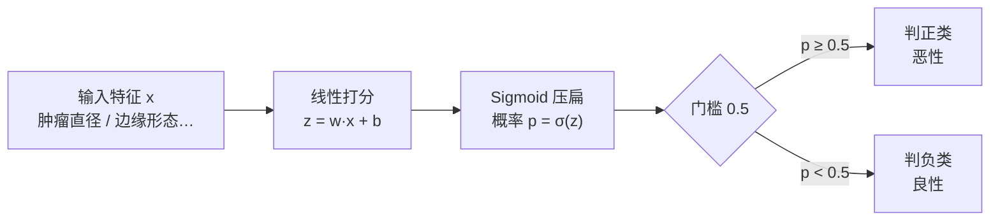

# 逻辑回归与分类

> **一句话理解**：逻辑回归（Logistic Regression）名字里带"回归"，干的却是**分类**的活——先用直线给样本打分，再用 Sigmoid 函数把分数压成 0~1 之间的概率，最后按概率划线拍板。

[⬆️ 返回总目录](../../../README.md) · [⬆️ 返回本篇](../README.md) · [⬅️ 返回本章目录](./README.md)

| 属性 | 说明 |
|------|------|
| 难度 | ⭐⭐（进阶） |
| 所属分支 | 通用基础 |
| 前置知识 | [线性回归](./02-线性回归.md) |

---

## 📌 这一节解决什么问题

一类问题天然不是"预测多少钱"，而是"预测是哪一种"：这封邮件是不是垃圾？这个肿瘤是良性还是恶性？这位用户明天会不会流失？这些是**分类（Classification）**问题。

一个自然的想法：借用[线性回归](./02-线性回归.md)——把"恶性"编成 1、"良性"编成 0，拟合一条线。但很快出岔子：来一个特别大的肿瘤，直线输出 2.3——"230% 恶性"是什么意思？概率不能超过 1；而且直线对离群点敏感，一个极端样本能把整条线拽歪。

逻辑回归的修补非常优雅：**直线照用（负责打分），但在出口处装一个"压扁器"**——Sigmoid 函数，把任意大小的分数（−∞ 到 +∞）平滑地压进 0~1，当作概率用。这个 19 世纪的统计工具到今天仍是工业界风控、营销、医学统计的主力基线之一。

**为什么叫"回归"？** 纯属历史命名：它最早脱胎于回归框架（对概率做回归），定名后大家将错就错。记住：**名字带回归，干的是分类**。

## 🌱 通俗理解

想象一位老医生看片子：他心里其实有个**打分器**——肿瘤越大、边缘越毛糙，分越高（可能是 3 分、7 分、甚至 12 分，没有上下限）；但他嘴里说的永远是"恶性可能性大概 88%"——因为病人只听得懂概率。

那个"心里打分、嘴上报概率"的翻译器，就是 Sigmoid：**分越高概率越接近 1，分越低越接近 0，打 0 分正好是五五开**。最后拍板还要一道门槛：概率 ≥ 50% 判恶性，否则判良性——这条门槛落在图上，就是一条把两类点分开的**直线**（决策边界）。

## 📋 举个例子

**手算一次 σ(2) ≈ 0.88。** 设模型已学出：$z = 0.5 \times \text{直径} - 3$（直径单位：cm）。来了一个 10 cm 的肿瘤：

1. 线性打分：$z = 0.5 \times 10 - 3 = 2$；
2. 压成概率：$\sigma(2) = \dfrac{1}{1+e^{-2}}$。手算：$e^{-2} \approx 0.135$，所以 $\sigma(2) = \dfrac{1}{1.135} \approx 0.88$；
3. 结论：**恶性概率约 88%**，超过 50% 门槛，判恶性、建议进一步穿刺。

**再看混淆矩阵（Confusion Matrix）怎么读。** 模型对 100 个体检样本的判断（以"恶性"为我们关心的正类）：

| | 预测：恶性 | 预测：良性 |
|---|---|---|
| **实际：恶性**（30 人） | TP = 26（抓对） | FN = 4（**漏诊**） |
| **实际：良性**（70 人） | FP = 6（**误诊**） | TN = 64（排除） |

由此算出三个关键指标：

- 精确率（Precision）= 26 / (26+6) ≈ **0.81**：模型喊"恶性"时，81% 真是恶性——衡量"警报准不准"；
- 召回率（Recall）= 26 / (26+4) ≈ **0.87**：真恶性的患者，87% 被找了出来——衡量"漏没漏"；
- F1 = 两者的调和平均 ≈ **0.84**——一个数同时顾住两边。

漏诊（FN）是耽误治疗，误诊（FP）是虚惊一场：**两者代价不对称时，50% 这个门槛就该挪动**——把门槛降到 30%，召回率上升、精确率下降，更多漏网之鱼被抓回，代价是更多虚惊。

## 🧠 核心原理

### 整体流程



### 逐步拆解

**① Sigmoid：从任意分数到概率**

$$
\sigma(z) = \frac{1}{1 + e^{-z}}
$$

> 👉 **人话**：一个平滑的"压扁器"。$z=0$ 时输出 0.5（五五开）；$z$ 每变大一点，输出更靠近 1 但永远到不了；$z=2$ 时约 0.88，$z=-2$ 时约 0.12。分数没有尽头，概率永远关在 0~1 里。

**② 决策边界：为什么是直线**

> 判正类的条件 $\sigma(z) \ge 0.5$ 等价于 $z \ge 0$，而 $z = w^\top x + b = 0$ 恰是一条直线（高维是超平面）。

$$
w^\top x + b = 0
$$

> 👉 **人话**：Sigmoid 只负责翻译，真正"划线"的还是那条直线。特征是"直径、年龄"两个时，边界就是二维图上一条直线——逻辑回归和线性回归是同一个打分器，只差出口处装没装压扁器。

**③ 交叉熵（Cross-Entropy）：越自信错得越离谱，罚越重**

$$
L = -\frac{1}{n}\sum_{i=1}^{n}\Big[y_i \log \hat{p}_i + (1-y_i)\log(1-\hat{p}_i)\Big]
$$

> 👉 **人话**：模型输出的是概率，所以不用 MSE，改用"概率对答案的打分"。真实是恶性（$y=1$）时，模型说"恶性概率 0.9"只小罚（$-\ln 0.9 \approx 0.1$），说"恶性概率 0.01"重罚（$-\ln 0.01 \approx 4.6$）——**错得越自信，罚得越狠**，逼着模型不光要对，还要"知深浅"。

<details>
<summary>🧮 展开：为什么不用 MSE 训练分类器</summary>

两个原因：(1) 把 Sigmoid 和 MSE 拼在一起，损失曲面容易出现大面积"平地"（梯度接近 0），梯度下降走不动，训练慢且容易卡住；交叉熵和 Sigmoid 组合后梯度恰好是 $(\hat{p} - y)$，形式干净、信号足；(2) MSE 对"自信的错误"惩罚不够狠——真实 1、预测 0.01 时，MSE 只罚 0.98 左右的量级误差，交叉熵罚 4.6，语义上更符合"概率错得离谱就该重罚"。这套组合在第 4 章神经网络里会原样复用。

</details>

**④ 与线性回归对照**

| | 线性回归 | 逻辑回归 |
|---|---|---|
| 任务 | 回归（预测数值） | 分类（预测类别） |
| 输出 | 任意实数（300 万） | 0~1 概率，再过门槛变类别 |
| 打分器 | $w^\top x + b$ | 同款 $w^\top x + b$ |
| 出口 | 直接输出 | 套一层 Sigmoid |
| 损失 | 均方误差 MSE | 交叉熵 |
| 决策边界 | 无（本身就是线） | $w^\top x + b = 0$ 一条直线 |
| 典型指标 | RMSE / R² | 精确率 / 召回率 / F1 / AUC |

## 💻 动手试试

用 sklearn 自带的乳腺癌数据集（569 个肿块、30 项检查指标）训练一次，以"恶性"为关心的正类：

```python
from sklearn.datasets import load_breast_cancer
from sklearn.linear_model import LogisticRegression
from sklearn.model_selection import train_test_split
from sklearn.metrics import (precision_score, recall_score, f1_score,
                             roc_auc_score, confusion_matrix)

X, y = load_breast_cancer(return_X_y=True)   # y：0 = 恶性，1 = 良性
X_tr, X_te, y_tr, y_te = train_test_split(X, y, test_size=0.3,
                                          random_state=42, stratify=y)
model = LogisticRegression(max_iter=5000).fit(X_tr, y_tr)
pred = model.predict(X_te)                    # 类别预测

print(confusion_matrix(y_te, pred, labels=[1, 0]))   # 行=真实(良性/恶性)，列=预测
print("精确率(恶性):", round(precision_score(y_te, pred, pos_label=0), 3))
print("召回率(恶性):", round(recall_score(y_te, pred, pos_label=0), 3))
print("F1(恶性)   :", round(f1_score(y_te, pred, pos_label=0), 3))
prob_malign = model.predict_proba(X_te)[:, 0]          # 第 0 列 = 恶性概率
print("AUC        :", round(roc_auc_score(1 - y_te, prob_malign), 3))

# 预期输出（可复现）：
# [[105   2]      ← 良性 105 判对；2 个良性被误诊为恶性
#  [  7  57]]     ← 7 个恶性被漏诊；57 个恶性抓对
# 精确率(恶性): 0.966   召回率(恶性): 0.891   F1(恶性): 0.927   AUC: 0.989
```

**AUC（ROC 曲线下面积）一句话**：随机挑一个恶性样本和一个良性样本，模型给恶性打更高概率的可能性。0.5 = 瞎猜，1 = 完美；0.989 意味着几乎任何时候都能把恶性排在良性前面。它**不依赖 0.5 门槛**，衡量的是模型本身的排序能力。

## 🔥 炼丹小灶

> 🔥 **炼丹小灶**：工业界常用起点配方与玄学——
> - 配方：先 `LogisticRegression(max_iter=1000)` + 特征标准化跑基线；类别不平衡时先看 AUC 和召回率，别只看准确率；
> - 玄学：真正要调的往往不是超参数，而是**门槛**——风控要少漏（门槛调低、召回优先），营销要少扰（门槛调高、精确优先），调门槛前先问业务"漏一个和误一个各损失多少"；
> - ⚠️ 以上是经验参考值，不是圣旨；换数据集请重新炼。

## 🔗 在知识树中的位置

- **上游**：[线性回归](./02-线性回归.md)——同一个线性打分器，本页给它装上 Sigmoid 出口。
- **下游**：[决策树与集成学习](./04-决策树与集成学习.md)（非线性边界的另一条路）；[支持向量机](./05-支持向量机.md)（同样画直线，但追求"最稳"的画法）。
- **横向对比**：多分类怎么办？逻辑回归可扩展为 Softmax 回归（多类概率归一化），sklearn 里 `LogisticRegression` 默认就支持多类——[01-机器学习全景](./01-机器学习全景.md)的鸢尾花三分类就是它。

## ⚠️ 常见误区

- **误区一**："逻辑回归是回归算法" → 是分类算法；名字是历史遗留，输出是概率、结果是类别。
- **误区二**："门槛必须取 0.5" → 0.5 只是默认值；漏诊和误诊代价不对称时（体检、风控、故障告警）应按业务调门槛。
- **误区三**："准确率 95% 就是好模型" → 99% 样本都是良性的数据集里，无脑猜"良性"也有 99% 准确率——不平衡数据要看精确率 / 召回率 / AUC。

## 📝 小结与自测

**要点回顾**

- 逻辑回归 = 线性打分 + Sigmoid 压成概率 + 门槛划线，名字带回归实为分类；
- 决策边界是一条直线（超平面）；交叉熵让"自信的错误"挨最重的罚；
- 混淆矩阵拆出精确率（警报准不准）与召回率（漏没漏），代价不对称时调门槛而非调模型。

**自测一下**（点击展开答案）

<details>
<summary>问题 1：σ(0)、σ(2)、σ(−2) 大约是多少？分别对应什么判断？</summary>

σ(0) = 0.5（五五开，样本正好落在决策边界上）；σ(2) ≈ 0.88（高置信正类）；σ(−2) ≈ 0.12（高置信负类）。注意 Sigmoid 关于原点"对称"：分数差 4，概率从 0.12 跳到 0.88。

</details>

<details>
<summary>问题 2：漏诊代价远高于误诊的体检场景，精确率和召回率该牺牲谁？怎么操作？</summary>

牺牲精确率、保召回率（把恶性尽量都抓出来，宁可多几次虚惊）。操作上把判恶性的门槛从 0.5 降到如 0.3，更多疑似样本会被划进"恶性"复查名单；代价是误诊（FP）增多。具体降到多少，要用业务方给的"漏一例 / 误一例"代价去算期望损失最优点。

</details>

## 📚 延伸阅读

- 书：周志华《机器学习》第 3 章——逻辑回归与极大似然的关系
- 书：《Pattern Recognition and Machine Learning》第 4 章——从概率视角看线性分类
- 工具：sklearn 官方文档 `LogisticRegression` 词条——正则化参数 C、class_weight 的说明

---

[⬅️ 上一页：线性回归](./02-线性回归.md) · [返回本章目录](./README.md) · [下一页：决策树与集成学习 ➡️](./04-决策树与集成学习.md)
