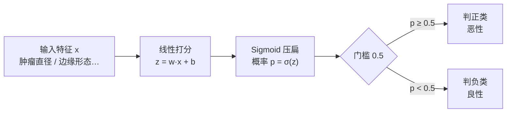
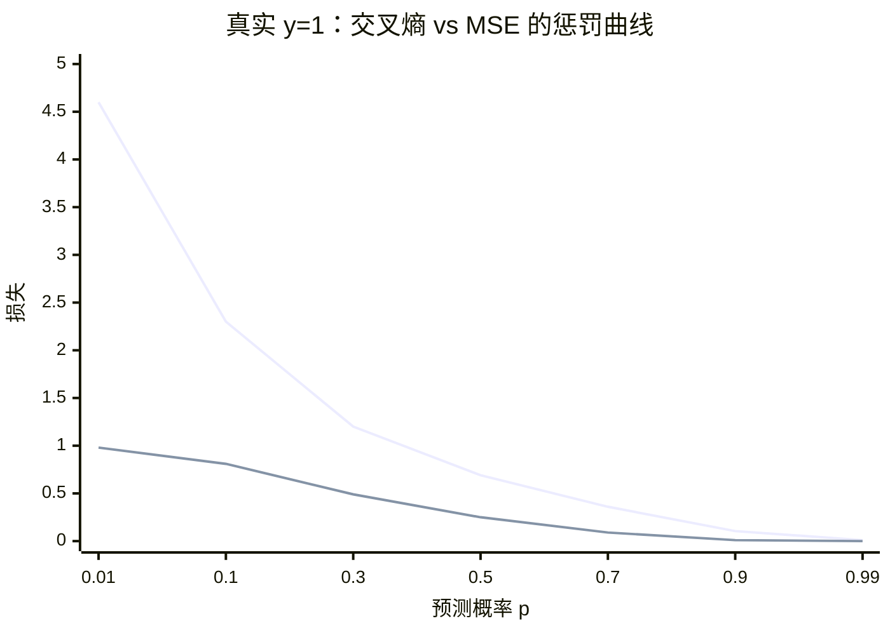
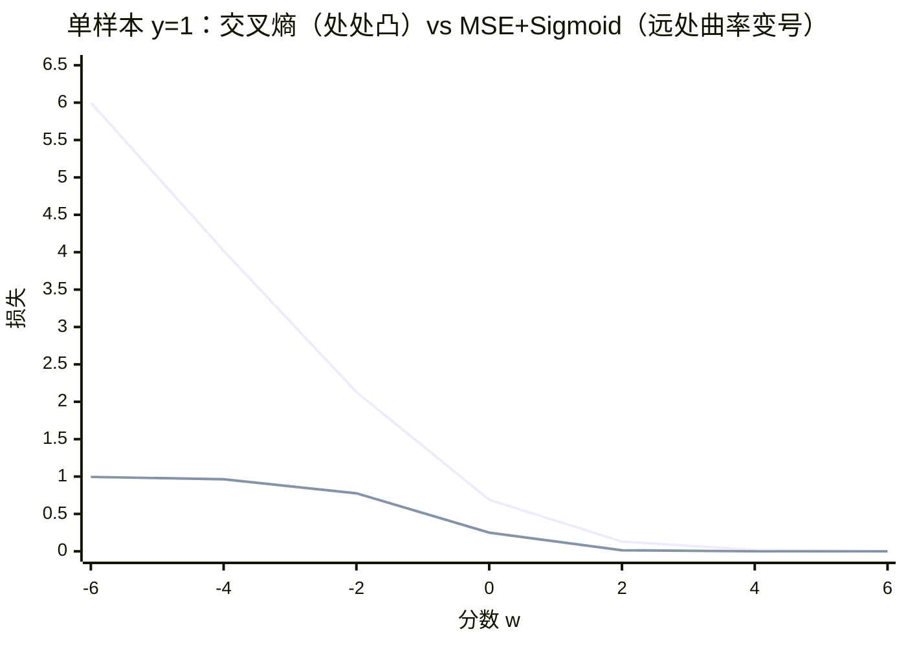

# 逻辑回归与分类

> **一句话理解**：逻辑回归（Logistic Regression）名字里带"回归"，干的却是**分类**的活——先用直线给样本打分，再用 Sigmoid 函数把分数压成 0~1 之间的概率，最后按概率划线拍板。

[⬆️ 返回总目录](../../../README.md) · [⬆️ 返回本篇](../README.md) · [⬅️ 返回本章目录](./README.md)

| 属性 | 说明 |
|------|------|
| 难度 | ⭐⭐（进阶） |
| 所属分支 | 通用基础 |
| 前置知识 | [线性回归](./02-线性回归.md)；[概率与统计](../../1-起步准备/02-数学基础/04-概率与统计.md) |

---

## 📌 这一节解决什么问题

一类问题天然不是"预测多少钱"，而是"预测是哪一种"：这封邮件是不是垃圾？这个肿瘤是良性还是恶性？这位用户明天会不会流失？这些是**分类（Classification）**问题。

一个自然的想法：借用[线性回归](./02-线性回归.md)——把"恶性"编成 1、"良性"编成 0，拟合一条线。但很快出岔子：来一个特别大的肿瘤，直线输出 2.3——"230% 恶性"是什么意思？概率不能超过 1；而且直线对离群点敏感，一个极端样本能把整条线拽歪。

逻辑回归的修补非常优雅：**直线照用（负责打分），但在出口处装一个"压扁器"**——Sigmoid 函数，把任意大小的分数（−∞ 到 +∞）平滑地压进 0~1，当作概率用。这个 19 世纪的统计工具到今天仍是工业界风控、营销、医学统计的主力基线之一。

**为什么叫"回归"？** 纯属历史命名：它最早脱胎于回归框架（对概率做回归），定名后大家将错就错。记住：**名字带回归，干的是分类**。

## 🌱 通俗理解

想象一位老医生看片子：他心里其实有个**打分器**——肿瘤越大、边缘越毛糙，分越高（可能是 3 分、7 分、甚至 12 分，没有上下限）；但他嘴里说的永远是"恶性可能性大概 88%"——因为病人只听得懂概率。

那个"心里打分、嘴上报概率"的翻译器，就是 Sigmoid：**分越高概率越接近 1，分越低越接近 0，打 0 分正好是五五开**。最后拍板还要一道门槛：概率 ≥ 50% 判恶性，否则判良性——这条门槛落在图上，就是一条把两类点分开的**直线**（决策边界）。

还有一层容易被忽略：老医生说"88%"，这个数字**本身也应该负责任**——他说十个"88%"，就该真有八九个是恶性。概率不仅要"排序对"，还要"数值准"，这叫**校准（Calibration）**，本页后面专门讲。

## 📋 举个例子

**手算一次 σ(2) ≈ 0.88。** 设模型已学出：$z = 0.5 \times \text{直径} - 3$（直径单位：cm）。来了一个 10 cm 的肿瘤：

1. 线性打分：$z = 0.5 \times 10 - 3 = 2$；
2. 压成概率：$\sigma(2) = \dfrac{1}{1+e^{-2}}$。手算：$e^{-2} \approx 0.135$，所以 $\sigma(2) = \dfrac{1}{1.135} \approx 0.88$；
3. 结论：**恶性概率约 88%**，超过 50% 门槛，判恶性、建议进一步穿刺。

**再看混淆矩阵（Confusion Matrix）怎么读。** 模型对 100 个体检样本的判断（以"恶性"为我们关心的正类）：

| | 预测：恶性 | 预测：良性 |
|---|---|---|
| **实际：恶性**（30 人） | TP = 26（抓对） | FN = 4（**漏诊**） |
| **实际：良性**（70 人） | FP = 6（**误诊**） | TN = 64（排除） |

由此算出三个关键指标：

- 精确率（Precision）= 26 / (26+6) ≈ **0.81**：模型喊"恶性"时，81% 真是恶性——衡量"警报准不准"；
- 召回率（Recall）= 26 / (26+4) ≈ **0.87**：真恶性的患者，87% 被找了出来——衡量"漏没漏"；
- F1 = 两者的调和平均 ≈ **0.84**——一个数同时顾住两边。

漏诊（FN）是耽误治疗，误诊（FP）是虚惊一场：**两者代价不对称时，50% 这个门槛就该挪动**——把门槛降到 30%，召回率上升、精确率下降，更多漏网之鱼被抓回，代价是更多虚惊。

**极端情况再算一个**：一个 30 cm 的罕见巨瘤，$z = 0.5 \times 30 - 3 = 12$，$\sigma(12) \approx 0.999994$——概率无限贴近 1 但**永远到不了** 1。这不是巧合而是设计：概率留给"永远不确定"的余地，也正是后面"权重为什么会爆炸"的伏笔。

## 🧠 核心原理

### 整体流程



### 逐步拆解

**① Sigmoid：从任意分数到概率**

$$
\sigma(z) = \frac{1}{1 + e^{-z}}
$$

> 👉 **人话**：一个平滑的"压扁器"。$z=0$ 时输出 0.5（五五开）；$z$ 每变大一点，输出更靠近 1 但永远到不了；$z=2$ 时约 0.88，$z=-2$ 时约 0.12。分数没有尽头，概率永远关在 0~1 里。

**② 决策边界：为什么是直线**

> 判正类的条件 $\sigma(z) \ge 0.5$ 等价于 $z \ge 0$，而 $z = w^\top x + b = 0$ 恰是一条直线（高维是超平面）。

$$
w^\top x + b = 0
$$

> 👉 **人话**：Sigmoid 只负责翻译，真正"划线"的还是那条直线。特征是"直径、年龄"两个时，边界就是二维图上一条直线——逻辑回归和线性回归是同一个打分器，只差出口处装没装压扁器。

**③ 损失从哪来：极大似然 → 交叉熵**

模型输出概率，那"训练目标"最自然的写法不是拍脑袋定的，而是问一句：**哪组参数 $w$，能让"看到手里这批标注数据"的概率最大？** 这就是极大似然估计（Maximum Likelihood Estimation, MLE）。单个样本被模型解释的概率是 $\hat{p}_i^{y_i}(1-\hat{p}_i)^{1-y_i}$（答案是 1 就取 $\hat p$，是 0 就取 $1-\hat p$），全体连乘取负对数，得到：

$$
L = -\frac{1}{n}\sum_{i=1}^{n}\Big[y_i \log \hat{p}_i + (1-y_i)\log(1-\hat{p}_i)\Big]
$$

> 👉 **人话**：这就是**交叉熵（Cross-Entropy）**——"概率对答案的打分"。真实是恶性（$y=1$）时，模型说"恶性概率 0.9"只小罚（$-\ln 0.9 \approx 0.1$），说"恶性概率 0.01"重罚（$-\ln 0.01 \approx 4.6$）——**错得越自信，罚得越狠**，逼着模型不光要对，还要"知深浅"。极大似然是"为什么选它"，交叉熵是"它长什么样"，一体两面。

<details>
<summary>🧮 展开：极大似然 → 交叉熵的完整推导</summary>

设 $n$ 个样本独立同分布，模型对第 $i$ 个样本预测正类概率 $\hat{p}_i = \sigma(w^\top x_i + b)$。

**第一步，写似然函数**（这批数据在模型下出现的概率）：

$$
\prod_{i=1}^{n} \hat{p}_i^{\,y_i}\,(1-\hat{p}_i)^{\,1-y_i}
$$

（$y_i=1$ 时只乘 $\hat p_i$，$y_i=0$ 时只乘 $1-\hat p_i$，指数开关一部到位。）

**第二步，取对数**（连乘变连加，好求导、数值稳）：

$$
\ell(w) = \sum_{i=1}^{n}\Big[y_i \log \hat{p}_i + (1-y_i)\log(1-\hat{p}_i)\Big]
$$

**第三步，最大化 ⟺ 最小化它的负数，再除以 $n$ 取平均**：

$$
\min_w\ -\frac{1}{n}\sum_{i=1}^{n}\Big[y_i \log \hat{p}_i + (1-y_i)\log(1-\hat{p}_i)\Big] \quad = \text{交叉熵}
$$

**附带的红利——梯度形式极简**：对 $z_i = w^\top x_i + b$ 求导时，$\sigma$ 的导数 $\sigma'(z) = \sigma(z)(1-\sigma(z))$ 恰好被对数约掉，得到

$$
\frac{\partial L}{\partial z_i} = \hat{p}_i - y_i
$$

> 👉 **人话**：梯度 = "预测概率 − 真实标签"——预测 0.9 而真是 1，梯度 −0.1（轻轻推一把）；预测 0.01 而真是 1，梯度 −0.99（狠狠拽回来）。**误差越大推力越大，且这份推力不会被 Sigmoid 的平缓段稀释**——这个性质是下一小节"MSE 为什么不行"的参照物，也是[第 4 章](../../3-深度学习/04-深度学习基础/README.md)神经网络输出层标配交叉熵的原因。

</details>

**④ 为什么不用 MSE 训练分类器**

把 Sigmoid 套进 MSE（$L = \frac{1}{n}\sum(y_i - \sigma(z_i))^2$）看起来也"能量误差"，为什么不能这么干？两个硬伤：

<details>
<summary>🧮 展开：非凸 + 梯度饱和——MSE 训练分类的两宗罪</summary>

**罪一：梯度饱和（学不动）**。MSE 对 $z$ 的梯度是：

$$
\frac{\partial}{\partial z}\,(y - \sigma(z))^2 = -2\,(y-\sigma(z))\cdot \sigma(z)\,(1-\sigma(z))
$$

末尾的 $\sigma(z)(1-\sigma(z))$ 在 $|z|$ 较大时**趋近 0**——样本被分得很开（或分得很离谱）时，Sigmoid 已进入平缓区，导数几乎为 0，梯度整个被掐灭：错得很离谱的样本反而"推不动"模型。而交叉熵的梯度 $(\hat p - y)$ **没有这个因子**，错得越远推力越足。

**罪二：非凸（找不准）**。MSE + Sigmoid 的损失面不是凸的——存在多个局部极小值，梯度下降可能停在一个"谁也不是最优"的坑里。交叉熵 + Sigmoid 则关于 $w$ 是凸的（凸函数过 sigmoid 复合的幸运组合），只有一个全局谷底，调参可靠。

**两条曲线的直观对比**（真实标签 $y=1$ 时，损失随预测概率 $\hat p$ 的变化）：



> 👉 **人话**：横轴是模型给出的概率，纵轴是挨的罚。交叉熵（第一条线）在"自信地错"（p=0.01）时罚 4.6，是一座悬崖；MSE（第二条线）只罚 0.98，是一片浅滩。**分类器最怕的不是错，是"错得心安理得"——交叉熵的悬崖专治这个**。

</details>

**⑤ 线性可分时权重爆炸：Sigmoid 的死穴与 L2 的救赎**

如果训练集**恰好能被一条直线完美分开**（没有任何骑线的点），极大似然会暴露一个反直觉的行为：**最优解是 $w \to \infty$**。

> 👉 **人话**：数据全分对了，模型还想继续涨分——把已经压到 0.999 的概率推向 1，唯一办法是把分数 $z$ 拉大，也就是把 $w$ 无限加大。后果：决策边界越来越陡、概率全挤到 0 和 1 两头，**过拟合到"一点点扰动就翻面"**，且数值上溢报错。人性化的类比：一个门门满分的学生，唯一还能"进步"的方式是逼自己每道题都检查一百遍——病态。

**救赎是 L2 正则**（[结构风险](./01-机器学习全景.md)的经典出场）：在损失后面加 $\lambda\|w\|^2$，"概率逼近 1 的收益"和"权重变大的罚金"一拉锯，最优 $w$ 重新变回有限值——sklearn 的 `LogisticRegression` **默认就带 L2**（参数 `C = 1/λ`，`C` 越小罚得越狠）。所以"线性可分的小数据集上逻辑回归翻车"，第一反应是调 `C`，不是换模型。

**⑥ 概率校准：模型说 0.9，不等于九成准**

逻辑回归输出的是"模型心里的把握"，**不保证等于真实频率**。验证方法一句话：**校准曲线（Calibration Curve / Reliability Diagram）——把预测概率分桶，横轴"模型平均说了多少"、纵轴"实际发生了多少"，两者贴着对角线就是校准良好**。

> 👉 **人话**：模型说 0.9 的那批样本里如果真有 90% 是正类，它就是个"说话算话"的模型；如果只有 70%，它就是在"夸海口"（过自信）。SVM 的打分离概率更远、树模型容易欠自信、小数据上逻辑回归常过自信。**只关心排序（AUC）时校准无所谓；要拿概率做决策（定价、赔付、医疗告知）时校准必须管**——补救手段：Platt 缩放、Isotonic 回归（sklearn 的 `CalibratedClassifierCV`），深度学习里叫温度缩放（Temperature Scaling，[第 4 章](../../3-深度学习/04-深度学习基础/README.md)会再见到）。

**⑦ 类别不平衡：三条路线对比**

正负样本 1:99 时，模型学会"无脑猜多数类"就能拿 99% 准确率——必须动手干预。三条主流路线：

| 策略 | 做法 | 优点 | 缺点 / 适用 |
|------|------|------|------|
| **阈值移动** | 照常训练，把判正类的门槛从 0.5 挪到按业务代价选的位置 | 零成本、可逆、最该先试 | 不改变模型学到的规律，只改"拍板线"；需要知道代价 |
| **类权重** | 训练时给少数类样本的损失乘更大权重（`class_weight="balanced"`） | 少数类的错被重罚，边界向少数类倾斜；不加样本、无泄漏风险 | 权重过大 → 过拟合少数类噪声；概率数值会被扭曲（需再校准） |
| **重采样** | 过采样少数类（SMOTE 在特征空间插值造新样本）或欠采样多数类 | 也能配合非加权模型使用 | SMOTE 造的"假样本"可能引入噪声；欠采样丢信息；**务必只在训练集内做**（在划分前全量重采样 = 泄漏） |

> 👉 **人话**：先挪门槛（最便宜），再上类权重（改考核标准，少数类的错算双倍），最后才考虑重采样（直接改数据）。无论哪条，**评估要换掉准确率**，看 PR 曲线 / 召回 / F1（详见[07-模型评估与调优](./07-模型评估与调优.md)的"准确率悖论"）。

**⑧ 多分类：Softmax 回归**

两类以上怎么办？把"Sigmoid 一挑一"换成"Softmax 全家分蛋糕"：

$$
P(y = k \mid x) = \frac{\exp(z_k)}{\sum_{j=1}^{K}\exp(z_j)}, \qquad z_k = w_k^\top x + b_k
$$

> 👉 **人话**：每个类别一个线性打分器，Softmax 把 $K$ 个分数变成**和为 1** 的概率分布——分数高的分大头，指数放大差距。两类时数学上恰好退化回 Sigmoid（可以验证：K=2 的 Softmax 等价于一个 Sigmoid），所以它是逻辑回归的"多类正统扩展"。损失换成多类交叉熵（真实类别的 $-\log$ 概率）。sklearn 的 `LogisticRegression` 多分类默认走这套。

<details>
<summary>🧮 展开：手算一个三分类 Softmax + 伏笔第 7 章</summary>

鸢尾花三分类，某样本三个线性分：$z = (2.0,\ 1.0,\ 0.1)$。

1. 取指数：$e^{2.0} = 7.39$，$e^{1.0} = 2.72$，$e^{0.1} = 1.11$；
2. 求和：$7.39 + 2.72 + 1.11 = 11.22$；
3. 归一化：$P = (7.39/11.22,\ 2.72/11.22,\ 1.11/11.22) \approx (0.66,\ 0.24,\ 0.10)$。

预测第一类，置信 66%。注意**指数放大了分数差距**：分数 2 : 1 : 0.1（20:10:1 的量级），概率却是 66 : 24 : 10——Softmax 对"稍微高一点"的分数给出"明显偏心"的概率。

若真实标签是第一类，交叉熵损失 $= -\ln 0.66 \approx 0.42$；若真实是第三类，损失 $= -\ln 0.10 \approx 2.3$——还是那句"错得越自信罚得越重"。

**伏笔**：这个"指数归一化"结构就是[第 7 章 Transformer](../../4-专业方向/07-自然语言处理与LLM/02-Transformer与注意力机制.md)里注意力的温度Scaled公式，也是大语言模型输出层"从几万个词里挑下一个词"的机制——**Softmax 是 LLM 说话的那张嘴**。区别只在：注意力里它归一化的是"相关性分数"，输出层里它归一化的是"词的得分"。

</details>

**⑨ 与线性回归对照**

| | 线性回归 | 逻辑回归 |
|---|---|---|
| 任务 | 回归（预测数值） | 分类（预测类别） |
| 输出 | 任意实数（300 万） | 0~1 概率，再过门槛变类别 |
| 打分器 | $w^\top x + b$ | 同款 $w^\top x + b$ |
| 出口 | 直接输出 | 套一层 Sigmoid |
| 损失（来源） | 均方误差（最小二乘 / 高斯噪声假设） | 交叉熵（极大似然） |
| 求解 | 有解析解（正规方程） | 无解析解，梯度下降（凸，必有全局最优） |
| 决策边界 | 无（本身就是线） | $w^\top x + b = 0$ 一条直线 |
| 典型指标 | RMSE / R² | 精确率 / 召回率 / F1 / AUC |

### 📐 数学深潜：logistic 损失的凸性——Hessian = XᵀDX ⪰ 0 的完整推导

**⑨的对照表说逻辑回归"凸，必有全局最优"，④说 MSE+Sigmoid"非凸"**——一对孪生命运的分水岭藏在 Hessian（二阶导矩阵）里：交叉熵的 Hessian 可以完整算出来，$\nabla^2L=\frac{1}{n}X^{\top}DX$，而 $D$ 的对角线全是正数。

**严格陈述。** 交叉熵损失（③，截距并入 $x$，$z_i=w^{\top}x_i$、$\hat p_i=\sigma(z_i)$）：

$$
L(w)=-\frac{1}{n}\sum_{i=1}^{n}\Big[y_i\log\hat p_i+(1-y_i)\log(1-\hat p_i)\Big]
$$

则其 Hessian 为

$$
\nabla^2_wL=\frac{1}{n}\,X^{\top}DX,\qquad D=\mathrm{diag}\big(\hat p_1(1-\hat p_1),\ \dots,\ \hat p_n(1-\hat p_n)\big)
$$

且 $\nabla^2L\succeq0$（半正定）恒成立——**$L(w)$ 是 $\mathbb{R}^d$ 上的凸函数**，任何驻点都是全局最小点（[微积分与梯度](../../1-起步准备/02-数学基础/03-微积分与梯度.md)凸性二阶判据的高维版落地）。

> 👉 **人话**：每个样本贡献一份"正曲率"$\hat p_i(1-\hat p_i)\,x_ix_i^{\top}$，系数全是正数，加起来还是正的——损失面是一口唯一的碗，梯度下降走到坡度归零必是全局谷底。**关键在 $\hat p(1-\hat p)>0$ 恒成立**：σ 的输出严格卡在 (0,1) 内（📋 里 0.999994 永远到不了 1 的伏笔在此兑现）。

**完整推导：σ′=σ(1−σ) → 一阶梯度 (p̂−y)x → Hessian XᵀDX → 半正定。**

<details>
<summary>🧮 展开推导：四步，每步只有链式法则与代数；附 MSE 的数值反例</summary>

**第一步：σ 的导数。** $\sigma(z)=\frac{1}{1+e^{-z}}$，求导（分式法则）：

$$
\sigma'(z)=-\frac{(1+e^{-z})'}{(1+e^{-z})^2}=\frac{e^{-z}}{(1+e^{-z})^2}=\frac{e^{-z}}{1+e^{-z}}\cdot\frac{1}{1+e^{-z}}=\big(1-\sigma(z)\big)\,\sigma(z)
$$

（末步用 $\frac{e^{-z}}{1+e^{-z}}=1-\frac{1}{1+e^{-z}}=1-\sigma(z)$。）**$\sigma'>0$ 处处成立**——这个正号是后面一切的地基。

**第二步：单样本损失对 z 的导数（③"红利"的完整版）。** $\ell_i=-\big[y\log\sigma+(1-y)\log(1-\sigma)\big]$，链式法则 $d\ell/dz=(d\ell/d\sigma)\cdot\sigma'$：

$$
\frac{d\ell_i}{d\sigma}=-\frac{y}{\sigma}+\frac{1-y}{1-\sigma}\qquad\Longrightarrow\qquad
\frac{d\ell_i}{dz}=\Big(-\frac{y}{\sigma}+\frac{1-y}{1-\sigma}\Big)\sigma(1-\sigma)=-y(1-\sigma)+(1-y)\sigma=\sigma-y
$$

（$\sigma(1-\sigma)$ 与两个分母恰好约掉——③说的"Sigmoid 的导数被对数约掉"的现场。）

**第三步：对 w 的梯度与 Hessian。** $z_i=w^{\top}x_i$、$\partial z_i/\partial w=x_i$，链式法则给梯度 $\frac{\partial\ell_i}{\partial w}=(\sigma(z_i)-y_i)\,x_i=(\hat p_i-y_i)\,x_i$。再求一次导（$\hat p_i-y_i$ 对 $w$ 的导数是 $\sigma'(z_i)x_i=\hat p_i(1-\hat p_i)\,x_i$）：

$$
\frac{\partial^2\ell_i}{\partial w\,\partial w^{\top}}=\hat p_i(1-\hat p_i)\;x_ix_i^{\top}
$$

（外积 $x_ix_i^{\top}$：第 (j,k) 格 = $x_{ij}x_{ik}$。）对样本平均求和，堆成矩阵：

$$
\nabla^2L=\frac{1}{n}\sum_{i=1}^{n}\hat p_i(1-\hat p_i)\,x_ix_i^{\top}=\frac{1}{n}\,X^{\top}\,\mathrm{diag}\big(\hat p_i(1-\hat p_i)\big)\,X\quad\blacksquare
$$

（矩阵形式核对：$X^{\top}DX$ 的第 (j,k) 格 $=\sum_ix_{ij}D_{ii}x_{ik}$，与求和版逐项一致。）

**第四步：半正定。** 对任意向量 $v\in\mathbb{R}^d$：

$$
v^{\top}\big(\nabla^2L\big)v=\frac{1}{n}\sum_{i=1}^{n}\underbrace{\hat p_i(1-\hat p_i)}_{>\,0}\ \underbrace{(v^{\top}x_i)^2}_{\ge0}\ \ge\ 0\qquad\blacksquare
$$

（第一因子严格正：$\hat p_i\in(0,1)$；第二因子是平方。半正定的判定就是"任意方向试一遍都 ≥ 0"。）

**对照：MSE+Sigmoid 为什么碎。** 对 $f_i=(y_i-\sigma(z_i))^2$ 走同样流程，二阶导会多出符号不定的组合项（含 $\sigma'(1-2\sigma)$ 与 $-\sigma'^2$）。**数字现场**：单样本 $y=1$、$x=1$，$f(w)=(1-\sigma(w))^2$ 在 $w=-4$ 处二阶导 $\approx-0.033<0$（曲线是凹的）——非凸实锤；而交叉熵 $-\log\sigma(w)$ 的二阶导 $=\sigma(w)(1-\sigma(w))>0$ 处处成立。

</details>

**几何图景——两条单变量损失曲线：**



> 👉 **人话**：交叉熵（第一条线）在"自信地错"（w 很负）处是陡峭悬崖，且**全程下凸**——沿任何方向都只有往下走的路；MSE（第二条线）错得远时几乎躺平、在 w=−4 附近曲率转负——平坦里藏着假谷。梯度下降在第一条线上"见零收工"，在第二条线上可能"躺平挨打"（④的饱和之罪）。

**反例与边界。**

1. **半正定 ≠ 正定**：$\hat p_i\to0/1$（分数极大）或特征共线时，某些方向上 $v^{\top}(\nabla^2L)v\to0$——碗出现"平坦谷"。线性可分数据权重爆炸（本页 ⑤）正是沿"放大 $\lVert w\rVert$"的方向曲率趋零、损失一路缓降不封顶的形态；加 L2 后 $\nabla^2\big(L+\lambda\lVert w\rVert^2\big)=\frac{1}{n}X^{\top}DX+2\lambda I\succeq2\lambda I$——**凸 + 凸 = 凸，且谷被封口**；
2. **凸只保证"找到全局最优的损失"，不保证泛化好**：线性可分小数据照样过拟合（⑤的 L2 救赎仍然必要）；凸性也不覆盖"换函数族"这类离散选择；
3. **多分类同构**：⑧ 的 Softmax 多类交叉熵对线性打分器同样凸——推导骨架与本模块逐字同构（只是每类的权重矩阵换成 $\mathrm{diag}(\hat p)-\hat p\hat p^{\top}$ 的形式），⑧ 没有引入新的非凸。

> 👉 **人话总结**：交叉熵的 Hessian = XᵀDX，D 的对角线全是 σ 输出自带的正数 p(1−p)——每个样本投票一份正曲率，全数据加起来还是正的：损失面一口定型的碗，训练必收敛到全局最优；MSE 配 Sigmoid 拿不到这张保险单。

## 💻 动手试试

用 sklearn 自带的乳腺癌数据集（569 个肿块、30 项检查指标）训练一次，以"恶性"为关心的正类：

```python
from sklearn.datasets import load_breast_cancer
from sklearn.linear_model import LogisticRegression
from sklearn.model_selection import train_test_split
from sklearn.metrics import (precision_score, recall_score, f1_score,
                             roc_auc_score, confusion_matrix)

X, y = load_breast_cancer(return_X_y=True)   # y：0 = 恶性，1 = 良性
X_tr, X_te, y_tr, y_te = train_test_split(X, y, test_size=0.3,
                                          random_state=42, stratify=y)
model = LogisticRegression(max_iter=5000).fit(X_tr, y_tr)
pred = model.predict(X_te)                    # 类别预测

print(confusion_matrix(y_te, pred, labels=[1, 0]))   # 行=真实(良性/恶性)，列=预测
print("精确率(恶性):", round(precision_score(y_te, pred, pos_label=0), 3))
print("召回率(恶性):", round(recall_score(y_te, pred, pos_label=0), 3))
print("F1(恶性)   :", round(f1_score(y_te, pred, pos_label=0), 3))
prob_malign = model.predict_proba(X_te)[:, 0]          # 第 0 列 = 恶性概率
print("AUC        :", round(roc_auc_score(1 - y_te, prob_malign), 3))

# 预期输出（可复现）：
# [[105   2]      ← 良性 105 判对；2 个良性被误诊为恶性
#  [  7  57]]     ← 7 个恶性被漏诊；57 个恶性抓对
# 精确率(恶性): 0.966   召回率(恶性): 0.891   F1(恶性): 0.927   AUC: 0.989
```

**AUC（ROC 曲线下面积）一句话**：随机挑一个恶性样本和一个良性样本，模型给恶性打更高概率的可能性。0.5 = 瞎猜，1 = 完美；0.989 意味着几乎任何时候都能把恶性排在良性前面。它**不依赖 0.5 门槛**，衡量的是模型本身的排序能力。

**再做一个"挪门槛"实验**，亲眼看阈值怎么换召回和精确率：

```python
import numpy as np
from sklearn.metrics import precision_score, recall_score

# 沿用上面的 prob_malign（恶性概率）和 y_te
for t in [0.5, 0.3, 0.1]:
    pred_t = (prob_malign >= t).astype(int)          # 手动挪门槛：概率 ≥ t 判恶性
    print(f"门槛 {t:.1f}  精确率 {precision_score(1-y_te, 1-pred_t, pos_label=1):.3f}"
          f"  召回率 {recall_score(1-y_te, 1-pred_t, pos_label=1):.3f}")

# 预期输出（可复现）：
# 门槛 0.5  精确率 0.966  召回率 0.891   ← 默认线
# 门槛 0.3  精确率 0.952  召回率 0.922   ← 少漏几个，几乎没多误诊
# 门槛 0.1  精确率 0.906  召回率 0.953   ← 更少漏，误诊开始上升
# —— 门槛一路下调，召回率单调上升、精确率缓慢下滑：这就是"宁错杀不放过"的代价曲线
```

改什么、看什么：把 `C` 从默认 1.0 改成 `1e-3`（重罚权重），会看到概率整体向 0.5 收缩、AUC 下降（欠自信）；改成 `1e3`，概率向两端极化——正则强度直接控制"模型的口风多硬"。

## 🔥 炼丹小灶

> 🔥 **炼丹小灶**：工业界常用起点配方与玄学——
> - 配方：先 `LogisticRegression(max_iter=1000)` + 特征标准化跑基线；类别不平衡时先看 AUC 和召回率，别只看准确率；真正要调的往往不是超参数，而是**门槛**；
> - 玄学：风控要少漏（门槛调低、召回优先），营销要少扰（门槛调高、精确优先），调门槛前先问业务"漏一个和误一个各损失多少"；概率要拿去算钱时，先画校准曲线，不直再上 `CalibratedClassifierCV`；
> - ⚠️ 以上是经验参考值，不是圣旨；换数据集请重新炼。

## 🔗 在知识树中的位置

- **上游**：[线性回归](./02-线性回归.md)——同一个线性打分器，本页给它装上 Sigmoid 出口；损失从"最小二乘"换成"极大似然"。
- **下游**：[决策树与集成学习](./04-决策树与集成学习.md)（非线性边界的另一条路）；[支持向量机](./05-支持向量机.md)（同样画直线，但追求"最稳"的画法，损失从交叉熵换成 hinge）。
- **横向对比**：多分类的 Softmax 在[第 7 章 Transformer](../../4-专业方向/07-自然语言处理与LLM/02-Transformer与注意力机制.md)里以"注意力归一化"的身份再次登场；校准、不平衡与阈值策略的系统展开在[07-模型评估与调优](./07-模型评估与调优.md)。

## 🎓 深度视角

逻辑回归身上有整个行业的一堂工程课：**它的 longevity（长青）不是因为数学最优雅，而是因为它的"工业适配性"最全面**——凸优化（训练必收敛、可复现）、天然概率输出（可校准、可算期望收益）、稀疏特征友好（亿维 one-hot 也能跑）、支持在线增量更新（新样本来了不必重训）。学术界的"过时模型"在工业界服役十几年是常态，逻辑回归是最典型的例子：广告 CTR 预测的第一代主力就是它，配合大规模稀疏特征与 FTRL 这类在线优化器（Google 2013 年的工程论文把它推向成熟）。直到今天，很多大系统的排序层仍保留一条逻辑回归通道当"保底基线"。

另一个值得建立的视角：**校准与排序是两件事，而且可以分开采购**。AUC 衡量排序（谁比谁高），校准衡量概率数值（说 0.9 是不是真九成）。任何单调变换（把所有概率开个方）不改变 AUC，但彻底毁掉校准——所以工程上的标准打法是"先卷排序，再用 Platt / Isotonic 事后校准"，而不是指望一次训练两头全占。

<details>
<summary>❓ 深问一：广告 CTR 预测为什么第一代主力是逻辑回归而不是树模型？树不是更准吗？</summary>

三个工程原因：一，CTR 特征是**亿维极稀疏**的 one-hot（用户 ID × 物品 ID × 上下文），树在这种空间里找分裂点又贵又不讨好（每次分裂要在海量稀疏维度里挑最优），逻辑回归对稀疏输入天然友好——梯度只为非零特征计算；二，**在线学习**：广告流量实时到来，FTRL 类优化器支持单样本增量更新，模型几分钟一刷新，树模型当年做不到如此轻量的在线更新；三，**校准刚需**：CTR 概率直接进竞价公式算钱，逻辑回归的概率输出与校准手段最成熟。树模型（GBDT+LR 的混合方案）后来也进过场，但第一桶金是逻辑回归的。

</details>

<details>
<summary>❓ 深问二：概率校准好了，排序会变差吗？反过来呢？</summary>

校准与排序统计上独立：把概率过任何严格递增函数（如 Platt 的 sigmoid），排序一字不变、校准焕然一新。所以"校准好"不需要牺牲"AUC 好"。真正有张力的是**训练目标**：如果用类权重或重采样训练，概率数值会被扭曲（排序可能更好、校准变差）——这时事后重新校准即可。原则：排序信息（分数的相对高低）是模型的核心资产，校准是可以后补的外衣。

</details>

<details>
<summary>❓ 深问三：Softmax 回归在 2026 年的地位如何？</summary>

形态上被"_embedding + 全连接输出层_"继承：大语言模型的输出层就是词表上的 Softmax 回归（几万类），只不过输入从手工特征换成了学出来的表示。Softmax 作为"多类正统扩展"的地位没有变，变的是喂给它的特征从人手搓变成了机器学——这正是[第 7 章](../../4-专业方向/07-自然语言处理与LLM/02-Transformer与注意力机制.md)的主线。

</details>

## 🔬 SOTA 演进

**大规模稀疏特征 + 逻辑回归的长青**。广告与推荐系统的排序层十年演进（LR → Wide&Deep → DeepFM / DCN，见[第 8 章排序模型](../../4-专业方向/08-推荐系统/04-排序模型.md)）有一条清晰的线索：**每代"更强"的模型，都是在逻辑回归的骨架上给交叉特征找更好的自动化方案**——LR 靠人工拍特征组合，FM 把组合权重分解成隐向量内积，Wide&Deep 记忆与泛化双通道，DeepFM 让网络自己学交叉。到 2026 年：深度 CTR 模型接管了头部大厂的精排，但逻辑回归仍活跃在两个位置——快速迭代的中小规模排序（样本少、要在线更新、要校准）与一切需要"可审计概率"的场景（信贷评分卡）。**它从主力退居"组件 + 保底基线"，但没有退出任何一家大厂的工具箱**（组件视角另见[02 页](./02-线性回归.md) SOTA 小节）。

## ❓ 开放问题

- **在线学习的评估悖论**：模型几分钟一刷新，离线交叉验证评估的是"几小时前的快照"——在线指标（A/B）与离线指标的对齐在持续漂移的系统里没有静态答案（[99-生产实战](./99-生产实战.md)的离线在线对拍只是一种工程缓解）。
- **不平衡的目标函数之争**：重加权、focal loss（为"难样本"降权易样本的重加权设计，源自目标检测）、重采样各有阵营，理论上谁是"正确的损失"仍无共识——本质是"把业务代价写进损失"没有唯一写法。
- **校准在分布偏移下还成立吗**：训练分布上校准好的概率，换个人群可能整体过自信——分布偏移下的再校准（含保形方法）是活跃研究方向（[08 进阶专题](./08-进阶专题-经典ML理论高地.md)）。

## ⚠️ 常见误区

- **误区一**："逻辑回归是回归算法" → 是分类算法；名字是历史遗留，输出是概率、结果是类别。
- **误区二**："门槛必须取 0.5" → 0.5 只是默认值；漏诊和误诊代价不对称时（体检、风控、故障告警）应按业务调门槛。
- **误区三**："准确率 95% 就是好模型" → 99% 样本都是良性的数据集里，无脑猜"良性"也有 99% 准确率——不平衡数据要看精确率 / 召回率 / AUC。
- **误区四**："模型输出 0.9，就是 90% 会发生" → 未必！0.9 只是"模型心里的把握"，是否等于真实频率要看**校准**；拿概率做决策前先画校准曲线。
- **误区五**："两个特征完全线性可分，模型一定学得漂亮" → 恰恰危险：极大似然会把权重推向无穷（过拟合 + 数值问题），必须靠 L2 正则拉回来（`C` 调小）。

## 📝 小结与自测

**要点回顾**

- 逻辑回归 = 线性打分 + Sigmoid 压成概率 + 门槛划线，名字带回归实为分类；
- 损失来自极大似然：似然连乘取负对数即交叉熵，梯度 $(\hat p - y)$ 干净有力；
- MSE 不适合训练分类：梯度被 Sigmoid 平缓段掐灭（饱和）+ 损失面非凸；
- 线性可分小数据上权重会爆炸，L2 正则（`C`）是解药；
- 决策边界是直线；概率还要讲**校准**——校准曲线贴对角线才算"说话算话"；
- 类别不平衡三招：挪门槛（先试）、类权重、重采样（只在训练集内做）；
- 多分类用 Softmax：指数放大差距、归一化成分布——它也是 LLM 挑下一个词的机制；
- 混淆矩阵拆出精确率（警报准不准）与召回率（漏没漏），代价不对称时调门槛而非调模型。

**自测一下**（点击展开答案）

<details>
<summary>问题 1：σ(0)、σ(2)、σ(−2) 大约是多少？分别对应什么判断？</summary>

σ(0) = 0.5（五五开，样本正好落在决策边界上）；σ(2) ≈ 0.88（高置信正类）；σ(−2) ≈ 0.12（高置信负类）。注意 Sigmoid 关于原点"对称"：分数差 4，概率从 0.12 跳到 0.88。

</details>

<details>
<summary>问题 2：漏诊代价远高于误诊的体检场景，精确率和召回率该牺牲谁？怎么操作？</summary>

牺牲精确率、保召回率（把恶性尽量都抓出来，宁可多几次虚惊）。操作上把判恶性的门槛从 0.5 降到如 0.3，更多疑似样本会被划进"恶性"复查名单；代价是误诊（FP）增多。具体降到多少，要用业务方给的"漏一例 / 误一例"代价去算期望损失最优点。

</details>

<details>
<summary>问题 3：为什么训练集完美线性可分时，逻辑回归的权重会趋向无穷大？怎么救？</summary>

全部分对后交叉熵仍不是 0（概率永远到不了 1），模型还有"涨分空间"：把每个样本的分数 $z$ 推向 ±∞，唯一途径是放大 $\|w\|$。于是边界越练越陡、概率挤向两端，过拟合且数值不稳。解药：L2 正则给"放大权重"上罚金，拉锯出有限最优解——sklearn 里把 `C`（= 1/λ）调小。

</details>

<details>
<summary>问题 4：SMOTE 过采样为什么必须放在"训练集内部"做？放前面会怎样？</summary>

SMOTE 会在少数类样本之间插值造新样本。如果先对全量数据过采样再划分训练 / 测试，插值出的"新样本"是原始少数类样本的近邻复制品——测试集里就混进了训练样本的"亲戚"，评估分数虚高（数据泄漏的一种）。正确做法：先划分，只在训练集上过采样，测试集保持真实分布。

</details>

## 📚 延伸阅读

- 书：周志华《机器学习》第 3 章——逻辑回归与极大似然的关系
- 书：《Pattern Recognition and Machine Learning》第 4 章——从概率视角看线性分类
- 工具：sklearn 官方文档 `LogisticRegression` 词条——正则化参数 C、class_weight 的说明；`CalibratedClassifierCV`——概率校准

---

[⬅️ 上一页：线性回归](./02-线性回归.md) · [返回本章目录](./README.md) · [下一页：决策树与集成学习 ➡️](./04-决策树与集成学习.md)
