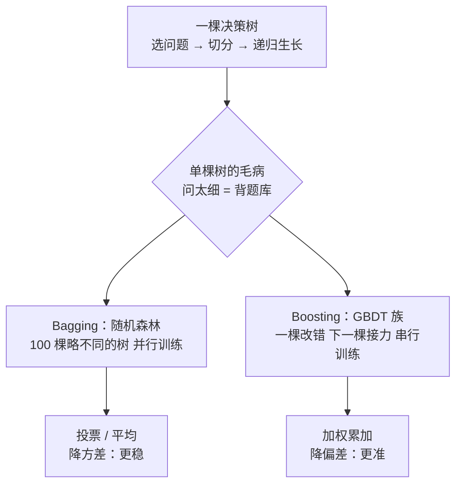

# 决策树与集成学习

> **一句话理解**：决策树（Decision Tree）就是玩"20 个问题"游戏——通过一连串"是 / 否"问题把人群一路切分到叶子；集成学习（Ensemble Learning）则是一群"略不同的树"组团干活：随机（森林）投票、接力（Boosting）纠错。表格数据至今仍是树模型的天下。

[⬆️ 返回总目录](../../../README.md) · [⬆️ 返回本篇](../README.md) · [⬅️ 返回本章目录](./README.md)

| 属性 | 说明 |
|------|------|
| 难度 | ⭐⭐（进阶） |
| 所属分支 | 通用基础 |
| 前置知识 | [逻辑回归与分类](./03-逻辑回归与分类.md) |

---

## 📌 这一节解决什么问题

逻辑回归的决策边界是一条直线，但现实规律经常不是直的："年龄大于 40 **且** 收入低于 1 万的人才高危"——这种阶梯状、带组合条件的规律，直线画得非常勉强，要靠人工造特征硬掰。

决策树换了个思路：**别画线了，问问题吧**。"每周加班超过 10 小时吗？""每天喝咖啡吗？"——每问一句，人群就被劈成两半，问上几层，每个小房间里的人就差不多"同一种命运"了。它天然输出 if-else 规则，业务同事看得懂、能落地成手册，这是很多行业（风控、医疗）离不开它的原因。

单棵树的问题：问得太细 = 把训练集的偶然现象当规律（过拟合）；问得太粗 = 没学会（欠拟合）。于是有了集成学习：**一棵树是弱鸡，一群树是军队**——这正是表格数据上至今打遍各种新模型的最强常规武器。

## 🌱 通俗理解

**决策树 = 20 个问题游戏**：你心里想一个东西，我问"是动物吗？""会飞吗？""比汽车大吗？"——好的问题一次能砍掉一半可能性，烂的问题（"是红色的吗？"）问完范围几乎没缩。决策树训练的全部内容，就是**学出"每一层该问哪个问题"**：专挑最能缩小不确定性的问。

**随机森林（Random Forest）= 问 100 个略不同的朋友再投票**：每个朋友只看过部分数据、只被允许关注部分特征（所以观点略不同），单看谁都未必最准，但投票结果往往比任何单个"最强大脑"更稳——**群体智慧抹平个体偏见**。

**Boosting = 一棵改完错误，下一棵接着改**：第一位"医生"先诊断，留下的错题专门整理成错题本交给第二位专攻；第二位的残余错误再传给第三位……像接力赛，每一棒只盯前面没搞定的地方，最后把所有人的意见加权汇总——**专治"还差一点"**。

## 📋 举个例子

8 位员工的调研数据，预测"会不会离职"：

| 员工 | 每周加班 > 10h | 每天喝咖啡 | 一年后 |
|---|---|---|---|
| A | 是 | 是 | **离职** |
| B | 是 | 是 | **离职** |
| C | 是 | 是 | **离职** |
| D | 是 | 否 | 留下 |
| E | 否 | 是 | 留下 |
| F | 否 | 否 | 留下 |
| G | 否 | 是 | 留下 |
| H | 否 | 否 | 留下 |

**手推一棵两层决策树。** 全体 8 人：4 离 4 留，最乱（熵 = 1）。比较两个候选问题：

- 问"加班？"：加班组 {A,B,C,D} 变成 3 离 1 留（大幅变纯）；不加班组 {E,F,G,H} 变成 4 留（完全纯）；
- 问"喝咖啡？"：喝咖啡组 {A,B,C,E,G} 是 3 离 2 留（几乎没变纯）；不喝组 {D,F,H} 是 3 留（较纯）。

"加班"劈完不确定性掉得更多（信息增益 0.594 vs 0.393，计算见折叠框），所以**第一问选加班**。加班组里还剩 4 人（3 离 1 留），再问"喝咖啡？"：{A,B,C} 全离、{D} 全留——完美切分。最终这棵树：

```text
每周加班 > 10h ？
├── 是 → 每天喝咖啡 ？
│        ├── 是 → 预测离职（A、B、C）
│        └── 否 → 预测留下（D）
└── 否 → 预测留下（E、F、G、H）
```

两条可读规则："加班且喝咖啡 → 高危""不加班 → 安全"——可以直接拿去和 HR 讨论。

<details>
<summary>🧮 展开：上面的熵与信息增益是怎么算出来的</summary>

信息熵 $H = -\sum p_i \log_2 p_i$（"罐子里摸球的不确定性"）。以 2 为底时单位是比特。

- 全体：4 离 4 留，$H = -(\frac{4}{8}\log_2\frac{4}{8} + \frac{4}{8}\log_2\frac{4}{8}) = 1.0$（一半一半 = 最乱）；
- 问"加班"后：加班组 $H = -(\frac{3}{4}\log_2\frac{3}{4} + \frac{1}{4}\log_2\frac{1}{4}) \approx 0.811$，不加班组 $H = 0$（全留）。加权：$\frac{4}{8} \times 0.811 + \frac{4}{8} \times 0 = 0.406$。信息增益 $= 1.0 - 0.406 = \mathbf{0.594}$；
- 问"咖啡"后：喝组（3 离 2 留）$H \approx 0.971$，不喝组 $H = 0$。加权：$\frac{5}{8} \times 0.971 = 0.607$。信息增益 $= 1.0 - 0.607 = \mathbf{0.393}$。

0.594 > 0.393，所以第一问是"加班"。树每长一层，就是把"剩下的不确定性"再往下砍一刀，砍到叶子够纯（或问到规定深度）为止。

</details>

**"三个臭皮匠"投票**：新员工 X（加班、喝咖啡），问 3 棵训练时"见过不同数据子集"的树——树 1 说离职、树 2 说离职、树 3 说留下，2 : 1，预测**离职**。单棵树看走眼的偶然性，被投票抵消了。

## 🧠 核心原理

### 整体流程



### 逐步拆解

**① 决策树怎么选问题：熵与基尼**

$$
H(D) = -\sum_{i=1}^{k} p_i \log_2 p_i
$$

> 👉 **人话**：信息熵（Information Entropy）衡量一屋子人的"乱度"：全是一种人 = 0（纯），一半对一半 = 最大（最乱）。树的目标是每问一句，让屋子的乱度掉得越多越好（信息增益 = 父节点熵 − 子节点熵的加权平均）。

$$
\text{Gini}(D) = 1 - \sum_{i=1}^{k} p_i^2
$$

> 👉 **人话**：基尼不纯度（Gini Impurity）= 随机从屋里抽两个人，他们类别不同的概率。和熵量的是同一件事，只是不用算对数、**算得更快**——sklearn 的决策树默认就用它。

**② 剪枝（Pruning）：别问太细**

> 👉 **人话**：问到第 12 层的问题往往是"工位在 3 楼吗"这种纯巧合——训练集专属规律。剪枝就是给树立规矩：事前限制（最多问 6 层、一个叶子至少 20 人）叫预剪枝；事后把"只会添乱"的枝条锯掉叫后剪枝。一句话：**宁可粗一点，也别背题库**。

**③ 随机森林：Bagging（Bootstrap AGGregatING）**

$$
\hat{f}(x) = \frac{1}{B}\sum_{b=1}^{B} T_b(x) \quad \text{（回归取平均，分类投票）}
$$

> 👉 **人话**：训练 B 棵树，每棵只喂"有放回抽样"的部分数据、每次分裂只许看部分特征——强行让每棵树"见识略有不同"。它们的错误方向各不相同，平均之后各自的偏差互相抵消，**结果比任何单棵树都稳**（方差下降）。并行训练，谁也不依赖谁。

**④ GBDT / XGBoost / LightGBM：Boosting 接力**

$$
F_m(x) = F_{m-1}(x) + \eta \cdot h_m(x), \quad h_m \text{ 专门拟合当前的残余错误}
$$

> 👉 **人话**：梯度提升决策树（GBDT, Gradient Boosted Decision Trees）是接力赛：第 $m$ 棵小树不看全题，只看前 $m-1$ 棵**还没改掉的错误**（残差 / 负梯度），补一小刀；$\eta$（学习率）限制每刀只补一点，防止把训练集的噪声也当错误去修。XGBoost、LightGBM 是这一思想的工业化引擎版本（二阶信息、直方图加速、并行化等工程优化），在表格数据竞赛与工业界长期占据榜首梯队——**遇到表格数据，它们仍是 2026 年的第一试炼选择**。

| | 随机森林（Bagging） | GBDT 族（Boosting） |
|---|---|---|
| 训练方式 | 并行，树与树独立 | 串行，后面的树盯前面的错 |
| 主要收益 | 降方差（更稳） | 降偏差（更准） |
| 对噪声 | 天生皮实 | 更敏感，需控制学习率/深度 |
| 调参难度 | 少，好伺候 | 多，天花板更高 |
| 一句话 | 问 100 个朋友投票 | 一棒接一棒地改错题 |

## 💻 动手试试

随机森林 + 特征重要性（Feature Importance）——树模型顺便告诉你"哪个问题最关键"：

```python
import pandas as pd
from sklearn.datasets import load_wine
from sklearn.ensemble import RandomForestClassifier
from sklearn.model_selection import train_test_split

X, y = load_wine(return_X_y=True)          # 178 款酒、13 项理化指标、3 个品种
X_tr, X_te, y_tr, y_te = train_test_split(X, y, random_state=42)

forest = RandomForestClassifier(n_estimators=100, random_state=42)
forest.fit(X_tr, y_tr)                     # 100 棵略不同的树，各自训练、集体投票
print("测试集准确率:", round(forest.score(X_te, y_te), 3))

importance = pd.Series(forest.feature_importances_,          # 每个特征"扛了多少决策"
                       index=load_wine().feature_names)
print(importance.sort_values(ascending=False).head(3).round(3))

# 预期输出（可复现）：
# 测试集准确率: 1.0
# flavonoids         0.198    ← 类黄酮含量，最关键的"第一问"
# color_intensity    0.184
# alcohol            0.142
```

把 `n_estimators` 从 100 降到 5 再跑一次：分数往往下降——树太少，投票的"民意"不够稳。

## 🔥 炼丹小灶

> 🔥 **炼丹小灶**：工业界常用起点配方与玄学——
> - 配方（随机森林）：`n_estimators=300~500` 起步（多了不亏、只是慢），`max_depth=None~12`，`min_samples_leaf=1~20`；先默认跑通再调；
> - 配方（GBDT 族 / LightGBM）：`learning_rate=0.05~0.1` + `n_estimators=300~1000` 配对调（小步 + 多树一般更稳），`max_depth=6~10` 或 `num_leaves=31~127`，类别不平衡先设 `scale_pos_weight`；
> - 玄学：GBDT 调不动时，八成是特征没做对而不是参数没调对；两套随机性（行采样 + 列采样）同时打开，经常白赚一点分数；
> - ⚠️ 以上是经验参考值，不是圣旨；换数据集请重新炼。

## 🔗 在知识树中的位置

- **上游**：[逻辑回归与分类](./03-逻辑回归与分类.md)——分类的另一条路：不画直线，改问问题。
- **下游**：[模型评估与调优](./07-模型评估与调优.md)（树是超参数最多的模型之一，交叉验证 + 网格搜索是标配）；[99-生产实战](./99-生产实战.md)（用户流失项目的第一选择就是 GBDT 族）。
- **横向对比**：连续规律的平滑外推交给[线性回归](./02-线性回归.md)；图像、文本等原始高维信号交给[第 4 章](../../3-深度学习/04-深度学习基础/README.md)的神经网络——**结构化表格数据，树模型至今仍是首选基线**。

## ⚠️ 常见误区

- **误区一**："树越深越好" → 深到把每个训练样本单独关进叶子，训练准确率 100%、测试翻车；深度是过拟合旋钮，见[07-模型评估与调优](./07-模型评估与调优.md)。
- **误区二**："随机森林和 GBDT 是一回事，都是一堆树" → Bagging 并行投票、降方差；Boosting 串行纠错、降偏差；调参习惯和失效方式都不一样。
- **误区三**："特征重要性高 = 因果" → 重要性只说明"树用了它"，相关不等于因果，归因问题要看[第 11 章：因果推断](../../4-专业方向/11-因果推断/01-相关不等于因果.md)。

## 📝 小结与自测

**要点回顾**

- 决策树 = 20 个问题游戏：用熵 / 基尼挑"最能缩小范围的问题"，递归切分，剪枝防背题库；
- Bagging（随机森林）：100 棵略不同的树并行训练、投票，降方差更稳；
- Boosting（GBDT / XGBoost / LightGBM）：一棵改完错误下一棵接力，降偏差更准；
- 表格数据至今是树模型的天下：先树基线，再谈深度学习。

**自测一下**（点击展开答案）

<details>
<summary>问题 1：为什么随机森林要"故意"让每棵树只看部分数据和部分特征？</summary>

如果 100 棵树看到完全相同的数据，它们会学得几乎一样，投票等于一棵树说话，没有群体智慧。故意制造差异（有放回抽样的数据子集 + 随机的特征子集），让每棵树的错误方向不同，平均 / 投票时彼此的偏差相互抵消——"略不同的朋友"比"一模一样的复读机"更有参考价值。

</details>

<details>
<summary>问题 2：GBDT 的学习率设得很小（如 0.05），为什么反而常常更好？</summary>

小学习率让每棵树只对当前错误做小幅修正，相当于"小步快跑"逼近目标：单棵树的过冲和噪声拟合会被后续树继续纠正，整体更稳、泛化更好。代价是需要更多的树（更多轮迭代）才能到达同样的拟合度，训练时间变长——所以常和 `n_estimators` 配对调整，必要时配合早停。

</details>

## 📚 延伸阅读

- 书：周志华《机器学习》第 4 章——决策树与信息增益推导
- 书：《The Elements of Statistical Learning》第 9、10 章——Bagging / Boosting 的统计视角
- 博客：sklearn 官方文档 Ensemble Methods 章节——随机森林、GBDT 参数表

---

[⬅️ 上一页：逻辑回归与分类](./03-逻辑回归与分类.md) · [返回本章目录](./README.md) · [下一页：支持向量机 ➡️](./05-支持向量机.md)
