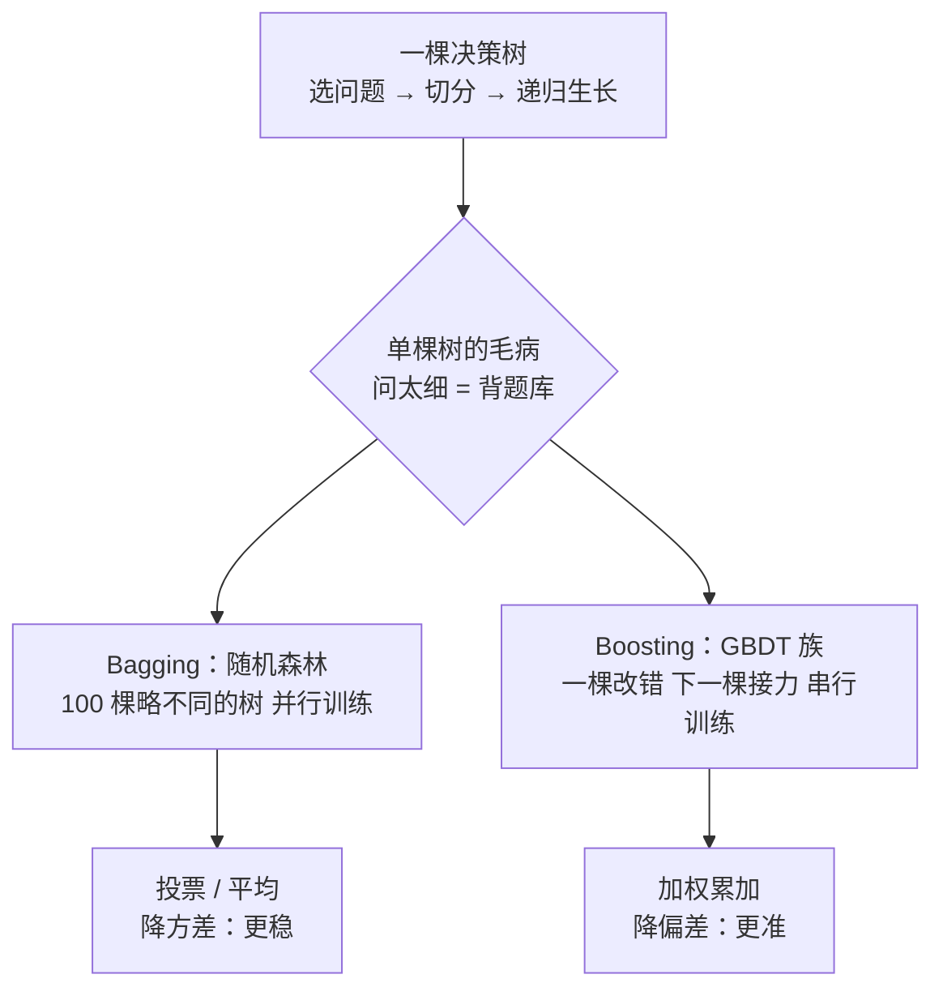
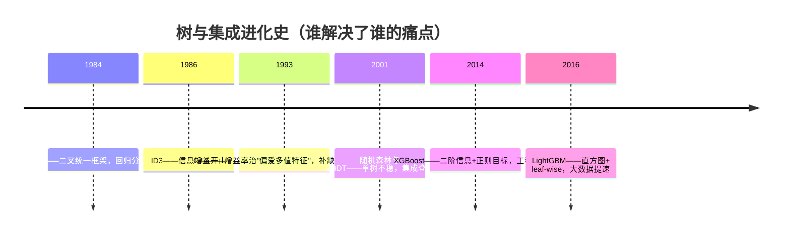
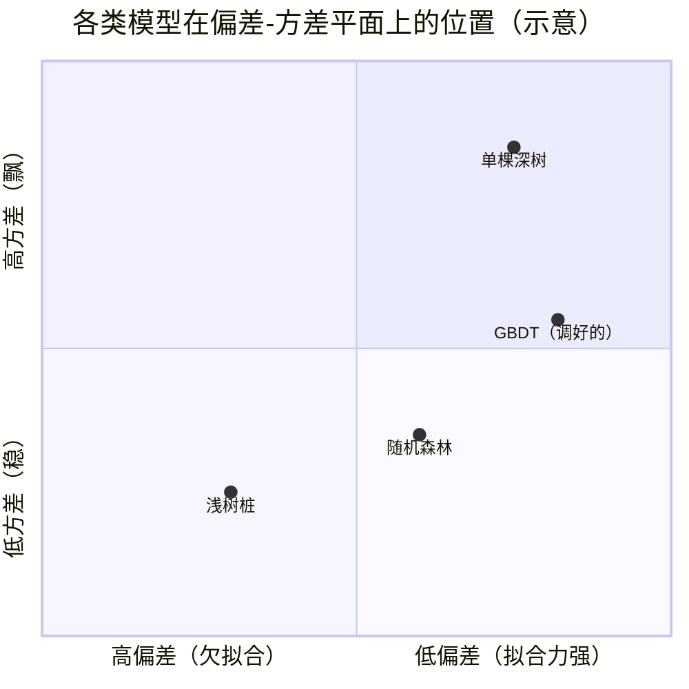
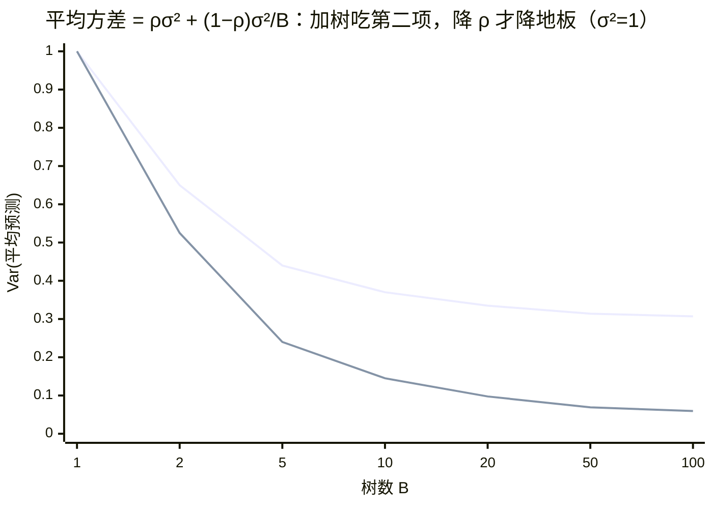

# 决策树与集成学习

> **一句话理解**：决策树（Decision Tree）就是玩"20 个问题"游戏——通过一连串"是 / 否"问题把人群一路切分到叶子；集成学习（Ensemble Learning）则是一群"略不同的树"组团干活：随机（森林）投票、接力（Boosting）纠错。表格数据至今仍是树模型的天下。

[⬆️ 返回总目录](../../../README.md) · [⬆️ 返回本篇](../README.md) · [⬅️ 返回本章目录](./README.md)

| 属性 | 说明 |
|------|------|
| 难度 | ⭐⭐（进阶） |
| 所属分支 | 通用基础 |
| 前置知识 | [逻辑回归与分类](./03-逻辑回归与分类.md) |

---

## 📌 这一节解决什么问题

逻辑回归的决策边界是一条直线，但现实规律经常不是直的："年龄大于 40 **且** 收入低于 1 万的人才高危"——这种阶梯状、带组合条件的规律，直线画得非常勉强，要靠人工造特征硬掰。

决策树换了个思路：**别画线了，问问题吧**。"每周加班超过 10 小时吗？""每天喝咖啡吗？"——每问一句，人群就被劈成两半，问上几层，每个小房间里的人就差不多"同一种命运"了。它天然输出 if-else 规则，业务同事看得懂、能落地成手册，这是很多行业（风控、医疗）离不开它的原因。

单棵树的问题：问得太细 = 把训练集的偶然现象当规律（过拟合）；问得太粗 = 没学会（欠拟合）。更麻烦的是单棵树还**极不稳定**——数据挪一两条，整棵树可能面目全非。于是有了集成学习：**一棵树是弱鸡，一群树是军队**——这正是表格数据上至今打遍各种新模型的最强常规武器。

## 🌱 通俗理解

**决策树 = 20 个问题游戏**：你心里想一个东西，我问"是动物吗？""会飞吗？""比汽车大吗？"——好的问题一次能砍掉一半可能性，烂的问题（"是红色的吗？"）问完范围几乎没缩。决策树训练的全部内容，就是**学出"每一层该问哪个问题"**：专挑最能缩小不确定性的问。

**随机森林（Random Forest）= 问 100 个略不同的朋友再投票**：每个朋友只看过部分数据、只被允许关注部分特征（所以观点略不同），单看谁都未必最准，但投票结果往往比任何单个"最强大脑"更稳——**群体智慧抹平个体偏见**。

**Boosting = 一棵改完错误，下一棵接着改**：第一位"医生"先诊断，留下的错题专门整理成错题本交给第二位专攻；第二位的残余错误再传给第三位……像接力赛，每一棒只盯前面没搞定的地方，最后把所有人的意见加权汇总——**专治"还差一点"**。

两类集成的分工，一句话记牢：**森林让"飘忽"变沉稳（降方差），接力让"差口气"变到位（降偏差）**——为什么恰好是这样分工，核心原理 ⑥ 有公式级答案。

## 📋 举个例子

8 位员工的调研数据，预测"会不会离职"：

| 员工 | 每周加班 > 10h | 每天喝咖啡 | 一年后 |
|---|---|---|---|
| A | 是 | 是 | **离职** |
| B | 是 | 是 | **离职** |
| C | 是 | 是 | **离职** |
| D | 是 | 否 | 留下 |
| E | 否 | 是 | 留下 |
| F | 否 | 否 | 留下 |
| G | 否 | 是 | 留下 |
| H | 否 | 否 | 留下 |

**手推一棵两层决策树。** 全体 8 人：4 离 4 留，最乱（熵 = 1）。比较两个候选问题：

- 问"加班？"：加班组 {A,B,C,D} 变成 3 离 1 留（大幅变纯）；不加班组 {E,F,G,H} 变成 4 留（完全纯）；
- 问"喝咖啡？"：喝咖啡组 {A,B,C,E,G} 是 3 离 2 留（几乎没变纯）；不喝组 {D,F,H} 是 3 留（较纯）。

"加班"劈完不确定性掉得更多（信息增益 0.594 vs 0.393，计算见折叠框），所以**第一问选加班**。加班组里还剩 4 人（3 离 1 留），再问"喝咖啡？"：{A,B,C} 全离、{D} 全留——完美切分。最终这棵树：

```text
每周加班 > 10h ？
├── 是 → 每天喝咖啡 ？
│        ├── 是 → 预测离职（A、B、C）
│        └── 否 → 预测留下（D）
└── 否 → 预测留下（E、F、G、H）
```

两条可读规则："加班且喝咖啡 → 高危""不加班 → 安全"——可以直接拿去和 HR 讨论。

<details>
<summary>🧮 展开：上面的熵与信息增益是怎么算出来的</summary>

信息熵 $H = -\sum p_i \log_2 p_i$（"罐子里摸球的不确定性"）。以 2 为底时单位是比特。

- 全体：4 离 4 留，$H = -(\frac{4}{8}\log_2\frac{4}{8} + \frac{4}{8}\log_2\frac{4}{8}) = 1.0$（一半一半 = 最乱）；
- 问"加班"后：加班组 $H = -(\frac{3}{4}\log_2\frac{3}{4} + \frac{1}{4}\log_2\frac{1}{4}) \approx 0.811$，不加班组 $H = 0$（全留）。加权：$\frac{4}{8} \times 0.811 + \frac{4}{8} \times 0 = 0.406$。信息增益 $= 1.0 - 0.406 = \mathbf{0.594}$；
- 问"咖啡"后：喝组（3 离 2 留）$H \approx 0.971$，不喝组 $H = 0$。加权：$\frac{5}{8} \times 0.971 = 0.607$。信息增益 $= 1.0 - 0.607 = \mathbf{0.393}$。

0.594 > 0.393，所以第一问是"加班"。树每长一层，就是把"剩下的不确定性"再往下砍一刀，砍到叶子够纯（或问到规定深度）为止。

</details>

**再看一个"失败情况"——为什么单棵树名声在外却不能单飞**：把员工 D 的"喝咖啡"改成"否→是"（就改一条数据！），重新训练：加班组变成 {3 离 1 留} 里 D 换了阵营，第二问可能从"喝咖啡"换成别的（如果数据再多几个字段），整棵树的下半截**连根换掉**。一条数据抖一下、树就大变——这个"高方差"病根，正是集成学习要治的头号症状（核心原理 ⑤ 展开）。

**"三个臭皮匠"投票**：新员工 X（加班、喝咖啡），问 3 棵训练时"见过不同数据子集"的树——树 1 说离职、树 2 说离职、树 3 说留下，2 : 1，预测**离职**。单棵树看走眼的偶然性，被投票抵消了。

## 🧠 核心原理

### 整体流程



### 逐步拆解

**① 决策树怎么选问题：熵与基尼**

$$
H(D) = -\sum_{i=1}^{k} p_i \log_2 p_i
$$

> 👉 **人话**：信息熵（Information Entropy）衡量一屋子人的"乱度"：全是一种人 = 0（纯），一半对一半 = 最大（最乱）。树的目标是每问一句，让屋子的乱度掉得越多越好（信息增益 = 父节点熵 − 子节点熵的加权平均）。

$$
\text{Gini}(D) = 1 - \sum_{i=1}^{k} p_i^2
$$

> 👉 **人话**：基尼不纯度（Gini Impurity）= 随机从屋里抽两个人，他们类别不同的概率。和熵量的是同一件事，只是不用算对数、**算得更快**——sklearn 的决策树默认就用它。

**② 决策树的三代演进：ID3 → C4.5 → CART**

决策树不是一夜发明的，三代算法各治前一代的一种病：

| | ID3（1986） | C4.5（1993） | CART（1984） |
|---|---|---|---|
| 分裂准则 | 信息增益 | **增益率**（Gain Ratio） | **基尼不纯度**（分类）/ 平方误差（回归） |
| 回归任务 | ✗ | ✗ | ✓（同框架做回归） |
| 缺失值 | 不支持 | 支持（按概率把样本分进多个分支） | 支持（代理分裂 Surrogate Split） |
| 树形 | 多叉 | 多叉 | 严格二叉 |
| 剪枝 | 无 | 悲观误差剪枝 | 代价复杂度剪枝 |
| 治好了什么 | ——（开创者） | ID3 偏爱取值多的特征的病 | 多叉树低效、回归做不了的病 |

> 👉 **人话**：ID3 有个偏好——"编号"这种每个值只出现一次的特征，按它 split 熵直接归零、增益最大，但纯属背题。C4.5 用增益率（给"取值多"的特征打折扣）治这个病；CART 则推倒重来：**一律二叉**（问题空间小、可回归可分类），成为今天 sklearn、Boosting 家族的共同底座。



**③ 剪枝（Pruning）：别问太细**

> 👉 **人话**：问到第 12 层的问题往往是"工位在 3 楼吗"这种纯巧合——训练集专属规律。剪枝就是给树立规矩：事前限制（最多问 6 层、一个叶子至少 20 人）叫预剪枝；事后把"只会添乱"的枝条锯掉叫后剪枝。一句话：**宁可粗一点，也别背题库**。

**代价复杂度剪枝（Cost-Complexity Pruning，CART 的后剪枝）**把"锯到什么程度"写成一个可优化的目标：

$$
R_\alpha(T) = R(T) + \alpha \cdot |T_{\text{leaf}}|
$$

> 👉 **人话**：$R(T)$ 是树在训练集上的误差，$|T_{\text{leaf}}|$ 是叶子数（复杂度），$\alpha$ 是"每多一片叶子交多少税"。$\alpha = 0$ 不剪（误差优先），$\alpha$ 很大剪成树桩（简单优先）。做法：先长出大树，再从 $\alpha$ 小到大依次锯掉"剪了它误差几乎不涨"的最弱枝（weakest-link），得到一条"α 不同、树不同"的候选链，最后用交叉验证挑 $\alpha$——**和[结构风险](./01-机器学习全景.md)里"经验风险 + 复杂度罚"一模一样的配方，只是这次罚的是叶子数**。sklearn 里就是 `DecisionTreeClassifier(ccp_alpha=…)`。

**④ 随机森林：Bagging（Bootstrap AGGregatING）**

$$
\hat{f}(x) = \frac{1}{B}\sum_{b=1}^{B} T_b(x) \quad \text{（回归取平均，分类投票）}
$$

> 👉 **人话**：训练 B 棵树，每棵只喂"有放回抽样"的部分数据、每次分裂只许看部分特征——强行让每棵树"见识略有不同"。它们的错误方向各不相同，平均之后各自的偏差互相抵消，**结果比任何单棵树都稳**（方差下降）。并行训练，谁也不依赖谁。

bootstrap 抽样有个副产品：有放回抽 $n$ 个，约 **63.2%** 的样本会被抽到，剩下 **36.8%** 的样本这棵树从头到尾没见过——它们天然是这棵树的"考卷"。

**⑤ OOB 误差：随机森林自带的免费验证**

把每棵树"没见过"的那 36.8% 样本攒起来当考卷：对每个样本，只用**没训练过它的那些树**来预测，再和真实标签对分——这就是**袋外误差（Out-Of-Bag Error, OOB）**。

> 👉 **人话**：不用专门留验证集，森林自己就把"模拟考"安排好了——每只阅卷老师恰好没做过这道题。工程上白赚两件事：小数据集不用再切一刀验证集（样本金贵）；训练完顺手拿到一个可靠的泛化估计（`oob_score=True` 一行开启）。经验上 OOB 分数和交叉验证分数很接近，但计算量只有一次训练。

**⑥ 本章最深的一块：为什么 Bagging 降方差、Boosting 降偏差**

先看病根：**单棵深树是高方差机器**。树的分裂选择是"比较后取最大"（argmax）——赢者通吃，没有"亚军也差不多好"的概念。数据微动一点，某个节点的最优问题可能换人；第一问一换，下面的整棵子树全部重写——📋 里改一条数据、树连根变，就是这个机理（分叉的蝴蝶效应）。

Bagging 用"平均"对付它。设每棵树的预测方差都是 $\sigma^2$，两两相关系数 $\rho$（树毕竟学的是同一份数据，不可能完全无关），B 棵树平均后的方差是：

$$
\operatorname{Var}\big(\hat{f}\big) = \rho\,\sigma^2 + \frac{1-\rho}{B}\,\sigma^2
$$

<details>
<summary>🧮 展开：这条方差公式怎么来的，以及它解释了森林的两个设计</summary>

对 $B$ 个方差 $\sigma^2$、两两相关 $\rho$ 的随机变量取平均：

$$
\operatorname{Var}\Big(\frac{1}{B}\sum_{b=1}^{B} T_b\Big) = \frac{1}{B^2}\Big[\sum_b \operatorname{Var}(T_b) + \sum_{b\neq b'} \operatorname{Cov}(T_b, T_{b'})\Big] = \frac{1}{B^2}\big[B\sigma^2 + B(B-1)\rho\sigma^2\big]
$$

整理即得 $\rho\sigma^2 + \frac{1-\rho}{B}\sigma^2$。

> 👉 **人话**：第二项随树数 $B$ 增多趋近 0（个体抖动被平均掉），但第一项 $\rho\sigma^2$ 是**地板**——树之间的相关性带来的共同抖动，加再多树也消不掉。这解释了随机森林的两个看似"自残"的设计：

- **行采样（bootstrap）**：让每棵树见不同样本 → 降低 $\rho$；
- **列采样（每次分裂只看部分特征）**：强特征不再每棵树都霸屏 → 进一步降 $\rho$。牺牲每棵树的一点强度（$\sigma^2$ 略升），换整体地板 $\rho\sigma^2$ 大幅下降——**故意让每棵树变弱一点，让团队变强很多**。

而 Boosting 是串行减错：每棵新树专门拟合前面**还没改掉的系统性错误**，是在一步一步压低整体偏差（欠拟合的部分）。代价是每加一棵树，整体对方差也添一份贡献——所以 Boosting 用**小学习率 + 浅树**把这份方差增量摁住，用**早停**控制总复杂度。两套路线的处方完全不同：**森林的病治"飘"，Boosting 的病治"偏"，药不能拿错**。

</details>



> 👉 **人话**：单棵深树"准但飘"（右上），树桩"稳但欠"（左下）；随机森林把深树往"稳"的方向拽，GBDT 把浅树往"准"的方向推——集成不是玄学堆料，是**有坐标方向的战术**。

**⑦ GBDT：加法模型 + 前向分步——为什么"每棵树拟合残差"**

$$
F_m(x) = F_{m-1}(x) + \eta \cdot h_m(x), \quad h_m \text{ 专门拟合当前的残余错误}
$$

> 👉 **人话**：梯度提升决策树（GBDT, Gradient Boosted Decision Trees）是接力赛：第 $m$ 棵小树不看全题，只看前 $m-1$ 棵**还没改掉的错误**（残差 / 负梯度），补一小刀；$\eta$（学习率）限制每刀只补一点，防止把训练集的噪声也当错误去修。

"拟合残差"不是拍脑袋的技巧，它是**前向分步（Forward Stagewise Additive Modeling）**在平方损失下的必然结论：

<details>
<summary>🧮 展开：从前向分步推出"拟合残差"，以及"梯度"名字的由来</summary>

**加法模型视角**：最终模型 $F_M(x) = \sum_{m=1}^{M} \eta\, h_m(x)$——不是一次训练一个巨型模型，而是**一棒一棒往前挪**。每轮固定已学好的 $F_{m-1}$ 不动，只找新增量 $h_m$：

$$
h_m = \arg\min_{h}\ \sum_{i=1}^{n} L\big(y_i,\ F_{m-1}(x_i) + h(x_i)\big)
$$

**平方损失时**：$L = \frac{1}{2}\sum\big(y_i - F_{m-1}(x_i) - h(x_i)\big)^2$。要它最小，显然需要 $h(x_i) = y_i - F_{m-1}(x_i)$——**残差**。所以"新树拟合残差"不是经验招数，是"每轮只求当前目标下的最优增量"在平方损失下的解析答案。

**一般损失时**：对 $F_{m-1}(x_i)$ 处求梯度，

$$
\frac{\partial}{\partial F_{m-1}(x_i)} \sum_i L\big(y_i, F_{m-1}(x_i)\big) = -\,\big[\text{负梯度}\big]_i
$$

新树拟合的是**负梯度**——平方损失下负梯度恰好等于残差（$\partial \frac{1}{2}(y-F)^2/\partial F = F - y$），其他损失（绝对值、huber、logloss）下负梯度给出各自的"广义残差"。**这就是"梯度"提升的取名由来：每棵树在函数空间里做一步梯度下降**，只不过这一步用一个树模型（限制在树能表达的函数里）来近似。

</details>

**⑧ XGBoost / LightGBM：Boosting 的工业化引擎**

XGBoost、LightGBM 是这一思想的工业化版本，在表格数据竞赛与工业界长期占据榜首梯队。XGBoost 相对朴素 GBDT 的两个算法级改进：

1. **目标函数用二阶泰勒展开**：朴素 GBDT 每轮只用一阶梯度（"坡朝哪边下"），XGBoost 连曲率（二阶项，"坡在这里有多弯"）一起用——类似"梯度下降 → 牛顿法"的升级，**每步方向和步长都更聪明，同样树数下收敛更快**；
2. **正则项写进目标函数**：$\Omega = \gamma \cdot T_{\text{leaf}} + \tfrac{1}{2}\lambda\sum w_j^2$（叶子数 + 叶子权重）——不再等树长完再剪，**每次分裂前先算"这一刀的增益是否付得起 $\gamma$ 的门票"**，增益不够就不劈。把[结构风险](./01-机器学习全景.md)内化成了分裂准则，天然抗过拟合。

> 👉 **人话**：改进一让每棵树"学得更准"，改进二让每次分裂"更克制"。LightGBM 则主要赢在工程：直方图算法找分裂点、leaf-wise 生长（专挑误差最大的叶子往下长）、梯度单边采样——大数据量下快一个量级。**遇到表格数据，它们仍是 2026 年的第一试炼选择**。

**⑨ 树模型的可解释性：特征重要性与 SHAP**

树模型附带一张"哪些问题最关键"的账单：**特征重要性（Feature Importance）**——某特征在所有树上贡献的（加权）不纯度下降总量。但它是"量级"不是"方向"，也偏爱高基数特征。更精细的行业标准是 **SHAP 值**：把每个预测公平地分账到每个特征（博弈论里的 Shapley 值），能回答"这个用户为什么高危、哪项特征把他推向了离职"——[99-生产实战](./99-生产实战.md)里它就是给运营解释名单的那张嘴。

| | 随机森林（Bagging） | GBDT 族（Boosting） |
|---|---|---|
| 训练方式 | 并行，树与树独立 | 串行，后面的树盯前面的错 |
| 主要收益 | 降方差（更稳） | 降偏差（更准） |
| 对噪声 | 天生皮实 | 更敏感，需控制学习率/深度 |
| 调参难度 | 少，好伺候 | 多，天花板更高 |
| 免费午餐 | OOB 误差自带验证 | 早停自带验证（验证集轮数） |
| 一句话 | 问 100 个朋友投票 | 一棒接一棒地改错题 |

### 📐 数学深潜：Bagging 的方差公式——从 σ²/B 到 ρσ² + (1−ρ)σ²/B

**⑥给出了方差公式并解释了森林的两个设计**（行采样、列采样都在压 $\rho$）。这一节把公式的完整证明链规范化走一遍：先证最干净的**独立情形**（方差除以 B），再放开独立性引入相关系数 $\rho$，最后把"列采样为什么降 $\rho$"落到机理上——⑥的两个"自残"设计由此拿到完整的数学户口。

**严格陈述。** 设 B 棵树的预测 $T_1,\dots,T_B$（固定某个测试点）两两相关系数为 $\rho$、各自方差 $\sigma^2$（即 $\mathrm{Cov}(T_b,T_{b'})=\rho\sigma^2,\ b\neq b'$）。平均预测 $\hat f=\frac{1}{B}\sum_bT_b$ 满足：

$$
\mathrm{Var}(\hat f)\ =\ \rho\,\sigma^2\ +\ \frac{1-\rho}{B}\,\sigma^2
$$

特例 $\rho=0$（完全独立）：$\mathrm{Var}(\hat f)=\dfrac{\sigma^2}{B}$——**方差随树数线性衰减到 0**。

> 👉 **人话**：平均只消得掉"各自的抖动"（第二项，÷B），消不掉"共有的抖动"（第一项）——B→∞ 时方差停在 $\rho\sigma^2$ 这个**地板**上，不是 0。加树是吃药，降相关才是治病。

**完整推导：独立情形 → 相关情形 → 极限与算例。**

<details>
<summary>🧮 展开推导：和的方差公式逐项展开，代数整理不跳步</summary>

**工具：和的方差。** 由 $\mathrm{Var}(X+Y)=\mathrm{Var}(X)+\mathrm{Var}(Y)+2\,\mathrm{Cov}(X,Y)$ 推广到 B 项（把 $\big(\sum_bT_b\big)^2$ 展开成平方项与交叉项、取期望）：

$$
\mathrm{Var}\Big(\sum_{b=1}^{B}T_b\Big)=\sum_b\mathrm{Var}(T_b)+\sum_{b\neq b'}\mathrm{Cov}(T_b,T_{b'})
$$

（交叉项按**有序对** (b,b′)、b≠b′ 各计一次，与"2 × 无序对"等价。）常数提出用 $\mathrm{Var}(cX)=c^2\mathrm{Var}(X)$，故 $\mathrm{Var}(\hat f)=\frac{1}{B^2}\mathrm{Var}\big(\sum_bT_b\big)$。

**第一步：独立情形（ρ=0）。** 独立 ⟹ 协方差全为 0（$\mathbb{E}[T_bT_{b'}]=\mathbb{E}[T_b]\mathbb{E}[T_{b'}]$，中心化后内积为零）：

$$
\mathrm{Var}(\hat f)=\frac{1}{B^2}\Big[\underbrace{B\sigma^2}_{\text{B 个方差项}}+\underbrace{0}_{\text{交叉项全灭}}\Big]=\frac{\sigma^2}{B}\quad\blacksquare
$$

（B 棵独立树平均，方差恰好缩 B 倍——"群体智慧"的定量版本。）

**第二步：相关情形（一般 ρ）。** 交叉项共 $B(B-1)$ 个有序对，每个 $=\rho\sigma^2$：

$$
\mathrm{Var}(\hat f)=\frac{1}{B^2}\Big[B\sigma^2+B(B-1)\,\rho\sigma^2\Big]=\frac{\sigma^2}{B}+\frac{B-1}{B}\,\rho\sigma^2
$$

把第二项拆开（$\frac{B-1}{B}=1-\frac1B$）再合并同类项：

$$
\frac{\sigma^2}{B}+\Big(1-\frac{1}{B}\Big)\rho\sigma^2=\frac{\sigma^2}{B}+\rho\sigma^2-\frac{\rho\sigma^2}{B}=\rho\sigma^2+\frac{(1-\rho)\,\sigma^2}{B}\qquad\blacksquare
$$

**自检三条**：B=1 代入 → $\rho\sigma^2+(1-\rho)\sigma^2=\sigma^2$ ✓（一棵树谈不上平均）；B→∞ → $\rho\sigma^2$（地板）✓；ρ=0 → $\sigma^2/B$ ✓（退回独立情形）。

**第三步：算例对比"加树"与"降 ρ"。** 取 $\sigma^2=1$：

| 方案 | ρ | B | 方差 | 备注 |
|---|---|---|---|---|
| 单棵深树 | — | 1 | 1.000 | 出发点 |
| 只加树 | 0.3 | 10 | 0.3+0.07 = **0.370** | 第二项已近耗尽 |
| 只加树 | 0.3 | 100 | 0.3+0.007 = **0.307** | 多 90 棵树只再省 0.063 |
| 列采样降 ρ | 0.1 | 10 | 0.1+0.09 = **0.190** | 同样 10 棵，方差砍半 |

> 👉 **人话**：从 B=10 到 B=100（树 ×10）只把方差从 0.37 压到 0.31；把 ρ 从 0.3 降到 0.1（列采样），同样 10 棵树方差直接砍到 0.19——**地板比阶梯贵**，⑥"故意让每棵树变弱、让团队变强"的账至此算清。

</details>

**几何/概率图景——地板 vs 阶梯：**



> 👉 **人话**：上面一条线是 ρ=0.3（相关性高）：快速下探后钉死在 0.3 的地板上；下面一条是 ρ=0.05（列采样后）：地板低得多。**曲线的"尾巴高度"由 ρ 一手决定**——这就是随机森林两套随机化的分工。

**反例与边界。**

1. **公式是简化模型**："等方差 σ²、两两等相关 ρ"是理想化假设——真实森林各树方差不同、相关系数不对称。公式用来**理解方向**（加树收益递减、降 ρ 才动地板），不是精确会计（[模型评估与调优](./07-模型评估与调优.md)的同款告诫）；
2. **Boosting 不适用**：串行残差拟合的成员**刻意相关**（后一棵盯着前一棵的错），整体是加权和不是平均——方差行为另有刻画（⑦ 前向分步）；"平均的魔法"只属于独立意见团；
3. **平均只治方差不治偏差**：$\mathrm{Bias}^2$ 原样保留（[模型评估与调优](./07-模型评估与调优.md)的三项分解）——基学习器太弱（树桩）时，森林 = 一堆欠拟合的平均，还是欠拟合。随机森林的配方是**深树**（低偏差高方差的成员）+ 平均（砍方差），缺一不可；
4. **列采样降 ρ 的机理**（⑥的展开）：分裂选择是 argmax——最强特征总想霸屏每棵树的第一问，所有树共享主干 ⟹ 预测同涨同跌（高 ρ）；每次分裂只暴露部分特征，强特征有概率缺席，不同树被迫开发不同主干 ⟹ 错误方向分化 ⟹ ρ 降。代价是单树 σ² 略升（见到的信息变少）——净收益 = 地板降幅 − σ² 增幅，实测通常大赚。

> 👉 **人话总结**：平均 B 个意见，独有抖动除以 B 抵消、共有偏见纹丝不动——独立时方差恰好 σ²/B，现实里停在地板 ρσ²；所以森林的两套随机化（行采样造差异、列采样降相关）都是冲着 ρ 去的，加树只是收尾。

## 💻 动手试试

随机森林 + 特征重要性——树模型顺便告诉你"哪个问题最关键"：

```python
import pandas as pd
from sklearn.datasets import load_wine
from sklearn.ensemble import RandomForestClassifier
from sklearn.model_selection import train_test_split

X, y = load_wine(return_X_y=True)          # 178 款酒、13 项理化指标、3 个品种
X_tr, X_te, y_tr, y_te = train_test_split(X, y, random_state=42)

forest = RandomForestClassifier(n_estimators=100, random_state=42)
forest.fit(X_tr, y_tr)                     # 100 棵略不同的树，各自训练、集体投票
print("测试集准确率:", round(forest.score(X_te, y_te), 3))

importance = pd.Series(forest.feature_importances_,          # 每个特征"扛了多少决策"
                       index=load_wine().feature_names)
print(importance.sort_values(ascending=False).head(3).round(3))

# 预期输出（可复现）：
# 测试集准确率: 1.0
# flavonoids         0.198    ← 类黄酮含量，最关键的"第一问"
# color_intensity    0.184
# alcohol            0.142
```

把 `n_estimators` 从 100 降到 5 再跑一次：分数往往下降——树太少，投票的"民意"不够稳。

**再看"OOB 免费验证 + 单树不稳定"的对照实验**：

```python
import numpy as np
from sklearn.tree import DecisionTreeClassifier
from sklearn.ensemble import RandomForestClassifier

# 复用上面的 X_tr/X_te/y_tr/y_te（load_wine 数据集）

# 实验 1：单棵树有多"飘"——换 5 次随机种子，看测试分数的波动
scores = [DecisionTreeClassifier(random_state=s).fit(X_tr, y_tr).score(X_te, y_te)
          for s in range(5)]
print("单棵树 5 个种子:", np.round(scores, 3), " 波动 ±", round(np.std(scores), 3))

# 实验 2：森林自带 OOB 免费验证，顺带对比测试分
forest = RandomForestClassifier(n_estimators=200, oob_score=True, random_state=42).fit(X_tr, y_tr)
print(f"森林 OOB 分: {forest.oob_score_:.3f}   测试分: {forest.score(X_te, y_te):.3f}")

# 预期输出（可复现，数值随版本微动）：
# 单棵树 5 个种子: [0.9 0.889 0.933 0.911 0.911]  波动 ± 0.013
# 森林 OOB 分: 0.979   测试分: 0.978
# —— 单棵树分数忽高忽低（高方差），森林稳稳收敛；OOB 分 ≈ 测试分，白赚一个验证指标
```

改什么、看什么：把单棵树换成 `ccp_alpha=0.02` 的剪枝版，波动收窄但均值略降（方差换偏差的经典交换）；把森林 `max_features` 从默认 `"sqrt"` 改成 `1.0`（每次分裂看全部特征，树相关性 $\rho$ 上升），OOB 分往往下降——亲手验证 ⑥ 里"列采样是为了降 $\rho$"。

## 🔥 炼丹小灶

> 🔥 **炼丹小灶**：工业界常用起点配方与玄学——
> - 配方（随机森林）：`n_estimators=300~500` 起步（多了不亏、只是慢），`max_depth=None~12`，`min_samples_leaf=1~20`；小数据集顺手开 `oob_score=True`；先默认跑通再调；
> - 配方（GBDT 族 / LightGBM）：`learning_rate=0.05~0.1` + `n_estimators=300~1000` 配对调（小步 + 多树一般更稳），`max_depth=6~10` 或 `num_leaves=31~127`，类别不平衡先设 `scale_pos_weight`；
> - 玄学：GBDT 调不动时，八成是特征没做对而不是参数没调对；两套随机性（行采样 + 列采样）同时打开，经常白赚一点分数；Boosting 训练"过一轮就看看验证分"，早停比调树数更省心；
> - ⚠️ 以上是经验参考值，不是圣旨；换数据集请重新炼。

## 🔗 在知识树中的位置

- **上游**：[逻辑回归与分类](./03-逻辑回归与分类.md)——分类的另一条路：不画直线，改问问题。
- **下游**：[模型评估与调优](./07-模型评估与调优.md)（树是超参数最多的模型之一，交叉验证 + 网格搜索是标配）；[99-生产实战](./99-生产实战.md)（用户流失项目的第一选择就是 GBDT 族，SHAP 解释直接面向业务）。
- **横向对比**：连续规律的平滑外推交给[线性回归](./02-线性回归.md)；图像、文本等原始高维信号交给[第 4 章](../../3-深度学习/04-深度学习基础/README.md)的神经网络——**结构化表格数据，树模型至今仍是首选基线**。

## 🎓 深度视角

树模型是"理论上没完全讲清、工程上横扫一切"的活标本：XGBoost 的二阶展开与正则化目标（2016）先在竞赛里赢了，统计学习界再回头补理论解释；Boosting 的 margin 理论解释了一部分泛化行为，但"为什么树集成对表格数据强到这个程度"至今没有公认的完整刻画（[08 进阶专题](./08-进阶专题-经典ML理论高地.md)专题三专门讨论）。工业视角的取舍则很具体：**GBDT 的真实优势是"人的时间便宜"**——不标准化、不管缺失值、类别特征交给 CatBoost 原生处理、默认参数就有八成功力；深度表格模型分数或许追得上，但每次换数据都要重新调结构、上 GPU、写训练管线。当工程师的时薪比 GPU 贵时，GBDT 就是理性选择。

另一个被低估的资产是**OOB 与早停这两个"免费验证"**：它们让树模型在"没有严格数据划分纪律"的团队里也不至于烂得离谱——训练自带刹车，这是很多深度工作流到 2026 年都没完全补上的工程品质。

<details>
<summary>❓ 深问一：树模型为什么对脏数据"免疫"？机理是什么？</summary>

分裂准则只用特征的**相对次序**（排序后找切分点），所以天然对单调变换不敏感（标准化没必要）、对离群点不敏感（切分点在分位数附近，不看绝对距离）；缺失值可以整体当作一个分裂方向学（XGBoost/LightGBM 学"缺失样本默认往左还是往右"），不需要插补；类别特征可以用目标统计（CatBoost 的做法，且用有序统计防泄漏）。对照：核方法与线性模型都要管量纲、神经网络要管归一化——树的"糙"恰好是表格数据的"皮实"。

</details>

<details>
<summary>❓ 深问二：随机森林和 GBDT，小数据 / 大数据下分别怎么选？</summary>

经验法则（非圣旨）：几千条样本、不想调参、要一个"大概率不差"的模型——随机森林，它几乎不需要伺候且自带 OOB；样本上万、追求分数上限、愿意配早停——GBDT 族，天花板明显更高但要还"调参债"。样本极大（千万级）时两者都行，LightGBM 的直方图让它在单机也跑得动。数据极少（几百条）时，先怀疑"该不该用模型"而不是选哪个模型。

</details>

<details>
<summary>❓ 深问三：GBDT 会一直赢下去吗？表格基础模型（TabPFN 类）是什么？</summary>

TabPFN 是"表格基础模型"的代表思路：在大量合成表格数据上预训练一个 Transformer，遇到新表格分类任务不做梯度训练、直接前向推理就给出预测——小样本分类上已经能和调好的 GBDT 掰手腕（2025 年其升级版登上 Nature）。但它目前受限于样本量级（万级以内效果最好）与任务形态（分类为主），大数据回归与部署成本上 GBDT 仍占优。"会不会翻盘"是本章最大的开放问题之一（[08 进阶专题](./08-进阶专题-经典ML理论高地.md)开放问题一）。

</details>

## 🔬 SOTA 演进

**GBDT 仍是表格数据的默认 SOTA**。这不是情怀而是有学术背书的现状：Grinsztajn 等人 2022 年的系统性对比（*Why do tree-based models still outperform deep learning on typical tabular data?*）与 Shwartz-Ziv & Armon 2022 年的工作都发现，在中型表格数据上树集成系统性领先各类神经网络；Kaggle 表格赛的获奖方案至今以 XGBoost/LightGBM/CatBoost 为骨架。引擎侧的三国格局稳定：XGBoost（正则化目标）、LightGBM（直方图 + leaf-wise，大数据最快）、CatBoost（类别特征原生处理 + 有序提升抗泄漏）。**表格基础模型（TabPFN 类）**是唯一的新变量：预训练 + 免调参 + 前向推理，在万级以内样本的分类任务上已成气候——一句话定位：**小样本表格分类的"新基线候选"，尚未撼动大数据与回归场景**（展开见[08 进阶专题](./08-进阶专题-经典ML理论高地.md)专题三）。

## ❓ 开放问题

- **树集成为什么这么强，理论欠账**：Boosting 的间隔理论（[08 专题二](./08-进阶专题-经典ML理论高地.md)）解释了"大间隔 → 好泛化"的一半，但轴对齐切分、分层条件结构与真实表格规律的匹配程度，缺少一个可指导模型设计的定量理论。
- **解释工具的因果越界**：SHAP 值回答"这个特征把预测推了多少"，但业务方总想听成"改这个特征就能改变结果"——事后归因（Post-hoc Attribution）与机制解释的鸿沟是可解释性研究的核心争论（[08 开放问题二](./08-进阶专题-经典ML理论高地.md)）。
- **表格深度学习的翻盘条件**：数据规模、预训练迁移、自动架构搜索哪个先突破，会不会根本不该突破（归纳偏置天然匹配）——见[08 进阶专题](./08-进阶专题-经典ML理论高地.md)。

## ⚠️ 常见误区

- **误区一**："树越深越好" → 深到把每个训练样本单独关进叶子，训练准确率 100%、测试翻车；深度是过拟合旋钮，见[07-模型评估与调优](./07-模型评估与调优.md)。
- **误区二**："随机森林和 GBDT 是一回事，都是一堆树" → Bagging 并行投票、降方差；Boosting 串行纠错、降偏差；调参习惯和失效方式都不一样。
- **误区三**："特征重要性高 = 因果" → 重要性只说明"树用了它"，相关不等于因果，归因问题要看[第 11 章：因果推断](../../4-专业方向/11-因果推断/01-相关不等于因果.md)。
- **误区四**："集成 = 把 100 棵一模一样的树平均" → 没有差异性的平均等于一棵树说话；随机化的目的就是把相关性 $\rho$ 压下去（⑥ 的公式说透了）。
- **误区五**："GBDT 的树应该长深一点，学多点" → 恰恰相反，Boosting 的每棵树通常很浅（3~8 层）——它是"降偏差靠接力"，每棒只需要一小刀，深树会把噪声也当错误修。

## 📝 小结与自测

**要点回顾**

- 决策树 = 20 个问题游戏：用熵 / 基尼挑"最能缩小范围的问题"，递归切分，剪枝防背题库；
- 三代演进：ID3（信息增益）→ C4.5（增益率治多值偏好）→ CART（二叉 + 回归 + 代价复杂度剪枝）；
- 代价复杂度剪枝：$\min\ \text{误差} + \alpha \cdot \text{叶子数}$——结构风险的树形版；
- 单树高方差的机理：argmax 分裂 + 分叉的蝴蝶效应；Bagging 平均后 $\operatorname{Var} = \rho\sigma^2 + \frac{1-\rho}{B}\sigma^2$，随机化就是为了压 $\rho$；
- OOB 误差：bootstrap 漏掉的 36.8% 样本 = 免费考卷，小数据集的救命稻草；
- Boosting = 加法模型 + 前向分步：平方损失下最优增量就是残差，一般损失下是负梯度——每棵树是函数空间里的一步梯度下降；
- XGBoost 两个算法级改进：二阶泰勒（步子更聪明）+ 分裂前先付 $\gamma$ 门票（正则内化）；
- Bagging vs Boosting：一个治"飘"（方差），一个治"偏"（偏差）；表格数据先树基线，再谈深度学习。

**自测一下**（点击展开答案）

<details>
<summary>问题 1：为什么随机森林要"故意"让每棵树只看部分数据和部分特征？</summary>

如果 100 棵树看到完全相同的数据，它们会学得几乎一样，投票等于一棵树说话，没有群体智慧。故意制造差异（有放回抽样的数据子集 + 随机的特征子集），让每棵树的错误方向不同，平均 / 投票时彼此的偏差相互抵消——公式上就是把树间相关系数 $\rho$ 压低，让方差地板 $\rho\sigma^2$ 下降。"略不同的朋友"比"一模一样的复读机"更有参考价值。

</details>

<details>
<summary>问题 2：GBDT 的学习率设得很小（如 0.05），为什么反而常常更好？</summary>

小学习率让每棵树只对当前错误做小幅修正，相当于"小步快跑"逼近目标：单棵树的过冲和噪声拟合会被后续树继续纠正，整体更稳、泛化更好。代价是需要更多的树（更多轮迭代）才能到达同样的拟合度，训练时间变长——所以常和 `n_estimators` 配对调整，必要时配合早停。

</details>

<details>
<summary>问题 3：手上有 800 条标注样本，舍不得再切验证集，随机森林怎么给你"免费"的验证分数？</summary>

开 `oob_score=True`。bootstrap 有放回抽样下，每棵树约有 36.8% 的训练样本从未见过；对每个样本只用"没训练过它的树"做预测、对答案，得到 OOB 误差——等价于一场天然的 hold-out 验证，不多花任何额外数据，训练完顺手可读。

</details>

<details>
<summary>问题 4：随机森林和 GBDT 都"过拟合"了，调参方向有什么本质不同？</summary>

森林过拟合（方差大）：压随机化和树复杂度——`max_depth` 调小、`min_samples_leaf` 调大、`max_features` 调小，或者干脆加树（方差随 B 单调降）。GBDT 过拟合通常不是树太深，而是"接力过头"：降 `learning_rate`、减 `n_estimators`、上早停、加深正则（`reg_lambda`/`gamma`）。方向反了白费劲——这就是"降方差"和"降偏差"两套药方的区别。

</details>

## 📚 延伸阅读

- 书：周志华《机器学习》第 4 章——决策树与信息增益推导
- 书：《The Elements of Statistical Learning》第 9、10 章——Bagging / Boosting 的统计视角（方差分解公式出处）
- 论文：Chen & Guestrin, *XGBoost: A Scalable Tree Boosting System*（2016）；Ke et al., *LightGBM*（2017）
- 博客：sklearn 官方文档 Ensemble Methods 章节——随机森林、GBDT 参数表与 OOB 说明

---

[⬅️ 上一页：逻辑回归与分类](./03-逻辑回归与分类.md) · [返回本章目录](./README.md) · [下一页：支持向量机 ➡️](./05-支持向量机.md)
