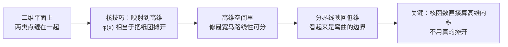
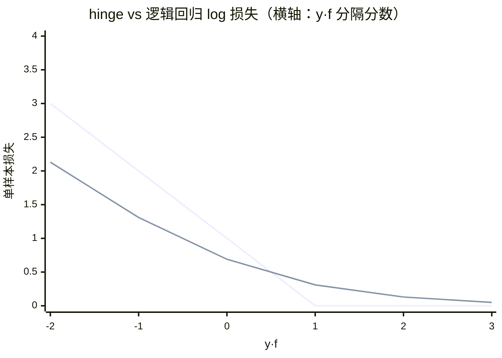
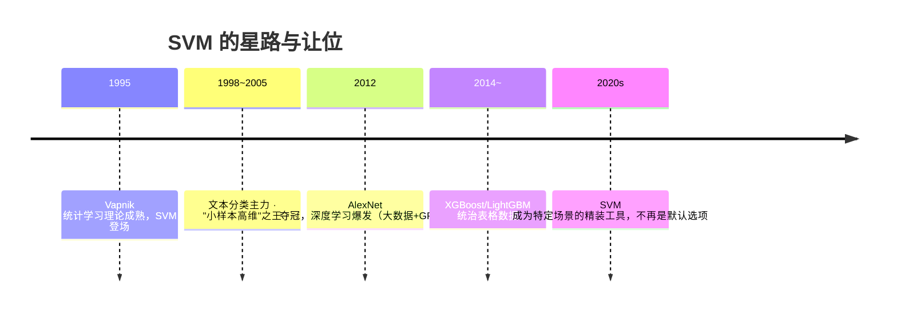

# 支持向量机

> **一句话理解**：支持向量机（Support Vector Machine, SVM）在两类样本之间修一条**尽可能宽的马路**，马路正中间就是分界线——分界线两边留的缓冲越足，新样本越不容易站错边。

[⬆️ 返回总目录](../../../README.md) · [⬆️ 返回本篇](../README.md) · [⬅️ 返回本章目录](./README.md)

| 属性 | 说明 |
|------|------|
| 难度 | ⭐⭐⭐（较难） |
| 所属分支 | 通用基础 |
| 前置知识 | [逻辑回归与分类](./03-逻辑回归与分类.md)；[线性代数](../../1-起步准备/02-数学基础/02-线性代数.md) |

---

## 📌 这一节解决什么问题

逻辑回归也能画一条直线分开两类，但它只求"分对"：只要大部分点在对的一侧，离边界多近都无所谓。**离边界很近的分法是危险的**——新样本稍微抖一下（今天多喝了两杯水、测量误差大一点），就翻到对面去了。

支持向量机把目标改成"**分得稳**"：能分开两类的直线有无数条，SVM 专挑那条让两类离边界**总缓冲最大**的，像在两队人之间修一条最宽的马路，谁也别贴着分界线站。更有意思的是，决定这条马路的只是**极少数骑在马路牙子上的关键样本**——"支持向量"；绝大多数点挪走，马路纹丝不动。

在此基础上，SVM 还有一张王牌：**核技巧**——低维空间里缠在一起分不开的数据，映射到高维就可能一刀切开。这让它在上世纪 90 年代到深度学习爆发前，长期是最亮的明星模型。

## 🌱 通俗理解

把正类、负类想成草坪上两拨人，要在中间划一条分界线：

- **最宽马路**：光"隔开"不够，还要在两队之间修一条尽可能宽的马路，分界线是马路中线。马路越宽，以后新来的人哪怕站歪几步，也还是落在自己这边——**宽马路 = 泛化好**；
- **支持向量（Support Vector）**：就是骑在马路牙子上的那几个人。马路牙子贴着谁，宽度就由谁决定——其他人退后三步，马路一毫米都不变。所以模型训练完，"记住"的只有这几个关键人物；
- **软间隔（Soft Margin）**：总有个别人非要站进马路里（噪声 / 特例）。硬拦着，马路只能修得极窄；不如**容忍个别违章**、罚点款了事，换来一条又宽又稳的主干道；
- **核技巧（Kernel Trick）**：桌上有团揉皱的纸，墨点在纸团表面上你没法用一刀隔开（二维做不到）；**把纸摊开**（升到三维），一刀就切开了——而核技巧的神奇之处在于：不用真的摊开纸，也能算出"摊开后"该在哪切。

## 📋 举个例子

6 个二维点，正类（+）4 个、负类（−）2 个，线性可分：

```text
y
5 |              ▲ P4(5,5)
4 |         ▲ P3(4,4)
3 |    ▲ P1(2,3)
2 |────────────────  ← 候选分界线之一：y = 2
1 | ● N1(1,1)  ● N2(2,1)
  +---------------------→ x
```

**手推"最宽马路"在哪：**

1. **找两类之间最近的一对**：负类到正类的距离——N1(1,1) 到 P1(2,3) 是 $\sqrt{1+4}\approx 2.24$；N2(2,1) 到 P1(2,3) 是 **2**（正上方，竖直距离）；其余配对都更远。最近的一对是 **N2 和 P1，距离 2**；
2. **马路牙子贴着这对点**：马路总宽度不可能超过最近点对的距离（再宽就压到人了），所以最宽马路 = 2，上牙子过 P1、下牙子过 N2；
3. **分界线在正中间**：$y = 2$，马路从 $y=1$ 铺到 $y=3$；
4. **谁说了算**：P1(2,3) 和 N2(2,1) 骑在马路牙子上，是**支持向量**；P2(3,4)、P3(4,4)、P4(5,5)、N1(1,1) 都离马路很远——把它们挪走，$y=2$ 这条分界线**一点不变**。这也解释了 SVM 的一个特点：**多数样本不影响结果，它只认关键少数**。

别的直线（比如斜着画）也能分开这 6 个点，但能铺的马路都比 2 窄——"分得对"的线很多，"分得稳"的线只有一条。

<details>
<summary>📊 展开：软间隔——容忍一个"违章点"会怎样</summary>

在第 6 个点之外，假设又来一个负类点 **N3(2, 2.5)**，正好站进马路中间（$y=2$ 分界线上方、属于负类却闯进了正类地盘）：

- **硬间隔（不许违章）**：要求所有点都在自己一侧的马路牙子之外，此刻无解——除非把马路修得极窄（绕开 N3），比如分界线改成斜线并让总宽度远小于 2。为了一个可疑样本牺牲所有人的缓冲，不划算；
- **软间隔（允许违章 + 罚款）**：给每个点发"违章额度" $\xi_i$（xi），N3 压线就记一笔违章，在目标里按单价 $C$ 罚款。$C$ 大 = 罚得狠，模型拼命修窄马路也要少违章；$C$ 小 = 罚得轻，马路保持宽阔，容忍个别压线。本例中 $C$ 适中时，分界线仍停留在 $y=2$ 附近——它选择"罚 N3 一笔"，而不是为它重修一条窄路；
- **直觉结论**：软间隔 = 在"马路宽"和"违章少"之间讨价还价，旋钮就是 $C$。

**一个"极端情况"**：如果 N3 不是噪声而是**概念性反例**（负类里真有一批点长在正类堆里），软间隔会持续拉扯——$C$ 调多大都只是选择"牺牲谁"。这说明 SVM 的软间隔治的是**个别噪声**，治不了**两类本质重叠**：那种数据该换 RBF 核弯边界，或者承认任务本身需要更多特征才有救。

</details>

## 🧠 核心原理

### 整体流程



### 逐步拆解

**① 最大间隔：把"修最宽马路"写成数学**

$$
\max_{w, b}\ \frac{2}{\|w\|} \quad \text{s.t.}\quad y_i\,(w^\top x_i + b) \ge 1,\ \forall i
$$

> 👉 **人话**：$y_i$ 是 ±1 的标签，约束的意思是"每个点必须站在自己一侧的马路牙子之外"；$\frac{2}{\|w\|}$ 就是马路宽度。要马路最宽 ⟺ 把 $\|w\|$ 压到最小。少数刚好取等号的点（站在牙子上）就是支持向量。

"间隔 = 2/||w||"这个数不是天上掉下来的，它可以从"点到直线的距离"一步步推出来：

<details>
<summary>🧮 展开：从"最宽马路"到优化问题的完整转化</summary>

**第一步，点到分界线的距离**。分界线 $w^\top x + b = 0$ 上，任意点 $x_0$ 到它的距离是中学几何的推广：

$$
r = \frac{|w^\top x_0 + b|}{\|w\|}
$$

> 👉 **人话**：分子是"代进直线方程离 0 有多远"（带符号的犯规距离），除以 $\|w\|$（尺子的刻度）得到真实几何距离。$w$ 是马路的法向量（垂直于马路方向），距离就是沿这个方向量的。

**第二步，约定"马路牙子"的位置**。注意一个自由度：把 $(w, b)$ 同时乘以常数 $c$，直线方程一个字没变（$cw^\top x + cb = 0$ 是同一条线）——所以 $(w,b)$ 的**尺度是任意约定的**。SVM 把尺度钉死在"最近的点恰好让 $|w^\top x + b| = 1$"：

$$
y_i\,(w^\top x_i + b) \ge 1,\quad\text{离边界最近的点取等号}
$$

**第三步，算马路总宽**。设支持向量 $x_+$（正类，$w^\top x_+ + b = +1$）与 $x_-$（负类，$w^\top x_- + b = -1$），它们到中线的距离分别是 $\frac{1}{\|w\|}$，马路总宽：

$$
\text{margin} = \frac{1}{\|w\|} + \frac{1}{\|w\|} = \frac{2}{\|w\|}
$$

**第四步，换成好解的形式**。$\max \frac{2}{\|w\|}$ 等价于 $\min \|w\|$，再等价于（平方、乘 ½，不改变最优解、求导干净）：

$$
\min_{w,b}\ \frac{1}{2}\|w\|^2 \quad \text{s.t.}\quad y_i(w^\top x_i + b) \ge 1
$$

> 👉 **人话**：一个**凸二次规划**（目标凸、约束线性）——全局最优解唯一，这是 SVM 数学上非常"体面"的属性。对照 📋 的手推例子：马路宽 2 ⟹ $\|w\| = 1$，分界线 $y=2$ 即 $w=(0,1), b=-2$，两条牙子 $y=3$（过 P1）与 $y=1$（过 N2），数字严丝合缝。

</details>

**② 软间隔：容忍个别违章**

$$
\min_{w,b,\xi}\ \frac{1}{2}\|w\|^2 + C\sum_{i=1}^{n}\xi_i
$$

> 👉 **人话**：$\xi_i$ 是第 $i$ 个点的"压线深度"（违章记录），$C$ 是罚款单价。前一项想要宽马路，后一项想要少违章，$C$ 调的是两者的权衡：$C$ 大 = 见一个罚一个（马路被迫变窄，容易过拟合）；$C$ 小 = 大度能容（马路宽，但压线的多，可能欠拟合）。

**③ 拉格朗日对偶：为什么解出来"只剩支持向量"**

上面的约束优化有个标准解法：每个约束配一个拉格朗日乘子（Lagrange Multiplier）$\alpha_i \ge 0$，把约束"绑"进目标，然后先对 $(w, b)$ 求最小、再对 $\alpha$ 求最大——得到**对偶问题**。对偶的好处不是数学趣味，而是两条实打实的红利：

$$
\max_{\alpha}\ \sum_i \alpha_i - \frac{1}{2}\sum_{i,j}\alpha_i\alpha_j y_i y_j\, \langle x_i, x_j\rangle
\qquad\text{解出来后：}\quad w = \sum_i \alpha_i y_i x_i
$$

> 👉 **人话**：红利一，$w = \sum \alpha_i y_i x_i$ 说**分界线是样本们的加权拼装**，权重就是 $\alpha_i$——解完对偶问题，$\alpha_i = 0$ 的样本在求和里直接消失，**只有 $\alpha_i > 0$ 的（支持向量）真正出场**，"非支持向量不出现"是解的结构自然给出的，不是额外的筛选。红利二，对偶问题里**数据只以两两内积 $\langle x_i, x_j\rangle$ 的形式出现**——这正是核技巧能插进来的门缝：把内积整体换成核函数，整套流程原封不动地在高维跑起来。此外，原问题变量数 = 特征维度，对偶变量数 = 样本数——**高维低样本**（如文本）场景对偶反而更好算。

**④ KKT 条件：把"谁出场"说穿**

凸优化里，最优解必须满足 KKT 条件（Karush–Kuhn–Tucker conditions）。对软间隔 SVM，它们把每个样本的命运安排得明明白白：

| KKT 情形 | 样本的位置 | 在模型里的角色 |
|---|---|---|
| $\alpha_i = 0$ | 离马路很远，约束不等号严格成立 | **不出场**：挪走它，边界不动 |
| $0 < \alpha_i < C$ | 恰好骑在马路牙子上（$\xi_i = 0$） | **标准支持向量**：撑起马路宽度 |
| $\alpha_i = C$ | 压线 / 越线的违章者（$\xi_i > 0$） | **边界支持向量**：被罚款，但仍拽着边界 |

> 👉 **人话**：KKT 条件就是一张"出场名单"——要么老实待着别吭声（$\alpha=0$），要么骑线撑马路（自由乘子），要么违章被罚但仍有发言权（$\alpha$ 顶格到 $C$）。**这也解释了 SVM 的一个诊断技巧：支持向量太多（占比高）= 数据乱、边界被大量样本拉扯，往往该调大 $C$ 的对立面（降模型复杂度）或回去做特征；支持向量极少 = 规律清晰，模型很自信。**

<details>
<summary>🧮 展开：用 📋 的 6 点例子核对一遍"出场名单"</summary>

📋 的最优解是：分界线 $y = 2$，即 $w = (0, 1)$、$b = -2$（$\|w\| = 1$，马路宽 $2/\|w\| = 2$，对上了）。逐点核对约束 $y_i (w^\top x_i + b)$ 的值：

| 点 | 计算 $w^\top x + b = y_{coord} - 2$ | 约束值 | 名单 |
|---|---|---|---|
| P1(2,3) | $3 - 2$ | **+1（取等号）** | 支持向量，$\alpha > 0$ |
| N2(2,1) | $1 - 2$ | **−1（取等号）** | 支持向量，$\alpha > 0$ |
| P2(3,4) | $4 - 2$ | +2 > 1 | $\alpha = 0$，不出场 |
| P3(4,4) | $4 - 2$ | +2 > 1 | $\alpha = 0$，不出场 |
| P4(5,5) | $5 - 2$ | +3 > 1 | $\alpha = 0$，不出场 |
| N1(1,1) | $1 - 2$ | −1……恰好也是 −1？ |

最后一个点值得多说一句：N1(1,1) 的约束值也是 −1——它同样骑在"约束取等号"的位置（$y = 1$ 恰是下牙子）。这类点叫**边际上的支持向量**：它骑线但**不额外撑宽马路**（宽度由最近点对决定）；此时 $\alpha_{N1}$ 可以取 0 也可以取正，解不唯一，任何"由 P1、N2（可加 N1）撑起同一条线"的分配都是最优。实践中它叫**冗余支持向量**——挪走 N1 线不动，挪走 P1 或 N2 线必动。

> 👉 **人话**："支持向量"的严格判据是 $\alpha_i > 0$，而不是"看起来骑在牙子上"——骑线只是必要条件，谁真正被解"选中"（$\alpha > 0$），谁的坐标才进入了 $w = \sum \alpha_i y_i x_i$ 的拼装。

</details>

**⑤ 换个视角：SVM = 正则化的 hinge 回归**

把软间隔 SVM 换个等价写法，它突然长得像[逻辑回归](./03-逻辑回归与分类.md)的亲戚——损失函数版：

$$
\min_{w,b}\ \sum_{i=1}^{n} \underbrace{\max\big(0,\ 1 - y_i f(x_i)\big)}_{\text{hinge 损失}} + \lambda\|w\|^2,\qquad f(x) = w^\top x + b
$$

> 👉 **人话**：hinge（合页）损失：分对且分数够（$y\,f \ge 1$，站在牙子外）就**零惩罚**；分得不够开才开始罚，越错罚得越线性地狠。和逻辑回归的交叉熵对比着看最清楚——**两者都是"线性打分器 + 损失 + L2 正则"的同一副骨架，只换了损失函数**，边界却大不相同：



> 👉 **人话**：hinge（第一条线）在 $y f \ge 1$ 后**彻底不管**——"分够开了，别得寸进尺"；log 损失（第二条线）**永远大于 0、永远想再自信一点**——这就是 03 页说过的"逻辑回归权重会膨胀"的来源。分不够开时，hingle 罚得比 log 狠（线性 vs 对数放缓）。后果：SVM 边界只由骑线者决定（全局最优但**输出不是概率**，打分离校准很远）；逻辑回归所有样本都推边界（输出是概率、可校准）。**要概率找逻辑回归，要"最稳的一条线"找 SVM**——第三条路是把两者缝合：SVM 训完再做 Platt 校准把分数压成概率。

**⑥ 核技巧：低维分不开就升维**

$$
K(x_i, x_j) = \phi(x_i)^\top \phi(x_j)
$$

> 👉 **人话**：把每个样本先经 $\phi$ 映射到高维（摊开纸团），再在高维修马路。神奇之处：SVM 的全部计算只用到**点对的内积**（对偶问题 ③ 里已经看到），而核函数 $K$ 能**直接给出高维内积的值**，根本不用真的把数据搬上去——省下天文数字的计算量。最常用的是高斯核 / RBF 核，相当于映射到**无穷维**，边界可以任意弯曲。代价：特征没标准化时它几乎必翻车，gamma（控制单个样本影响半径）调太大也会把噪声当宝贝。

什么样的函数配当核函数？**Mercer 条件（一句话）**：对任意一批样本，由 $K(x_i,x_j)$ 拼成的核矩阵必须对称半正定——等价于"确实存在某个高维空间，让 $K$ 是那儿的内积"。实践中别自己发明核，用现成的（linear / poly / RBF）就够。

**⑦ 多分类怎么办：一句话版**

SVM 天生是二分类器，多分类靠"组队"：**一对一（OvO）**——每两类训一条边界，共 $\frac{K(K-1)}{2}$ 条，新样本来了投票；**一对一 vs 一对多（OvR）**——每个类对其余所有类训一条边界，共 K 条，取"离边界最远"的类。sklearn 的 `SVC` 默认 OvO，`LinearSVC` 默认 OvR。类别不均衡时 OvR 容易被大类淹没，OvO 更稳但类别一多训练量平方级上涨——这也是多分类任务里逻辑回归（Softmax 原生多类）和树模型（多类天然支持）更常被选用的原因之一。

**⑧ 适用场景与衰落史：小样本、高维、要稳**

| 场景 | SVM 表现 |
|------|----------|
| 样本几千~几万、特征几百上千维 | 主场：文本分类（词向量天然高维稀疏） |
| 超大样本（百万级） | 训练代价高，通常让位给[逻辑回归](./03-逻辑回归与分类.md)或[树模型](./04-决策树与集成学习.md) |
| 表格数据 | 一般先试 GBDT 族，SVM 作对照 |
| 图像 / 文本原始信号 | 交给[第 4 章](../../3-深度学习/04-深度学习基础/README.md)的神经网络 |



**衰落的原因是结构性的，不是"变笨了"**：核矩阵 $n \times n$ 要整个装进内存（百万样本 = 万亿格的矩阵），训练复杂度随样本数近三次方增长——**大数据时代它输在身材**；而深度学习的"表示学习"不需要人手工选核、树模型对脏数据免疫，两头挤掉了它的默认席位。但它在"样本几千、特征几万、维度灾难里还要稳"的角落里依然是好工具——衰落不等于退役。

**失败模式速查**：

- **症状：训练慢到怀疑人生** → 诊断：样本数过大（核矩阵爆内存）→ 补救：换 `LinearSVC`/逻辑回归，或上 Nystroém 近似核；样本就是多，换 GBDT；
- **症状：训练 100%、测试稀碎** → 诊断：gamma 过大（每个样本只认自己那亩三分地，RBF 变成了查表）→ 补救：`gamma="scale"` 起步，网格搜 C×gamma；
- **症状：明明该分得开却很差** → 诊断：忘了标准化（量纲大的特征霸占距离）→ 补救：`StandardScaler`，SVM 新手翻车榜第一名；
- **症状：类别不平衡、少数类全被牺牲** → 诊断：hinge 对"错得更狠"不等于"照顾少数" → 补救：`class_weight="balanced"`。

## 💻 动手试试

`make_moons` 造两个缠在一起的月牙，对比线性核 vs RBF 核：

```python
from sklearn.datasets import make_moons
from sklearn.svm import SVC
from sklearn.model_selection import train_test_split
from sklearn.preprocessing import StandardScaler

X, y = make_moons(n_samples=400, noise=0.3, random_state=42)  # 两个互相缠绕的月牙
X_tr, X_te, y_tr, y_te = train_test_split(X, y, random_state=42)
scaler = StandardScaler().fit(X_tr)          # SVM 对量纲极其敏感，必须标准化
X_tr, X_te = scaler.transform(X_tr), scaler.transform(X_te)

linear = SVC(kernel="linear", C=1.0).fit(X_tr, y_tr)   # 线性核：只会画直线
rbf = SVC(kernel="rbf", C=1.0, gamma="scale").fit(X_tr, y_tr)  # RBF 核：边界能弯

print("线性核准确率:", round(linear.score(X_te, y_te), 3))
print("RBF 核准确率:", round(rbf.score(X_te, y_te), 3))

# 顺手看一眼"谁说了算"：支持向量的个数与占比
sv_ratio = len(rbf.support_vectors_) / len(X_tr)
print(f"RBF 支持向量 {len(rbf.support_vectors_)} / {len(X_tr)} 个（{sv_ratio:.0%}）")

# 预期输出（可复现）：
# 线性核准确率: 0.79   ← 月牙缠在一起，直线切不干净
# RBF 核准确率: 0.88   ← 升维后边界弯出月牙的形状，明显更好
# RBF 支持向量 106 / 280 个（38%）  ← 月牙互相缠绕，边界附近站满了"拉扯者"
```

**再做一个"gamma 失控"实验**，亲眼看核方法怎么从"能弯"变成"背题"：

```python
for g in [0.5, 5, 50]:
    m = SVC(kernel="rbf", C=1.0, gamma=g).fit(X_tr, y_tr)
    print(f"gamma={g:<4} 训练分 {m.score(X_tr, y_tr):.3f}  测试分 {m.score(X_te, y_te):.3f}"
          f"  支持向量 {len(m.support_vectors_)} 个")

# 预期输出（可复现）：
# gamma=0.5  训练分 0.879  测试分 0.850  支持向量 120 个   ← 边界温和地弯
# gamma=5    训练分 0.954  测试分 0.905  支持向量 95 个    ← 弯得贴身，还行
# gamma=50   训练分 1.000  测试分 0.875  支持向量 61 个    ← 训练满分、测试回落：
#   gamma 大 = 每个样本影响半径小，边界绕着单点打转——过拟合现场
```

改什么、看什么：把 `C` 从 1.0 换成 `100`（罚款拉满），违章点被拼命消灭、马路变窄，训练分上升而测试分往往回落——C 和 gamma 是 SVM 仅有的两个主旋钮，一个管"容忍违章"、一个管"边界自由度"。

## 🔥 炼丹小灶

> 🔥 **炼丹小灶**：工业界常用起点配方与玄学——
> - 配方：先用 `StandardScaler` 标准化（必做）；`C=1.0`、`gamma="scale"` 起步；网格搜索 `C ∈ {0.1, 1, 10}` × `gamma ∈ {0.1, 1, 10}` 三乘三已经够用；
> - 玄学：RBF 核 gamma 调太大，训练准确率飙到 1.0、测试稀碎——每个样本只认自己那一亩三分地；样本超过 10 万还在死磕 SVM，不如换 GBDT；支持向量占比超过一半，先怀疑数据和特征而不是参数；
> - ⚠️ 以上是经验参考值，不是圣旨；换数据集请重新炼。

## 🔗 在知识树中的位置

- **上游**：[逻辑回归与分类](./03-逻辑回归与分类.md)——同为"线性打分器 + 损失 + 正则"的骨架，SVM 把损失换成 hinge、把"分对"升级为"分得稳"。
- **下游**：[模型评估与调优](./07-模型评估与调优.md)——C、gamma 是典型的需要网格搜索 + 交叉验证的超参数。
- **横向对比**：边界要可解释、要概率 → [逻辑回归](./03-逻辑回归与分类.md)系数直接能读；表格数据要分数 → [GBDT 族](./04-决策树与集成学习.md)；图像文本 → 神经网络。"核方法 + 最大间隔"的思想后来也在核岭回归、高斯过程等地反复出现。

## ⚠️ 常见误区

- **误区一**："SVM 只能画直线" → 线性 SVM 才是直线；配 RBF 核后边界可以任意弯曲（本质是在高维画直线）。
- **误区二**："所有样本都影响 SVM 的边界" → 恰恰相反，只有支持向量决定边界（KKT 条件安排好的出场名单）；删除远离马路的样本，模型不变——这也是 SVM 对"删除冗余数据"很友好的原因。
- **误区三**："忘了标准化也能跑" → 能跑但结果不可信：SVM 按距离工作，量纲大的特征会主导一切。这是 SVM 新手翻车榜第一名。
- **误区四**："SVM 输出的 decision_function 是概率" → 不是！hinge 训练的分数没有概率语义（可以小于 0、可以大于 1），要概率得显式校准（`SVC(probability=True)` 内部就是做 Platt 缩放）。

## 📝 小结与自测

**要点回顾**

- SVM 修最宽马路：间隔 $\frac{2}{\|w\|}$，把"马路最宽"转化为凸二次规划 $\min \frac{1}{2}\|w\|^2$；
- 支持向量 = 骑在马路牙子上的关键少数，只有它们决定边界；对偶解 $w = \sum \alpha_i y_i x_i$，$\alpha_i = 0$ 的样本自动消失；
- KKT 条件 = 出场名单：不出场 / 骑线撑马路（$0<\alpha<C$）/ 违章被罚仍发言（$\alpha = C$）；
- 软间隔用罚款 $C$ 平衡"马路宽"与"违章少"；
- hinge 视角：SVM = 正则化的 hinge 回归——"分够开就不管"（对比逻辑回归"永远想更自信"），因此 SVM 不是概率模型；
- 核技巧：低维分不开就升维（摊开纸团），核函数免去真的升维，合法核的门槛是 Mercer 条件；
- SVM 的衰落是结构性的（核矩阵吃内存、复杂度随样本数超线性），小样本高维仍是主场。

**自测一下**（点击展开答案）

<details>
<summary>问题 1：为什么"马路最宽"的分界线比"随便一条能分开的线"更好？</summary>

马路宽度就是分界线到最近样本的缓冲距离。缓冲越大，同样大小的新样本扰动（噪声、测量误差）越不容易把它推过界，泛化误差越小。贴着样本画的线训练集上全对，但新样本稍有波动就翻车——"宽马路"是对未来不确定性的保险。

</details>

<details>
<summary>问题 2：核技巧为什么能"不真的升维"却享受升维的好处？</summary>

SVM 的训练与预测全部只依赖样本两两之间的内积。核函数直接给出"映射到高维后两点的内积"这一数值，跳过了显式计算高维坐标的过程（有的映射目标空间甚至是无穷维，根本算不了坐标）。只要核函数合法（满足 Mercer 条件），整套"高维修马路"的流程就能照常运转。

</details>

<details>
<summary>问题 3：hinge 损失和逻辑回归的 log 损失，在"已经分对的样本"上态度有何不同？各带来什么后果？</summary>

hinge 在 $y f \ge 1$ 后惩罚恒为 0——"分够开就别管"，所以边界只由骑线的支持向量决定，远处样本完全不参与（模型紧凑、但输出无概率语义）；log 损失永远大于 0——每个样本都在持续推边界"再自信一点"，所有样本都有发言权（权重会随完美可分无限膨胀，需 L2 压住；换来的是输出天然是概率、可校准）。

</details>

<details>
<summary>问题 4：对偶问题相比原问题，给 SVM 带来了哪两样"结构性礼物"？</summary>

一，解的结构 $w = \sum \alpha_i y_i x_i$ 自动把"非支持向量"（$\alpha_i=0$）清出模型——稀疏解白送；二，对偶里数据只以内积形式出现——把内积换成核函数就能隐式升维，核技巧由此成为可能。顺带还有：变量数从特征维数变成样本数，高维小样本（文本分类）反而更好算。

</details>

## 📚 延伸阅读

- 书：《The Elements of Statistical Learning》第 12 章——最大间隔与核方法
- 书：Vapnik《The Nature of Statistical Learning Theory》——统计学习理论与 SVM 的原始叙事
- 课程：吴恩达 Machine Learning Specialization 中 SVM 模块——直观讲法
- 博客：sklearn 官方文档 `SVC` 词条——C、gamma 与 kernel 的参数说明

---

[⬅️ 上一页：决策树与集成学习](./04-决策树与集成学习.md) · [返回本章目录](./README.md) · [下一页：聚类与降维 ➡️](./06-聚类与降维.md)
