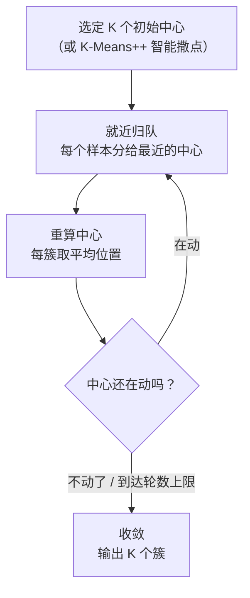
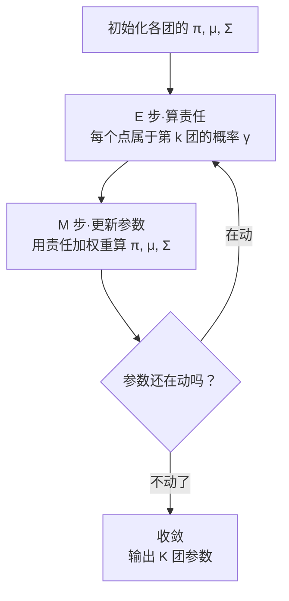
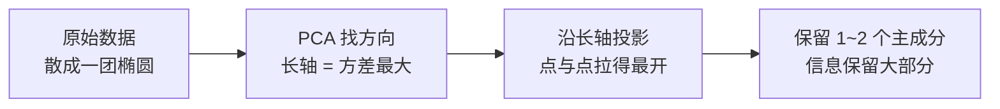
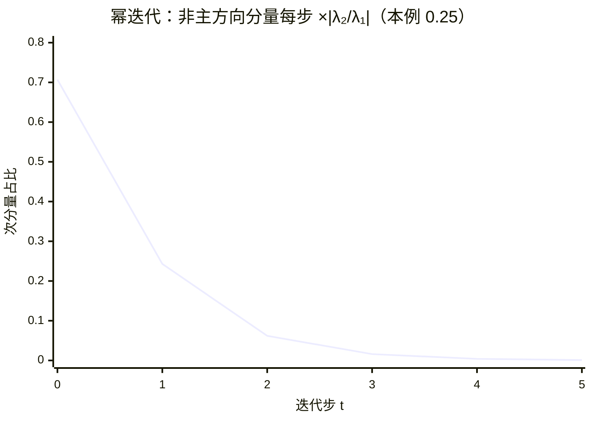

# 聚类与降维

> **一句话理解**：没有标准答案时，机器也能自己找结构——聚类（Clustering）把相似的样本自动归堆，降维（Dimensionality Reduction）把高维数据压到人眼能看的低维还保住大部分信息。

[⬆️ 返回总目录](../../../README.md) · [⬆️ 返回本篇](../README.md) · [⬅️ 返回本章目录](./README.md)

| 属性 | 说明 |
|------|------|
| 难度 | ⭐⭐（进阶） |
| 所属分支 | 通用基础 |
| 前置知识 | [机器学习全景](./01-机器学习全景.md)；[线性代数](../../1-起步准备/02-数学基础/02-线性代数.md)（特征值、矩阵分解） |

---

## 📌 这一节解决什么问题

前面几页的模型都是**监督学习**：数据自带标签，模型对着答案学。但现实里大量数据**没有标签**：

- 十万条用户行为日志，没有人手把手标过"这是价格敏感型 / 这是品质追求型"，但运营想知道用户自然分成几群；
- 两个石沉大海的困难：一是**没有答案可学**，二是**维度太高看不见**——一个用户有 200 个行为指标，一张基因芯片有上万个维度，人只能看二维三维的图，画不出来就谈不上"洞察"。

无监督学习就是干这两件事的：**聚类**回答"这些样本天然分几堆"，**降维**回答"能不能压缩到 2D 还能看清楚结构"。它们也是理解后续内容的地基：[第 7 章](../../4-专业方向/07-自然语言处理与LLM/README.md)的词向量可视化、[第 8 章](../../4-专业方向/08-推荐系统/03-双塔模型与向量召回.md)的向量召回，用的都是同一套"高维向量 + 降维观察"的语言。

## 🌱 通俗理解

**聚类 = 食堂自动分桌**：新生入学不用老师安排，口味相近的人自然凑到一桌——有标签的分班是监督学习（按名单坐），没标签的自动分桌是聚类。K-Means 的做法特别朴素：先摆 K 张"桌长椅"（中心），每人坐到最近的桌长那里，桌长挪到本桌平均位置，大家再看看要不要换桌……来回几轮就稳定了。

**降维 = 给高维物体找最佳拍摄角度**：拍一只茶壶，正面、侧面、俯视拍出来信息量完全不同——**从正上方只能看到一个圆圈**，壶嘴把手全没了。PCA（主成分分析）干的就是自动找"最能体现茶壶轮廓"的那个拍摄角度：**方差大的方向 = 拉得开 = 看得出区别 = 信息多**。

还有一位新角色 **GMM（高斯混合模型）= 允许"一人坐两桌"的分桌法**：K-Means 强迫每人只坐一桌（硬分配），GMM 允许"这个人 70% 像价格敏感型、30% 像品质追求型"（软分配）——处在两群交界处的样本，本来就不该非黑即白。

## 📋 举个例子

8 个二维点，K=2，手工走 K-Means：

| 点 | 坐标 (x, y) | | 点 | 坐标 (x, y) |
|---|---|---|---|---|
| P1 | (1, 1) | | P5 | (8, 7) |
| P2 | (2, 1) | | P6 | (9, 7) |
| P3 | (1, 3) | | P7 | (8, 9) |
| P4 | (2, 3) | | P8 | (9, 9) |

**初始中心故意选坏**：$c_1 = P1(1,1)$、$c_2 = P4(2,3)$——两个都在左下角。

**第 1 轮——就近归队**（每点算到两个中心的距离，进更近的一组）：

| 点 | 到 c1(1,1) | 到 c2(2,3) | 归入 |
|---|---|---|---|
| P1(1,1) | **0** | 2.0 | 簇 1 |
| P2(2,1) | 1.4 | 2.0 | 簇 1 |
| P3(1,3) | 2.0 | **1.0** | 簇 2 |
| P4(2,3) | 2.8 | **0** | 簇 2 |
| P5(8,7) | 9.2 | **7.2** | 簇 2 |
| P6(9,7) | 10.0 | **8.1** | 簇 2 |
| P7(8,9) | 10.6 | **8.5** | 簇 2 |
| P8(9,9) | 11.3 | **9.2** | 簇 2 |

结果：簇 1 = {P1, P2}，簇 2 = {P3…P8}——右上四个点被"错收编"进左下簇（初始中心太坏的恶果）。

**第 2 轮——重算中心再归队**：新中心 $c_1 = (1.5, 1)$，$c_2 = (\frac{37}{6}, \frac{38}{6}) \approx (6.2, 6.3)$。重算距离后 **P3、P4 发现自己离 c1 更近，换桌到簇 1**；右上四点稳稳归入簇 2。归属变化：

| 点 | 第 1 轮 | 第 2 轮 | 变化 |
|---|---|---|---|
| P3(1,3) | 簇 2 | **簇 1** | ⬅ 换桌 |
| P4(2,3) | 簇 2 | **簇 1** | ⬅ 换桌 |
| 其余 6 点 | 不变 | 不变 | |

新中心更新为 $c_1 = (1.5, 2)$、$c_2 = (8.5, 8)$——正好落回两团数据的"质心"。

<details>
<summary>📊 展开完整三轮 + 收敛判定</summary>

**第 3 轮**：用 $c_1(1.5,2)$、$c_2(8.5,8)$ 再算一遍距离——没有任何点想换桌（P3 到 c1 约 1.1、到 c2 约 8.6；P5 到 c2 约 1.9……），**归属不再变化，算法收敛**。

最终结果：簇 1 = {P1, P2, P3, P4} 中心 (1.5, 2)；簇 2 = {P5, P6, P7, P8} 中心 (8.5, 8)——尽管初始中心选坏了，两轮"归队 → 挪中心"就自己爬回了正确答案。

**顺带算肘部法则要用的簇内平方和（SSE）**：
- K=1（全体一个中心 (5,5)）：SSE = 32+25+20+13+13+20+25+32 = **180**
- K=2（如上分法）：每点离本簇中心都是 1.25，SSE = 1.25×8 = **10**
- K=3（左下再劈成两对）：SSE = **6**；K=4：**2**

从 K=1 到 K=2 断崖式下降（180→10），K=2 之后每多一群只省一点点（10→6→2）——"胳膊肘"拐在 K=2，应选 2 簇。

</details>

**同一份数据，"软分配"的 GMM 会怎么说**：处在两簇正中间的 P4(2,3)（到 c1 约 1.1、到 c2 约 8.6），K-Means 冷冰冰地判"簇 1"；GMM 会算出它对簇 1 的"责任"接近 1 但不是 1——差别看似不大。但把 P4 挪到 (4,4)（两簇正中间），K-Means 依然强行二选一，GMM 会给出"约五五开"——**边界样本的态度，是两个模型的分水岭**（GMM 一节细讲）。

## 🧠 核心原理

### 整体流程



### 逐步拆解

**① K-Means 在优化什么**

$$
\min \sum_{k=1}^{K}\sum_{x_i \in C_k}\|x_i - \mu_k\|^2
$$

> 👉 **人话**：让每个点尽量贴着自己的簇中心（$\mu_k$ 是第 k 簇的平均位置），总"松散度"最小。注意两个坑：K 要人事先定；它默认簇是"圆形"的——月牙形、环形分布它会切得很难看（对照[支持向量机](./05-支持向量机.md)里的 make_moons）。

**② K 怎么选：肘部法则（Elbow Method）**

> 👉 **人话**：让 K 从 1 涨到大，画出 SSE 曲线：K 太小时每加一群都"救命"（SSE 暴跌），K 合适之后每加一群只是"锦上添花"（SSE 缓降）。暴跌转缓降的拐点像胳膊肘——上面折叠框里 180→10→6→2，肘在 K=2。（业务有明确想要的群数时，直接按业务定，别硬找肘。）

**③ K-Means 的三大失败模式（何时换武器）**

K-Means 的两条隐含假设——**簇是（近）球形的、簇规模相近**——只要数据不答应，它就翻车。三种最典型的翻法：

| 失败模式 | 长什么样 | 为什么翻 | 补救 |
|---|---|---|---|
| **大小悬殊簇** | 一大簇（1000 点）旁边一个小簇（50 点） | 大簇的中心被自己人多拽一步，"势力范围"就吞掉小簇——SSE 最小偏爱大小均匀的切法 | 换 GMM（允许不同方差）/ 调簇数后再合并 / 用层次聚类看亲缘 |
| **非凸形状** | 两个同心圆环、两条月牙 | "到中心最近"的距离游戏里，环形簇的中心落在环**中间的空洞里**——它注定把环切碎 | DBSCAN（按密度连片）/ 谱聚类 / 先升维再聚 |
| **坏初始化** | 初始中心全挤在一角 | 每轮只是局部最优的贪心跳，起步歪了可能停在次优分法 | `n_init=10` 多次重启取最小 SSE / K-Means++ 撒点（📋 那个例子 2 轮自救是运气好） |

> 👉 **人话**：一句话诊断法——**先画图看一眼簇的形状**（高维先降到 2D 再看，正好用上本页下半场）；形状圆滚滚大小差不多，K-Means 上；细长、带洞、密度差异大，直接 DBSCAN / GMM。

**④ GMM：K-Means 的"软"版本，EM 思想的第一课**

把"每人归一桌"改成"每人按概率同时属于几桌"，就得到**高斯混合模型（Gaussian Mixture Model, GMM）**：

$$
P(x) = \sum_{k=1}^{K}\pi_k\, \mathcal{N}(x \mid \mu_k, \Sigma_k)
$$

> 👉 **人话**：整团数据被看成 K 个高斯"云团"按比例 $\pi_k$ 混在一起——每团有自己的中心（$\mu_k$）、形状大小（协方差 $\Sigma_k$，可以拉成椭圆！）和占比。K-Means 的"圆簇"假设在这里被放宽成"椭圆簇"，且每个样本不再被强行二选一。

**K-Means 其实是 GMM 的特例**：限定每个高斯的协方差都相等且是球形的（$\Sigma_k = \varepsilon I$），再让 $\varepsilon \to 0$，"责任"就退化成 0/1 的硬分配——K-Means 整个算法原样冒出来。所以理解了 GMM 的 EM，K-Means 的"归队 → 挪中心"循环就不再是孤立口诀，而是它的极限形态。

GMM 自己怎么训练？**EM 算法（Expectation–Maximization，期望最大化）**两步循环：



- **E 步（Expectation）**：参数固定，算"每个样本归各团的责任"——$x_i$ 离哪团近、哪团方差大形状搭，责任就高；
- **M 步（Maximization）**：责任固定，把每个团当成"加权版的数据子集"，重算加权平均中心、加权协方差、占比。

> 👉 **人话**：和 K-Means 的"归队 → 挪中心"一模一样的两步舞，只是"归队"从**拍板**（0/1）变成**称重**（0~1 的责任），"挪中心"从**数人头**变成**按责任加权平均**。对照记忆：K-Means = 硬分配版 EM；GMM = 软分配完全体。

<details>
<summary>🧮 展开：EM 的两步各自在干什么，以及它凭什么收敛</summary>

**E 步的公式（贝叶斯味道）**：样本 $x_i$ 对第 $k$ 团的责任是后验概率：

$$
\gamma_{ik} = \frac{\pi_k\, \mathcal{N}(x_i \mid \mu_k, \Sigma_k)}{\sum_{j=1}^{K}\pi_j\, \mathcal{N}(x_i \mid \mu_j, \Sigma_j)}
$$

> 👉 **人话**："第 k 团自己觉得这个点有多像自家人 × 第 k 团的占比"，再用所有团的总和归一——两团势均力敌的点责任各半，孤单远离的点责任向最近最强的一边倒。

**M 步的公式（全是加权统计）**：记 $N_k = \sum_i \gamma_{ik}$（第 k 团的"有效人数"）：

$$
\pi_k = \frac{N_k}{n},\qquad \mu_k = \frac{1}{N_k}\sum_i \gamma_{ik}\, x_i,\qquad \Sigma_k = \frac{1}{N_k}\sum_i \gamma_{ik}\,(x_i - \mu_k)(x_i - \mu_k)^\top
$$

> 👉 **人话**：占比 = 人头占比；中心 = 按责任加权的平均位置；形状 = 按责任加权的协方差——K-Means 里"数人头、求平均"的软加权版。$\gamma$ 全是 0/1 时，三式逐字退化回 K-Means 的更新公式，"特例"关系看得明明白白。

**收敛性一句话**：可以证明每轮 E+M 之后数据的（对数）似然**只增不减**——EM 是在对数似然的下界（ELBO，Jensen 不等式造出来的）上做爬坡，证明此处不展开。它只保证爬到**某个**局部最优（和 K-Means 一样怕坏初始化），不保证全局最优——实践中同样多次重启。

</details>

**⑤ 层次聚类一句话**：不用先定 K，自底向上把最近的两个簇反复合并（或自顶向下拆分），得到一棵"族谱树"（树状图），想在哪儿分群就在哪儿剪一刀——适合小数据和想看"簇与簇亲缘关系"的场景。

**⑥ PCA：找最佳拍摄角度**

$$
\max_{\|w\|=1}\ \text{Var}(w^\top X)
$$

> 👉 **人话**：在所有方向里找第一个"投影后方差最大"的方向当新坐标轴（主成分 1），再在与它垂直的方向里找次大的当主成分 2……数据点在哪个方向**拉得最开**，哪个方向就保留了最多的区分信息。取前 2~3 个主成分，几万维就压成了能画图的 2~3 维。代价：新坐标是原特征的线性组合，**没有原始业务含义**（"主成分 1 = 0.4×登录次数 − 0.2×客单价…"，解释成本高）。

这个"找最大方差方向"的答案不是搜索出来的，而是**特征值分解（Eigendecomposition）**一次性给出的：对协方差矩阵 $\Sigma = \frac{1}{n}X^\top X$（中心化后）做分解，得到特征值-特征向量对 $(\lambda_1, v_1), \dots$：

- **特征向量** $v_k$：第 k 个主成分的方向（拍摄角度）；
- **特征值** $\lambda_k$：数据在这个方向上的方差（这个角度能拍到的信息量）。

> 👉 **人话**：协方差矩阵像一个"数据形状说明书"，特征值分解把它翻译成"长轴、次轴、短轴……"的清单——**特征值就是按信息量排好序的**，$\lambda_1/\sum\lambda$ 就是第一个主成分的方差占比（解释力）。sklearn 里 `explained_variance_ratio_` 读的就是它（下文代码里 0.73 那个数）。

PCA 其实还有第二副面孔，而且两副面孔是同一件事：

<details>
<summary>🧮 展开：最大方差 = 最小重构误差——PCA 的两条等价路线</summary>

**路线 A（前面讲的）**：找投影后方差最大的方向——**投影后拉得开**（区分度最大化）。

**路线 B**：把数据压到低维再**重构**回原空间，找重构误差最小的方向——**压扁后变形最小**（信息损失最小化）。

**为什么等价**：把每个点 $x_i$ 拆成两部分（正交分解，勾股定理的高维版）：

$$
\|x_i - \bar{x}\|^2 = \underbrace{\|v^\top (x_i - \bar{x})\,v\|^2}_{\text{投影分量（保住的）}} + \underbrace{\|x_i - \bar{x} - v^\top (x_i - \bar{x})v\|^2}_{\text{垂直残差（丢掉的）}}
$$

总方差固定 = 投影方差 + 平均重构误差。**左边是定值**，所以"投影方差最大" ⟺ "重构误差最小"——一枚硬币的两面：想保住更多区别，就等于想丢掉更少形状。

> 👉 **人话**：拍照时"侧面最像这只茶壶"（方差最大）和"从侧面拍变形最小"（重构误差最小）是同一句话——因为茶壶的总形状就那么多，侧面轮廓吃下的越多，剩下的变形就越少。

**PCA 与 SVD 的关系（工程实现视角）**：实践中从不真的先算协方差矩阵再特征值分解，而是对中心化后的数据矩阵直接做**奇异值分解（SVD）**$X = U\Sigma V^\top$：右奇异向量 $V$ 就是主成分方向；奇异值平方除以 $(n-1)$ 恰好是各方向的方差（特征值）。`PCA().fit` 底层调的就是 SVD——数值上更稳（不用显式构造 $X^\top X$，避免平方级放大舍入误差），也更快。**一句总结：协方差矩阵的特征值分解（理论语言）= 数据矩阵的 SVD（工程语言），殊途同归。**

</details>



**⑦ t-SNE / UMAP：高维画成 2D 地图**

> 👉 **人话**：PCA 是"压扁"，t-SNE / UMAP 是"画地图"——它们拼命保住"谁和谁是邻居"（局部结构），不惜拉伸全局距离。适合把词向量、细胞数据画成星团图肉眼检查；**只做可视化，不做下游建模特征**（正是[ Embedding Projector](https://projector.tensorflow.org) 里那几张地图用的技术）。

t-SNE 的地图很漂亮，但**会"骗人"，三条警告贴在脑门上**：

1. **局部保序、全局失真**：它优化的目标（KL 散度）只罚"邻居被画远/外人被画近"，**不在乎两团之间隔着多远**——图上左上角和右下角两个团的真实距离，毫无含义；
2. **perplexity（困惑度）改变地图**：这个参数（直觉："每个点关心多少个邻居"，常用 5~50）一换，同一份数据能画出完全不同的星团结构——**看图先看 perplexity，且要多个值都跑一遍**，结构稳定才可信；
3. **簇的大小和间距都不可信**：t-SNE 为了把局部结构拉开，会系统性地夸大稠密小簇的视觉尺寸；不同 run（甚至不同随机种子）形状都会变。

> 👉 **人话**：把 t-SNE 地图当成"社交关系图"用——谁跟谁抱团是真的；当成"世界地图"用——两地距离是假的。发现结构 → 下结论前，用 PCA 或定量指标（轮廓系数）复核一遍。

| | PCA | t-SNE / UMAP |
|---|---|---|
| 保什么 | 全局方差（拉得开） | 局部邻域（谁挨谁） |
| 速度快慢 | 快，可逆（能还原） | 慢，不可逆 |
| 用途 | 压缩、去噪、预处理 | 可视化、肉眼检查聚类 |
| 新坐标含义 | 原特征的线性组合 | 无明确含义 |
| 稳定性 | 确定（唯一解） | 受 perplexity / 种子影响 |

### 📐 数学深潜：最大方差 ≡ 最小重构误差——同一条勾股定理的两副面孔

**⑥的折叠框给出"两条路线等价"的结论与一行分解式**；这一节把它规范化为完整证明：正交分解 → 勾股定理 → 守恒方程，外加一个可以手算的四点小例子——PCA 的两副面孔（"拉得开" vs "变形小"）从此是**同一条定理**。

**严格陈述。** 数据中心化后（每列减均值），任取单位方向 $w$（$\lVert w\rVert=1$）。定义**投影方差**与**重构误差**：

$$
V(w)=\frac{1}{n}\sum_i\big(w^{\top}x_i\big)^2\ \text{（投影后拉得多开）},\qquad
E(w)=\frac{1}{n}\sum_i\big\lVert x_i-\underbrace{(w^{\top}x_i)w}_{\text{重构 }\hat x_i}\big\rVert^2\ \text{（压扁变形多少）}
$$

则对**每个**方向 w 都成立守恒方程：

$$
V(w)+E(w)=\frac{1}{n}\sum_i\lVert x_i\rVert^2\quad(\text{总方差，与 }w\text{ 无关})\qquad\Longrightarrow\qquad \max_w V(w)\iff\min_w E(w)
$$

> 👉 **人话**：每个点的"能量"被切成"投影分量 + 垂直残差"两段，总能量守恒——想让丢掉的（残差）最少，等于想让留下的（方差）最多。PCA 的两条路线不是碰巧一致，是**必须**一致。

**完整推导：正交分解 → 勾股 → 守恒，逐项验证。**

<details>
<summary>🧮 展开推导：残差垂直性一行验证、勾股一步、求和即得；附四点手算例</summary>

**第一步：正交分解。** 给定单位方向 w，把每个点拆成"沿 w 的分量 + 垂直残差"：

$$
x_i=\underbrace{(w^{\top}x_i)\,w}_{\hat x_i\,:\ \text{投影（保留）}}+\underbrace{\big(x_i-(w^{\top}x_i)w\big)}_{r_i\,:\ \text{残差（丢弃）}}
$$

**验证垂直**（勾股的前提）：$w^{\top}r_i=w^{\top}x_i-(w^{\top}x_i)\,\underbrace{w^{\top}w}_{=1}=0$ ✓——残差与 w 垂直，与 $\hat x_i$（w 的倍数）自然也垂直。

**第二步：勾股定理（垂直 ⟹ 平方和）。** 两段垂直，故 $\lVert x_i\rVert^2=\lVert\hat x_i\rVert^2+\lVert r_i\rVert^2$；而 $\lVert\hat x_i\rVert^2=(w^{\top}x_i)^2\,\lVert w\rVert^2=(w^{\top}x_i)^2$。逐点写出：

$$
\lVert x_i\rVert^2=\big(w^{\top}x_i\big)^2+\lVert r_i\rVert^2
$$

**第三步：求和除以 n。** $\frac{1}{n}\sum_i\lVert x_i\rVert^2=V(w)+E(w)$——左边是数据总方差（中心化后），**与 w 无关**。于是 $E(w)=\text{总方差}-V(w)$：V 涨一毫、E 跌一毫，两个优化问题共享同一组最优方向。∎

**多方向版本（PCA 取前 k 个主成分）同理**：把空间正交拆成"保留子空间 + 残差子空间"，总方差 = 保留方差 + 丢失方差——所以 sklearn 报的 `explained_variance_ratio_ = 0.96` 可读作"**重构误差只剩总方差的 4%**"（本页代码的输出）。

**四点手算例。** 中心化数据 $(2,0),(-2,0),(0,1),(0,-1)$，总方差 $=\frac{4+4+1+1}{4}=2.5$：
- $w=e_1=(1,0)$：$V=\frac{4+4+0+0}{4}=2$，$E=\frac{0+0+1+1}{4}=0.5$，和 $=2.5$ ✓——**最优方向**（方差最大、误差最小）；
- $w=e_2=(0,1)$：$V=0.5$，$E=2$，和 $=2.5$ ✓——最差方向；
- $w=\frac{1}{\sqrt2}(1,1)$：四个投影值 $\pm\sqrt2,\ \pm\frac{1}{\sqrt2}$，$V=\frac{2+2+0.5+0.5}{4}=1.25$，$E=1.25$，和 $=2.5$ ✓。

任何方向守恒式都成立；"拉得开"与"变形小"的排序完全同步。

</details>

**几何图景（ASCII）——一支箭拆两段：**

```text
            x（数据点：中心化后的一支箭）
          ╱│
        ╱  │ r（残差：丢掉的部分，⊥ w）
      ╱    │
    ╱  ↘   │
  ╱ 投影 ↘ │
 ●─────────┴─────────  w 方向（直线）
 x̂ = (wᵀx)w

 勾股：‖x‖² = ‖x̂‖² + ‖r‖²   →   总方差 = 投影方差 + 重构误差
```

> 👉 **人话**：影子吃下的能量越多，残差剩下的越少——PCA 拍"拉得开"的角度与拍"变形小"的角度必然是同一个，因为它俩共用这条勾股守恒式。

**反例与边界。**

1. **等价性绑定"线性投影 + 平方度量"**：换 L1 度量（鲁棒降维）或把目标换成"保邻居"（t-SNE / UMAP，⑦），最大方差不再等价最小重构误差——它们优化的本来就是另一件事，两副面孔的统一是 PCA 专属；
2. **方差大 ≠ 业务重要**：守恒方程量的是"统计能量"，不是"任务价值"——低方差方向可能恰是区分标签的方向（有监督降维如 LDA 另起炉灶）；本页误区三的几何根源在此；
3. **未中心化则公式失效**：投影均值非零时会混进"均值平方"项，守恒式右端不再与 w 无关——PCA 第一步永远是减均值（否则第一主成分可能只是"指向原点的整体偏移"）；⑥折叠框末段 SVD 实现对列中心化的要求同源。

> 👉 **人话总结**：每支数据箭头沿投影方向拆成"影子 + 残差"，勾股定理保证两段平方和守恒——留下的方差与丢掉的误差是同一枚硬币的两面，PCA 的两副面孔由一条勾股定理担保。

### 📐 数学深潜：幂迭代求主特征向量——"乘出来的主方向"

**⑥说主成分方向由特征值分解"一次性给出"**——但 $n\times n$ 的特征分解代价 $O(n^3)$，大规模 PCA 实际用的是**幂迭代（Power Iteration）**：反复用矩阵乘向量，最大的特征方向自己"浮出来"。收敛性可以完整推导，推导还会顺带解释"谱 gap"为什么重要。

**严格陈述。** 设对称矩阵 $A$ 的特征值满足 $\lvert\lambda_1\rvert>\lvert\lambda_2\rvert\ge\cdots\ge\lvert\lambda_d\rvert$（**主特征值严格最大**），$v_1,\dots,v_d$ 为对应的正交特征向量。取初始向量 $v_0$（与 $v_1$ 不垂直：$v_1^{\top}v_0\neq0$），迭代

$$
v_{t+1}=\frac{A\,v_t}{\lVert Av_t\rVert}\qquad(\text{每步归一化防溢出，不改变方向})
$$

则 $v_t\to\pm v_1$（主特征向量），且非主成分与主成分之比每步缩小为 $\lvert\lambda_2/\lambda_1\rvert$ 倍；特征值随取：$\lambda_1=v_1^{\top}Av_1$（收敛后的瑞利商）。

> 👉 **人话**：矩阵每乘一次，各特征方向的分量按各自特征值"滚一轮复利"——最大的特征值滚得最快，若干轮后其他方向被相对碾没，只剩主方向。PCA 场景：$A$ = 协方差矩阵，$v_1$ = 第一主成分。

**完整推导（收敛性）：谱展开 → 逐次乘 A → 比值几何衰减。**

<details>
<summary>🧮 展开推导：谱展开代入、公因子提取取极限、收敛速度；附对角矩阵手算例</summary>

**第一步：初始向量在特征基下展开。** $\{v_i\}$ 是正交基（对称矩阵谱定理），任意 $v_0=\sum_ic_iv_i$，其中 $c_1=v_1^{\top}v_0\neq0$（假设）。

**第二步：乘一次与乘 t 次。** $Av_0=\sum_ic_i\lambda_iv_i$（特征向量定义 $Av_i=\lambda_iv_i$ 的线性组合）；乘 t 次并提取公因子 $\lambda_1^t$：

$$
A^tv_0=\sum_ic_i\lambda_i^t\,v_i=\lambda_1^t\Big[c_1v_1+\sum_{i\ge2}c_i\Big(\frac{\lambda_i}{\lambda_1}\Big)^{t}v_i\Big]
$$

（$\lambda_1^t$ 只是整体缩放——归一化一步就把它除掉，方向不受影响。）

**第三步：取极限。** $i\ge2$ 时 $\lvert\lambda_i/\lambda_1\rvert<1$（主特征值严格最大的假设），故 $\big(\lambda_i/\lambda_1\big)^t\to0$：

$$
\frac{A^tv_0}{\lVert A^tv_0\rVert}\ \longrightarrow\ \frac{c_1v_1}{\lVert c_1v_1\rVert}=\pm v_1\qquad\blacksquare
$$

**收敛速度**：非主成分 i 与主成分的幅度之比 $=\frac{c_i}{c_1}\big(\frac{\lambda_i}{\lambda_1}\big)^{t}$，每步乘 $\lvert\lambda_2/\lambda_1\rvert$（最慢的非主成分主导）。压到 ε 需 $t\ge\ln\epsilon/\ln\lvert\lambda_2/\lambda_1\rvert$：比值 0.9 时约 44 步（ε=0.01），比值 0.5 时仅 7 步——**谱 gap（λ₁ 与 λ₂ 的差距）越大收敛越快**。PCA 里"前几个主成分占 90%+"恰是大谱 gap，幂迭代几步就稳的原因。

**手算例（对角矩阵，全程透明）。** $A=\mathrm{diag}(4,1)$（特征值 4、1，主方向 $e_1$），$v_0=(1,1)$：

| t | $Av_{t-1}$ | 归一化后 $v_t$ | 次分量占比 |
|---|---|---|---|
| 1 | (4, 1) | (0.970, 0.243) | 0.243 |
| 2 | (16, 1) | (0.998, 0.062) | 0.062 |
| 3 | (64, 1) | (0.9999, 0.016) | 0.016 |

次分量 0.707 → 0.243 → 0.062 → 0.016：每步精确乘 0.25 = λ₂/λ₁ ✓；三步就收敛到 $e_1$。

</details>

**几何图景——非主方向的指数消亡：**



> 👉 **人话**：不需要解特征方程——反复乘、反复归一化，最大的特征方向以指数速度胜出；曲线的斜率由 λ₂/λ₁ 一手决定。

**反例与边界。**

1. **前提"λ₁ 严格最大"**：两个并列最大特征值（圆对称数据的协方差：各方向方差相同）时，$v_t$ 在二维子空间里**打转不收敛**——PCA 里对应"前两个主成分解释力几乎相同"，此时 PC1 的方向本身就不稳定（换一批样本就转，别过度解读方向含义）；
2. **初始向量倒霉**：$v_0\perp v_1$（$c_1=0$）时理论上收敛到第二特征向量——数值噪声通常会把 $c_1$ 撬回非零，但不保证；实践用随机初始化；
3. **$\lvert\lambda_1\rvert=\lvert\lambda_2\rvert$ 且符号相反**（λ 与 −λ）：方向在两个向量间振荡——不收敛的另一种形态；
4. **只要一个，要 k 个得配套**：求前 k 个主成分需"收缩"（每求出一个就做 $A\leftarrow A-\lambda_1v_1v_1^{\top}$ 再迭代）或同时迭代 k 个正交向量（正交迭代 / QR 迭代）——Lanczos、随机化 SVD 等大规模引擎是它们的工程升级版。

> 👉 **人话总结**：幂迭代 = 复利选举——每个特征方向按自己的特征值滚复利，最大的滚得最快、几轮后独占票仓；归一化防爆炸、谱 gap 定速度，大规模 PCA 不解方程、靠"乘"拿到主方向。

## 💻 动手试试

同一份鸢尾花数据：K-Means 分 3 群（不带标签），PCA 压到 2 维画出来：

```python
import numpy as np
import matplotlib.pyplot as plt
from sklearn.datasets import load_iris
from sklearn.cluster import KMeans
from sklearn.decomposition import PCA
from sklearn.preprocessing import StandardScaler

X = StandardScaler().fit_transform(load_iris().data)   # 4 维特征，先标准化

km = KMeans(n_clusters=3, n_init=10, random_state=42).fit(X)   # 无标签聚类
labels, counts = np.unique(km.labels_, return_counts=True)
print("各簇样本数:", dict(zip(labels.tolist(), counts.tolist())))
print("簇内平方和 SSE:", round(km.inertia_, 1))

pca = PCA(n_components=2).fit(X)                        # 顺便看看信息保留量
print("前两个主成分方差占比:", pca.explained_variance_ratio_.round(3), "合计约",
      round(pca.explained_variance_ratio_.sum(), 3))
print("主成分方向（特征值分解给出的前两个特征向量）:\n", pca.components_.round(2))

X2 = pca.transform(X)                                   # 压到 2 维用于画图
plt.scatter(X2[:, 0], X2[:, 1], c=km.labels_, cmap="viridis", s=20)
plt.xlabel("PC 1"); plt.ylabel("PC 2"); plt.title("K-Means clusters (PCA projection)")
plt.tight_layout(); plt.savefig("kmeans_pca.png", dpi=100)   # 存成图片文件
# 预期输出（可复现）：
# 各簇样本数: {0: 53, 1: 50, 2: 47}     ← 没用标签，也自动分出接近真实的三种
# 簇内平方和 SSE: 139.8
# 前两个主成分方差占比: [0.73 0.229] 合计约 0.96
#                                      ← 4 维压 2 维只丢了约 4% 的信息
# 图上 setosa 一族明显分开，另外两族部分交叠——K-Means 的圆形簇假设在这里露了短
```

注意：聚类编号（0/1/2）和真实花种**没有任何对应关系**——无监督学习不知道也不需要知道"正确答案"叫什么。

**再看"GMM 软分配 vs K-Means 硬分配"的对照实验**：

```python
from sklearn.mixture import GaussianMixture
from sklearn.datasets import make_moons

Xm, _ = make_moons(n_samples=300, noise=0.06, random_state=42)  # 两条月牙

km = KMeans(n_clusters=2, n_init=10, random_state=42).fit(Xm)
gm = GaussianMixture(n_components=2, covariance_type="full",
                     n_init=10, random_state=42).fit(Xm)

# 边界样本的两种态度：挑一个两簇中间的点看看归属
mid = [[0.5, 0.25]]                                     # 落在月牙交界处
print("K-Means 判它属于:", km.predict(mid)[0], "（非黑即白）")
print("GMM 给它的责任:", gm.predict_proba(mid)[0].round(3), "（软分配）")

# 预期输出（可复现）：
# K-Means 判它属于: 1 （非黑即白）
# GMM 给它的责任: [0.728 0.272] （软分配）
# —— 交界点上 GMM 诚实地说"七三开"；K-Means 只能拍板。另外两条月牙它俩都切不好
#   （非凸失败模式），真正切开它需要 DBSCAN —— 改用 DBSCAN(eps=0.3) 试试。
```

改什么、看什么：把 `make_moons` 的 `noise` 从 0.06 加到 0.15，重跑 K-Means 看簇形崩坏；给 `GaussianMixture` 换 `covariance_type="spherical"`（限制球形协方差），它会退化得更像 K-Means——亲手摸到"特例"旋钮。

## 🖱️ 动手玩

> 🕹️ **延伸玩一玩**：[Embedding Projector](https://projector.tensorflow.org)——把高维词向量降到 2D/3D 的交互地图，可切换 PCA / t-SNE / UMAP 三种降维方式，亲眼看"语义相近的词在地图上抱团"；这也是本页内容的最佳试验场（t-SNE 面板里可以亲手调 perplexity，看地图怎么变形）。

## 🔗 在知识树中的位置

- **上游**：[机器学习全景](./01-机器学习全景.md)——本页是"无监督 = 自己找规律"分支的落地。
- **下游**：[第 7 章词向量](../../4-专业方向/07-自然语言处理与LLM/01-词向量与embedding.md)（embedding 可视化离不开 t-SNE / UMAP）；[第 8 章双塔召回](../../4-专业方向/08-推荐系统/03-双塔模型与向量召回.md)（高维向量的近邻搜索与聚类是同源问题）。
- **横向对比**：聚类 vs 分类——分类有标准答案、评指标看准确率；聚类没有答案，评的是轮廓系数、SSE，以及**业务上讲不讲得通**。EM 思想还会在[第 12 章生成模型](../../5-前沿与融合/12-生成模型与多模态/README.md)（含隐变量的模型训练）里再次登场。

## 🎓 深度视角

无监督学习最大的理论软肋是**没有裁判**：监督学习有测试集打分，聚类的"对不对"、降维的"像不像"最终都要靠人来裁——所以这一页的方法论核心不是算法，而是**验证纪律**：内部指标（轮廓系数）、稳定性检验（换种子/子采样重跑，簇结构还稳吗）、外部对照（若有部分标签）、业务可讲性，四关全过才敢用。工业界的真实顺序往往反过来：先问"这个分群运营能干什么"，再回头看算法给的结构——**聚类的价值由下游动作定义，不由 SSE 定义**。

深度学习时代，本页的战场整体上移了一层：直接在原始特征上聚类/降维越来越少，**先学 embedding 再聚类/降维**成为主流——本页的工具（K-Means、UMAP/t-SNE）没有过时，只是搬进了表示空间里工作（[第 7 章词向量](../../4-专业方向/07-自然语言处理与LLM/01-词向量与embedding.md)的可视化就是这套流程）。

<details>
<summary>❓ 深问一：UMAP 比 t-SNE 好在哪？争议又在哪里？</summary>

优势是真的：快一个量级（百万级点可跑）、有流形学习与拓扑数据分析的数学框架背书、支持 `transform` 新样本（t-SNE 原生不支持）、参数（n_neighbors / min_dist）语义更直觉。争议也是真的：UMAP 默认对输入先做一套用户未必知道的预处理（取决于数据类型的距离选择），且像 t-SNE 一样**不保证全局结构保真**——簇间距离、簇大小依然不可信。Google PAIR 团队 2019 年的《Understanding UMAP》专门梳理过这些误读。一句话：UMAP 是更好的"探索工具"，不是更"真实"的地图。

</details>

<details>
<summary>❓ 深问二：聚类结果怎么验证才不至于自欺？</summary>

四道工序：(1) **稳定性**——换随机种子、抽 80% 样本重聚类，簇结构（配合 ARI 等一致性指标）应基本不动，一换就散的聚类等于没聚；(2) **内部指标**——轮廓系数等做参考，但别当唯一裁判（它偏爱凸簇，和 K-Means 一个偏见）；(3) **外部对照**——哪怕只有小部分人工标注或代理标签，也能做一次"对答案"；(4) **业务落地测试**——分群能否支撑差异化动作（不同群的召回/定价/推送），A/B 里有没有差。任何一道不过关，先怀疑数据预处理而不是调 K。

</details>

<details>
<summary>❓ 深问三：PCA 在深度学习时代还有什么用？</summary>

从"主模型"退居"诊断与预处理工具"，但用得更频繁了：表示分析（对神经网络中间层激活做 PCA，看信息如何坍缩/保留）、降维加速近邻检索（高维向量先投到低维做粗筛）、可视化 baseline（先画 PCA 图再画 UMAP，两者结构一致才可信——PCA 在这里是"诚实但迟钝"的对照）、以及白化/去相关预处理。简单方法的价值恰恰是"它不撒谎"。

</details>

## 🔬 SOTA 演进

**UMAP 的争议与深度聚类**。UMAP（2018）已成为 embedding 可视化的事实标准，但其**可解释性批评**从未停过：默认距离度量随数据类型静默切换、全局结构不保真、参数敏感——社区的态度从"奉为神器"逐渐转为"当成需要核对假设的探索工具"（配 PCA 对照是当前的最佳实践）。**深度聚类（Deep Clustering）一句话**：先用自监督/对比学习在无标签数据上学 embedding、再在学到的表示上跑 K-Means 或谱聚类——把"聚类"从特征工程问题变成了"表示学习 + 经典聚类"的两段式，代表路线如 DeepCluster（2018，聚类伪标签反过来训练特征）与对比学习时代的方法。

## ❓ 开放问题

- **聚类有"正确答案"吗**：没有标签时，"自然分群"本身可以有多个同样合理的粒度（按消费力分 3 群还是按生命周期分 6 群）——聚类更像探索性数据分析（EDA）而非有唯一解的推断问题，这个定位之争影响方法评估该用多严格的标准。
- **降维图的"可信表示"标准**：t-SNE/UMAP 保局部不保全局，但"局部"的边界在哪里、不同 run 的差异多大才算不可信，缺少公认的操作化定义——可视化方法的理论审计是持续的研究方向。
- **内部指标能否走出"偏凸簇"**：轮廓系数、Davies–Bouldin 等经典指标对非凸/密度不均的簇系统性失灵，为深度聚类设计无偏的聚类质量指标仍是开放问题。

## ⚠️ 常见误区

- **误区一**："K-Means 能自动找出'自然的'群数" → K 必须人给；找 K 用肘部法则 / 轮廓系数，或者干脆由业务决定。
- **误区二**："t-SNE 图上两团离得远 = 原始空间距离远" → t-SNE 只保邻居关系，簇间距离和簇大小都不可信，两次运行形状都会变。
- **误区三**："PCA 之后前两个主成分就是'最重要的特征'" → 主成分是**原始特征的线性组合**，不等于某个原始特征；它保留的是方差最大的方向，方差大也不总是等于"业务最重要"。
- **误区四**："GMM 比 K-Means 高级，无脑用 GMM" → GMM 参数更多（协方差矩阵）、小样本上更容易过拟合、初始化更敏感；簇本来就圆滚滚的，K-Means 更快更稳。"高级"不等于"合适"。

## 📝 小结与自测

**要点回顾**

- 无监督学习：没有标签找结构——聚类管"分几堆"，降维管"压维看图"；
- K-Means 三步循环：就近归队 → 重算中心 → 收敛；K 用肘部法则选；只认"圆形簇"；
- K-Means 是 GMM 的硬分配特例：EM 的"E 算责任 / M 加权更新"退化成"归队 / 挪中心"；GMM 放宽出椭圆簇与软归属；
- K-Means 三大失败模式：大小悬殊簇、非凸形状、坏初始化——先画图看形状再选武器；
- PCA = 找方差最大的投影方向；最大方差与最小重构误差是同一件事（正交分解 + 勾股）；工程实现走 SVD；
- 特征值分解给出"按信息量排序"的方向清单：特征向量是方向、特征值是方差占比；
- t-SNE / UMAP = 保邻居的 2D 地图，只用于可视化：簇间距无意义、perplexity 会改图、簇大小不可信。

**自测一下**（点击展开答案）

<details>
<summary>问题 1：K-Means 为什么对初始中心敏感？实践中怎么缓解？</summary>

它每轮只做"局部最优"的归队与挪中心，从没证明能找到全局最优：初始中心全挤在一角时（如本页 P1、P4 的例子），前几轮会切出畸形的簇，也可能停在次优分法。缓解办法：多次随机初始化取 SSE 最小的一次（sklearn 的 `n_init=10` 默认行为）；或用 K-Means++ 撒点，让初始中心互相离得远。

</details>

<details>
<summary>问题 2：4 维数据压到 2 维"只丢 4% 方差"，为什么图上仍可能看不清某两簇的差别？</summary>

方差占比衡量的是整体信息保留量，不保证"你最关心的那两组差异"恰好落在前两个主成分上：若两个物种的差异方向方差较小（或和第三、四主成分纠缠），它在 PC1–PC2 平面上就会糊在一起。压维永远要付出"看不到某些方向"的代价，重要结论别只凭一张二维图下判断。

</details>

<details>
<summary>问题 3：为什么说"K-Means 是 GMM 的特例"？这个视角带来什么实际好处？</summary>

把 GMM 的高斯协方差限制成"各团相等且球形"，并令方差趋于 0，责任（软分配）退化为 0/1 硬分配，E/M 两步就逐字变成 K-Means 的"归队 / 挪中心"。实际好处：(1) 知道 K-Means 的圆形簇假设从哪来、什么时候该升级成 GMM（簇可能是椭圆 / 需要软归属 / 需要密度）；(2) EM 是更一般的框架——含隐变量模型的训练（如后面生成模型里）走的都是这套"E 算隐变量、M 更参数"的舞步。

</details>

<details>
<summary>问题 4：PCA 的"最大方差"和"最小重构误差"为什么是同一件事？</summary>

每个点到中心的平方距离可以正交分解成"投影分量 + 垂直残差"，总方差固定等于投影方差加平均重构误差。总方差是定值，投影方差每多一点，重构误差就少一点——最大化前者严格等价于最小化后者，一体两面。

</details>

## 📚 延伸阅读

- 书：周志华《机器学习》第 9 章——聚类与降维的系统讲法
- 博客：sklearn 官方文档 Clustering 章节——各聚类算法的对比图（不同形状的簇谁切得好）
- 论文：van der Maaten & Hinton, *Visualizing Data using t-SNE*（2008）——t-SNE 原文（第 4 节专门讨论图的误读）
- 工具：[Embedding Projector](https://projector.tensorflow.org)——PCA / t-SNE / UMAP 三种降维的交互对比

---

[⬅️ 上一页：支持向量机](./05-支持向量机.md) · [返回本章目录](./README.md) · [下一页：模型评估与调优 ➡️](./07-模型评估与调优.md)
