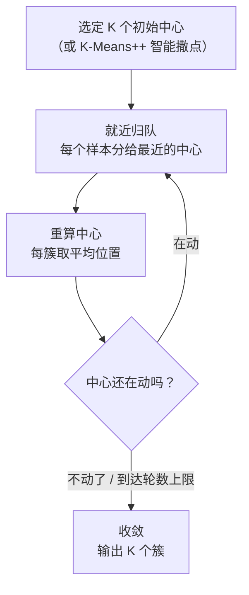
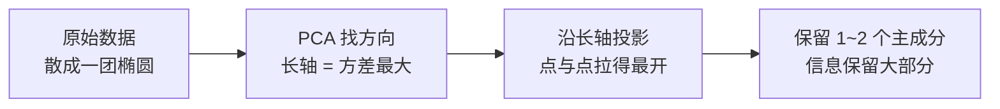

# 聚类与降维

> **一句话理解**：没有标准答案时，机器也能自己找结构——聚类（Clustering）把相似的样本自动归堆，降维（Dimensionality Reduction）把高维数据压到人眼能看的低维还保住大部分信息。

[⬆️ 返回总目录](../../../README.md) · [⬆️ 返回本篇](../README.md) · [⬅️ 返回本章目录](./README.md)

| 属性 | 说明 |
|------|------|
| 难度 | ⭐⭐（进阶） |
| 所属分支 | 通用基础 |
| 前置知识 | [机器学习全景](./01-机器学习全景.md)；[线性代数](../../1-起步准备/02-数学基础/02-线性代数.md) |

---

## 📌 这一节解决什么问题

前面几页的模型都是**监督学习**：数据自带标签，模型对着答案学。但现实里大量数据**没有标签**：

- 十万条用户行为日志，没有人手把手标过"这是价格敏感型 / 这是品质追求型"，但运营想知道用户自然分成几群；
- 两个石沉大海的困难：一是**没有答案可学**，二是**维度太高看不见**——一个用户有 200 个行为指标，一张基因芯片有上万个维度，人只能看二维三维的图，画不出来就谈不上"洞察"。

无监督学习就是干这两件事的：**聚类**回答"这些样本天然分几堆"，**降维**回答"能不能压缩到 2D 还能看清楚结构"。它们也是理解后续内容的地基：[第 7 章](../../4-专业方向/07-自然语言处理与LLM/README.md)的词向量可视化、[第 8 章](../../4-专业方向/08-推荐系统/03-双塔模型与向量召回.md)的向量召回，用的都是同一套"高维向量 + 降维观察"的语言。

## 🌱 通俗理解

**聚类 = 食堂自动分桌**：新生入学不用老师安排，口味相近的人自然凑到一桌——有标签的分班是监督学习（按名单坐），没标签的自动分桌是聚类。K-Means 的做法特别朴素：先摆 K 张"桌长椅"（中心），每人坐到最近的桌长那里，桌长挪到本桌平均位置，大家再看看要不要换桌……来回几轮就稳定了。

**降维 = 给高维物体找最佳拍摄角度**：拍一只茶壶，正面、侧面、俯视拍出来信息量完全不同——**从正上方只能看到一个圆圈**，壶嘴把手全没了。PCA（主成分分析）干的就是自动找"最能体现茶壶轮廓"的那个拍摄角度：**方差大的方向 = 拉得开 = 看得出区别 = 信息多**。

## 📋 举个例子

8 个二维点，K=2，手工走 K-Means：

| 点 | 坐标 (x, y) | | 点 | 坐标 (x, y) |
|---|---|---|---|---|
| P1 | (1, 1) | | P5 | (8, 7) |
| P2 | (2, 1) | | P6 | (9, 7) |
| P3 | (1, 3) | | P7 | (8, 9) |
| P4 | (2, 3) | | P8 | (9, 9) |

**初始中心故意选坏**：$c_1 = P1(1,1)$、$c_2 = P4(2,3)$——两个都在左下角。

**第 1 轮——就近归队**（每点算到两个中心的距离，进更近的一组）：

| 点 | 到 c1(1,1) | 到 c2(2,3) | 归入 |
|---|---|---|---|
| P1(1,1) | **0** | 2.0 | 簇 1 |
| P2(2,1) | 1.4 | 2.0 | 簇 1 |
| P3(1,3) | 2.0 | **1.0** | 簇 2 |
| P4(2,3) | 2.8 | **0** | 簇 2 |
| P5(8,7) | 9.2 | **7.2** | 簇 2 |
| P6(9,7) | 10.0 | **8.1** | 簇 2 |
| P7(8,9) | 10.6 | **8.5** | 簇 2 |
| P8(9,9) | 11.3 | **9.2** | 簇 2 |

结果：簇 1 = {P1, P2}，簇 2 = {P3…P8}——右上四个点被"错收编"进左下簇（初始中心太坏的恶果）。

**第 2 轮——重算中心再归队**：新中心 $c_1 = (1.5, 1)$，$c_2 = (\frac{37}{6}, \frac{38}{6}) \approx (6.2, 6.3)$。重算距离后 **P3、P4 发现自己离 c1 更近，换桌到簇 1**；右上四点稳稳归入簇 2。归属变化：

| 点 | 第 1 轮 | 第 2 轮 | 变化 |
|---|---|---|---|
| P3(1,3) | 簇 2 | **簇 1** | ⬅ 换桌 |
| P4(2,3) | 簇 2 | **簇 1** | ⬅ 换桌 |
| 其余 6 点 | 不变 | 不变 | |

新中心更新为 $c_1 = (1.5, 2)$、$c_2 = (8.5, 8)$——正好落回两团数据的"质心"。

<details>
<summary>📊 展开完整三轮 + 收敛判定</summary>

**第 3 轮**：用 $c_1(1.5,2)$、$c_2(8.5,8)$ 再算一遍距离——没有任何点想换桌（P3 到 c1 约 1.1、到 c2 约 8.6；P5 到 c2 约 1.9……），**归属不再变化，算法收敛**。

最终结果：簇 1 = {P1, P2, P3, P4} 中心 (1.5, 2)；簇 2 = {P5, P6, P7, P8} 中心 (8.5, 8)——尽管初始中心选坏了，两轮"归队 → 挪中心"就自己爬回了正确答案。

**顺带算肘部法则要用的簇内平方和（SSE）**：
- K=1（全体一个中心 (5,5)）：SSE = 32+25+20+13+13+20+25+32 = **180**
- K=2（如上分法）：每点离本簇中心都是 1.25，SSE = 1.25×8 = **10**
- K=3（左下再劈成两对）：SSE = **6**；K=4：**2**

从 K=1 到 K=2 断崖式下降（180→10），K=2 之后每多一群只省一点点（10→6→2）——"胳膊肘"拐在 K=2，应选 2 簇。

</details>

## 🧠 核心原理

### 整体流程



### 逐步拆解

**① K-Means 在优化什么**

$$
\min \sum_{k=1}^{K}\sum_{x_i \in C_k}\|x_i - \mu_k\|^2
$$

> 👉 **人话**：让每个点尽量贴着自己的簇中心（$\mu_k$ 是第 k 簇的平均位置），总"松散度"最小。注意两个坑：K 要人事先定；它默认簇是"圆形"的——月牙形、环形分布它会切得很难看（对照[支持向量机](./05-支持向量机.md)里的 make_moons）。

**② K 怎么选：肘部法则（Elbow Method）**

> 👉 **人话**：让 K 从 1 涨到大，画出 SSE 曲线：K 太小时每加一群都"救命"（SSE 暴跌），K 合适之后每加一群只是"锦上添花"（SSE 缓降）。暴跌转缓降的拐点像胳膊肘——上面折叠框里 180→10→6→2，肘在 K=2。（业务有明确想要的群数时，直接按业务定，别硬找肘。）

**③ 层次聚类一句话**：不用先定 K，自底向上把最近的两个簇反复合并（或自顶向下拆分），得到一棵"族谱树"（树状图），想在哪儿分群就在哪儿剪一刀——适合小数据和想看"簇与簇亲缘关系"的场景。

**④ PCA：找最佳拍摄角度**

$$
\max_{\|w\|=1}\ \text{Var}(w^\top X)
$$

> 👉 **人话**：在所有方向里找第一个"投影后方差最大"的方向当新坐标轴（主成分 1），再在与它垂直的方向里找次大的当主成分 2……数据点在哪个方向**拉得最开**，哪个方向就保留了最多的区分信息。取前 2~3 个主成分，几万维就压成了能画图的 2~3 维。代价：新坐标是原特征的线性组合，**没有原始业务含义**（"主成分 1 = 0.4×登录次数 − 0.2×客单价…"，解释成本高）。



**⑤ t-SNE / UMAP：高维画成 2D 地图**

> 👉 **人话**：PCA 是"压扁"，t-SNE / UMAP 是"画地图"——它们拼命保住"谁和谁是邻居"（局部结构），不惜拉伸全局距离。适合把词向量、细胞数据画成星团图肉眼检查；**只做可视化，不做下游建模特征**：图上簇间距离、簇的大小都没有可靠含义，跑两次形状还会变。（正是[ Embedding Projector](https://projector.tensorflow.org) 里那几张地图用的技术。）

| | PCA | t-SNE / UMAP |
|---|---|---|
| 保什么 | 全局方差（拉得开） | 局部邻域（谁挨谁） |
| 速度快慢 | 快，可逆（能还原） | 慢，不可逆 |
| 用途 | 压缩、去噪、预处理 | 可视化、肉眼检查聚类 |
| 新坐标含义 | 原特征的线性组合 | 无明确含义 |

## 💻 动手试试

同一份鸢尾花数据：K-Means 分 3 群（不带标签），PCA 压到 2 维画出来：

```python
import numpy as np
import matplotlib.pyplot as plt
from sklearn.datasets import load_iris
from sklearn.cluster import KMeans
from sklearn.decomposition import PCA
from sklearn.preprocessing import StandardScaler

X = StandardScaler().fit_transform(load_iris().data)   # 4 维特征，先标准化

km = KMeans(n_clusters=3, n_init=10, random_state=42).fit(X)   # 无标签聚类
labels, counts = np.unique(km.labels_, return_counts=True)
print("各簇样本数:", dict(zip(labels.tolist(), counts.tolist())))
print("簇内平方和 SSE:", round(km.inertia_, 1))

pca = PCA(n_components=2).fit(X)                        # 顺便看看信息保留量
print("前两个主成分方差占比:", pca.explained_variance_ratio_.round(3), "合计约",
      round(pca.explained_variance_ratio_.sum(), 3))

X2 = pca.transform(X)                                   # 压到 2 维用于画图
plt.scatter(X2[:, 0], X2[:, 1], c=km.labels_, cmap="viridis", s=20)
plt.xlabel("PC 1"); plt.ylabel("PC 2"); plt.title("K-Means clusters (PCA projection)")
plt.tight_layout(); plt.savefig("kmeans_pca.png", dpi=100)   # 存成图片文件
# 预期输出（可复现）：
# 各簇样本数: {0: 53, 1: 50, 2: 47}     ← 没用标签，也自动分出接近真实的三种
# 簇内平方和 SSE: 139.8
# 前两个主成分方差占比: [0.73 0.229] 合计约 0.96
#                                      ← 4 维压 2 维只丢了约 4% 的信息
# 图上 setosa 一族明显分开，另外两族部分交叠——K-Means 的圆形簇假设在这里露了短
```

注意：聚类编号（0/1/2）和真实花种**没有任何对应关系**——无监督学习不知道也不需要知道"正确答案"叫什么。

## 🖱️ 动手玩

> 🕹️ **延伸玩一玩**：[Embedding Projector](https://projector.tensorflow.org)——把高维词向量降到 2D/3D 的交互地图，可切换 PCA / t-SNE / UMAP 三种降维方式，亲眼看"语义相近的词在地图上抱团"；这也是本页内容的最佳试验场。

## 🔗 在知识树中的位置

- **上游**：[机器学习全景](./01-机器学习全景.md)——本页是"无监督 = 自己找规律"分支的落地。
- **下游**：[第 7 章词向量](../../4-专业方向/07-自然语言处理与LLM/01-词向量与embedding.md)（embedding 可视化离不开 t-SNE / UMAP）；[第 8 章双塔召回](../../4-专业方向/08-推荐系统/03-双塔模型与向量召回.md)（高维向量的近邻搜索与聚类是同源问题）。
- **横向对比**：聚类 vs 分类——分类有标准答案、评指标看准确率；聚类没有答案，评的是轮廓系数、SSE，以及**业务上讲不讲得通**。

## ⚠️ 常见误区

- **误区一**："K-Means 能自动找出'自然的'群数" → K 必须人给；找 K 用肘部法则 / 轮廓系数，或者干脆由业务决定。
- **误区二**："t-SNE 图上两团离得远 = 原始空间距离远" → t-SNE 只保邻居关系，簇间距离和簇大小都不可信，两次运行形状都会变。
- **误区三**："PCA 之后前两个主成分就是'最重要的特征'" → 主成分是**原始特征的线性组合**，不等于某个原始特征；它保留的是方差最大的方向，方差大也不总是等于"业务最重要"。

## 📝 小结与自测

**要点回顾**

- 无监督学习：没有标签找结构——聚类管"分几堆"，降维管"压维看图"；
- K-Means 三步循环：就近归队 → 重算中心 → 收敛；K 用肘部法则选；只认"圆形簇"；
- PCA = 找方差最大的投影方向（最佳拍摄角度），快速、可逆，但新坐标没业务含义；
- t-SNE / UMAP = 保邻居的 2D 地图，只用于可视化。

**自测一下**（点击展开答案）

<details>
<summary>问题 1：K-Means 为什么对初始中心敏感？实践中怎么缓解？</summary>

它每轮只做"局部最优"的归队与挪中心，从没证明能找到全局最优：初始中心全挤在一角时（如本页 P1、P4 的例子），前几轮会切出畸形的簇，也可能停在次优分法。缓解办法：多次随机初始化取 SSE 最小的一次（sklearn 的 `n_init=10` 默认行为）；或用 K-Means++ 撒点，让初始中心互相离得远。

</details>

<details>
<summary>问题 2：4 维数据压到 2 维"只丢 4% 方差"，为什么图上仍可能看不清某两簇的差别？</summary>

方差占比衡量的是整体信息保留量，不保证"你最关心的那两组差异"恰好落在前两个主成分上：若两个物种的差异方向方差较小（或和第三、四主成分纠缠），它在 PC1–PC2 平面上就会糊在一起。压维永远要付出"看不到某些方向"的代价，重要结论别只凭一张二维图下判断。

</details>

## 📚 延伸阅读

- 书：周志华《机器学习》第 9 章——聚类与降维的系统讲法
- 博客：sklearn 官方文档 Clustering 章节——各聚类算法的对比图（不同形状的簇谁切得好）
- 工具：[Embedding Projector](https://projector.tensorflow.org)——PCA / t-SNE / UMAP 三种降维的交互对比

---

[⬅️ 上一页：支持向量机](./05-支持向量机.md) · [返回本章目录](./README.md) · [下一页：模型评估与调优 ➡️](./07-模型评估与调优.md)
