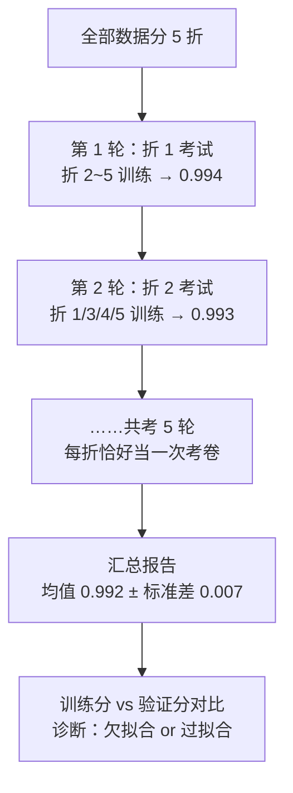

# 模型评估与调优

> **一句话理解**：训练分数高不代表模型好——评估回答"怎么科学地证明模型真的行"，调优回答"不行的时候该拧哪颗螺丝"；这一页也是防"训练满分、上线翻车"的体检手册。

[⬆️ 返回总目录](../../../README.md) · [⬆️ 返回本篇](../README.md) · [⬅️ 返回本章目录](./README.md)

| 属性 | 说明 |
|------|------|
| 难度 | ⭐⭐⭐（较难） |
| 所属分支 | 通用基础 |
| 前置知识 | 本章 01~06，重点 [01 机器学习全景](./01-机器学习全景.md)、[03 逻辑回归与分类](./03-逻辑回归与分类.md)、[04 决策树与集成学习](./04-决策树与集成学习.md) |

---

## 📌 这一节解决什么问题

新手最常见的翻车现场：训练集准确率 99%，兴冲冲上线，真实数据上只有 70%。**训练好 ≠ 测试好，测试好也不代表明天还好**。前面几页反复埋的雷——过拟合、单次划分的运气、不平衡数据的假象——都需要一套统一的"质检流程"来排掉。

这一页把散落各页的线索收拢成完整方法论：**交叉验证**（考试要多考几次才知道真实水平）、**偏差-方差权衡**（诊断病情：是没学会还是背题库）、**正则化**（给复杂模型扣分的紧箍咒）、**超参搜索**（拧螺丝的顺序）、**数据泄漏**（最隐蔽也最致命的作弊）。

## 🌱 通俗理解

- **k 折交叉验证（k-Fold Cross-Validation）= 换 k 次模拟考取平均分**：只考一次，运气成分太大（题目恰好都撞枪口）；把题目分成 k 份，每次留一份当考卷、其余当复习资料，考 k 次取平均——平均分和波动一起看，才敢下结论。
- **偏差（Bias）vs 方差（Variance）= 打靶诊断**：弹着点整体偏离靶心 = 瞄不准（偏差大，欠拟合：模型太简单）；围着靶心乱散 = 手抖（方差大，过拟合：模型太敏感）；又偏又散 = 没救（先解决数据）。
- **正则化（Regularization）= 给复杂模型扣分**：考试不只看答对多少，还要扣"装备分"——你带了 100 个作弊小抄（参数多）虽然全对，也给你扣下来；逼模型用最简单的规律解释数据。
- **数据泄漏（Data Leakage）= 考题混进了练习册**：复习资料里混进了下次要考的原题，模拟考满分，真考原形毕露——最气人的是，作弊往往是无意中发生的。

## 📋 举个例子

同一模型（逻辑回归 + 乳腺癌数据）做五折交叉验证，AUC 五个分数：

| 折 | 1 | 2 | 3 | 4 | 5 |
|---|---|---|---|---|---|
| AUC | 0.994 | 0.993 | 0.998 | 0.979 | 0.998 |

**均值 ± 标准差怎么读：**

1. 均值 = (0.994+0.993+0.998+0.979+0.998) / 5 = **0.992**：模型的"平均真实水平"；
2. 标准差 = **0.007**：水平稳不稳。写作 **0.992 ± 0.007**；
3. 看单折：最差一折 0.979——提醒你"换一份数据至少还能有 0.979"，这比均值更能代表最坏情况；
4. 对比用法：另一个模型报 0.990 ± 0.002——分数略低但稳得多（数据稍变也不动摇）。生产上"稳"经常比"高半分"更值钱；
5. 反面教材：如果只做了**一次**划分恰好抽到第 3 折当测试集，你会报出 0.998——高估了模型。这就是单次考试的运气成分。

## 🧠 核心原理

### 整体流程



### 逐步拆解

**① 训练好 ≠ 测试好：先看差距**

> 👉 **人话**：训练分数和验证分数**差距大** = 过拟合（背题库）；**两个都低** = 欠拟合（没学会）。先诊断，再开药：欠拟合加复杂度（换强模型、加特征），过拟合降复杂度（正则化、剪枝、加数据）。

**② 偏差-方差权衡：一张打靶图看懂所有病**

$$
\text{泛化误差}^2 = \underbrace{\text{Bias}^2}_{\text{瞄不准}} + \underbrace{\text{Var}}_{\text{手抖}} + \underbrace{\sigma^2}_{\text{靶场自身在晃（噪声）}}
$$

> 👉 **人话**：模型在新数据上的误差，拆成三份——系统性偏差（模型太简单，方向就错了）、方差（模型太敏感，换一批数据结论就大变）、不可消除的噪声（数据本身带的随机性，再好的模型也没辙）。调优的极限就是压到 $\sigma^2$ 这条地板线。

**③ 正则化：给复杂模型扣分**

$$
L_{L2} = L + \lambda\sum_j w_j^2 \qquad L_{L1} = L + \lambda\sum_j |w_j|
$$

> 👉 **人话**：在损失函数后面加一条"装备罚金"——参数（旋钮）拧得越大，罚得越多，模型被迫用更平缓的规律拟合数据。$\lambda$ 是罚率：调大 = 越 conservative（简单到可能欠拟合），调小 = 越放肆（复杂到可能过拟合）。

L2（岭回归 Ridge）按平方收税：大旋钮被重点打击，**所有旋钮一起变小、谁也不会独大**，模型平滑；L1（Lasso）按绝对值收税：小旋钮被直接罚到**归零**——顺手完成了特征选择，留下来的特征一目了然。

| | L1（Lasso） | L2（Ridge） |
|---|---|---|
| 罚金形式 | $\sum \lvert w_j \rvert$ | $\sum w_j^2$ |
| 效果 | 部分系数直接变 0 | 系数整体变小、趋于均匀 |
| 擅长 | 特征选择、稀疏模型 | 平滑、稳定、共线性数据 |
| 直觉 | 按个收税，小摊贩直接倒闭 | 按收入比例收税，大家缩水 |

**④ 其他防过拟合手段（预告）**：早停（训练到验证分不涨就刹车）、数据增强（把数据"变着法子扩充"）、Dropout 等，在[第 4 章：训练一个模型的完整流程](../../3-深度学习/04-深度学习基础/02-训练一个模型的完整流程.md)统一展开——正则化思想相同，工具箱更深。

**⑤ 超参搜索：拧螺丝的顺序**

超参数（Hyperparameter）是训练**开始前**人定的设置（树多深、正则化多强），模型自己学不会：

| 方法 | 做法 | 优缺点 |
|------|------|--------|
| 网格搜索（Grid Search） | 列出候选值，所有组合全试一遍 | 简单粗暴、可复现；组合一多算不过来 |
| 随机搜索（Random Search） | 每次随机抽一组 | 同样预算下常优于网格（重要参数被多试几轮） |
| 贝叶斯优化（Bayesian Optimization） | 根据历史成绩猜下一组更值得试的 | 省预算、贵在智能；工具如 Optuna |

**⑥ 数据泄漏：考题混进练习册**

最典型的错误——**先在全部数据上做归一化，再划分训练 / 测试**：标准化用的均值、方差是"包含考卷"算出来的，等于考前把全班平均分泄题给了模型，交叉验证分数虚高，上线现形。正确顺序永远是：**先划分，预处理只在训练集上 fit，再把同一套参数 transform 到测试集**（sklearn 里就是先 `fit` 训练集再 `transform` 测试集，或直接用 Pipeline）。

<details>
<summary>💣 展开一个真实泄漏案例推演：按时间排序前用了"未来统计量"</summary>

场景：预测用户是否会流失，特征里有"该用户历史平均月消费"。工程师图省事，用**全部时段**的数据算出了这个平均值，再按时间切分训练集（1~6 月）和测试集（7~8 月）。

推演：
1. 训练样本里"6 月的用户"，他的"历史平均月消费"居然包含了 7、8 月的消费——**模型偷看到了未来的稳定程度**：如果用户 7~8 月还在正常消费，平均值平稳，而"还在正常消费"本身和"不流失"高度相关；
2. 离线评估：AUC 高达 0.92，全组沸腾；
3. 上线后：给 9 月新用户打分时，"历史平均"只能用 9 月之前的真实数据，未来的信息不存在了，AUC 跌到 0.78；
4. 修复：所有"历史统计特征"必须在每个样本的**时间点当时**重算（point-in-time 正确性），离线 AUC 回落到 0.79——但这才是真实水平。

教训：**凡是特征工程用到"全量数据的统计量"（均值、方差、目标编码、归一化），都先问一句：这个数字，在预测那一刻真的能拿到吗？**

</details>

## 💻 动手试试

GridSearchCV 一站式完成"5 折交叉验证 + 网格搜索"：

```python
from sklearn.datasets import load_breast_cancer
from sklearn.ensemble import RandomForestClassifier
from sklearn.model_selection import GridSearchCV

X, y = load_breast_cancer(return_X_y=True)

param_grid = {
    "n_estimators": [100, 300],     # 候选：树的数量
    "max_depth": [4, 8, None],      # 候选：树的深度（None = 不限）
}                                    # 共 2 × 3 = 6 组，每组都做 5 折交叉验证
search = GridSearchCV(RandomForestClassifier(random_state=42),
                      param_grid, cv=5, scoring="roc_auc")
search.fit(X, y)

print("最佳参数:", search.best_params_)
print("最佳交叉验证 AUC:", round(search.best_score_, 3))

# 预期输出（可复现）：
# 最佳参数: {'max_depth': 8, 'n_estimators': 300}
# 最佳交叉验证 AUC: 0.992
```

想复刻 📋 的五折分数：`cross_val_score(模型, X, y, cv=5, scoring="roc_auc")`，返回的就是那 5 个数。要强调：**这些分数全部来自交叉验证，测试集（如果有）从头到尾没碰**。

## 🔥 炼丹小灶

> 🔥 **炼丹小灶**：工业界常用起点配方与玄学——
> - 配方：调参顺序永远是 **数据/特征 → 模型主超参（深度、学习率、树数）→ 次要细节**；网格先粗后细（先大步长圈范围，再小步长精修）；`cv=5` 是默认起点；
> - 玄学：交叉验证提升不到 0.001 的改动，多半是噪声，别自我感动；调完记得在**完全没碰过的测试集**上做最后一场考试，考完封卷；
> - ⚠️ 以上是经验参考值，不是圣旨；换数据集请重新炼。

## 🔗 在知识树中的位置

- **上游**：本章全部模型页——每个模型的"误区"小节最终都汇到本页的方法论。
- **下游**：[99-生产实战](./99-生产实战.md)（离线 AUC 与线上 A/B 的对齐是本页思想的落地）；[第 4 章：训练一个模型的完整流程](../../3-深度学习/04-深度学习基础/02-训练一个模型的完整流程.md)（深度学习版的全套防过拟合工具箱）。
- **横向对比**：交叉验证 vs 单次划分：小数据集用交叉验证榨干每条样本的信息；数据量千万级时，单次 hold-out 划分已经足够稳，交叉验证反而太贵。

## ⚠️ 常见误区

- **误区一**："交叉验证分数 = 上线后的成绩" → 交叉验证衡量的是**离线**水平；上线还面临数据分布变化、特征管道不一致等新问题，离线与线上要对齐验证（A/B 测试）。
- **误区二**："正则化越强越好" → 罚太狠会把有用的规律也罚没了（欠拟合）；$\lambda$ 也是超参数，要交叉验证来选。
- **误区三**："准确率高就万无一失" → 不平衡数据下准确率会骗人（见[03 逻辑回归](./03-逻辑回归与分类.md)误区三）；按业务选指标（AUC / 召回 / F1）。

## 📝 小结与自测

**要点回顾**

- 训练好 ≠ 测试好：先看训练与验证的**差距**，再分欠拟合 / 过拟合开药；
- k 折交叉验证：换 k 次模拟考取平均 ± 标准差，挤掉单次划分的运气成分；
- 偏差-方差权衡：瞄不准（模型太简单）与手抖（模型太敏感）是两种病，药方相反；
- 正则化 L1 / L2：给复杂模型扣罚金，L1 顺手做特征选择，L2 让模型平滑；
- 数据泄漏是最隐蔽的作弊：预处理先 fit 训练集，特征只用"当时拿得到"的信息。

**自测一下**（点击展开答案）

<details>
<summary>问题 1：模型 A 交叉验证 0.99 ± 0.010，模型 B 0.985 ± 0.001，选谁上生产？</summary>

看业务更怕哪种风险。若线上要求稳定（如风控日更打分、每次波动都要解释），选 B：分数几乎不随数据变化，可预期性强；若追求极致分数、能接受波动，选 A。工程上还可以先问：A 的高方差是不是来自某个不稳定特征或少数样本——修掉它，A 可能既高又稳。

</details>

<details>
<summary>问题 2：为什么"先用全量数据标准化，再划分训练测试"是错的？正确做法是什么？</summary>

全量数据的均值 / 方差包含了测试集信息，等于把"考卷的平均分"提前泄露给模型，验证分数虚高。正确做法：先划分，`StandardScaler` 只在**训练集**上 `fit`（记下训练集的均值方差），再用这**同一套参数**去 `transform` 测试集——测试集从头到尾不参与任何统计。用 sklearn Pipeline 可以把"划分内标准化"固化进交叉验证流程，从机制上防泄漏。

</details>

## 📚 延伸阅读

- 书：周志华《机器学习》第 2 章——模型评估与选择
- 书：《The Elements of Statistical Learning》第 7 章——偏差-方差分解
- 工具：sklearn 官方文档 Model Evaluation 与 Pipeline 章节——交叉验证与防泄漏的正确工程姿势

---

[⬅️ 上一页：聚类与降维](./06-聚类与降维.md) · [返回本章目录](./README.md) · [下一页：生产实战 ➡️](./99-生产实战.md)
