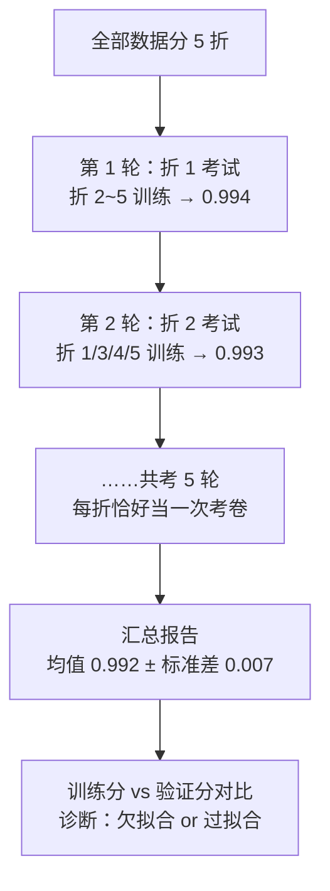
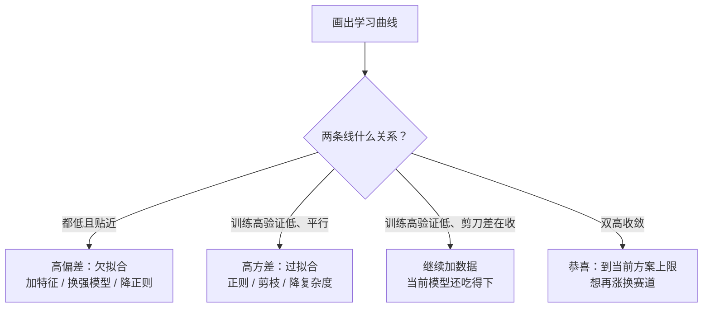

# 模型评估与调优

> **一句话理解**：训练分数高不代表模型好——评估回答"怎么科学地证明模型真的行"，调优回答"不行的时候该拧哪颗螺丝"；这一页也是防"训练满分、上线翻车"的体检手册。

[⬆️ 返回总目录](../../../README.md) · [⬆️ 返回本篇](../README.md) · [⬅️ 返回本章目录](./README.md)

| 属性 | 说明 |
|------|------|
| 难度 | ⭐⭐⭐（较难） |
| 所属分支 | 通用基础 |
| 前置知识 | 本章 01~06，重点 [01 机器学习全景](./01-机器学习全景.md)、[03 逻辑回归与分类](./03-逻辑回归与分类.md)、[04 决策树与集成学习](./04-决策树与集成学习.md) |

---

## 📌 这一节解决什么问题

新手最常见的翻车现场：训练集准确率 99%，兴冲冲上线，真实数据上只有 70%。**训练好 ≠ 测试好，测试好也不代表明天还好**。前面几页反复埋的雷——过拟合、单次划分的运气、不平衡数据的假象——都需要一套统一的"质检流程"来排掉。

这一页把散落各页的线索收拢成完整方法论：**交叉验证**（考试要多考几次才知道真实水平）、**偏差-方差权衡**（诊断病情：是没学会还是背题库）、**正则化**（给复杂模型扣分的紧箍咒）、**超参搜索**（拧螺丝的顺序）、**数据泄漏**（最隐蔽也最致命的作弊）。

## 🌱 通俗理解

- **k 折交叉验证（k-Fold Cross-Validation）= 换 k 次模拟考取平均分**：只考一次，运气成分太大（题目恰好都撞枪口）；把题目分成 k 份，每次留一份当考卷、其余当复习资料，考 k 次取平均——平均分和波动一起看，才敢下结论。
- **偏差（Bias）vs 方差（Variance）= 打靶诊断**：弹着点整体偏离靶心 = 瞄不准（偏差大，欠拟合：模型太简单）；围着靶心乱散 = 手抖（方差大，过拟合：模型太敏感）；又偏又散 = 没救（先解决数据）。
- **正则化（Regularization）= 给复杂模型扣分**：考试不只看答对多少，还要扣"装备分"——你带了 100 个作弊小抄（参数多）虽然全对，也给你扣下来；逼模型用最简单的规律解释数据。
- **数据泄漏（Data Leakage）= 考题混进了练习册**：复习资料里混进了下次要考的原题，模拟考满分，真考原形毕露——最气人的是，作弊往往是无意中发生的。
- **早停（Early Stopping）= 见好就收**：复习到第 7 天模拟考达到巅峰，第 8 天开始死记硬背走火入魔——在巅峰时刻刹车，比"复习到底"更聪明。

## 📋 举个例子

同一模型（逻辑回归 + 乳腺癌数据）做五折交叉验证，AUC 五个分数：

| 折 | 1 | 2 | 3 | 4 | 5 |
|---|---|---|---|---|---|
| AUC | 0.994 | 0.993 | 0.998 | 0.979 | 0.998 |

**均值 ± 标准差怎么读：**

1. 均值 = (0.994+0.993+0.998+0.979+0.998) / 5 = **0.992**：模型的"平均真实水平"；
2. 标准差 = **0.007**：水平稳不稳。写作 **0.992 ± 0.007**；
3. 看单折：最差一折 0.979——提醒你"换一份数据至少还能有 0.979"，这比均值更能代表最坏情况；
4. 对比用法：另一个模型报 0.990 ± 0.002——分数略低但稳得多（数据稍变也不动摇）。生产上"稳"经常比"高半分"更值钱；
5. 反面教材：如果只做了**一次**划分恰好抽到第 3 折当测试集，你会报出 0.998——高估了模型。这就是单次考试的运气成分。

**再算一个"准确率悖论"的账**：欺诈检测数据，1 万笔交易里 100 笔欺诈（1:99）。模型 A 认真学出：精确率 0.5、召回率 0.6；模型 B 干躺：全部预测"正常"。算准确率——A 抓到 60 笔真欺诈 + 误报 60 笔，对 9880 笔，准确率 **98.8%**；B 一笔不抓，对 9900 笔，准确率 **99.0%**。**躺赢的准确率更高**——这就是不平衡数据下准确率失去话语权的算术原因。

## 🧠 核心原理

### 整体流程



### 逐步拆解

**① 训练好 ≠ 测试好：先看差距**

> 👉 **人话**：训练分数和验证分数**差距大** = 过拟合（背题库）；**两个都低** = 欠拟合（没学会）。先诊断，再开药：欠拟合加复杂度（换强模型、加特征），过拟合降复杂度（正则化、剪枝、加数据）。

**② 偏差-方差权衡：一张打靶图看懂所有病**

$$
\text{泛化误差}^2 = \underbrace{\text{Bias}^2}_{\text{瞄不准}} + \underbrace{\text{Var}}_{\text{手抖}} + \underbrace{\sigma^2}_{\text{靶场自身在晃（噪声）}}
$$

> 👉 **人话**：模型在新数据上的误差，拆成三份——系统性偏差（模型太简单，方向就错了）、方差（模型太敏感，换一批数据结论就大变）、不可消除的噪声（数据本身带的随机性，再好的模型也没辙）。调优的极限就是压到 $\sigma^2$ 这条地板线。

这条公式不是比喻，是可以在平方损失下严格推出来的分解：

<details>
<summary>🧮 展开：偏差-方差分解的完整推导（平方损失）</summary>

设真实规律 $y = f(x) + \varepsilon$（$\varepsilon$ 是噪声，$\mathbb{E}[\varepsilon]=0$，$\operatorname{Var}(\varepsilon)=\sigma^2$）；训练数据是随机抽的，所以学到的模型 $\hat{f}$ 也是随机的——**方差来自"换一批训练数据，模型会怎么变"**。对单个测试点 $x$，考察期望平方误差（期望取遍"训练集的抽法"和"噪声"）：

$$
\mathbb{E}\big[(y - \hat{f}(x))^2\big] = \mathbb{E}\big[(f + \varepsilon - \hat{f})^2\big] = \underbrace{\big(f - \mathbb{E}[\hat{f}]\big)^2}_{\text{Bias}^2} + \underbrace{\mathbb{E}\big[(\hat{f} - \mathbb{E}[\hat{f}])^2\big]}_{\text{Var}} + \sigma^2
$$

推导要点（代数展开 + 交叉项期望为 0）：

1. 把 $\big((f - \mathbb{E}\hat f) + (\mathbb{E}\hat f - \hat f) + \varepsilon\big)^2$ 展开，三项平方留下，两两交叉项的期望全是 0（噪声独立、残差零均值）；
2. 第一项是"平均模型和真规律的差"——**偏差²**：换多少批数据都纠不回来的系统性错；
3. 第二项是"模型围绕自己平均值的抖动"——**方差**：换一批数据就变的部分；
4. 第三项 $\sigma^2$ 是噪声地板——**任何模型都压不过去**，标杆 AUC 到头了别硬卷。

> 👉 **人话**：这个分解解释了[04 决策树](./04-决策树与集成学习.md)的核心设计——单棵深树"瞄得准但手抖"（低偏差高方差），森林用平均把 Var 那一项除以树数，Boosting 逐步把 Bias² 那一项往零推——**集成学习就是在这条公式的两个项上分别动刀**。

⚠️ 适用边界一句话：这个干净的三项分解只在**平方损失**下严格成立（0-1 损失下要修正），但"偏差-方差此消彼长"的定性图景对所有模型都成立——当诊断语言用，别当精确会计用。

</details>

**③ 学习曲线：四种典型形态的看片诊断**

把"训练分数"和"验证分数"画成随**训练样本数**变化的两条曲线，四种形态对应四种病：

```text
① 健康区                    ② 高偏差（欠拟合）
分 |      ___________       分 | ____________ ____
数 |     /  验证 ↗···接近平行 数 | ———————————————— 两条都低、贴在一起
   |    /                   |
   | ――.―――― 训练高分微降     |
   +———————→ 样本数           +———————→ 样本数
   药：加数据小赚或不赚         药：加特征 / 换强模型，加数据没用

③ 高方差（过拟合）            ④ 加数据还有救
分 | ――――――――― 训练高分       分 |      _________ 训练高分
数 |        __....            数 |     /
   |      /  验证低但还在涨      |    /  验证在爬、剪刀差在收
   |     /                    |   /
   +———————→ 样本数           +———————→ 样本数
   药：正则 / 降复杂度 / 加数据   药：继续加数据，收益还在
```

> 👉 **人话**：一看**两条线的高低**（训练高分 + 验证低分 = 过拟合；双低 = 欠拟合），二看**验证线的手势**（还在爬 = 加数据有救；躺平 = 加数据白花钱）。这张图决定你接下来把钱花在"收数据"还是"调模型"——比任何调参玄学都值钱。



**④ 为什么交叉验证、k 取几**

单次划分 = 一次抽签，分数里混着运气（📋 第 5 条已演示）。交叉验证把每条样本都当一次考卷，但 k 的选择本身是个权衡：

| k | 训练集用量 | 估计的偏差 | 估计的方差 | 计算量 |
|---|---|---|---|---|
| 小（k=5） | 80% | 略偏高（每轮少用 20% 数据） | 较低（折间重叠少） | 5 倍 |
| 大（k=10） | 90% | 较低 | 折间训练集高度相似，分数相关性强 | 10 倍 |
| k = n（LOOCV） | 99%+ | 几乎无偏 | **最高**（n 个模型几乎一样，误差同涨同跌） | n 倍，最贵 |

> 👉 **人话**：k 越大每轮训练集越全（偏差小），但 n 个模型"长得太像"，分数一起高一起低，平均完波动反而压不掉（方差大），还贵得离谱。经验默认 **k=5 或 10**：两头都过得去。分层交叉验证（`StratifiedKFold`）让每折类别比例一致，不平衡数据必开。

**⑤ 正则化：给复杂模型扣分**

$$
L_{L2} = L + \lambda\sum_j w_j^2 \qquad L_{L1} = L + \lambda\sum_j |w_j|
$$

> 👉 **人话**：在损失函数后面加一条"装备罚金"——参数（旋钮）拧得越大，罚得越多，模型被迫用更平缓的规律拟合数据。$\lambda$ 是罚率：调大 = 越 conservative（简单到可能欠拟合），调小 = 越放肆（复杂到可能过拟合）。

L2（岭回归 Ridge）按平方收税：大旋钮被重点打击，**所有旋钮一起变小、谁也不会独大**，模型平滑；L1（Lasso）按绝对值收税：小旋钮被直接罚到**归零**——顺手完成了特征选择，留下来的特征一目了然。

| | L1（Lasso） | L2（Ridge） |
|---|---|---|
| 罚金形式 | $\sum \lvert w_j \rvert$ | $\sum w_j^2$ |
| 效果 | 部分系数直接变 0 | 系数整体变小、趋于均匀 |
| 擅长 | 特征选择、稀疏模型 | 平滑、稳定、共线性数据 |
| 直觉 | 按个收税，小摊贩直接倒闭 | 按收入比例收税，大家缩水 |

**L1 为什么能稀疏、L2 不能——几何的"菱角"直觉**：把正则想成"参数预算区"——L2 的预算区是个**圆**，L1 的预算区是个**菱形**。损失函数的等高线（一圈圈椭圆）从原点外扩，最先碰到预算区的位置就是解：碰圆，多半切在**弧上**（两个系数都非零，一起缩水）；碰菱形，极容易顶在**角上**——而菱形的角恰好长在坐标轴上（某个 $w_j = 0$，特征被一刀踢出局）。**"角"是 L1 独有的稀疏发动机**。分析的语言一句话：$|w|$ 在 0 点不可导，其次梯度是整个区间 $[-1, 1]$——包含 0，意味着"推力可以恰好在 0 处平衡"，参数能**停**在 0 上；平方函数在 0 点光滑，只有唯一的推力方向，参数只能被推着"路过" 0 附近而停不下来。

**⑥ 数据泄漏：考题混进练习册**

泄漏的定义一句话：**评估时用了"预测那一刻现实中拿不到的信息"**。四种典型形态，按隐蔽程度排列：

| 形态 | 机制 | 症状 / 识别 | 预防 |
|------|------|------------|------|
| **全量预处理** | 标准化 / 缺失值填充用了含测试集的统计量 | 离线分数虚高，上线略降 | 先划分再 fit，或全程 Pipeline |
| **时间穿越** | 特征里混进"未来"的统计量（全时段平均、未来标签的代理） | 离线 AUC 好得可疑（0.95+），上线崩 | 每个特征问"打分那一刻拿得到吗"；按时间切分 |
| **标签代理泄漏** | 特征本身就是结果的近似副本（"点击后停留时长"预测"是否点击"） | 单特征 AUC 就爆表；业务方一看特征名单就笑 | 特征审核：删掉"事后才有"的字段 |
| **分组泄漏** | 同一用户 / 同一设备同时出现在训练和测试 | 验证分数高、换个新用户群体就翻车 | `GroupKFold` 按实体分组切分 |

<details>
<summary>💣 展开一个真实泄漏案例推演：按时间排序前用了"未来统计量"</summary>

场景：预测用户是否会流失，特征里有"该用户历史平均月消费"。工程师图省事，用**全部时段**的数据算出了这个平均值，再按时间切分训练集（1~6 月）和测试集（7~8 月）。

推演：
1. 训练样本里"6 月的用户"，他的"历史平均月消费"居然包含了 7、8 月的消费——**模型偷看到了未来的稳定程度**：如果用户 7~8 月还在正常消费，平均值平稳，而"还在正常消费"本身和"不流失"高度相关；
2. 离线评估：AUC 高达 0.92，全组沸腾；
3. 上线后：给 9 月新用户打分时，"历史平均"只能用 9 月之前的真实数据，未来的信息不存在了，AUC 跌到 0.78；
4. 修复：所有"历史统计特征"必须在每个样本的**时间点当时**重算（point-in-time 正确性），离线 AUC 回落到 0.79——但这才是真实水平。

教训：**凡是特征工程用到"全量数据的统计量"（均值、方差、目标编码、归一化），都先问一句：这个数字，在预测那一刻真的能拿到吗？**

</details>

**⑦ 超参搜索：拧螺丝的顺序**

超参数（Hyperparameter）是训练**开始前**人定的设置（树多深、正则化多强），模型自己学不会：

| 方法 | 做法 | 适用场景 | 短板 |
|------|------|----------|------|
| 网格搜索（Grid Search） | 列出候选值，所有组合全试一遍 | 维度 ≤3、候选少、要可复现 | 组合爆炸；不重要的参数浪费预算 |
| 随机搜索（Random Search） | 每次随机抽一组 | 预算固定、维度中等 | 同预算下常优于网格（重要参数被多试几轮）；结果有随机性 |
| 贝叶斯优化（Bayesian Optimization） | 根据历史成绩建模"哪里更可能有高分"，猜下一组 | 单次训练贵（深度学习、大 ensemble）、维度高 | 需要工具（Optuna）；串行难并行 |

> 👉 **人话**：为什么随机常常赢网格？网格在"每个维度均匀撒点"，但现实中往往只有两三个参数真正重要——随机撒点让重要参数**每个都被试很多次**，不重要的浪费就浪费了；网格则把大量预算花在"两个不重要参数的组合"上。调参顺序不变：**先数据 / 特征，再主超参（深度、学习率、树数），最后细节**。

**⑧ 类不平衡下的评估：为什么看 PR 不看 ROC**

📋 已经算过"准确率悖论"的账，这里补齐另一半：**同样的模型变化，ROC 不动声色、PR 曲线剧烈反应**。机理在分母：

- ROC 的假阳性率 FPR = FP / (FP + **TN**)——分母是**多数类**（巨大），FP 从 50 涨到 100，FPR 只从 0.5% 动到 1.0%，**曲线几乎看不出抖动**；
- 精确率 Precision = TP / (TP + **FP**)——分母里的 FP 直接受少数类误报牵动，同样变化下精确率可能从 0.80 跌到 0.66，**PR 曲线立刻报警**。

> 👉 **人话**：不平衡世界里，TN 是汪洋大海，FPR 的分母大得让它"宠辱不惊"；PR 直接盯着你踩了多少雷，灵敏度高一截。**经验法则：正类占比 < 5~10%，主看 PR 曲线 / PR-AUC、召回、F1；类别均衡时 ROC-AUC 和 PR-AUC 结论基本一致**。另一个易犯错误是拿"验证集上的最优阈值"直接上线——阈值要在**业务代价**下重算（见[03 逻辑回归](./03-逻辑回归与分类.md)的不平衡三策略）。

**⑨ 早停：被低估的"正则化"**

训练曲线上的经典一幕：训练损失一路下降，验证损失先降后**回升**——回升的那一刻，模型开始背题库。早停（Early Stopping）= 在验证分数到达谷底时刹车：

- **观点**：早停本质上是一种**正则化**——它限制了"有效训练时长"，等于限制了模型能长到的有效复杂度。对线性模型甚至可以证明：早停 ≈ 一定强度的 L2 正则（训练步数与 $\lambda$ 作用相似，一句话级结论，不展开）；
- **操作**：留出验证集，每轮（每几个 epoch）评一次，连续 $p$ 轮不涨就停，回滚到最优那一轮（"patience" 参数）；
- **适用**：Boosting 的树数、神经网络的 epoch——**一切迭代式训练**都吃这套；[第 4 章：训练一个模型的完整流程](../../3-深度学习/04-深度学习基础/02-训练一个模型的完整流程.md)里它是标配三件套之一。

**⑩ 其他防过拟合手段（预告）**：数据增强（把数据"变着法子扩充"）、Dropout 等，在[第 4 章：训练一个模型的完整流程](../../3-深度学习/04-深度学习基础/02-训练一个模型的完整流程.md)统一展开——正则化思想相同，工具箱更深。

## 💻 动手试试

GridSearchCV 一站式完成"5 折交叉验证 + 网格搜索"：

```python
from sklearn.datasets import load_breast_cancer
from sklearn.ensemble import RandomForestClassifier
from sklearn.model_selection import GridSearchCV

X, y = load_breast_cancer(return_X_y=True)

param_grid = {
    "n_estimators": [100, 300],     # 候选：树的数量
    "max_depth": [4, 8, None],      # 候选：树的深度（None = 不限）
}                                    # 共 2 × 3 = 6 组，每组都做 5 折交叉验证
search = GridSearchCV(RandomForestClassifier(random_state=42),
                      param_grid, cv=5, scoring="roc_auc")
search.fit(X, y)

print("最佳参数:", search.best_params_)
print("最佳交叉验证 AUC:", round(search.best_score_, 3))

# 预期输出（可复现）：
# 最佳参数: {'max_depth': 8, 'n_estimators': 300}
# 最佳交叉验证 AUC: 0.992
```

想复刻 📋 的五折分数：`cross_val_score(模型, X, y, cv=5, scoring="roc_auc")`，返回的就是那 5 个数。要强调：**这些分数全部来自交叉验证，测试集（如果有）从头到尾没碰**。

**再画一张学习曲线，亲手做 ③ 的"看片诊断"**：

```python
from sklearn.model_selection import learning_curve
import numpy as np

# 复用 load_breast_cancer 的 X, y
sizes, tr_scores, va_scores = learning_curve(
    RandomForestClassifier(n_estimators=50, random_state=42),
    X, y, cv=5, scoring="roc_auc",
    train_sizes=np.linspace(0.1, 1.0, 6))

for s, tr, va in zip(sizes, tr_scores.mean(1), va_scores.mean(1)):
    print(f"样本 {s:4d}   训练 AUC {tr:.3f}   验证 AUC {va:.3f}")

# 预期输出（可复现，数值随版本微动）：
# 样本   34   训练 AUC 1.000   验证 AUC 0.975
# 样本  114   训练 AUC 1.000   验证 AUC 0.988
# ...
# 样本  512   训练 AUC 1.000   验证 AUC 0.990
# —— 训练分钉死 1.0、验证分高位缓升：轻度高方差形态（数据简单，问题不大）
# 换成 max_depth=None 的小森林再看，训练测试的剪刀差会更明显
```

改什么、看什么：把模型换成 `DecisionTreeClassifier(max_depth=30)`，训练 AUC 仍 1.0 而验证 AUC 明显掉档——高方差形态；再换成 `max_depth=1` 的树桩，两条线"双低贴合"——高偏差形态。**四种形态各跑一遍，眼睛就练出来了。**

## 🔥 炼丹小灶

> 🔥 **炼丹小灶**：工业界常用起点配方与玄学——
> - 配方：调参顺序永远是 **数据/特征 → 模型主超参（深度、学习率、树数）→ 次要细节**；网格先粗后细（先大步长圈范围，再小步长精修）；`cv=5` 是默认起点；不平衡数据 `StratifiedKFold` 必开、指标换 PR-AUC；
> - 玄学：交叉验证提升不到 0.001 的改动，多半是噪声，别自我感动；调完记得在**完全没碰过的测试集**上做最后一场考试，考完封卷；Boosting / 神经网络先开早停再谈调树数——它是免费的复杂度旋钮；
> - ⚠️ 以上是经验参考值，不是圣旨；换数据集请重新炼。

## 🔗 在知识树中的位置

- **上游**：本章全部模型页——每个模型的"误区"小节最终都汇到本页的方法论。
- **下游**：[99-生产实战](./99-生产实战.md)（离线 AUC 与线上 A/B 的对齐、泄漏排查流程是本页思想的落地）；[第 4 章：训练一个模型的完整流程](../../3-深度学习/04-深度学习基础/02-训练一个模型的完整流程.md)（深度学习版的全套防过拟合工具箱）。
- **横向对比**：交叉验证 vs 单次划分：小数据集用交叉验证榨干每条样本的信息；数据量千万级时，单次 hold-out 划分已经足够稳，交叉验证反而太贵。

## ⚠️ 常见误区

- **误区一**："交叉验证分数 = 上线后的成绩" → 交叉验证衡量的是**离线**水平；上线还面临数据分布变化、特征管道不一致等新问题，离线与线上要对齐验证（A/B 测试）。
- **误区二**："正则化越强越好" → 罚太狠会把有用的规律也罚没了（欠拟合）；$\lambda$ 也是超参数，要交叉验证来选。
- **误区三**："准确率高就万无一失" → 不平衡数据下准确率会骗人（见[03 逻辑回归](./03-逻辑回归与分类.md)误区三）；按业务选指标（AUC / 召回 / F1 / PR-AUC）。
- **误区四**："数据泄漏一定会报错 / 分数高得离谱才叫泄漏" → 温和泄漏最常见：分数只虚高 0.02，照样让你选错模型。四个高危点（全量预处理 / 时间穿越 / 标签代理 / 分组泄漏）逐一排查。
- **误区五**："欠拟合就无限加数据" → 欠拟合是偏差问题，加数据治不了（学习曲线双低贴合时加样本无济于事）；该加特征、换强模型。

## 📝 小结与自测

**要点回顾**

- 训练好 ≠ 测试好：先看训练与验证的**差距**，再分欠拟合 / 过拟合开药；
- k 折交叉验证：换 k 次模拟考取平均 ± 标准差，挤掉单次划分的运气成分；k 是偏差-方差-算力的三角权衡，5/10 是默认；
- 偏差-方差分解 $\text{Bias}^2 + \text{Var} + \sigma^2$（平方损失下严格成立）：瞄不准与手抖是两种病，药方相反；$\sigma^2$ 是任何模型的地板；
- 学习曲线四形态：双低贴合（欠拟合）、平行剪刀差（过拟合）、剪刀差在收（加数据有救）、双高收敛（到上限）；
- 正则化 L1 / L2：给复杂模型扣罚金，L1 靠菱形的"角"做特征选择（次梯度允许停在 0），L2 让模型平滑；
- 数据泄漏四形态：全量预处理、时间穿越、标签代理、分组泄漏——多温和而隐蔽，Pipeline + 按时间 / 分组切分是制度性预防；
- 不平衡评估：准确率会躺赢（悖论），FPR 分母是多数类所以 ROC 迟钝，PR 曲线对少数类误报敏感——正类占比低时主看 PR；
- 早停 = 限制有效复杂度的正则化：验证分回升前刹车，一切迭代式训练通用。

**自测一下**（点击展开答案）

<details>
<summary>问题 1：模型 A 交叉验证 0.99 ± 0.010，模型 B 0.985 ± 0.001，选谁上生产？</summary>

看业务更怕哪种风险。若线上要求稳定（如风控日更打分、每次波动都要解释），选 B：分数几乎不随数据变化，可预期性强；若追求极致分数、能接受波动，选 A。工程上还可以先问：A 的高方差是不是来自某个不稳定特征或少数样本——修掉它，A 可能既高又稳。

</details>

<details>
<summary>问题 2：为什么"先用全量数据标准化，再划分训练测试"是错的？正确做法是什么？</summary>

全量数据的均值 / 方差包含了测试集信息，等于把"考卷的平均分"提前泄露给模型，验证分数虚高。正确做法：先划分，`StandardScaler` 只在**训练集**上 `fit`（记下训练集的均值方差），再用这**同一套参数**去 `transform` 测试集——测试集从头到尾不参与任何统计。用 sklearn Pipeline 可以把"划分内标准化"固化进交叉验证流程，从机制上防泄漏。

</details>

<details>
<summary>问题 3：学习曲线显示"训练 AUC 0.99、验证 AUC 0.70，两条线平行不收敛"，接下来该干什么、不该干什么？</summary>

典型高方差（过拟合）：该做的是降复杂度（正则 / 剪枝 / 换简单模型）或加数据（若验证线还在爬则加数据优先）；不该做的是继续堆模型复杂度、继续调参精修——剪刀差只会更大。同时排查一下有没有数据泄漏之外的高危特征（过强的标签代理也会造成这种形态）。

</details>

<details>
<summary>问题 4：L1 和 L2 都能压系数，为什么只有 L1 能把系数压到恰好为 0？</summary>

几何上：正则预算区 L2 是圆、L1 是菱形，损失等高线最容易顶在菱形的**角**上，而角长在坐标轴上（某个系数恰为 0）；圆没有角，解落在弧上，系数只能一起变小、难有归零。分析上：$|w|$ 在 0 处不可导，次梯度是区间 $[-1,1]$、包含 0——参数可以在 0 处受力平衡"停下来"；平方函数在 0 处光滑、推力唯一，参数只能滑过 0 附近而停不在 0 上。

</details>

<details>
<summary>问题 5：1:99 的欺诈检测里，为什么 ROC-AUC 几乎纹丝不动、PR 曲线却大幅下滑？</summary>

ROC 的假阳性率 FPR = FP/(FP+TN)，分母 TN 是多数类（海量），FP 翻倍 FPR 也只动零点几个百分点，曲线迟钝；PR 的精确率 = TP/(TP+FP)，FP 一多精确率直接跳水，对少数类误报高度敏感。所以不平衡场景下 PR-AUC / 召回 / F1 更能暴露问题，ROC-AUC 容易"报喜不报忧"。

</details>

## 📚 延伸阅读

- 书：周志华《机器学习》第 2 章——模型评估与选择
- 书：《The Elements of Statistical Learning》第 7 章——偏差-方差分解与交叉验证理论
- 论文：Bergstra & Bengio, *Random Search for Hyper-Parameter Optimization*（2012）——随机搜索为何常胜网格
- 工具：sklearn 官方文档 Model Evaluation 与 Pipeline 章节——交叉验证与防泄漏的正确工程姿势

---

[⬅️ 上一页：聚类与降维](./06-聚类与降维.md) · [返回本章目录](./README.md) · [下一页：生产实战 ➡️](./99-生产实战.md)
