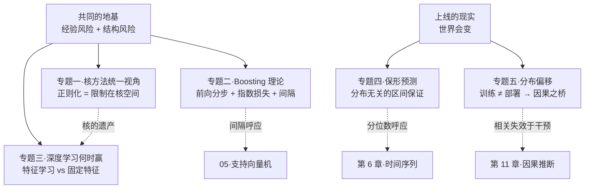
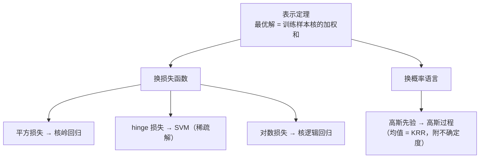
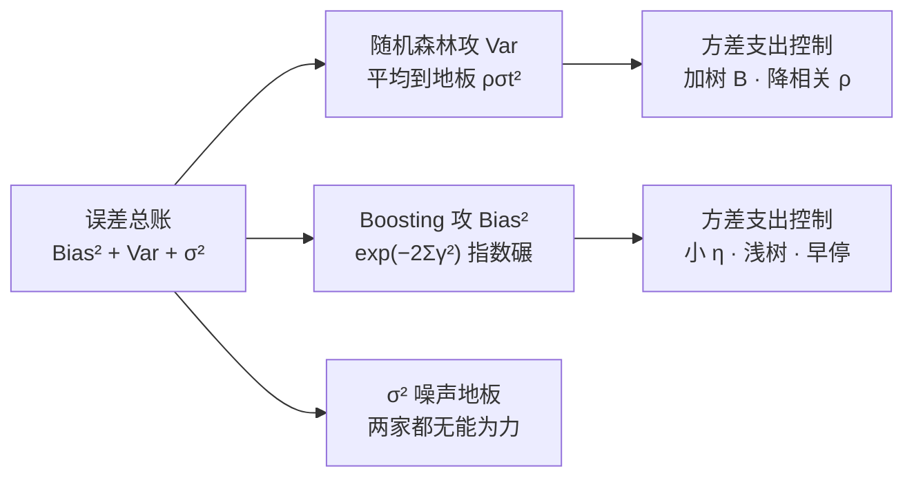
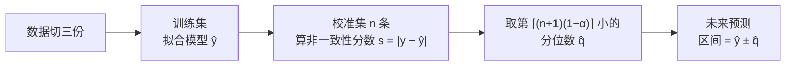
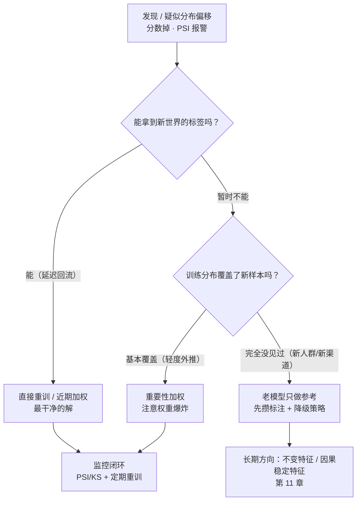
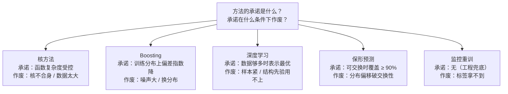

# 进阶专题：经典 ML 理论高地

> **一句话理解**：前面七页学会了"怎么用"，这一页回答几个"凭什么"——凭什么正则化万能（核方法统一视角）、凭什么 Boosting 降偏差、凭什么深度学习赢（或者不赢）、凭什么一个区间敢自称"90% 置信"（保形预测）、凭什么上线就崩（分布偏移）。

[⬆️ 返回总目录](../../../README.md) · [⬆️ 返回本篇](../README.md) · [⬅️ 返回本章目录](./README.md)

| 属性 | 说明 |
|------|------|
| 难度 | ⭐⭐⭐⭐（高阶） |
| 所属分支 | 通用基础 |
| 前置知识 | [线性回归](./02-线性回归.md)、[决策树与集成学习](./04-决策树与集成学习.md)、[支持向量机](./05-支持向量机.md)、[模型评估与调优](./07-模型评估与调优.md) |

**本页目录**（五个专题彼此独立，可跳读）：

| 专题 | 一句话主旨 | 与谁连接 |
|------|-----------|----------|
| 一·核方法统一视角 | 正则化 = 把函数限制在核空间；λ 是证据门槛 | [02 线性回归](./02-线性回归.md)、[05 支持向量机](./05-支持向量机.md) |
| 二·Boosting 的理论 | 指数损失 + 前向分步 → 降偏差；间隔呼应 SVM | [04 决策树与集成](./04-决策树与集成学习.md)、[07 评估调优](./07-模型评估与调优.md) |
| 三·深度学习何时赢 | 特征学习 vs 固定特征；表格四条机理 | [第 4 章深度学习](../../3-深度学习/04-深度学习基础/README.md) |
| 四·Conformal 保形预测 | 不假设分布的"90% 置信区间" | [第 6 章分位数损失](../../4-专业方向/06-时间序列/03-现代时间序列模型.md) |
| 五·分布偏移 | 训练 ≠ 部署；相关失效于干预 | [01 全景](./01-机器学习全景.md)、[第 11 章因果](../../4-专业方向/11-因果推断/01-相关不等于因果.md) |

---

## 📌 这一节解决什么问题

学完 02~07 页，你已经能训练、评估、调优一大批经典模型。但几个横跨全章的"为什么"一直悬着：

- 岭回归加 $\lambda$、SVM 加 $C$、树加剪枝、神经网络加权重衰减——**凭什么"加个罚"就能治百病**？这些罚之间有没有一个统一的理论？
- "Bagging 降方差、Boosting 降偏差"背了口诀，**数学上到底在讲一件什么事**？
- 深度学习横扫图像文本，**为什么在表格数据上至今打不过 GBDT**？分界线画在哪？
- 模型说"预测 350 万"，业务问"上下浮多少可信"——传统置信区间要正态假设，**有没有不假设任何分布、还能打包票的区间**？
- 离线 0.95、上线 0.78 的惨案，除了"重训"，**理论上还有什么招**？

这五个问题各自是一片研究高地，本页每个专题只求"一条主线 + 一个可用的结论"，并给出与前后章节的连接。定位是**选读**：面试高频、科研入门必看，纯工程向读者可先跳去[99-生产实战](./99-生产实战.md)，日后再回来。

## 🌱 通俗理解

把前七页想成**七种兵器的用法手册**，这一页是**铸造学**：兵器为什么长这样。

- **核方法统一视角**：岭回归、SVM、高斯过程……看似一家一个门派，其实全住在一栋楼里——"给函数的复杂度收税"的税务局。**税怎么收，决定了模型学出什么形状的函数**；
- **Boosting 理论**：接力纠错不是励志故事，是"指数损失 + 前向分步"这个数学结构的必然剧情——像多米诺骨牌，第一块倒下的方向早就被损失函数写死了；
- **深度学习赢不赢**：一场"特征是学出来的还是定死的"之争。原始信号（像素、文字）上学习特征大获全胜，表格数据上"定死但合身"的树切分反而更划算——**赢的条件比赢本身更值得背**；
- **保形预测（Conformal Prediction）**：模型做完题后，再拿一小撮"从没参与训练的题"量一量它的误差有多大，把第 90 百分位的误差宽度贴到未来的每个预测上——**不猜分布，只查历史账，就能给出有保证的区间**；
- **分布偏移**：训练和上线是两个世界。相关规律在"世界被干预"时会失效——这是通往[第 11 章因果推断](../../4-专业方向/11-因果推断/01-相关不等于因果.md)的桥。

## 📋 举个例子

**例一：岭回归到底砍了谁（谱收缩的手算）**。设某数据集（旋转到主成分方向后）协方差矩阵的四个特征值为 $[100,\ 9,\ 1,\ 0.01]$——第 1 个方向上数据证据极充分，第 4 个方向证据几乎为零。岭回归的收缩因子是 $\frac{\lambda_j}{\lambda_j+\lambda}$，取 $\lambda=1$ 逐个算：

| 方向 | 特征值 λ_j | 收缩因子 λ_j/(λ_j+1) | 解读 |
|---|---|---|---|
| 1 | 100 | 100/101 ≈ **0.990** | 证据充分：几乎照抄最小二乘 |
| 2 | 9 | 9/10 = **0.900** | 轻微缩水 |
| 3 | 1 | 1/2 = **0.500** | 一半信数据、一半信先验 |
| 4 | 0.01 | 0.01/1.01 ≈ **0.010** | 证据稀薄：几乎砍光 |

👉 同一个 $\lambda$，对不同方向砍得完全不一样——**岭回归不是"把系数统一变小"，而是"按证据量差别定价"**。这四个数字就是本页专题一的钥匙。

**例二：保形区间的手算（10 条校准样本，目标 90% 覆盖）**。模型在 10 条**从未参与训练**的校准数据上的绝对误差（按从小到大排好）：

$$
0.3,\ 0.4,\ 0.5,\ 0.7,\ 0.8,\ 0.9,\ 1.1,\ 1.2,\ 1.6,\ 2.1
$$

90% 区间要取第 $\lceil (10+1)\times 0.9\rceil = \lceil 9.9\rceil = 10$ 个，即 $\hat{q} = 2.1$，未来预测一律给 $\hat{y} \pm 2.1$。

**为什么不是"90% 分位 = 第 9 个（1.6）"**？有限样本修正：新样本与 10 条校准样本在误差排名中**地位完全对称**，它是 11 个里任意一名的概率都相等——只有取到第 10 大才能保证"新样本误差 ≤ q̂"的概率 $\ge 10/11 \approx 90.9\%$。取第 9 个（1.6）的话，保证只有 $9/11 \approx 81.8\%$——**差那一个名次，承诺就漏 9 个百分点**。校准样本越多，修正越接近经验分位数，区间也更贴身。

<details>
<summary>📊 展开：把两笔账合起来看——λ 变化时四个方向的收缩全景</summary>

沿用例一的特征值 $[100,\ 9,\ 1,\ 0.01]$，扫一遍 $\lambda$：

| λ | 方向1 | 方向2 | 方向3 | 方向4 | 解读 |
|---|---|---|---|---|---|
| 0.1 | 0.999 | 0.989 | 0.909 | 0.091 | 温和：只砍证据最薄的方向 |
| 1 | 0.990 | 0.900 | 0.500 | 0.010 | 中等：方向 3 半信半疑 |
| 10 | 0.909 | 0.474 | 0.091 | 0.001 | 激进：只剩最强方向还站着 |

看两点：一，$\lambda$ 与特征值谱是**相对关系**——$\lambda=1$ 对特征值 100 是毛毛雨、对 0.01 是灭顶之灾，所以"λ 该多大"没有绝对答案，取决于谱；二，表格数据的谱常是"少数大特征值 + 长尾小特征值"，岭回归等于**自动砍掉长尾方向**——这正是它在共线性（[02 页](./02-线性回归.md)）下救场的谱语言版。

</details>

## 🧠 核心原理

### 整体流程



### 专题一：核方法的统一视角——"正则化 = 把函数限制在核空间"

**① 从岭回归的谱分析说起**。[02 页](./02-线性回归.md)的岭回归解是 $\hat{w}=(X^\top X+\lambda I)^{-1}X^\top y$。对中心化后的 $X$ 做奇异值分解（SVD）$X = U\Sigma V^\top$（$\Sigma$ 的对角元 $\sigma_j$ 是各主方向的"证据强度"，$\sigma_j^2$ 就是特征值 $\lambda_j$），代进去化简，预测值可以写成：

$$
\hat{y} = \sum_{j} \frac{\lambda_j}{\lambda_j + \lambda}\, u_j\big(u_j^\top y\big)
$$

> 👉 **人话**：把 $y$（真实答案）拆到各个主方向上，每个方向的分量乘上收缩因子 $\frac{\lambda_j}{\lambda_j+\lambda}$ 再加回来——**证据足的方向照抄，证据薄的方向砍掉**（📋 例一的四个数字）。最小二乘是 $\lambda=0$ 的特例（全部照抄，所以证据为零的方向会被噪声放大到爆炸）；$\lambda\to\infty$ 全砍（什么都预测不出来，只剩均值）。正则化强度不是旋钮玄学，是**"证据门槛"**。

<details>
<summary>🧮 展开：收缩公式怎么从 SVD 推出来（五行代数）</summary>

中心化 $X$ 后做 SVD：$X = U\Sigma V^\top$，其中 $U$ 的列 $u_j$ 是 $n$ 维样本空间里的主方向，$\Sigma\Sigma^\top$ 的对角元 $\sigma_j^2 = \lambda_j$。先看最小二乘的预测（$\hat y = X\hat w = X(X^\top X)^{-1}X^\top y$，把 $X$ 的 SVD 代入，$(X^\top X)^{-1}$ 里的 $\sigma_j^2$ 与外面两个 $\sigma_j$ 约分）：

$$
\hat y_{\text{OLS}} = \sum_j u_j\big(u_j^\top y\big)
$$

> 👉 **人话**：最小二乘把 $y$ **原封不动**投影到"特征能张成的空间"（[02 页](./02-线性回归.md)投影视角）——每个主方向的分量保留 100%。

岭回归只是把 $(X^\top X)^{-1}$ 换成 $(X^\top X+\lambda I)^{-1}$，同样的代入消元，每个方向多出一个因子：

$$
\frac{\sigma_j^2}{\sigma_j^2+\lambda} = \frac{\lambda_j}{\lambda_j+\lambda} \qquad\Longrightarrow\qquad \hat y_{\text{ridge}} = \sum_j \frac{\lambda_j}{\lambda_j+\lambda}\, u_j\big(u_j^\top y\big)
$$

> 👉 **人话**：岭回归 = 最小二乘 + **逐方向打折**。这一行同时解释了三件事：为什么岭回归能把不可逆的 $X^\top X$ 救回来（$\sigma_j^2+\lambda$ 永远大于 0）；为什么它抗共线性（共线方向的 $\lambda_j\approx 0$，折扣打最狠）；以及预测永远可以写成 $\hat y = S_\lambda y$——**"平滑矩阵" $S_\lambda$ 的每一行，就是对全体训练标签的一套加权平均权重**（专题一 ③ 的伏笔）。

顺带一个理论坐标：按 $j$ 逐方向做 $\frac{\lambda_j}{\lambda_j+\lambda}$ 这样的修正，术语叫**谱滤波（Spectral Filtering）**——岭回归只是滤波族里"温和派"的一员（别的成员：PC 回归=硬截断只留前 k 个方向，主成分回归正是它；更陡峭的滤波对应别的正则）。**正则化方法的本质分歧，常常只是滤波曲线的形状不同。**

</details>

**② 表示定理（Representer Theorem）：一句话直觉**。把"线性函数"推广到任意函数 $f$，把"系数的 L2 罚"推广为"函数在核空间里的范数罚"，最小化下面这类目标：

$$
\min_{f}\ \sum_{i=1}^{n} L\big(y_i, f(x_i)\big) + \lambda\, \|f\|_{\mathcal H}^2
$$

> 👉 **人话**：**正则化 = 把函数限制在核空间**——只要你的目标是"拟合数据 + 罚函数复杂度"这个形状，那么无论函数空间多大（哪怕是无穷维），最优解一定长成"训练样本的核函数加权和"：$f(x)=\sum_i \alpha_i K(x_i, x)$。无穷维的搜索问题瞬间坍缩成"求 $n$ 个系数 $\alpha$"。这就是[05 页](./05-支持向量机.md)对偶解 $w=\sum\alpha_i y_i x_i$ 的推广版：**SVM、岭回归、高斯过程全被这一条定理收编**。

<details>
<summary>🧮 展开：表示定理怎么用——岭回归的核化三步</summary>

**第一步**，承认结论：最优解必在 $\mathrm{span}\{K(x_1,\cdot),\dots,K(x_n,\cdot)\}$ 里，即 $f(x)=\sum_i\alpha_i K(x_i,x)$。

**第二步**，代入目标。拟合项变成 $K\alpha$（$K$ 是 $n\times n$ 核矩阵，$K_{ij}=K(x_i,x_j)$），罚项变成 $\alpha^\top K \alpha$（核空间范数的坐标形式）：

$$
\min_{\alpha}\ \|y - K\alpha\|^2 + \lambda\, \alpha^\top K\alpha
$$

**第三步**，又是正规方程（和[02 页](./02-线性回归.md)一模一样的求导）：

$$
(K + \lambda I)\,\alpha = y \quad\Longrightarrow\quad \alpha = (K+\lambda I)^{-1}y,\qquad \hat{f}(x) = \sum_{i=1}^{n}\alpha_i K(x_i, x)
$$

> 👉 **人话**：核岭回归（Kernel Ridge Regression, KRR）三行推完——**核方法没有新数学，只有"表示定理保证可以只看样本间核值"这一步跳跃**。$\lambda I$ 加在核矩阵上同样起"证据门槛"作用：核矩阵的特征值同样会被 $\frac{\mu_j}{\mu_j+\lambda}$ 收缩。换损失函数就得到别的门派：hinge 损失版是 SVM（稀疏解，只有支持向量 $\alpha_i\ne 0$），对数损失版是核逻辑回归，加上高斯先验的完全贝叶斯版是高斯过程（GP）——**后验均值恰好等于 KRR 的预测**，GP 只是额外附送了不确定度。

</details>

表示定理收编的"一门五表"对照（换损失、换罚、换语言，骨架同一副）：

| 成员 | 拟合项（损失） | 罚 / 先验 | 解的形态 | 特色 |
|------|---------------|-----------|----------|------|
| 最小二乘 | 平方 | 无（$\lambda=0$） | 一步解析解（投影） | 全保留，噪声也放大 |
| 岭回归 | 平方 | $\lambda\|w\|^2$ | 逐方向打折（谱滤波） | 救共线性、稳定 |
| 核岭回归 KRR | 平方 | 函数范数罚 | $f=\sum\alpha_i K(x_i,\cdot)$ | 非线性也能"三行推完" |
| SVM（hinge 版） | hinge | $\|w\|^2$ | 同上，但稀疏（$\alpha_i\ne 0$ 的才是支持向量） | 边界只由关键少数决定 |
| 高斯过程 GP | 平方 + 高斯先验 | 同 KRR（贝叶斯版） | 后验均值 = KRR 预测 | 附送不确定度 |



> 👉 **人话**：[02 页](./02-线性回归.md)与[05 页](./05-支持向量机.md)看起来是两个世界（一个回归一个分类、一个概率一个几何），在表示定理这里被压回同一张表——**你早就会核方法了，只是之前不知道**。

**③ 暗连：核方法与最近邻 / 均值平滑**。看两条长得像但血缘存疑的公式：

$$
\hat{f}_{\text{KRR}}(x) = \sum_i \alpha_i\, K(x_i, x),
\qquad \alpha = (K+\lambda I)^{-1}y
\qquad\qquad
\hat{f}_{\text{NW}}(x) = \frac{\sum_i K(x, x_i)\, y_i}{\sum_j K(x, x_j)}
$$

> 👉 **人话**：左边（核方法家族，以核岭回归为代表）把核当成"几何相似度"，系数 $\alpha$ 是**解一个带正则的方程组**得来的——训练点之间会互相牵制；右边（Nadaraya–Watson 核平滑，最近的邻居均值版）把核当成"投票权重"，**不用训练**，问谁像谁、像多少就抄多少票。两者是"学出来的加权"与"拍脑袋的加权"之分——但注意：岭回归的预测也恰好可以写成 $\hat{y}=S_\lambda y$（上面折叠框里 $\sum_j (\cdot)\,u_j u_j^\top y$ 的展开），**每一行都是对全体 $y$ 的加权平均，权重随 $x$ 变化**——从"预测值都是训练标签的加权平均"这个角度看，核方法、最近邻、均值平滑是同一个家族的三兄弟，只是权重的来历不同。

RBF 核 $K(x,x')=\exp(-\|x-x'\|^2/2\sigma^2)$ 还藏着另一个暗连：**带宽 $\sigma$ 就是"邻居范围"旋钮**——$\sigma$ 极小，每个点只像自己（退化成背答案的近邻）；$\sigma$ 极大，人人相似（退化成全局平均）；中间的 $\sigma$ 才是"局部平滑"。[05 页](./05-支持向量机.md)"gamma 调大 = 只认自己那亩三分地"的过拟合现场，谱语言里就是带宽坍缩。

**适用边界**：核矩阵 $n\times n$ 要整个进内存、求解 $O(n^3)$（[05 页](./05-支持向量机.md)衰落史的结构性原因）；核要人来选（先验的数学封装）；对量纲敏感。**小数据 + 中维 + 要理论保证**是它的主场，大数据请走树或网络。

### 专题二：Boosting 的理论——前向分步、指数损失与间隔

**① 为什么 Boosting 降偏差：指数损失 + 前向分步的必然剧情**。[04 页](./04-决策树与集成学习.md)已经讲了"新树拟合负梯度"，这里把镜头拉到 AdaBoost 的原始形态：损失是**指数损失（Exponential Loss）** $L(y, F)=e^{-yF}$（$y\in\{\pm1\}$，$F$ 是累计打分），策略是**前向分步（Forward Stagewise）**——每轮固定已有模型，只加一个新弱学习器 $F_m = F_{m-1} + \alpha h$：

$$
\min_{\alpha, h}\ \sum_i e^{-y_i(F_{m-1}(x_i) + \alpha h(x_i))}
= \sum_i \underbrace{e^{-y_i F_{m-1}(x_i)}}_{w_i^{(m)}}\ e^{-y_i \alpha h(x_i)}
$$

> 👉 **人话**：把上一轮攒下的指数因子记作每个样本的当前权重 $w_i^{(m)}$——**上一轮已经答对且自信的样本（$yF$ 大）权重自动被压小，还错着的样本权重自动膨胀**。"错题加权"不是发明出来的技巧，是指数损失展开后自己长出来的。

对二值 $h\in\{\pm1\}$ 再展开一步，最优步长与权重更新都解析可得（推导在折叠框）：

$$
\alpha^{*} = \frac{1}{2}\ln\frac{1-\mathrm{err}_m}{\mathrm{err}_m},\qquad w_i^{(m+1)} \propto w_i^{(m)}\, e^{-y_i \alpha^{*} h(x_i)}
$$

> 👉 **人话**：$\alpha^{*}$（这一棒的话语权）由加权错误率决定——错误率 0.5（瞎猜）时话语权恰为 0，错误率越低话语权越大；权重更新把**答错的样本乘 $e^{+\alpha}$ 放大、答对的乘 $e^{-\alpha}$ 缩小**：下一棵树被迫直面残余错误。这就是"降偏差"的机制本体：**每一轮都在系统性错误的方向上走一步**。

<details>
<summary>🧮 展开：从指数损失推出 AdaBoost 全套 + 训练误差指数下降</summary>

**推导 α**。对 $h\in\{\pm 1\}$，把第 $m$ 轮目标按对错分组：$\sum_i w_i e^{-y_i\alpha h(x_i)} = e^{-\alpha}\!\!\sum_{h=y_i} w_i + e^{\alpha}\!\!\sum_{h\ne y_i} w_i = e^{-\alpha}W_{\text{对}} + e^{\alpha}W_{\text{错}}$。令导数为 0：$-e^{-\alpha}W_{\text{对}} + e^{\alpha}W_{\text{错}} = 0 \Rightarrow \alpha^{*} = \frac12\ln\frac{W_{\text{对}}}{W_{\text{错}}} = \frac12\ln\frac{1-\mathrm{err}}{\mathrm{err}}$（加权错误率 err $= W_{\text{错}}/W_{\text{总}}$）。权重更新 $w_i^{(m+1)} \propto w_i^{(m)} e^{-y_i\alpha^{*} h(x_i)}$ 就是把上面 $w_i^{(m+1)} = w_i^{(m)}e^{-y_iF_m(x_i)}$ 拆开——**AdaBoost 的三件套（重加权、话语权、早停看轮数）全部是指数损失的推论**。

**训练误差为什么降得快**。代回最优值，一轮后的总损失恰为 $2\sqrt{\mathrm{err}(1-\mathrm{err})}\cdot W_{\text{总}}$。记每轮弱学习器比瞎猜好一点点：$\gamma_m = \frac12 - \mathrm{err}_m > 0$，则 $\sqrt{1-4\gamma_m^2} \le e^{-2\gamma_m^2}$，连乘得：

$$
\text{训练误差} \le \prod_{m=1}^{M}\sqrt{1-4\gamma_m^2} \le \exp\Big(-2\sum_{m=1}^{M}\gamma_m^2\Big)
$$

> 👉 **人话**：只要每棒都"比瞎猜好哪怕一点点"（$\gamma>0$），训练误差就**指数速度**往下掉——Boosting 把一堆 51 分的弱鸡组装成 99 分强者的理论根据。这个不等式也是"降偏差"的定量版：偏差（系统性错误）在函数空间里被一步步碾掉。

**换成别的损失就是整个 GBDT 家族**：平方损失→拟合残差，绝对/Huber→拟合中位数式残差，对数损失→拟合概率残差（[04 页](./04-决策树与集成学习.md)⑦ 的"负梯度"统一视角）。指数损失只是这族里梯度形式最漂亮的一个。

</details>

**② Margin 理论一句话**：训练样本上的**归一化间隔（Margin）**分布越大（$y_iF(x_i)/\sum|\alpha_m|$ 远大于 0 的样本越多），泛化误差的上界越紧，且**与训练轮数无关**（Schapire et al., 1998）——间隔大 → 泛化好，与[05 页](./05-支持向量机.md)SVM 的最大间隔是同一个直觉的两种实现：**SVM 一步把几何间隔拉到最大，Boosting 一轮一轮把间隔越攒越厚**。它解释了"为什么 Boosting 训练误差到 0 之后继续加轮数，测试误差常常还在降"——训练损失已经满分，但间隔还在变厚，而泛化上界看的是间隔。（注：间隔用哪种度量更公道，后续研究（如 Reyzin & Schapire, 2006）指出理论仍有毛边——结论方向成立，细节开放。）

**③ 森林降方差 vs Boosting 降偏差：统一数学账**。把[07 页](./07-模型评估与调优.md)的误差分解 $\text{Bias}^2 + \text{Var} + \sigma^2$ 当总账本，两家各自只攻一个科目。森林的账（[04 页](./04-决策树与集成学习.md)⑥ 已推导）：

$$
\text{随机森林：}\quad \operatorname{Var}(\hat f) = \underbrace{\rho\,\sigma_t^2}_{\text{树相关的地板}} + \underbrace{\frac{1-\rho}{B}\,\sigma_t^2}_{\text{随树数 B 衰减到 0}}
$$

> 👉 **人话**：森林**不动偏差**（每棵都是够深的树、瞄得本来就不歪），只把"手抖"（方差）平均到地板 $\rho\sigma_t^2$——树数 $B$ 只负责把第二项摊薄，攻的全是 Var 这一科。

Boosting 的账：

$$
\text{Boosting：}\quad \text{Bias}^2 \ \le\ \exp\Big(-2\sum_{m=1}^{M}\gamma_m^2\Big)
\qquad \text{（每轮指数碾一截，训练分布上）}
$$

> 👉 **人话**：Boosting **不省方差**（模型一轮轮在长、总容量在加），专把"瞄不准"（Bias²）指数式碾掉。两家都在 $\sigma^2$（噪声地板）前止步——**高噪声数据下 Boosting 会把噪声当错误一直追（过拟合），森林则把噪声平均掉**，这是"噪大用森林、干净用 Boosting"口诀的数学出处。



两家的科目走势放一张表里看（定性示意，数值因数据而异）：

| 模型规模变大 | 森林 Bias² | 森林 Var | Boosting Bias² | Boosting Var |
|---|---|---|---|---|
| B=1（单棵深树） | 低 | **高**（手抖） | 低 | 高 |
| B 逐步增大 | 几乎不动 | **降到 ρσt² 地板** | 指数下降 | 缓慢上涨 |
| 一直加下去 | 不动 | 定格在地板 | →0（训练分布上） | **持续涨（过拟合风险）** |

> 👉 **人话**：读表的方法——森林的收益全在 Var 列，Boosting 的收益全在 Bias² 列，而且两家的"越加越亏"都发生在对方的强项列上。两副药方还可以同吃：小学习率 $\eta$ 把 Boosting 每一步的方差增量压小（步子小、抖动小），早停把总复杂度刹在 Bias² 与 Var 的平衡点——**$\eta$ 与早停就是 Boosting 在总账本上的"方差支出控制"**；同理，森林的行/列采样是"付一点 σt²（单树变弱）换 ρ 大降"的买卖（[04 页](./04-决策树与集成学习.md)⑥）。

### 专题三："深度学习为什么赢 / 什么时候不赢"

**① 分界线：特征学习 vs 固定特征**。核方法与树模型的"特征"是**事先定死的**——核函数人选、树的切分轴固定沿特征方向；神经网络的本质优势是**端到端的特征学习（Representation Learning）**：从原始信号里自己长出中间表示。什么时候学习特征值钱？看输入有没有**组合层次结构**：像素→边缘→部件→物体，字符→词→句法→语义——这种"低层特征拼成高层语义"的递归结构，恰好被逐层网络的结构先验（加上 CNN 的平移不变、注意力的置换不变）接住，而且**数据越多、学到的特征越超人类先验**。原始信号（图像、音频、文本）全部满足这两条，所以深度学习全赢。

**② 表格数据为什么反过来**。行业里重复了十来年的经验（学术佐证：Grinsztajn et al., 2022；Shwartz-Ziv & Armon, 2022），机理大致四条：

1. **归纳偏置匹配**：表格的规律常是"少数特征上的分段、阈值、单调组合"（收入 > X 且负债比 < Y 才放款），树的轴对齐切分正对口；神经网络要绕大弯才能表达"阈值跳变"，还得先花容量学"什么叫跳变"；
2. **样本效率**：树几十到几千样本就能出活；网络要先学表示再学规律，样本不够时"学费"收不回——中型数据集（几千到几十万行）是 GBDT 的甜蜜区；
3. **脏数据容忍**：缺失值、类别特征、未标准化、离群点，树全不当回事（[04 页](./04-决策树与集成学习.md)深问一），网络每一样都要专门伺候；
4. **无空间结构可用**：表格的列与列之间没有"相邻 = 相关"的先验（第 3 列和第 4 列毫无关系），卷积/循环那套结构偏置全无用武之地，网络退化为"通用函数逼近器"，对上"偏置合身"的树自然吃亏。

**③ 争论的开放性**：这条分界线不是定律，是**当前数据量、算力与工具条件下的经验分界**。深度表格模型一直在攻（专用架构、embedding 化类别特征、自监督预训练），表格基础模型（TabPFN 类：合成数据上预训练、新任务免调参前向推理，小样本分类已能挑战调好的 GBDT，[04 页](./04-决策树与集成学习.md) SOTA 小节）是最新的攻势。反方论点同样硬：表格数据量增长慢（一个业务就那么多行）、部署预算敏感、可解释要求高。"会不会翻盘"没有定论——这正是本页 ❓ 开放问题的第一条。

把 ①② 合成一张"信号形态 → 方法匹配"速查表（定性，按主导经验归纳）：

| 数据形态 | 结构先验 | 样本量 | 优选 | 关键理由 |
|----------|----------|--------|------|----------|
| 图像 / 音频 / 视频 | 强（局部性 + 平移不变） | 大（万级以上） | CNN / ViT 等深度模型 | 组合层次结构，特征学习值回票价 |
| 自然语言 | 强（序列 + 组合语义） | 大 | Transformer | 表示学习 + 预训练复用 |
| 表格（中型，几千~几十万行） | 弱（列间无几何关系） | 中 | GBDT 起手 | 偏置匹配 + 样本效率 + 脏数据容忍 |
| 表格（极小样本，<几千行） | 弱 | 小 | TabPFN 类 / 线性模型 / 核方法 | 预训练或强先验顶上数据缺口 |
| 表格（超大，千万行+） | 弱 | 大 | GBDT（LightGBM）；深度模型值得对照 | 深度开始有戏但部署成本仍贵 |
| 高维稀疏（CTR 类） | 中（交叉结构） | 超大 | LR 系 / 深度 CTR 模型 | 在线更新 + embedding 交叉（[03 页](./03-逻辑回归与分类.md)） |

> 👉 **人话**：这张表的每一行都可以还原成"两个问题"：**输入有没有可供网络利用的结构先验？数据量够不够付特征学习的学费？**——先验强且数据够，深度学习赢；先验弱或数据紧，偏置合身的经典方法赢。两问都模糊时，跑 GBDT 基线再对照，是永远不吃亏的第三条路。

### 专题四：Conformal Prediction（保形预测）——分布无关的区间保证

**① 要解决的问题**：回归模型给点预测，业务要区间；分类模型给概率，风控要"这个概率的误差范围"。传统区间的两条老路都要假设——正态假设（残差 $\varepsilon\sim\mathcal N$）在厚尾面前失真；贝叶斯区间依赖先验与模型设定正确。保形预测（Conformal Prediction）只要一个温和得多的前提：**可交换性（Exchangeability）**——数据顺序打乱后联合分布不变（独立同分布是最常见的特例），就能给出**有限样本、分布无关**的覆盖保证。

**② Split Conformal 三步法**（最常用、五分钟能上线的版本）：



非一致性分数（Nonconformity Score）衡量"这条样本有多不像模型的朋友"（回归最常用 $s_i=|y_i-\hat y_i|$），分位数取法：

$$
\hat q = \text{第}\ \big\lceil (n+1)(1-\alpha)\big\rceil\ \text{小的分数}，\qquad C(x) = \big[\hat y(x) - \hat q,\ \hat y(x) + \hat q\big]
$$

$$
P\big(y_{\text{new}} \in C(x_{\text{new}})\big) \ \ge\ 1-\alpha
$$

> 👉 **人话**：**不假设任何分布，也能给出"90% 置信区间"**。逻辑只有一条：新样本与校准样本可交换 ⇒ 它的误差在"全体 $n+1$ 个误差"里的排名等可能 ⇒ 取到恰当的名次（📋 例二算过：$n=10$ 取第 10 名），就能保证新误差不超过 $\hat q$ 的概率至少 90%。保证是**边际的（对未来的平均意义上成立）**、**有限样本的（不需要 $n\to\infty$）**、**对模型零要求（黑盒也行）**。

<details>
<summary>🧮 展开：覆盖保证为什么成立——一行排名论证</summary>

设校准分数 $s_1,\dots,s_n$ 与新样本分数 $s_{\text{new}}$ 可交换（联合分布在任意打乱下不变）。把 $n+1$ 个分数放一起排名，**由对称性，$s_{\text{new}}$ 排在第 $r$ 名的概率对每个 $r\in\{1,\dots,n+1\}$ 都等于 $\frac{1}{n+1}$**——它没有理由偏爱任何名次（这就是可交换性的全部威力）。记 $\hat q$ 为校准分数中第 $k$ 小的值（$k=\lceil(n+1)(1-\alpha)\rceil$），则"新误差超过 $\hat q$"意味着 $s_{\text{new}}$ 至少排第 $k+1$ 名：

$$
P\big(s_{\text{new}} > \hat q\big) \ \le\ \frac{n+1-k}{n+1}\ \le\ \frac{(n+1) - (n+1)(1-\alpha)}{n+1}\ =\ \alpha
$$

> 👉 **人话**：想作弊让"新误差超过 $\hat q$"的概率超过 $\alpha$，除非新样本在排名里系统性地偏大——但可交换性把这扇门焊死了。取 $\lceil(n+1)(1-\alpha)\rceil$ 而不是 $\lceil n(1-\alpha)\rceil$，正是为了把"$n+1$ 个里挑名次"这件事的账算干净（📋 例二里 10 条校准样本要取第 10 名而非第 9 名，就是这行公式的具体数字）。整个证明没用任何分布假设，只用"排名人人平等"——这就是"分布无关"的全部含义。

</details>

**③ 为什么工业界开始用它**：一，**预测区间靠谱且可审计**——"未来 1000 单里至少 900 单落在区间内"是可以被事后验证的硬承诺，风控、医疗、库存这类"区间错了要负责"的场景刚需；二，**即插即用**——任何已上线的模型（GBDT、神经网络、甚至规则系统）外面包一层校准就能出货，不用重训；三，**工具链成熟**——MAPIE、crepes 等开源库把三步法封装到位。一句话：它卖的不是更准的预测，是**诚实的预测**。

顺带一提分类版：把分数换成 $s_i = 1 - \hat p_i(y_i)$（真实类别的预测概率越低越"不像"），新样本的**预测集合**是"模型概率足够高的那几个类"——

$$
C(x_{\text{new}}) = \big\{y:\ \hat p(y\mid x_{\text{new}}) \ge 1 - \hat q\big\}
$$

> 👉 **人话**：分类保形输出的是**一个候选集合**而不是单一答案——"这个样本是 {良性}（90% 把握）"或"{恶性, 良性}（拿不准，建议复查）"。集合越小 = 模型越有把握；集合经常很大 = 模型该升级了。这种"允许说不知道"的输出形态，正是医疗、风控最想要的。

三种"区间/不确定度"方案对账（本书出场过的）：

| 方案 | 假设 | 强项 | 弱点 | 出场 |
|------|------|------|------|------|
| 正态残差区间 | 残差近似正态 | 简单、快 | 厚尾失真；只有边际意义 | [第 6 章](../../4-专业方向/06-时间序列/01-时间序列分析入门.md) |
| 分位数回归（分位数损失） | 无分布假设，直接优化分位 | 条件区间贴身（随 x 变宽窄） | 经验覆盖无保证；分位数可能交叉 | [第 6 章](../../4-专业方向/06-时间序列/03-现代时间序列模型.md) |
| 保形预测（split conformal / CQR） | 可交换性 | 边际覆盖有硬保证；即插即用 | 区间偏保守；偏移下失效 | 本页 |

**④ 与[第 6 章分位数损失](../../4-专业方向/06-时间序列/03-现代时间序列模型.md)的呼应**：分位数回归**直接优化分位数**，得到随 $x$ 变化的**条件区间**（需求高的日子区间宽）——贴身，但"区间真的盖住 90% 吗"没有任何分布无关保证（尤其深度分位数头，可能出现分位数交叉、经验覆盖漂移）；Split conformal 有**边际覆盖保证**——可靠，但区间是常数宽度、偏保守（条件上可能宽窄错配）。两条路线的正合是**共形化分位数回归（Conformalized Quantile Regression, CQR；Romano et al., 2019）**：拿分位数模型的"覆盖残差"当非一致性分数再做一次校准——**既贴身又有保证**，已是需求预测里的标准武器。

**⑤ 边界**：可交换性在分布偏移下破产（上线后世界变了，校准分数的分布就旧了）——偏移下的保形（加权保形等）是活跃研究方向；保证是边际的不是条件的（见 ❓ 开放问题四）。

### 专题五：分布偏移下的机器学习——训练的世界 ≠ 上线的世界

**① 行为退化：模型在偏移下"自信地错"**。[01 页](./01-机器学习全景.md)讲过三形态（协变量 / 概念 / 标签偏移），这里补机理：训练目标只对**训练分布**负责，没有任何力量约束模型在"没见过的区域"的行为——损失函数在那里是哑巴。后果有三个层次：边界附近的小漂移 → 错误率平滑上升；支持域外的样本（新人群、新渠道）→ 预测纯外推，错误率跳变；**概率校准系统性失真**——训练分布上校准好的 0.9，换个人群可能实际只有 0.7（模型对"没见过的自信"毫无愧疚）。上线分数跳水却查不出 bug 的案例，多半是这一类。

**② 理论工具箱（各有前提与代价）**：

- **重要性加权（Importance Weighting）**：如果目标分布与训练分布的密度比 $w(x)=P_{\text{目标}}(x)/P_{\text{训练}}(x)$ 已知（或可估），在训练损失上乘 $w(x)$ 即可无偏地优化目标风险。**代价**：密度比在训练分布没覆盖的地方分母趋 0、权重爆炸，方差失控——**"没见过的样本"加权也造不出来**；
- **不变学习（Invariant Learning）**：多环境数据下，寻找在所有环境里都稳定的预测规则——代表思路是不变风险最小化（Invariant Risk Minimization, IRM；Arjovsky et al., 2019）。**代价**：理论优美，但后续实证研究发现它在现实基准上常常不敌朴素的 ERM（经验风险最小化）——"找不变量"方向对，方法还在迭代；
- **分布鲁棒优化（Distributionally Robust Optimization, DRO）**：不赌单一分布，优化"某个邻域内最坏分布"上的损失——买保险，保费（分数）不便宜；
- **监控 + 重训（工程正解）**：PSI/KS 报警、攒新标签重训、近期数据加权（[01 页](./01-机器学习全景.md)对策表 + [99-生产实战](./99-生产实战.md)的监控体系）。**多数业务里，监控的性价比至今高于全部花哨方法**。



> 👉 **人话**：这张图的第一个岔路口最重要——**有没有新世界的答案**。有，一切好办（重训）；没有，加权也只能在"训练分布覆盖过的范围"内修修补补，彻底的新区域只能先认怂攒数据。方法论的浪漫（不变学习、因果特征）都住在最下面那层，是长期工程。

**③ 与[第 11 章因果推断](../../4-专业方向/11-因果推断/01-相关不等于因果.md)的桥梁**：分布偏移的本质常常是**环境被干预了**——政策改了、竞对动了、渠道换了，都是"对系统做了动作"。而"相关规律失效于干预"正是因果推断的第一课：纯相关模型学到的是 $P(Y|X)$ 在**某个环境里**的关联，一旦干预改变 $P(X)$ 甚至改变机制本身，关联可以整体作废；因果上稳定的特征（不随环境漂移的不变机制）才可能扛住偏移。所以"抗偏移建模"的尽头常常是"因果表征"——这条线在第 11 章正式展开，此处只立路标：**预测问题做深了，必然撞上因果问题**。

### 五个专题合起来：一张"承诺地图"



> 👉 **人话**：本章所有方法，最终都可以压缩成这三问——**它承诺了什么？承诺的前提是什么？前提崩了怎么办？**能对着任何模型流利回答这三问，第 3 章就算学透了；答不上来的那问，就是你接下来该补的方向。

## 💻 动手试试

**实验一：亲手看"证据门槛"——谱收缩因子扫描**（纯 numpy，确定性输出）：

```python
import numpy as np

eig = np.array([100.0, 9.0, 1.0, 0.01])     # 四个主方向的“证据量”（特征值），模拟表格数据的典型谱
for lam in [0.1, 1.0, 10.0]:                 # 三档正则强度
    print(f"λ={lam:<5} 收缩因子:", (eig / (eig + lam)).round(3))

# 预期输出（确定性）：
# λ=0.1  收缩因子: [0.999 0.989 0.909 0.009]   ← λ=0.1 时方向4被砍到 0.01：证据门槛=0.1
# λ=1.0  收缩因子: [0.99  0.9   0.5   0.01 ]
# λ=10   收缩因子: [0.909 0.474 0.091 0.001]
# —— 同一个 λ 对大特征值是毛毛雨、对小特征值是灭顶之灾：λ 的意义是相对谱的
```

改什么、看什么：把 `eig` 改成 `[100, 90, 80, 70]`（谱平坦、各方向证据相当）再扫 λ——收缩变得"一视同仁"，这解释了为什么 PCA 白化后的数据对 λ 不那么敏感。

**实验二：固定特征 vs 核特征——线性岭回归 vs 核岭回归**：

```python
import numpy as np
from sklearn.kernel_ridge import KernelRidge
from sklearn.linear_model import Ridge
from sklearn.model_selection import train_test_split

rng = np.random.RandomState(42)
X = np.sort(rng.uniform(0, 6, 120)).reshape(-1, 1)
y = np.sin(X).ravel() + rng.normal(0, 0.2, 120)          # 正弦规律：固定线性特征注定画不出弯
X_tr, X_te, y_tr, y_te = train_test_split(X, y, test_size=0.3, random_state=42)

linear = Ridge(alpha=1.0).fit(X_tr, y_tr)                 # 固定特征：只能画直线
krr = KernelRidge(kernel="rbf", alpha=1.0, gamma=0.5).fit(X_tr, y_tr)   # 核特征：K(x_i,x) 的组合能弯

print(f"线性岭回归 R² = {linear.score(X_te, y_te):.3f}")
print(f"核岭回归   R² = {krr.score(X_te, y_te):.3f}")

# 预期输出（可复现，数值随版本微动）：
# 线性岭回归 R² ≈ 0.62   ← 直线拟合正弦，结构性欠拟合（具体数值随种子/版本微动）
# 核岭回归   R² ≈ 0.9x   ← 表示定理：正弦 = 训练点 RBF 核的加权和
# —— 注意核岭回归没有“训练”什么新东西：它只是把预测写成训练样本核值的加权和
```

改什么、看什么：把 `gamma` 从 0.5 调到 50（带宽坍缩），训练分逼近 1 而测试分回落——[05 页](./05-支持向量机.md)的 gamma 失控实验在回归版的复现；再把 `alpha` 调到 100，区间被过度平滑（欠拟合）——**gamma 管函数多弯、alpha 管多信数据，两个旋钮别拧混**。

**实验三：Split Conformal 从零实现（20 行）**——给随机森林挂上"有保证的区间"：

```python
import numpy as np
from sklearn.datasets import load_diabetes
from sklearn.ensemble import RandomForestRegressor
from sklearn.model_selection import train_test_split

X, y = load_diabetes(return_X_y=True)
X_tr, X_tmp, y_tr, y_tmp = train_test_split(X, y, test_size=0.5, random_state=42)
X_cal, X_te, y_cal, y_te = train_test_split(X_tmp, y_tmp, test_size=0.5, random_state=42)

model = RandomForestRegressor(n_estimators=300, random_state=42).fit(X_tr, y_tr)

# ---- Split Conformal 三步 ----
scores = np.abs(y_cal - model.predict(X_cal))        # ① 校准分数 = 绝对误差
n = len(scores)
alpha = 0.1
qhat = np.sort(scores)[min(int(np.ceil((n + 1) * (1 - alpha))), n) - 1]   # ② 第 ⌈(n+1)(1−α)⌉ 小
lo, hi = model.predict(X_te) - qhat, model.predict(X_te) + qhat           # ③ 区间 = ŷ ± q̂

cover = np.mean((y_te >= lo) & (y_te <= hi))
print(f"校准集 n={n}，q̂={qhat:.1f}")
print(f"测试集经验覆盖率 = {cover:.3f}（目标 ≥ {1-alpha}）")
print(f"区间平均宽度 = {np.mean(hi - lo):.1f}")

# 预期输出（可复现，数值随版本微动）：
# 经验覆盖率 ≈ 0.9 左右（单次测试集可能在 0.87~0.97 之间小幅波动：
#   有限样本保证是“平均意义下 ≥ 90%”，不是“每个测试集都 ≥ 90%”）
# —— 改 alpha=0.2 再跑，q̂ 变小、区间变窄、覆盖率降到 0.8x：覆盖与宽度明码标价
```

改什么、看什么：故意把校准集换成**训练集自己的误差**再算 q̂（把 `X_cal` 换成 `X_tr`）——随机森林在训练集上的误差严重偏小，q̂ 急剧缩水、真实覆盖率跌破目标：**校准分数必须来自"没参与训练"的数据**，这是保形预测的第一军规。

## 🔥 炼丹小灶

> 🔥 **炼丹小灶**：工业界常用起点配方与玄学——
> - 配方：核岭回归 `gamma` 按 `1/(d·X.var())`（sklearn `"scale"` 的逻辑）起步再对数网格搜；保形校准集**经验上 ≥ 几百条、1000 条以上更稳**（分数分位数估得准），用最近的数据做校准（应对缓漂移）；
> - 玄学：分布偏移确认后，第一动作永远是"评估新世界的真实标签能不能拿到"——拿不到标签，一切重加权都是盲人调参；重要性加权的权重 95 分位超过两位数就别硬上（方差会教你做人）；CQR 的分位数模型先用 [第 6 章](../../4-专业方向/06-时间序列/03-现代时间序列模型.md)的分位数损失训好再共形化，顺序反了白干；
> - ⚠️ 以上是经验参考值，不是圣旨；换数据集请重新炼。

## 🔗 在知识树中的位置

- **上游**：[线性回归](./02-线性回归.md)（正规方程 + 岭回归——谱分析与核化的起点）、[决策树与集成学习](./04-决策树与集成学习.md)（前向分步与方差公式——本页只做理论加深）、[支持向量机](./05-支持向量机.md)（对偶、核技巧、间隔——专题一、二的地基）、[模型评估与调优](./07-模型评估与调优.md)（偏差-方差分解——统一数学账的账本）。
- **下游**：[第 4 章深度学习基础](../../3-深度学习/04-深度学习基础/README.md)（专题三的另一半：特征学习怎么赢）；[第 6 章时间序列](../../4-专业方向/06-时间序列/03-现代时间序列模型.md)（分位数损失 + 保形区间的前线）；[第 11 章因果推断](../../4-专业方向/11-因果推断/01-相关不等于因果.md)（专题五的桥对面）；[99-生产实战](./99-生产实战.md)（监控、对拍、重训的工程落地）。
- **横向对比**：五个专题共用一条主线——**"模型的承诺是什么、承诺在什么条件下作废"**：核方法承诺"函数复杂度受控"、Boosting 承诺"偏差指数下降（在训练分布上）"、深度网络承诺"数据够多时表示最优"、保形承诺"可交换时覆盖 ≥ 90%"、全部承诺在分布偏移前打折。

## 🎓 深度视角

五个高地的共同教益是：**理论的用处不是给公式，是给"什么时候该慌"的地图**。谱分析告诉你 λ 的意义取决于数据的谱（所以换数据要重调）；指数损失告诉你 Boosting 的降偏差在训练分布上是无条件的、在别处是无担保的；特征学习之争告诉你"赢"是条件句；保形告诉你"保证"的精确含义（边际、可交换、有限样本）——每个理论都在收窄"自我感觉良好"的范围。工业与学术的取舍也在此分岔：学术喜欢把保证做硬（假设越少越好），工业喜欢把保证做便宜（计算与工程成本越低越好）——保形预测这几年火，正因为它罕见地同时满足了两边。

<details>
<summary>❓ 深问一：谱分析对实践者的直接用处是什么？</summary>

三件实事：一，明白**标准化为什么影响岭回归**——标准化改变各方向的证据量（谱），收缩因子的分配随之改变，而最小二乘对标准化不敏感（它不收缩）；二，明白**λ 没有普适值**——同样 λ=1，对谱 [100, 90, 80] 是小事、对 [100, 1, 0.01] 是大手术，交叉验证选 λ 本质是在"对你的谱"定价；三，它给"维数灾难"一个精确讲法：高维下特征值谱天然长尾（多数方向证据稀薄），正则化砍长尾是刚需而非可选项——高维数据默认上正则，是谱分析的工程结论。

</details>

<details>
<summary>❓ 深问二：margin 理论能指导调参吗？</summary>

很间接。它的价值是解释力："训练误差到 0 后测试分还在涨"（Boosting 常见）在经典框架里是异常，在间隔框架里是正常——上界看间隔不看训练误差。但它给不出"树数设多少、η 设多少"的操作数字，这些仍归早停与交叉验证管。理论给方向感，实验给数字——期待理论直接当调参器，会失望。

</details>

<details>
<summary>❓ 深问三：保形的"边际覆盖"为什么会被业务方吐槽？</summary>

边际 90% 是"对所有未来样本平均"的承诺——它允许"难样本盖 70%、易样本盖 98%"这种失衡，而业务痛点恰恰在难样本上（高风险单、极端需求）。缓解手段：分组保形（Mondrian Conformal，按风险等级分组各校准各的）、条件化的非一致性分数（CQR 就是往条件覆盖迈的一步）。但要清醒：**一般意义下的条件覆盖保证被证明做不到免费获得**（不额外假设就得付区间变宽的代价）——这是方法论的硬边界，不是工程欠账。

</details>

## 🔬 SOTA 演进

- **核方法**：作为主力模型退场，作为理论语言回潮——高斯过程仍是贝叶斯优化（调参/实验设计）的默认代理模型；NTK（[05 页](./05-支持向量机.md) SOTA 小节）让"核视角"重新成为分析深度网络的正规工具。
- **Boosting**：理论几乎停滞、工程地位稳固的奇特组合——XGBoost/LightGBM/CatBoost 三引擎多年稳定（[04 页](./04-决策树与集成学习.md)），表格 SOTA 之争的攻方换成了表格基础模型（TabPFN 类，小样本分类上已成气候，大数据与回归未动）。
- **保形预测**：从统计圈走向工业的最快路径之一——教程（Angelopoulos & Bates, 2022）与开源库（MAPIE、crepes）把门槛压到"一个下午"；CQR 成为需求预测标配；前沿方向是把保形搬到偏移场景（加权保形）与生成式任务上（给大模型输出挂"拒答/校验"保证，研究前沿）。
- **分布偏移**：监控（PSI/KS、特征漂移看板）已是 MLOps 标配（[99-生产实战](./99-生产实战.md)）；学术侧不变学习、因果表征持续产出但工业渗透有限——**工程界的主流答案仍是"监控 + 重训"，方法论的胜负未分**。

## ❓ 开放问题

- **表格深度学习会不会翻盘**：攻方有表格基础模型（预训练迁移、免调参）、数据规模的持续增长、自动特征工程；守方有归纳偏置的天生匹配、部署成本与可解释刚需。目前是"小样本分类被撬动、大盘未动"的僵局——未来几年最值得围观的技术对局之一。
- **可解释性的定义之争**：SHAP 这类**事后归因（Post-hoc Attribution）**回答"哪些特征抬高了预测"，不回答"模型内部如何算出预测"（机制解释）；解释的受众（监管要合规、工程师要 debug、用户要理由）不同，"解释"一词的含义就不同——目前没有统一的定义与验收标准，是横跨 ML、认知科学与人机交互的开放争论。
- **NTK 能否解释真实训练**：真实网络有限宽、参数大幅移动、特征持续重组，都超出"冻结特征核"的射程——核视角是深度学习理论的脚手架还是地基，尚未定论。
- **保形预测的条件覆盖与偏移失效**：可交换性破产后怎么办、条件覆盖的免费午餐不存在（深问三）——"保证的粒度"是保形方向最核心的理论张力。

## ⚠️ 常见误区

- **误区一**："核方法过时了" → 作为默认模型退场，作为理论语言（表示定理、GP、NTK）与贝叶斯优化的核心组件仍在服役——过时的是"万物皆 SVM"的用法，不是那套数学。
- **误区二**："Boosting 降偏差、森林降方差，所以 Boosting 一定更准" → Boosting 的方差账也要付（高噪声下追噪声、过拟合），森林的偏差地板也在（单树不够深时整体偏）；谁更准取决于数据噪声与调参功力，口诀只告诉你"病了往哪治"。
- **误区三**："上了保形区间 = 模型变准了" → 点预测一个字没变，变的只是**对不确定性的报价**——覆盖 90% 意味着 10% 的时候要认账；把"诚实"误当"进步"会在汇报时翻车。
- **误区四**："分布偏移就重加权，理论无偏" → 重要性加权只在密度比已知/可估且支持域覆盖时无偏，权重爆炸的方差代价常常吞掉全部收益——"没见过的样本，加权也造不出来"。
- **误区五**："表示定理说明一切模型都是核方法" → 它只对"经验损失 + 单调的范数罚"形态的目标成立；神经网络全程 SGD 的大幅参数移动、树模型的离散结构，都不在其射程内。

## 📝 小结与自测

**要点回顾**

- 岭回归的谱分析：预测 = 各主方向分量 × 收缩因子 $\frac{\lambda_j}{\lambda_j+\lambda}$——正则化是"证据门槛"，λ 的意义相对谱而定；
- 表示定理一句话：正则化 = 把函数限制在核空间——无穷维问题坍缩成 $n$ 个系数，SVM / KRR / GP 同宗；KRR = GP 后验均值；
- 核方法与最近邻 / 均值平滑的暗连：预测值都是"训练标签的加权平均"，差别在权重是解方程学出来的还是核值直接给的；RBF 带宽 = 邻居范围旋钮；
- Boosting 降偏差的机制：指数损失 + 前向分步 → 错题自动加权、每轮沿系统性错误走一步，训练误差以 $\exp(-2\sum\gamma_m^2)$ 指数下降；间隔理论一句话：间隔大 → 泛化好，与 SVM 呼应；
- 统一数学账：森林攻 Var（地板 $\rho\sigma_t^2$），Boosting 攻 Bias²（指数碾、方差缓涨），η 与早停是 Boosting 的"方差支出控制"，噪声地板 $\sigma^2$ 两家都越不过去；
- 深度学习赢的条件：原始信号 + 组合层次结构 + 大数据（特征学习值回票价）；表格数据四条机理（偏置匹配、样本效率、脏数据容忍、无空间结构）反着全中；
- 保形预测：可交换性 + 校准分数分位数 → 边际覆盖 ≥ 1−α，分布无关、有限样本、模型黑盒不限；CQR = 分位数回归的贴身 + 保形的保证；
- 分布偏移：模型在没见过的区域"自信地错"，校准系统性失真；工具箱（加权 / 不变学习 / DRO）各有代价，工程正解仍是监控 + 重训；尽头连着因果——**相关失效于干预**。

**自测一下**（点击展开答案）

<details>
<summary>问题 1：岭回归 λ=1，两个方向的特征值分别是 100 和 0.01，各自的收缩因子约是多少？这说明什么？</summary>

100/(100+1) ≈ 0.99（几乎照抄），0.01/(0.01+1) ≈ 0.01（几乎砍光）。说明 λ 是"证据门槛"而非统一折扣：对证据充分的方向无感、对证据稀薄的方向致命；也说明 λ 的合理取值取决于数据的谱——换数据要重调，标准化会通过改变谱来改变岭回归的行为。

</details>

<details>
<summary>问题 2：为什么说"AdaBoost 的错题加权不是技巧而是推论"？</summary>

把指数损失 $e^{-yF}$ 在前向分步框架下逐轮展开，上一轮的累计打分自动变成每个样本的权重因子 $w_i^{(m)}=e^{-y_iF_{m-1}(x_i)}$——答对且自信的样本权重自动缩小、答错的自动放大；对二值弱学习器再最小化，最优步长 $\alpha^{*}=\frac12\ln\frac{1-\mathrm{err}}{\mathrm{err}}$ 与权重更新式全部解析涌出。重加权、话语权、指数下降的训练误差界，都是指数损失 + 前向分步这一个结构的必然剧情。

</details>

<details>
<summary>问题 3：同一份数据，高噪声版本用森林还是 Boosting？为什么？</summary>

倾向森林（或保守调参的 GBDT）。机理账：噪声贡献的 $\sigma^2$ 项谁也消不掉，Boosting 的每一步都在拟合"残差 = 信号残差 + 噪声残差"，会持续追着噪声跑（方差增量在涨、偏差收益在缩）；森林对多棵树做平均，噪声导致的树间抖动恰恰是被平均掉的那部分。实操上 GBDT 也能扛（小 η、浅树、强正则、早停），但同等功力下噪声越大森林越省心。

</details>

<details>
<summary>问题 4：保形区间宣称覆盖 90%，它到底承诺了什么、没承诺什么？</summary>

承诺：在校准数据与未来数据可交换的前提下，未来样本落在区间内的**平均（边际）概率 ≥ 90%**——有限样本严格成立，不依赖任何分布假设，对底层模型零要求。没承诺：一，**条件覆盖**（每个子群体各自 90%）不保证，可能难样本盖得差；二，可交换性被分布偏移破坏时保证作废（校准分数的分布过时了）；三，它不改进点预测，只报价不确定性。

</details>

<details>
<summary>问题 5：为什么说"预测问题做深了，必然撞上因果问题"？</summary>

分布偏移的常见根源是环境被干预（政策、竞对、渠道变化）——干预改变的恰是相关模型视作背景的分布。纯相关模型学到的是特定环境里的 $P(Y|X)$，干预后可以整体作废；要扛住偏移，就得找"在干预下仍稳定"的机制与特征，而"什么在干预下不变"正是因果推断的研究对象。所以抗偏移建模的前沿（不变学习、因果表征）本质上是因果问题换了个名字。

</details>

## 📚 延伸阅读

- 书：《The Elements of Statistical Learning》第 5 章（基展开与正则化、核方法）、第 10 章（Boosting 的统计视角）、第 12 章（支撑向量机与核）——本页专题一、二的总源头
- 论文：Kimeldorf & Wahba, *Some results on Tchebycheffian spline functions*（1971）——表示定理的早期形态；Friedman, Hastie & Tibshirani, *Additive Logistic Regression: A Statistical View of Boosting*（2000）——前向分步 + 指数损失视角的出处
- 论文：Schapire, Freund, Bartlett & Lee, *Boosting the Margin*（1998）——间隔理论；Reyzin & Schapire（2006）——间隔度量的后续讨论
- 论文：Belkin, Hsu, Ma & Mandal, *Reconciling modern machine-learning practice and the classical bias–variance trade-off*（2019）——双下降；Grinsztajn, Oyallon & Varoquaux, *Why do tree-based models still outperform deep learning on typical tabular data?*（2022）——表格数据对比与机理
- 论文：Vovk, Gammerman & Shafer,《Algorithmic Learning in a Random World》（2005/2022 再版）——保形预测专著；Romano, Patterson & Candès, *Conformalized Quantile Regression*（2019）；Angelopoulos & Bates, *A Gentle Introduction to Conformal Prediction*（2022）——最友好的入门教程
- 论文：Jacot, Gabriel & Hongler, *Neural Tangent Kernel*（2018）——宽网络 = 核方法；Arjovsky et al., *Invariant Risk Minimization*（2019）——不变学习及其后续争论的起点
- 工具：MAPIE / crepes 文档——保形预测的工程落地；scikit-learn `KernelRidge` 词条——核岭回归的参数说明

---

[⬅️ 上一页：模型评估与调优](./07-模型评估与调优.md) · [返回本章目录](./README.md) · [下一页：近邻与朴素贝叶斯 ➡️](./09-近邻与朴素贝叶斯.md)
