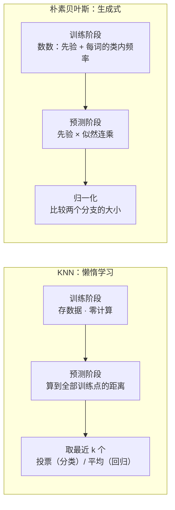
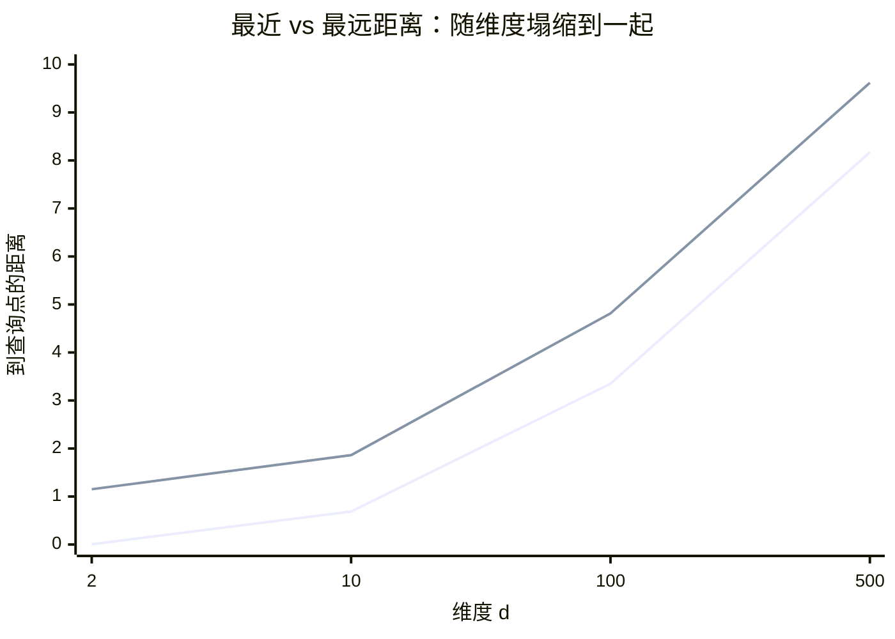

# 近邻与朴素贝叶斯：两个"老古董"的正篇

> **一句话理解**：K 近邻（KNN）是"不训练、只记忆，新样本问邻居"的最笨也最诚实的分类器；朴素贝叶斯是"假设特征互相独立，把联合概率拆成连乘"的最快生成式分类器——两个 1950~1960 年代的算法，至今仍活在推荐召回、文本过滤和工业基线里。

[⬆️ 返回总目录](../../../README.md) · [⬆️ 返回本篇](../README.md) · [⬅️ 返回本章目录](./README.md)

| 属性 | 说明 |
|------|------|
| 难度 | ⭐⭐（进阶） |
| 所属分支 | 通用基础 |
| 前置知识 | [机器学习全景](./01-机器学习全景.md)（判别 vs 生成）；[概率与统计](../../1-起步准备/02-数学基础/04-概率与统计.md)（贝叶斯公式） |

**本页两个主角，彼此独立可跳读**：

| 模型 | 一句话机制 | 与谁连接 |
|------|-----------|----------|
| KNN | 懒惰学习：训练零成本，预测时找 k 个最近邻居投票 | [06 聚类与降维](./06-聚类与降维.md)（同用距离）、[第 8 章 ANN](../../4-专业方向/08-推荐系统/03-双塔模型与向量召回.md) |
| 朴素贝叶斯 | 生成式：先统计每类"长什么样"，新样本比较似然连乘 | [01 全景](./01-机器学习全景.md)（生成式展开）、[03 逻辑回归](./03-逻辑回归与分类.md)（判别式对照） |

---

## 📌 这一节解决什么问题

[01 全景](./01-机器学习全景.md)用一小段带过了朴素贝叶斯，KNN 更是只在核方法的暗连里露过脸——这两个"教科书前两章常客"值得一个正篇，因为它们各自站在一条路线的极端：

- **参数化路线**（线性回归、逻辑回归、神经网络）：先假设函数形状，再用数据拧旋钮。好处是预测快，坏处是**假设错了全盘输**；
- **KNN 代表的非参数路线**：不假设任何函数形状，直接把训练集当"参考答案库"。训练几乎零成本，代价全押在预测时——每次预测都要翻库找邻居；
- **朴素贝叶斯代表的生成式路线**：不直接学判别边界，而是给每个类建一个"概率模型"，新样本来了比较"在哪类的模型下更像"。一个大胆的独立性假设把指数级的问题压缩成数数。

为什么 2026 年还要学它们？三个现实理由：KNN 是理解"距离、维度、懒惰学习"这些底层概念最干净的载体（第 8 章向量召回的暴力版就是它）；朴素贝叶斯是高维稀疏文本分类里"快、稳、小样本能开工"的常青树（垃圾邮件过滤的默认基线用了二十年）；更重要的是，它们的**失效模式**（维数灾难、独立性假设破产）是后面所有模型都要面对的普适问题。

## 🌱 通俗理解

**KNN = 搬家前先问老住户**。你想知道某个小区治安好不好，不用建什么模型——找到离它最近的三个小区，问问住那儿的人。这就是 KNN 的全部：**新样本的标签，由地理上最近的 k 个老样本投票决定**。注意它"懒"在哪：你从没"总结"过任何规律（没有训练），只是把 300 个小区的名单背在身上，每次有人来问，才现场挨个量距离。名单记得越全，判断越准——**KNN 的"模型"就是数据本身**。

**朴素贝叶斯 = 分诊台的老护士**。急诊护士没给你做全套检查，只扫了三个症状（发烧？出疹？关节痛？），心里各记一笔"这类病人里发烧的占八成"，三个"占比"一乘，再乘上"今天来的病人里流感占三成"，就大致知道你更像流感还是普通感冒。"朴素"在哪？她假设**每个症状独立说话、互不通气**——明明出疹和发烧常一起出现，她还是各记各的账。假设明明是错的，但分诊常常够用。

两家的对比一句话：**KNN 懒在训练、累在预测；朴素贝叶斯相反——数一遍语料就完事，预测只是一趟乘法**。

## 📋 举个例子

**KNN 手算：5 个点，k=3**。二维平面上 5 个训练点，新样本 $q=(3,\,3)$ 用欧氏距离找 3 个最近邻：

| 训练点 | 坐标 | 到 q 的距离 | 标签 |
|---|---|---|---|
| A | (3, 3.2) | $\sqrt{0+0.04}=0.20$ | 良性 |
| B | (2, 2) | $\sqrt{1+1}=1.41$ | 良性 |
| C | (4, 4) | $\sqrt{1+1}=1.41$ | 恶性 |
| D | (1, 4) | $\sqrt{4+1}=2.24$ | 良性 |
| E | (5, 1) | $\sqrt{4+4}=2.83$ | 恶性 |

最近三个是 A、B、C（1.41 并列都算），投票：良性 2 票 vs 恶性 1 票 → **判良性**。三个观察：一，训练 = 把这张表存下来，没有任何计算；二，`k=1` 时答案完全由 A 一票决定——单个噪声点就能带偏结果（高方差）；三，B 和 C 距离并列时怎么算，取决于实现（sklearn 按索引顺序取）——**并列是 KNN 工程里真实存在的小坑**。

**朴素贝叶斯手算：2 个词判一封邮件**。训练统计（沿用[概率与统计](../../1-起步准备/02-数学基础/04-概率与统计.md)垃圾邮件算例的同一批数据：垃圾邮件 8 封、正常 12 封）：

- 先验：$P(\text{垃圾})=0.4$，$P(\text{正常})=0.6$；
- "中奖"：垃圾中 6/8 = **0.75**，正常中 1/12 ≈ **0.083**；
- "会议"：垃圾中 1/8 = **0.125**，正常中 8/12 ≈ **0.667**。

新邮件只含【中奖、会议】。垃圾分支：$0.4\times0.75\times0.125=0.0375$；正常分支：$0.6\times0.083\times0.667\approx0.0332$。归一化：$0.0375/(0.0375+0.0332)\approx 53\%$——**几乎五五开**！两个词一正一反互相抵消，正是连乘结构"各词独立投票"的直观呈现（三词版本的手算在[第 2 章 04 页](../../1-起步准备/02-数学基础/04-概率与统计.md)折叠框里，答案 87%）。

<details>
<summary>📊 展开完整算例：换一组词，看连乘链的"杠杆"怎么加码</summary>

换邮件含【中奖、发票】："发票"在垃圾中 4/8 = 0.5、正常中 1/12 ≈ 0.083。

- 垃圾分支：$0.4\times0.75\times0.5=0.15$；
- 正常分支：$0.6\times0.083\times0.083\approx0.0041$；
- 归一化：$0.15/(0.15+0.0041)\approx 97\%$——两个"垃圾味"词同向叠加，概率从 53% 跳到 97%。

再看失败情形：把"发票"换成正常邮件里**出现 0 次**的词（比如"代开"）——$P(\text{代开}\mid\text{正常})=0$，正常分支整个归零，一票否决。补救是**拉普拉斯平滑（Laplace Smoothing）**：每个计数加 1、分母加词表大小，$(0+1)/(12+2)\approx0.071$，零概率被托底（机理在核心原理 ④ 与深潜二）。三个小算例合起来：**连乘对"同向证据"指数放大、对"零概率"一票否决——朴素贝叶斯的一切工程技巧（取对数、平滑）都是在驯服这条乘法链**。

</details>

## 🧠 核心原理

### 整体流程



> 👉 **人话**：两家把"贵的活"放在了相反的阶段——KNN 训练零成本、预测翻全库；朴素贝叶斯训练数一遍、预测一趟乘法。**训练贵预测便宜，还是训练便宜预测贵**，是部署时选模型的现实账（每天打分一亿次的系统，养不起 KNN 的暴力预测）。

### ① KNN：懒惰学习，模型就是数据

$$
\hat{y}(q) = \text{多数票}\big\{y_i : x_i \in \text{距 } q \text{ 最近的 } k \text{ 个训练点}\big\}
$$

> 👉 **人话**：新样本的答案 = 邻居们的多数意见。整个"学习"只发生在预测那一刻，训练集原样搬进内存——所以叫**懒惰学习（Lazy Learning）**，与线性回归那种提前拟好参数的**急切学习（Eager Learning）**相对。

**k 是什么旋钮**：`k=1` 边界完全贴着训练点，噪声点各自为政（背答案，高方差）；k 越大投票越平稳，但太大（如 `k=全部样本`）退化成"永远猜多数类"（高偏差）。k 是超参数，用[07 页](./07-模型评估与调优.md)的交叉验证选，**通常取奇数避免平票，经验起点 $\sqrt{n}$ 量级**。

**距离选什么**：欧氏距离是默认；特征量纲不齐时必须先标准化（"年收入（万）"会碾压"年龄（岁）"——这也牵出[10 特征工程](./10-特征工程.md)的尺度话题）；文本/高维稀疏数据常用余弦距离（只看方向不看长度）；曼哈顿距离在高维下更稳健（深潜一会讲为什么）。

**KNN 回归 = 局部平均**：把"投票"换成"求均值"——$\hat{y}(q)=\frac{1}{k}\sum_{i\in N_k(q)} y_i$，预测值就是 k 个最近邻标签的平均。它与[08 进阶专题](./08-进阶专题-经典ML理论高地.md)讲过的 Nadaraya–Watson 核平滑是近亲：核平滑用核值当权重，KNN 用"进不进前 k 名"当权重——**预测永远是训练标签的（某种）加权平均**。

**检索怎么不慢**：暴力 KNN 每次预测要和全部 n 个训练点算距离，$O(nd)$。低维（约 ≤20 维）用 **KD 树**把搜索空间对半切；高维下 KD 树退化（深潜一的解释），改用**近似最近邻（ANN）**——用极小的召回损失换几十倍速度，这正是[第 8 章向量召回](../../4-专业方向/08-推荐系统/03-双塔模型与向量召回.md)里 FAISS/HNSW 索引干的事。一句话：**KNN + embedding + ANN 索引 = 现代推荐系统的召回半壁江山**。

### 📐 数学深潜：维数灾难——高维下"人人一样远"

**①给出了 KNN 的机制，但没回答它最著名的软肋**：为什么维度一高，"最近邻"就开始失灵？这一节给一个能算的答案：距离集中（Distance Concentration）。

**严格陈述。** 设 $d$ 个坐标独立、均匀分布在 $[0,1]$ 上（即 $[0,1]^d$ 超立方上的均匀分布），任取两个点 $X, Q$，其欧氏距离 $D_d=\|X-Q\|$。则：

$$
\frac{D_d}{\sqrt{d}} \ \longrightarrow\ \sqrt{\tfrac{1}{6}} \quad (d\to\infty,\ \text{依概率})
$$

且 $D_d$ 的**相对波动**（标准差 ÷ 均值）以 $O(1/\sqrt d)$ 的速度收缩到 0——**所有点对的距离都塌缩到 $\sqrt{d/6}$ 附近，"最近"和"最远"的差距相对消失**。

> 👉 **人话**：坐标全在 0~1 之间，维度越多、平方项累加越多，任意两点的距离都逼近 $\sqrt{d/6}$ 这个"标准值"。二维里你有个贴身邻居（距离 0.005）和一个天涯海角（1.15）；五百维里最近和最远只差 18%——**"最近邻"这个概念本身被稀释了**。

**完整推导：大数定律一次到位。**

<details>
<summary>🧮 展开推导：把平方距离拆成 iid 求和，LLN 直接收编</summary>

**第一步：平方距离是 d 项独立之和。** 设 $X$ 与 $Q$ 是两个独立的均匀随机点（各坐标 $X_j, Q_j \sim U[0,1]$ 独立）：

$$
D_d^2 = \sum_{j=1}^{d} (X_j - Q_j)^2 \ \Big| \ \text{各项 iid 同分布——LLN 的理想燃料}
$$

单坐标贡献的期望：差 $X_j - Q_j$ 是两个独立均匀变量之差（均值 0、方差 $\frac{1}{12}+\frac{1}{12}=\frac16$ 的三角分布），于是 $\mathbb{E}\big[(X_j-Q_j)^2\big] = \frac{1}{6}$：

$$
\mathbb{E}[D_d^2] = \sum_{j=1}^{d}\frac{1}{6} = \frac{d}{6}, \qquad \mathrm{Var}(D_d^2) = \sum_{j=1}^{d}\mathrm{Var}\big[(X_j-Q_j)^2\big] = O(d)
$$

**第二步：LLN 收编平均值。** $\frac{D_d^2}{d} \to \frac{1}{6}$（依概率），开方（连续映射）得 $\frac{D_d}{\sqrt d}\to\sqrt{\frac{1}{6}}\approx 0.408$。方差与均值平方之比 $\frac{\mathrm{Var}(D_d^2)}{(\mathbb{E}[D_d^2])^2} = O(1/d)\to 0$——**相对波动按 $1/\sqrt d$ 消失**。

> 👉 **人话**：距离平方是"d 次独立抽签的平均"，抽签次数越多平均值越稳——大数定律对距离同样无情。每个点算出来的距离都高度接近 $\sqrt{d/6}$，于是"最近"与"最远"挤在同一小段里。这和[概率与统计](../../1-起步准备/02-数学基础/04-概率与统计.md)"掷一万次骰子均值钉死 3.5"是同一条定律，只不过这里钉死的是距离。验算：d=500 时代入得 $\sqrt{500/6}\approx 9.1$——数字例里最近 8.17、最远 9.62，恰好挤在它两侧。

</details>

**数字例（可复现，种子 0）**：200 个 $[0,1]^d$ 均匀随机点对一个查询点，最近/最远距离：

| 维度 d | 最近 | 最远 | (最远−最近)/最近 |
|---|---|---|---|
| 2 | 0.005 | 1.152 | 230.6（邻居概念清晰） |
| 10 | 0.687 | 1.862 | 1.71 |
| 100 | 3.350 | 4.814 | 0.44 |
| 500 | 8.171 | 9.619 | **0.18（最近只比最远近 18%）** |



> 👉 **人话**：两条线在二维时天差地别（一个贴身一个天涯），五百维时几乎并成一条——**维度是"最近邻"概念的溶解剂**。当最近的邻居只比最远的点近 18%，"邻居投票"就不再携带多少信息。

**反例与边界。**

1. **真实数据常有低维结构**：图像百万像素，但有效分布往往贴在低维流形上（[06 聚类与降维](./06-聚类与降维.md)）——"名义维度"高不等于"有效维度"高，KNN 在 embedding 空间里照样好用（第 8 章向量召回就是明证）；
2. **病在欧氏距离的均匀稀释，不全在 KNN**：换度量能缓病情——曼哈顿距离在高维下集中得更慢；对特征先做筛选/降维（去掉噪声维），等价于直接降低 d；
3. **KD 树的失效是同一个病**：KD 树靠"切掉另一半空间"提速，前提是最近邻大概率落在隔壁几个区域；高维下人人一样远，切哪半都得看——搜索退化回近似全量。这就是 ANN 用"近似"换速度的结构性原因（[第 8 章](../../4-专业方向/08-推荐系统/03-双塔模型与向量召回.md)）。

> 👉 **人话总结**：距离平方是 d 项独立平均，大数定律把它钉死在 $\sqrt{d/6}$ 附近——维度越高、距离越趋同，"最近邻"的信号越被稀释；KNN 想在高维活命，要么降维、要么换度量、要么接受近似检索。

### ③ 朴素贝叶斯：一个"错误"假设换来指数级省力

$$
\hat{y} = \arg\max_{c}\ P(y=c)\prod_{j=1}^{d} P(x_j \mid y=c)
$$

> 👉 **人话**：给每个类算一笔"先验 × 各特征似然连乘"的账，账大的赢。分母 $P(x)$ 对所有类相同，比较时直接约掉——**不用算那个臭名昭著的积分**（[第 2 章 04 页](../../1-起步准备/02-数学基础/04-概率与统计.md)讲过它为什么难算）。

**"朴素"到底朴素在哪**：严格的贝叶斯需要联合分布 $P(x_1,\dots,x_d\mid y)$——d 个特征的联合取值有 $2^d$ 种（布尔特征时），估它要指数级数据。条件独立假设**给定类别后特征互相独立**，把联合拆成 d 个一维分布的连乘：参数量从 $O(2^d)$ 塌缩到 $O(d)$。这笔账的完整推导在深潜二。

**文本场景的乘法链**：一封邮件 = 词袋（词出现与否/次数），似然就是"每个词在垃圾邮件里出现频率"的连乘——这正是 📋 里手算的那条链。工程上两个必备驯化：**取对数**（连乘变连加，防浮点下溢：$10^{-300}$ 直接溢出为零）；**拉普拉斯平滑**（未见词计数 +1，防一票否决）。

$$
\hat{P}(x_j=t \mid y=c) = \frac{N_{ct} + \alpha}{N_c + \alpha V}
$$

> 👉 **人话**：词 t 在类 c 里的频率估计 = （出现次数 + α）÷（该类总词数 + α×词表大小）。α=1 就是"每个词先垫 1 个假计数"——没见过的词不再概率归零，而是分到一小口。**类别样本越少，平滑托底的作用越大**（这其实是 Beta/Dirichlet 先验的后验均值，和[第 2 章](../../1-起步准备/02-数学基础/04-概率与统计.md)Beta–二项共轭"虚拟票"是同一件事）。

**生成式视角回链**：[01 全景](./01-机器学习全景.md)讲过判别 vs 生成——朴素贝叶斯学的是 $P(X, Y)=P(Y)\prod_j P(x_j\mid Y)$，先学会"每一类的邮件长什么样"（甚至能反过来"写"一封典型垃圾邮件），判断时用贝叶斯公式反推。**假设越强，小样本越占便宜**：8 封垃圾邮件就能开工（每类只估 d 个一维频率），而逻辑回归要直接学边界、需要更多样本才稳。代价是假设破产时输得彻底——词与词明明相关（"中奖"和"链接"焦不离孟），连乘会**重复计票、过度自信**。

### 📐 数学深潜：后验展开与独立分解——从链式法则到连乘

**③一句话给了连乘公式；这一节把这条乘法链的来历推干净**：链式法则怎么展开、独立假设在哪一步砍掉条件、平滑为什么恰好是 Dirichlet 先验。

**严格陈述。** 对任意分布，链式法则（它永远成立，不需要任何假设）：

$$
P(y \mid x_1,\dots,x_d) \ =\ \frac{P(y)\, P(x_1\mid y)\, P(x_2\mid y, x_1)\cdots P(x_d\mid y, x_1,\dots,x_{d-1})}{P(x_1,\dots,x_d)}
$$

若**条件独立假设**成立（$x_j \perp x_{-j} \mid y$），则每个因子退化为 $P(x_j\mid y)$，分母与 y 无关可丢弃：

$$
P(y \mid \mathbf{x}) \ \propto\ P(y)\prod_{j=1}^{d} P(x_j\mid y)
$$

> 👉 **人话**：完整版贝叶斯里，第 j 个特征的概率要看"在前 j−1 个特征已经出现的条件下"——一个套一个的俄罗斯套娃；独立假设一刀把每个套娃都换成单间："给定类别，各词自己管自己"。

**完整推导：三步走 + 平滑的概率身份。**

<details>
<summary>🧮 展开推导：链式法则 → 独立塌缩 → 对数化 → 平滑 = 共轭先验的后验均值</summary>

**第一步：链式法则展开（无假设）。** 联合分布按定义可拆：$P(y, x_1,\dots,x_d) = P(y)\prod_{j=1}^d P(x_j \mid y, x_1, \dots, x_{j-1})$。这是概率的乘法规则反复使用，永远成立。两边同除 $P(x_1,\dots,x_d)$ 得后验的完整表达式（上面的严格陈述）。

**第二步：独立假设砍条件。** 假设 $x_j \perp x_{1..j-1} \mid y$，则 $P(x_j\mid y, x_1,\dots,x_{j-1}) = P(x_j\mid y)$，d 个"套娃因子"全部塌缩成一维。**参数量对比**：布尔特征下，完整条件 $P(x_d\mid y, x_1,\dots,x_{d-1})$ 需要 $2^{d-1}$ 个参数（每种历史组合一套概率）；塌缩后全模型只要 $2d$ 个——**指数变线性，这就是"朴素"买的单**。

**第三步：分母约掉 + 取对数。** 比较 $P(y=1\mid\mathbf x)$ 与 $P(y=0\mid\mathbf x)$，分母 $P(\mathbf x)$ 相同，比分子即可（两个类的账各自连乘后归一化）。连乘取对数变连加：

$$
\log P(y\mid\mathbf x) \ \propto\ \log P(y) + \sum_{j=1}^{d}\log P(x_j\mid y)
$$

> 👉 **人话**：对数不改变大小关系（单调），却把"d 次连乘"变成"d 次连加"——数值上 $10^{-300}$ 这种乘法下溢问题消失；每个词的证据强度还能直接比大小："中奖"一词给垃圾分支的对数似然差是 $\log(0.75/0.083)\approx +2.2$，"会议"给正常分支 $\log(0.667/0.125)\approx +1.67$——谁是强证据、为谁说话，一眼看穿。

**第四步：平滑的概率身份。** 词频估计 $\hat\theta_{ct} = N_{ct}/N_c$ 是最大似然（MLE）；加 α 平滑后的估计 $\frac{N_{ct}+\alpha}{N_c+\alpha V}$，恰好是**先验 $\theta\sim\mathrm{Dirichlet}(\alpha,\dots,\alpha)$ 下的后验均值**——"每个词预先垫 α 个虚拟计数"。α=1（拉普拉斯）= 均匀先验；α<1 把概率质量更集中地留给高频词。完整推导与[第 2 章 Beta–二项共轭](../../1-起步准备/02-数学基础/04-概率与统计.md)逐字同构（那里是单伯努利、这里是 V 维词分布），此处不重复。

</details>

**概率解释（图景）：**

```text
 完整贝叶斯（套娃版）            朴素贝叶斯（独立版）
 P(y|x1..xd) ∝ P(y) ×           P(y|x1..xd) ∝ P(y) ×
   P(x1|y) ×                      P(x1|y) ×
   P(x2|y,x1) ×          ──►     P(x2|y) ×      ← 假设砍掉条件
   ...                             ...
   P(xd|y,x1..x(d-1))            P(xd|y)
 参数 O(2^d)：估不起            参数 O(d)：数一遍就会
```

**反例与边界。**

1. **相关特征 = 重复计票**：邮件里"中奖"和"链接"高度同现，连乘等于把同一份证据算两遍——后验过度自信（📋 的 97% 其实偏极端）。缓解：特征选择去掉冗余词、用词组（bigram）合并强共现对、或半朴素方法（独依赖估计 ODE 只允许一个"父亲"特征）；
2. **独立性假设几乎从不对，但分类决策常常仍对**：贝叶斯误差率有理论结果——只要每类的"似然比排序"不乱，错的概率只是让后验数值失真、不必然让 argmax 翻车。**朴素贝叶斯输出的"概率"别太当真（校准差），排序够用就好**（要校准的概率请回[03 逻辑回归](./03-逻辑回归与分类.md)）；
3. **想认真放松独立性假设**：特征间的依赖关系用图表达——正是[下一页概率图模型](./11-概率图模型.md)（贝叶斯网）的出发点，朴素贝叶斯是"无边图"的最简特例。

> 👉 **人话总结**：链式法则永远成立但指数级地贵，条件独立假设一刀把它砍成 d 个一维连乘——指数变线性；代价是相关证据被重复计票、概率过度自信。平滑的本质是 Dirichlet 先验的虚拟计数，救的是"没见过 ≠ 不存在"。

## 💻 动手试试

**实验一：KNN 不同 k 的决策边界对比**（不画图也能"看见"边界——用网格上的边界粗糙度代理）：

```python
import numpy as np
from sklearn.datasets import make_moons
from sklearn.model_selection import train_test_split
from sklearn.neighbors import KNeighborsClassifier

X, y = make_moons(n_samples=300, noise=0.25, random_state=42)
X_tr, X_te, y_tr, y_te = train_test_split(X, y, test_size=0.3, random_state=42)

# 边界粗糙度代理：网格上逐点预测，统计"与右邻格标签不同"的格子数
# 边界越长越毛糙 → 这个数越大；边界平滑 → 这个数小
def boundary_roughness(model, step=0.05):
    gx, gy = np.meshgrid(np.arange(X[:,0].min()-0.5, X[:,0].max()+0.5, step),
                         np.arange(X[:,1].min()-0.5, X[:,1].max()+0.5, step))
    lab = model.predict(np.c_[gx.ravel(), gy.ravel()]).reshape(gy.shape)
    return int(np.sum(lab[:, :-1] != lab[:, 1:]))     # 与右邻格不同的格子数

for k in [1, 5, 50]:
    knn = KNeighborsClassifier(n_neighbors=k).fit(X_tr, y_tr)   # “训练”只是存数据
    print(f"k={k:<3} 训练分 {knn.score(X_tr, y_tr):.3f}   "
          f"测试分 {knn.score(X_te, y_te):.3f}   边界粗糙度 {boundary_roughness(knn)}")

# 预期输出（可复现，数值随版本微动）：
# k=1   训练分 1.000   测试分 0.956   边界粗糙度 176   ← 训练满分：每个点都是自己的邻居
# k=5   训练分 0.933   测试分 0.944   边界粗糙度 120   ← 投票抹掉孤岛
# k=50  训练分 0.905   测试分 0.922   边界粗糙度  90   ← 过度平滑，双月牙开始粘连（欠拟合前兆）
```

改什么、看什么：把 `k` 扫过 `[1, 3, 7, 15, 30, 100, 210]`，看测试分先升后降的 U 形（[07 页](./07-模型评估与调优.md)偏差-方差的活标本）；再把 `noise` 调到 0.4，U 形左移（数据越吵，越需要大 k 抹平）。

**实验二：文本朴素贝叶斯实跑 + 平滑开关对照**：

```python
import numpy as np
from sklearn.feature_extraction.text import CountVectorizer
from sklearn.naive_bayes import MultinomialNB

texts = ["中奖 优惠券 点击 链接 领取", "免费 中奖 手机 号码 填写",   # 6 条垃圾
         "优惠券 免费 秒杀 抢购", "点击 链接 办理 贷款 低息",
         "发票 代开 税点 优惠", "中奖 兑换码 手机 一键 领取",
         "会议 时间 改到 下午 三点", "附件 是 本周 报告 请 查收",   # 6 条正常
         "午饭 一起 吃 食堂 吗", "报告 已 发送 邮箱 查收",
         "会议 纪要 整理 好 了", "明天 站会 时间 不变"]
labels = np.array([1, 1, 1, 1, 1, 1, 0, 0, 0, 0, 0, 0])      # 1=垃圾，0=正常

vec = CountVectorizer()                     # 词袋：每个词一列，数出现次数
X = vec.fit_transform(texts)

smooth = MultinomialNB(alpha=1.0).fit(X, labels)     # alpha=1：拉普拉斯平滑（计数+1）
raw    = MultinomialNB(alpha=1e-10).fit(X, labels)   # alpha≈0：关闭平滑

tests = ["中奖 链接 点击 领取", "会议 报告 查收", "发票 代开 税点"]
for t in tests:
    Xt = vec.transform([t])
    print(f"{t!r:22s} P(垃圾) 平滑={smooth.predict_proba(Xt)[0][1]:.3f}"
          f"   无平滑={raw.predict_proba(Xt)[0][1]:.3f}")

# 预期输出（可复现）：
# '中奖 链接 点击 领取'  P(垃圾) 平滑=0.988   无平滑=1.000
# '会议 报告 查收'      P(垃圾) 平滑=0.029   无平滑=0.000
# '发票 代开 税点'      P(垃圾) 平滑=0.864   无平滑=1.000   ← “代开”正常类计数 0：无平滑直接一票否决
```

改什么、看什么：把"代开"从正常类语料里造一个出现（把第 7 条改成"会议 代开 时间 三点"），无平滑版的 P(垃圾) 从 1.0 跳水——**平滑的托底只在"真的没见过"时出手**；再把 `alpha` 扫 [0.01, 0.1, 1, 10]，看概率如何从极端回归温和（α 越大越向先验 0.5 收缩）。

## 🔥 炼丹小灶

> 🔥 **炼丹小灶**：工业界常用起点配方与玄学——
> - 配方：KNN 的 k 用交叉验证选、奇数起步，特征先标准化；文本朴素贝叶斯默认 `MultinomialNB(alpha=1)` 或 `ComplementNB`（不平衡语料更稳），中文先分词再 CountVectorizer/TfidfVectorizer；
> - 玄学：KNN 在十万级以上样本就嫌预测慢——上近似检索（FAISS）或改用[第 8 章双塔](../../4-专业方向/08-推荐系统/03-双塔模型与向量召回.md)；朴素贝叶斯输出概率严重过度自信，别直接当风险分用，要校准或只取排序；
> - ⚠️ 以上是经验参考值，不是圣旨；换数据集请重新炼。

## 🖱️ 动手玩

> 🕹️ **延伸玩一玩**：[Seeing Theory](https://seeing-theory.brown.edu)——"概率直觉"章节里拖动滑块就能**看见贝叶斯更新**（先验 × 似然 → 后验）：把本页朴素贝叶斯的"先验 × 词频连乘"换成图形手感，亲眼看证据怎么一步步重新称量类别的概率。

## 🔗 在知识树中的位置

- **上游**：[机器学习全景](./01-机器学习全景.md)（判别 vs 生成的门派地图）；[概率与统计](../../1-起步准备/02-数学基础/04-概率与统计.md)（贝叶斯公式、共轭先验——本页深潜二的地基）；[聚类与降维](./06-聚类与降维.md)（同用"距离"语言，降维是对维数灾难的正攻法）。
- **下游**：[特征工程](./10-特征工程.md)（KNN 对特征尺度极敏感——标准化的正主）；[概率图模型](./11-概率图模型.md)（放松独立性假设的正式路线）；[第 8 章向量召回](../../4-专业方向/08-推荐系统/03-双塔模型与向量召回.md)（KNN + ANN 的工业形态）；[第 7 章 NLP](../../4-专业方向/07-自然语言处理与LLM/README.md)（文本分类谱系的下游）。
- **横向对比**：与[逻辑回归](./03-逻辑回归与分类.md)——生成式 vs 判别式的最小对照组：同为线性分类器家族，小样本/流式更新/高维稀疏选朴素贝叶斯，要校准概率与更强表达选逻辑回归。

## 🎓 深度视角

把这两位老将放进 2026 年的版图，最有意思的不是"它们还能用"，而是**它们各自定义了一条路线的极限**。KNN 把"非参数"推到尽头：模型即数据、零假设、零训练——代价是预测成本与存储全挂在线上，以及维数灾难这只结构性天敌；现代向量检索（embedding + ANN）本质是"给 KNN 减负"的工程化：先学一个好的表示（把数据搬到低维流形上），再近似搜邻居。朴素贝叶斯把"生成式 + 强假设"推到尽头：参数线性、小样本即战力——代价是概率失真；它的现代后代活得很好：语言模型"预测下一个词"就是一条巨大的似然链（[第 7 章](../../4-专业方向/07-自然语言处理与LLM/README.md)），只是"独立"换成了"自回归"。

<details>
<summary>❓ 深问一：KNN 训练误差为零（k=1 时），它是完美的学习器吗？</summary>

k=1 时每个训练点的最近邻是它自己，训练准确率恒为 100%——但这恰恰是**过拟合的定义式**而非学习的能力：它对训练集的"完美"来自背诵，不来自规律。真实水平要看测试误差：k=1 的测试误差 asymptotically 最多是最优贝叶斯误差的两倍（Cover & Hart, 1967），随 n→∞ 趋近贝叶斯误差——**KNN 是"渐进最优"的，但没说收敛多快**，高维下慢到无法接受（深潜一）。

</details>

<details>
<summary>❓ 深问二：朴素贝叶斯概率过度自信，为什么实际分类还是常赢？</summary>

两个原因。一，**判对只需要 argmax 对**：相关特征重复计票让 0.97 的后验其实只值 0.8，但只要垃圾分支的分数仍然稳定大于正常分支，决策不翻车——失真是"幅度"的，不是"方向"的。二，**高维稀疏下它的归纳偏置恰好合身**：文本分类里"每词独立贡献一点证据"虽不严格成立，却与语言的真实结构（主题由关键词集合决定）大体同构。这也是[01 全景](./01-机器学习全景.md)"没有免费午餐"的又一案例：赢，赢在偏置与问题匹配。

</details>

## 🔬 SOTA 演进

- **KNN**：作为"模型"退役到基线层，作为"机制"无处不在——向量数据库（FAISS、HNSW、IVF 类索引）把"找最近邻"做成了独立的基础设施，支撑[第 8 章召回](../../4-专业方向/08-推荐系统/03-双塔模型与向量召回.md)与[第 7 章 RAG](../../4-专业方向/07-自然语言处理与LLM/06-RAG与Agent.md)检索；近似检索理论（局部敏感哈希 LSH、图索引）是 KNN 的直系后代。
- **朴素贝叶斯**：垃圾邮件过滤一线服役二十年（配合 TF-IDF 与先验校准仍是小语料默认基线）；学术上的正统后代是[概率图模型](./11-概率图模型.md)与主题模型（LDA）；"生成式 + 词级概率链"的思想经语言模型发扬光大——从"词独立投票"到"词自回归生成"，是同一条贝叶斯血脉的两个时代。

## ❓ 开放问题

- **高维最近邻能否有理论保证的精确加速**：KD 树、LSH、HNSW 各自适应不同维度/度量区间，"任意分布下亚线性精确最近邻"的下界研究表明**近似是绕不开的税**——精度与速度的定量换算仍是活跃方向。
- **"朴素"的边界在哪**：独立性假设破坏到什么程度，朴素贝叶斯开始系统性输给判别式？经典理论只给了误差上界的定性对比，实践中靠实验裁决——特征相关性可测量时（互信息矩阵），这个判断有望半自动化。

## ⚠️ 常见误区

- **误区一**："KNN 不需要训练，所以简单" → 训练零成本不等于工程零成本：预测要存全部数据、算全部距离，n 大了必须上索引；数据漂移时"模型"直接过时，重训 = 换数据。
- **误区二**："k 越大越稳" → k 太大边界过度平滑（实验一 k=50 的双月牙粘连），极限是"永远猜多数类"——k 是偏差-方差旋钮，不是越大越好。
- **误区三**："朴素贝叶斯输出的 0.97 就是 97% 把握" → 相关特征重复计票使概率系统性过度自信，只可信其排序、不可信其数值（校准见[03 逻辑回归](./03-逻辑回归与分类.md)）。
- **误区四**："维数灾难只是理论洁癖" → 深潜一的数字例里，500 维时最近邻只比最远近 18%——不降维、不选特征的 KNN 在高维表格数据上是真实翻车现场。
- **误区五**："平滑是可选的美化" → 语料稍小必见零计数词，无平滑 = 一次一票否决；平滑是朴素贝叶斯的出厂必配件，不是锦上添花。

## 📝 小结与自测

**要点回顾**

- KNN = 懒惰学习：训练只存数据，预测找 k 个最近邻居投票（分类）或平均（回归）；模型即数据，与"提前拟参数"的急切学习相对；
- k 与距离是两大旋钮：k 管偏差-方差（1 = 背答案，过大 = 猜众数），距离管"什么算近"（量纲不齐必须标准化）；
- 维数灾难：距离平方是 d 项独立平均，大数定律把一切距离钉死在 $\sqrt{d/6}$ 附近——高维下最近与最远趋同，"邻居"概念被稀释；出路是降维、换度量、近似检索（ANN，[第 8 章](../../4-专业方向/08-推荐系统/03-双塔模型与向量召回.md)）；
- 朴素贝叶斯 = 生成式 + 条件独立：链式法则的套娃被一刀砍成 d 个一维连乘，参数指数变线性；文本场景"先验 × 词频连乘"，配对数化与拉普拉斯平滑（= Dirichlet 先验的虚拟计数）；
- 生成式视角（回链[01 全景](./01-机器学习全景.md)）：假设越强小样本越占便宜，假设破产概率失真——独立假设几乎从不成立但排序常常仍对。

**自测一下**（点击展开答案）

<details>
<summary>问题 1：KNN k=1 时训练准确率恒为 100%，这说明了什么？</summary>

什么都没说明——每个训练点的最近邻是它自己，"满分"来自记忆而非规律，是过拟合的定义式。真正要看的是测试误差与训练误差的差距；k=1 的价值在理论侧：n→∞ 时其误差不超过两倍贝叶斯误差（Cover & Hart），说明"最近邻"这个规则本身是健全的，慢的是高维下的收敛速度。

</details>

<details>
<summary>问题 2：500 维均匀分布数据上，KNN 为什么会失灵？用一句话与大数定律说清。</summary>

两点间距离的平方是 d 个独立坐标差的和，d 越大大数定律把它钉得越死——所有点对的距离都集中在 $\sqrt{d/6}$ 附近，最近与最远的相对差距按 $1/\sqrt{d}$ 消失；"最近邻"携带的判别信息随维度被稀释，投票近似随机。

</details>

<details>
<summary>问题 3：为什么朴素贝叶斯要取对数、要平滑？各自解决什么问题？</summary>

取对数解决数值问题：连乘几十个小概率会浮点下溢为零，log 把连乘变连加、且不改变大小关系（比较后验只需比较分子）。平滑解决统计问题：训练集没见过的词其 MLE 概率为零，连乘一次就一票否决整个类；加 α 平滑（Dirichlet 先验的后验均值）给每个词垫虚拟计数，托底零概率。

</details>

<details>
<summary>问题 4：同一份数据，小样本（每类几十条）文本分类，朴素贝叶斯和逻辑回归先上哪个？为什么？</summary>

先上朴素贝叶斯。生成式 + 强假设 = 小样本友好：每类只需估 d 个一维频率，几十条样本就能出像样的排序；逻辑回归直接学判别边界，参数要靠数据喂，小样本下方差大。数据涨到每类成千上万条后，判别式的表达力优势兑现，再切换或对照（[03 逻辑回归](./03-逻辑回归与分类.md)）。

</details>

## 📚 延伸阅读

- 书：《The Elements of Statistical Learning》第 4.4 节（KNN 与维数灾难）、第 6 章（朴素贝叶斯与生成式分类）
- 论文：Cover & Hart, *Nearest Neighbor Pattern Classification*（1967）——KNN 误差上界的经典出处
- 论文：McCallum & Nigam, *A Comparison of Event Models for Naive Bayes Text Classification*（1998）——多项式 vs 伯努利朴素贝叶斯
- 工具：sklearn 文档 `KNeighborsClassifier` 与 `MultinomialNB` 词条；FAISS 文档——KNN 的工业级加速形态

---

[⬅️ 上一页：进阶专题：经典 ML 理论高地](./08-进阶专题-经典ML理论高地.md) · [返回本章目录](./README.md) · [下一页：特征工程 ➡️](./10-特征工程.md)
