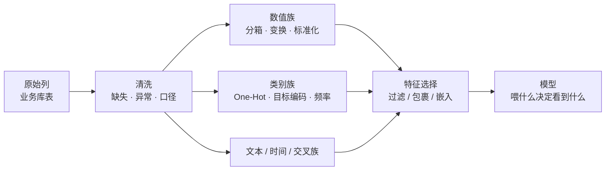

# 特征工程：把业务直觉翻译成数字

> **一句话理解**：特征工程（Feature Engineering）是"决定模型能看到什么"的手艺——原始数据里那些模型读不懂、读不到的关系（比值的含义、时间的趋势、类别的统计），由人先翻译成数字列；在深度学习统治原始信号的世界里，它依然是**表格数据上分数的第一来源**。

[⬆️ 返回总目录](../../../README.md) · [⬆️ 返回本篇](../README.md) · [⬅️ 返回本章目录](./README.md)

| 属性 | 说明 |
|------|------|
| 难度 | ⭐⭐（进阶） |
| 所属分支 | 通用基础 |
| 前置知识 | [机器学习全景](./01-机器学习全景.md)（特征/标签的基本概念）；[决策树与集成学习](./04-决策树与集成学习.md)（树怎么切特征）；[模型评估与调优](./07-模型评估与调优.md)（数据泄漏四形态） |

---

## 📌 这一节解决什么问题

模型是锅，特征是食材——锅再好，馊的食材做不出好菜。这句话在教科书里是陈词滥调，但它背后有一个精确的技术事实：**每种模型只能"看见"特定形状的关系**。逻辑回归看线性组合，树看"单特征阈值 + 少数交叉"，KNN 看距离——而业务里的关键规律常常不是这些形状："消费环比骤降"是个**比值**、"深夜下单"是个**时间交叉**、"这个品类在他家乡的转化率"是个**分组统计**。模型自己拼不出这些（或者要花巨大容量去拼），人提前拼好，等于替模型把最重要的减法做了。

那深度学习时代还做特征工程吗？看数据形态。图像、文本、音频这些**原始信号**领域，特征被网络层层自动学走（表示学习，[第 4 章引言](../../3-深度学习/04-深度学习基础/README.md)——那是一条独立路线）；但**结构化表格数据**——风控、营销、销量、运维，经典 ML 的王座至今未失（[08 专题三](./08-进阶专题-经典ML理论高地.md)讲过四条机理），而表格项目的分数上限，绝大多数时候由特征决定而非模型决定（[99 生产实战](./99-生产实战.md)的工时饼图：特征工程 15%、建模 15%，但对分数的贡献通常是倒挂的——**特征贡献大、调参贡献小**）。本页把这套手艺系统化：数值、类别、文本、时间、交叉五族怎么做，特征选择三路线怎么选，以及最容易翻车的目标编码泄漏怎么防。

## 🌱 通俗理解

把特征工程想成**做菜前的备菜**：

- **清洗**：烂菜叶摘掉（缺失值、异常值）——不摘，一锅汤全坏；
- **改刀**：整鸡切块（分箱、变换）——锅就那么大，形状不对炒不熟；逻辑回归这只"平底锅"只认差不多大小的块（标准化），树模型这只"大铁锅"无所谓块大块小（单调变换不变）；
- **腌制提味**：料酒去腥（log 压缩长尾）——收入这种"一根尾巴拖到一亿"的列，不压一下，普通模型被最富的几个人带偏；
- **搭配**：番茄配鸡蛋（交叉特征）——两样单独都平平，配在一起才是菜；
- **上菜前挑盘子**（特征选择）：二十道菜摆一桌反而没重点，挑出最有信号的几道。

最深的一层道理：**备菜决定上限，锅只决定你离上限多远**。这句话不是比喻——下一节的深潜会给出"特征里掺了答案"时分数怎么虚高的算术。

## 📋 举个例子

**右偏收入的 log 变换：五个人手算一遍**。某借贷场景 5 个用户的月收入（元）：

| 用户 | 原始收入 | $\log_{10}$（收入） |
|---|---|---|
| A | 5,000 | 3.70 |
| B | 8,000 | 3.90 |
| C | 12,000 | 4.08 |
| D | 30,000 | 4.48 |
| E | 1,000,000 | 6.00 |

原始列里 E 一个人占据 96% 的数值范围（极差 995,000），其余四人挤在 4% 里——任何依赖"距离/量级"的模型（[KNN](./09-近邻与朴素贝叶斯.md)、线性模型、神经网络）眼里，这列特征几乎等于"E 与其他人之差"。log 之后：极差从 200 倍压到 2.3 倍，A~D 重新拉开差距，E 不再是黑洞。**log 是右偏数据的"长尾压缩器"，代价是 E 和 D 的差距也被压小了**——保大端还是保细节，看业务。

**分箱的例子**：年龄 0~100 切成 [0-17, 18-25, 26-40, 41-60, 60+] 五档。对逻辑回归，原始年龄只有"一根线性杠杆"；分箱后每档一个自由度——**"18-25 岁风险陡增、60 岁后风险回落"这种非单调关系，线性模型也能表达**。代价是样本被切碎：60+ 若只有 30 人，这一档的估计就发抖（过拟合）。

<details>
<summary>📊 展开完整算例：比值特征怎么把"两个平庸列"变成"一个强列"</summary>

流失预测场景，两个原始列（[99 生产实战](./99-生产实战.md)时间窗特征族的迷你版）：

| 用户 | 近 7 天登录 | 前 7 天登录 | 比值（近/前） | 业务含义 |
|---|---|---|---|---|
| 甲 | 14 | 15 | 0.93 | 稳定活跃 |
| 乙 | 2 | 14 | 0.14 | **断崖式降温——强流失信号** |
| 丙 | 2 | 2 | 1.00 | 一贯低频，未必流失 |
| 丁 | 14 | 2 | 7.00 | 回流/爆发 |

关键观察：**"近 7 天 = 2"单独看，乙和丙完全一样**——原始两列对这两个人无区分力；比值一算，0.14 vs 1.00 立刻分开。树模型理论上能通过两次切分（近 7 天 < 5 且 前 7 天 > 10）拼出这个组合，但要消耗两层深度与更多样本；**直接把比值做成一列，等于把最重要的减法与除法提前替模型做好**。这不是锦上添花——在 GBDT 实战里，"环比/斜率/占比"类交叉特征常年霸占特征重要性的前排。

</details>

## 🧠 核心原理

### 整体流程



> 👉 **人话**：特征工程不是"想特征"一个动作，是一条流水线——清洗定生死（垃圾进垃圾出）、变换定形状（模型能不能看见这个关系）、选择定聚焦（噪声列少进考场）。每一站都有专门的工具与专门的坑。

### ① 之前的必修课：缺失与离群

变换之前先过两道安检。**缺失值**的三种处置（不是"删了完事"）：

| 处置 | 做法 | 适用与坑 |
|------|------|----------|
| 删除 | 整行/整列丢 | 缺失比例小且随机——**非随机缺失（收入高的人不填收入）下删除 = 选择偏差**，模型再也学不到"高收入"样本 |
| 填充 | 均值/中位数/同组均值/模型预测填充 | 均值填右偏列会被拉歪（中位数更稳）；**必须在训练集上 fit 统计量再应用到测试**（[07 页](./07-模型评估与调优.md)泄漏形态一） |
| 缺失当信息 | 加一列"是否缺失"标记 + 简单填充 | **缺失本身常有信号**（收入栏空着的人行为迥异）——标记列常常进特征重要性前十，别浪费 |

**离群值**：先问"是数据错误还是真实极端"——录成 999 岁是错误（修正/删），亿万富翁的真实收入是极端（保留但 **winsorize 缩尾**：把超过 99 分位的值截断到 99 分位，或 log 压缩）。树对离群无感（切分只看排序），线性/距离类模型会被一个极端点拖着走（[09 页](./09-近邻与朴素贝叶斯.md)KNN 的距离账）。

### ② 数值特征：分箱、变换、标准化

**变换**：log 治右偏（收入、时长、频次——📋 的五人算例）；Box-Cox 是 log 的推广（一个参数 λ 自动在"log/线性/开方"家族里挑最正态的那个，sklearn 一行 `PowerTransformer`）；**什么时候不用变**：树模型对**单调变换完全无感**——切分点是按排序找的，log 前后排序不变，切出的树一模一样。

**标准化**：减均值除方差，把各列拉到同一尺度。谁需要：KNN（距离被大量纲列垄断，[09 页](./09-近邻与朴素贝叶斯.md)）、线性/逻辑回归（系数可比性）、神经网络、带正则的模型（L2 罚对"量纲被拉长 1000 倍的列"罚得莫名地轻——尺度不齐等于变相免罚某些特征）。谁不需要：**树模型**（同上，只看排序）。工程铁律：**fit 只在训练集上做**（[07 页](./07-模型评估与调优.md)泄漏形态一）。

**分箱**：等宽（简单但被离群点毁）、等频（每箱人数相同，抗离群）、**决策树分箱**（拿单特征训一棵浅树，箱边界=树的切分点——每箱内标签最纯，最常用）。分箱把数值变类别，可与 one-hot/WOE 编码组合。

### ③ 类别特征：One-Hot 的维度爆炸 vs 目标编码

| 编码 | 做法 | 优点 | 坑 | 适用 |
|------|------|------|-----|------|
| One-Hot | 每个取值一列 0/1 | 无序、简单、线性模型友好 | **高基数爆炸**：1 万个城市 = 1 万列，稀疏又费内存；树在"万列稀疏"里切不动 | 低中基数（<几百） |
| 序数编码 | 取值映射成 1,2,3… | 一列搞定 | **制造假顺序**：城市 1 和城市 2 没有大小的含义，线性模型会硬学 | 仅真有序的特征（学历、评级） |
| 频率编码 | 换成"该取值出现的次数/占比" | 一列、无泄漏风险 | 只表达流行度，不表达与标签的关系 | 辅助特征 |
| 目标编码 | 换成"该取值上标签的统计量（如历史流失率）" | 一个特征顶一万列，高基数天选 | **用标签造特征——天然带泄漏体质**（深潜专题） | 高基数 + 严格交叉拟合 |

**目标编码为什么诱人**：城市有 5000 个取值，One-Hot 5000 列；目标编码一列——"这座城市的历史流失率"。信息密度碾压。但它本质是**用 y 造 x**，是[07 页](./07-模型评估与调优.md)泄漏四形态里"全量预处理 × 标签代理"的合体加强版——泄漏机理与修复的完整数学在下面深潜，代码实验在 💻 节。

### 📐 数学深潜：目标编码的泄漏机理与 K 折交叉拟合

**③说目标编码"天然带泄漏体质"；这一节把泄漏算成一笔精确的账**：一个样本自己的标签，以多大的权重混进了它自己的特征值——以及交叉拟合怎么把这个权重归零。

**严格陈述。** 设类别 $c$ 有 $m$ 个训练样本，其中当前样本自己的标签为 $y_i$。带平滑（强度 $\alpha$、全局均值 $\bar y$）的目标编码：

$$
\text{TE}(c) = \frac{\sum_{j \in c} y_j + \alpha \bar y}{m + \alpha} = \frac{y_i + \sum_{j \in c,\, j\ne i} y_j + \alpha \bar y}{m + \alpha}
$$

**该编码与自身标签的协方差为**（$y_j\ (j\ne i)$ 与 $y_i$ 独立同分布时）：

$$
\operatorname{Cov}\big(\text{TE}(c),\ y_i\big) = \frac{\operatorname{Var}(y)}{m+\alpha}
$$

> 👉 **人话**：分子里明晃晃地含着 $y_i$ 自己——**样本的标签以 $\frac{1}{m+\alpha}$ 的权重直接写进了它的特征**。类别越小（$m$ 小）、平滑越弱（$\alpha$ 小），泄漏越重；$\alpha=0$ 且 $m=1$ 的极端情形，特征值 = 标签本身，"预测"退化成抄答案。取 $\alpha=10$ 看三档类别大小：

| 类别样本数 m | 泄漏权重 1/(m+10) | 直觉 |
|---|---|---|
| 1 | 9.1% | 冷门类别几乎裸奔（长尾类别是泄漏重灾区） |
| 4 | 7.1% | 💻 节实验的设置——累计出单特征 AUC 0.767 |
| 40 | 2.0% | 大类别被稀释，但仍非零——**稀释 ≠ 消毒** |

**完整推导：三行算术 + 单特征 AUC 的账。**

<details>
<summary>🧮 展开推导：协方差怎么来、为什么“平均每类 4 行”就能把 AUC 推高 0.27</summary>

**第一步：拆出自己。** 上式已把 $\sum_{j\in c} y_j = y_i + \sum_{j\ne i} y_j$ 拆开。$\text{TE}(c) = \frac{1}{m+\alpha}y_i + \text{（与 } y_i \text{ 无关的项）}$。

**第二步：算协方差。** 协方差对常数项无感，只剩自己那一项乘出来：

$$
\operatorname{Cov}(\text{TE}, y_i) = \frac{1}{m+\alpha}\operatorname{Cov}(y_i, y_i) = \frac{\operatorname{Var}(y)}{m+\alpha}
$$

**第三步：这笔账换算成 AUC 是多少。** 单特征 AUC ≈ 该特征与标签的秩相关。设 $y\sim\text{Bernoulli}(p_0)$，$\operatorname{Var}(y)=p_0(1-p_0)$。特征 = 信号 $\frac{1}{m+\alpha}y_i$ + 噪声 $\frac{\sum_{j\ne i}y_j+\alpha\bar y}{m+\alpha}$，信噪比随 $\frac{1}{m+\alpha}$ 线性放大。对照 💻 节实验的参数：$m\approx 4$（20000 行 ÷ 5000 类）、$\alpha=10$，权重 $\frac{1}{14}\approx 7\%$——看似不多，但 5000 个类别**各自独立地各泄漏一点**，汇总成单特征 AUC 0.767（一个与标签完全无关的噪声列！）。

> 👉 **人话**：泄漏不需要每条样本都漏得多——**每个类别漏一点点，几千个类别加起来，一个纯噪声特征就能"考"出 0.77 的 AUC**。这是"温和泄漏最常见、也最容易被放过"（[07 页](./07-模型评估与调优.md)误区四）的定量版。

</details>

**K 折交叉拟合（Cross-Fitting / Out-of-Fold）的正确做法**：把训练集分 K 折，**当前样本所在折的标签不许参与算它自己的编码**——


数学上：交叉拟合后 $\text{TE}_{-i}(c) = \frac{\sum_{j\in c,\, j\ne i, j\in \text{他折}} y_j + \alpha\bar y_{\text{他折}}}{m_{\text{他折}}+\alpha}$，分子里**没有 $y_i$**，$\operatorname{Cov}(\text{TE}_{-i}, y_i)=0$——泄漏项被结构性删除，而不是"被平滑稀释"。

**反例与边界。**

1. **平滑不是解药**：$\alpha$ 调大只是把泄漏权重从 $\frac{1}{m}$ 压到 $\frac{1}{m+\alpha}$（买不回独立性），且 $\alpha$ 过大编码退化为全局均值（信息全失）——**平滑治小样本方差，交叉拟合治泄漏，两味药各治各的病，都得吃**；
2. **时间场景更严**：线上编码只能用"打分时刻之前"的窗口重算（[07 页](./07-模型评估与调优.md)时间穿越形态 + [99 生产实战](./99-生产实战.md)"只用过去"三件套），交叉拟合之上还要加时间边界；
3. **分组泄漏叠加**：同一类别下的样本常高度相关（同城市用户共享经济环境），随机 K 折可能仍把"同城市的兄弟样本"留在编码集里——严格场景按类别分组切分（`GroupKFold` 思路）。

> 👉 **人话总结**：目标编码的特征值里含着样本自己的标签，权重 $\frac{1}{m+\alpha}$——类别越稀泄漏越狠，几千个类别能把纯噪声抬到 AUC 0.77；唯一根治是交叉拟合：**你的编码，不许看你的答案**。

### ④ 文本、时间、交叉特征一族

- **文本**：词袋/TF-IDF（[09 页](./09-近邻与朴素贝叶斯.md)词袋 + sklearn `TfidfVectorizer`）是经典 ML 的标配；深度时代的文本特征=embedding（[第 7 章](../../4-专业方向/07-自然语言处理与LLM/README.md)），常作为一列拼进表格模型；
- **时间**：绝对时间戳本身几乎无用，有用的是**相对量**——距上次行为天数、星期几/小时（周期 one-hot）、节假日标记；以及[99 生产实战](./99-生产实战.md)的时间窗三族：多尺度计数（近 7/30/90 天）、趋势环比（📋 乙用户的 0.14）、稳定性（标准差）；
- **交叉**：两个特征的四则运算与分组统计——比值（近/前）、差（到期日 − 今天）、分组聚合（该用户在该品类的 30 天消费额）。「用户 × 品类」这类交叉统计，是表格竞赛与工业特征的主战场。

### ⑤ 特征选择三路线

| 路线 | 做法 | 代表 | 优点 | 缺点 |
|------|------|------|------|------|
| 过滤（Filter） | 先按统计量筛，与模型无关 | 方差阈值、互信息、单特征 AUC、相关系数 | 极快、可先跑 | 不看特征**组合**：两个单独平庸、组合很强的特征会被误杀 |
| 包裹（Wrapper） | 用模型成绩当裁判，反复试子集 | 前向/后向逐步选择、递归特征消除 RFE | 直接优化目标、考虑组合 | **贵**（每组子集重训）；验证集被反复使用，本身有泄漏风险 |
| 嵌入（Embedded） | 训练过程中顺带完成选择 | L1（[07 页](./07-模型评估与调优.md)菱角稀疏）、树模型特征重要性 | 一次训练搞定、便宜 | 重要性偏向高基数与连续特征（对树而言可切点多的列"显得"重要）；不稳定（换种子榜单会洗牌） |

> 👉 **人话**：三路线是"体检 → 试穿 → 裁缝内嵌"——过滤当**预筛**（砍掉明显没信号的，省时间），嵌入当**主力**（树重要性 + L1 是默认起手），包裹留给最后精修（样本小时才用得起）。工业实践通常不止步于"删列"：**理解为什么这个特征强**（标签代理？泄漏？真业务信号？）比删掉它更重要。

### ⑥ 自动特征：深度学习与 AutoML

前面四节都是**人拼特征**；另一条路线是让机器学特征。**深度学习 = 自动表示学习**：原始像素/文字进网络，逐层长出中间特征，人不再手工设计——这正是[第 4 章引言](../../3-深度学习/04-深度学习基础/README.md)的主题，也是"图像文本归深度、表格归手工特征 + 树"这条分界线的由来（[08 专题三](./08-进阶专题-经典ML理论高地.md)：表格无空间结构可利用，自动特征学不出便宜的好货）。**AutoML** 一句话：把"选模型 + 调参 + 基础特征变换"打包自动化（TPOT、auto-sklearn、H2O；表格基础模型 TabPFN 是另一路"免调参"攻势，见[04 页](./04-决策树与集成学习.md)）——它自动化的是**流程**，不是**业务直觉**：什么该交叉、什么口径可信，AutoML 不懂你的业务。

### ⑦ 收尾账单：五种模型各要特征工程"伺候"什么

把本章出场过的模型对特征的需求排成一张账单——它同时是"变换该做到什么程度"的速查表：

| 模型 | 标准化 | 单调变换（log） | 缺失值 | 高基数类别 | 特征工程的主攻方向 |
|------|--------|----------------|--------|-----------|--------------------|
| 线性/逻辑回归 | **要**（系数可比 + 正则公平） | **要**（治右偏，保线性假设不崩） | 要填 | One-Hot（列数爆炸） | 变换 + 分箱 + 交叉（非线性全靠人造） |
| KNN / 距离类 | **要命**（量纲 = 投票权重） | 要 | 要填 | One-Hot（高维稀释距离） | 尺度对齐 + 降维（[09 页](./09-近邻与朴素贝叶斯.md)） |
| 朴素贝叶斯 | 不要 | 不要 | 词袋天然稀疏 | 每词一维（正对口） | 特征选择（独立性越真越灵） |
| 树 / GBDT | 不要 | **不要**（排序不变） | 近似原生容忍 | 能吃序数但切不动万级 One-Hot | **比值 + 分组聚合**（它拼不出的形状） |
| 神经网络 | **要** | 要 | 要填/加标记 | embedding 层（高基数正对口） | 表示交给网络，人管口径与泄漏 |

> 👉 **人话**：越"原始"的模型（线性、距离类）越要人把数据捋成它能读的形状；越"聪明"的模型（树、网络）越能吃生食——但**没有任何模型自己拼得出"分组统计"与"业务比值"**，也没有任何模型替你把泄漏挡在门外。这张表的每一格，都对应本页前面的一节。

## 💻 动手试试

**实验：造一个"与标签完全无关"的高基数混杂特征，亲眼看目标编码泄漏与修复**（对照实跑）：

```python
import numpy as np
from sklearn.model_selection import train_test_split, StratifiedKFold
from sklearn.linear_model import LogisticRegression
from sklearn.metrics import roc_auc_score

rng = np.random.default_rng(7)
n = 20000
x1 = rng.normal(size=n)                       # 真实信号：唯一的连续特征
y = (rng.random(n) < 1/(1+np.exp(-x1))).astype(int)
city = rng.integers(0, 5000, size=n)          # 混杂特征：5000 个类别，与标签完全无关

tr, te = train_test_split(np.arange(n), test_size=0.3, random_state=42, stratify=y)
gmean = y.mean()

def fit_te(cities, labels, alpha=10):         # 平滑目标编码：返回 类别→编码 映射
    stat = {}
    for c, lab in zip(cities, labels):
        stat.setdefault(c, [0, 0]); stat[c][0] += lab; stat[c][1] += 1
    return {c: (s + alpha*gmean)/(m + alpha) for c, (s, m) in stat.items()}
def apply_te(mp, cities):                     # 没见过的类别回退到全局均值
    return np.array([mp.get(c, gmean) for c in cities])

# ---- ① 泄漏现场：先在【全量数据】上算编码，再划分（07 页“全量预处理”的类别版）----
mp_leak = fit_te(city, y)                     # 用了全部标签——含测试行自己的 y！
te_leak = apply_te(mp_leak, city)

# ---- ② 修复：训练集内 5 折交叉拟合（OOF）；测试行用“仅训练集”的映射 ----
oof = np.zeros(len(city))
skf = StratifiedKFold(n_splits=5, shuffle=True, random_state=42)
for f_tr, f_va in skf.split(city[tr], y[tr]):
    mp = fit_te(city[tr][f_tr], y[tr][f_tr])  # 当前折的标签绝不参与自己的编码
    oof[tr[f_va]] = apply_te(mp, city[tr][f_va])
te_fix_te = apply_te(fit_te(city[tr], y[tr]), city[te])   # 测试行：只用训练标签

def auc(f_tr, f_te):                          # 同一个逻辑回归，只换编码方式
    m = LogisticRegression().fit(np.c_[x1[tr], f_tr], y[tr])
    return roc_auc_score(y[te], m.predict_proba(np.c_[x1[te], f_te])[:, 1])

print(f"只用真实信号 x1     测试 AUC = {auc(np.zeros(len(tr)), np.zeros(len(te))):.3f}")
print(f"泄漏编码  x1+泄漏TE 测试 AUC = {auc(te_leak[tr], te_leak[te]):.3f}")
print(f"交叉拟合  x1+OOF_TE 测试 AUC = {auc(oof[tr], te_fix_te):.3f}")
print(f"单特征 AUC：泄漏TE = {roc_auc_score(y[te], te_leak[te]):.3f}"
      f"（纯噪声列！）  修复TE = {roc_auc_score(y[te], te_fix_te):.3f}")

# 预期输出（可复现）：
# 只用真实信号 x1     测试 AUC = 0.745   ← 真实水平
# 泄漏编码  x1+泄漏TE 测试 AUC = 0.840   ← 无关特征凭泄漏虚高近 0.1
# 交叉拟合  x1+OOF_TE 测试 AUC = 0.745   ← 修复后回到真实水平
# 单特征 AUC：泄漏TE = 0.767（纯噪声列！）  修复TE = 0.498
# —— city 与标签完全独立：0.767 全部来自“答案混进特征”，0.498 才是它该有的样子
```

改什么、看什么：把类别数从 5000 改到 500（每类 40 行，$m$ 变大），泄漏 TE 的单特征 AUC 从 0.767 明显回落——**泄漏权重 $\frac{1}{m+\alpha}$ 随类别变大而稀释**（深潜公式现场）；再把 `alpha` 从 10 调到 0，泄漏加重——**平滑压不满泄漏**，两味药治两种病。

**实验二：分箱如何让逻辑回归"看见"非单调规律**（U 形风险——年轻与高龄两头危险，中间安全）：

```python
import numpy as np
from sklearn.linear_model import LogisticRegression
from sklearn.metrics import roc_auc_score

rng = np.random.default_rng(3)
n = 20000
age = rng.uniform(0, 100, n)
risky = ((age >= 18) & (age <= 30)) | (age >= 75)   # 真实规律：U 形——两头 0.40、中间 0.15
y = (rng.random(n) < 0.15 + 0.25 * risky).astype(int)

# 版本 A：原始年龄直接进模型——线性只能“一路涨或一路跌”，U 形两头只能看见一头
m_raw = LogisticRegression().fit(age.reshape(-1, 1), y)
auc_raw = roc_auc_score(y, m_raw.predict_proba(age.reshape(-1, 1))[:, 1])

# 版本 B：等宽分箱 6 档 + One-Hot——每箱一个自由度，同一只逻辑回归学会“两头高中间低”
edges = [0, 18, 30, 45, 60, 75, 100]
bin_id = np.digitize(age, edges[1:-1])             # 每个样本落进 0~5 号箱
oh = np.eye(len(edges) - 1)[bin_id]                # One-Hot：每箱一列
m_bin = LogisticRegression().fit(oh, y)
auc_bin = roc_auc_score(y, m_bin.predict_proba(oh)[:, 1])

print(f"原始年龄直线拟合   AUC = {auc_raw:.3f}")
print(f"分箱+One-Hot 拟合  AUC = {auc_bin:.3f}")
print("各箱实际风险率:", [round(y[bin_id == b].mean(), 3) for b in range(len(edges) - 1)])

# 预期输出（可复现）：
# 原始年龄直线拟合   AUC = 0.587   ← 直线只能抓到“高龄”那半边 U
# 分箱+One-Hot 拟合  AUC = 0.659   ← 两头都抓到
# 各箱实际风险率: [0.149, 0.396, 0.148, 0.15, 0.153, 0.401]   ← U 形一目了然
```

改什么、看什么：把箱边界换成 `np.quantile(age, [0, 0.2, 0.4, 0.6, 0.8, 1])`（等频分箱）——U 形被切得七零八落，AUC 掉头向下：**等宽不对齐业务断点（18/30/75 这些"人生阶段"边界）时，等频照切只会切碎信号**；这就是"决策树分箱"流行的原因——让树替你找边界。

## 🔥 炼丹小灶

> 🔥 **炼丹小灶**：工业界常用起点配方与玄学——
> - 配方：数值列默认"先分位数看分布再定变换"（右偏就 log）；类别低基数 One-Hot、高基数目标编码（OOF + 平滑 α=10~100）；每次新特征进组必须过"单特征体检"（AUC/互信息异常高的先查泄漏再庆祝）；
> - 玄学：分数不动时，别换模型——回去翻数据；新管道上逻辑回归分数好得离谱，八成是泄漏（笨基线当烟雾报警器，[01 全景](./01-机器学习全景.md)）；特征重要性榜首突然换人，先怀疑上游口径改版，再怀疑真规律；
> - ⚠️ 以上是经验参考值，不是圣旨；换数据集请重新炼。

## 🔗 在知识树中的位置

- **上游**：[机器学习全景](./01-机器学习全景.md)（特征 = 题目条件的定义）；[模型评估与调优](./07-模型评估与调优.md)（本页深潜是它泄漏主题的延伸）；[决策树与集成学习](./04-决策树与集成学习.md)（树对变换无感——特征工程的适用边界）。
- **下游**：[99 生产实战](./99-生产实战.md)（时间窗三族、目标编码三件套的落地版）；[第 4 章深度学习](../../3-深度学习/04-深度学习基础/README.md)（自动表示学习——特征工程的替代路线）；[第 7 章 NLP](../../4-专业方向/07-自然语言处理与LLM/README.md)（文本特征的 embedding 化）。
- **横向对比**：手工特征 vs 学习特征的分界线在数据形态（表格 vs 原始信号），判据两条——**输入有没有结构先验、数据量够不够付特征学习的学费**（[08 专题三](./08-进阶专题-经典ML理论高地.md)）。

## 🎓 深度视角

特征工程常被当成"没有理论的苦力活"，其实它有清楚的理论坐标：**它是人在"归纳偏置"层面下注**。[01 全景](./01-机器学习全景.md)说选模型 = 选假设，特征工程比选模型更靠前——你在决定模型**能看见哪个假设空间**。做"近 7 天/前 7 天"的比值，等于告诉模型"我认为环比重要"；做"用户 × 品类"交叉，等于注入"兴趣是分品类结构化的"这一先验。深度学习没有取消这件事，而是把它**搬进网络结构**（卷积 = "局部性重要"、注意力 = "两两关系重要"）——先验没消失，只是从特征表挪到了架构里。表格数据之所以仍是手工特征的天下，正因为表格没有可供架构利用的空间/序列结构（[08 专题三](./08-进阶专题-经典ML理论高地.md)），先验只能由人一列一列写进特征表。

<details>
<summary>❓ 深问一：树模型那么强（对尺度无感、自动找切分），交叉特征还有必要吗？</summary>

有必要，但价值变了。树能拼出"x>3 且 y<5"的交叉，却拼不起除法和分组统计："近/前比值"需要树在两列上各切几刀、用多层路径近似一个除法——深度与样本都要付账；"该用户在该品类的 30 天消费额"这种**分组聚合**，树从原始行级数据根本拼不出（信息在别的行里）。经验法则：**比值/差值/聚合统计必须手工做**（模型拼不起），"阈值与阈值组合"可以交给树（它的母语）。此外交叉特征还有解释红利：一个明晃晃的"环比"列，业务方看得懂，SHAP 归因也干净。

</details>

<details>
<summary>❓ 深问二：特征越多越好吧？反正模型自己会学——错在哪？</summary>

三个层面的账。统计层面：维度升高，样本相对变稀（[09 页](./09-近邻与朴素贝叶斯.md)维数灾难），噪声特征稀释真信号，线性模型的方差随维度涨；计算层面：训练与线上打分都按列数付钱，几千个无用列是纯浪费；工程层面：每列都是一条管道，都可能漂移、都可能泄漏——**维护成本与泄漏面随列数线性增长**。正确姿势是"宽进严出"：先大胆造（特征生成便宜），再用过滤 + 嵌入 + 业务审查严筛（④的三路线），而不是把仓库整表倒进模型。

</details>

## 🔬 SOTA 演进

- **表示学习吃下原始信号**：图像/文本/音频的手工特征（SIFT、TF-IDF 之外的人工特征）已基本退役，embedding 成为准格式——表格模型也常把"文本列的预训练向量"当一列拼进来（[第 7 章](../../4-专业方向/07-自然语言处理与LLM/README.md)外溢）。
- **表格自动化两条攻势**：AutoML（特征变换 + 模型选择 + 调参的流水线自动化）在中小数据上已是成熟工具；表格基础模型（TabPFN 类，合成数据预训练 + 免调参推理，[04 页](./04-决策树与集成学习.md)）从小样本分类开始撬动——两条路都**没有**替代"业务直觉拼特征"：交叉什么、什么口径可信，仍是人的领地。
- **泄漏检测制度化**：特征仓库（feature store）的卖点之一就是 point-in-time 正确性（[07 页深问三](./07-模型评估与调优.md)）；单特征 AUC 审计、OOF 化的目标编码工具（`category_encoders` 的 `TargetEncoder` 已内置 CV）正在把"防泄漏"从手艺变成默认行为。

## ❓ 开放问题

- **特征工程的自动化边界**：深度十字路口十年，表格上"自动学特征"始终没打过"手工 + 树"（[08 专题三](./08-进阶专题-经典ML理论高地.md)四条机理）；TabPFN 类预训练模型能否把"业务直觉"也学进先验，是未来几年最值得围观的变量。
- **可解释性与特征工程的张力**：交叉特征越好用，解释越间接（"用户×品类均值"怎么跟监管解释？）——强特征与合规解释之间的取舍没有理论答案，只有场景答案。

## ⚠️ 常见误区

- **误区一**："深度学习时代，特征工程过时了" → 只在原始信号领域成立；表格数据的王座仍是"手工特征 + GBDT"（[99 生产实战](./99-生产实战.md)），特征决定分数上限。
- **误区二**："树模型什么特征都能吃，所以特征工程可以省" → 树免的只是"变换"（单调无感），拼不出**比值与分组聚合**（深问一）；缺失值也远不是"都能吃"那么省心。
- **误区三**："目标编码加了平滑就不会泄漏" → 平滑只把泄漏权重从 $\frac{1}{m}$ 压到 $\frac{1}{m+\alpha}$，协方差恒非零；根治靠交叉拟合（深潜的账）。
- **误区四**："特征重要性高 = 特征真的好" → 树的重要性偏向高基数/可切点多的列；泄漏特征常常高居榜首——先查泄漏，再庆祝（实验里噪声列 AUC 0.767）。
- **误区五**："特征选择删掉的特征就是没用的" → 过滤法看不见组合效应（两个单独平庸、组合很强的会被误杀）；被删特征留档，换模型后复查。

## 📝 小结与自测

**要点回顾**

- 特征工程决定模型**能看见什么**：比值、趋势、分组统计这些模型拼不出的关系，人提前翻译成列；表格数据上它仍是分数第一来源（工时 15% 的列贡献大多数分数）；
- 清洗先行：缺失"当信息"（标记列常有信号）优于无脑删填、离群先分"错误 vs 真实极端"再缩尾；一切统计量只在训练集上 fit；
- 数值族：log 治右偏、分箱让线性模型表达非单调（U 形风险的实验二）、标准化只给"看距离/量纲"的模型（KNN/线性/网络），树对单调变换无感；
- 类别族：One-Hot 低基数友好、高基数爆炸；目标编码一个顶一万列，但**特征里含自己的标签**，协方差 $\frac{\operatorname{Var}(y)}{m+\alpha}$——根治靠 K 折交叉拟合（你的编码不许看你的答案），平滑只治小样本方差；
- 文本/时间/交叉族：embedding 拼列、相对时间量、比值与分组统计（时间窗三族见[99 生产实战](./99-生产实战.md)）；
- 特征选择三路线：过滤（快、看不见组合）、包裹（准、贵且有泄漏风险）、嵌入（默认起手：树重要性 + L1）；
- 自动化边界：深度学习把特征工程搬进架构（表格无结构可利用所以仍是手工的天下），AutoML 自动化流程而非业务直觉。

**自测一下**（点击展开答案）

<details>
<summary>问题 1：同一个"收入"列，喂逻辑回归前要 log + 标准化，喂 LightGBM 却可以直接上——为什么？</summary>

逻辑回归是线性组合 + 距离/正则敏感的模型：右偏的原始收入让极值样本主导预测与梯度，量纲不齐让 L2 罚对各列宽严不一——log 压尾、标准化对齐尺度都是在"改模型看得见的形状"。树模型按排序找切分点：log 是单调变换、标准化是线性变换，都不改变任何样本的相对顺序——切出来的树完全一样。所以变换的必要性取决于模型"看"特征的方式，不是普适规矩。

</details>

<details>
<summary>问题 2：目标编码加了 α=100 的强平滑，是不是就安全了？</summary>

不是。平滑后特征值仍含自身标签，协方差 $\frac{\operatorname{Var}(y)}{m+\alpha}$ 只是变小、从不归零；且 α 过大时编码向全局均值收缩，高基数的分辨率被抹掉（信息损失）。泄漏的根治是结构性删除：K 折交叉拟合让当前样本的标签绝不参与自己的编码；时间场景再叠加"只用过去窗口"。平滑与交叉拟合治两种不同的病，都要用。

</details>

<details>
<summary>问题 3：一个刚上线的特征单特征 AUC 0.93，全组 congratulate——你先做什么？</summary>

先查泄漏再庆祝。按[07 页](./07-模型评估与调优.md)四形态过一遍：它是不是标签的代理（"点击后停留时长"预测点击）？统计量是否用了未来窗口？编码是否含当前样本自己的标签（目标编码没交叉拟合）？分组是否按实体切开？单特征 0.93 在多数业务里"好得可疑"——[01 全景](./01-机器学习全景.md)的基线经济学：笨基线分数异常高 = 烟雾报警器响了。

</details>

<details>
<summary>问题 4：过滤法筛掉了特征 A 和 B（单独都无信号），一定没损失吗？</summary>

可能有暗损。过滤只看"单特征与标签的关系"，看不见组合效应：A、B 单独都像噪声，但"A=1 且 B=1"的子集流失率极高（异或式关系）——过滤会把这对搭档整对误杀。包裹法（模型成绩当裁判）与嵌入法（树的路径交叉）能看见组合，但更贵/更不稳。实践顺序：过滤当粗筛、嵌入当主力、关键业务特征永远免检。

</details>

## 📚 延伸阅读

- 书：《Feature Engineering for Machine Learning》（Sarkar 等）——五族变换的系统手册
- 书：《The Elements of Statistical Learning》第 6.4 节（分类特征的编码）、第 3.4 节（收缩与正则的尺度敏感性）
- 论文：Micci-Barreca, *A preprocessing scheme for high-cardinality categorical attributes in classification and prediction problems*（2001）——目标编码 + 平滑的经典出处
- 比赛：Kaggle 表格赛的开源方案（特征工程部分）——五族特征在真实数据上的最鲜活教材

---

[⬅️ 上一页：近邻与朴素贝叶斯](./09-近邻与朴素贝叶斯.md) · [返回本章目录](./README.md) · [下一页：概率图模型 ➡️](./11-概率图模型.md)
