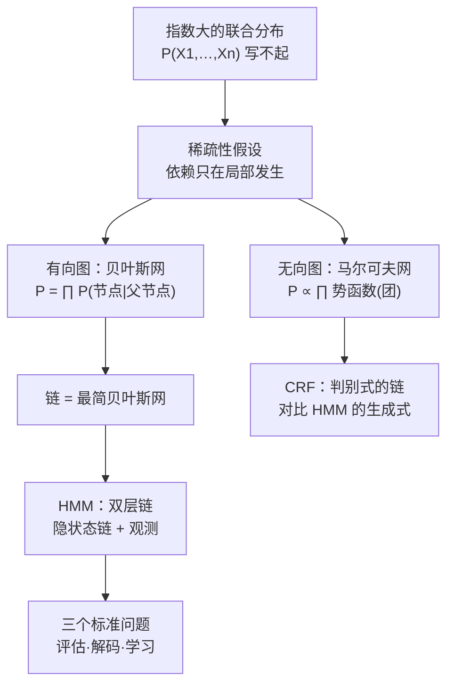
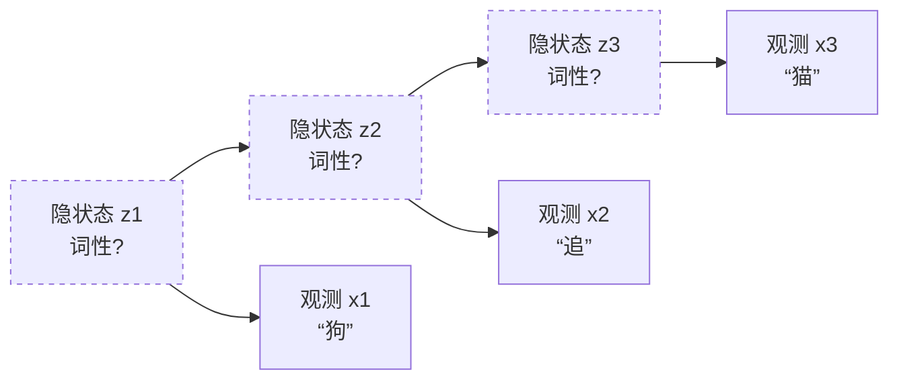

# 概率图模型：把庞大的联合分布画成一张图

> **一句话理解**：概率图模型（Probabilistic Graphical Models, PGM）用"节点 = 变量、边 = 直接依赖"的图，把指数级大的联合概率分布压缩成局部因子的乘积——贝叶斯网、马尔可夫网、HMM 都是这张图的方言；它教会机器学习"如何优雅地表达不确定性"，然后把接力棒交给了神经网络。

[⬆️ 返回总目录](../../../README.md) · [⬆️ 返回本篇](../README.md) · [⬅️ 返回本章目录](./README.md)

| 属性 | 说明 |
|------|------|
| 难度 | ⭐⭐⭐（较难） |
| 所属分支 | 通用基础 |
| 前置知识 | [概率与统计](../../1-起步准备/02-数学基础/04-概率与统计.md)（贝叶斯与联合分布）；[机器学习全景](./01-机器学习全景.md)（判别 vs 生成）；[近邻与朴素贝叶斯](./09-近邻与朴素贝叶斯.md)（最简生成式的完整版） |

---

## 📌 这一节解决什么问题

概率论给了机器学习一套完整的语言：任何不确定问题原则上都能写成联合分布 $P(X_1,\dots,X_n)$，然后边缘化、条件化，什么都能算。**原则上**——实际上一算就爆：20 个布尔变量的联合分布表有 $2^{20}\approx 10^6$ 个格子，100 个变量是 $10^{30}$ 个格子，比宇宙原子还多。

但真实世界有个救命的规律：**变量间的依赖是稀疏的**。你今天迟到，直接依赖的是"睡过头"，间接才是"昨晚刷手机"——绝大多数变量对之间隔着好几层、甚至毫无关系。[09 页](./09-近邻与朴素贝叶斯.md)的朴素贝叶斯已经用过一个最激进的稀疏假设（给定类别后所有特征完全独立，图上一条边都没有）；本页把它推广成一门完整的语言：**把"谁直接影响谁"画成图，联合分布按图的结构分解成小因子的乘积**——指数大表塌缩成一堆小表。

这条路线在 1990~2000 年代是机器学习的主流：贝叶斯网做医疗诊断、HMM 做语音识别与词性标注、马尔可夫网做图像分割。2010 年代被深度学习的端到端挤到幕后——但它的两件遗产无处不在：**结构先验**活在 GNN（第 9 章）与因果发现（第 11 章）里，**隐状态建模**活在 RNN 与现代时序模型（第 6 章）里。读懂它，才能读懂这些"后代"从哪来。

## 🌱 通俗理解

把联合分布想成一个**公司的汇报关系**。100 个员工的"全部两两关系"（完整大表）没人记得住；但一张组织架构图（谁直接向谁汇报）就够了——任何两个人的关系，沿图上的路径就能查。概率图模型就是随机变量的组织架构图：

- **有向图（贝叶斯网）**：箭头 = "谁产生谁"——上级（父节点）的状态定了，下级（子节点）按自己的规矩随机表现；
- **无向图（马尔可夫网）**：连线 = "互相影响，不分先后"——更像一群朋友的软约束（相邻像素颜色相近），谁也不是谁的上级；
- **链**：最简单的有向图——一环扣一环的传递（今天的状态产生明天的状态），HMM 就是两条链叠起来的双层结构。

而**条件独立**是这张图最值钱的读法："给定中间人，两头互不通气"——你知道了直属上司的态度，就不再关心总裁的态度（信息已被中间人吸收）。**图上少画一条边，概率表就少一大块**——稀疏，就是省内存的代名词。

## 📋 举个例子

**三节点小贝叶斯网：感冒 → 打喷嚏 ← 换季**。换季（独立发生，$P(\text{换季})=0.3$）和着凉（$P(\text{感冒})=0.1$）都可能引起打喷嚏。按图分解联合：

$$
P(\text{换季}, \text{感冒}, \text{打喷嚏}) = P(\text{换季}) \times P(\text{感冒}) \times P(\text{打喷嚏}\mid \text{换季}, \text{感冒})
$$

> 👉 **人话**：完整大表要存 $2^3=8$ 个格子的联合概率；按图分解只需三个小表：一个先验（0.3）、一个先验（0.1）、一个条件表（打喷嚏 | 两个父节点，$2^2=4$ 行）——**每张小表只管图上的"一家三口"**。变量越多、图越稀，省得越狠（深潜二算总账）。

**HMM 双层链：五个词的词性标注（本页代码的主角）**。隐藏层是词性链（名词 N / 动词 V），观测层是词。参数三件套：

| 部件 | 含义 | 本例取值 |
|------|------|----------|
| 初始分布 $\pi$ | 句首词性 | $P(N)=0.6,\ P(V)=0.4$ |
| 转移矩阵 $A$ | 词性 → 下一词性 | $N\to V$ 概率 0.7、$V\to N$ 概率 0.8（动词名词交替的朴素语法） |
| 发射矩阵 $B$ | 词性 → 具体的词 | 名词发"狗/猫"多（0.4/0.5），动词发"追"多（0.6） |

观测到「狗 追 猫 追 狗」，问：最可能的词性序列是什么？人眼一看就知道是"名动名动名"——但模型怎么算？枚举所有 $2^5=32$ 种词性组合、逐个算概率再取最大？五个词可以，**真实句子 20 个词、40 种词性就是 $40^{20}\approx10^{32}$ 条组合**——这正是深潜一要动手术的地方。

<details>
<summary>📊 展开完整算例：手算前向算法的前两步（局部计算的真实手感）</summary>

前向变量 $\alpha_t(s)$ = "前 $t$ 个词已出现，且第 $t$ 个词性是 $s$" 的概率。

**第 1 步（初始）**：观测"狗"。$\alpha_1(N) = \pi_N \times B_N(\text{狗}) = 0.6\times0.4 = 0.24$；$\alpha_1(V) = 0.4\times0.2 = 0.08$。——先验 × 发射，一步到位。

**第 2 步（递推）**：观测"追"。$\alpha_2(V)$ 要把"第 1 步是 N"和"第 1 步是 V"两条来路**汇总**再乘转移与发射：

$$
\alpha_2(V) = \big(\underbrace{0.24\times0.7}_{N\to V} + \underbrace{0.08\times0.2}_{V\to V}\big)\times B_V(\text{追}) = 0.184\times0.6 = 0.1104
$$

> 👉 **人话**：第 2 步只做了 2 次乘法 1 次加法——而不是把 4 条完整路径（$2^2$ 条）各算一遍。**每一步把"所有历史"压缩成每个状态的 1 个数**，这是全部动态规划的精髓，也是深潜一的复杂度账。

</details>

## 🧠 核心原理

### 整体流程



### ① 三种图：一门语言的三种方言

**有向图模型（贝叶斯网，Bayesian Network）**：节点 = 变量，有向边 = 直接因果式依赖（概率意义上），联合分布按图分解：

$$
P(X_1,\dots,X_n) = \prod_{i=1}^{n} P(X_i \mid \mathrm{Pa}(X_i))
$$

> 👉 **人话**：整个联合分布 = 每个节点一张"小家庭表"（我只看我的父节点）的连乘。[09 页](./09-近邻与朴素贝叶斯.md)朴素贝叶斯是"人人无父（只有类节点一个共同父亲）"的特例；📋 的感冒例子是"打喷嚏有两个父节点"的特例。**参数量从 $2^n$ 塌到"每家的小表"，塌多少由图的稀疏程度决定**（深潜二的总账）。

**无向图模型（马尔可夫网 / 马尔可夫随机场，Markov Random Field）**：边不带方向，联合分布分解为**团（Clique，两两相连的节点组）的势函数**乘积：$P(\mathbf{X}) \propto \prod_{c}\psi_c(\mathbf{x}_c)$。势函数不必是概率（只要求非负），最后归一化——适合表达**对称的软约束**：图像里相邻像素倾向同色、社交网络里朋友倾向同好。有向与无向可以互相转换（代价是引入额外的边），选哪种看问题的依赖是"产生式"还是"相关式"。

**链（Chain）**：最简单也最重要的结构——$X_1 \to X_2 \to \cdots \to X_T$，联合分解 $P = P(X_1)\prod_t P(X_{t}\mid X_{t-1})$。链上有一条核心的条件独立：**给定中间点，过去与未来独立**（马尔可夫性）——"知道现在，历史就全部被吸收进来了"。HMM 整个建立在它上面。

### 📐 数学深潜：因子分解的账本——链式法则怎么被图压缩

**①给了分解公式；这一节算清它省了多少**：完整联合与图分解的参数账、条件独立怎么从图上读出来。

**严格陈述。** $n$ 个布尔变量的联合分布 $P(X_1,\dots,X_n)$ 完整表示需要 $2^n - 1$ 个自由参数（每格一个概率，减去归一化约束）。按贝叶斯网分解，参数量降为：

$$
\#\text{参数} = \sum_{i=1}^{n}\big(2^{|\mathrm{Pa}(X_i)|} - 1\big)
$$

链式结构（每个节点至多 1 个父节点）时为 $1 + (n-1)\times 2$。

> 👉 **人话**：完整大表随变量数**指数**爆炸；图分解后只看"每家有几口人"——父节点少的小表便宜，全家福大表贵。**画对一张稀疏图，等于把 $2^n$ 压成大约 $2\times n$**。

**完整推导：链式法则 → 图修剪。**

<details>
<summary>🧮 展开推导：从恒等式到稀疏账本，三步 + 一个对照表</summary>

**第一步：链式法则（恒等式，无假设）。** 任何联合分布都可以写成：

$$
P(X_1,\dots,X_n) = \prod_{i=1}^{n} P(X_i \mid X_1, \dots, X_{i-1})
$$

这一步没有省任何东西：第 $i$ 个因子是"给定前面所有变量"的条件表，$i$ 大时仍是 $2^{i-1}$ 行的大表。

**第二步：用条件独立剪枝。** 若给定父节点集 $\mathrm{Pa}(X_i)$ 后，$X_i$ 与其余更早的变量独立（$X_i \perp X_{\text{更早}} \mid \mathrm{Pa}(X_i)$），则条件表里"无关变量"的维度整列坍缩：

$$
P(X_i \mid X_1,\dots,X_{i-1}) = P(X_i \mid \mathrm{Pa}(X_i))
$$

> 👉 **人话**：链式法则像"每个人的表现取决于全部历史"；条件独立说"其实只取决于直属上司"——表从"全历史"缩成"小家庭"。**每剪掉一个维度，参数减半**。

**第三步：对账。** 取 $n=20$ 个布尔变量，三种结构：

| 结构 | 参数量 | 直觉 |
|---|---|---|
| 完整大表 | $2^{20}-1 \approx 1{,}048{,}575$ | 百万级格子，估不动（数据永远不够） |
| 朴素贝叶斯式（全独立，共同父） | 约 $2\times 20$ | 最省，但假设最狠（[09 页](./09-近邻与朴素贝叶斯.md)的代价） |
| 链式（每节点 1 父） | $1 + 19\times 2 = 39$ | HMM 转移链的账——省 4 个数量级还保住相邻依赖 |

</details>

**从图上读条件独立（三种基本通路，为第 11 章埋桥）**：链 $A\to B\to C$——给定 $B$，$A\perp C$（信息被中间人吸收）；分叉 $B\to A$、$B\to C$——给定 $B$，$A\perp C$（同源不知彼）；**对撞 $A\to B\leftarrow C$——恰好相反：不看 $B$ 时 $A\perp C$，给定 $B$ 反而相关**（"共同结果被观察到，两个原因开始互相解释"）。这三种通路是图模型读图术的全部基础，也是[第 11 章因果图](../../4-专业方向/11-因果推断/01-相关不等于因果.md)"链、叉、对撞"的出处。

**反例与边界。**

1. **图画错了，分解就不成立**：图是人对结构的**假设**，不是数据里长出来的真理——朴素贝叶斯的"无边图"错得最狠也最常用；图错了，推断结果系统偏差（[01 全景](./01-机器学习全景.md)：假设错了全盘输）；
2. **稀疏的代价是推断变难**：分解容易，**边缘化（求和）依然可能指数级**——这是深潜一的舞台（动态规划救链，救不了任意图；一般图上的精确推断是 NP 难，退路是变分近似与 MCMC 采样，[第 2 章](../../1-起步准备/02-数学基础/04-概率与统计.md)"分母难算"的三条退路之二）；
3. **学习与推断是两回事**：图已知时"填表"（参数学习）相对容易；**图本身要从数据里学**（结构学习）是组合搜索难题——这正是后来因果发现（第 11 章）接着打的山头。

> 👉 **人话总结**：链式法则永远成立但表随历史指数膨胀；条件独立把"取决于全历史"砍成"取决于父节点"，参数从 $2^n$ 压到约 $2n$——**图是稀疏假设的可视化，省的是参数，赌的是结构**。

### ② 概率图 ≠ 因果图：同一种画法，两种语义

概率图模型和[第 11 章因果图](../../4-专业方向/11-因果推断/01-相关不等于因果.md)长得几乎一样（有向无环图 + 按图分解），但**边的含义有本质区别**：

| | 贝叶斯网（本页） | 因果图（第 11 章） |
|---|---|---|
| 边的含义 | "知道父节点**有助于预测**子节点"（概率依赖） | "改变父节点，子节点**会跟着变**"（因果机制） |
| 数据能区分吗 | — | **不能**：多张不同的因果图刻画同一个联合分布（马尔可夫等价类） |
| 典型用法 | 概率推断：$P(\text{感冒}\mid\text{打喷嚏})$ | 干预预测：$P(\text{打喷嚏}\mid do(\text{治好感冒}))$ |

> 👉 **人话**：贝叶斯网的箭头只是"相关性捷径"——"打喷嚏 → 感冒"反着画，对纯预测任务完全等价；因果图的箭头必须指向"谁真的影响谁"——只有它能回答"如果我干预会怎样"。**同一份数据、同一张分解表，两种世界观**；什么时候需要从预测升级到干预，什么时候就必须换语言——这条桥在[第 11 章](../../4-专业方向/11-因果推断/01-相关不等于因果.md)正式过。

### ③ HMM：双层链与时序的渊源

**隐马尔可夫模型（Hidden Markov Model, HMM）** = 一条看不见的状态链（马尔可夫链）+ 每个状态随机发射一个观测：



> 👉 **人话**：上层是你**想推**的隐藏真相（词性、天气、健康状态），下层是你**能看见**的表层信号（词、湿度读数、症状）。横向箭头是状态惯性（词性有语法惯性），纵向箭头是"真相泄露出的线索"。模型三件套 $\lambda=(\pi, A, B)$ 全是 📋 那三张小表——**一个 HMM 就是一条链式贝叶斯网**。

HMM 的三个标准问题（Rabiner, 1989 的经典三连）：

| 问题 | 一句话 | 算法 |
|------|--------|------|
| **评估**：$P(\mathbf{x}\mid\lambda)$？ | 这句话在模型下有多"像"？ | **前向算法**（动态规划求和） |
| **解码**：$\arg\max_{\mathbf{z}} P(\mathbf{z}\mid\mathbf{x})$？ | 最可能的隐藏序列是什么？ | **维特比算法**（动态规划求最大） |
| **学习**：$\lambda$ 怎么估？ | 表从哪来？ | 前向-后向（Baum-Welch / EM，与[06 页](./06-聚类与降维.md)GMM 的 EM 同宗） |

**与时序的渊源**：在 RNN 出现之前，HMM 是序列建模的头号工具——语音识别（隐 = 音素，观测 = 声学特征）、词性标注（隐 = 词性，观测 = 词）、生物序列（隐 = 编码区，观测 = 碱基）。它的"隐状态逐时刻传递"思想直接启发了 RNN 的隐藏状态（[第 6 章 RNN 与 LSTM](../../4-专业方向/06-时间序列/02-RNN与LSTM.md)：RNN 前时代的时序主力就是它），RNN 把"状态转移表"换成了"可学习的非线性函数"——**HMM 是 RNN 的概率表亲**。

**前向算法的直觉（一行的动态规划）**：枚举所有隐藏路径是 $N^T$ 条（$N$ 个状态、$T$ 步）；前向算法的关键观察是——**每条路径走到第 $t$ 步时，"接下来怎么走"只取决于当前状态，不取决于路径的历史形状**。于是把"所有历史"压缩成每个状态一个数 $\alpha_t(s)$，逐列推进：$\alpha_t(s) = \big(\sum_{s'}\alpha_{t-1}(s')A_{s's}\big)B_s(x_t)$。复杂度的完整手术在深潜一。

### 📐 数学深潜：穷举 O(Nᵀ) → 动态规划 O(N²T) 的推导

**③说了"压缩历史"的直觉；这一节把复杂度账算严**：为什么穷举是 $N^T$、前向为什么恰好 $N^2T$、以及这中间隔着多少个天文数字。

**严格陈述。** 设隐藏状态 $N$ 个、序列长 $T$。计算 $P(x_1,\dots,x_T)$：

- **穷举法**：枚举全部 $N^T$ 条状态路径，每条路径算 $2T-1$ 次乘法——$O(N^T)$；
- **前向算法**：递推 $\alpha_t(s) = \big(\sum_{s'}\alpha_{t-1}(s')A_{s's}\big)B_s(x_t)$，每步 $N\times N$ 次乘加、共 $T$ 步——$O(N^2T)$。

> 👉 **人话**：一个指数、一个多项式。$N=40$（真实词性标注的标签集大小）、$T=20$（一句话的词数）时：穷举 $40^{20}\approx 10^{32}$ 条路径——全宇宙一秒算一万亿条也要算几万亿年；前向只要 $40^2\times20=32000$ 次乘加——**笔记本眨眼间**。这中间隔着 27 个数量级。

**完整推导：从"逐条算"到"按终点归堆"。**

<details>
<summary>🧮 展开推导：路径概率的展开式 → 共享后缀 → 交换求和次序，三步完成</summary>

**第一步：写出穷举的目标。** $P(\mathbf{x}) = \sum_{z_1,\dots,z_T} \pi_{z_1}B_{z_1}(x_1)\prod_{t=2}^{T}A_{z_{t-1}z_t}B_{z_t}(x_t)$——把 $N^T$ 条路径的概率**全部加起来**。

**第二步：发现重复劳动——同终点的路径共享后缀。** 观察求和结构：任何两条路径只要在第 $t$ 步**处于同一状态** $s$，它们对"$t+1$ 步之后"的贡献方式**完全一样**（转移只看当前状态）。逐条相加等于把"第 $t$ 步到状态 $s$ 的所有路径"的概率**先归堆**：

$$
\sum_{\text{所有路径}} = \sum_{z_T}\Big(\sum_{z_{T-1}}\cdots\Big(\sum_{z_1}\pi_{z_1}B_{z_1}(x_1)A_{z_1 z_2}\cdots\Big)A_{z_{T-1}z_T}\Big)B_{z_T}(x_T)
$$

**第三步：定义堆并数乘法。** 记第 $t$ 步、状态 $s$ 的堆为 $\alpha_t(s)$（"所有走到这里的历史"的概率和）。递推一层：

$$
\alpha_t(s) = \Big(\sum_{s'=1}^{N}\alpha_{t-1}(s')\,A_{s's}\Big)\,B_s(x_t)
$$

内层求和 $N\times N$ 次乘加（$N$ 个来源 × $N$ 个终点）、发射再乘一次——**每层 $O(N^2)$，共 $T$ 层，总 $O(N^2T)$**；空间只需当前一列 $\alpha_t$（$O(N)$）。

> 👉 **人话**：穷举按"路径"组织计算（路径数指数），前向按"位置 × 状态"组织计算（位置 × 状态多项式）——**同一个和式，换了求和次序，指数变多项式**。这是动态规划的通用戏法：先算所有路径共享的中间量，再让它们复用。06 页 K-Means 与 GMM 的 EM、[07 页](./07-模型评估与调优.md)的一切交叉验证都不需要这招，而**一切"序列 + 状态"的问题（HMM/CRF/CTC/编译器语法分析/贝尔曼方程）都靠它吃饭**。

</details>

**图景（穷举 vs 前向的计算量，对数轴直觉）：**

```text
 计算量（以乘加次数计，N=40 个状态）
 穷举  O(N^T)：T=5 时 10^8｜T=10 时 10^16｜T=20 时 10^32 —— 每加一个词，乘 40
 前向  O(N²T)：T=5 时 8×10³｜T=10 时 1.6×10^4｜T=20 时 3.2×10^4 —— 每加一个词，加 1600
 （两条线的斜率：一个 ×40，一个 +1600——指数与线性的赛跑，长句秒杀穷举）
```

**反例与边界。**

1. **前向救的是链，不是任意图**：$O(N^2T)$ 依赖"每个节点只有 O(1) 个邻居"的链式结构；一般贝叶斯网上的精确推断按**树宽（treewidth）**指数——树宽大的图（稠密依赖）动态规划也救不了，只能变分/采样近似；
2. **维特比是同一招的 max 版**：把 $\sum$ 换成 $\max$、加法换 max——"最可能的路径"同样只需按终点归堆（见 ④）；
3. **数值下溢要用缩放**：$T$ 大时 $\alpha_t$ 连乘溢出双精度下界，工程上逐层归一化（每层除以 $\sum_s\alpha_t(s)$，最后用对数求和还原）——与[09 页](./09-近邻与朴素贝叶斯.md)朴素贝叶斯取对数是同一种驯化。

> 👉 **人话总结**：转移只看当前状态 ⟹ 同状态的历史可以归堆复用 ⟹ 求和次序一换，$N^T$ 条路径变成 $T$ 层、每层 $N^2$ 次乘加——**动态规划不是聪明地算，是聪明地"不重复算"**。

### ④ 维特比解码：换 max 的最短路径

解码问题问的是"最可能的一条隐藏路径"。维特比（Viterbi）算法 = 前向算法把求和换成的**最大值**：

$$
\delta_t(s) = \max_{s'}\big(\delta_{t-1}(s')\,A_{s's}\big)\,B_s(x_t)
$$

> 👉 **人话**：前向问"所有路加起来多宽"，维特比问"最宽的那条路多宽"。直觉是**最短路问题的概率版**：把 $-\log$ 概率当边长，"最可能的词性序列"就是图上**最短的那条路**（每步只从"到当前状态最宽的那条来路"继续延伸，$N$ 个状态各留一个冠军 + 一个回溯指针，走到底沿指针倒着读出路径）。🏗️ 这个"分层图上找最优路径"的框架，后来原封不动地活在语音识别解码器与 CTC（[第 7 章](../../4-专业方向/07-自然语言处理与LLM/README.md)语音/序列对齐）里。

### ⑤ CRF 一句话级：判别式的链式接班人

**条件随机场（Conditional Random Field, CRF, 2001）**：HMM 建 $P(\mathbf{x},\mathbf{z})$（生成式，要操心观测怎么产生），CRF 直接建 $P(\mathbf{z}\mid\mathbf{x})$（判别式，只为标注服务）——链式结构 + 特征函数打分，一句话对照：**HMM 是"先学会生成句子再反推词性"，CRF 是"直接学什么特征组合对应什么词性"**。CRF 拆掉了 HMM 的两个紧箍咒：观测必须独立发射、特征只能用局部查表——同样的链、换判别式，标注精度普遍更高（[01 全景](./01-机器学习全景.md)判别 vs 生成的序列版）。2000 年代 CRF 是 NLP 序列标注（分词、命名实体）的标准答案，2010 年代被 BiLSTM-CRF、再后来被 Transformer 接管。

### ⑥ 为什么图模型"退居幕后"了

2010 年代起，深度学习用**端到端学习**挤掉了图模型的主力位置，三条机理：

1. **特征与结构都自动学**：图模型要求人画图、人定义势函数/特征——结构先验是手工的；网络从数据里自己长出结构（卷积/注意力本身就是一种"软图"），数据足够时学出来的比人画的好（[08 专题三](./08-进阶专题-经典ML理论高地.md)特征学习 vs 固定特征之争的图模型版）；
2. **推断被优化替代**：图模型的核心开销是"推断"（边缘化求和，NP 难的要近似）；神经网络把推断变成一次前向传播——**训练时疼一次，部署时白嫖**；
3. **概率校准被排序取代**：多数应用要的是排序与决策，不是精确概率——图模型辛苦维持的概率一致性成了奢侈品。

**但它的两件遗产活得很好**：一，**结构先验**——当数据不充裕或需要强解释时，把已知的图结构显式编码仍是王道：GNN（[第 9 章](../../4-专业方向/09-图神经网络/README.md)）把"图结构"做成神经网络的输入形态；因果发现（[第 11 章](../../4-专业方向/11-因果推断/README.md)）用图模型的语言从数据里**学图**。二，**变分推断**——训练生成模型（VAE、扩散模型的 ELBO）用的正是图模型时代发明的变分方法（[第 12 章](../../5-前沿与融合/12-生成模型与多模态/README.md)）。**图没有消失，它从"人手工画的先验"变成了"网络里可学的结构"**。

## 💻 动手试试

**numpy 手写小 HMM：前向算法 + 维特比解码 + 穷举对照**（30 行核心，无任何 HMM 库）：

```python
import numpy as np
from itertools import product

states = ["名词N", "动词V"]
obs = ["狗", "追", "猫"]
pi = np.array([0.6, 0.4])              # 初始分布：句首更可能是名词
A = np.array([[0.3, 0.7],              # 转移：名词后爱跟动词（0.7）
              [0.8, 0.2]])             #        动词后爱跟名词（0.8）
B = np.array([[0.4, 0.1, 0.5],         # 发射：名词发“狗/猫”多
              [0.2, 0.6, 0.2]])        #        动词发“追”多

def forward(seq):                       # 前向：所有路径的概率“和”，O(N²T)
    T = len(seq)
    alpha = np.zeros((T, len(states)))
    alpha[0] = pi * B[:, seq[0]]                       # 第 1 步：先验 × 发射
    for t in range(1, T):
        alpha[t] = (alpha[t-1] @ A) * B[:, seq[t]]     # 汇总来路 × 转移 × 发射
    return alpha

def viterbi(seq):                       # 维特比：最可能路径，max 版前向
    T, N = len(seq), len(states)
    delta = np.zeros((T, N)); psi = np.zeros((T, N), dtype=int)  # psi = 回溯指针
    delta[0] = pi * B[:, seq[0]]
    for t in range(1, T):
        trans = delta[t-1][:, None] * A                # [来路, 去路] 全部 N² 条转移的分数
        psi[t] = trans.argmax(axis=0)                  # 每个去路状态的最优来路
        delta[t] = trans.max(axis=0) * B[:, seq[t]]    # 只留冠军，再乘发射
    path = [int(delta[-1].argmax())]                   # 终点：全程最宽的状态
    for t in range(T-1, 0, -1):                        # 沿回溯指针倒着读出路径
        path.append(int(psi[t, path[-1]]))
    return path[::-1], delta

def brute(seq):                         # 穷举 N^T 条路径——只作验证对照
    T, N = len(seq), len(states)
    out = []
    for p in product(range(N), repeat=T):
        pr = pi[p[0]] * B[p[0], seq[0]]
        for t in range(1, T):
            pr *= A[p[t-1], p[t]] * B[p[t], seq[t]]
        out.append((pr, p))
    return out

seq = [obs.index(w) for w in ["狗", "追", "猫", "追", "狗"]]
alpha = forward(seq)
print("每步 alpha =", alpha.round(5).tolist())
print("前向  P(观测序列) =", round(alpha[-1].sum(), 6))
path, delta = viterbi(seq)
print("维特比解码:", " → ".join(states[s] for s in path),
      "  路径概率 =", round(delta[-1].max(), 6))
paths = brute(seq)
print("穷举对照：sum =", round(sum(p[0] for p in paths), 6),
      "  argmax =", [states[s] for s in max(paths)[1]])

# 预期输出（可复现）：
# 前向  P(观测序列) = 0.00775
# 维特比解码: 名词N → 动词V → 名词N → 动词V → 名词N   路径概率 = 0.005419
# 穷举对照：sum = 0.00775   argmax = ['名词N', '动词V', '名词N', '动词V', '名词N']
# —— 前向的“和”与维特比的“最大”都和穷举分毫不差：动态规划没丢任何信息，只省了 27+ 个数量级的重复
```

改什么、看什么：把转移矩阵改成 `[[0.5, 0.5], [0.5, 0.5]]`（无语法惯性）——解码结果开始摇摆（发射单独决策），体会**转移矩阵正是"结构先验"的本体**；把观测改成 `["追", "追", "追"]`（动词连发，与先验打架）——看维特比如何在"发射喜欢 V"与"转移惩罚 V→V"之间折中（改 A 里 V→V 的概率，看解码从 V V V 滑向 V N V）；把 `brute` 的 `product` 用于 20 步序列——它会跑不完，这就是 $O(N^T)$ 的体感。

## 🔥 炼丹小灶

> 🔥 **炼丹小灶**：工业界常用起点配方与玄学——
> - 配方：真要用 HMM 系工具，起点是 `hmmlearn`（语音/手势/设备状态）或 CRF++/`sklearn-crfsuite`（旧系统里的分词、实体标注）；隐状态数用 BIC/交叉验证定，转移矩阵加 Dirichlet 平滑（[第 2 章](../../1-起步准备/02-数学基础/04-概率与统计.md)共轭的又一现场）；
> - 玄学：新任务先问"隐状态有没有真实的业务含义"（设备工况、用户意图）——有，HMM 可解释、可注入业务规则的优势就回来了；没有，直接上神经网络（[第 6 章](../../4-专业方向/06-时间序列/02-RNN与LSTM.md)）；HMM 学习用 EM，对初始化敏感，多换几个种子取最优；
> - ⚠️ 以上是经验参考值，不是圣旨；换数据集请重新炼。

## 🔗 在知识树中的位置

- **上游**：[概率与统计](../../1-起步准备/02-数学基础/04-概率与统计.md)（联合分布、贝叶斯、共轭——本页一切公式的基础）；[近邻与朴素贝叶斯](./09-近邻与朴素贝叶斯.md)（最简生成式 = 无边的贝叶斯网，本页是它的"放松版"）；[机器学习全景](./01-机器学习全景.md)（判别 vs 生成的门派地图）。
- **下游**：[第 6 章 RNN 与 LSTM](../../4-专业方向/06-时间序列/02-RNN与LSTM.md)（隐状态思想的神经网络转世）；[第 9 章 GNN](../../4-专业方向/09-图神经网络/README.md)（结构先验的现代形态）；[第 11 章因果推断](../../4-专业方向/11-因果推断/01-相关不等于因果.md)（图语言的因果升级）；[第 12 章生成模型](../../5-前沿与融合/12-生成模型与多模态/README.md)（变分推断的直系后代）。
- **横向对比**：HMM（生成式，建模 $P(\mathbf{x},\mathbf{z})$）vs 链式 CRF（判别式，建模 $P(\mathbf{z}\mid\mathbf{x})$）——[03 逻辑回归](./03-逻辑回归与分类.md)对[09 朴素贝叶斯](./09-近邻与朴素贝叶斯.md)的序列版翻版；两者又一起被 BiLSTM/Transformer 端到端接管。

## 🎓 深度视角

图模型最深的遗产不是任何具体模型，而是一种**建模哲学：先把"你对世界结构的假设"画出来，再让数据填表**。它与深度学习的哲学（"结构让网络自己学"）构成了先验与数据的两极——数据少、解释要求高、结构已知（医疗诊断、风控规则、物理系统）时，显式图仍是性价比之王；数据多、结构未知（像素、语句）时，端到端碾压。2026 年回头看，最有意思的趋势是两极在合流：GNN 把图喂给网络、因果发现从数据里学图、扩散模型的训练目标（ELBO）是图模型时代的变分推断——**"图"从人的先验变成了模型的一部分**。学这一页的意义因此不是怀旧：读懂 HMM 的 α 递推，你才真正读懂 RNN 为什么沿时间展开、Transformer 的注意力为什么是"全连接的软图"。

<details>
<summary>❓ 深问一：HMM 输给了神经网络，"隐状态"这个想法输了吗？</summary>

恰恰相反，它赢了两次。RNN 的隐藏状态 $\mathbf{h}_t = f(\mathbf{h}_{t-1}, x_t)$ 就是把 HMM 的"状态转移 + 发射"换成了可学习的非线性函数——离散查表变成连续动力学；而 Transformer 的自注意力更是"任意两步直接连边"的全连接图（链的超级加倍）。输掉的只是"手工查表 + 独立发射"这两个具体限制，"用隐藏变量概括历史、再由隐藏变量决定未来"的骨架接管了整个序列建模（[第 6 章](../../4-专业方向/06-时间序列/02-RNN与LSTM.md)、[第 7 章](../../4-专业方向/07-自然语言处理与LLM/README.md)）。

</details>

<details>
<summary>❓ 深问二：既然因果图和贝叶斯网数学上这么近，为什么不早说"相关就是因果"？</summary>

因为联合分布对多张不同的图"一视同仁"（马尔可夫等价）：数据只能告诉你"A 和 B 相关"，永远不能告诉你箭头从谁指向谁——"感冒→打喷嚏"与"打喷嚏→感冒"刻画同一份观测数据。要区分它们，必须引入数据之外的东西：干预实验（do 算子）、时间先后、或领域知识。这正是[第 11 章](../../4-专业方向/11-因果推断/01-相关不等于因果.md)的起点——因果图 = 贝叶斯网 + "箭头承载干预语义"的额外承诺。预测与干预的分水岭，就画在图的语义上。

</details>

## 🔬 SOTA 演进

- **HMM 家族**：语音识别主力地位 1990~2010 被 DNN-HMM 混合系统、进而端到端（CTC/Attention/Transformer）接管；仍活在小数据、强解释、在线更新的场景（设备健康监测、行为识别、生信序列），以及作为"可解释基线"永驻教科书。
- **CRF**：NLP 序列标注标准答案（2003~2015），先降级为神经网络输出层的解码组件（BiLSTM-CRF 的 CRF 层至今在命名实体识别里服役），再被逐 token 分类 + 规则后处理替代。
- **图模型的现代转世**：变分推断（ELBO）成为 VAE/扩散模型的训练目标（[第 12 章](../../5-前沿与融合/12-生成模型与多模态/README.md)）；GNN（[第 9 章](../../4-专业方向/09-图神经网络/README.md)）把"结构先验"做成可学习组件；因果发现（[第 11 章](../../4-专业方向/11-因果推断/README.md)）用图模型语言从观测数据学结构；概率编程（Stan/Pyro）让"画图 + 推断"变成几行代码。

## ❓ 开放问题

- **结构与数据的最优混合比**：什么问题值得显式画图、什么问题该交给网络自学，没有理论判据——"结构先验 + 神经参数"（GNN、神经符号方法）正试图两头通吃，边界仍在探索。
- **可扩展的精确推断**：一般图上的精确推断是 NP 难，变分/采样的近似质量与速度难以两全——大模型时代的"概率推理层"（给 LLM 挂不确定性）正在重新踩这些老坑。

## ⚠️ 常见误区

- **误区一**："概率图的箭头就是因果方向" → 贝叶斯网的箭头只表示概率分解的次序，"打喷嚏←感冒"与"打喷嚏→感冒"对纯预测完全等价；因果语义要靠[第 11 章](../../4-专业方向/11-因果推断/01-相关不等于因果.md)的额外假设。
- **误区二**："图模型过时了，不用学" → 过时的只是"手工画图当主力模型"；前向/维特比的动态规划、变分推断、条件独立读图术，是 RNN、CTC、VAE、因果发现的通用底层。
- **误区三**："HMM 的隐状态是模型瞎编的，没有意义" → 隐状态可以对应真实业务量（设备工况、用户意图、疾病分期）；有真实含义时 HMM 的可解释性与小样本能力是神经网络的对照优势。
- **误区四**："维特比找到的路径概率 = 观测序列的概率" → 维特比给的是**最可能单条路径**的概率（max），前向给的是**所有路径之和**（sum）——后者才是 $P(\mathbf{x})$；多数路径的概率被 max 忽略，两者可以差很多数量级（💻 实验里 0.0054 vs 0.0078）。
- **误区五**："把图画得越全越准" → 多画一条边，参数、推断成本、过拟合风险一起涨；图是赌注不是保险——**稀疏赌对了赚翻，赌错了系统偏差**（朴素贝叶斯赌最狠也最常用）。

## 📝 小结与自测

**要点回顾**

- 联合分布指数爆炸，稀疏性是救命稻草：图 = 结构假设的可视化，分解 $P=\prod P(X_i\mid\mathrm{Pa}(X_i))$ 把参数从 $2^n$ 压到约 $2n$（深潜一的账本：$2^{20}\approx10^6$ vs 链式 39）；
- 三种方言：有向图（贝叶斯网，按父节点分解）、无向图（马尔可夫网，按团分解势函数）、链（马尔可夫性的最小实现）；条件独立从图上读——链、叉、对撞三种通路（第 11 章因果图的种子）；
- 概率图 ≠ 因果图：同样的分解、不同的语义——前者答预测（$P(Y\mid X)$），后者答干预（$P(Y\mid do(X))$）；同一份数据分不出两种图，升级语义必须带额外假设；
- HMM = 双层链贝叶斯网（隐状态链 + 发射），三件套 $\lambda=(\pi,A,B)$；前向算"和"（评估）、维特比算"最大"（解码）、Baum-Welch 学参数（EM 同宗）；
- 复杂度手术：同状态的历史可归堆复用，求和次序一换，$O(N^T)$ 穷举变 $O(N^2T)$ 动态规划（$40^{20}\approx10^{32}$ vs 32000 次乘加）；
- CRF 一句话：判别式的链（直接建 $P(\mathbf{z}\mid\mathbf{x})$），HMM 的序列版接班人；维特比 = 分层图上的最短路（$-\log$ 概率当边长）；
- 退居幕后的三条机理与两件遗产：端到端挤掉手工结构、推断被前向传播替代、排序取代校准；结构先验活在 GNN/因果发现，变分推断活在 VAE/扩散。

**自测一下**（点击展开答案）

<details>
<summary>问题 1：20 个布尔变量，完整联合表和链式贝叶斯网各要多少参数？差距说明什么？</summary>

完整表 $2^{20}-1\approx 1.05\times10^6$ 个；链式分解 $P= P(X_1)\prod P(X_t\mid X_{t-1})$：初始 1 个 + 每步条件表 2 个 × 19 步 = 39 个。差 4 个数量级以上——说明图不是"画着好看"，它直接决定模型的统计可行性：百万参数没有数据喂（每个参数都在估噪声），39 个参数几千样本就够。**省参数就是省数据**，这是稀疏假设的真正回报。

</details>

<details>
<summary>问题 2：为什么前向算法能把 $N^T$ 条路径算进 $O(N^2T)$？一句话说清核心观察。</summary>

因为**马尔可夫性保证"未来的计算只依赖当前状态，不依赖路径的历史形状"**——所有在第 $t$ 步到达同一状态 $s$ 的路径（无论历史多么不同），对后续的贡献完全相同，可以先归堆成一个数 $\alpha_t(s)$。于是指数条路径被逐层折叠成"T 层 × 每层 N 个数"，每层折叠只需 $N^2$ 次乘加。没有马尔可夫性（转移还要看更早的历史），这个归堆就不成立，动态规划失效。

</details>

<details>
<summary>问题 3：前向算出 0.0078、维特比算出 0.0054——这两个数各是什么？为什么不相等？</summary>

0.0078 是 $P(\mathbf{x})$：**所有** $2^5$ 条隐藏路径的概率**之和**（评估问题的答案）；0.0054 是**最可能那一条**路径的概率（解码问题的答案）。和 ≥ 最大，差额来自其余 31 条路径——每条都多少贡献了一点概率。若只报告维特比路径，等于把"第二名到第 N^T 名"的集体证词全部丢弃；语音识别的格（lattice）输出正是为了保住这些次优路径。

</details>

<details>
<summary>问题 4：同一个"感冒—打喷嚏"系统，画成贝叶斯网和画成因果图，使用上差在哪？</summary>

贝叶斯网只承诺概率分解：用它算 $P(\text{感冒}\mid\text{打喷嚏})$（看到症状推病因）完全正当，但把箭头当因果、去做"治好感冒打喷嚏会怎样"的干预预测，没有任何保证——"症状→病因"的反向箭头在纯预测里同样合法。因果图在分解之外额外承诺"箭头 = 机制"：才能用 do 算子/后门准则回答干预问题。一句话：**预测用贝叶斯网够了，干预必须升级到因果图**（[第 11 章](../../4-专业方向/11-因果推断/01-相关不等于因果.md)）。

</details>

## 📚 延伸阅读

- 教程：Rabiner, *A Tutorial on Hidden Markov Models and Selected Applications in Speech Recognition*（1989）——HMM 三连问题的经典综述，引用十万级
- 书：Daphne Koller & Nir Friedman, *Probabilistic Graphical Models*（2009）——领域大部头（选读前几章即可）
- 书：Christopher Bishop, *Pattern Recognition and Machine Learning* 第 8 章（图模型）、第 13 章（序列模型）
- 博客/课程：Michael Collins 的 CRF 讲义（Cornell/NLP 课程）——前向/维特比/CRF 最清晰的推导之一

---

[⬅️ 上一页：特征工程](./10-特征工程.md) · [返回本章目录](./README.md) · [下一页：生产实战 ➡️](./99-生产实战.md)
