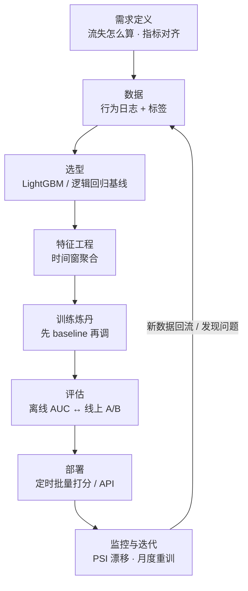
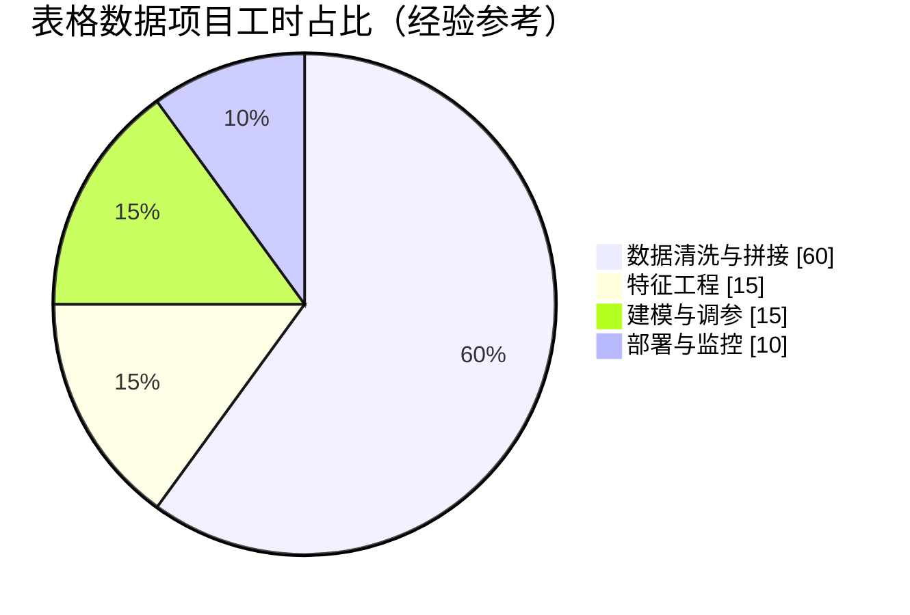
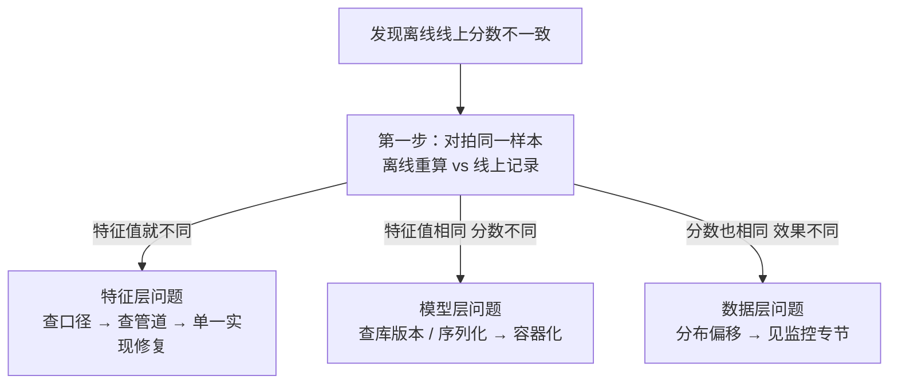

# 生产实战：表格数据项目从 0 到 1

> **一句话理解**：本章的模型在课本上只占一页，落地时却要穿过需求对齐、数据清洗、选型、特征、上线、监控的完整流水线——以最常见的"用户流失预测"为例，看看真实工作和教程差在哪。

[⬆️ 返回总目录](../../../README.md) · [⬆️ 返回本篇](../README.md) · [⬅️ 返回本章目录](./README.md)

| 属性 | 说明 |
|------|------|
| 难度 | ⭐⭐（进阶） |
| 所属分支 | 通用基础 |
| 前置知识 | 本章全部正文 |

---

## 🏭 一个真实项目从 0 到 1

**场景**：一个订阅制 SaaS 产品，约 50 万注册用户，业务方希望"提前一个月预知谁要流失，让运营优先挽留"。这是表格数据（结构化数据）项目最典型的形态，也是经典机器学习至今最大的主战场。

**时间都花在哪**（行业经验参考，量级因项目而异）：

分阶段拆解（每个阶段说清"做什么、花多久、常见卡点"）：

- **需求定义（约 1~2 周，反复拉扯）**
  - 先回答"流失怎么定义"——连续 60 天未登录？取消订阅？欠费？三种定义做出来是三个完全不同的模型，必须和业务方白纸黑字对齐；
  - 再对齐指标：业务真正关心的是**召回率**（想挽留的人别漏）还是精确率（挽留有成本，名单别太长）？名单每周多少人运营才接得住？
  - 卡点：指标没对齐就开工，是全项目最大的浪费——做到一半发现业务要的是"高价值用户留存"，推倒重来。
- **数据（数周，占全项目大头）**
  - 从哪来：产品行为日志（登录、功能使用、付费）+ 用规则生成的流失标签，没有现成的标注团队；
  - 现实：清洗与拼接占掉 60%~80% 的工时——日志缺字段、统计口径中途改版、僵尸账号和内部测试号混在里面；
  - 卡点：标签延迟——流失要 60 天后才能确认，最近一个月的用户根本没标签（详见踩坑实录坑 1）。
- **设备与算力（几乎不花钱）**
  - 50 万样本 × 几百特征，LightGBM 单机 CPU 几秒到几分钟一轮训练，一台普通笔记本或云上几核的虚拟机足够；
  - 表格数据的经典 ML 项目通常**不需要 GPU**——这也是它对新手最友好的一点；
  - 卡点：真正贵的不是算力，是把数据合规、安全地拿出来的审批流程。
- **算法选型（第一天就能定）**
  - 第一步**永远是** LightGBM / XGBoost 这类 GBDT 或逻辑回归基线，而不是深度学习，理由有三：
    - 数据量级在十万级，深度学习没有明显优势；
    - 树模型对特征不挑食（缺失值、未标准化的数值、类别特征都能吃），迭代快；
    - 要给业务解释"为什么这个用户高危"：树模型 + SHAP 值能给出理由，深度模型很难；
  - 卡点：忍不住炫技上深度网络——训练慢、调参久、解释不了，两周后老老实实回退基线。
- **特征工程（真正的分数来源）**——系统展开见下面专节。
- **训练炼丹（先看有没有信号）**
  - 第一版 baseline 不调参直接跑：AUC 明显高于随机线（经验上 0.7+）说明"标签 + 特征"里有信号，值得继续；接近 0.5 就回去查数据和标签，别急着调参；
  - 之后才轮到 Optuna 自动调参、加交叉特征；每轮实验用 MLflow 记下参数与分数；
  - 卡点：在最后 0.002 的提升上反复内卷，忘了验证集已经被自己用坏（坑 3）。
- **评估（离线在线对齐）**
  - 离线看：AUC + Top 10% 命中率（运营只打得动名单前 10%）+ 按年龄 / 付费档位分组的分桶指标；
  - 上线看：**A/B 测试**——一半用户走"模型名单 + 运营挽留"，一半走原有策略，比 30 天留存率与挽回收入；
  - 卡点：离线 AUC 漂亮但 A/B 无效果——多半是"名单和运营动作脱节"，或离线指标与业务目标错位。
- **部署（从糙到细三步走）**
  - 第一版：`pickle` 存模型 + 每周定时批量打分，输出名单给运营，就够用；
  - 要低延迟在线打分时：转 ONNX 或 LightGBM 原生格式 + API 服务；
  - 规模再大才谈特征平台、流式打分——别第一天就上微服务全家桶；
  - 卡点：训练环境与服务环境的库版本不一致，同一个模型跑出两个分数。
- **监控与迭代（上线才是开始）**——监控体系与重训策略见下面专节。

📋 展开一个真实的迭代故事

上线第二个月，运营反馈："名单里好些'高危'用户根本没毛病。"排查发现：流失标签定义为"连续 60 天未登录"，而**年付用户**登录频率本来就低——模型把"年付且少登录"学成了高危，其实那是一类健康人群。修复分三步：(1) 标签按付费周期归一化（年付用户按年判活跃）；(2) 加入"付费计划类型"特征；(3) 与业务方重新确认不同用户的挽留成本。重训后 Top 10% 名单命中率明显上升。教训：**模型不会纠正标签的语义错误，它只会忠实地放大它。**

**一张速览卡收尾**（数量级均为经验参考，非圣旨）：

| 项目要素 | 本项目典型取值 |
|---|---|
| 用户量 / 特征数 | 50 万用户 / 200~500 个时间窗特征 |
| 标签定义 | 连续 60 天未登录 = 流失（年付用户按付费周期归一化） |
| 基线模型 | LightGBM（对照：逻辑回归） |
| 离线指标 | AUC 0.8 上下即"有得做"，配合 Top 10% 命中率看运营可用性 |
| 上线形式 | 每周定时批量打分 → 输出运营 top N 名单 |
| 重训节奏 | 月度例行重训 + PSI 超阈值触发的临时重训 |

✅ 展开上线前自查清单（照着勾一遍）

- [ ] 标签定义业务方书面确认过？
- [ ] 每个特征在"打分那一刻"真的拿得到（没有未来信息）？
- [ ] 训练 / 验证 / 测试划分尊重了时间顺序？
- [ ] 预处理（标准化、编码）只在训练集上 fit？
- [ ] 留了一个从头到尾只考一次的 hold-out 测试集？
- [ ] 离线与线上对同一样本的分数对拍过？
- [ ] 分数解释（SHAP 前几名因子）运营看得懂？
- [ ] PSI 监控与重训排期有明确负责人？
- [ ] A/B 实验的分流方式与统计功效设计过？

九项勾完再上线，能避开本页四个坑里的三个半。

## 🛠️ 特征工程系统展开：分数的真正来源

[04 页](./04-决策树与集成学习.md)说过"调不动时八成是特征没做对"，这里把表格数据的三大家族特征讲透。核心心法一句话：**把"人的业务直觉"翻译成"机器能算的数字"**。

**① 时间窗特征（行为数据的主力军）**

同一个行为（登录、消费、客诉），在不同时间尺度上切片，含义完全不同：

| 特征族 | 例子 | 抓的是什么信号 |
|---|---|---|
| 多尺度计数 | 近 7 / 30 / 90 天登录次数 | 短期波动 vs 长期基线 |
| 趋势 / 环比 | 近 7 天消费 ÷ 前 7 天消费；活跃斜率 | "正在变冷"比"一直冷"更危险 |
| 距今 / 拐点 | 距上次使用天数；月付转年付这类事件 | 行为断崖与承诺变化 |
| 稳定性 | 近 30 天使用天数的标准差 | 忽冷忽热 = 流失前兆 |

> 👉 **人话**：树模型自己不会"算除法"——你给它"近 7 天次数"和"前 7 天次数"两个原始数，它要很多层才能拼出环比；**直接把环比、斜率做成特征，等于替模型把最重要的减法做好了**。

**② 交叉统计特征（组合的力量）**

"用户 × 品类""用户 × 时段""用户 × 渠道"的交叉表上做聚合：该用户在美妆品类的 30 天消费额、夜间下单占比、优惠单占比……单特征说不了的事，交叉后开始说话（"高频买美妆但最近只逛不买"是极强流失信号）。

**③ 目标编码（Target Encoding）：强但危险的双刃剑**

高基数类别特征（城市、商品类目、App 版本上千个取值）One-Hot 会爆炸，树也切不动——**目标编码**把它换成"这个类别历史上的流失率"，一个特征顶一千列。

危险在于：这个"历史流失率"是**用标签算的**，算的时候若包含当前样本自己的标签，就是教科书级泄漏（[07 页](./07-模型评估与调优.md)四形态之二、三的合体）——离线 AUC 飙到 0.95+，上线现形。安全姿势三件套：

- **Out-of-Fold 编码**：当前样本所在折的标签不许参与算它自己的编码（交叉验证的思路复用在特征上）；
- **平滑**：编码 = (该类别流失数 + α×全局流失率) / (该类别样本数 + α)，样本少的类别向全局均值收缩，α 经验取 10~100；
- **只用过去**：线上场景更严格——只用"打分时刻之前"的窗口重算（时间穿越零容忍）。

> 👉 **人话**：目标编码 = 让特征"偷看"答案的统计版。锁要上够（OOF + 平滑 + 时间），不然它就是全页最快的翻车通道。

## 🔌 离线线上不一致：三种根源与排查流程

坑 2 的展开。离线 AUC 0.85、线上打分完全两回事，根源逃不出这三类：

| 根源 | 典型表现 | 排查手段 |
|---|---|---|
| **特征口径不一致** | 离线算"近 30 天消费"用交易表全量，线上图快用了缓存表（少几种支付渠道） | 对拍：抽同批用户，离线重算特征 vs 线上实际入模值，逐列 diff |
| **数据管道不一致** | 离线批处理（T+1）与线上流式（实时）对"去重、补缺、单位"的处理规则不同 | 对拍 + 代码审计：同一份特征逻辑单一实现，两处调用 |
| **环境不一致** | 训练用 sklearn 1.3、服务端 1.1，浮点与默认行为微差；pickle 反序列化悄悄换行为 | 版本对齐：模型元数据里钉死库版本；容器化交付 |

> 👉 **人话**：排查心法是**二分定位**——先确认"喂进去的东西一不一样"（特征层），再看"同样的东西算出的分一不一样"（模型层），最后才怀疑"世界变了"（数据层）。上线第一天就把"对拍脚本"备好，是资深工程师的肌肉记忆。

## 📉 模型退化监控体系：PSI / KS 与阈值

模型上线不是终点，是"慢性能化"的起点。三道防线：

**① 特征漂移监控（PSI）**——训练时的特征分布 vs 线上最新的分布，逐特征算 PSI（Population Stability Index，群体稳定性指标：把两个分布各分 10 桶，按 $\sum(\text{线上占比}-\text{训练占比}) \times \ln\frac{\text{线上占比}}{\text{训练占比}}$ 汇总）：

| PSI（经验参考） | 解读 | 动作 |
|---|---|---|
| < 0.1 | 分布稳定 | 正常监控 |
| 0.1 ~ 0.25 | 轻微漂移 | 关注：定位是哪几个特征、是否持续走高 |
| 0.25 ~ 0.5 | 显著漂移 | 预警：排查上游数据变更 / 人群变化，准备重训 |
| > 0.5 | 剧烈漂移 | 立即处理：大概率特征逻辑坏了或世界真变了 |

**② 分数分布监控（KS 检验）**：线上分数直方图 vs 训练期分数分布做 KS 检验（两分布最大间距）——特征都稳但分数整体搬家，往往提示标签比例变了或特征组合效应变了；经验上 KS > 0.1 关注、> 0.2 排查（经验参考）。

**③ 业务指标联动**：命中率 / 挽留率 / 客诉率——模型指标全绿但业务指标跌，说明**概念漂移**（规律变了而分布没变，[01 页](./01-机器学习全景.md)偏移三形态的鉴别法），监控特征分布看不出来，只有业务数据能报警。

> 👉 **人话**：PSI 看"输入变没变"，KS 看"输出变没变"，业务指标看"判断还灵不灵"——三层各盯一层，缺一层就有一种漂移能从眼皮底下溜过去。

## 🔁 重训策略对比：定时 / 触发 / 漂移自适应

监控发现漂移后怎么重训？三种策略（可组合）：

| 策略 | 做法 | 优点 | 缺点 / 适用 |
|------|------|------|------|
| **定时重训** | 每月 / 每季度固定节奏重训 | 简单可靠、可排期、好审计 | 可能滞后（漂移发生在两次重训之间）；世界安静时白算 |
| **触发式重训** | PSI / KS 超阈值、业务指标连跌 N 天 → 自动触发 | 响应及时；安静期不浪费算力 | 依赖监控基建质量；误触发会打乱线上稳定性 |
| **漂移自适应** | 先判漂移类型再开方：协变量偏移 → 样本加权微调；概念漂移 → 攒新标签全量重训；标签偏移 → 阈值 / 先验校准 | 对症下药，最省资源 | 实现最复杂，需要漂移归因能力 |

> 👉 **人话**：多数团队的成熟形态是"**定时兜底 + 触发救急**"：每月例行重训保证不落伍，PSI 报警随时插队。漂移自适应是进阶玩法——它的前提是把上面的监控体系先跑顺。

## 🧭 场景选型表

| 场景 | 推荐 | 理由 | 不推荐 |
|------|------|------|--------|
| 数据少（万级以内）、要向业务解释 | 逻辑回归 / 小型 GBDT + SHAP | 稳、系数可读、不容易翻车 | 深度学习（样本不够喂） |
| 表格数据、追求分数（竞赛 / 工业常规） | LightGBM / XGBoost | 表格数据至今的第一梯队 | 纯线性模型（交互规律抓不住） |
| 数据巨大（亿级行为日志） | GBDT（分布式实现）+ 逻辑回归 | GBDT 在大表格数据上仍能打 | 逐样本算核的 SVM（训练代价失控） |
| 要求毫秒级在线打分 | 逻辑回归 / 浅层树 | 参数少、推理快 | 千棵深树的大 ensemble（能压缩但费劲） |
| 文本、图像、语音原始信号 | [第 4 章神经网络](../../3-深度学习/04-深度学习基础/README.md) | 表示学习的主场 | 硬套经典 ML + 手工特征 |
| 没有标签、想先看看结构 | [聚类 + 降维](./06-聚类与降维.md) | 无监督找结构 | 硬造伪标签做监督 |

## 🧰 真实工具链

| 环节 | 常用工具 | 一句话点评 |
|------|----------|-----------|
| 数据处理 | pandas / Polars | pandas 是通用语；Polars 在大数据量下快得多 |
| 建模 | LightGBM / XGBoost / scikit-learn | 表格三件套，闭眼起手 |
| 调参 | Optuna | 贝叶斯超参搜索的事实标准，比手写网格省心 |
| 实验跟踪 | MLflow / W&B | 不记实验等于白做——两周后没人记得那 0.003 是哪来的 |
| 模型解释 | SHAP | "这个用户为什么高危"的行业标准答案，树模型上跑得飞快 |
| 导出部署 | pickle（内部快用）/ ONNX（跨端严肃用） | pickle 快但绑定环境；ONNX 换运行时更稳 |
| 监控 | Evidently / 自建 PSI 报表 | 漂移监控没想象中复杂，一个脚本也能起步 |

## 💣 踩坑实录

- **坑 1：样本标签延迟** → 流失要 60 天后才能确认，上线第一天想训"最近一个月的用户"根本没标签。解法：训练样本的时间窗整体后移，特征与标签之间留足观察期，宁可样本旧一点。
- **坑 2：训练-服务特征不一致（Train-Serving Skew）** → 离线管线算的是"近 30 天消费额"，在线服务图省事复用了另一个口径的缓存字段，同一用户离线打分 0.8、线上打分 0.3。解法：特征逻辑单一实现（同一份代码两处调用）+ 定期对拍（离线重算 vs 线上值抽样比对）。
- **坑 3：赢家诅咒的离线指标** → 为了最后 0.002 的 AUC，反复用验证集挑了几十版模型——验证集早被"用坏了"，最高分是运气不是实力。解法：留一个从头到尾只考一次的 hold-out 测试集；重要决策以线上 A/B 为准（呼应 [07-模型评估与调优](./07-模型评估与调优.md)）。
- **坑 4：模型上线无人用** → 名单每周发一次、一次几千人，运营根本看不过来。解法：评估阶段就把"名单怎么接进运营动作"设计进去，模型交付的是**可执行的 top N**，不是一个分数文件。
- **坑 5：目标编码泄漏** → 高基数类别直接用"全量数据的历史流失率"做编码，当前样本的标签参与了自己的特征计算，离线 AUC 虚高 0.05+，上线即跌。解法：OOF 编码 + 平滑 + 只用过去窗口（见特征工程专节③）。

## 🗣️ 炼丹师大实话

> "80% 的时间在数据和特征，模型只占 20%，而且那 20% 里一半在调随机种子。"——这是圈内流传的一句自嘲式经验总结，比例不必较真，但它说的实话是：**分数的上限通常在进模型之前就由数据和特征决定了**。想提分，先回去翻数据，别急着换模型。

---

[⬅️ 上一页：进阶专题：经典 ML 理论高地](./08-进阶专题-经典ML理论高地.md) · [返回本章目录](./README.md) · [下一页：第 4 章：深度学习基础 ➡️](../../3-深度学习/04-深度学习基础/README.md)
