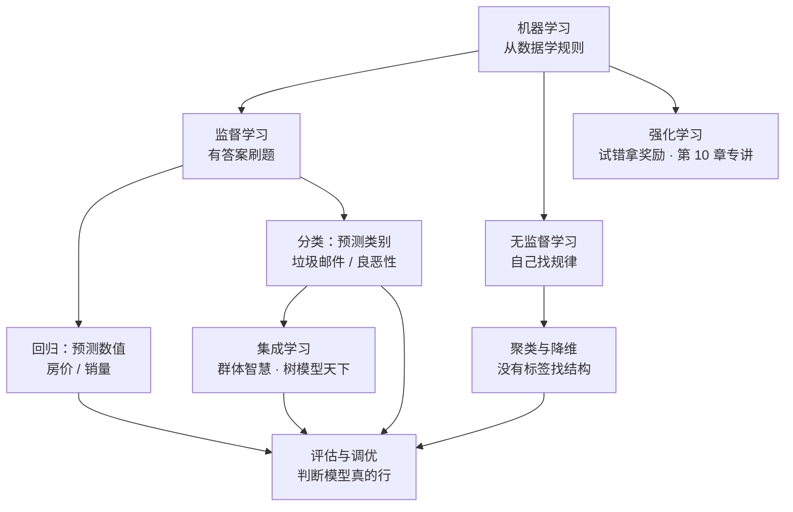

# 第 3 章：机器学习 🤖

> 前两章的数学是"语言"，这一章开始说"正事"：在深度学习出现之前，人们怎么让机器**从数据里学出规则**，而不是由人一条条写规则？本章是全书世界观的来源——**数据 → 模型 → 评估** 这套流程，后面所有深度学习内容本质上都是它的延伸。读完本章，你能亲手训练、评估、调优一批经典模型，并知道每种方法适合什么场景。

[⬆️ 返回总目录](../../../README.md) · [⬆️ 返回本篇](../README.md)

## 🗺️ 本章知识树

机器学习按"数据有没有答案"分成三大流派——这也是全书反复出现的分类框架：

- **监督学习（Supervised Learning）= 有答案刷题**：数据自带标签，模型对着标准答案学，学完去考新的题；
- **无监督学习（Unsupervised Learning）= 自己找规律**：没有标签，把相似的样本自动归堆、把高维数据压到能看；
- **强化学习（Reinforcement Learning）= 试错拿奖励**：没有标准答案，动作做对了给奖励——它是独立的大方向，[第 10 章](../../4-专业方向/10-强化学习/README.md)专门展开，本章只在全景页路过一次。

## 📖 推荐阅读顺序

| 顺序 | 页面 | 难度 | 一句话说明 |
|------|------|------|-----------|
| 1 | [机器学习全景](./01-机器学习全景.md) | ⭐⭐ | 数据集三分、五步工作流、判别 vs 生成、过拟合初讲 |
| 2 | [线性回归](./02-线性回归.md) | ⭐⭐ | 预测数值的第一块积木：最小二乘与梯度下降 |
| 3 | [逻辑回归与分类](./03-逻辑回归与分类.md) | ⭐⭐ | 名字带"回归"实为分类：sigmoid、交叉熵、混淆矩阵 |
| 4 | [决策树与集成学习](./04-决策树与集成学习.md) | ⭐⭐ | 从"20 个问题"游戏到随机森林与 GBDT，表格数据至今的王 |
| 5 | [支持向量机](./05-支持向量机.md) | ⭐⭐⭐ | 最宽马路、支持向量、核技巧"升维打击" |
| 6 | [聚类与降维](./06-聚类与降维.md) | ⭐⭐ | 没有标签怎么办：K-Means 找堆、PCA 压维 |
| 7 | [模型评估与调优](./07-模型评估与调优.md) | ⭐⭐⭐ | 交叉验证、偏差-方差、正则化、数据泄漏 |
| 收官 | [生产实战](./99-生产实战.md) | ⭐⭐ | 表格数据项目从 0 到 1：以"用户流失预测"为例 |

> 💡 阅读提示：01 是全章地图，建议最先读；02~06 每页自带可运行代码，边读边跑效果最好；07 是收官复盘，把前面所有模型串成一套可靠的工作流。

## 🎯 读完本章你应该能

- 说清"人写规则"与"从数据学规则"的差别，以及监督 / 无监督 / 强化三大流派的边界；
- 拿到一个新问题，能判断它该用回归、分类还是聚类，并写出第一版能跑的 sklearn 代码；
- 读懂 MSE、准确率、精确率、召回率、AUC 等指标，用交叉验证判断模型是不是"真的行"；
- 识别过拟合与数据泄漏两大新手翻车点，知道正则化、树模型、核方法各自的适用场景。

## 🔗 与其他章节的关系

- **前置章节**：[第 2 章：数学基础](../../1-起步准备/02-数学基础/README.md)——梯度、矩阵、概率这些"语言工具"本章全程在用。
- **后续章节**：[第 4 章：深度学习基础](../../3-深度学习/04-深度学习基础/README.md)——神经网络就是本章"带旋钮的函数"把旋钮变多、叠成多层后的形态；损失、梯度下降、过拟合这些概念会原样沿用。
- **旁支**：[第 10 章：强化学习](../../4-专业方向/10-强化学习/README.md)——三大流派中的第三家，本章只在全景页路过。

---

[⬅️ 上一章：第 2 章：数学基础](../../1-起步准备/02-数学基础/README.md) · [返回总目录](../../../README.md) · [下一章：第 4 章：深度学习基础 ➡️](../../3-深度学习/04-深度学习基础/README.md)
