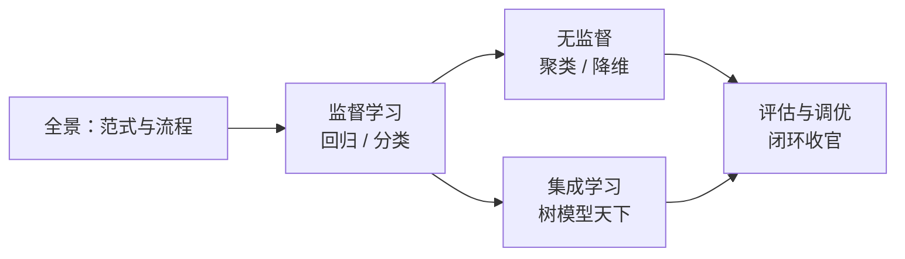

# 第二篇 · 经典机器学习 🤖

> **深度学习出现之前的世界主力，也是今天表格数据上仍难以击败的基线。** 本篇只有一个章，但它是全书世界观的来源：数据 → 模型 → 评估。后面的一切深度学习，本质都是这套流程的延伸。

[⬆️ 返回总目录](../../README.md)

## 📑 本篇包含的章节

| 章 | 标题 | 一句话定位 |
|----|------|-----------|
| 3 | 🤖 [机器学习](./03-机器学习/README.md) | 回归、分类、聚类降维、集成学习、评估与调优 |

> 📌 各章正文讲完原理后，均配有**进阶专题页**（见各章导览的阅读顺序表）与「99-生产实战」收官页。

## 🧭 篇内逻辑

第 3 章内部自成闭环：先建立"监督 / 无监督 / 强化"三大范式的全景，再依次精读回归（预测数值）、分类（预测类别）、聚类与降维（无答案找结构）、集成学习（群体智慧），最后用"评估与调优"把一切串成可靠的工作流。

## 🔗 在全书中的位置

- **上承**：[第一篇 · 起步准备](../1-起步准备/README.md)——数学语言与环境已就绪。
- **下启**：[第三篇 · 深度学习](../3-深度学习/README.md)——当数据从表格变成图像和文本，经典方法遇到了什么瓶颈，以及神经网络如何接棒。

---

[⬆️ 返回总目录](../../README.md)
