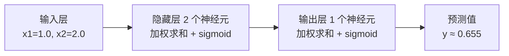

# 神经网络是怎么炼成的

> **一句话理解**：神经网络就是把一堆"加权投票 + 非线性弯折"的小单元串成流水线，一层一层把原始数据加工成越来越抽象的特征——特征不再靠人设计，而是网络自己学出来的。

[⬆️ 返回总目录](../../../README.md) · [⬆️ 返回本篇](../README.md) · [⬅️ 返回本章目录](./README.md)

| 属性 | 说明 |
|------|------|
| 难度 | ⭐⭐⭐（较难） |
| 所属分支 | 通用基础 |
| 前置知识 | [逻辑回归与分类](../../2-经典机器学习/03-机器学习/03-逻辑回归与分类.md)；[线性代数](../../1-起步准备/02-数学基础/02-线性代数.md) |

---

## 📌 这一节解决什么问题

识别一张猫的照片，传统做法要人先设计特征：耳朵是三角形、瞳孔是竖线……再把这些特征喂给分类器。问题在于，特征设计既费人力又限上限——猫蜷成一团睡觉时，"三角形耳朵"就失效了；换到语音、文本，人甚至连"该怎么设计特征"都说不上来。

1958 年提出的感知机（Perceptron）迈出第一步：让机器自己根据数据调整"投票权重"。但单层感知机很快被证明有硬伤——连最简单的异或（XOR）问题都解不了，因为它只能在平面上画一条直线切分数据。

突破口是**层数**：把多个感知机叠成多层感知机（Multi-Layer Perceptron, MLP），中间加上非线性弯折，网络就能表达任意复杂的边界。层数一深，"深度学习"由此得名。特征工程的活儿，就这样从人手里交给了网络。

## 🌱 通俗理解

把每个神经元想成一位**评委在加权投票**：几个证据各有一个"信任度"（权重），加权求和后再加上一个"个人偏好"（偏置），得到总分。感知机就是一位评委；多层感知机是一排评委。

关键在"层"怎么协作——把网络想成一条**流水线车间**：

- 第一车间（第一层）看最原始的原料：像素、字符；
- 每过一道工序，产品就更抽象一点：像素 → 线条 → 耳朵/轮子 → "这是一只猫"；
- 每一层都在把上一层的表示**加工得更抽象**，最后一层直接给出判断。

那"非线性弯折"是干嘛的？想象你手里有一张平铺的纸（数据点摊在平面上），线性变换只允许你**平移、旋转、均匀拉伸**这张纸——纸永远是平的，平面上分不开的点，怎么转都分不开。非线性激活函数相当于允许你**折纸**：沿着某条线一折，原来搅在一起的两类点立刻被折到了上下两面。这就是"没有非线性，叠一百层也没用"的直觉来源（下一节用公式证明）。

## 📋 举个例子

造一个最小网络：**2 个输入 → 隐藏层 2 个神经元（sigmoid 激活）→ 1 个输出（sigmoid 激活）**。所有权重全部给出：

| 部件 | 参数 | 数值 |
|------|------|------|
| 输入 | x1, x2 | 1.0, 2.0 |
| 隐藏神经元 h1 | w11, w12, b1 | 0.6, 0.4, 0.1 |
| 隐藏神经元 h2 | w21, w22, b2 | -0.2, 0.8, -0.1 |
| 输出神经元 o | v1, v2, b | 1.5, -1.0, 0.2 |

手算前向传播（Forward Propagation），只有三步：

| 步骤 | 计算 | 结果 |
|------|------|------|
| ① 隐藏层加权求和 | z_h1 = 0.6×1.0 + 0.4×2.0 + 0.1 | 1.5 |
| | z_h2 = -0.2×1.0 + 0.8×2.0 − 0.1 | 1.3 |
| ② sigmoid 激活 | a_h1 = σ(1.5)，a_h2 = σ(1.3) | ≈ 0.818，≈ 0.786 |
| ③ 输出层 | z_o = 1.5×0.818 − 1.0×0.786 + 0.2 → y = σ(0.641) | **y ≈ 0.655** |

就这么简单：**加权求和 → 过一遍激活函数 → 喂给下一层**，直到输出。这个 0.655 和这套权重在下一页《训练一个模型的完整流程》里还要接着用——误差 0.3 怎么沿网络"追责"回去，就从这个数字开始。

<details>
<summary>📊 展开完整算例（含 sigmoid 逐个计算）</summary>

sigmoid 公式为 $\sigma(z) = \frac{1}{1+e^{-z}}$，只需要知道 $e^{-1.5} \approx 0.223$、$e^{-1.3} \approx 0.273$、$e^{-0.641} \approx 0.527$：

1. **隐藏层 h1**：z = 0.6×1.0 + 0.4×2.0 + 0.1 = 1.5
   σ(1.5) = 1 / (1 + 0.223) = 1 / 1.223 ≈ **0.818**
2. **隐藏层 h2**：z = -0.2×1.0 + 0.8×2.0 − 0.1 = 1.3
   σ(1.3) = 1 / (1 + 0.273) = 1 / 1.273 ≈ **0.786**
3. **输出层**：z = 1.5×0.818 + (−1.0)×0.786 + 0.2 = 1.227 − 0.786 + 0.2 = 0.641
   σ(0.641) = 1 / (1 + 0.527) = 1 / 1.527 ≈ **0.655**

全部数字与下方代码的输出一致，可以跑代码验证。

</details>

## 🧠 核心原理

### 整体流程



再放一张"逐层抽象"的直觉图——层数越深，表示越抽象，这是深度学习的本质卖点：


### 逐步拆解

**① 神经元 = 加权投票。** 单个神经元做的事只有一件：

$$
z = w_1 x_1 + w_2 x_2 + b
$$

> 👉 **人话**：每个证据乘上"信任度"，加起来，再补一个"起评倾向"。你在网购时综合评分、价格、销量决定买不买，脑子里干的就是这件事。

**② 激活函数 = 非线性弯折。** 加权求和之后必须过一个非线性函数，比如 sigmoid：

$$
\sigma(z) = \frac{1}{1+e^{-z}}
$$

> 👉 **人话**：把"−∞ 到 +∞ 的总分"压成"0 到 1 的概率"。不管评委打分多极端，最后只报一个 0~1 的态度。

**③ 为什么必须非线性？** 假设去掉激活函数，两层"线性网络"叠加起来：

$$
a = W_2(W_1 x + b_1) + b_2 = \underbrace{(W_2 W_1)}_{\text{还是一个矩阵}}x + \underbrace{(W_2 b_1 + b_2)}_{\text{还是一个偏置}}
$$

> 👉 **人话**：两个"只许平移旋转拉伸"的变换叠在一起，还是同一种变换——纸没折，怎么叠一百层都还是平的。加一个非线性弯折，一百层才真正有了"一层比一层复杂"的表达力。

**④ 常用激活函数一览：**

| 激活函数 | 公式 | 人话 | 常用位置 |
|----------|------|------|----------|
| Sigmoid | $\frac{1}{1+e^{-z}}$ | 压成 0~1 概率，容易"梯度饱和"（两端变懒） | 输出层做二分类 |
| Tanh | $\frac{e^z - e^{-z}}{e^z + e^{-z}}$ | 压成 −1~1，零中心，比 sigmoid 温和 | 老式 RNN |
| ReLU | $\max(0, z)$ | 负数归零、正数原样放行，又快又不容易饱和 | 隐藏层默认选项 |

$$
\mathrm{ReLU}(z) = \max(0, z)
$$

> 👉 **人话**：一个"不及格就归零"的闸门——简单粗暴，但训练大网络时偏偏最有效，是现代深度学习的默认起点。

**⑤ 万能近似（Universal Approximation）一句话**：理论上，只要隐藏神经元够多，一个单隐层网络就能逼近任意连续函数。但**能逼近 ≠ 能学到**——定理只保证"存在这样一个网络"，不保证你的数据和优化器能把它找出来。学习靠的是下一页的训练流程。

<details>
<summary>🧮 展开看：感知机为什么解不了 XOR</summary>

XOR（异或）四个点：(0,0)→0，(0,1)→1，(1,0)→1，(1,1)→0。在平面上画出来，两个"1"的点在一对角线上，两个"0"的点在另一对角线上——**不存在一条直线**能把两种点分开，这就是"线性不可分"。感知机的决策边界恰好只能是一条直线，所以无论怎么调权重都无解。

加一个隐藏层就不同了：先用两个神经元各画一条线，围出一个"角区域"把 (1,1) 与其余点分开，输出层再组合这两条线的结果——相当于把平面**折了一下**。这个历史事件（1969 年《Perceptrons》一书指出该缺陷）让神经网络研究一度进入寒冬，直到多层网络与反向传播流行才回暖。

</details>

## 💻 动手试试

```python
# 依赖：pip install numpy torch
import numpy as np

# ---------- 第一段：numpy 手写前向传播（和上面算例完全一致） ----------
def sigmoid(z):
    return 1 / (1 + np.exp(-z))

x = np.array([1.0, 2.0])            # 输入
W1 = np.array([[0.6, 0.4],          # h1 的两个权重
               [-0.2, 0.8]])        # h2 的两个权重
b1 = np.array([0.1, -0.1])          # 隐藏层偏置
W2 = np.array([1.5, -1.0])          # 输出神经元权重
b2 = 0.2

h = sigmoid(W1 @ x + b1)            # 隐藏层输出
y = sigmoid(W2 @ h + b2)            # 最终输出
print("隐藏层:", np.round(h, 4))     # 预期 [0.8176 0.7858]
print("输出:", round(float(y), 4))   # 预期 0.6549

# ---------- 第二段：PyTorch nn.Sequential 等价实现 ----------
import torch
import torch.nn as nn

model = nn.Sequential(              # 按顺序摞起来的积木
    nn.Linear(2, 2),                # 隐藏层：2 输入 → 2 神经元（含权重和偏置）
    nn.Sigmoid(),                   # 激活函数
    nn.Linear(2, 1),                # 输出层：2 → 1
    nn.Sigmoid(),
)
# 把手工设计的权重"灌"进模型，保证两段结果完全一致
with torch.no_grad():
    model[0].weight.copy_(torch.tensor(W1))
    model[0].bias.copy_(torch.tensor(b1))
    model[2].weight.copy_(torch.tensor(W2.reshape(1, -1)))
    model[2].bias.copy_(torch.tensor([b2]))

out = model(torch.tensor(x).unsqueeze(0))
print("PyTorch 输出:", round(float(out), 4))   # 预期 0.6549
```

同一套计算，numpy 要自己写矩阵乘法和激活，PyTorch 用 `nn.Sequential` 几行搭完——而且 PyTorch 版还自带"自动求梯度"的超能力，下一页就靠它训练。

## 🔥 炼丹小灶

> 🔥 **炼丹小灶**：工业界常用起点与玄学——
> - 配方：隐藏层激活函数默认从 ReLU 起步；二分类输出层用 Sigmoid，多分类输出层用 Softmax；
> - 玄学：网络不收敛时，先怀疑激活函数选了 Sigmoid 太深（梯度饱和）、学习率太大，再怀疑人生；
> - ⚠️ 以上是经验参考值，不是圣旨；换数据集请重新炼。

## 🖱️ 动手玩

> 🕹️ **延伸玩一玩**：[TensorFlow Playground](https://playground.tensorflow.org)——在浏览器里拖出一个神经网络，实时看决策边界随层数、神经元数、激活函数变化：先去掉隐藏层看它解不了 XOR，再加一层看边界"折"出来。

## 🔗 在知识树中的位置

- **上游**：[逻辑回归与分类](../../2-经典机器学习/03-机器学习/03-逻辑回归与分类.md)——逻辑回归本质就是"单个神经元 + sigmoid"；[线性代数](../../1-起步准备/02-数学基础/02-线性代数.md)——整层神经元的加权求和就是一次矩阵乘法。
- **下游**：[训练一个模型的完整流程](./02-训练一个模型的完整流程.md)——网络搭好了，怎么让它学会？；后续的 [CNN 卷积神经网络](../../4-专业方向/05-计算机视觉/01-CNN卷积神经网络.md)、[Transformer 与注意力机制](../../4-专业方向/07-自然语言处理与LLM/02-Transformer与注意力机制.md)都是本章 MLP 的"结构变体"。
- **横向对比**：树模型（第 3 章）吃人工特征、表格数据上又快又稳；神经网络吃原始高维数据、靠层数自动学特征——两边的适用场景见[本章导览](./README.md)的对比表。

## ⚠️ 常见误区

- **误区一**：神经元在模拟大脑，层数越多越"智能" → 神经元只是"加权求和 + 非线性"的数学运算，名字是历史致敬；层数加深带来的是表达力，也带来训练难度和过拟合风险。
- **误区二**：不加激活函数，多叠几层总能更强大 → 线性叠加仍等价于单层线性变换（见上文公式），一百层白叠。
- **误区三**：万能近似定理保证网络能学会任何东西 → 定理只说"存在这样的网络"，能不能学到取决于数据量、优化器和训练技巧——能逼近 ≠ 能学到。

## 📝 小结与自测

**要点回顾**

- 神经元 = 加权投票（加权求和 + 偏置），感知机是单个神经元，多层感知机靠层数取胜；
- 层 = 流水线车间，逐层把表示加工得更抽象，特征从"人设计"变成"网络自己学"；
- 激活函数必须非线性，否则叠多少层都塌缩回一层线性变换；隐藏层默认从 ReLU 起步；
- 万能近似定理：能逼近任意连续函数 ≠ 真的能学到它。

**自测一下**（点击展开答案）

<details>
<summary>问题 1：为什么去掉激活函数后，叠一百层网络也只相当于一层？</summary>

因为线性变换的复合仍是线性变换：$W_2(W_1x + b_1) + b_2 = (W_2W_1)x + (W_2b_1 + b_2)$，一百个矩阵连乘还是一个矩阵。非线性激活打破了这个"塌缩"，让每多一层都真正增加表达力（折纸类比：不许折纸，纸永远是平的）。

</details>

<details>
<summary>问题 2：隐藏层的激活函数，为什么工业界默认从 ReLU 而不是 Sigmoid 起步？</summary>

Sigmoid 在输入很大或很小时几乎水平（梯度接近 0），深层网络里梯度连乘后容易"消失"，导致靠前的层几乎学不动；ReLU 计算简单（一个 max），且正区间梯度恒为 1，深层网络训练稳定得多。经验参考：现代网络隐藏层首选 ReLU 及其变体，Sigmoid 主要留给二分类输出层。

</details>

## 📚 延伸阅读

- 论文：Rosenblatt, *The Perceptron: A Probabilistic Model*（1958）——一切的开始
- 论文：Hornik et al., *Multilayer Feedforward Networks are Universal Approximators*（1989）——万能近似定理
- 可视化：[TensorFlow Playground](https://playground.tensorflow.org)——本页"动手玩"同款
- 视频：3Blue1Brown《神经网络》系列——矩阵与网络的最美可视化之一

---

[⬅️ 上一页：本章导览](./README.md) · [返回本章目录](./README.md) · [下一页：训练一个模型的完整流程 ➡️](./02-训练一个模型的完整流程.md)
