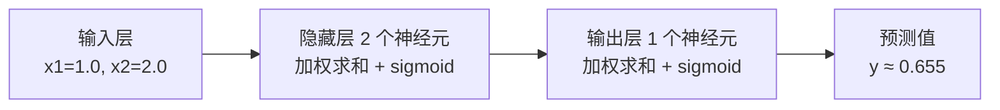
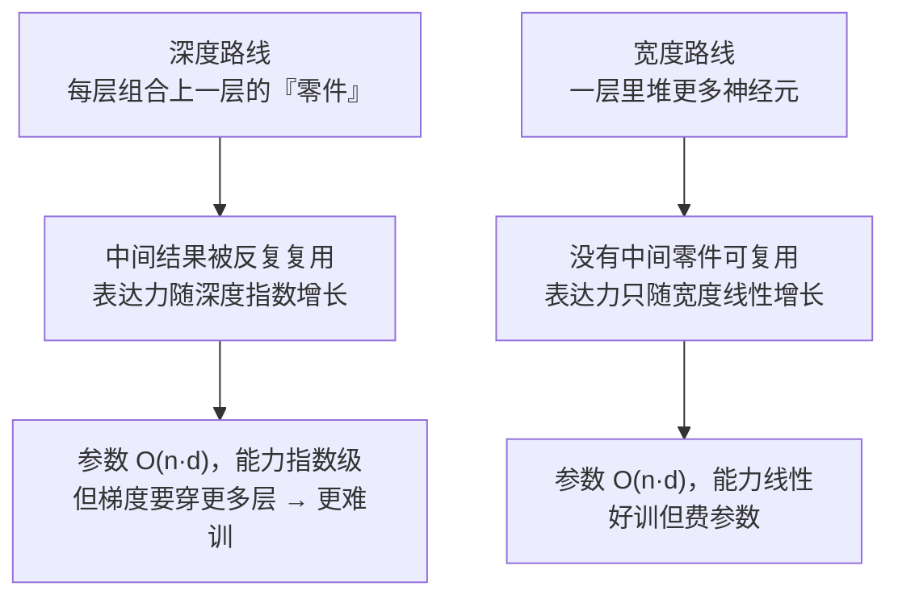

# 神经网络是怎么炼成的

> **一句话理解**：神经网络就是把一堆"加权投票 + 非线性弯折"的小单元串成流水线，一层一层把原始数据加工成越来越抽象的特征——特征不再靠人设计，而是网络自己学出来的。

[⬆️ 返回总目录](../../../README.md) · [⬆️ 返回本篇](../README.md) · [⬅️ 返回本章目录](./README.md)

| 属性 | 说明 |
|------|------|
| 难度 | ⭐⭐⭐（较难） |
| 所属分支 | 通用基础 |
| 前置知识 | [逻辑回归与分类](../../2-经典机器学习/03-机器学习/03-逻辑回归与分类.md)；[线性代数](../../1-起步准备/02-数学基础/02-线性代数.md) |

---

## 📌 这一节解决什么问题

识别一张猫的照片，传统做法要人先设计特征：耳朵是三角形、瞳孔是竖线……再把这些特征喂给分类器。问题在于，特征设计既费人力又限上限——猫蜷成一团睡觉时，"三角形耳朵"就失效了；换到语音、文本，人甚至连"该怎么设计特征"都说不上来。

1958 年提出的感知机（Perceptron）迈出第一步：让机器自己根据数据调整"投票权重"。但单层感知机很快被证明有硬伤——连最简单的异或（XOR）问题都解不了，因为它只能在平面上画一条直线切分数据。

突破口是**层数**：把多个感知机叠成多层感知机（Multi-Layer Perceptron, MLP），中间加上非线性弯折，网络就能表达任意复杂的边界。层数一深，"深度学习"由此得名。特征工程的活儿，就这样从人手里交给了网络。

但"能表达"只是拿到了入场券。一个网络最终学不学得会，还压在三件常被新手忽略的小事上：**激活函数的梯度特性、参数初始化、深度与容量的配比**。本页在讲清"网络怎么算"的同时，把这三件事一次讲透——它们是下一页训练流程能否收敛的地基。

## 🌱 通俗理解

把每个神经元想成一位**评委在加权投票**：几个证据各有一个"信任度"（权重），加权求和后再加上一个"个人偏好"（偏置），得到总分。感知机就是一位评委；多层感知机是一排评委。

关键在"层"怎么协作——把网络想成一条**流水线车间**：

- 第一车间（第一层）看最原始的原料：像素、字符；
- 每过一道工序，产品就更抽象一点：像素 → 线条 → 耳朵/轮子 → "这是一只猫"；
- 每一层都在把上一层的表示**加工得更抽象**，最后一层直接给出判断。

那"非线性弯折"是干嘛的？想象你手里有一张平铺的纸（数据点摊在平面上），线性变换只允许你**平移、旋转、均匀拉伸**这张纸——纸永远是平的，平面上分不开的点，怎么转都分不开。非线性激活函数相当于允许你**折纸**：沿着某条线一折，原来搅在一起的两类点立刻被折到了上下两面。这就是"没有非线性，叠一百层也没用"的直觉来源（下一节用公式证明）。

## 📋 举个例子

造一个最小网络：**2 个输入 → 隐藏层 2 个神经元（sigmoid 激活）→ 1 个输出（sigmoid 激活）**。所有权重全部给出：

| 部件 | 参数 | 数值 |
|------|------|------|
| 输入 | x1, x2 | 1.0, 2.0 |
| 隐藏神经元 h1 | w11, w12, b1 | 0.6, 0.4, 0.1 |
| 隐藏神经元 h2 | w21, w22, b2 | -0.2, 0.8, -0.1 |
| 输出神经元 o | v1, v2, b | 1.5, -1.0, 0.2 |

手算前向传播（Forward Propagation），只有三步：

| 步骤 | 计算 | 结果 |
|------|------|------|
| ① 隐藏层加权求和 | z_h1 = 0.6×1.0 + 0.4×2.0 + 0.1 | 1.5 |
| | z_h2 = -0.2×1.0 + 0.8×2.0 − 0.1 | 1.3 |
| ② sigmoid 激活 | a_h1 = σ(1.5)，a_h2 = σ(1.3) | ≈ 0.818，≈ 0.786 |
| ③ 输出层 | z_o = 1.5×0.818 − 1.0×0.786 + 0.2 → y = σ(0.641) | **y ≈ 0.655** |

就这么简单：**加权求和 → 过一遍激活函数 → 喂给下一层**，直到输出。这个 0.655 和这套权重在下一页《训练一个模型的完整流程》里还要接着用——误差 0.3 怎么沿网络"追责"回去，就从这个数字开始。

<details>
<summary>📊 展开完整算例（含 sigmoid 逐个计算）</summary>

sigmoid 公式为 $\sigma(z) = \frac{1}{1+e^{-z}}$，只需要知道 $e^{-1.5} \approx 0.223$、$e^{-1.3} \approx 0.273$、$e^{-0.641} \approx 0.527$：

1. **隐藏层 h1**：z = 0.6×1.0 + 0.4×2.0 + 0.1 = 1.5
   σ(1.5) = 1 / (1 + 0.223) = 1 / 1.223 ≈ **0.818**
2. **隐藏层 h2**：z = -0.2×1.0 + 0.8×2.0 − 0.1 = 1.3
   σ(1.3) = 1 / (1 + 0.273) = 1 / 1.273 ≈ **0.786**
3. **输出层**：z = 1.5×0.818 + (−1.0)×0.786 + 0.2 = 1.227 − 0.786 + 0.2 = 0.641
   σ(0.641) = 1 / (1 + 0.527) = 1 / 1.527 ≈ **0.655**

全部数字与下方代码的输出一致，可以跑代码验证。

</details>

## 🧠 核心原理

### 整体流程



再放一张"逐层抽象"的直觉图——层数越深，表示越抽象，这是深度学习的本质卖点：


### 逐步拆解

**① 神经元 = 加权投票。** 单个神经元做的事只有一件：

$$
z = w_1 x_1 + w_2 x_2 + b
$$

> 👉 **人话**：每个证据乘上"信任度"，加起来，再补一个"起评倾向"。你在网购时综合评分、价格、销量决定买不买，脑子里干的就是这件事。

**② 激活函数 = 非线性弯折。** 加权求和之后必须过一个非线性函数，比如 sigmoid：

$$
\sigma(z) = \frac{1}{1+e^{-z}}
$$

> 👉 **人话**：把"−∞ 到 +∞ 的总分"压成"0 到 1 的概率"。不管评委打分多极端，最后只报一个 0~1 的态度。

**③ 为什么必须非线性？** 假设去掉激活函数，两层"线性网络"叠加起来：

$$
a = W_2(W_1 x + b_1) + b_2 = \underbrace{(W_2 W_1)}_{\text{还是一个矩阵}}x + \underbrace{(W_2 b_1 + b_2)}_{\text{还是一个偏置}}
$$

> 👉 **人话**：两个"只许平移旋转拉伸"的变换叠在一起，还是同一种变换——纸没折，怎么叠一百层都还是平的。加一个非线性弯折，一百层才真正有了"一层比一层复杂"的表达力。

**④ 常用激活函数一览：**

| 激活函数 | 公式 | 人话 | 常用位置 |
|----------|------|------|----------|
| Sigmoid | $\frac{1}{1+e^{-z}}$ | 压成 0~1 概率，容易"梯度饱和"（两端变懒） | 输出层做二分类 |
| Tanh | $\frac{e^z - e^{-z}}{e^z + e^{-z}}$ | 压成 −1~1，零中心，比 sigmoid 温和 | 老式 RNN |
| ReLU | $\max(0, z)$ | 负数归零、正数原样放行，又快又不容易饱和 | 隐藏层默认选项 |

$$
\mathrm{ReLU}(z) = \max(0, z)
$$

> 👉 **人话**：一个"不及格就归零"的闸门——简单粗暴，但训练大网络时偏偏最有效，是现代深度学习的默认起点。

**⑤ 激活函数怎么选：看的是梯度特性，不是形状。** 网络能不能训起来，取决于梯度能不能顺利从输出层流回每一层——而激活函数的**导数**正是每一环的"传导率"。下面这张深度表把主流激活函数放到同一把尺子下（死区 Dead ReLU、零中心 Zero-centered 等术语一并解释）：

| 激活函数 | 导数 | 梯度特性 | 典型失效模式 | 什么症状说明它在发生 |
|----------|------|----------|--------------|---------------------|
| Sigmoid | $\sigma(1-\sigma)$，峰值仅 **0.25** | 两端**饱和**：z 很大/很小时导数趋 0；输出非零中心，权重梯度全同号，更新走 Z 字 | 梯度消失：深层网络里导数连乘，指数级变小 | 前几层权重几乎不变（打印梯度范数 < 1e-7 量级）、loss 降得像蜗牛 |
| Tanh | $1-\tanh^2$，峰值 1.0 | **零中心**（输出有正有负），比 sigmoid 干净；两端仍饱和 | 深层依旧会消失，只是轻一些 | 老式 RNN 长序列学不动、梯度范数逐层衰减 |
| ReLU | z>0 时恒 **1**；z<0 时恒 **0** | 正区间梯度不衰减——这是深网络训得动的前提 | **死区**：某神经元输入长期 < 0 → 输出恒 0、梯度恒 0，永久"失业" | 统计各层输出恒 0 的神经元比例，大学习率训完突然过半且不恢复 |
| Leaky ReLU | 负区间给固定小斜率（如 0.01） | 给死区留一条"活路"：负区间也有微小梯度，神经元能复活 | 斜率 0.01 是拍脑袋超参 | 出现 ReLU 死区症状时换它试，常能救回 |
| GELU | 处处光滑、负区间小而非零 | 平滑版 ReLU：近原点处软过渡，处处可导 | 无明显硬失效；计算比 ReLU 稍贵 | Transformer 系默认，通常不用操心 |

用三档 z 值算一遍 sigmoid 的导数 $\sigma'(z)=\sigma(z)(1-\sigma(z))$，覆盖正常 / 极端 / 失败三种情况：

| 场景 | z | σ'(z) | 人话 |
|------|---|-------|------|
| 正常 | 0 | 0.25（峰值） | 评委最听使唤 |
| 极端（饱和） | ±10 | ≈ 4.5×10⁻⁵ | 信号太强反而"失聪"——两端躺平 |
| 失败（十层连乘） | 10 层都在 ±10 | (4.5×10⁻⁵)¹⁰ ≈ 3×10⁻⁴³ | 梯度在数学上还"存在"，数值上等于 0——**梯度消失就是这句乘法** |

> 👉 **人话**：选激活函数的本质是选"梯度传导率"。sigmoid 峰值只有 0.25，十层连乘就是 0.25¹⁰ ≈ 百万分之一——这解释了为什么深网络隐藏层默认 ReLU/GELU（正区间传导率恒为 1），sigmoid 只留给输出层当"概率翻译官"。

> 📐 ReLU 还有另一重身份：整个网络是**分段线性**的——折点、凸多面体区域与"区内线性"的严格化，见下方「数学深潜」两节。

**⑥ 前向传播的矩阵化完整版本。** 上面手算的是"一个样本、逐神经元"；真实训练是一次算一个批次（batch），整层神经元打包成一次矩阵乘法。以 32 张 28×28 灰度图（拉平成 784 维）过"784 → 256 → 10"的网络为例，逐步标注形状：

| 步骤 | 公式 | 形状变化 |
|------|------|----------|
| 输入批次 | X | (32, 784)——行=样本，列=特征 |
| 隐藏层线性 | Z₁ = XW₁ + b₁ | (32,784)×(784,256) + (256,) → **(32, 256)** |
| 激活 | A₁ = ReLU(Z₁) | (32, 256)——逐元素，形状不变 |
| 输出层线性 | Z₂ = A₁W₂ + b₂ | (32,256)×(256,10) + (10,) → **(32, 10)** |
| 概率化 | P = softmax(Z₂) | (32, 10)——每行一个样本的类别分布 |

> 👉 **人话**：一层 = 一次矩阵乘法 + 一次逐元素弯折，就这两下。批次维永远在最前，32 个样本**共享同一套权重**——GPU 靠"把很多样本摞成大矩阵一次乘"来吃饱，这就是为什么框架里你几乎从不写 for 循环逐样本算。

工程注记：PyTorch 的 `nn.Linear(784, 256)` 内部把权重存成 (256, 784) 并按 `x @ W.T + b` 计算，数学上与上表完全一致，只是存储约定不同。

**⑦ 参数初始化：训练开始前的隐形生死。** 权重最初的取值不是小事——两种经典死法：

- **全零（或全相同）初始化 = 对称性死亡**：同层所有神经元权重一样 → 前向输出一样 → 反向拿到的梯度也一样 → 永远同步更新。100 个神经元从第一秒起就等价于 1 个，多雇的 99 个是白花钱。症状：打印隐藏层输出，所有神经元一模一样。
- **初始化幅度过大/过小**：过大 → 每层信号方差逐层放大，几层后 sigmoid 饱和（回到⑤的失聪现场），loss 第一轮就可能是 NaN；过小 → 信号逐层衰减到接近 0，深层形同虚设。

健康的初始化目标是**方差守恒**：信号和梯度穿过一层时既不放大也不衰减。由此得到两条经典配方：

$$
\text{Xavier：}\ \mathrm{Var}(w) = \frac{2}{n_{\text{in}} + n_{\text{out}}}
\qquad
\text{He：}\ \mathrm{Var}(w) = \frac{2}{n_{\text{in}}}
$$

> 👉 **人话**：一个神经元的输入越多（n_in 越大），每个权重就该越小——人越多，每人分的责任越轻，总声音（方差）才不炸。Xavier 配 sigmoid/tanh；ReLU 砍掉了一半信号（负半轴归零），所以 He 配方把分子补成 2，把砍掉的方差填回来。

<details>
<summary>🧮 展开看：Xavier / He 配方的推导</summary>

**前向方差守恒。** 设某神经元 $z = \sum_{i=1}^{n} w_i x_i$，各 $w_i, x_i$ 独立零均值，则：

$$
\mathrm{Var}(z) = \sum_{i=1}^{n} \mathrm{Var}(w_i x_i) = n \cdot \mathrm{Var}(w) \cdot \mathrm{Var}(x)
$$

> 👉 **人话**：n 个"权重×输入"的方差直接相加——输入个数越多，单个权重越该取小，总音量（方差）才能维持不变。

要求 $\mathrm{Var}(z) = \mathrm{Var}(x)$（信号穿过一层强度不变），解得 $\mathrm{Var}(w) = 1/n$。

**反向梯度守恒。** 反向传播时梯度沿 $\frac{\partial L}{\partial x_i} = w_i \frac{\partial L}{\partial z}$ 回流，每个输入只经过 1 个权重（但该神经元有 $n_{\text{out}}$ 个下游），同理要求 $\mathrm{Var}(w) = 1/n_{\text{out}}$。

**Xavier（2010）**：两个约束各让一步，取 $\mathrm{Var}(w) = \frac{2}{n_{\text{in}}+n_{\text{out}}}$——前向、反向都不炸。

**He（2015）**：ReLU 把一半（期望上）激活置零，$\mathrm{Var}(\mathrm{ReLU}(z)) \approx \frac{1}{2}\mathrm{Var}(z)$，要补回来就取 $\mathrm{Var}(w) = \frac{2}{n_{\text{in}}}$。

数字感受：n_in = 784 时，He 建议权重标准差 ≈ √(2/784) ≈ 0.05——"小而随机"，既打破对称，又不放大信号。

</details>

实操：PyTorch 的 `nn.Linear` 默认已是 Kaiming 均匀初始化，一般无需手动改；只有手写大网络、或迁就特殊激活函数时才需要显式设置。诊断口诀：**第一轮前向就 NaN → 初始化过大或 lr 过大；隐藏层输出全相同 → 撞上对称性死亡。**

**⑧ 万能近似：严谨表述与它的误导性。** 定理的准确说法是：

$$
\forall\, f \in C(K),\ \forall\, \varepsilon > 0,\ \exists\, m,\theta:\quad \sup_{x \in K}\left| f(x) - g_{m,\theta}(x) \right| < \varepsilon
$$

> 👉 **人话**：紧集 K 上的任意连续函数 f，对任意精度要求 ε，**存在**一个足够宽的单隐层网络 g 能逼近到这个精度。注意三个词：连续函数、任意精度、**存在**。

误导性恰恰藏在"存在"里，至少四条：

1. **非构造性**：定理不告诉你那个网络长什么样、去哪找——找它正是训练要干的活，而训练可能失败；
2. **不保证省参数**：需要的隐层宽度 m 可能随精度指数增长；实测中"又宽又浅"常输给"又深又窄"（见⑨）；
3. **不涉及优化**：有限数据 + 梯度下降完全可能停在离那个理论解很远的地方；
4. **不涉及数据**：数据没覆盖到的区域，网络爱预测什么预测什么（这也是过拟合的来源之一）。

一句话版本：**万能近似说的是"这种结构装得下这个函数"，不是"你的训练能找到它"**——存在 ≠ 可学。

<details>
<summary>🧮 展开看：感知机为什么解不了 XOR</summary>

XOR（异或）四个点：(0,0)→0，(0,1)→1，(1,0)→1，(1,1)→0。在平面上画出来，两个"1"的点在一对角线上，两个"0"的点在另一对角线上——**不存在一条直线**能把两种点分开，这就是"线性不可分"。感知机的决策边界恰好只能是一条直线，所以无论怎么调权重都无解。

加一个隐藏层就不同了：先用两个神经元各画一条线，围出一个"角区域"把 (1,1) 与其余点分开，输出层再组合这两条线的结果——相当于把平面**折了一下**。这个历史事件（1969 年《Perceptrons》一书指出该缺陷）让神经网络研究一度进入寒冬，直到多层网络与反向传播流行才回暖。

</details>

**⑨ 容量与深度：为什么"深"比"宽"高效。** 同样 10 万个参数，堆深还是堆宽？理论答案是深：



- **组合性一句话**：深网络的每个中间结果都会被下一层的**所有**神经元重新组合——零件被反复复用，表达力随深度指数增长而参数只线性增长；宽网络是一次性雇更多工人，谁也不复用谁的半成品。
- **理论注脚**：已有严格结果证明存在这类函数——用 k 层网络多项式规模就能表示，用 k−1 层却需要指数规模的神经元（Telgarsky, 2016）。"深"不是玄学偏好，是有数学撑腰的省参数方案。
- **失效边界（深也有代价）**：梯度要穿更多层，对激活函数、初始化、残差连接（ResNet 的发明动机）更敏感；深网络参数多、数据少时更容易过拟合。所以工程上的答案是"**够深的网络 + 配套的训练技巧**"，而不是无脑加深。

### 📐 数学深潜：ReLU 网络的分段线性本质——折点、凸多面体与"区内线性"

⑤说 ReLU"负数归零、正数放行"，⑨说深度"表达力指数增长"。这两句话都能完全严格化——ReLU 网络有一个可以一步步手算出来的几何身份：**分段仿射函数（piecewise affine function）**。

**严格陈述。** 设单隐藏层 ReLU 网络（K 个隐藏单元、一维输出）：

$$
g(x) = \sum_{j=1}^{K} u_j \max\big(0,\ w_j^{\mathsf{T}}x + b_j\big) + c
$$

> 👉 **人话**：这行就是"K 个 ReLU 神经元加权求和"的数学原形——每个隐藏单元的预激活 $w_j^{\mathsf{T}}x+b_j$ 过一道 max(0,·) 闸门，再加权汇总。

则：每个隐藏单元的预激活超平面 $H_j=\{x:\ w_j^{\mathsf{T}}x+b_j=0\}$（**符号在此切换、闸门在此开合**）把输入空间切成有限个**凸多面体区域（convex polyhedra）**；在每个区域的内部，g 严格等于一个仿射函数。一句话：**ReLU 网络 = 连续分段仿射函数**。

> 👉 **人话**：ReLU 网络再宽再深，本质是一把"尺子接尺子"的折线尺——每个隐藏单元贡献一条折痕；两条折痕之间夹的每一段，网络都是一条老老实实的直线（高维是一张平面）。所谓智能，全部藏在"怎么折、每段斜率给多少"里。

**完整推导：一维输入，3 个隐藏单元，手算出 4 段折线。** 一维时预激活就是 $w_jx+b_j$，符号切换点（折点）为 $x=-b_j/w_j$。取：

| 隐藏单元 | 预激活 a_j(x) | 折点 −b_j/w_j | 输出权重 u_j |
|---|---|---|---|
| h₁ | x + 1 | −1 | 1 |
| h₂ | −x + 1 | +1 | 1 |
| h₃ | x | 0 | 2 |

即 $g(x)=\max(0,x+1)+\max(0,-x+1)+2\max(0,x)$。三个折点 −1、0、1 把数轴切成 4 段，每段内逐一判断各单元"活没活"（预激活是否 > 0）：

| 区间 | h₁ | h₂ | h₃ | 区内化简 | 斜率 |
|---|---|---|---|---|---|
| x < −1 | 死 | 活 | 死 | 1 − x | −1 |
| −1 < x < 0 | 活 | 活 | 死 | (x+1)+(−x+1) = 2 | 0 |
| 0 < x < 1 | 活 | 活 | 活 | 2 + 2x | +2 |
| x > 1 | 活 | 死 | 活 | (x+1)+2x = 3x+1 | +3 |

抽查两点验证"区内一个公式管到底"：g(2) = max(0,3)+max(0,−1)+2·max(0,2) = 3+0+4 = **7**，与段④公式 3×2+1 = 7 一致 ✓；g(−2) = 0+3+0 = **3**，与段①公式 1−(−2) = 3 一致 ✓。连续性也是白送的：每个折点两侧的公式在该点取值相同（如 x=0 处段②给 2，段③给 2+2×0 = 2）。

> 👉 **人话**：注意斜率变化的规律——跨过 −1 点 h₁ 开启，斜率 −1→0，跳了 u₁w₁ = 1；跨过 0 点 h₃ 开启，0→2，跳了 u₃w₃ = 2；跨过 1 点 h₂ 关闭，2→3，跳了 −u₂w₂ = +1。**折痕摆哪由 (w_j, b_j) 决定，每段斜率由活跃单元的 Σu_jw_j 决定**——ReLU 网络的全部参数就花在这两件事上。

```
g(x)（上面 3 单元网络的 4 段折线，一图对一表）

 7 │                              •(2,7)        段④ 3x+1，斜率 +3
 6 │                           /
 5 │                       /
 4 │                  •(1,4)                   段③ 2+2x，斜率 +2
 3 │ •(−2,3)        /
 2 │        •(−1,2)•(0,2)                      段② 常数 2，斜率 0
 1 │      /
 0 └──┬───┬───┬───┬───┬───┬──► x
   −3  −2  −1   0   1   2
        段① 1−x，斜率 −1（区间 (−∞,−1)）
```

**推广到多维：超平面剖分出凸多面体，区内退化为仿射函数。**

<details>
<summary>🧮 展开推导：区域为什么是凸的、区内为什么是仿射的、区域数上限</summary>

**第一步：每个区域是凸多面体。** 固定一个激活模式（哪些单元的预激活为正）后，满足它的点集是若干开半空间之交：

$$
\bigcap_{j\in A}\{x:\ w_j^{\mathsf{T}}x+b_j>0\}\ \cap\ \bigcap_{j\notin A}\{x:\ w_j^{\mathsf{T}}x+b_j<0\}
$$

（半空间 = 超平面一侧的所有点。）

半空间是凸集，且**凸集之交仍是凸集**——逐点验证：交集中任取两点 x、y，它们各自落在每个半空间里；凸集的定义保证连线 θx+(1−θ)y 也落在每个半空间里，于是落在交集里。有限个半空间之交，正是凸多面体的定义。

**第二步：区内 g 是仿射函数。** 在激活集合 A 固定的区域内，每个 max(0,·) 的取值已经确定，直接展开：

$$
g(x) = \sum_{j\in A} u_j\,(w_j^{\mathsf{T}}x + b_j) + c
     = \Big(\sum_{j\in A} u_j w_j\Big)^{\mathsf{T}} x \;+\; \Big(c + \sum_{j\in A} u_j b_j\Big)
$$

（把"和的线性"重排成"一个固定向量乘 x 加一个固定常数"。）

括号里两个量在区内都是常数——g 就是一个标准的仿射函数（线性函数 + 偏置）。∎

**第三步：区域数上限（喂给下一小节）。** 一般位置下，d 维空间中 K 张超平面最多切出 $\sum_{i=0}^{d}\binom{K}{i}$ 个区域：d=1 时 = K+1（K 个点切 K+1 段）；d=2 时 = 1+K+K(K−1)/2，如 3 条直线最多切出 7 块。递归直觉：放入第 K 张超平面时，它被前面 K−1 张切成若干片，每片都把原来一个区域一分为二。**注意这是"一层网络"的区域数上限——多层会远超它，这正是下一小节的主题。**

</details>

**几何图景（2D 示意）**：两张超平面（直线）把平面切成 4 个凸区域，每个区域内激活集固定、网络退化为一张仿射平面：

```
                H₁：w₁ᵀx + b₁ = 0
                    │
   R₃ ▒▒▒▒▒▒▒▒▒     │     R₄ ▒▒▒▒▒▒▒▒▒
   {a₁>0, a₂<0}     │     {a₁>0, a₂>0}
   此区内网络=线性₃  │     此区内网络=线性₄
                    │
────────────────────┼─────────────────────  H₂：w₂ᵀx + b₂ = 0
                    │
   R₂ ▒▒▒▒▒▒▒▒▒     │     R₁ ▒▒▒▒▒▒▒▒▒
   {a₁<0, a₂<0}     │     {a₁<0, a₂>0}
   此区内网络=线性₂  │     此区内网络=线性₁
                    │

  每个区域 = 两个半平面之交 = 凸多边形（多维时凸多面体）；
  区域内激活集固定 → 网络退化为一张仿射平面（"此区内网络 = 线性"）
```

**反例与边界。**

1. **折点上不可导**：max(0,x) 在原点左导数 0、右导数 1，经典导数不存在。训练用的是次梯度（在 [0,1] 里任取一值），而输入恰好落在折点上的概率为 0（测度零），实践无碍——但"ReLU 网络处处可导"这句数学陈述确实不成立；
2. **这是 ReLU 特有的结构**：sigmoid/tanh/GELU 网络光滑，不存在这种"区域 + 平面"的精确剖分（GELU 是把折痕磨圆的近似版，上述定理对它失效）；
3. **深层 ReLU 仍是分段仿射，但区域远不止"超平面排列"**：分段仿射函数的复合仍是分段仿射（仿射套仿射），所以深网络照样"区内线性"；但它的区域边界是被前面各层"折弯过的超平面"，数量可达指数级——见下一小节；
4. **"区域内线性" ≠ "表达力弱"**：区域数可以是天文数字（下一小节），弱的是**每一小段内部**，不是全局。

> 👉 **人话总结**：ReLU 网络是一台"切空间机器"——每个隐藏单元沿自己的超平面把输入空间切开，切出一间间凸房间，每间房里只摆一张仿射平面；表达力 = 房间数量 × 每间房的自由度。

### 📐 数学深潜：深度的组合威力——折点数量的计数与"深度高效"的严格化

⑨用"零件复用"讲了深比宽高效的直觉，这里把它落到能数出来的东西上：**数折线段数**（一维）或线性区域数（多维）。

**严格陈述。**（一维版本，全部可手算验证）

1. 单隐藏层、K 个 ReLU 单元的一维网络，折线**至多 K+1 段**（K 个折点互不重合时恰好取到）；
2. 两个隐藏层、各 K 个单元，段数**可达 (K+1)² 量级**；L 层各 K 个单元，段数**可达 (K+1)^L 量级**——随深度指数增长；
3. 对照：单层网络要折出 (K+1)^L 段，需要约 (K+1)^L 个单元。**同样的段数，浅层要指数多的参数**——这就是"深比宽高效"的可计数版本（多维区域的严格结果见 Telgarsky 2016 与 Montúfar et al. 2014，已列入延伸阅读）。

> 👉 **人话**：一层 K 个单元最多折 K 次；两层为什么能折出"平方"次？因为第二层折的不再是 x，而是**第一层折完的折线**——折线的每一段再被折一次，段数按乘法涨。深度买到乘法，宽度只买到加法。

**完整推导：段数乘法引理 + 折纸机构造。**

<details>
<summary>🧮 展开推导：段数为什么按乘法增长，以及一个能折出 2^t 段的显式构造</summary>

**引理（段数乘法）。** 设 g 是 p 段分段线性函数、h 是 q 段分段线性函数，则复合 h∘g 至多 p×q 段。

证明：在 g 的某一段（区间 I）上 g(x) = αx + β 仿射。若 α = 0，h∘g 在 I 上是常数，占 1 段。若 α ≠ 0，g 把 I 一对一地映到一个区间；h 的 q−1 个折点取值中落在该区间内的每一个，都对应 I 上**至多一个**原像点（仿射映射单射），把 I 至多切成 q 小段，每小段上 h∘g = h(仿射) = 线性。p 段合计 ≤ p×q。∎

**推论。** 每层 K 单元 ≤ K+1 段 ⟹ L 层 ≤ (K+1)^L 段。

**可达性构造（折纸机）。** 取折叠函数 φ(x) = |2x−1|，用 2 个 ReLU 实现：

$$
\varphi(x) = 2\max(0,\,x-\tfrac12) + 2\max(0,\,\tfrac12 - x)
$$

（x>½ 时右边 = 2(x−½) = 2x−1 ✓；x<½ 时 = 2(½−x) = 1−2x ✓。）

φ 是 2 段折线；φ∘φ 恰好 4 段（引理上界 2×2 取到：φ(x)=½ 的两个解加上 φ 自己的折点，共 3 个新折点）；归纳可得 φ 复合 t 次 = 2^t 段。**每叠一层只添常数个单元、常数个参数，段数却翻倍**——参数线性涨、段数指数涨。

**小算例。** 每层 K=10 单元、L=6 层（一维每层约 10 权重 + 10 偏置 = 20 参数，共约 120 参数）：段数上限 11⁶ ≈ 1.77×10⁶ 段；单层网络想折出同样段数需要约 177 万个单元——**同参数量差 4 个数量级**。

</details>

**几何/直觉图景：折纸再折纸。**

```
折 1 次：   /\              →  2 段
折 2 次：  /\/\             →  4 段（每一段再被折一次）
折 3 次： /\/\/\            →  8 段
折 t 次： ……                 →  2^t 段——折痕数量爆炸
```

深 L 层各 K 单元 ≈ K^L 段；浅而宽 ≈ 参数量级的段数。"深度高效"的严格化直觉就是这一句乘法。

**反例与边界。**

1. **这只是表达能力上界**：构造出"最多段"的网络需要把参数摆到特定位置；训练能否从随机初始化**找到**那样的摆放是另一个问题，目前没有理论保证（呼应本页开放问题 3：表达力理论与训练动力学之间的鸿沟）；
2. **实际用不满**：实测训练出的网络，激活的线性区域数远小于理论上界——大量区域空置或冗余。"有房间"和"住满房间"是两回事；
3. **段数多 ≠ 好**：段数度量"能折多细"，与泛化无直接关系；过参数化的收益更多来自优化景观变好，而非段数本身（见⑧的"误导性"四条）；
4. **一维引理不能照搬到多维计数**：多维区域是"被折弯的超平面"的剖分，乘法直觉仍成立，但精确计数困难得多（Montúfar et al. 2014 给出的是指数下界的构造，不是精确值）。

> 👉 **人话总结**：折纸再折纸，每折一次折痕翻倍——深度的高效是"复合 = 乘法"这条组合事实；但它只保证"装得下"，不保证"找得到"。

## 💻 动手试试

```python
# 依赖：pip install numpy torch
import numpy as np

# ---------- 第一段：numpy 手写前向传播（和上面算例完全一致） ----------
def sigmoid(z):
    return 1 / (1 + np.exp(-z))

x = np.array([1.0, 2.0], dtype=np.float32)   # 输入（float32：与 PyTorch 模型参数类型对齐，float64 会报类型不匹配）
W1 = np.array([[0.6, 0.4],          # h1 的两个权重
               [-0.2, 0.8]])        # h2 的两个权重
b1 = np.array([0.1, -0.1])          # 隐藏层偏置
W2 = np.array([1.5, -1.0])          # 输出神经元权重
b2 = 0.2

h = sigmoid(W1 @ x + b1)            # 隐藏层输出
y = sigmoid(W2 @ h + b2)            # 最终输出
print("隐藏层:", np.round(h, 4))     # 预期 [0.8176 0.7858]
print("输出:", round(float(y), 4))   # 预期 0.6549

# ---------- 第二段：PyTorch nn.Sequential 等价实现 ----------
import torch
import torch.nn as nn

def build():
    model = nn.Sequential(          # 按顺序摞起来的积木
        nn.Linear(2, 2),            # 隐藏层：2 输入 → 2 神经元（含权重和偏置）
        nn.Sigmoid(),               # 激活函数
        nn.Linear(2, 1),            # 输出层：2 → 1
        nn.Sigmoid(),
    )
    # 把手工设计的权重"灌"进模型，保证两段结果完全一致
    with torch.no_grad():
        model[0].weight.copy_(torch.tensor(W1))
        model[0].bias.copy_(torch.tensor(b1))
        model[2].weight.copy_(torch.tensor(W2.reshape(1, -1)))
        model[2].bias.copy_(torch.tensor([b2]))
    return model

model = build()
out = model(torch.tensor(x).unsqueeze(0))
print("PyTorch 输出:", round(float(out), 4))   # 预期 0.6549
```

接着上面的环境，做三个"故障复现"小实验——每个实验对应本页讲的一种失效模式：

```python
# 实验① 对称性死亡：把隐藏层的权重和偏置都置零，看隐藏层输出
with torch.no_grad():
    model[0].weight.zero_()
    model[0].bias.zero_()
hidden = model[0]                               # 取出隐藏层这个 Linear
h0 = torch.sigmoid(hidden(torch.tensor(x)))
print("全零初始化的隐藏层输出:", h0.tolist())
# 预期两个神经元输出完全相同（都 = sigmoid(0) = 0.5）→ 100 个神经元等价于 1 个
# （只置零权重、偏置仍不同时，偏置会打破对称——对称性死亡要"参数全部相同"才成立）

# 实验② sigmoid 饱和：输入放大 10 倍
model2 = build()
out2 = model2(torch.tensor(x * 10))
z_h1 = (W1 @ (x * 10) + b1)[0]
print("输入放大后 z_h1 =", round(float(z_h1), 2), "，σ' =", round(float(torch.sigmoid(torch.tensor(z_h1)) * (1 - torch.sigmoid(torch.tensor(z_h1)))), 8))
# z_h1 = 14.1 → σ(14.1) ≈ 0.9999993，导数 ≈ 7.5e-7：输出几乎不动，梯度几乎为 0（饱和现场）

# 实验③ ReLU 死区：隐藏层换 ReLU 且权重全负
model3 = nn.Sequential(nn.Linear(2, 2), nn.ReLU(), nn.Linear(2, 1), nn.Sigmoid())
with torch.no_grad():
    model3[0].weight.fill_(-0.5)    # 所有输入 x > 0 → z = -0.5(x1+x2) + b 恒负
hidden3 = model3[:2]                             # 取出"Linear+ReLU"两件套
print("ReLU 死区隐藏层输出:", hidden3(torch.tensor(x)).tolist())
# 预期 [0., 0.]：输出恒 0、梯度恒 0，这两个神经元从此"失业"
```

**改什么参数、看什么变化**：实验②里把放大倍数从 10 改成 2、5、50，观察 σ' 从 1e-2 一路掉到接近机器零——这就是"饱和"的渐变过程；实验③里把 `fill_(-0.5)` 改成 `fill_(0.1)`（正权重），死区消失——死不死取决于**权重符号与输入的搭配**，不是 ReLU 本身有罪。

同一套计算，numpy 要自己写矩阵乘法和激活，PyTorch 用 `nn.Sequential` 几行搭完——而且 PyTorch 版还自带"自动求梯度"的超能力，下一页就靠它训练。

## 🔥 炼丹小灶

> 🔥 **炼丹小灶**：工业界常用起点与玄学——
> - 配方：隐藏层激活函数默认从 ReLU 起步（Transformer 类用 GELU）；二分类输出层用 Sigmoid，多分类输出层用 Softmax；初始化交给框架默认（PyTorch 已是 Kaiming 系），别手写；
> - 玄学：网络不收敛时，按"便宜到贵"的顺序排查——先查学习率、再查激活函数（sigmoid 堆深 = 梯度消失）、再查初始化（隐藏层输出全相同 = 对称性死亡）、最后才怀疑结构；
> - ⚠️ 以上是经验参考值，不是圣旨；换数据集请重新炼。

## 🖱️ 动手玩

> 🕹️ **延伸玩一玩**：[TensorFlow Playground](https://playground.tensorflow.org)——在浏览器里拖出一个神经网络，实时看决策边界随层数、神经元数、激活函数变化：先去掉隐藏层看它解不了 XOR，再加一层看边界"折"出来；然后切到 Tanh/ReLU 对比收敛速度——ReLU 明显更快，这正是⑤的梯度特性在起作用。

## 🔗 在知识树中的位置

- **上游**：[逻辑回归与分类](../../2-经典机器学习/03-机器学习/03-逻辑回归与分类.md)——逻辑回归本质就是"单个神经元 + sigmoid"；[线性代数](../../1-起步准备/02-数学基础/02-线性代数.md)——整层神经元的加权求和就是一次矩阵乘法。
- **下游**：[训练一个模型的完整流程](./02-训练一个模型的完整流程.md)——网络搭好了，怎么让它学会？；后续的 [CNN 卷积神经网络](../../4-专业方向/05-计算机视觉/01-CNN卷积神经网络.md)、[Transformer 与注意力机制](../../4-专业方向/07-自然语言处理与LLM/02-Transformer与注意力机制.md)都是本章 MLP 的"结构变体"。
- **横向对比**：树模型（第 3 章）吃人工特征、表格数据上又快又稳；神经网络吃原始高维数据、靠层数自动学特征——两边的适用场景见[本章导览](./README.md)的对比表。

## 🎓 深度视角

先说一个教程常略过的**真实取舍**：在受控小实验里，GELU 比 ReLU 好零点几个点；但在真实大模型流水线里，这个差距常被"学习率没重调、数据配比变了"淹没。工程上选激活函数的**第一理由是训练动力学的稳健性**（会不会饱和、有没有死区、梯度尺度是否恒定），第二才是那零点几个点的表达能力。同理，初始化不是"玄学起点"，而是把"训练第一步的梯度尺度"钉进可预期区间的工程规范——它的价值在大规模训练里被放大（见本章[进阶专题](./06-进阶专题-大规模训练工程.md)）。

三个深问深答（研究生资格考试 / 高级面试级别）：

**深问一：sigmoid 的"非零中心"到底通过什么机制拖慢训练？**

答：设某层输入均值 $\mu \neq 0$（sigmoid 输出恒正，天然 $\mu > 0$），则该层每个权重的梯度都是 $\delta \cdot x_i$，各分量高度同号，更新向量像只会整体漂移的车。把它写成梯度协方差矩阵能看得更清楚：

$$
\nabla_w L = \delta\, x \quad\Longrightarrow\quad \mathrm{Cov}(\nabla_w) \approx \mathbb{E}[\delta^2]\,\big(\mu\mu^{\mathsf{T}} + \Sigma_x\big)
$$

> 👉 **人话**：输入均值不为零时，梯度协方差里多出一个"秩一"的大块（μμᵀ）——所有权重倾向于一起朝同一个方向动，优化轨迹呈 Z 字折返。零中心激活、以及 BN/LN 把输入拉回零均值，都顺便拿掉了这个块，转向才灵活。

**深问二：残差网络里，"方差守恒"的初始化还够吗？**

答：不够。Xavier/He 的推导假设"信号穿过一层"，残差结构却是 $x_{l+1} = x_l + F(x_l)$——恒等支路让方差**单调累加**：

$$
\mathrm{Var}(x_{l+1}) = \mathrm{Var}(x_l) + \mathrm{Var}\big(F(x_l)\big) \ \ge\ \mathrm{Var}(x_l)
$$

> 👉 **人话**：每加一个残差分支，信号方差至少多一份——上百层堆下来方差线性膨胀，softmax/注意力一进就饱和。修法不是推翻初始化理论，而是把残差分支**最后一个投影的初始化按深度打折**（工程常见做法是乘约 $1/\sqrt{2L}$，L 为残差层数；GPT-2 以来 Transformer 实现里一脉相承的细节）。

**深问三：万能近似只说"存在"，实践中是什么让"能学到"成立的？**

答：三个经验支柱：① **过参数化（Over-parameterization）**——参数远多于拟合数据所需时，损失面上可到达的低损失区域变得稠密，梯度很少被卡死在坏鞍点；② **SGD 的隐式偏好**——同样的容量，小批量随机梯度倾向收敛到泛化不差的解（这是第 3 章偏差-方差框架的现代延伸，本页⑧的"误导性"由此缓解）；③ **架构先验**——卷积/注意力把搜索空间限制在"平移不变/内容寻址"的函数族里，先验对了学得就快（这也解释了"同参数量的 MLP 打不过 CNN"，万能近似定理对此沉默）。三者的严格理论仍在建设中——见下方开放问题。

**跨域注脚**：本页的激活/初始化直觉被全书多处直接复用——第 7 章[Transformer 架构细节与变体](../../4-专业方向/07-自然语言处理与LLM/03-Transformer架构细节与变体.md)里 pre-norm 的动机就是"让深堆叠下的梯度尺度可控"；第 5 章[CNN 卷积神经网络](../../4-专业方向/05-计算机视觉/01-CNN卷积神经网络.md)的 ReLU 直觉与本页⑤同源；残差初始化缩放与学习率如何**跨模型规模迁移**（μP），在本章[进阶专题](./06-进阶专题-大规模训练工程.md)展开。

## 🔬 SOTA 演进（2023–2026）

主线一句话：激活函数从"更好的弯折"走向"门控"，初始化从"手工配方"走向"跨规模可迁移"。

| 时间 | 代表工作 | 改进点 | 代价 | 适用边界 |
|------|----------|--------|------|----------|
| 2016 | GELU（高斯误差线性单元） | 用高斯 CDF 给 ReLU 光滑化：处处可导、负区间小而非零，无死区 | 比 ReLU 稍贵（需 erf 或近似） | BERT/GPT 系起的标准配置，Transformer 默认 |
| 2020 | SwiGLU（Shazeer, *GLU Variants Improve Transformer*） | FFN 从"先线性再激活"变成"两路线性、一门控一路"——按输入**动态决定**放行多少信号 | FFN 从 2 个矩阵变 3 个（同算力下要缩窄隐藏维补偿），结构不对称 | 2023 年以来开源 LLM（Llama 系等）的事实标配 |

$$
\mathrm{FFN}_{\mathrm{SwiGLU}}(x) = \big(\underbrace{\mathrm{Swish}(x W_1)}_{\text{阀门}} \odot \underbrace{x W_3}_{\text{内容}}\big) W_2,\qquad \mathrm{Swish}(x) = x\cdot\sigma(x)
$$

> 👉 **人话**：老 FFN 像一把形状固定的筛子（激活曲线定死）；SwiGLU 多算一路"阀门开度"，让网络对每个输入自己决定放大还是抑制——参数多花一点，表达力换回来。第 7 章 Transformer 细节页算过账：FFN 占 Transformer 参数的三分之二，动它的结构是性价比最高的改造点。

**现代初始化实践（2023–2026 的真实做法）**，三件套：

1. **基础方差交给框架默认**（Kaiming 系），基本不再手工调；
2. **残差分支按深度缩放**（见上方深问二），深堆叠训练稳定性的隐形功臣；
3. **跨宽度/深度的超参迁移交给参数化理论**：μP（最大更新参数化，Maximal Update Parametrization）一类的方案让"小模型扫好的学习率按公式放大到大模型"，详见本章[进阶专题](./06-进阶专题-大规模训练工程.md)的 μP 一节。

裸写 `torch.nn.init` 手调方差的做法，在 LLM 工程里已基本退役；但在学术小模型与教学场景，理解 Xavier/He 仍是必修课——它教你的是"方差尺度"这个思考方式，而不是那两个具体公式。

## ❓ 开放问题

1. **激活函数的"精度差异"为什么总在真实流水线里消失？** 为什么难：换激活函数会同时改变最优学习率与暖身长度，公平对照实验需要昂贵的超参重扫，公开的可比数据极少——"结论"大多停留在各自的自家配置上。
2. **"逐层抽象"是真实机制还是教学叙事？** 为什么难：特征可视化与对抗样本研究（第 5 章视觉篇有实证）都显示中间表示并不如"像素→边缘→部件"这么干净，而直接检验内部表征的工具仍不成熟。
3. **深度的表达力理论与训练动力学理论之间为何仍有鸿沟？** 为什么难：表达力结果多靠构造性证明（存在这样的函数与网络），训练却是动态过程；非凸优化的高维工具（NTK、平均场分析）只在特定参数化或无限宽极限下严格成立。
4. **死区、饱和这些失效模式在千亿参数规模下是消失了还是换了形态？** 为什么难：大模型的故障样本几乎不公开，社区只能从小模型行为外推——本章[进阶专题](./06-进阶专题-大规模训练工程.md)讲的 loss spike 处置，正是这种"外推出来的工程学"。

## ⚠️ 常见误区

- **误区一**：神经元在模拟大脑，层数越多越"智能" → 神经元只是"加权求和 + 非线性"的数学运算，名字是历史致敬；层数加深带来的是表达力，也带来训练难度和过拟合风险。
- **误区二**：不加激活函数，多叠几层总能更强大 → 线性叠加仍等价于单层线性变换（见上文公式），一百层白叠。
- **误区三**：万能近似定理保证网络能学会任何东西 → 定理只说"存在这样的网络"，能不能学到取决于数据量、优化器和训练技巧——能逼近 ≠ 能学到。
- **误区四**：初始化随便给，反正训练会调 → 全零初始化触发对称性死亡，多个神经元永远同步；幅度过大会让 sigmoid 第一轮就饱和。初始化决定"训练从哪出发"，坏起点可能永远走不到好终点。
- **误区五**：ReLU 死区说明 ReLU 不能用 → 死区通常由"学习率过大 + 不幸的初始权重"触发，是可诊断、可补救的失效模式（换 Leaky ReLU、降学习率），ReLU 仍是隐藏层默认起点。

## 📝 小结与自测

**要点回顾**

- 神经元 = 加权投票（加权求和 + 偏置），感知机是单个神经元，多层感知机靠层数取胜；
- 层 = 流水线车间，逐层把表示加工得更抽象，特征从"人设计"变成"网络自己学"；
- 激活函数必须非线性，否则叠多少层都塌缩回一层线性变换；
- 选激活函数看梯度特性：sigmoid 两端饱和（导数峰值仅 0.25）、tanh 零中心、ReLU 正区间传导率恒 1 但有死区、Leaky/GELU 是死区的修补方案；
- 前向传播矩阵化：一层 = 一次矩阵乘法 + 一次逐元素激活，批次维在最前、全批共享权重；
- 初始化要方差守恒：全零 = 对称性死亡，Xavier 配 sigmoid/tanh，He 配 ReLU；
- 万能近似定理：能逼近任意连续函数 ≠ 真的能学到它（存在 ≠ 可学）；
- 深比宽高效靠组合复用：表达力随深度指数增长、参数只线性增长，但代价是更难训练。

**自测一下**（点击展开答案）

<details>
<summary>问题 1：为什么去掉激活函数后，叠一百层网络也只相当于一层？</summary>

因为线性变换的复合仍是线性变换：$W_2(W_1x + b_1) + b_2 = (W_2W_1)x + (W_2b_1 + b_2)$，一百个矩阵连乘还是一个矩阵。非线性激活打破了这个"塌缩"，让每多一层都真正增加表达力（折纸类比：不许折纸，纸永远是平的）。

</details>

<details>
<summary>问题 2：隐藏层的激活函数，为什么工业界默认从 ReLU 而不是 Sigmoid 起步？</summary>

Sigmoid 在输入很大或很小时几乎水平（梯度接近 0），深层网络里梯度连乘后容易"消失"，导致靠前的层几乎学不动；ReLU 计算简单（一个 max），且正区间梯度恒为 1，深层网络训练稳定得多。经验参考：现代网络隐藏层首选 ReLU 及其变体，Sigmoid 主要留给二分类输出层。

</details>

<details>
<summary>问题 3：把一个 100 神经元的隐藏层全部初始化为 0.1（不是 0），会发生什么？</summary>

照样触发对称性死亡——问题不在"零"而在"全相同"：100 个神经元初值相同 → 前向输出相同 → 反向梯度相同 → 更新后仍相同，永远步调一致，等价于 1 个神经元。这就是为什么初始化必须是**随机**的（且方差受控），而不只是"非零"。

</details>

<details>
<summary>问题 4：同样是"很多参数"，深而窄的网络为什么常胜过浅而宽的？</summary>

组合复用：深网络每一层把上一层的全部中间结果当零件重新组合，零件被反复使用，表达力随深度指数增长而参数只线性增长；浅而宽的网络一层内互不复用，能力只随宽度线性增长。代价是深网络梯度路径更长、更依赖 ReLU/良好初始化/残差连接等训练技巧——"深"买到的是参数效率，付出的账单是训练难度。

</details>

## 📚 延伸阅读

- 论文：Rosenblatt, *The Perceptron: A Probabilistic Model*（1958）——一切的开始
- 论文：Hornik et al., *Multilayer Feedforward Networks are Universal Approximators*（1989）——万能近似定理
- 论文：Glorot & Bengio, *Understanding the Difficulty of Training Deep Feedforward Neural Networks*（2010）——Xavier 初始化
- 论文：He et al., *Delving Deep into Rectifiers*（2015）——He 初始化与 ReLU 家族
- 论文：Telgarsky, *Benefits of Depth in Neural Networks*（2016）——"深比宽高效"的严格证明之一
- 论文：Montúfar et al., *On the Number of Linear Regions of Deep Neural Networks*（2014）——深层线性区域数指数下界的构造证明
- 教材：Simon J. D. Prince, *Understanding Deep Learning*（MIT Press, 2024）——第 3 章用 ReLU 网络的区域剖分讲表示、第 4 章比较深浅网络的区域数；免费官方全文：[udlbook.github.io](https://udlbook.github.io/udlbook/)。本页两个「数学深潜」的问题意识与之同源，推导与算例均为本书重写
- 可视化：[TensorFlow Playground](https://playground.tensorflow.org)——本页"动手玩"同款
- 视频：3Blue1Brown《神经网络》系列——矩阵与网络的最美可视化之一

---

[⬅️ 上一页：本章导览](./README.md) · [返回本章目录](./README.md) · [下一页：训练一个模型的完整流程 ➡️](./02-训练一个模型的完整流程.md)
