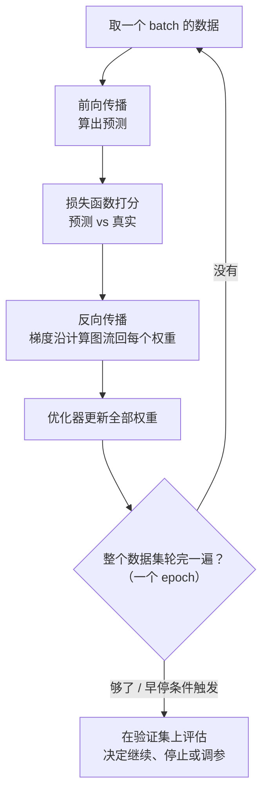
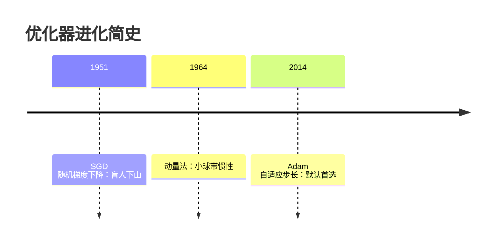

# 训练一个模型的完整流程

> **一句话理解**：训练就是一套循环——前向传播算出预测，损失函数给预测打分，反向传播把误差"追责"回每个权重，优化器据此微调权重；转一圈模型变好一点，转到收敛为止。

[⬆️ 返回总目录](../../../README.md) · [⬆️ 返回本篇](../README.md) · [⬅️ 返回本章目录](./README.md)

| 属性 | 说明 |
|------|------|
| 难度 | ⭐⭐⭐（较难） |
| 所属分支 | 通用基础 |
| 前置知识 | [神经网络是怎么炼成的](./01-神经网络是怎么炼成的.md)；[微积分与梯度](../../1-起步准备/02-数学基础/03-微积分与梯度.md) |

---

## 📌 这一节解决什么问题

上一页我们手算了一个网络：输入 (1.0, 2.0)，输出 0.655。假如正确答案是 0.95——**谁该负责？是 0.6 这个权重调错了，还是 -1.0 那个？该调大还是调小？调多少？**

网络里可能有几百万个权重，人手逐个排查是不可能的。训练流程要回答的就是这个工程问题：如何让机器**自动**知道每个权重该往哪边调、调多少，并且把这个过程变成可以日复一日执行的循环。

答案由三块积木拼成：损失函数（给"错多少"定标准）、反向传播（把误差分摊回每个权重）、优化器（决定按这个分摊结果怎么迈步）。本章后面所有内容——PyTorch、分布式、部署——都是围绕这个循环展开的。

## 🌱 通俗理解

把训练想成一条**流水线车间里的追责大会**：

- **损失函数（Loss Function）**是质检员：拿产品（预测值）和标准件（真实值）一比，打出一个"差多少"的分数；
- **反向传播（Backpropagation）**是追责流程：误差从成品端出发，**沿流水线逆向走一遍**，每到一层就问"这道工序贡献了多少误差？"，一路问到最初的每个权重头上；
- **优化器（Optimizer）**是整改方案：每个权重根据"自己背了多少责"，朝减小误差的方向挪一小步。

优化器怎么挪步？经典画面是**盲人下山**：山高是损失，位置是权重，看不见全景，只能用脚感受坡度（梯度），往下坡方向迈一步。学习率（Learning Rate）是步子大小——步子太大一步跨过谷底冲上对面的山，太小走到天黑还在半山腰。

数据怎么喂？像**写作业分批做**：一万道题一次做完太累，每次做一小叠（batch），做完一叠订正一次（更新一次权重）；全部题目轮完一遍叫一个轮次（Epoch）。

## 📋 举个例子

接着上一页的迷你网络：目标值 0.95，网络输出 0.655，**误差约 0.3**。看看这个误差怎么沿链式法则一路"分摊"回第一个权重 w11（x1→h1 那条线，当前值 0.6）。

追责链上共有 5 个"责任传递因子"，逐环相乘（数字取整到三位小数）：

| 环节 | 责任因子 | 数值 | 人话 |
|------|----------|------|------|
| ① 输出误差 | y − 目标 | 0.655 − 0.95 = **−0.295** | 成品差了多少 |
| ② 输出神经元灵敏度 | y×(1−y) | 0.655×0.345 ≈ **0.226** | 输出端 sigmoid 此时"听使唤"的程度 |
| ③ 权重 v1 的传递 | v1 | **1.5** | h1 对输出的影响力 |
| ④ h1 神经元灵敏度 | 0.818×(1−0.818) | ≈ **0.149** | h1 端 sigmoid 的"听话"程度 |
| ⑤ 输入 x1 | x1 | **1.0** | 这条线当时流过了多少信号 |

五环相乘：梯度 = (−0.295) × 0.226 × 1.5 × 0.149 × 1.0 ≈ **−0.0149**。

负号的意思是：**把 w11 调大一点点，损失会变小**。取学习率 0.5 迈一步：

w11(新) = 0.6 − 0.5 × (−0.0149) ≈ **0.607**

一轮追责就这样完成：网络里其余每个权重（0.4、−0.2、0.8、1.5、−1.0……）都会用同样的链式法则各自算出梯度、各自挪一步。重复几万次，网络就"炼"出来了。

<details>
<summary>📊 展开完整算例：每一步乘出来的过程</summary>

采用平方损失 $L = \frac{1}{2}(y - t)^2$（t 是目标值 0.95）：

1. $\frac{\partial L}{\partial y} = y - t = 0.655 - 0.95 = -0.295$（误差本身）
2. $\frac{\partial y}{\partial z_o} = y(1-y) = 0.655 \times 0.345 = 0.226$（sigmoid 的导数）
3. $\frac{\partial z_o}{\partial a_{h1}} = v_1 = 1.5$（输出层加权求和里 h1 的系数）
4. $\frac{\partial a_{h1}}{\partial z_{h1}} = a_{h1}(1-a_{h1}) = 0.818 \times 0.182 = 0.149$
5. $\frac{\partial z_{h1}}{\partial w_{11}} = x_1 = 1.0$

链式相乘：$-0.295 \times 0.226 = -0.0667$；$-0.0667 \times 1.5 = -0.100$；$-0.100 \times 0.149 = -0.0149$。

更新（学习率 η=0.5）：$w_{11} \leftarrow 0.6 - 0.5 \times (-0.0149) = 0.607$。

注意：这里只演示了一条链；真实网络中每个权重都有自己的一条链，所有链在一次反向传播中**同时**算完——这正是框架替你干的重活。

</details>

<details>
<summary>🧪 小实验：学习率变 10 倍，命运完全不同（实验描述）</summary>

拿一个 2 层小网络拟合同一份数据，只改学习率（其他一切不动），训练损失曲线通常呈现三种命运（经验参考，具体数值随任务变化）：

- **η = 0.001（太小）**：损失确实在降，但 100 个 epoch 才降一点——像下山迈小碎步，训练预算内到不了谷底；
- **η = 0.1（合适）**：损失前几个 epoch 快速下降，随后平滑收敛到低位——步子和坡度匹配；
- **η = 1.0（太大）**：损失剧烈上下跳动甚至变成 NaN——一步跨过谷底、撞上对面山坡，越震越远。

动手建议：把本页代码里的 `lr` 改成这三个值各跑一遍，亲眼看三种曲线。这是每个炼丹师的第一课：**调参从学习率开始**。

</details>

## 🧠 核心原理

### 整体流程



### 逐步拆解

**① 损失函数：先定义"错多少"。** 回归用均方误差（MSE），分类用交叉熵（Cross-Entropy）——这两个老朋友在[逻辑回归与分类](../../2-经典机器学习/03-机器学习/03-逻辑回归与分类.md)里见过：

$$
L_{\text{MSE}} = \frac{1}{N}\sum_{i=1}^{N}(y_i - \hat{y}_i)^2
$$

> 👉 **人话**：每个预测值和真实值差多少，平方后取平均——平方是为了让"差得远的错"罚得更狠，且不分正负。

$$
L_{\text{CE}} = -\sum_{i} t_i \log \hat{y}_i
$$

> 👉 **人话**：正确类别的预测概率越高罚得越少；概率趋近 0 时罚分趋近无穷——专治"把猫说成车还很自信"。

**② 反向传播：链式法则的工业化。** 追责链的数学身份就是[链式法则](../../1-起步准备/02-数学基础/03-微积分与梯度.md)：

$$
\frac{\partial L}{\partial w_{11}} = \frac{\partial L}{\partial y}\cdot\frac{\partial y}{\partial z_o}\cdot\frac{\partial z_o}{\partial a_{h1}}\cdot\frac{\partial a_{h1}}{\partial z_{h1}}\cdot\frac{\partial z_{h1}}{\partial w_{11}}
$$

> 👉 **人话**：误差对某个权重的责任 = 一整条流水线上每道工序"传导率"的连乘。框架做的事，是把这些连乘对几百万个权重**一次性、不重复地**算完（从输出端往回算，公共因子只算一次），这就是反向传播被称为"工业化"的原因。

**③ 优化器进化史。**



最朴素的随机梯度下降（SGD）：

$$
w \leftarrow w - \eta \nabla_w L
$$

> 👉 **人话**：沿梯度的反方向（下坡方向）迈一步，η 是步长。所有优化器的祖师爷。

加上动量（Momentum）：

$$
v \leftarrow \gamma v + \nabla_w L, \qquad w \leftarrow w - \eta v
$$

> 👉 **人话**：把"每步从零决定"改成"滚下坡的小球"——速度会累积，遇到小坑凭惯性直接冲过去，在沟壑纵横的损失面上快得多。

Adam 则给每个权重**自适应步长**：根据梯度近期的一阶矩（均值）和二阶矩（波动幅度）自动调每人步子，对学习率不那么敏感。经验参考：**新任务默认从 Adam 起步**；视觉大模型领域 SGD+动量依然常见，泛化有时更好。

| 优化器 | 一句话 | 什么时候用 |
|--------|--------|-----------|
| SGD | 盲人下山，每步看脚下 | 精调、追求泛化的视觉任务 |
| SGD + Momentum | 小球下山，惯性冲过小坑 | 同上，更快的版本 |
| Adam | 每个权重自适应步长 | **新任务默认首选** |

**④ Batch、Epoch、迭代。** 术语容易混，一张表说清（作业分批做）：

| 术语 | 含义 | 作业类比 |
|------|------|----------|
| Batch（批量） | 一次喂给网络的样本数（如 32 条） | 一小叠作业 |
| 迭代（Iteration） | 一次"前向+反向+更新" | 做完一叠订正一次 |
| Epoch（轮次） | 全部训练数据完整过一遍 | 全部作业轮完一轮 |

1000 条数据、batch=32，一个 epoch ≈ 32 次迭代。batch 太小训练抖、太大显存吃紧且泛化有时变差——经验参考从 32 起步。

**⑤ 过拟合对策全家桶。** 训练损失一路降、验证损失却回升，就是过拟合（Overfitting）——模型把训练集的噪声也背下来了。武器架上常备五件：

| 武器 | 一句话原理 |
|------|-----------|
| L2 正则化 | 给损失加"权重平方和"罚项，权重都被压小，模型更平滑 |
| Dropout（丢弃法） | 训练时随机让部分神经元"休息"，团队不过度依赖骨干 |
| 早停（Early Stopping） | 验证集一变差就停止训练，见好就收 |
| 数据增强（Data Augmentation） | 翻转、裁剪、加噪……人为造更多"新样本" |
| BatchNorm / LayerNorm | 归一化层间数值分布，训练又稳又快（前者按批、后者按样本） |

$$
L' = L + \lambda \sum_w w^2
$$

> 👉 **人话**：L2 正则化就是在总损失里加一条家规——"权重越大罚分越多"，逼着网络用小权重表达规律，别死记硬背个别样本。

## 💻 动手试试

```python
# 依赖：pip install torch
# 本模板是全书反复复用的"训练循环模板"：后续视觉、时序、NLP 各章
# 只是换了模型结构和数据，循环骨架完全不变。
import torch
import torch.nn as nn

# ---------- 第 0 步：造数据（y = 2x + 1 加噪声） ----------
torch.manual_seed(0)
X = torch.rand(1000, 1) * 10
y = 2 * X + 1 + torch.randn(1000, 1) * 0.5

# ---------- 第 1 步：定义模型 ----------
model = nn.Sequential(
    nn.Linear(1, 64), nn.ReLU(),
    nn.Linear(64, 1),
)

# ---------- 第 2 步：损失函数 + 优化器 ----------
loss_fn = nn.MSELoss()                                   # 回归用 MSE
optimizer = torch.optim.Adam(model.parameters(), lr=1e-3)  # 默认首选 Adam

# ---------- 第 3 步：训练循环 ----------
for epoch in range(20):
    for i in range(0, 1000, 32):        # batch_size = 32
        batch_X, batch_y = X[i:i+32], y[i:i+32]

        pred = model(batch_X)           # 前向传播：算预测
        loss = loss_fn(pred, batch_y)   # 损失函数：打分
        optimizer.zero_grad()           # 清空上一轮梯度（新手最常忘！）
        loss.backward()                 # 反向传播：算出所有梯度
        optimizer.step()                # 优化器：更新所有权重

    if (epoch + 1) % 10 == 0:
        print(f"epoch {epoch+1}, 本批 loss = {loss.item():.4f}")

# ---------- 第 4 步：评估 ----------
model.eval()                            # 切到评估模式
with torch.no_grad():                   # 只算前向，不需要梯度
    test_loss = loss_fn(model(X), y)
print("全量 MSE:", round(test_loss.item(), 4))
# 预期输出：loss 从 3+ 一路降到 0.2x（噪声方差约 0.25，模型已贴近上限）
```

五行注释——前向、打分、清梯度、反向、更新——就是整页内容的代码形态。

## 🔥 炼丹小灶

> 🔥 **炼丹小灶**：工业界常用起点配方与玄学——
> - 配方：Adam + lr=1e-3 起步；batch=32；先小规模跑通再放大；训练 10~50 个 epoch 看验证集曲线决定去留；
> - 玄学：loss 不降，先降学习率一个数量级试试、再检查数据和标签有没有错，最后才怀疑人生；"重启大法"（换随机种子重跑）真实有效；
> - ⚠️ 以上是经验参考值，不是圣旨；换数据集请重新炼。

## 🖱️ 动手玩

> 🎮 **本库实验场**：[梯度下降炼丹炉](../../../playground/gradient-descent.html)——拖动学习率与动量，亲眼看小球如何下山、跨过小坑；切到 Adam 对比 SGD，看自适应步长的收敛差别。
> 🕹️ **延伸玩一玩**：[TensorFlow Playground](https://playground.tensorflow.org)——把"训练/测试损失"曲线打开，调大网络看两条曲线分道扬镳（过拟合），再开 Dropout 看它们重新贴近。

## 🔗 在知识树中的位置

- **上游**：[神经网络是怎么炼成的](./01-神经网络是怎么炼成的.md)——前向传播提供"产品"；[微积分与梯度](../../1-起步准备/02-数学基础/03-微积分与梯度.md)——梯度和链式法则是本页的数学引擎。
- **下游**：[PyTorch快速上手](./03-PyTorch快速上手.md)——把本页循环工程化成四步模板；第四篇所有方向的训练（如 [微调与对齐](../../4-专业方向/07-自然语言处理与LLM/05-微调与对齐.md)）都跑在同一个循环上。
- **横向对比**：第 3 章的经典模型也"训练"，但参数少、梯度可直接解析或用简单迭代；神经网络参数百万级起，反向传播 + minibatch 优化是它独有的"吃饭家伙"。

## ⚠️ 常见误区

- **误区一**：训练 loss 一直降，说明模型越来越好 → 只看训练损失会被过拟合骗，**必须同时盯验证集**，训练/验证曲线分道扬镳就是警报。
- **误区二**：Adam 永远优于 SGD → 不一定；视觉大模型上 SGD+动量泛化常更好，Adam 赢在"开箱即用、对超参不敏感"。
- **误区三**：学习率从头到尾一个值 → 实战中常配学习率调度（预热 + 逐步衰减），训练初期大步走、后期小步修。

## 📝 小结与自测

**要点回顾**

- 训练循环五步：前向传播 → 损失打分 → 反向传播追责 → 优化器更新 → 换下一个 batch，轮完一个 epoch 评估一次；
- 反向传播 = 链式法则工业化：误差沿计算图逆向流回，每个权重拿到自己的梯度；
- 优化器进化：SGD（盲人下山）→ 动量（惯性小球）→ Adam（自适应步长，默认首选）；
- 学习率决定命运：太大震荡发散、太小慢如蜗牛；batch 是一小叠作业、epoch 是全部轮完一遍；
- 过拟合五件套：L2、Dropout、早停、数据增强、归一化层。

**自测一下**（点击展开答案）

<details>
<summary>问题 1：为什么每个 batch 训练前都要 optimizer.zero_grad()？</summary>

PyTorch 的梯度默认是**累加**的：每次 backward() 把新梯度加到 .grad 上，而不是覆盖。如果不清零，本轮梯度会混入前面所有轮的旧梯度，相当于朝着"过去几步的平均方向"更新，训练行为完全乱掉。这是新手第一大坑，记住口诀：清零 → 反向 → 更新。

</details>

<details>
<summary>问题 2：Dropout 为什么能防过拟合？训练和评估时行为一样吗？</summary>

训练时随机"关掉"一部分神经元，等于每一步都在训练一个不同的子网络，任何单个神经元都不能被过度依赖，类似团队轮岗，谁都不是不可或缺的骨干；评估时 Dropout 自动关闭（全网络上线，输出做相应缩放补偿），所以**训练和评估必须切换 model.train() / model.eval() 模式**，忘了切会得到忽好忽坏的结果。

</details>

## 📚 延伸阅读

- 论文：Rumelhart, Hinton & Williams, *Learning Representations by Back-Propagating Errors*（1986）——反向传播开山之作
- 论文：Kingma & Ba, *Adam: A Method for Stochastic Optimization*（2014）
- 论文：Srivastava et al., *Dropout: A Simple Way to Prevent Neural Networks from Overfitting*（2014）
- 讲义：CS231n（斯坦福）Optimization / Backpropagation 两节——本页内容的进阶版

---

[⬅️ 上一页：神经网络是怎么炼成的](./01-神经网络是怎么炼成的.md) · [返回本章目录](./README.md) · [下一页：PyTorch快速上手 ➡️](./03-PyTorch快速上手.md)
