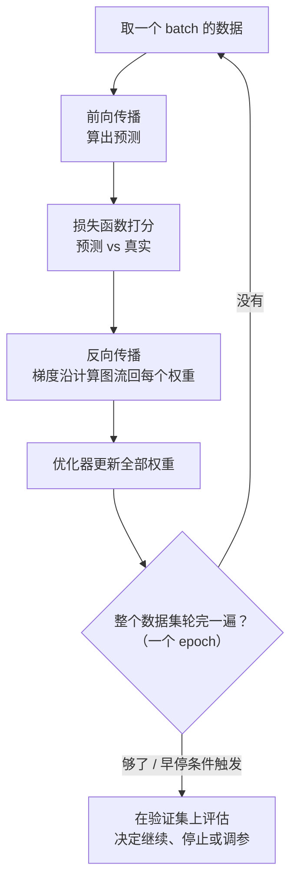
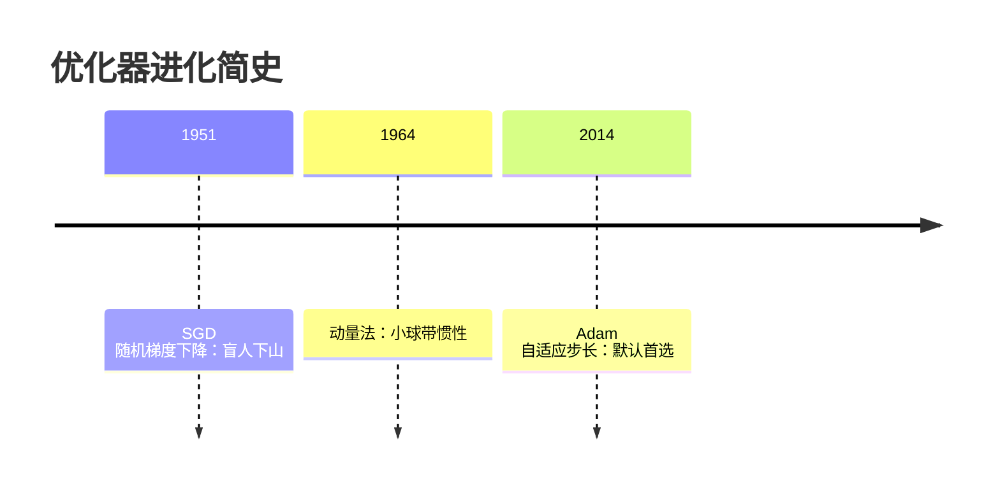
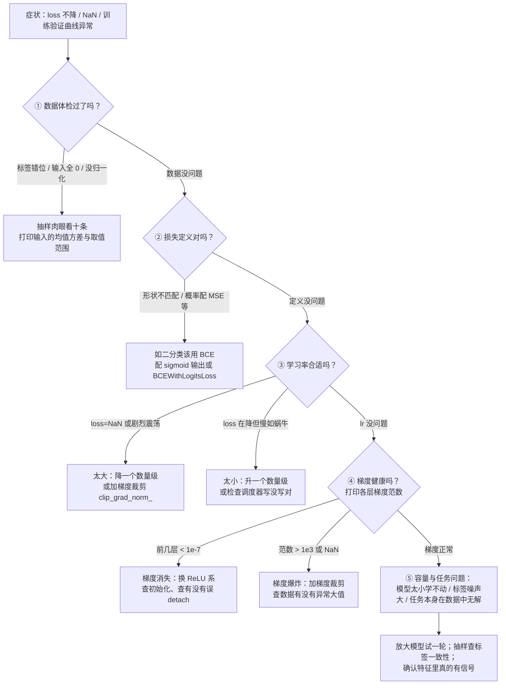

# 训练一个模型的完整流程

> **一句话理解**：训练就是一套循环——前向传播算出预测，损失函数给预测打分，反向传播把误差"追责"回每个权重，优化器据此微调权重；转一圈模型变好一点，转到收敛为止。

[⬆️ 返回总目录](../../../README.md) · [⬆️ 返回本篇](../README.md) · [⬅️ 返回本章目录](./README.md)

| 属性 | 说明 |
|------|------|
| 难度 | ⭐⭐⭐（较难） |
| 所属分支 | 通用基础 |
| 前置知识 | [神经网络是怎么炼成的](./01-神经网络是怎么炼成的.md)；[微积分与梯度](../../1-起步准备/02-数学基础/03-微积分与梯度.md) |

---

## 📌 这一节解决什么问题

上一页我们手算了一个网络：输入 (1.0, 2.0)，输出 0.655。假如正确答案是 0.95——**谁该负责？是 0.6 这个权重调错了，还是 -1.0 那个？该调大还是调小？调多少？**

网络里可能有几百万个权重，人手逐个排查是不可能的。训练流程要回答的就是这个工程问题：如何让机器**自动**知道每个权重该往哪边调、调多少，并且把这个过程变成可以日复一日执行的循环。

答案由三块积木拼成：损失函数（给"错多少"定标准）、反向传播（把误差分摊回每个权重）、优化器（决定按这个分摊结果怎么迈步）。本章后面所有内容——PyTorch、分布式、部署——都是围绕这个循环展开的。

本页还要多回答三个实战问题：训练出问题时**怎么诊断**（梯度范数怎么打印、阈值多少算病态）；**超参之间怎么联动**（batch 与学习率与泛化的三角关系）；以及那两个训练稳収神器 **BatchNorm 和 Dropout 在推理时分别藏着什么坑**。

## 🌱 通俗理解

把训练想成一条**流水线车间里的追责大会**：

- **损失函数（Loss Function）**是质检员：拿产品（预测值）和标准件（真实值）一比，打出一个"差多少"的分数；
- **反向传播（Backpropagation）**是追责流程：误差从成品端出发，**沿流水线逆向走一遍**，每到一层就问"这道工序贡献了多少误差？"，一路问到最初的每个权重头上；
- **优化器（Optimizer）**是整改方案：每个权重根据"自己背了多少责"，朝减小误差的方向挪一小步。

优化器怎么挪步？经典画面是**盲人下山**：山高是损失，位置是权重，看不见全景，只能用脚感受坡度（梯度），往下坡方向迈一步。学习率（Learning Rate）是步子大小——步子太大一步跨过谷底冲上对面的山，太小走到天黑还在半山腰。真实的地形还常是**狭长山沟**（两个方向坡度差很大）：直着走总是在两壁间来回撞——这就是动量、Adam 要解的痛点。

数据怎么喂？像**写作业分批做**：一万道题一次做完太累，每次做一小叠（batch），做完一叠订正一次（更新一次权重）；全部题目轮完一遍叫一个轮次（Epoch）。

## 📋 举个例子

接着上一页的迷你网络：目标值 0.95，网络输出 0.655，**误差约 0.3**。看看这个误差怎么沿链式法则一路"分摊"回第一个权重 w11（x1→h1 那条线，当前值 0.6）。

追责链上共有 5 个"责任传递因子"，逐环相乘（数字取整到三位小数）：

| 环节 | 责任因子 | 数值 | 人话 |
|------|----------|------|------|
| ① 输出误差 | y − 目标 | 0.655 − 0.95 = **−0.295** | 成品差了多少 |
| ② 输出神经元灵敏度 | y×(1−y) | 0.655×0.345 ≈ **0.226** | 输出端 sigmoid 此时"听使唤"的程度 |
| ③ 权重 v1 的传递 | v1 | **1.5** | h1 对输出的影响力 |
| ④ h1 神经元灵敏度 | 0.818×(1−0.818) | ≈ **0.149** | h1 端 sigmoid 的"听话"程度 |
| ⑤ 输入 x1 | x1 | **1.0** | 这条线当时流过了多少信号 |

五环相乘：梯度 = (−0.295) × 0.226 × 1.5 × 0.149 × 1.0 ≈ **−0.0149**。

负号的意思是：**把 w11 调大一点点，损失会变小**。取学习率 0.5 迈一步：

w11(新) = 0.6 − 0.5 × (−0.0149) ≈ **0.607**

一轮追责就这样完成：网络里其余每个权重（0.4、−0.2、0.8、1.5、−1.0……）都会用同样的链式法则各自算出梯度、各自挪一步。重复几万次，网络就"炼"出来了。网络里**全部 9 个参数的梯度**已在下方"完整推导"折叠框里算齐，可与代码互相验证。

<details>
<summary>📊 展开完整算例：每一步乘出来的过程</summary>

采用平方损失 $L = \frac{1}{2}(y - t)^2$（t 是目标值 0.95）：

1. $\frac{\partial L}{\partial y} = y - t = 0.655 - 0.95 = -0.295$（误差本身）
2. $\frac{\partial y}{\partial z_o} = y(1-y) = 0.655 \times 0.345 = 0.226$（sigmoid 的导数）
3. $\frac{\partial z_o}{\partial a_{h1}} = v_1 = 1.5$（输出层加权求和里 h1 的系数）
4. $\frac{\partial a_{h1}}{\partial z_{h1}} = a_{h1}(1-a_{h1}) = 0.818 \times 0.182 = 0.149$
5. $\frac{\partial z_{h1}}{\partial w_{11}} = x_1 = 1.0$

链式相乘：$-0.295 \times 0.226 = -0.0667$；$-0.0667 \times 1.5 = -0.100$；$-0.100 \times 0.149 = -0.0149$。

更新（学习率 η=0.5）：$w_{11} \leftarrow 0.6 - 0.5 \times (-0.0149) = 0.607$。

注意：这里只演示了一条链；真实网络中每个权重都有自己的一条链，所有链在一次反向传播中**同时**算完——这正是框架替你干的重活。

</details>

<details>
<summary>🧪 小实验：学习率变 10 倍，命运完全不同（实验描述）</summary>

拿一个 2 层小网络拟合同一份数据，只改学习率（其他一切不动），训练损失曲线通常呈现三种命运（经验参考，具体数值随任务变化）：

- **η = 0.001（太小）**：损失确实在降，但 100 个 epoch 才降一点——像下山迈小碎步，训练预算内到不了谷底；
- **η = 0.1（合适）**：损失前几个 epoch 快速下降，随后平滑收敛到低位——步子和坡度匹配；
- **η = 1.0（太大）**：损失剧烈上下跳动甚至变成 NaN——一步跨过谷底、撞上对面山坡，越震越远。

动手建议：把本页代码里的 `lr` 改成这三个值各跑一遍，亲眼看三种曲线。这是每个炼丹师的第一课：**调参从学习率开始**。

</details>

## 🧠 核心原理

### 整体流程



### 逐步拆解

**① 损失函数：先定义"错多少"。** 回归用均方误差（MSE），分类用交叉熵（Cross-Entropy）——这两个老朋友在[逻辑回归与分类](../../2-经典机器学习/03-机器学习/03-逻辑回归与分类.md)里见过：

$$
L_{\text{MSE}} = \frac{1}{N}\sum_{i=1}^{N}(y_i - \hat{y}_i)^2
$$

> 👉 **人话**：每个预测值和真实值差多少，平方后取平均——平方是为了让"差得远的错"罚得更狠，且不分正负。

$$
L_{\text{CE}} = -\sum_{i} t_i \log \hat{y}_i
$$

> 👉 **人话**：正确类别的预测概率越高罚得越少；概率趋近 0 时罚分趋近无穷——专治"把猫说成车还很自信"。

**② 反向传播：链式法则的工业化。** 追责链的数学身份就是[链式法则](../../1-起步准备/02-数学基础/03-微积分与梯度.md)：

$$
\frac{\partial L}{\partial w_{11}} = \frac{\partial L}{\partial y}\cdot\frac{\partial y}{\partial z_o}\cdot\frac{\partial z_o}{\partial a_{h1}}\cdot\frac{\partial a_{h1}}{\partial z_{h1}}\cdot\frac{\partial z_{h1}}{\partial w_{11}}
$$

> 👉 **人话**：误差对某个权重的责任 = 一整条流水线上每道工序"传导率"的连乘。框架做的事，是把这些连乘对几百万个权重**一次性、不重复地**算完（从输出端往回算，公共因子只算一次），这就是反向传播被称为"工业化"的原因。

上一页手算了"一条链"，真实训练需要**全部参数同时拿到梯度**。两层网络的完整版推导如下——先符号后数字，看完你就能读懂任何深度网络的梯度公式。

<details>
<summary>🧮 展开看：两层网络全部梯度的完整推导（符号版）</summary>

记号：输入 $x$，隐藏层 $z_1 = W_1 x + b_1,\ a_1 = \sigma(z_1)$，输出层 $z_2 = W_2 a_1 + b_2,\ \hat{y} = \sigma(z_2)$，损失 $L = \frac{1}{2}(\hat{y}-t)^2$。核心技巧是定义**误差信号**（error signal）$\delta \triangleq \frac{\partial L}{\partial z}$，让每层只算自己的 δ，公共量被复用——这正是反向传播"高效"的全部秘密。

**第一步：输出层误差信号。**

$$\delta_2 = \frac{\partial L}{\partial z_2} = (\hat{y}-t)\cdot\hat{y}(1-\hat{y})$$

（损失对预测求导 × sigmoid 导数，链上只有两环。）

**第二步：输出层参数梯度。** $z_2 = W_2 a_1 + b_2$ 对自家参数求导，只需要 δ₂ 和前向存的激活值：

$$\frac{\partial L}{\partial W_2} = \delta_2\, a_1^{\mathsf{T}}, \qquad \frac{\partial L}{\partial b_2} = \delta_2$$

**第三步：把误差信号搬回隐藏层。** 这是全篇最关键的一行——$z_{h}$ 的责任经 $W_2$ 这条"运输线"回流：

$$\delta_1 = \frac{\partial L}{\partial z_1} = \underbrace{(W_2^{\mathsf{T}} \delta_2)}_{\text{误差被权重搬回}} \odot \underbrace{\sigma'(z_1)}_{\text{本层激活的传导率}}$$

（$\odot$ 为逐元素乘。）

**第四步：隐藏层参数梯度。** 与第二步同构：

$$\frac{\partial L}{\partial W_1} = \delta_1\, x^{\mathsf{T}}, \qquad \frac{\partial L}{\partial b_1} = \delta_1$$

**两个值得记住的观察：**

1. **递归结构**：$\delta_{l} = (W_{l+1}^{\mathsf{T}} \delta_{l+1}) \odot \sigma'(z_l)$——任何深度的网络都是这一个公式反复套用，前向存激活、反向递推 δ，每层参数梯度都是"δ × 该层输入"的外积。
2. **梯度消失的解剖**：δ 逐层回传时每过一层就乘一次 $\sigma'(z_l)$ 与 $W$。sigmoid 的 $\sigma' \le 0.25$，二十层网络理论上就把梯度压到 $0.25^{20} \approx 10^{-12}$——上一页"sigmoid 堆深 = 失聪"在公式层面就是这句连乘。梯度爆炸则是同一连乘在 $|W|$ 偏大时的反向剧本。

</details>

<details>
<summary>📊 展开看：同一推导的数字版（全部 9 个参数的梯度）</summary>

沿用上一页网络：$x=(1.0, 2.0)$，$W_1=\begin{pmatrix}0.6 & 0.4\\ -0.2 & 0.8\end{pmatrix}$，$b_1=(0.1,-0.1)$，$W_2=(1.5,-1.0)$，$b_2=0.2$；前向得 $a_1=(0.818, 0.786)$，$\hat{y}=0.655$，目标 $t=0.95$。

1. **输出层误差信号**：$\delta_2 = (0.655-0.95)\times 0.655\times 0.345 = -0.295 \times 0.226 = \mathbf{-0.0667}$
2. **输出层梯度**：
   - $\partial L/\partial v_1 = -0.0667 \times 0.818 = \mathbf{-0.0545}$
   - $\partial L/\partial v_2 = -0.0667 \times 0.786 = \mathbf{-0.0524}$
   - $\partial L/\partial b_2 = \mathbf{-0.0667}$
3. **误差搬回隐藏层**：$W_2^{\mathsf{T}}\delta_2 = (1.5\times(-0.0667),\ -1.0\times(-0.0667)) = (-0.100,\ +0.0667)$
   - $\delta_{h1} = -0.100 \times 0.149 = \mathbf{-0.0149}$
   - $\delta_{h2} = +0.0667 \times 0.168 = \mathbf{+0.0112}$（$0.786\times0.214=0.168$）
4. **隐藏层梯度**（δ × 输入）：

| 参数 | 梯度 | 数值 |
|------|------|------|
| w11 | δ_h1 × x1 | **−0.0149**（与"五环手算"完全一致 ✓） |
| w12 | δ_h1 × x2 | **−0.0298**（x2=2，责任翻倍） |
| w21 | δ_h2 × x1 | **+0.0112** |
| w22 | δ_h2 × x2 | **+0.0225** |
| b1, b2 | δ_h1, δ_h2 | **−0.0149 / +0.0112** |
| v1, v2 | δ₂ × a1 | **−0.0545 / −0.0524** |

注意两个现象：① w12 的梯度是 w11 的 2 倍——梯度正比于"这条线上流过的信号量"；② h2 通道的梯度是**正**的——误差经 v2=−1.0 回传时变号。符号与大小都有物理含义，不是随机数。

</details>

**③ 优化器进化史。**



最朴素的随机梯度下降（SGD）：

$$
w \leftarrow w - \eta \nabla_w L
$$

> 👉 **人话**：沿梯度的反方向（下坡方向）迈一步，η 是步长。所有优化器的祖师爷。

加上动量（Momentum）：

$$
v \leftarrow \gamma v + \nabla_w L, \qquad w \leftarrow w - \eta v
$$

> 👉 **人话**：把"每步从零决定"改成"滚下坡的小球"——速度会累积，遇到小坑凭惯性直接冲过去，在沟壑纵横的损失面上快得多。它解决的正是 SGD 的痛点：狭长山沟里来回撞壁。

Adam 则给每个权重**自适应步长**：根据梯度近期的一阶矩（均值）和二阶矩（波动幅度）自动调每人步子——梯度一直很抖的参数自动小步、方向稳定的参数自动大步，对学习率不那么敏感。经验参考：**新任务默认从 Adam 起步**；视觉大模型领域 SGD+动量依然常见，泛化有时更好。

| 优化器 | 一句话 | 什么时候用 |
|--------|--------|-----------|
| SGD | 盲人下山，每步看脚下 | 精调、追求泛化的视觉任务 |
| SGD + Momentum | 小球下山，惯性冲过小坑 | 同上，更快的版本 |
| Adam | 每个权重自适应步长 | **新任务默认首选** |

**④ Batch、Epoch、迭代。** 术语容易混，一张表说清（作业分批做）：

| 术语 | 含义 | 作业类比 |
|------|------|----------|
| Batch（批量） | 一次喂给网络的样本数（如 32 条） | 一小叠作业 |
| 迭代（Iteration） | 一次"前向+反向+更新" | 做完一叠订正一次 |
| Epoch（轮次） | 全部训练数据完整过一遍 | 全部作业轮完一轮 |

1000 条数据、batch=32，一个 epoch ≈ 32 次迭代。batch 太小训练抖、太大显存吃紧且泛化有时变差——经验参考从 32 起步。

**批大小还悄悄影响泛化，不只是显存。** 一句话级的机理：大 batch 每步梯度太"准"，容易收敛进**尖锐极小值**（sharp minima）——谷底又窄又深，测试分布稍有偏移就掉出去；小 batch 的梯度噪声像免费的正则，把模型推进**平坦极小值**（flat minima），谷底宽、踩偏一点也不亏，泛化常更好（Keskar et al., 2016）。推论：加大 batch 想不丢精度，常要配学习率线性放大（有效 batch ×k，lr ×k，经验参考 Goyal et al., 2017）——第 4 页分布式训练会再遇到这条规则。

**⑤ 学习率调度：训练前中后期用不同的步子。** 固定学习率是"一双鞋跑全程"——前段嫌小、后段嫌大。四种常用策略对比：

| 策略 | 曲线形状 | PyTorch API | 适合场景 | 主要坑 |
|------|----------|-------------|----------|--------|
| 阶梯衰减（Step） | 每 N 个 epoch lr×0.1，台阶状 | `StepLR` / `MultiStepLR` | 经典视觉配方（ResNet 系） | 断点时机拍脑袋，早断晚断都亏 |
| 余弦退火（Cosine） | 从峰值平滑滑向 0 | `CosineAnnealingLR` | 不想多调参的稳妥默认 | 总周期 T 要设成真实总步数，否则没退完就停 |
| 暖身+衰减（Warmup） | 前 ~0.5%~5% 步从 0 升到峰值，再按余弦/线性衰减 | `LinearLR` 配 `SequentialLR`（或 transformers 的 `get_scheduler`） | Transformer 与大 batch 训练标配 | 暖身太短，训练初期就发散 |
| 自适应看板（Plateau） | 验证指标连续几轮不降就 lr×0.1 | `ReduceLROnPlateau` | 小数据微调的懒人方案 | 与早停共用验证信号，要小心两者打架 |

> 👉 **人话**：暖身解决"开局冷启动"——初始权重是随机的，前期梯度又大又乱，大步子容易直接走飞，先用小步探路再加速；衰减解决"收尾精修"——谷底附近步子大了会永远在两岸横跳，永远落不了底。

**⑥ 过拟合对策全家桶。** 训练损失一路降、验证损失却回升，就是过拟合（Overfitting）——模型把训练集的噪声也背下来了。武器架上常备五件：

| 武器 | 一句话原理 |
|------|-----------|
| L2 正则化 | 给损失加"权重平方和"罚项，权重都被压小，模型更平滑 |
| Dropout（丢弃法） | 训练时随机让部分神经元"休息"，团队不过度依赖骨干 |
| 早停（Early Stopping） | 验证集一变差就停止训练，见好就收 |
| 数据增强（Data Augmentation） | 翻转、裁剪、加噪……人为造更多"新样本" |
| BatchNorm / LayerNorm | 归一化层间数值分布，训练又稳又快（前者按批、后者按样本） |

$$
L' = L + \lambda \sum_w w^2
$$

> 👉 **人话**：L2 正则化就是在总损失里加一条家规——"权重越大罚分越多"，逼着网络用小权重表达规律，别死记硬背个别样本。

**⑦ BatchNorm 为什么 work：两个假说与一个推理期的坑。** 机制先说清（按特征通道操作）：

$$
\hat{x} = \frac{x - \mu_B}{\sqrt{\sigma_B^2 + \varepsilon}}, \qquad y = \gamma \hat{x} + \beta
$$

> 👉 **人话**：每个 mini-batch 里，把每个特征通道的数值拉回"均值 0、方差 1"的标准身材，再用可学习的 γ、β 重新定制高矮胖瘦——标准化是底板，γ/β 是自由度，网络想退化回原样也做得到。

它为什么能加速训练？教科书答案和 2018 年后的修正都值得知道：

- **原版假说（2015）**：训练中每层权重都在变，导致下一层输入的分布跟着漂（内部协变量偏移，Internal Covariate Shift），下游层被迫不停"追着移动靶打"。BN 把每层输入钉在稳定分布上，所以敢用更大学习率。
- **争议与修正（Santurkar et al., 2018）**：实验发现加了 BN 的网络里 ICS 并没有显著下降；BN 的真实贡献更可能是**让损失面更平滑**，梯度更可预测，所以优化器走得更稳。解释仍在演化，但"它 work"是稳定的经验事实。

**推理期的坑（生产事故高发区）**：训练时用当前 batch 的 μ_B、σ_B，同时维护一套**滑动平均**（running mean/var）；推理时**不再算 batch 统计**，改用这套冻结的 running stats。三个坑：

1. **batch 极小（1~2 条）**：batch 统计噪声巨大，running stats 被带偏 → 训练/验证指标差距莫名拉大。补救：加大 batch，或换 LayerNorm/GroupNorm；
2. **微调时忘了 `model.eval()`**：BN 在训练模式下会继续用新数据改写 running stats——你在悄悄弄脏一个"已上线规格"的模型。补救：微调时对 BN 层显式 `layer.eval()`（冻结统计量）是常见做法；
3. **训练与推理的 batch 分布不同**（如训练 shuffle、推理按类别排序）：统计量口径不一致，指标小幅漂移。

**⑧ Dropout 的推理缩放：训练除、推理不动。** PyTorch 采用"反向缩放"（inverted dropout）方案：

$$
\text{训练：}\ a' = \frac{m \odot a}{1-p}\ (m \text{ 为以 } 1-p \text{ 概率为 1 的掩码})， \qquad \text{推理：原样前向，不缩放}
$$

> 👉 **人话**：训练时随机丢弃 p 比例神经元、把幸存者的输出放大 1/(1−p) 倍——"人少了，剩下的人嗓门放大"，这样每一层的**期望输出**和不开 Dropout 时一样；于是推理时什么都不用做，直接全网上线。早期框架是反过来（训练不缩放、推理乘 1−p），两种方案二选一都行，混用必掉点——所以模型迁移时 Dropout 版本行为要对齐。

**⑨ 损失不降的排查决策树。** 训练出问题时，新手最爱瞎调超参，老手按固定顺序排查——从最常见、最便宜的原因查起：



五步的记忆口诀：**数据 → 损失 → 学习率 → 梯度 → 容量**——先查免费的，再查要花钱的。

## 💻 动手试试

```python
# 依赖：pip install torch
# 本模板是全书反复复用的"训练循环模板"：后续视觉、时序、NLP 各章
# 只是换了模型结构和数据，循环骨架完全不变。
import torch
import torch.nn as nn

# ---------- 第 0 步：造数据（y = 2x + 1 加噪声） ----------
torch.manual_seed(0)
X = torch.rand(1000, 1) * 10
y = 2 * X + 1 + torch.randn(1000, 1) * 0.5

# ---------- 第 1 步：定义模型 ----------
model = nn.Sequential(
    nn.Linear(1, 64), nn.ReLU(),
    nn.Linear(64, 1),
)

# ---------- 第 2 步：损失函数 + 优化器 ----------
loss_fn = nn.MSELoss()                                   # 回归用 MSE
optimizer = torch.optim.Adam(model.parameters(), lr=1e-3)  # 默认首选 Adam

# ---------- 第 3 步：训练循环 ----------
for epoch in range(20):
    for i in range(0, 1000, 32):        # batch_size = 32
        batch_X, batch_y = X[i:i+32], y[i:i+32]

        pred = model(batch_X)           # 前向传播：算预测
        loss = loss_fn(pred, batch_y)   # 损失函数：打分
        optimizer.zero_grad()           # 清空上一轮梯度（新手最常忘！）
        loss.backward()                 # 反向传播：算出所有梯度
        optimizer.step()                # 优化器：更新所有权重

    if (epoch + 1) % 10 == 0:
        print(f"epoch {epoch+1}, 本批 loss = {loss.item():.4f}")

# ---------- 第 4 步：评估 ----------
model.eval()                            # 切到评估模式
with torch.no_grad():                   # 只算前向，不需要梯度
    test_loss = loss_fn(model(X), y)
print("全量 MSE:", round(test_loss.item(), 4))
# 预期输出：loss 从 3+ 一路降到 0.2x（噪声方差约 0.25，模型已贴近上限）
```

五行注释——前向、打分、清梯度、反向、更新——就是整页内容的代码形态。再补一段**梯度体检**代码，对应⑨排查树的第 ④ 步：

```python
# ---------- 第 5 步：梯度体检（loss 不降时先跑它，再怀疑人生） ----------
model.train()                           # 体检要在训练模式下做
pred = model(X[:32])
loss = loss_fn(pred, y[:32])
optimizer.zero_grad()
loss.backward()                         # 只 backward，不 step：梯度留在 .grad 里

total_sq = 0.0
for name, p in model.named_parameters():
    if p.grad is not None:
        g = p.grad.norm().item()        # 该层梯度的 L2 范数
        total_sq += g * g
        print(f"{name:15s} 梯度范数 = {g:.3e}")
print("全模型梯度范数 =", f"{total_sq ** 0.5:.3e}")
# 健康量级（经验参考）：多数层在 1e-4 ~ 1e1 区间；
# 前（靠近输入的）层持续 < 1e-7 → 梯度消失；任何层 > 1e3 或出现 NaN → 梯度爆炸
```

**改什么参数、看什么变化**：① 把 `lr` 改成 1.0 重训 3 个 epoch，再跑梯度体检——范数常放大几个数量级（爆炸前兆），loss 变 NaN；② 把第一层激活从 `nn.ReLU()` 换成 5 层 `nn.Sigmoid()` 堆叠，看前层梯度范数逐层缩水（消失现场）；③ 把 batch 从 32 改成 512，观察同样 epoch 数下验证 loss 的差别——大 batch 收敛路径明显不同。

## 🔥 炼丹小灶

> 🔥 **炼丹小灶**：工业界常用起点配方与玄学——
> - 配方：Adam + lr=1e-3 起步、配 warmup+余弦调度（Transformer 类任务）；batch=32 起步；先小规模跑通再放大；训练 10~50 个 epoch 看验证集曲线决定去留；
> - 玄学：loss 不降，按"数据 → 损失 → lr → 梯度 → 容量"五步排查，先跑梯度体检再怀疑人生；"重启大法"（换随机种子重跑）真实有效；微调含 BN 的模型时冻结 BN 统计量，常有惊喜；
> - ⚠️ 以上是经验参考值，不是圣旨；换数据集请重新炼。

## 🖱️ 动手玩

> 🎮 **本库实验场**：[梯度下降炼丹炉](../../../playground/gradient-descent.html)（本地运行：克隆仓库后双击 `playground/gradient-descent.html`）——拖动学习率与动量，亲眼看小球如何下山、跨过小坑；切到 Adam 对比 SGD，看自适应步长的收敛差别。
> 🕹️ **延伸玩一玩**：[TensorFlow Playground](https://playground.tensorflow.org)——把"训练/测试损失"曲线打开，调大网络看两条曲线分道扬镳（过拟合），再开 Dropout 看它们重新贴近。

## 🔗 在知识树中的位置

- **上游**：[神经网络是怎么炼成的](./01-神经网络是怎么炼成的.md)——前向传播提供"产品"；[微积分与梯度](../../1-起步准备/02-数学基础/03-微积分与梯度.md)——梯度和链式法则是本页的数学引擎。
- **下游**：[PyTorch快速上手](./03-PyTorch快速上手.md)——把本页循环工程化成四步模板；第四篇所有方向的训练（如 [微调与对齐](../../4-专业方向/07-自然语言处理与LLM/05-微调与对齐.md)）都跑在同一个循环上。
- **横向对比**：第 3 章的经典模型也"训练"，但参数少、梯度可直接解析或用简单迭代；神经网络参数百万级起，反向传播 + minibatch 优化是它独有的"吃饭家伙"。

## ⚠️ 常见误区

- **误区一**：训练 loss 一直降，说明模型越来越好 → 只看训练损失会被过拟合骗，**必须同时盯验证集**，训练/验证曲线分道扬镳就是警报。
- **误区二**：Adam 永远优于 SGD → 不一定；视觉大模型上 SGD+动量泛化常更好，Adam 赢在"开箱即用、对超参不敏感"。
- **误区三**：学习率从头到尾一个值 → 实战中常配学习率调度（预热 + 逐步衰减），训练初期大步走、后期小步修。
- **误区四**：batch 大小只影响显存 → 它还牵动泛化（大 batch 偏向尖锐极小值）与该配的学习率（线性放大规则），三个量要一起调。
- **误区五**：BatchNorm 就是"把数据标准化一下" → 它训练用 batch 统计、推理用冻结的滑动平均，两套口径；batch 太小或微调忘切 eval 都会翻车。

## 📝 小结与自测

**要点回顾**

- 训练循环五步：前向传播 → 损失打分 → 反向传播追责 → 优化器更新 → 换下一个 batch，轮完一个 epoch 评估一次；
- 反向传播 = 链式法则工业化：定义误差信号 δ 逐层递推（$\delta_l = (W_{l+1}^{\mathsf{T}}\delta_{l+1})\odot\sigma'(z_l)$），每层参数梯度 = δ × 该层输入；梯度消失/爆炸都是这条递推里连乘的副产品；
- 优化器进化：SGD（盲人下山）→ 动量（惯性小球，解狭长山沟痛点）→ Adam（自适应步长，默认首选）；
- 学习率调度四策略：阶梯 / 余弦 / 暖身+衰减 / 自适应看板；学习率决定命运：太大震荡发散、太小慢如蜗牛；
- batch 影响泛化：大 batch 易落尖锐极小值，小 batch 噪声是免费正则；加大 batch 常配 lr 线性放大；
- BatchNorm 训练用 batch 统计、推理用 running stats；Dropout 训练丢弃并放大补偿（inverted），推理原样前向；
- 损失不降五步排查：数据 → 损失定义 → 学习率 → 梯度范数 → 容量。

**自测一下**（点击展开答案）

<details>
<summary>问题 1：为什么每个 batch 训练前都要 optimizer.zero_grad()？</summary>

PyTorch 的梯度默认是**累加**的：每次 backward() 把新梯度加到 .grad 上，而不是覆盖。如果不清零，本轮梯度会混入前面所有轮的旧梯度，相当于朝着"过去几步的平均方向"更新，训练行为完全乱掉。这是新手第一大坑，记住口诀：清零 → 反向 → 更新。

</details>

<details>
<summary>问题 2：Dropout 为什么能防过拟合？训练和评估时行为一样吗？</summary>

训练时随机"关掉"一部分神经元，等于每一步都在训练一个不同的子网络，任何单个神经元都不能被过度依赖，类似团队轮岗，谁都不是不可或缺的骨干；评估时 Dropout 自动关闭（全网络上线，输出做相应缩放补偿），所以**训练和评估必须切换 model.train() / model.eval() 模式**，忘了切会得到忽好忽坏的结果。

</details>

<details>
<summary>问题 3：BatchNorm 在训练和推理时分别用什么统计量？这埋着什么坑？</summary>

训练时用**当前 mini-batch** 的均值方差做标准化，同时把统计量以滑动平均累积成 running mean/var；推理时**完全不用 batch 统计**，直接用冻结的 running stats。坑有三：batch 极小（1~2）时统计噪声大、训练/验证指标莫名拉大；微调时忘了 eval 让 BN 继续污染 running stats；训练与推理 batch 组成方式不同导致口径漂移。含 BN 的模型迁移时，"冻结 BN"是 checklist 常客。

</details>

<details>
<summary>问题 4：怎么用一行代码判断"梯度消失"正在发生？</summary>

在 backward 之后打印每层梯度的 L2 范数（`p.grad.norm()`），看**靠近输入的层**是否持续低于 1e-7 量级（经验阈值）。若深层（近输出）正常、浅层（近输入）趋零，就是教科书式的梯度消失——根源是激活函数导数与权重在 δ 递推中连乘。补救：换 ReLU/GELU、He 初始化、检查是否误把某层 detach 或冻结了。

</details>

## 📚 延伸阅读

- 论文：Rumelhart, Hinton & Williams, *Learning Representations by Back-Propagating Errors*（1986）——反向传播开山之作
- 论文：Kingma & Ba, *Adam: A Method for Stochastic Optimization*（2014）
- 论文：Ioffe & Szegedy, *Batch Normalization*（2015）；Santurkar et al., *How Does Batch Normalization Help Optimization?*（2018）——假说与修正，一对儿读
- 论文：Keskar et al., *On Large-Batch Training for Deep Learning: Generalization Gap and Sharp Minima*（2016）；Goyal et al., *Accurate, Large Minibatch SGD*（2017）
- 论文：Srivastava et al., *Dropout: A Simple Way to Prevent Neural Networks from Overfitting*（2014）
- 讲义：CS231n（斯坦福）Optimization / Backpropagation 两节——本页内容的进阶版

---

[⬅️ 上一页：神经网络是怎么炼成的](./01-神经网络是怎么炼成的.md) · [返回本章目录](./README.md) · [下一页：PyTorch快速上手 ➡️](./03-PyTorch快速上手.md)
