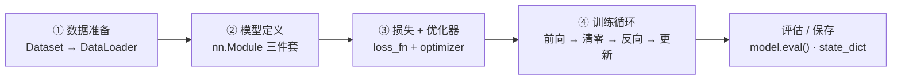

# PyTorch 快速上手

> **一句话理解**：PyTorch ≈ 一个自带"求导记账本"的 numpy，外加一箱搭网络的积木（nn.Module）和一条喂数据的传送带（DataLoader）——把上一页的训练循环从手算变成几十行可复用代码。

[⬆️ 返回总目录](../../../README.md) · [⬆️ 返回本篇](../README.md) · [⬅️ 返回本章目录](./README.md)

| 属性 | 说明 |
|------|------|
| 难度 | ⭐⭐（进阶） |
| 所属分支 | 通用基础 |
| 前置知识 | [训练一个模型的完整流程](./02-训练一个模型的完整流程.md)；[开发环境搭建](../../1-起步准备/01-环境与工具/01-开发环境搭建.md) |

---

## 📌 这一节解决什么问题

上一页我们用 numpy 手写了前向传播，误差追责只算了"一条链"。真实的网络有百万级权重、每天几万次迭代——手写反向传播既写不动也算不快。工业界需要的是：梯度自动算、数据自动喂、GPU 自动用、模型自动存取。

这就是深度学习框架（Framework）的定位。2016 年后 PyTorch 凭"像写 Python 一样写模型"的风格逐渐成为科研与工业界的主流选择（老对手 TensorFlow 依然在部署侧广泛应用）。本页解决三个问题：Tensor 和自动求导怎么用、模型怎么搭、上一页的训练循环怎么抽象成可复用模板。

## 🌱 通俗理解

PyTorch 的四大件，各有一个生活原型：

- **Tensor（张量）**：长得很像 numpy 数组，但**自带一本"记账本"**——你对它做的每一步运算都被记下来，回头就能自动算出"任何输入对最终结果的影响"（梯度）。相当于带行车记录仪的车：开到哪都记录在案。
- **autograd（自动微分）**：就是那本记账本的自动结算功能。喊一声 `backward()`，账本从结果倒着翻一遍，每个变量的"责任额"（梯度）自动算好放在 `.grad` 里。
- **nn.Module（模型积木）**：声明零件（层）+ 写清怎么算（forward），框架自动把所有参数登记造册，交给优化器统一管理。
- **Dataset / DataLoader（数据传送带）**：你只要定义"一条数据长什么样、一共有多少条"，传送带自动把数据按 batch 分摞、打乱顺序、送到模型嘴边。

至于 GPU，一句话就够：`.to("cuda")` 把模型和数据搬上显卡（如消费级显卡 RTX 4090 或专业卡 A100/H100），训练提速通常是数量级的。

## 📋 举个例子

autograd 最小演示——一个 2×2 张量从"开账本"到"看梯度"的完整小过程：

```python
import torch

x = torch.tensor([[1.0, 2.0],
                  [3.0, 4.0]], requires_grad=True)  # ① 开账本：开始记账
y = (x ** 2).sum()        # ② 记了三笔账：平方、求和 → y = 1+4+9+16 = 30
y.backward()              # ③ 结算：从 y 倒着翻账本
print(x.grad)             # ④ 查看每个数的"责任额"
# 输出:
# tensor([[2., 4.],
#         [6., 8.]])
```

这个输出可以用手算验证。整个流程用公式说清：

$$
y = \sum x^2, \qquad \frac{\partial y}{\partial x} = 2x
$$

> 👉 **人话**：对每个元素平方再求和后，"每个元素对结果的责任"就是它的 2 倍——所以 1、2、3、4 的梯度正好是 2、4、6、8。上一页手算了五环链式法则才追责到一个权重；这里一句 `backward()`，账本自动把所有链路全部算完。

<details>
<summary>📊 展开看：backward() 时账本里发生了什么</summary>

PyTorch 在你做前向运算时，悄悄构建了一张**计算图（Computational Graph）**：`x → 平方 → 中间结果 → 求和 → y`。`backward()` 从 y 出发沿图**逆向遍历**：

1. y 对"求和"节点的梯度：每个位置的贡献都是 1；
2. "求和"对"平方"节点的梯度：还是 1（求和是线性的）；
3. "平方"对 x 的梯度：$2x$，逐元素就是 [2, 4, 6, 8]。

每一步都是一次链式法则，方向永远是"从结果往回走"——这正是上一页"误差沿流水线反向追责"的自动化版本。想看图长什么样，可以 `print(torch.autograd.grad(y, x))` 或查阅 `torchviz` 可视化库。

</details>

## 🧠 核心原理（本页是工具页，核心是四件套怎么配合）

### 整体流程：上一页循环的四步复用模板



### 逐步拆解

**① Tensor：会记账的 numpy。** 创建、运算、索引都和 numpy 几乎一致，多出来的关键参数就是 `requires_grad=True`（开账本）。与 numpy 互相转换零成本：`x.numpy()` / `torch.from_numpy(a)`。

**② nn.Module 三件套。** 写任何模型都是这三步：

| 步骤 | 写什么 | 作用 |
|------|--------|------|
| ① `__init__` | 声明零件 | 登记有哪些层（Linear、ReLU……），参数自动造册 |
| ② `forward` | 写清怎么算 | 数据进来按什么顺序过哪些零件 |
| ③ `optimizer` | 交接参数 | `optim.XXX(model.parameters())`，优化器接管全部权重 |

**③ Dataset / DataLoader：传送带喂 batch。** Dataset 只需回答两个问题——"一共多少条"（`__len__`）和"第 i 条是什么"（`__getitem__`）；DataLoader 负责打乱、分摞（batch）、（多进程）搬运。上一页手动 `X[i:i+32]` 切 batch 的活，传送带全包了。

**④ 设备与评估。** GPU 一句话：`model.to("cuda")` + 每个 batch `batch.to("cuda")`——**模型和数据必须在同一设备**，一边在 CPU 一边在 GPU 会直接报错。评估时 `model.eval()` 切模式 + `torch.no_grad()` 关账本，两件套缺一不可。

<details>
<summary>🧮 展开看：为什么 train/eval 是两种模式</summary>

有些层在训练和评估时行为不同：Dropout 训练时随机关神经元、评估时全开；BatchNorm 训练时用当前 batch 的统计量并更新全局滑动平均、评估时用固定下来的全局统计量。`model.train()` / `model.eval()` 就是在这两种行为间切换开关。忘了切 eval 就去评估，指标会莫名其妙地抖——这是新手四大坑之一（见下文坑清单）。

</details>

## 💻 动手试试

```python
# 依赖：pip install torch
import torch
from torch.utils.data import Dataset, DataLoader

# ---------- 1. autograd 最小演示（见"举个例子"节，这里省略） ----------

# ---------- 2. nn.Module 三件套 ----------
class MyNet(torch.nn.Module):
    def __init__(self):                       # ① 声明零件
        super().__init__()
        self.hidden = torch.nn.Linear(2, 4)   # 隐藏层：2 输入 → 4 神经元
        self.out = torch.nn.Linear(4, 1)      # 输出层

    def forward(self, x):                     # ② 写清怎么算
        return self.out(torch.relu(self.hidden(x)))

model = MyNet()
optimizer = torch.optim.SGD(model.parameters(), lr=0.1)  # ③ 优化器接管参数
print("参数总量:", sum(p.numel() for p in model.parameters()))
# 预期 17（2×4+4 + 4×1+1）

# ---------- 3. Dataset + DataLoader：传送带喂 batch ----------
class ToyDataset(Dataset):
    def __init__(self):
        self.X = torch.randn(100, 2)
        self.y = (self.X.sum(dim=1, keepdim=True) > 0).float()  # 和为正 → 1
    def __len__(self):
        return len(self.X)
    def __getitem__(self, idx):
        return self.X[idx], self.y[idx]

loader = DataLoader(ToyDataset(), batch_size=16, shuffle=True)
print("batch 数:", len(loader))               # 预期 7（100/16 向上取整）

# ---------- 4. 四步模板的完整训练（结构同上一页） ----------
loss_fn = torch.nn.BCEWithLogitsLoss()        # 二分类损失（内置 sigmoid）
for epoch in range(30):
    for X_batch, y_batch in loader:           # 传送带自动喂 batch
        loss = loss_fn(model(X_batch), y_batch)  # 前向 + 打分
        optimizer.zero_grad()                 # 清零 → 反向 → 更新
        loss.backward()
        optimizer.step()
    if epoch % 10 == 9:
        print(f"epoch {epoch+1}, loss = {loss.item():.4f}")

# ---------- 5. 评估（两件套缺一不可） ----------
model.eval()
with torch.no_grad():
    acc = ((model(ToyDataset().X) > 0).float() == ToyDataset().y).float().mean()
print("准确率:", round(acc.item(), 3))         # 预期 0.9x（30 轮基本学会）
```

**新手常见坑清单**（每一条都真实翻过车）：

| 坑 | 现象 | 解法 |
|----|------|------|
| 忘 `optimizer.zero_grad()` | loss 乱跳不收敛 | 口诀：清零 → 反向 → 更新 |
| 忘 `model.eval()` | 评估指标忽好忽坏 | 评估前必切 eval，训练前切回 train |
| 设备不一致 | 报错 `Expected all tensors on same device` | 模型和每个 batch 都 `.to(device)`，device 变量全局统一 |
| train/eval 模式混淆 | 用 eval 模式继续训练，Dropout/BatchNorm 行为不对 | 每轮循环开头 `model.train()`，评估块开头 `model.eval()` |

## 🔥 炼丹小灶

> 🔥 **炼丹小灶**：工业界常用起点配方与玄学——
> - 配方：device 写成 `"cuda" if torch.cuda.is_available() else "cpu"`；调试先在 CPU 上小数据跑通再上 GPU；`torch.manual_seed(0)` 保证可复现；
> - 玄学：报维度错误时，先 `print(x.shape)` 逐层打印——90% 的 bug 是 shape 没对齐；报设备错误时全局搜 `.to(` 检查遗漏；
> - ⚠️ 以上是经验参考值，不是圣旨；换数据集请重新炼。

## 🔗 在知识树中的位置

- **上游**：[训练一个模型的完整流程](./02-训练一个模型的完整流程.md)——本页四步模板就是它的工程化；[开发环境搭建](../../1-起步准备/01-环境与工具/01-开发环境搭建.md)——pip 安装与虚拟环境。
- **下游**：[分布式训练与模型规模](./04-分布式训练与模型规模.md)——模板搬到多卡；[推理与部署](./05-推理与部署.md)——模板的产物如何上线；第四篇所有方向的代码（如 [CNN 卷积神经网络](../../4-专业方向/05-计算机视觉/01-CNN卷积神经网络.md)）都是"换零件、不换模板"。
- **横向对比**：JAX（函数式、科研新贵）、TensorFlow（部署生态深厚）；本库统一用 PyTorch，因为"像写 Python"对教材最友好。

## ⚠️ 常见误区

- **误区一**：`.to("cuda")` 一次就万事大吉 → 只搬了模型没搬数据照样报错；反过来只搬数据不搬模型也不行，**两边都要搬**。
- **误区二**：`torch.no_grad()` 可以替代 `model.eval()` → 不行。前者是"关账本"（不算梯度），后者是"切层的行为模式"（Dropout/BatchNorm），管的是两件事，评估时都要做。
- **误区三**：`model.parameters()` 传给优化器只是"读一下参数" → 它交接的是参数的**引用**，优化器此后每次 `step()` 直接改的就是模型本体。

## 📝 小结与自测

**要点回顾**

- Tensor = 自带求导记账本的 numpy，`requires_grad` 开账本、`backward()` 结算、`.grad` 查责任额；
- nn.Module 三件套：`__init__` 声明零件、`forward` 写清怎么算、优化器接管参数；
- Dataset 回答"有多少条 / 第 i 条是什么"，DataLoader 自动打乱、分 batch、搬运；
- GPU 一句话 `.to("cuda")`，但模型和数据必须同设备；
- 上一页训练循环抽象为四步复用模板：数据 → 模型 → 损失+优化 → 循环，全书通用。

**自测一下**（点击展开答案）

<details>
<summary>问题 1：`y.backward()` 之后，梯度存在哪里？多次 backward 会怎样？</summary>

存在产生该运算的叶子张量的 `.grad` 属性里（如 `x.grad`）。多次 backward 默认是**累加**而不是覆盖——这正是训练循环里每轮都要 `optimizer.zero_grad()` 的原因：先把上一轮的旧梯度清掉，再 backward 写入新梯度。

</details>

<details>
<summary>问题 2：评估代码为什么要同时写 model.eval() 和 torch.no_grad()？</summary>

它们管两件不同的事：`model.eval()` 切换层的行为（Dropout 全开、BatchNorm 用全局统计量）；`torch.no_grad()` 关闭记账、不再构建计算图，省显存也提速。只写前者，算得对但浪费；只写后者，Dropout/BatchNorm 还在训练行为，指标就是错的。

</details>

## 📚 延伸阅读

- 官方教程：[PyTorch 60 分钟闪电战](https://pytorch.org/tutorials/beginner/deep_learning_60min_blitz.html)（有中文版）
- 官方文档：`torch.autograd` 章节——机械视角看记账本
- 社区讲义：CS231n *PyTorch Notebook*——四件套的课堂版讲解

---

[⬅️ 上一页：训练一个模型的完整流程](./02-训练一个模型的完整流程.md) · [返回本章目录](./README.md) · [下一页：分布式训练与模型规模 ➡️](./04-分布式训练与模型规模.md)
