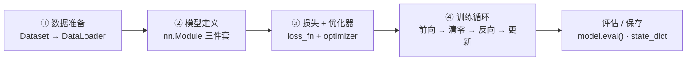
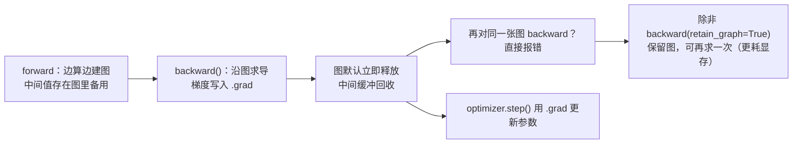

# PyTorch 快速上手

> **一句话理解**：PyTorch ≈ 一个自带"求导记账本"的 numpy，外加一箱搭网络的积木（nn.Module）和一条喂数据的传送带（DataLoader）——把上一页的训练循环从手算变成几十行可复用代码。

[⬆️ 返回总目录](../../../README.md) · [⬆️ 返回本篇](../README.md) · [⬅️ 返回本章目录](./README.md)

| 属性 | 说明 |
|------|------|
| 难度 | ⭐⭐（进阶） |
| 所属分支 | 通用基础 |
| 前置知识 | [训练一个模型的完整流程](./02-训练一个模型的完整流程.md)；[开发环境搭建](../../1-起步准备/01-环境与工具/01-开发环境搭建.md) |

---

## 📌 这一节解决什么问题

上一页我们用 numpy 手写了前向传播，误差追责只算了"一条链"。真实的网络有百万级权重、每天几万次迭代——手写反向传播既写不动也算不快。工业界需要的是：梯度自动算、数据自动喂、GPU 自动用、模型自动存取。

这就是深度学习框架（Framework）的定位。2016 年后 PyTorch 凭"像写 Python 一样写模型"的风格逐渐成为科研与工业界的主流选择（老对手 TensorFlow 依然在部署侧广泛应用）。本页解决四个问题：Tensor 和自动求导怎么用、模型怎么搭、上一页的训练循环怎么抽象成可复用模板、以及训练产物怎么保存与加载。

## 🌱 通俗理解

PyTorch 的四大件，各有一个生活原型：

- **Tensor（张量）**：长得很像 numpy 数组，但**自带一本"记账本"**——你对它做的每一步运算都被记下来，回头就能自动算出"任何输入对最终结果的影响"（梯度）。相当于带行车记录仪的车：开到哪都记录在案。
- **autograd（自动微分）**：就是那本记账本的自动结算功能。喊一声 `backward()`，账本从结果倒着翻一遍，每个变量的"责任额"（梯度）自动算好放在 `.grad` 里。
- **nn.Module（模型积木）**：声明零件（层）+ 写清怎么算（forward），框架自动把所有参数登记造册，交给优化器统一管理。
- **Dataset / DataLoader（数据传送带）**：你只要定义"一条数据长什么样、一共有多少条"，传送带自动把数据按 batch 分摞、打乱顺序、送到模型嘴边。

至于 GPU，一句话就够：`.to("cuda")` 把模型和数据搬上显卡（如消费级显卡 RTX 4090 或专业卡 A100/H100），训练提速通常是数量级的。

## 📋 举个例子

autograd 最小演示——一个 2×2 张量从"开账本"到"看梯度"的完整小过程：

```python
import torch

x = torch.tensor([[1.0, 2.0],
                  [3.0, 4.0]], requires_grad=True)  # ① 开账本：开始记账
y = (x ** 2).sum()        # ② 记了三笔账：平方、求和 → y = 1+4+9+16 = 30
y.backward()              # ③ 结算：从 y 倒着翻账本
print(x.grad)             # ④ 查看每个数的"责任额"
# 输出:
# tensor([[2., 4.],
#         [6., 8.]])
```

这个输出可以用手算验证。整个流程用公式说清：

$$
y = \sum x^2, \qquad \frac{\partial y}{\partial x} = 2x
$$

> 👉 **人话**：对每个元素平方再求和后，"每个元素对结果的责任"就是它的 2 倍——所以 1、2、3、4 的梯度正好是 2、4、6、8。上一页手算了五环链式法则才追责到一个权重；这里一句 `backward()`，账本自动把所有链路全部算完。

<details>
<summary>📊 展开看：backward() 时账本里发生了什么</summary>

PyTorch 在你做前向运算时，悄悄构建了一张**计算图（Computational Graph）**：`x → 平方 → 中间结果 → 求和 → y`。`backward()` 从 y 出发沿图**逆向遍历**：

1. y 对"求和"节点的梯度：每个位置的贡献都是 1；
2. "求和"对"平方"节点的梯度：还是 1（求和是线性的）；
3. "平方"对 x 的梯度：$2x$，逐元素就是 [2, 4, 6, 8]。

每一步都是一次链式法则，方向永远是"从结果往回走"——这正是上一页"误差沿流水线反向追责"的自动化版本。想看图长什么样，可以 `print(torch.autograd.grad(y, x))` 或查阅 `torchviz` 可视化库。

</details>

## 🧠 核心原理（本页是工具页，核心是四件套怎么配合）

### 整体流程：上一页循环的四步复用模板



### 逐步拆解

**① Tensor：会记账的 numpy。** 创建、运算、索引都和 numpy 几乎一致，多出来的关键参数就是 `requires_grad=True`（开账本）。与 numpy 互相转换零成本：`x.numpy()` / `torch.from_numpy(a)`。

**② nn.Module 三件套。** 写任何模型都是这三步：

| 步骤 | 写什么 | 作用 |
|------|--------|------|
| ① `__init__` | 声明零件 | 登记有哪些层（Linear、ReLU……），参数自动造册 |
| ② `forward` | 写清怎么算 | 数据进来按什么顺序过哪些零件 |
| ③ `optimizer` | 交接参数 | `optim.XXX(model.parameters())`，优化器接管全部权重 |

**③ Dataset / DataLoader：传送带喂 batch。** Dataset 只需回答两个问题——"一共多少条"（`__len__`）和"第 i 条是什么"（`__getitem__`）；DataLoader 负责打乱、分摞（batch）、（多进程）搬运。上一页手动 `X[i:i+32]` 切 batch 的活，传送带全包了。

**④ 设备与评估。** GPU 一句话：`model.to("cuda")` + 每个 batch `batch.to("cuda")`——**模型和数据必须在同一设备**，一边在 CPU 一边在 GPU 会直接报错。评估时 `model.eval()` 切模式 + `torch.no_grad()` 关账本，两件套缺一不可。

<details>
<summary>🧮 展开看：为什么 train/eval 是两种模式</summary>

有些层在训练和评估时行为不同：Dropout 训练时随机关神经元、评估时全开；BatchNorm 训练时用当前 batch 的统计量并更新全局滑动平均、评估时用固定下来的全局统计量。`model.train()` / `model.eval()` 就是在这两种行为间切换开关。忘了切 eval 就去评估，指标会莫名其妙地抖——这是新手四大坑之一（见下文坑清单）。

</details>

**⑤ 动态图 vs 静态图：PyTorch 调试友好的根源。** 两种框架设计哲学：

| | 动态图（Define-by-Run，PyTorch） | 静态图（Define-then-Run，TF 1.x 时代） |
|---|---|---|
| 建图时机 | 每次前向**边执行边建图**，跑完即弃 | 先声明整张图，再喂数据执行 |
| 调试 | print、断点、`if`/`for` 直接用，报错指向**你写的那一行** | 要用专用工具看图，报错与代码行隔着抽象层 |
| 优化 | 每次重建有开销 | 图固定可整体编译优化，部署友好 |
| 典型代表 | PyTorch | TensorFlow 1.x |

> 👉 **人话**：动态图像"边做菜边写菜谱"——哪步糊了当场尝出来；静态图是"先写完整菜谱再进厨房"——流程能整体优化，但菜谱写错只能整批重做。PyTorch 2.x 的 `torch.compile` 相当于"动态图写法 + 事后把稳定部分编译提速"，鱼与熊掌兼得——这也是它成为科研主流的工程理由。

**⑥ 计算图的生命周期：建 → 用 → 释放。** 一张图从 forward 开始存在，到 backward 默认**当场释放**：



三个由此而来的实战知识点：

- `loss.backward()` 默认**用后即焚**：对同一个 loss 调两次 backward 会报 `Trying to backward through the graph a second time`；训练循环里每步都重新 forward，天然没问题；
- 需要对同一前向求多个损失（如 GAN、多任务）时，要么合并损失一次 backward，要么 `retain_graph=True`；
- **隐性显存泄漏**：把每步的 `loss` 张量本身存进 list（`history.append(loss)`）会把整张图一起拖住不释放——存数值请用 `loss.item()`。症状：训练越跑显存越涨，最后 OOM。

**⑦ .detach() / torch.no_grad() / @torch.inference_mode()：三个"别记账"的区别。** 都能让某段计算不产生梯度，但层次完全不同：

| 工具 | 本质 | 粒度 | 典型场景 | 注意 |
|------|------|------|----------|------|
| `.detach()` | 把张量从图上**剪下来**（共享数据、断开历史） | 单个张量 | 把中间结果喂给指标/日志、RL 里 target 值 | 只影响被剪的这个张量，原图照常 |
| `torch.no_grad()` | 上下文管理器：**块内所有运算不建图** | 一段代码 | 验证/测试循环 | 只是"不记账"，层的训练/评估行为不变 |
| `@torch.inference_mode()` | no_grad 加强版：还允许更激进的内存复用 | 函数/代码块 | 纯推理服务、批量评测 | 块内产出的张量之后**不能**再用于需要 autograd 的计算 |

> 👉 **人话**：detach 是"这一件行李不托运"；no_grad 是"这趟行程所有人都不托运"；inference_mode 是"专机直达，行李系统直接拆了"。纯推理场景用 inference_mode 最快；训练中间要"偷看数值"用 detach 最顺手。

**⑧ DataLoader 的性能旋钮：num_workers 与 pin_memory。** 传送带慢了，GPU 就在挨饿（利用率常年 20% 的头号原因）：

- `num_workers=N`：开 N 个子进程**并行**做数据读取和预处理（`__getitem__` 里的事都被搬出主进程）。经验：从 2~4 起步，看 `nvidia-smi` 的 GPU 利用率往上加；预处理很重时收益巨大。Windows 注意：脚本里 DataLoader 必须放在 `if __name__ == "__main__":` 保护下，否则子进程会反复重启脚本（真实的 Windows 专属坑）；
- `pin_memory=True`：数据先落进**锁页内存**，CPU→GPU 拷贝走 DMA 快通道；配 `.to("cuda", non_blocking=True)` 效果才完整。GPU 训练时默认开，是免费的几个百分点提速；
- 诊断直觉：GPU 利用率低 + 某个 CPU 核打满 → 数据加载瓶颈，加 worker、缓存预处理结果；GPU 利用率已高 → 再加 worker 无益，该去优化模型侧。

**⑨ 保存与加载三件套。** 训练产物怎么存，决定了断点续训和上线部署顺不顺：

| 方式 | 写法 | 优点 | 坑 |
|------|------|------|-----|
| **state_dict（推荐默认）** | `torch.save(model.state_dict(), "w.pt")`；`model.load_state_dict(torch.load("w.pt"))` | 只存参数名→张量的字典，体积小、跨代码版本最稳 | 加载方必须先有相同结构的模型对象 |
| **checkpoint（断点续训）** | `torch.save({"epoch": e, "model": model.state_dict(), "optimizer": optimizer.state_dict()}, "ckpt.pt")` | 连优化器动量、轮次一起恢复，续训无缝 | 忘存 optimizer 会丢 Adam 动量，续训 loss 跳一下 |
| **整个模型（不推荐生产）** | `torch.save(model, "m.pt")`；`m = torch.load("m.pt")` | 一行搞定 | 用 pickle 序列化了**类的定义路径**，代码一重构/换机器就加载失败 |

> 👉 **人话**：state_dict 存的是"零件清单"（参数名+数值），换辆车只要型号对就能装上；整个模型存的是"整车含引擎图纸"，图纸（你的类定义）一改就报废。生产代码一律 state_dict，续训再加 optimizer 状态打成 checkpoint。

**⑩ 混合精度训练：autocast + GradScaler 一对。** GPU 的半精度算力通常是 FP32 的数倍——想吃到它，两个组件各管一件事：

| 组件 | 干什么 | 一句话 |
|------|--------|--------|
| `torch.autocast()` | 前向与损失中"能加速的算子"自动降到 FP16/BF16 执行（权重主副本仍是 FP32） | 主干道自动降精度 |
| `torch.amp.GradScaler()` | 反向前把 loss 放大（如 ×65536），更新前把梯度缩回原比例 | 给小数目垫高再算账 |

为什么需要 GradScaler：FP16 只有 10 位尾数，很小的梯度（如 1e-8）在 FP16 里直接**下溢成 0**——该参数从此收不到梯度、永远不更新（症状：混合精度下某几个参数 `.grad` 恒为 0）；反向也可能**上溢成 inf** 再传染成 NaN。放大 loss 等比放大所有梯度，避开下溢区；Scaler 还会动态调放大系数（一出现 inf 就自动减半重来）。**BF16 的数值范围与 FP32 相同**，天然免疫溢出——A100/H100/RTX 4090 级显卡上用 BF16 可以连 GradScaler 都省掉。

```python
# 混合精度训练骨架（在四步模板上改三处）
scaler = torch.amp.GradScaler()                      # ① 建 Scaler（BF16 可省略）
for X_batch, y_batch in loader:
    optimizer.zero_grad()
    with torch.autocast(device_type="cuda", dtype=torch.float16):  # ② 换精度上下文
        loss = loss_fn(model(X_batch), y_batch)
    scaler.scale(loss).backward()                    # ③ 放大 loss 再反向
    scaler.step(optimizer)                           # 缩回梯度后 step（遇 inf 自动跳过本步）
    scaler.update()                                  # 动态调整放大系数
# 改什么看什么：去掉 autocast 对比每 epoch 耗时（新卡上常快 1.5~2 倍，经验参考）；
# 换 dtype=torch.bfloat16 再跑——loss 曲线几乎重合，且不用操心缩放
```

<details>
<summary>🧮 展开看：打印模型结构与参数量的三招</summary>

```python
print(model)                                               # 招式一：直接打印，看层堆叠
print(sum(p.numel() for p in model.parameters()), "参数总量")  # 招式二：数参数
for name, p in model.named_parameters():                   # 招式三：逐层看名字、形状、可训性
    print(f"{name:20s} {str(list(p.shape)):18s} requires_grad={p.requires_grad}")
```

第三招也是排查"某层怎么不学"的第一步：`requires_grad=False` 说明该层被**冻结**（迁移学习的常用操作，忘了解冻是经典翻车）。配合训练前后各打一次 `torch.cuda.memory_allocated()/1e6`（MB），能快速看到显存都花在哪一步。想一次拿到每层输出形状与参数量，用第三方库 `torchinfo` 的 `summary(model, input_size=(1, 2))`。

</details>

## 💻 动手试试

```python
# 依赖：pip install torch
import torch
from torch.utils.data import Dataset, DataLoader

# ---------- 1. autograd 最小演示（见"举个例子"节，这里省略） ----------

# ---------- 2. nn.Module 三件套 ----------
class MyNet(torch.nn.Module):
    def __init__(self):                       # ① 声明零件
        super().__init__()
        self.hidden = torch.nn.Linear(2, 4)   # 隐藏层：2 输入 → 4 神经元
        self.out = torch.nn.Linear(4, 1)      # 输出层

    def forward(self, x):                     # ② 写清怎么算
        return self.out(torch.relu(self.hidden(x)))

model = MyNet()
optimizer = torch.optim.SGD(model.parameters(), lr=0.1)  # ③ 优化器接管参数
print("参数总量:", sum(p.numel() for p in model.parameters()))
# 预期 17（2×4+4 + 4×1+1）

# ---------- 3. Dataset + DataLoader：传送带喂 batch ----------
class ToyDataset(Dataset):
    def __init__(self):
        self.X = torch.randn(100, 2)
        self.y = (self.X.sum(dim=1, keepdim=True) > 0).float()  # 和为正 → 1
    def __len__(self):
        return len(self.X)
    def __getitem__(self, idx):
        return self.X[idx], self.y[idx]

loader = DataLoader(ToyDataset(), batch_size=16, shuffle=True)
print("batch 数:", len(loader))               # 预期 7（100/16 向上取整）

# ---------- 4. 四步模板的完整训练（结构同上一页） ----------
loss_fn = torch.nn.BCEWithLogitsLoss()        # 二分类损失（内置 sigmoid）
for epoch in range(30):
    for X_batch, y_batch in loader:           # 传送带自动喂 batch
        loss = loss_fn(model(X_batch), y_batch)  # 前向 + 打分
        optimizer.zero_grad()                 # 清零 → 反向 → 更新
        loss.backward()
        optimizer.step()
    if epoch % 10 == 9:
        print(f"epoch {epoch+1}, loss = {loss.item():.4f}")  # .item() 取数值，不拖住计算图

# ---------- 5. 评估（两件套缺一不可） ----------
model.eval()
with torch.no_grad():
    acc = ((model(ToyDataset().X) > 0).float() == ToyDataset().y).float().mean()
print("准确率:", round(acc.item(), 3))         # 预期 0.9x（30 轮基本学会）

# ---------- 6. 保存与加载（state_dict 路线） ----------
torch.save(model.state_dict(), "mynet.pt")    # 存"零件清单"
model2 = MyNet()                              # 先搭同结构的空模型
model2.load_state_dict(torch.load("mynet.pt"))  # 再装零件
print("权重已迁移:", torch.equal(model2.hidden.weight, model.hidden.weight))
# 预期 True
```

**改什么参数、看什么变化**：① 把第 6 步换成 `torch.save(model, "m.pt")` 再在别的文件里 load——体会"整个模型"式保存对类定义位置的依赖；② 在第 3 步给 DataLoader 加 `num_workers=2`（Windows 下记得把训练代码放进 `if __name__ == "__main__":`），观察加载耗时变化；③ 把第 5 步的 `torch.no_grad()` 换成 `torch.inference_mode()`，结果相同、略快。

**新手常见坑清单**（每一条都真实翻过车）：

| 坑 | 现象 | 解法 |
|----|------|------|
| 忘 `optimizer.zero_grad()` | loss 乱跳不收敛 | 口诀：清零 → 反向 → 更新 |
| 忘 `model.eval()` | 评估指标忽好忽坏 | 评估前必切 eval，训练前切回 train |
| 设备不一致 | 报错 `Expected all tensors on same device` | 模型和每个 batch 都 `.to(device)`，device 变量全局统一 |
| train/eval 模式混淆 | 用 eval 模式继续训练，Dropout/BatchNorm 行为不对 | 每轮循环开头 `model.train()`，评估块开头 `model.eval()` |

**常见报错对照表**（含一句修法；报错信息截取关键片段）：

| 报错关键句 | 根因 | 一句修法 |
|------------|------|----------|
| `mat1 and mat2 shapes cannot be multiplied` | 某层输入维度和权重对不上 | `print(x.shape)` 逐层往下打，第一处对不上的就是要改的层 |
| `Expected all tensors on be on the same device` | 模型在 GPU、数据在 CPU（或反之） | 全局 device 变量，模型与每个 batch 都 `.to(device)` |
| `element 0 of tensors does not require grad` | 要 backward 的 loss 没连着图：输入被 detach 过、或在 no_grad 块里做的前向 | 检查前向是否在 no_grad 内、目标张量是否误 detach |
| `Trying to backward through the graph a second time` | 一次 backward 后图已释放又 backward（见⑥） | 每步重新 forward；或确认后 `backward(retain_graph=True)` |
| `one of the variables needed for gradient computation has been modified by an inplace operation` | `x += 1`、`mask *= …` 这类原地操作改掉了求导要用的旧值 | 找到报错张量的 `+=`/`*=`，改成 `x = x + 1` 非原地写法 |
| 训练越跑显存越涨直到 OOM | 把 loss **张量**（而非 `.item()`）存进了列表，拖住整张图 | 历史记录一律存 `loss.item()`，中间变量及时出作用域 |

## 🔥 炼丹小灶

> 🔥 **炼丹小灶**：工业界常用起点配方与玄学——
> - 配方：device 写成 `"cuda" if torch.cuda.is_available() else "cpu"`；调试先在 CPU 上小数据跑通再上 GPU；`torch.manual_seed(0)` 保证可复现；保存一律 state_dict / checkpoint；
> - 玄学：报维度错误时，先 `print(x.shape)` 逐层打印——90% 的 bug 是 shape 没对齐；报设备错误时全局搜 `.to(` 检查遗漏；显存越跑越涨先查"存了张量没存 item"；
> - ⚠️ 以上是经验参考值，不是圣旨；换数据集请重新炼。

## 🔗 在知识树中的位置

- **上游**：[训练一个模型的完整流程](./02-训练一个模型的完整流程.md)——本页四步模板就是它的工程化；[开发环境搭建](../../1-起步准备/01-环境与工具/01-开发环境搭建.md)——pip 安装与虚拟环境。
- **下游**：[分布式训练与模型规模](./04-分布式训练与模型规模.md)——模板搬到多卡；[推理与部署](./05-推理与部署.md)——模板的产物如何上线；第四篇所有方向的代码（如 [CNN 卷积神经网络](../../4-专业方向/05-计算机视觉/01-CNN卷积神经网络.md)）都是"换零件、不换模板"。
- **横向对比**：JAX（函数式、科研新贵）、TensorFlow（部署生态深厚）；本库统一用 PyTorch，因为"像写 Python"对教材最友好。

## ⚠️ 常见误区

- **误区一**：`.to("cuda")` 一次就万事大吉 → 只搬了模型没搬数据照样报错；反过来只搬数据不搬模型也不行，**两边都要搬**。
- **误区二**：`torch.no_grad()` 可以替代 `model.eval()` → 不行。前者是"关账本"（不算梯度），后者是"切层的行为模式"（Dropout/BatchNorm），管的是两件事，评估时都要做。
- **误区三**：`model.parameters()` 传给优化器只是"读一下参数" → 它交接的是参数的**引用**，优化器此后每次 `step()` 直接改的就是模型本体。
- **误区四**：`torch.save(model)` 最省事 → 省事的账单后付：它 pickle 了类的定义路径，代码重构或换机器就加载失败；生产一律 state_dict。
- **误区五**：num_workers 越大越快 → 超过 CPU 核数只增加进程切换开销；GPU 已经吃满时加 worker 毫无收益，先确认瓶颈真的在数据加载。

## 📝 小结与自测

**要点回顾**

- Tensor = 自带求导记账本的 numpy，`requires_grad` 开账本、`backward()` 结算、`.grad` 查责任额；
- 动态图 = 边执行边建图，print/断点/控制流直接可用——PyTorch 调试友好的根源；计算图在 backward 后默认释放，重复 backward 要 retain_graph，存历史请存 `.item()`；
- `.detach()`（剪单个张量）/ `no_grad()`（整块不建图）/ `inference_mode()`（推理加速版）是三个层次的"不记账"；
- nn.Module 三件套：`__init__` 声明零件、`forward` 写清怎么算、优化器接管参数；
- Dataset 回答"有多少条 / 第 i 条是什么"，DataLoader 自动打乱、分 batch、搬运；num_workers 并行预处理、pin_memory 加速拷贝；
- 保存加载：默认 state_dict（零件清单），续训加 optimizer 状态打 checkpoint，"存整个模型"只配临时实验；
- 混合精度：autocast 降精度提速 + GradScaler 防 FP16 梯度下溢（BF16 免疫，新卡首选）；requires_grad=False 的层是被冻结，不是坏了；
- GPU 一句话 `.to("cuda")`，但模型和数据必须同设备。

**自测一下**（点击展开答案）

<details>
<summary>问题 1：`y.backward()` 之后，梯度存在哪里？多次 backward 会怎样？</summary>

存在产生该运算的叶子张量的 `.grad` 属性里（如 `x.grad`）。多次 backward 默认是**累加**而不是覆盖——这正是训练循环里每轮都要 `optimizer.zero_grad()` 的原因：先把上一轮的旧梯度清掉，再 backward 写入新梯度。

</details>

<details>
<summary>问题 2：评估代码为什么要同时写 model.eval() 和 torch.no_grad()？</summary>

它们管两件不同的事：`model.eval()` 切换层的行为（Dropout 全开、BatchNorm 用全局统计量）；`torch.no_grad()` 关闭记账、不再构建计算图，省显存也提速。只写前者，算得对但浪费；只写后者，Dropout/BatchNorm 还在训练行为，指标就是错的。

</details>

<details>
<summary>问题 3：报错 "Trying to backward through the graph a second time"，发生了什么、怎么处理？</summary>

计算图在第一次 `backward()` 后默认被释放（中间缓冲回收省显存），第二次对**同一张图** backward 就会撞上这个错。两种处理：标准做法是每步都重新 forward 得到新 loss；确有一图多用的需求（如同一前向喂两个损失），给第一个 backward 传 `retain_graph=True`，代价是显存占用升高。

</details>

<details>
<summary>问题 4：为什么生产环境推荐 state_dict 而不是 torch.save(model)？</summary>

`torch.save(model)` 用 pickle 把**对象连同类定义的引用路径**一起序列化，加载环境里必须有完全相同的类结构（import 路径都不能变），代码一重构、一换机器就报错。`state_dict` 只是一个"参数名 → 张量"的字典，只要模型结构代码能重新实例化，就能 `load_state_dict` 装回去——与版本控制、模型仓库（如 HuggingFace）的兼容性也更好。

</details>

## 📚 延伸阅读

- 官方教程：[PyTorch 60 分钟闪电战](https://pytorch.org/tutorials/beginner/deep_learning_60min_blitz.html)（有中文版）
- 官方文档：`torch.autograd` 章节——机械视角看记账本；`torch.compile`——动态图的"事后编译"加速
- 社区讲义：CS231n *PyTorch Notebook*——四件套的课堂版讲解
- 指南：HuggingFace *Efficient Training on a Single GPU*——num_workers/混合精度等实用旋钮

---

[⬅️ 上一页：训练一个模型的完整流程](./02-训练一个模型的完整流程.md) · [返回本章目录](./README.md) · [下一页：分布式训练与模型规模 ➡️](./04-分布式训练与模型规模.md)
