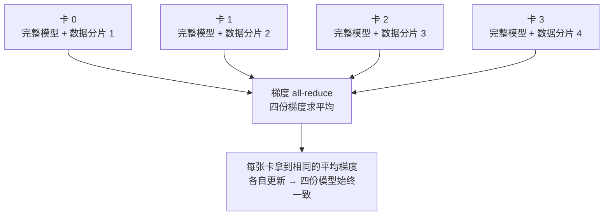
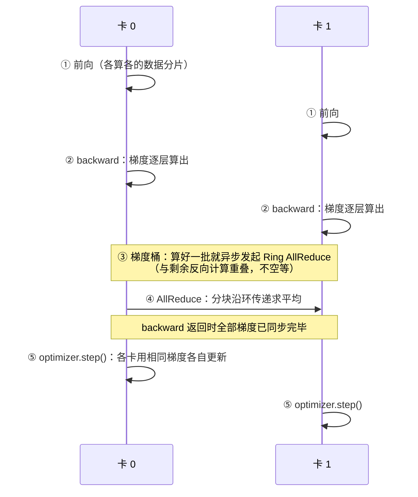
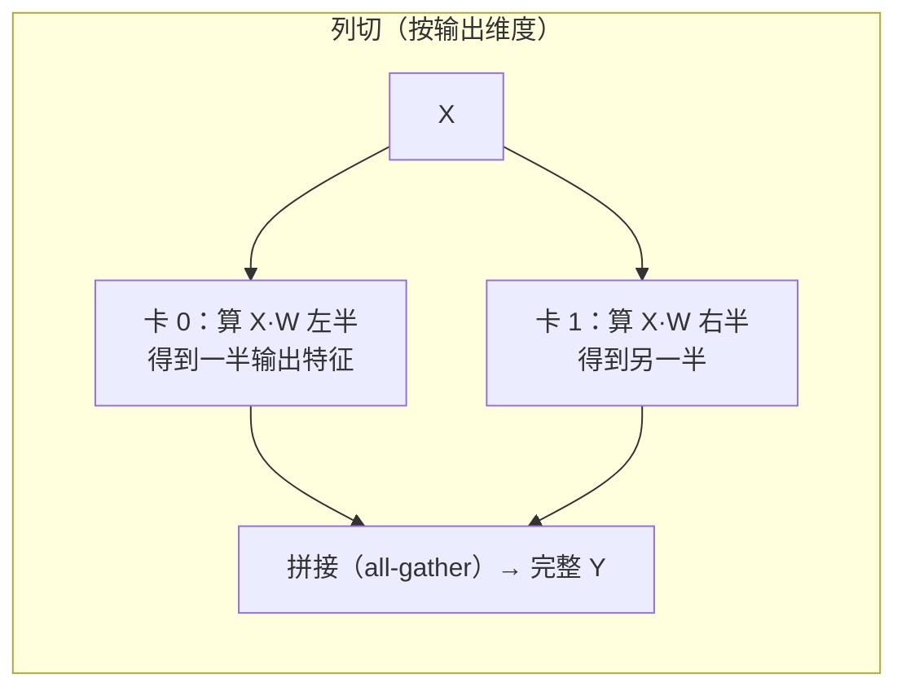
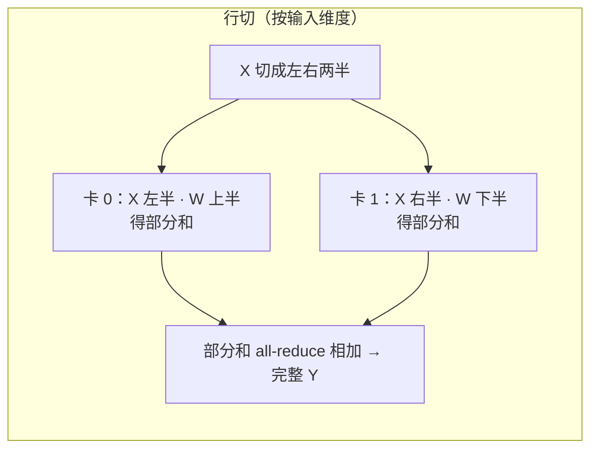
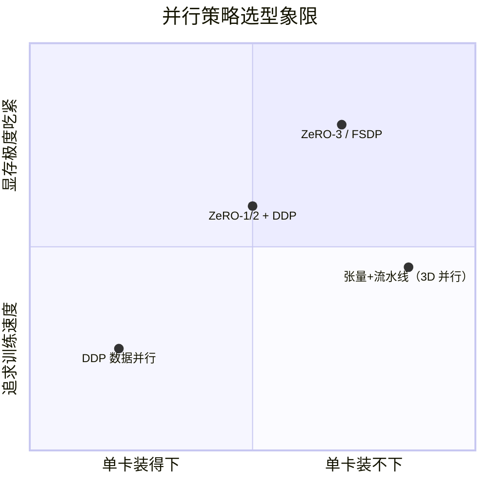

# 分布式训练与模型规模

> **一句话理解**：模型大到一张卡的显存装不下、或一张卡算到天荒地老时，就把"数据"或"模型本身"拆到多张卡上一起训——本页顺带回答：模型为什么分小、中、大，"7B"到底是多大，以及"训一个 7B 要花多少算力"怎么心算。

[⬆️ 返回总目录](../../../README.md) · [⬆️ 返回本篇](../README.md) · [⬅️ 返回本章目录](./README.md)

| 属性 | 说明 |
|------|------|
| 难度 | ⭐⭐⭐（较难） |
| 所属分支 | 通用基础 |
| 前置知识 | [PyTorch快速上手](./03-PyTorch快速上手.md) |

---

## 📌 这一节解决什么问题

新闻里的模型参数量从"百万"一路飙到"千亿"，可你的显卡显存是以 GB 计的。三个非常现实的问题随之而来：

1. **模型为什么分小中大？** 不同规模的模型活在完全不同的世界里——训练用的卡、花的钱、能干的活都不一样。不建立量级直觉，读到"7B 模型单卡可跑"这类信息时只能背结论。
2. **为什么要多卡一起训？** 一类原因是**显存装不下**：训练一个模型不光要放权重，还要放梯度和优化器状态，比推理吃显存得多；另一类原因是**算力不够**：单卡训要几个月，四张卡能把墙钟时间压到几分之一。
3. **"多卡"到底在并行什么、开销在哪？** 多卡不是免费的四倍速——通信是绕不开的税。搞懂 DDP 每一步发生什么、ZeRO 每阶段切什么、流水线的"气泡"从哪来，才能在"卡数、显存、通信"之间做对取舍。

本页给出参数量分级、显存粗算与算力（FLOPs）心算公式，以及"拆什么"的三种答案——拆数据（数据并行）、拆层（模型并行）、拆冗余状态（ZeRO）。

## 🌱 通俗理解

把"训练大模型"想成**搬一大家子的家当**：

- **数据并行（Data Parallelism）**：每人手里一份**完整的装箱攻略**（完整模型），但各搬各的房间（各算一份数据）；每搬完一轮，大家碰头对齐一下"装箱心得"（同步梯度），保证攻略始终一致。这是最常用、最容易上手的方式。
- **张量并行（Tensor Parallelism）**：攻略里某一页的**大表格太宽**，一个人抱不动，干脆把这张表**竖着切开**，几人各拿半张，各自算完再拼起来——切的是"一层内部"。
- **流水线并行（Pipeline Parallelism）**：把搬家流程**按环节分段**——A 组打包、B 组装车、C 组运输，像工厂流水线一样各管一段——切的是"层与层之间"。
- **ZeRO**：大家各自保管攻略的**一部分页码**（优化器状态、梯度、参数分片），要用的时候互相借阅——谁都不必背下整本攻略。

还有一个"穷人版多卡"技巧：**梯度累积（Gradient Accumulation）**——一张小卡分几个小 batch 累积梯度、凑成一次大 batch 更新，等于用时间换显存；以及**混合精度（Mixed Precision）**——大部分计算用 FP16/BF16 半精度，显存省约一半、速度更快，用低精度换资源。

## 📋 举个例子

先建立参数量的量级感：

| 规模 | 参数量级 | 代表成员（行业常识举例） | 典型训练配置 |
|------|----------|--------------------------|--------------|
| 小型 | < 100M | MLP、小 CNN、词向量级模型 | CPU 或一张入门 GPU 就能训 |
| 中型 | 100M ~ 10B | BERT-base（约 110M）、7B 量级开源 LLM | 一张专业卡到几张卡 |
| 大型 | > 10B 至数百 B | 旗舰级 LLM（GPT-3 175B 量级） | 专业集群（成百上千张卡） |

拿 7B 模型做一次量级推演：FP16 每个参数 2 字节 → **权重约 7×2 = 14GB**，一张专业卡（如 A100/H100，单卡显存几十 GB 级）放权重绰绰有余；但**训练**远不止放权重。

<details>
<summary>📊 展开完整算例：7B 模型训练态显存粗估（量级估算，非精确值）</summary>

按"训练态显存 ≈ 参数量 × 16~20 字节"的经验参考粗算（FP32 权重 4B + FP32 梯度 4B + Adam 两个状态 8B，再加激活值）：

1. **只推理**：FP16 权重 ≈ 7B × 2 字节 = **14GB** —— 单张专业卡（40~80GB 级）轻松装下，部分大显存消费级显卡也够；
2. **朴素全参训练（FP32 + Adam）**：7B × 16 字节 ≈ **112GB 量级**，还没算激活值 —— 单张 80GB 专业卡**装不下**；
3. **上工程手段后**：混合精度（部分减半）、8-bit 优化器、ZeRO 把优化器状态/梯度/参数分片到多卡，可压到**几十 GB 量级**——落在"单张旗舰专业卡到几张卡"的区间。

结论：同一个 7B 模型，"能推理"和"能训练"差着好几倍显存——这正是"部署用单卡、训练上多卡"成为常态的原因。⚠️ 以上均为量级估算与经验参考，具体数字随实现方案浮动。

</details>

## 🧠 核心原理

### 整体流程：数据并行 DDP（最常用的第一步）



### 逐步拆解

**① 为什么大模型一定要分布式。** 两个独立的原因，占其一就得上多卡：

- **显存墙**：训练态显存 ≈ 参数量的十几二十倍字节数（见下方公式），模型越大越装不下；
- **算力墙**：即使装得下，单卡训完要数月，实验节奏不可接受。

**② 显存粗算经验公式：**

$$
\text{训练态显存（字节）} \approx \text{参数量} \times 16 \sim 20
$$

> 👉 **人话**：训练一个模型，显存开销不是"权重本身"而是"权重的十几二十倍"——权重、梯度、优化器状态都要各占一份，还有激活值。这是**经验参考量级**，不是精确值；混合精度、ZeRO 等手段能明显压缩。

**③ 算力心算公式：训练一次要多少 FLOPs。** 与显存并列的另一本账：

$$
\text{训练总计算量} \approx 6 \times N \times D \quad (N=\text{参数量}，D=\text{训练 token 数})
$$

> 👉 **人话**：前向时每个参数对每个 token 要做一次乘加（约 2 FLOPs），反向约是前向的两倍（要同时算"对权重的梯度"和"对输入的梯度"），2 + 4 = 6。记住 6ND，看到"7B 模型训 1T token"就能立刻心算出算力账单。

<details>
<summary>🧮 展开看：6ND 的推导 + 7B 模型实算（GPU·天）</summary>

**推导。** 一个参数参与一次乘加 = 2 FLOPs。一次前向，每个参数被每个 token 用一次：前向 = 2ND。反向要对每个参数算 ∂L/∂W、还要沿每条边算 ∂L/∂x，两者合起来约是前向的 2 倍：反向 = 4ND。合计 **6ND**。（激活值的重计算、attention 附加项等是修正项，量级估算可忽略。）

**实算：7B 模型、1T（10¹²）token。**

$$
6 \times 7\times10^9 \times 10^{12} = 4.2\times10^{22}\ \text{FLOPs}
$$

> 👉 **人话**：6（每参数每 token 的 FLOPs）× 70 亿参数 × 1 万亿 token ≈ 4.2 后面挂 22 个零——这就是"7B 训 1T"的算力账单。

以 A100 为例：BF16 峰值算力约 312 TFLOPS，但**真实利用率（MFU，Model FLOPs Utilization）只有 40%~50%**（经验参考，通信与访存吃掉其余）：

- 单卡每秒有效算力 ≈ 312×10¹² × 0.45 ≈ 1.4×10¹⁴ FLOPS
- 总卡·秒 = 4.2×10²² / 1.4×10¹⁴ = 3.0×10⁸ 秒 ≈ **3,500 卡·天 ≈ 83,000 卡·时**

换算成直觉：512 张 A100 全速跑 ≈ **7 天**；单张 A100 跑 ≈ **9.5 年**。这就是"大模型必上集群"的算术版本——与业界公开报道的 7B 级训练成本量级吻合（经验参考）。

</details>

**④ AllReduce 通信直觉：梯度求平均为什么不算慢。** DDP 每步都要把所有卡的梯度汇总求平均（AllReduce 集合通信）。傻瓜做法是"人人发给一台中央机、算完再广播"——中央机的带宽瞬间成为瓶颈。实际用的是**环形规约（Ring AllReduce）**，一句话：**把每份梯度切成 N 小块，沿"卡 0→卡 1→…→卡 N−1→卡 0"的环流水传递，每一步人人都在给邻居传块、同时合并收到的块，N−1 步后每张卡都持有全局总和**。

> 👉 **人话**：像一群人传阅拼图碎片而不是把所有碎片寄给一个组长——没有中央瓶颈、没有人在闲着，总通信量 ≈ 2×(N−1)/N×梯度大小，**几乎不随卡数变差**。这就是 AllReduce 高效的全部秘密。

**⑤ DDP 一步训练的完整流程。** 把"拆什么"落到每一步的时间线：



三个工程细节：梯度按**桶（bucket）**打包——一个桶的梯度凑齐就立刻通信，不等全部算完；通信与反向计算**重叠**，把等待摊薄；每卡更新前梯度已完全一致，所以**各卡模型始终逐比特相同**（这就是自测问题 1 的答案）。

**⑥ ZeRO 三阶段：逐步切碎冗余。** ZeRO（Zero Redundancy Optimizer）的观察：DDP 里每张卡都**完整冗余**存着优化器状态、梯度、参数——其实可以切片分摊。三阶段就是按"最冗余 → 最核心"的顺序依次切：

| 阶段 | 切掉什么 | 每参数显存（8 卡、混合精度 Adam） | 7B 总量级 | 通信代价 |
|------|----------|-----------------------------------|-----------|----------|
| 基线 DDP | 无（每卡全持有） | 16 字节 | ~112GB | 基准 |
| ZeRO-1 | 优化器状态（FP32 主权重 + Adam 的 m、v，共 12B） | 4 + 12/8 = 5.5 字节 | ~38GB | 与 DDP 基本持平 |
| ZeRO-2 | 再切梯度（2B） | 2 + 14/8 = 3.75 字节 | ~26GB | 与 DDP 相当 |
| ZeRO-3 | 再切 FP16 参数（2B） | 16/8 = 2 字节 | ~14GB | 通信量约 +50%（经验量级） |

> 👉 **人话**：ZeRO-1 最划算——把最占地方又最少用的"账本"（优化器状态）分摊掉，显存砍到三分之一而通信几乎不涨；ZeRO-3 连权重本体都切片，显存压到底但要靠通信把参数"随用随借"回来。**先 1 后 2 再 3，按显存缺口逐级加码**——这就是"每阶段解决了前一阶段的什么痛点"。

**⑦ 张量并行：怎么切"一层"。** 一层就是 Y = XW，两种切法对应两个维度：





> 👉 **人话**：列切 = **按"产出"分工**，每人负责一半输出特征，最后拼起来；行切 = **按"原料"分工**，每人拿一半输入算出部分和，最后加起来。Megatron-LM 在 Transformer 里把注意力头按列切、把 FFN 按行切，衔接处恰好一次通信，让"切一层"的代价最小。它解决的是"单层矩阵大到一张卡装不下/算不动"——但每层内都要通信，因此**必须配卡间高带宽（NVLink 同机内）才划算**。

**⑧ 流水线并行与"气泡"。** 把网络按层切成 p 段、4 张卡接力，问题在起步和收尾：卡 0 算第一个 batch 时，卡 1~3 只能干等——这段空转就叫**气泡（bubble）**：

| 时刻 | 卡 0（第 1 段） | 卡 1（第 2 段） | 卡 2（第 3 段） | 卡 3（第 4 段） |
|------|-----------------|-----------------|-----------------|-----------------|
| t1 | micro-batch 1 | **等** | **等** | **等** |
| t2 | micro-batch 2 | micro-batch 1 | **等** | **等** |
| t3 | micro-batch 3 | micro-batch 2 | micro-batch 1 | **等** |
| … | 稳态：人人有活干 | | | |

$$
\text{气泡占比} \approx \frac{p-1}{m+p-1}\quad(p=\text{段数}，\ m=\text{micro-batch 数})
$$

> 👉 **人话**：气泡占比公式说，救法只有一个——**把 batch 切成尽量多的 micro-batch 灌满流水线**：p=4 时 m=4 个批次气泡占 3/7≈43%，m=32 时只占 3/35≈9%。1F1B 等调度算法进一步让"干等"变成"边算边收"，这是大模型 3D 并行（数据 × 张量 × 流水线混搭）的标配零件。

**⑨ 梯度累积：单卡模拟大 batch，等价与不等价。** 等价的部分是纯数学：若损失对 batch 内样本**取平均**，k 次 micro-batch 的梯度累加再除以 k，与一次 k 倍大 batch 的梯度**严格相等**（梯度算子是线性的）。不等价/要注意的部分有三处：

1. **BatchNorm 场景**：BN 的均值方差按**当前 micro-batch** 估计——micro=4 的统计噪声远大于 batch=64，累积救不回来。补救：换 GroupNorm/LayerNorm，或把 micro-batch 尽量做大；
2. **wall-clock 更慢**：同样的有效 batch，拆 k 次就是约 k 倍的"循环开销"，省的是显存不是时间；
3. **学习率联动**：既然模拟的是大 batch，上一页"大 batch 配 lr 放大"的规则同样适用——梯度累积 + 原封不动的 lr，等于只做了半套。

**⑩ 数据并行的扩展效率曲线：多卡为什么不是线性加速。** 每步耗时 ≈ 计算 + 通信（部分重叠），定义通信比 b = 通信量/计算量，则近似有加速比 S(N) ≈ N / (1 + (N−1)·b)。固定全局 batch 时，卡数翻倍 → 每卡计算减半、通信量不变（≈2×参数量）→ b 翻倍 → 效率下滑：

| 卡数 | 通信占比（经验量级示意） | 加速比 | 并行效率 |
|------|--------------------------|--------|----------|
| 1 | ~0 | 1× | 100% |
| 8 | ~5%~10% | ~7.5× | ~90%+ |
| 64 | ~20% | ~50× | ~80% |
| 512 | ~40%+ | ~300× | ~60% |

> 👉 **人话**：卡少时通信被计算"藏住"（重叠执行），几乎白赚；卡多了每卡活儿变薄、通信税占比飙升，曲线必然弯下去——而且走的是**以太网还是 NVLink**（带宽差一个量级）会让拐点位置天差地别。另一种玩法是保持每卡 batch 不变、放大全局 batch（弱扩展），效率好得多，但要按上一页的规则同步放大学习率。

**⑪ 并行策略选型：一张象限图。** 把"模型装不装得下单卡"与"主要矛盾是速度还是显存"放到两个轴上（经验参考，边界非硬性）：



> 👉 **人话**：从左下往右上走，是"先加卡数、再切冗余、最后切模型本体"的递进——每一步都对应"上一步解决不了的显存缺口"。绝大多数项目止步于左半区；右半区是大模型预训练的专属领地。

**⑫ 混合精度：省一半显存的同时，为什么常要配"损失缩放"。** 前面多次提到混合精度，这里把机制补齐。三种浮点格式的差别（位数 = 1 符号 + 指数 + 尾数）：

| 格式 | 结构 | 数值范围 | 相对精度 | 显存/速度 |
|------|------|----------|----------|-----------|
| FP32 | 1+8+23 | ±3.4×10³⁸ | 最高 | 基准（训练默认底座） |
| FP16 | 1+5+10 | **±65504，最小正规数 ≈6×10⁻⁵** | 中 | 显存减半、新卡算力翻倍级 |
| BF16 | 1+8+7 | **与 FP32 同范围** | 较低 | 同 FP16 的速度，深度学习对"范围"远比对"精度"敏感 |

FP16 的坑与解法：反向早期很多梯度小于 6×10⁻⁵，在 FP16 里**下溢成 0**——对应参数永远收不到更新（症状：混合精度训练中个别参数 `.grad` 恒为 0、loss 陷在高位）；中间值超过 65504 则**上溢成 inf** 并传染成 NaN。解法就是上一页 PyTorch 的 `GradScaler`：反向前把 loss 放大让梯度整体搬进安全区，更新前再等比缩回。BF16 指数位与 FP32 相同，天然免疫范围问题——所以**新硬件（A100/H100/RTX 4090 级）上优先 BF16**，连 Scaler 都可省。

### 📐 数学深潜：浮点数的数学——位怎么分、误差从哪来、"大数吃小数"

⑫的表格（±65504、6×10⁻⁵、与 FP32 同范围）每一格都能从浮点数的表示公式直接算出来。这一小节把公式、间距和三个"翻车小算例"一次讲透。

**严格陈述。** IEEE 浮点数是"二进制的科学计数法"：

$$
x = (-1)^s \times 1.m \times 2^{\,e-b}
$$

> 👉 **人话**：1.m 是"有效数字"（m 是尾数位串），2^(e−b) 是"数量级台阶"（e 是指数字段，减去偏置 b 才是真实指数），s 是符号。**指数位管"能数多大"，尾数位管"数得多细"**——两笔预算抢同一串位。

三种格式的差别只是位怎么分：

| 格式 | 位分配（符号+指数+尾数） | 偏置 b | 正常数范围 | 最小正规数 | 相对舍入误差上界 |
|---|---|---|---|---|---|
| FP16 | 1 + 5 + 10 | 15 | **±65504** | 2⁻¹⁴ ≈ **6.1×10⁻⁵** | 2⁻¹¹ ≈ 4.9×10⁻⁴ |
| BF16 | 1 + 8 + 7 | 127 | ±3.4×10³⁸（与 FP32 同） | 2⁻¹²⁶ ≈ 1.2×10⁻³⁸ | 2⁻⁸ ≈ 3.9×10⁻³ |
| FP32 | 1 + 8 + 23 | 127 | ±3.4×10³⁸ | 2⁻¹²⁶ ≈ 1.2×10⁻³⁸ | 2⁻²⁴ ≈ 6.0×10⁻⁸ |

> 👉 **人话**：BF16 砍尾数（23→7 位）换指数（5→8 位）：范围与 FP32 一样宽（不用 GradScaler），代价是每个数的刻度粗 128 倍（2⁷ = 128）。深度学习对"范围"敏感（梯度忽大忽小）、对"细度"钝感（训练本来就在噪声里泡着），这笔交换稳赚——这就是⑫"新卡首选 BF16"的数学版。

**完整推导（折叠）：间距公式、"大数吃小数"、8e-5 吞更新的来历。**

<details>
<summary>🧮 展开推导：为什么 2048+1=2048、1e8+1=1e8、更新量 1e-5 会被吞</summary>

**第一步：局部间距公式。** 在区间 [2^E, 2^(E+1)) 内（E 为真实指数），所有数共享同一指数，尾数最低位跳 1 相当于数值跳 2^(E−p)（p = 尾数位数）：

$$
\text{spacing}(x) = 2^{\,E-p}\qquad \text{对所有 } x\in[2^{E},\,2^{E+1})
$$

（尾数每前进一位，数值乘 2 的幂——指数段的台阶高度。）

**关键性质：间距随数量级翻倍增长**——数越大，格点越稀。

**第二步："大数吃小数"实算。**

- FP16（p=10）：[2048, 4096) 内间距 = 2^(11−10) = 2，2049 这个数**不存在**——`2048 + 1 = 2048`，那个 1 被舍掉了；而在 [1024, 2048) 内间距 = 1，2047+1 仍精确。分界就在 2048；
- FP32（p=23）：1e8 ∈ [2²⁶, 2²⁷)（2²⁶ ≈ 6.7×10⁷），间距 = 2^(26−23) = 8——`1e8 + 1 = 1e8`。注意"吃小数"不是 FP16 的专利，任何有限精度都有，只是分界随尾数位数移动；
- 至于 FP16 里的 1e8：超出 65504 直接**上溢成 inf**，连"被吃"的资格都没有。

**第三步：训练里的版本——"8e-5 吞更新"的来历。** BF16 尾数 p=7，权重在 0.01 量级（≈2⁻⁶·⁷）时，局部间距 ≈ 0.01 × 2⁻⁷ ≈ **7.8×10⁻⁵**。一次 AdamW 更新量常在 1e-6~1e-5——**不足半格，加上去立刻被舍回来**，这个参数永远不动。这就是本章[进阶专题](./06-进阶专题-大规模训练工程.md)"主权重必须留 FP32、只把计算降到 BF16"的数学源头。

**第四步：舍入误差累积。** 每次运算至多引入半格误差（相对值 ≤ 2^−(p+1)）；n 次串行累加的最坏误差按 n 放大（随机近似按 √n）——FP16 串行累加百万个数，最坏误差可到荒谬的量级。工程解法：**分块/树状求和**（串行 n 步变成 log n 层，误差从 O(n) 降到 O(log n)）、Kahan 补偿求和（专门用一个变量记住被吃掉的小数）。GPU 的 reduction 算子天生是树状的——这也是框架从不让你写 for 循环逐元素累加的隐秘理由之一。

</details>

**数轴图景（ASCII）：间距随数量级翻倍。**

```
FP16 数轴局部（p=10）：
... 2046 2047 │ 2048 ———— 2050 ———— 2052 ———— ... │ 4096 ———— ...
   间距 = 1    │          间距 = 2（2049 消失了）       │   间距 = 4
              └ 2048 + 1 舍回 2048："大数吃小数"现场
```

**反例与边界。**

1. 最小正规数之下还有**非正规数（subnormal）**：FP16 能一路表示到 2⁻²⁴ ≈ 6×10⁻⁸，但有效位骤减——"表示得出"不等于"还有精度"，梯度落进这一段基本等于噪声；
2. 溢出/下溢不是唯一误差源：舍入误差在长训练中缓慢累积（上框第四步），loss scale 放得太大自己也会上溢——GradScaler 一见 inf 就把放大系数减半，本质是在两个悬崖之间自动巡航；
3. 这套数学只管**浮点**；INT8/INT4 是另一套（均匀整格点、没有指数位）的数学，误差结构完全不同——见下一页量化误差界的推导。

> 👉 **人话总结**：浮点数 = 科学计数法的有限格点版——指数位定范围、尾数位定粗细；大数的格点稀，够不着半格的小改动就被舍掉（2048+1=2048、更新量 1e-5 被 8e-5 的分辨率吞掉）；BF16 用 128 倍的粗细换来了 FP32 的整条范围。

## 💻 动手试试

```python
# DDP 骨架：本代码是"认识 API"用的示意骨架，单机没有多卡环境跑不起来，
# 看不懂输出没关系——先认识每一行在干什么，混个脸熟。
# 真实运行方式（不是 python xxx.py，而是用启动器起多个进程）：
#   torchrun --nproc_per_node=4 ddp_demo.py    # 4 张卡各起一个进程
import torch
import torch.distributed as dist
from torch.nn.parallel import DistributedDataParallel as DDP

dist.init_process_group(backend="nccl")      # ① 多进程握手成组（nccl=NVIDIA 卡间通信）
rank = dist.get_rank()                       # 我是第几张卡（0/1/2/3）
torch.cuda.set_device(rank)                  # 各进程认领自己的卡

model = torch.nn.Linear(10, 1).to("cuda")
model = DDP(model)                           # ② 把模型包进 DDP：之后的 backward 自动同步梯度
optimizer = torch.optim.Adam(model.parameters(), lr=1e-3)

for batch in dataloader:                     # ③ 注意：DDP 配套的采样器保证每张卡拿到"不同的那份数据"
    loss = loss_fn(model(batch[0]), batch[1])
    optimizer.zero_grad()
    loss.backward()                          # ④ 梯度按桶打包，反向期间自动 all-reduce 求平均（见⑤流程图）
    optimizer.step()
    if rank == 0:                            # ⑤ 只让 0 号卡打日志，避免一条日志打四遍
        print("loss =", loss.item())
```

与上一页单卡模板逐行对比：模型多包了一层 `DDP`，DataLoader 换成配套的分布式采样器，其余**一行未变**——分布式并非重写代码，而是给现有模板加两行装备。再补一段**单卡也能跑**的梯度累积，把⑨落到实处：

```python
# 梯度累积：单卡模拟大 batch（batch=4 累 16 次 ≈ 有效 batch 64）
accum_steps = 16
optimizer.zero_grad()                        # 整个累积周期只在开头清一次零
for i, (xb, yb) in enumerate(loader):
    loss = loss_fn(model(xb), yb) / accum_steps   # 关键①：除以累积步数，等价"大 batch 取平均"
    loss.backward()                          # 关键②：不清零、不 step，梯度自动累加在 .grad 上
    if (i + 1) % accum_steps == 0:
        optimizer.step()                     # 攒够了才更新一次：这就是"有效 batch 64"
        optimizer.zero_grad()
# 改什么看什么：accum_steps 从 1 改到 16，观察显存占用下降、单 epoch 时间变长；
# 若模型里有 BatchNorm，对比两者训练曲线——micro-batch=4 的统计噪声会现形
```

## 🔥 炼丹小灶

> 🔥 **炼丹小灶**：什么时候才需要碰分布式？——
> - 先把单卡练明白：数据增强、混合精度、梯度累积这些单卡技巧没吃透之前，多卡只会让你多卡在同一个坑里；
> - 数据并行（DDP）是最常用的第一步：模型装得下单卡显存、只是想更快 → DDP；显存吃紧先上 ZeRO-1/2 或梯度累积；模型本身单卡装不下 → 才考虑张量/流水线并行（3D 混搭是大厂大模型的活）；
> - 玄学：多卡跑出来的 loss 和单卡不完全一样是正常的（有效 batch 变大了，学习率常需按比例微调）；
> - ⚠️ 以上是经验参考值，不是圣旨；换模型请重新炼。

## 🔗 在知识树中的位置

- **上游**：[PyTorch快速上手](./03-PyTorch快速上手.md)——单卡训练模板是本页的地基；[训练一个模型的完整流程](./02-训练一个模型的完整流程.md)——batch 与优化器的概念在这里被放大。
- **下游**：[推理与部署](./05-推理与部署.md)——训练完的大模型如何便宜地跑起来；[大语言模型 LLM 全景](../../4-专业方向/07-自然语言处理与LLM/04-大语言模型LLM全景.md)、[微调与对齐](../../4-专业方向/07-自然语言处理与LLM/05-微调与对齐.md)——分布式的主战场。
- **横向对比**：三种切法不是竞争关系而是组合关系——小模型 DDP 足矣，大模型 3D 并行混搭；单卡装不下但想省事的场景，还有"卸载到 CPU/硬盘"的极端方案（Offload）。

## 🎓 深度视角

并行策略选择的**真实取舍**，一句话可以说尽：**把显存缺口兑换成通信量与调度复杂度**——没有免费的分片。判断兑换是否划算，靠的是通信的"α-β 直觉"：一次集合通信的耗时近似为

$$
T \approx \alpha + \beta\, m \quad(\alpha=\text{启动延迟}，\ \beta=1/\text{带宽}，\ m=\text{消息字节数})
$$

> 👉 **人话**：通信耗时 = 固定的"叫车时间" α + 与数据量成正比的"路程时间"。消息大（整份梯度同步）→ 路程主导，拼带宽；消息小而频繁（张量并行每层两次小通信）→ 叫车时间主导，拼延迟。这一个小模型解释了本页几乎全部布局决策。

三个深问深答（研究生资格考试 / 高级面试级别）：

**深问一：为什么说 ZeRO-3/FSDP 的通信量约为 DDP 的 1.5 倍？这笔账怎么算？**

答：先把 all-reduce 拆开看——环形 all-reduce 等价于 **reduce-scatter + all-gather** 各一遍，所以 DDP 每步通信 ≈ 2×（梯度量级）。ZeRO-3/FSDP 每步要做三件事：前向前 all-gather 参数、反向前再 all-gather 一次参数（重算需要）、反向后对梯度做 reduce-scatter（分片落位）——共 3×（参数量级）。参数量与梯度量同阶，故 3/2 = **1.5 倍**。这就是"显存换通信"的算术版本：省下的 12+ 字节/参数冗余，是用多付 50% 通信换的——也正是本章[进阶专题](./06-进阶专题-大规模训练工程.md)里"通信-计算重叠"要吃掉的那 50%。

**深问二：张量并行为什么必须圈在机内 NVLink 域，数据并行却能跨机走以太网？**

答：看通信的**粒度与频率**。TP 在每一层内部做两次集合通信、单条消息小——延迟项 α 主导，必须用 α 极小的 NVLink/NVSwitch 域；DP 每步只同步一次、消息是整份梯度——带宽项 β 主导，标准数据中心网络也能吃下。由此自然推出 3D 并行的嵌套顺序：**TP 在最内层（机内），PP 居中（机组间），DP 在最外层（跨机）**——不是惯例，是 α-β 模型的直接推论。

**深问三：扩展效率公式 S(N) ≈ N/(1+(N−1)·b) 什么时候失效？**

答：它假设"通信与计算完全不重叠"且节点无故障。两个失效方向：① 重叠做得好（见⑦的桶机制、[进阶专题](./06-进阶专题-大规模训练工程.md)的三种重叠手段）→ 有效 b 变小，曲线变直；② 真实万卡集群里还有**慢节点（straggler）拖尾、弹性故障、热点数据倾斜**——长尾决定 wall-clock，这些"非理想因素"不在公式里，却是大规模训练工程的主战场（本页下方 SOTA 与专题页的训练稳定性一节都在处理它们）。

## 🔬 SOTA 演进（2023–2026）

| 时间 | 工作 | 改进点 | 代价 | 适用 |
|------|------|--------|------|------|
| 2021–2023 | **FSDP**（PyTorch 原生全分片数据并行） | ZeRO 思想的官方实现：`FULL_SHARD` 策略 ≈ ZeRO-3，`SHARD_GRAD_OP` ≈ ZeRO-2——**实战口径下两者能力等价** | 与 ZeRO 一样付 1.5 倍通信税 | 2023 年后 PyTorch 生态的默认大模型训练方案 |
| 2024–2025 | **FSDP2**（`fully_shard` 逐参数分片） | 按参数粒度分片替代按模块包装（`wrap` 蓝图退场），显存更省、与 `torch.compile`（第 3 页）兼容性更好 | API 迁移成本 | 新项目建议直接 FSDP2 心智模型 |
| 2023–2026 | **ZeRO 系（DeepSpeed 生态）** | 与 FSDP 并行演进，ZeRO-1/2 的"只切优化器态/梯度"在微调场景仍常用 | 多框架并存，配置口径不一 | 团队已用 DeepSpeed 全家桶时顺势沿用 |
| 2023–2026 | **异构训练**（一句话级） | 不同型号卡混合训练的难点在负载均衡与慢卡拖尾，分层并行/动态调度仍在探索 | 成熟度低 | 主流大规模训练仍坚持同构集群，异构多是预算受限的妥协 |

一句话判断现状：**"FSDP 还是 ZeRO"在 2024 年以后更多是生态选择（PyTorch 原生 vs DeepSpeed 全家桶），不是能力选择**；真正的性能差异来自重叠调度、精度策略与稳定性工程——它们在下一页[进阶专题](./06-进阶专题-大规模训练工程.md)展开。

## ❓ 开放问题

1. **万卡级扩展的"通信墙"在哪？** 为什么难：跨机带宽增长慢于模型规模增长，拓扑感知的并行方案搜索空间随维度爆炸，而每次验证都是集群级实验——试错成本本身就是研究瓶颈。
2. **并行策略能否自动搜索（auto-parallelism）？** 为什么难：目标是吞吐、显存、容错的多目标优化，且与具体模型结构、互联拓扑强耦合——没有便宜的代理实验可以近似。
3. **checkpoint 频率与容错怎么权衡？** 为什么难：存得太稀疏，loss spike 回滚损失大；太频繁，训练吞吐显著下降——而故障是稀有事件，统计规律难以在小集群上积累。
4. **集合通信库的"黑盒"性质能否打开？** 为什么难：数值一致性、版本行为差异、挂起根因散布在库/驱动/硬件之间，问题定位依赖厂商配合，公开的可复现案例极少。

## ⚠️ 常见误区

- **误区一**：参数越多效果一定越好 → 数据质量、架构、训练配方同样关键；参数翻倍常换来边际收益递减，而推理成本线性上涨。
- **误区二**：四张卡就是四倍速 → all-reduce 通信有开销，卡数越多加速比越打折（"强扩展性"限制，见⑩效率表）；瓶颈也可能根本不在卡上，而在数据加载。
- **误区三**：混合精度就是"无脑换 FP16" → FP16 数值范围小、容易溢出，通常要配合损失缩放；新一代硬件上优先选 BF16，更稳。
- **误区四**：梯度累积与大 batch 完全等价 → 纯 SGD 意义下梯度等价，但 BatchNorm 的统计量按 micro-batch 估、噪声更大，且 wall-clock 更慢、lr 该联动没联动时只有半套效果。
- **误区五**：ZeRO 是与数据并行并列的"另一种并行" → ZeRO 是数据并行的**显存优化版**（去掉冗余存储），三者（DP/TP/PP）才是按"拆什么"划分的并列关系。

## 📝 小结与自测

**要点回顾**

- 参数量三级：小型（<100M，单卡甚至 CPU）、中型（100M~10B，单张专业卡到几张卡）、大型（>10B，集群）；
- 两本账：训练态显存 ≈ 参数量 × 16~20 字节；训练总算力 ≈ 6ND（FLOPs）——7B 训 1T token ≈ 4.2×10²² FLOPs ≈ 512 张 A100 跑约一周（按 MFU 45% 经验估）；
- AllReduce 用环形规约避开中央瓶颈，总通信量几乎不随卡数变差；DDP 一步 = 前向 → 反向（梯度按桶异步 all-reduce，与计算重叠）→ 各卡一致更新；
- ZeRO 三阶段：切优化器态（最划算）→ 再切梯度 → 再切参数，显存从 16B/参数 压到 16/N，通信逐级加价；
- 张量并行按列切（分产出、拼结果）或按行切（分原料、加部分和）；流水线并行的气泡占比 ≈ (p−1)/(m+p−1)，靠多 micro-batch 灌满；
- 梯度累积在 SGD 下与大 batch 梯度严格等价，但 BN 统计不等价、wall-clock 更慢；
- 混合精度 FP16 需配损失缩放防下溢/上溢，BF16 范围与 FP32 相同、天然免疫，新卡首选；
- 多卡加速比 S(N)≈N/(1+(N−1)b)：卡越多通信税越重，互联带宽决定拐点。

**自测一下**（点击展开答案）

<details>
<summary>问题 1：DDP 中每张卡上最终的模型是不同的吗？</summary>

相同。每张卡持有完整模型副本、各处理不同的数据分片，反向传播时梯度 all-reduce 取平均，每张卡拿到完全相同的梯度并做相同更新，因此副本始终一致。DDP 加速的是"每步喂进去的总数据量"，而不是把模型变小。

</details>

<details>
<summary>问题 2：7B 模型 FP16 权重约多少显存？为什么训练远不止这个数？</summary>

约 7×2 = 14GB。但训练态还要存 FP32 权重副本、梯度、Adam 的一阶/二阶状态以及激活值，按经验公式约为参数量的 16~20 倍字节数（量级估算）——粗估就是上百 GB 量级，所以"推理单卡够、训练要多卡"是常态。

</details>

<details>
<summary>问题 3：梯度累积 16 次 micro-batch=4，与一次 batch=64，什么时候结果几乎一样、什么时候明显不同？</summary>

等价条件：损失对 batch 取平均且累积时除以 16、优化器无状态或状态一致、模型无跨样本统计的层——此时两者梯度严格相等，SGD/Adam 训练轨迹几乎重合。明显不同的场景：模型含 BatchNorm（统计量按 4 条样本估计，噪声远大于 64 条），或学习率没有按"有效 batch 放大"的规则联动。补救：换 GroupNorm/LayerNorm、加大 micro-batch、lr 线性放大。

</details>

<details>
<summary>问题 4：为什么 ZeRO-1 的"性价比"常被认为最高？</summary>

优化器状态（FP32 主权重 + Adam 的 m、v，每参数 12 字节）是训练态显存里最大的一块冗余，且只在 optimizer.step() 时才需要完整——把它切片分摊到各卡，显存立刻砍到三分之一附近，而通信量几乎不涨（同步时机不变）。相比之下 ZeRO-3 连参数都要随用随借，显存压到底但通信明显加价——所以常规做法是按显存缺口从 1 逐级加到 3。

</details>

## 📚 延伸阅读

- 论文：Rajbhandari et al., *ZeRO: Memory Optimizations Toward Training Trillion Parameter Models*（2020）
- 论文：Shoeybi et al., *Megatron-LM*（2019）——张量并行的代表作；Narayanan et al., *Efficient Large-Scale Language Model Training*（2021）——1F1B 与 3D 并行
- 论文：Kaplan et al., *Scaling Laws for Neural Language Models*（2020）——算力账与规模效应的源头
- 文档：PyTorch 官方 `DistributedDataParallel` 教程——本页骨架的可运行完整版
- 指南：HuggingFace *Efficient Training on a Single GPU*——单卡省显存技巧大全

---

[⬅️ 上一页：PyTorch快速上手](./03-PyTorch快速上手.md) · [返回本章目录](./README.md) · [下一页：推理与部署 ➡️](./05-推理与部署.md)
