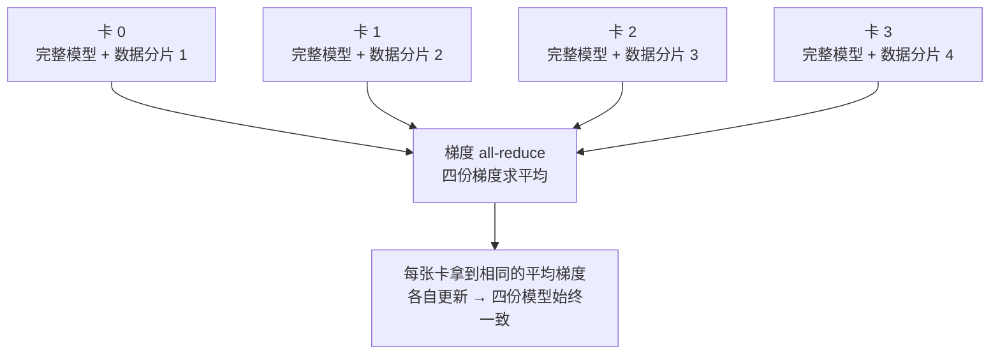

# 分布式训练与模型规模

> **一句话理解**：模型大到一张卡的显存装不下、或一张卡算到天荒地老时，就把"数据"或"模型本身"拆到多张卡上一起训——本页顺带回答：模型为什么分小、中、大，以及"7B"到底是多大。

[⬆️ 返回总目录](../../../README.md) · [⬆️ 返回本篇](../README.md) · [⬅️ 返回本章目录](./README.md)

| 属性 | 说明 |
|------|------|
| 难度 | ⭐⭐⭐（较难） |
| 所属分支 | 通用基础 |
| 前置知识 | [PyTorch快速上手](./03-PyTorch快速上手.md) |

---

## 📌 这一节解决什么问题

新闻里的模型参数量从"百万"一路飙到"千亿"，可你的显卡显存是以 GB 计的。两个非常现实的问题随之而来：

1. **模型为什么分小中大？** 不同规模的模型活在完全不同的世界里——训练用的卡、花的钱、能干的活都不一样。不建立量级直觉，读到"7B 模型单卡可跑"这类信息时只能背结论。
2. **为什么要多卡一起训？** 一类原因是**显存装不下**：训练一个模型不光要放权重，还要放梯度和优化器状态，比推理吃显存得多；另一类原因是**算力不够**：单卡训要几个月，四张卡能把墙钟时间压到几分之一。

本页给出参数量分级、一个显存粗算的经验公式，以及"拆什么"的三种答案——拆数据（数据并行）、拆层（模型并行）、拆冗余状态（ZeRO）。

## 🌱 通俗理解

把"训练大模型"想成**搬一大家子的家当**：

- **数据并行（Data Parallelism）**：每人手里一份**完整的装箱攻略**（完整模型），但各搬各的房间（各算一份数据）；每搬完一轮，大家碰头对齐一下"装箱心得"（同步梯度），保证攻略始终一致。这是最常用、最容易上手的方式。
- **张量并行（Tensor Parallelism）**：攻略里某一页的**大表格太宽**，一个人抱不动，干脆把这张表**竖着切开**，几人各拿半张，各自算完再拼起来——切的是"一层内部"。
- **流水线并行（Pipeline Parallelism）**：把搬家流程**按环节分段**——A 组打包、B 组装车、C 组运输，像工厂流水线一样各管一段——切的是"层与层之间"。
- **ZeRO**：大家各自保管攻略的**一部分页码**（优化器状态、梯度、参数分片），要用的时候互相借阅——谁都不必背下整本攻略。

还有一个"穷人版多卡"技巧：**梯度累积（Gradient Accumulation）**——一张小卡分几个小 batch 累积梯度、凑成一次大 batch 更新，等于用时间换显存；以及**混合精度（Mixed Precision）**——大部分计算用 FP16/BF16 半精度，显存省约一半、速度更快，用低精度换资源。

## 📋 举个例子

先建立参数量的量级感：

| 规模 | 参数量级 | 代表成员（行业常识举例） | 典型训练配置 |
|------|----------|--------------------------|--------------|
| 小型 | < 100M | MLP、小 CNN、词向量级模型 | CPU 或一张入门 GPU 就能训 |
| 中型 | 100M ~ 10B | BERT-base（约 110M）、7B 量级开源 LLM | 一张专业卡到几张卡 |
| 大型 | > 10B 至数百 B | 旗舰级 LLM（GPT-3 175B 量级） | 专业集群（成百上千张卡） |

拿 7B 模型做一次量级推演：FP16 每个参数 2 字节 → **权重约 7×2 = 14GB**，一张专业卡（如 A100/H100，单卡显存几十 GB 级）放权重绰绰有余；但**训练**远不止放权重。

<details>
<summary>📊 展开完整算例：7B 模型训练态显存粗估（量级估算，非精确值）</summary>

按"训练态显存 ≈ 参数量 × 16~20 字节"的经验参考粗算（FP32 权重 4B + FP32 梯度 4B + Adam 两个状态 8B，再加激活值）：

1. **只推理**：FP16 权重 ≈ 7B × 2 字节 = **14GB** —— 单张专业卡（40~80GB 级）轻松装下，部分大显存消费级显卡也够；
2. **朴素全参训练（FP32 + Adam）**：7B × 16 字节 ≈ **112GB 量级**，还没算激活值 —— 单张 80GB 专业卡**装不下**；
3. **上工程手段后**：混合精度（部分减半）、8-bit 优化器、ZeRO 把优化器状态/梯度/参数分片到多卡，可压到**几十 GB 量级**——落在"单张旗舰专业卡到几张卡"的区间。

结论：同一个 7B 模型，"能推理"和"能训练"差着好几倍显存——这正是"部署用单卡、训练上多卡"成为常态的原因。⚠️ 以上均为量级估算与经验参考，具体数字随实现方案浮动。

</details>

## 🧠 核心原理

### 整体流程：数据并行 DDP（最常用的第一步）



### 逐步拆解

**① 为什么大模型一定要分布式。** 两个独立的原因，占其一就得上多卡：

- **显存墙**：训练态显存 ≈ 参数量的十几二十倍字节数（见下方公式），模型越大越装不下；
- **算力墙**：即使装得下，单卡训完要数月，实验节奏不可接受。

**② 显存粗算经验公式：**

$$
\text{训练态显存（字节）} \approx \text{参数量} \times 16 \sim 20
$$

> 👉 **人话**：训练一个模型，显存开销不是"权重本身"而是"权重的十几二十倍"——权重、梯度、优化器状态都要各占一份，还有激活值。这是**经验参考量级**，不是精确值；混合精度、ZeRO 等手段能明显压缩。

**③ 三种"切法"各一句话：**

| 切法 | 切的是什么 | 一句话直觉 |
|------|-----------|-----------|
| 张量并行 | 一层内部的大矩阵 | 把一层切开，几人各算半张再拼 |
| 流水线并行 | 层与层之间 | 把网络按层分段，各管一段接力跑 |
| ZeRO | 冗余状态 | 优化器态/梯度/参数分片到各卡，谁都不背整本账 |

大模型训练通常**混着用**（如 3D 并行 = 数据 + 张量 + 流水线），旗舰 LLM 的标配。

**④ 两个单卡也用得上的技巧：**

- **梯度累积**：小 batch 多算几次、梯度累加够了再 `optimizer.step()`——小卡拼出大 batch 的效果，训练变慢但显存立省；
- **混合精度**：FP16/BF16 计算为主、关键处保留高精度，显存省约一半、速度提升明显；BF16 数值范围更大，比 FP16 更不容易溢出，是新一代硬件上的稳妥选择。

<details>
<summary>🧮 展开看：DDP 的梯度是怎么"同步"的</summary>

DDP（DistributedDataParallel）在 `loss.backward()` 期间，把每张卡的梯度通过 **all-reduce** 集合通信取平均——通信与反向传播重叠进行，尽量不空等。同步完成后，每张卡拿到**完全相同**的平均梯度，各自执行相同的更新，于是四份模型副本始终逐比特一致。这就是"人人拿全模型、各算一份数据、同步梯度"的机制版。代价是每一步都有通信开销——卡越多、模型越大，通信占比越高，所以多卡加速不是线性的。

</details>

## 💻 动手试试

```python
# DDP 骨架：本代码是"认识 API"用的示意骨架，单机没有多卡环境跑不起来，
# 看不懂输出没关系——先认识每一行在干什么，混个脸熟。
# 真实运行方式（不是 python xxx.py，而是用启动器起多个进程）：
#   torchrun --nproc_per_node=4 ddp_demo.py    # 4 张卡各起一个进程
import torch
import torch.distributed as dist
from torch.nn.parallel import DistributedDataParallel as DDP

dist.init_process_group(backend="nccl")      # ① 多进程握手成组（nccl=NVIDIA 卡间通信）
rank = dist.get_rank()                       # 我是第几张卡（0/1/2/3）
torch.cuda.set_device(rank)                  # 各进程认领自己的卡

model = torch.nn.Linear(10, 1).to("cuda")
model = DDP(model)                           # ② 把模型包进 DDP：之后的 backward 自动同步梯度
optimizer = torch.optim.Adam(model.parameters(), lr=1e-3)

for batch in dataloader:                     # ③ 注意：DDP 配套的采样器保证每张卡拿到"不同的那份数据"
    loss = loss_fn(model(batch[0]), batch[1])
    optimizer.zero_grad()
    loss.backward()                          # ④ 梯度在所有卡间自动 all-reduce 求平均
    optimizer.step()
    if rank == 0:                            # ⑤ 只让 0 号卡打日志，避免一条日志打四遍
        print("loss =", loss.item())
```

与上一页单卡模板逐行对比：模型多包了一层 `DDP`，DataLoader 换成配套的分布式采样器，其余**一行未变**——分布式并非重写代码，而是给现有模板加两行装备。

## 🔥 炼丹小灶

> 🔥 **炼丹小灶**：什么时候才需要碰分布式？——
> - 先把单卡练明白：数据增强、混合精度、梯度累积这些单卡技巧没吃透之前，多卡只会让你多卡在同一个坑里；
> - 数据并行（DDP）是最常用的第一步：模型装得下单卡显存、只是想更快 → DDP；模型本身就装不下 → 才考虑张量/流水线并行或 ZeRO；
> - 玄学：多卡跑出来的 loss 和单卡不完全一样是正常的（有效 batch 变大了，学习率常需按比例微调）；
> - ⚠️ 以上是经验参考值，不是圣旨；换模型请重新炼。

## 🔗 在知识树中的位置

- **上游**：[PyTorch快速上手](./03-PyTorch快速上手.md)——单卡训练模板是本页的地基；[训练一个模型的完整流程](./02-训练一个模型的完整流程.md)——batch 与优化器的概念在这里被放大。
- **下游**：[推理与部署](./05-推理与部署.md)——训练完的大模型如何便宜地跑起来；[大语言模型 LLM 全景](../../4-专业方向/07-自然语言处理与LLM/04-大语言模型LLM全景.md)、[微调与对齐](../../4-专业方向/07-自然语言处理与LLM/05-微调与对齐.md)——分布式的主战场。
- **横向对比**：三种切法不是竞争关系而是组合关系——小模型 DDP 足矣，大模型 3D 并行混搭；单卡装不下但想省事的场景，还有"卸载到 CPU/硬盘"的极端方案（Offload）。

## ⚠️ 常见误区

- **误区一**：参数越多效果一定越好 → 数据质量、架构、训练配方同样关键；参数翻倍常换来边际收益递减，而推理成本线性上涨。
- **误区二**：四张卡就是四倍速 → all-reduce 通信有开销，卡数越多加速比越打折（"强扩展性"限制）；瓶颈也可能根本不在卡上，而在数据加载。
- **误区三**：混合精度就是"无脑换 FP16" → FP16 数值范围小、容易溢出，通常要配合损失缩放；新一代硬件上优先选 BF16，更稳。

## 📝 小结与自测

**要点回顾**

- 参数量三级：小型（<100M，单卡甚至 CPU）、中型（100M~10B，单张专业卡到几张卡）、大型（>10B，集群）；
- 训练态显存 ≈ 参数量 × 16~20 字节（经验参考量级）：训练比推理吃显存十几倍；
- 上多卡的两大理由：显存装不下 + 算力不够；
- 数据并行（DDP）：人人全模型、各算一份数据、梯度 all-reduce 求平均——最常用的第一步；
- 张量并行切一层、流水线并行切段、ZeRO 分片冗余状态；单卡先练混合精度与梯度累积。

**自测一下**（点击展开答案）

<details>
<summary>问题 1：DDP 中每张卡上最终的模型是不同的吗？</summary>

相同。每张卡持有完整模型副本、各处理不同的数据分片，反向传播时梯度 all-reduce 取平均，每张卡拿到完全相同的梯度并做相同更新，因此副本始终一致。DDP 加速的是"每步喂进去的总数据量"，而不是把模型变小。

</details>

<details>
<summary>问题 2：7B 模型 FP16 权重约多少显存？为什么训练远不止这个数？</summary>

约 7×2 = 14GB。但训练态还要存 FP32 权重副本、梯度、Adam 的一阶/二阶状态以及激活值，按经验公式约为参数量的 16~20 倍字节数（量级估算）——粗估就是上百 GB 量级，所以"推理单卡够、训练要多卡"是常态。

</details>

## 📚 延伸阅读

- 论文：Rajbhandari et al., *ZeRO: Memory Optimizations Toward Training Trillion Parameter Models*（2020）
- 论文：Shoeybi et al., *Megatron-LM*（2019）——张量并行的代表作
- 文档：PyTorch 官方 `DistributedDataParallel` 教程——本页骨架的可运行完整版
- 指南：HuggingFace *Efficient Training on a Single GPU*——单卡省显存技巧大全

---

[⬅️ 上一页：PyTorch快速上手](./03-PyTorch快速上手.md) · [返回本章目录](./README.md) · [下一页：推理与部署 ➡️](./05-推理与部署.md)
