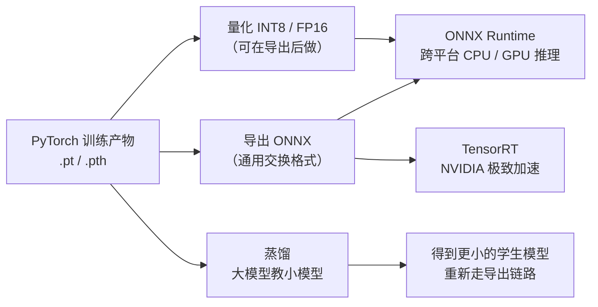
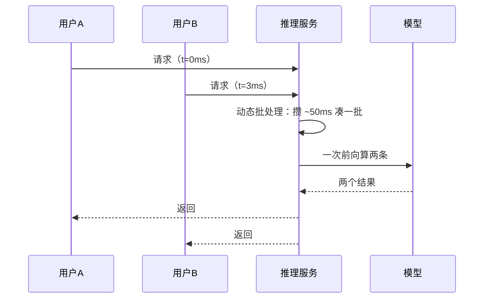

# 推理与部署

> **一句话理解**：训练是"运动员集训"，推理（Inference）是"比赛日"——部署解决的是怎么让训练好的模型变成一个**稳定、快速、便宜**的在线服务或离线流程，这一步的时间常占项目的一半。

[⬆️ 返回总目录](../../../README.md) · [⬆️ 返回本篇](../README.md) · [⬅️ 返回本章目录](./README.md)

| 属性 | 说明 |
|------|------|
| 难度 | ⭐⭐⭐（较难） |
| 所属分支 | 通用基础 |
| 前置知识 | [PyTorch快速上手](./03-PyTorch快速上手.md)；[分布式训练与模型规模](./04-分布式训练与模型规模.md) |

---

## 📌 这一节解决什么问题

实验室里 `model(x)` 一跑，准确率 95%，故事就结束了？生产环境紧接着会甩来一堆问题：用户请求一秒钟来 500 个怎么办？手机上没有 GPU、内存只有几百 MB 怎么办？老板说"接口响应必须 100 毫秒内"怎么办？账单说"每百万次调用成本再砍一半"怎么办？

训练和推理对计算的要求几乎相反：训练要梯度、要大 batch、以"总耗时"论英雄；推理不要梯度、常常一次一条、以"单条延迟"和"整体吞吐"论英雄。理解这对矛盾，才能理解 ONNX、TensorRT、量化、蒸馏这些加速技术为什么长这样——它们分别在不同处下手：算子执行方式、数值精度、模型体积。

## 🌱 通俗理解

- **延迟（Latency）vs 吞吐（Throughput）**：延迟是**一位顾客从点单到上菜等多久**（单请求耗时）；吞吐是**这家店每小时能出多少道菜**（每秒能处理多少请求，QPS）。加桌子（并发）能提吞吐，但每位顾客的等待未必变短——两者不是一回事。
- **P99 延迟**：把所有请求的耗时排序，99% 的请求都快于这个数。看它而不看平均，是因为**平均值会撒谎**——100 个请求里 1 个卡了 5 秒，平均值几乎不动，但那 1 位用户已经卸载你的 App 了。
- **模型导出**：训练好的 PyTorch 模型像"Chef 的私房菜谱"，导出 ONNX 相当于译成**通用交换格式**——任何后厨（CPU、GPU、各种推理引擎）都能照着做；TensorRT 则是 NVIDIA 后厨的"特调版菜谱"，工序全部重排，快到极致。
- **量化（Quantization）**：把 32 位浮点数（FP32）压成 8 位整数（INT8）——像把无损音乐压成 MP3，体积小一档、速度提一截，音质略损但大多数人听不出来。
- **蒸馏（Distillation）**：让大模型当老师、小模型当学生，学生只学老师的"答题思路"（软标签），常常比自学（只看标准答案）成绩更好——大教小，小而精。

## 📋 举个例子

场景：评论情感分类模型上线，预算 P99 < 100ms。同一个模型，三种跑法（同一台 CPU 机器，经验参考量级）：

| 跑法 | 单条平均耗时（量级） | 说明 |
|------|---------------------|------|
| PyTorch 直接 `model(x)` | 基准 1× | 框架开销大：算子逐个解释执行，还要维护计算图那套"记账本"机制 |
| 导出 ONNX + ONNX Runtime | 约 0.2×~0.5×（**快 2~5 倍**） | 算子预先融合成图，专注前向计算，没有训练包袱 |
| ONNX + INT8 量化 | 在上一步基础上再提速、省内存 | 精度换速度，分类任务常见掉点在 1% 以内（需回测确认） |

⚠️ 以上为行业常见量级与经验参考，具体加速比取决于模型结构、序列长度与机器配置——正确姿势是**拿自己的模型实测**（下方代码就是计时模板）。结论：不换模型、不重训，仅靠"导出 + 推理引擎"就常能拿到数倍提速，这是性价比最高的一步。

## 🧠 核心原理

### 整体流程：从训练产物到加速服务



### 逐步拆解

**① 训练 vs 推理，差异在哪。**

| 维度 | 训练 | 推理 |
|------|------|------|
| 计算方向 | 前向 + 反向（要梯度） | 只前向（不建计算图） |
| batch | 大 batch 吃满 GPU | 常为 1 或动态凑批 |
| 关心指标 | 收敛速度、最终精度 | P99 延迟、QPS、单条成本 |
| 显存 | 权重+梯度+优化器态+激活 | 权重+少量激活（可用第 4 页的显存公式反推：约 2~4 字节/参数） |

**② 部署形态三选一。**

| 形态 | 典型场景 | 延迟要求 | 成本特征 |
|------|----------|----------|----------|
| 批量离线打分 | 每晚给百万商品重算排序分 | 不敏感（小时级） | 便宜：一次性跑完即释放资源 |
| 在线 API 服务 | 实时风控、搜索排序、对话 | 敏感（常 P99 < 100ms 级） | 贵：服务 7×24 常驻、要冗余 |
| 端侧边缘 | 手机相册分类、摄像头行人检测 | 敏感 + 离线可用 | 硬件受限：模型必须小（量化/蒸馏常客） |

**③ 服务化三要点**：**动态批处理**（攒几十毫秒把并发请求凑成一批再算，吞吐大幅提升）；**预热**（服务启动先跑几条假请求，避免第一波真实请求撞上冷启动的慢）；**监控**（QPS、P99 延迟、输出分布漂移，都是上线后每天要盯的仪表盘）。



**④ LLM 推理特殊在哪。** 生成式模型一次吐一个词，几百轮前向若每次都重算全部历史，慢到没法用——**KV Cache** 把历史 token 的中间结果缓存起来，每步只算新词；**continuous batching**（连续批处理）让长短不一的请求随时进随时出，GPU 不空转。这块展开见 [NLP 生产实战](../../4-专业方向/07-自然语言处理与LLM/99-生产实战.md)。

**⑤ 延迟与吞吐的数学。** Little 定律（Little's Law）：

$$
L = \lambda \times W \quad\Longrightarrow\quad \text{吞吐（QPS）} \approx \frac{\text{并发数}}{\text{平均延迟（秒）}}
$$

> 👉 **人话**：店里"同时在接待的桌数 = 每小时来的桌数 × 每桌待的时长"。压测时拿它对照实测 QPS：理论 100、实测只有 30，说明瓶颈根本不在模型（多半在数据加载或序列化），先修瓶颈再谈优化。

批大小则有自己的收益曲线——不是越大越好，有**拐点**（量级示意，拐点位置随模型与硬件变）：

| batch | 吞吐（相对） | 单条延迟（相对） | 所处阶段 |
|-------|--------------|------------------|----------|
| 1 | 1× | 1× | GPU 大量算力闲置，算力白交 |
| 8 | ~6× | ~1.3× | 接近线性涨：吃"免费午餐" |
| 32 | ~15× | ~2× | 增长放缓：算力/带宽渐饱和 |
| 128 | ~18× | ~5× | **拐点之后**：吞吐到顶、延迟陡增 |

> 👉 **人话**：GPU 像一辆大巴——1 个人也烧一箱油，8 个人几乎不费额外力气；坐满之后再想多运人只能再买车（延迟排队）。上线前压测找到自己模型的拐点：延迟敏感就停在拐点左侧，吞吐优先可以略微越过。

**⑥ P99 为什么比均值重要：长尾会吃掉体验。** 延迟分位数三件套（把所有请求耗时排序后取位置）：

| 指标 | 含义 | 用途 |
|------|------|------|
| P50（中位数） | 一半请求快于此 | "大众体验"如何 |
| P95 | 5% 的请求慢于此 | 常用 SLA 基线 |
| P99 | 1% 的请求慢于此 | 尾部预算的主口径 |
| P99.9 | 千分之一慢于此 | 大流量平台才会单独盯 |

均值的问题用一个数算给你看：99 条 10ms + 1 条 2000ms，平均 = 29.9ms"看着健康"，但**总响应时间的一半（2 秒里的 2 秒 vs 990ms）被那 1 条吃掉**，且每 100 个用户就有一位遭遇 2 秒卡顿——用户记住的恰恰是自己最差的那次。推理延迟的典型长尾来源：动态批排队（被攒批等了 50ms）、缓存未命中、Python GC 停顿、共享 GPU 被其他租户抢占。盯 P50/P95/P99 三件套（而非单一均值），才能分清"普遍慢"（P50 高，模型/硬件问题）和"偶发慢"（P99 高，排队/环境问题）——两者的修法完全不同。

**⑦ 量化原理深化：格子怎么摆决定掉多少点。** INT8 量化 = 把浮点数压进 256 个整数格子，两个设计决定决定成败：

**对称 vs 非对称**（scale 怎么定）：

$$
\text{对称：}\ q = \mathrm{round}(x/s),\ s = \frac{\max|x|}{127}
\qquad
\text{非对称：}\ q = \mathrm{round}(x/s) + z,\ s = \frac{x_{\max}-x_{\min}}{255}
$$

> 👉 **人话**：对称量化以 0 为中心摆格子，不设偏移——权重分布通常近似对称，用它省事；非对称量化加一个"零点偏移 z"，把 [min, max] 精确铺满 256 格——激活值常偏一边（ReLU 输出全非负），不用偏移就浪费半边格子。反量化（还原）就是 $x \approx s\cdot(q - z)$。

**per-tensor vs per-channel**（一套格子还是每通道一套）：

| 粒度 | scale 数量 | 适用 | 代价 |
|------|-----------|------|------|
| per-tensor | 整个张量 1 个 | 激活值、要求极简的算子 | 通道间量级差异大时精度明显差 |
| per-channel | 每个输出通道各 1 个 | **权重**（各通道量级常差数倍） | 几乎免费地救精度，只需确认推理引擎支持 |

**精度损失从哪来（三个来源，对应三种补救）**：① 舍入误差——格子间距固定，天生抹零（改不了，量级可控）；② **离群值（outlier）把 scale 撑大**——一个 1000 的异常值让其他值全挤进两三个格子，这是 LLM 激活量化难的核心原因（补救：per-channel、混合精度保留敏感层）；③ 裁剪截断——超出 [min,max] 的值被硬截（补救：校准时用分位数截断而非 min/max）。**诊断方法**：逐层比较量化前后的输出余弦相似度/相对误差，找最差的层做定点保留（该层留 FP16），比全模型回退划算。

**PTQ vs QAT 两条路线对比：**

| | PTQ（训练后量化） | QAT（量化感知训练） |
|---|---|---|
| 流程 | 拿几百条真实数据**校准**统计量，分钟级完成 | 训练图里插入"伪量化"节点，前向模拟量化、反向照常，再训几个 epoch |
| 掉点 | 分类/检测常 <1%；小模型、分布怪异的数据、LLM 激活会放大 | 通常更小（模型学会了"迁就"量化格子） |
| 成本 | 几乎为零 | 一次训练的钱与时间 |
| 选择 | **默认先试** | PTQ 掉点超标再上 |

<details>
<summary>🧮 展开看：量化为什么"通常"不掉多少点（校准视角）</summary>

FP32 用 32 位表示一个数，INT8 只用 8 位——直观感觉"精度暴跌"，但神经网络对权重扰动有天然鲁棒性：训练时它就在噪声梯度里摸爬滚打，最终参数本来就停在一片"平坦洼地"里，小幅扰动（量化误差）对输出的影响有限。量化做到"少掉点"的关键是**校准（Calibration）**：用几百条真实数据统计每层激活值的分布范围，让 8 位格子对齐数据真正密集的区间（如按 99.9% 分位截断而不是 max）。经验参考：分类/检测任务 INT8 掉点常在 1% 以内；小模型或分布怪异的数据掉点会放大——所以**量化后必须回测指标**，这条写进流程，不要靠信仰。

</details>

**⑧ 蒸馏的损失设计：软标签与温度。** 学生模型不只学"标准答案"，还学老师的"答题倾向"。损失由两部分加权：

$$
L = \alpha \cdot L_{\text{CE}}(\text{学生}, \text{硬标签}) + (1-\alpha) \cdot T^2 \cdot \mathrm{KL}\big(\text{softmax}(z_T/T)\,\big\|\,\text{softmax}(z_S/T)\big)
$$

> 👉 **人话**：硬标签只说"这是 5"；老师的软标签还会说"它有几分像 3、一点也不像 8"——这些**类间相似度**信息叫**暗知识（dark knowledge）**，是标准答案里没有、却对学生极有营养的部分。温度 T 把 softmax 的分布"熨平"（T=4 时各类概率差距缩小 4 倍的 logit 尺度），让暗知识显形：不加温度，老师输出接近 one-hot，暗知识被压没了。前面的 T² 是补偿因子——温度升高时 KL 的梯度按 1/T² 缩小，乘回来才能和硬标签损失公平加权。

极端情况帮你校准直觉：T→∞ 时软标签完全平均（老师啥也不教），T=1 时退回原始 softmax（暗知识很淡）——常用 T 在 2~10 之间试（经验参考）。它解决的是前人的什么痛点：直接压缩/量化一个"已经学好"的模型掉点大；而蒸馏是让**小模型带着老师的信息重新学一遍**，同样的体积装进更多本事。

**⑨ 算子融合为什么提速：省的是"交接"，不是计算。** 一个 Conv+BN+ReLU 三连，逐算子执行时有两种纯开销：

1. **kernel 启动开销（launch overhead）**：每个算子要发起一次 GPU 函数调用，固定开销微秒级——模型小、算子碎时，GPU 大量时间在"排队等开工"而不是算；
2. **访存开销**：算子 A 的中间结果写回显存、算子 B 再读出来——显存带宽常是算力之外的真正瓶颈。

融合（fusion）把三连合并成**一个 kernel**：中间结果只活在寄存器/片上缓存里，启动一次。这就是 ONNX Runtime/TensorRT "图优化" 最主要的一招，也是为什么小模型提速比反而更明显（它们的 launch 开销占比更高）。

> 👉 **人话**：十道工序合并成一道，省下的是十次"交接班"和九次"半成品搬运进仓库再取出来"，计算本身一步没少。

**⑩ ONNX 的世界观：图 + 算子集。** 一个 ONNX 文件 = 一张**计算图**（节点=算子，边=张量，附带权重）+ 一个**算子集版本**（opset，如 opset 17）。每个算子的语义由 ONNX 规范统一定义，推理引擎按自己支持的 opset 范围决定"能不能跑、怎么跑"。导出失败的常见原因与修法：

| 症状 | 根因 | 一句修法 |
|------|------|----------|
| TracerWarning："might cause the trace to be incorrect" | 模型里有依赖**数据**的 if/for（tracing 只记录本次走过的路径） | 控制流改成数据无关（用 mask/where 代替 if） |
| Unsupported operator / 节点找不到 | 自定义算子不在标准 opset 里 | 拆成等价基础算子，或为引擎注册自定义算子 |
| 固定 batch=1，线上变长输入报错 | 导出时没声明动态维度 | `dynamic_axes={"input": {0: "batch"}}` |
| ONNX 输出与 PyTorch 对不上 | 导出时没 `model.eval()`（Dropout 还在丢）、数值精度差异 | 导出前切 eval；用小输入对比两边输出，容差内再信 |

**⑪ 成本小账本：每百万 token 多少钱。** 推理优化的收益最终都落到这一行公式上：

$$
\text{每百万 token 成本} \approx \frac{\text{GPU 小时单价}}{3600 \times \text{吞吐（token/秒）}} \times 10^6
$$

> 👉 **人话**：一张卡一小时 2 美元，一秒能出 1500 个 token，摊到每个 token 的钱就出来了。代入两组数（经验参考量级）：吞吐 1500 token/s → 约 **$0.37/百万 token**；没优化只有 500 token/s → **$1.11/百万**——**同卡吞吐差 3 倍 = 成本差 3 倍**，本页所有优化（量化、批处理、KV Cache）最后都在给这条公式里的分母打工。做决策时再与"直接调 API"比一次单价，就知道自建推理什么时候回本。

**⑫ 数值精度阶梯：从 FP32 走到 INT4，每一级换什么。** 量化（⑦）讲的是 INT8 的机制，这里把完整阶梯排开——部署优化的路线图本质就是沿这条梯子往下走（以 7B 模型推理显存为例）：

| 精度 | 字节/参数 | 7B 推理显存 | 一句话定位 |
|------|-----------|-------------|-----------|
| FP32 | 4 | ~28GB | 训练默认底座：精度无忧、最贵，推理基本不用 |
| FP16 / BF16 | 2 | ~14GB | **推理默认第一档**：几乎不掉点的"免费午餐"，先试它 |
| INT8 | 1 | ~7GB | 量化主力：掉点小、再快一截（需校准 + 回测） |
| INT4 | 0.5 | ~3.5GB | 端侧与极限省钱的专属（GPTQ/AWQ 类 LLM 技术），掉点风险升、必须回测 |

> 👉 **人话**：每下一级 = 显存减半、速度快一档、风险加一分；**决策顺序固定：FP16 先试（免费）→ INT8 校准回测 → 真不够再 INT4**。别上来就 INT4——先确认瓶颈真的在精度档位，而不是数据加载（见炼丹小灶）。

<details>
<summary>🧮 展开看：压测怎么做，P99 才可信</summary>

1. **工具**：locust / wrk / k6 任选，写脚本打 `/predict` 接口；
2. **流量模型要真**：输入长度按线上真实分布抽——长度决定计算量，全用等长短句测出的 P99 会系统性偏乐观；
3. **逐级加压**：QPS 从目标的 50% 阶梯升到 150%，每级稳态跑 3~5 分钟，记录每级 P50/P95/P99——找到"吞吐不再上涨、延迟开始陡增"的容量拐点；
4. **重复三遍**：单次压测会被宿主机噪声带偏，看分布不看单点；
5. **确认客户端不是瓶颈**：压测机并发太低时，服务端根本没吃饱，测出来的是压测机自己的极限。

常见假数据来源：没预热就开始计数据、只压平均 QPS 没压业务峰值（大促/整点推送）、压测样本不含最难的长尾样本。

</details>

## 💻 动手试试

```python
# 依赖：pip install torch onnx onnxruntime
import time
import numpy as np
import torch
import torch.nn as nn

torch.manual_seed(0)
model = nn.Sequential(
    nn.Linear(64, 128), nn.ReLU(),
    nn.Linear(128, 10),
)
model.eval()                                   # 导出前先切评估模式

# ---------- 第 1 步：导出 ONNX ----------
dummy = torch.randn(1, 64)                     # 导出需要一个样例输入来"tracing"
torch.onnx.export(
    model, dummy, "model.onnx",
    input_names=["input"], output_names=["logits"],
    dynamic_axes={"input": {0: "batch"}, "logits": {0: "batch"}},  # 批大小可变
)
# 注：较新版本 PyTorch 若提示 dynamo 相关告警，可加参数 dynamo=False 走经典导出

# ---------- 第 2 步：PyTorch 直接推理并计时 ----------
x = torch.randn(1, 64)
with torch.no_grad():                          # 推理不要梯度
    for _ in range(10):
        model(x)                               # 预热：首次运行包含各种初始化开销
    t0 = time.perf_counter()
    for _ in range(1000):
        model(x)
    t_torch = (time.perf_counter() - t0) / 1000

# ---------- 第 3 步：ONNX Runtime 推理并计时 ----------
import onnxruntime as ort
sess = ort.InferenceSession("model.onnx", providers=["CPUExecutionProvider"])
x_np = x.numpy()
for _ in range(10):
    sess.run(None, {"input": x_np})            # 预热
t0 = time.perf_counter()
for _ in range(1000):
    sess.run(None, {"input": x_np})
t_onnx = (time.perf_counter() - t0) / 1000

print(f"PyTorch   平均单次: {t_torch*1e3:.3f} ms")
print(f"ONNX Runtime 平均单次: {t_onnx*1e3:.3f} ms")
print(f"加速比: {t_torch/t_onnx:.1f}x")
# 典型量级：快 2~5 倍（经验参考；模型越小、机器越弱，差距往往越明显）

# ---------- 第 4 步：观察算子融合（图优化日志） ----------
sess2 = ort.InferenceSession("model.onnx", providers=["CPUExecutionProvider"],
                             sess_options=ort.SessionOptions())
print("ONNX 图的算子节点数:", len(sess2.get_graph().nodes) if hasattr(sess2, "get_graph") else "见下方说明")
# 说明：引擎执行时会做 Conv+BN+ReLU 这类融合，融合发生在引擎内部；
# 改什么看什么：把模型加深到 10 层小 Linear 再计时——层数越多、单算子越碎，
# ONNX 的加速比通常越大（kernel 启动开销被摊薄），对应⑨的原理
```

**改什么参数、看什么变化**：① 把 `nn.Linear(64,128)` 换成 10 层 `Linear(64,64)`，加速比通常变大——小算子越多，融合与省 launch 的收益越大；② 把 batch 从 1 改成 32，吞吐近似 ×30 而 P99 只略涨——亲手复现⑤的收益曲线前半段；③ 故意不 `model.eval()` 导出，对比两边输出差异（若模型含 Dropout/BN 会现形）。

注意两个工程细节：**预热**（前几次调用含初始化开销，不预热测出来的是假数据）和 **no_grad**（推理不需要账本）。这两点分别对应"服务化要点"里的预热与"训练 vs 推理"差异。

## 🔥 炼丹小灶

> 🔥 **炼丹小灶**：部署优化的先后顺序（工业界常见做法）——
> - 配方：先测基线（P99 与 QPS 实测）→ 导出 ONNX 试跑 → 不够再上量化/TensorRT → 还不够才考虑换更小的模型或蒸馏；每一步都回测精度；
> - 玄学：加速 20% 改在数据加载（如预处理并行化）比改模型更常见地解决问题——先看瓶颈在哪再动手（profile 优先）；
> - ⚠️ 以上是经验参考值，不是圣旨；换场景请重新测。

## 🔗 在知识树中的位置

- **上游**：[PyTorch快速上手](./03-PyTorch快速上手.md)——导出的产物就是它训练出来的；[分布式训练与模型规模](./04-分布式训练与模型规模.md)——参数量决定推理显存/内存预算。
- **下游**：[生产实战](./99-生产实战.md)——部署环节放进完整项目生命里看；[NLP 生产实战](../../4-专业方向/07-自然语言处理与LLM/99-生产实战.md)与[视觉生产实战](../../4-专业方向/05-计算机视觉/99-生产实战.md)——两个方向各自的部署特有打法。
- **横向对比**：ONNX（通用、跨平台）vs TensorRT（NVIDIA 专属、极致性能）vs 原生框架直跑（零迁移成本、最慢）——按"要移植性还是要极致速度"选。

## ⚠️ 常见误区

- **误区一**：离线测得快，上线自然快 → 线上还有并发竞争、数据序列化、批处理策略，实测 P99 才算数。
- **误区二**：延迟和吞吐是一回事，提了吞吐延迟自然好 → 凑大批能提吞吐，但单条请求可能等得更久（被攒批）；两个指标要分别盯。
- **误区三**：量化必然大幅掉点 → 校准良好的 INT8 在分类/检测任务上掉点常在 1% 以内（经验参考），但必须回测确认，不能跳过。
- **误区四**：蒸馏就是"用大模型的输出当标签跑一遍" → 温度不调，老师输出近乎 one-hot，暗知识全丢——温度 T 才是蒸馏配方里的关键旋钮。
- **误区五**：均值延迟达标 = 服务达标 → 长尾分布下均值系统性美化体验；SLA 要看 P99/P95，且"普遍慢"（P50 高）与"偶发慢"（P99 高）修法完全不同。

## 📝 小结与自测

**要点回顾**

- 训练要梯度、推理只前向；推理关心的两个新指标：单请求 P99 延迟与整体吞吐 QPS，二者可独立交换（批处理拐点）；
- Little 定律：吞吐 ≈ 并发/延迟，实测与理论差得远说明瓶颈不在模型；批收益曲线有拐点，压测找到自己的；
- P99 抓长尾：均值被快请求稀释，用户记得的是自己最差的那次；盯 P50/P95/P99 三件套分清"普遍慢"与"偶发慢"；
- 量化三板斧：对称（配权重）/非对称（配激活零点偏移）、per-channel（权重几乎免费涨精度）、校准（对齐真实分布）；PTQ 先试、掉点超标再 QAT；离群值是精度杀手；
- 蒸馏损失 = 硬标签 CE + 温度化的 KL 软标签（T² 补偿）；暗知识 = 老师软标签里的类间相似度；
- 算子融合省的是 kernel 启动与访存（交接与搬运），不是计算本身；小模型/碎算子收益最大；
- ONNX = 计算图 + opset 算子集；导出四坑：数据相关控制流、自定义算子、动态维度、忘切 eval；
- 精度阶梯 FP32→FP16→INT8→INT4：每级显存减半、风险加一分，路线固定"FP16 先试、INT8 校准回测、INT4 最后"；
- 每百万 token 成本 = GPU 时价 / (3600×吞吐) × 10⁶——所有优化都在给分母打工。

**自测一下**（点击展开答案）

<details>
<summary>问题 1：为什么上线指标常看 P99 延迟而不是平均延迟？</summary>

平均值会被大量快请求"稀释"少数慢请求：100 条里 99 条 10ms、1 条 2000ms，平均才 30ms 看着很健康，但每 100 个用户就有一个遭遇 2 秒卡顿。P99 表示 99% 的请求都快于该值，专抓"最差的那批用户体验"，是延迟预算（如 P99 < 100ms）的标准写法。

</details>

<details>
<summary>问题 2：部署前给模型做 INT8 量化，正确的流程是什么？</summary>

先用几百条真实数据做校准（让量化区间对齐真实分布），导出 INT8 模型后在**测试集上回测精度**，再压测 P99 延迟与 QPS——两者都达标才替换线上模型；任何一步不达标就退回 FP16 或原精度。掉点集中时可逐层比对量化前后输出，敏感层保留高精度。跳过回测直接上线是典型事故来源。

</details>

<details>
<summary>问题 3：蒸馏里温度 T 起什么作用？为什么损失里 KL 项要乘 T²？</summary>

softmax(z/T) 中 T>1 会把分布熨平：不加温度时训练好的老师输出接近 one-hot（猫 0.9999、狗 0.0001），暗知识（"像狗远多于像鱼"）被压没了；升温后类间相对差异显现，学生能学到更细的相似度结构。乘 T² 是梯度补偿：温度升高使 KL 对 logit 的梯度按 1/T² 缩小，不补回来软标签项就会在加权中被"饿死"。

</details>

<details>
<summary>问题 4：同一张卡，为什么小模型的 ONNX 加速比反而常比大模型更高？</summary>

小模型单算子计算量小，固定开销（kernel 启动、框架调度）占比高；ONNX Runtime 的图优化（算子融合）恰好削的就是这些固定开销——省掉的每次启动与访存在总时间里占比更大。大模型本来计算密度高、开销占比低，融合省下的绝对量不小但相对比例有限。

</details>

## 📚 延伸阅读

- 工具：[ONNX 官网](https://onnx.ai) 与 [ONNX Runtime 文档](https://onnxruntime.ai)——本页代码的延伸
- 工具：NVIDIA TensorRT——NVIDIA 平台极致加速的事实标准
- 论文：Hinton, Vinyals & Dean, *Distilling the Knowledge in a Neural Network*（2015）——蒸馏开山之作
- 论文：Jacob et al., *Quantization and Training of Neural Networks for Efficient Integer-Arithmetic-Only Inference*（2018）——INT8 量化工程化代表作
- 论文：Kwon et al., *Efficient Memory Management for LLM Serving with PagedAttention*（2023，vLLM）——continuous batching 的工业化代表

---

[⬅️ 上一页：分布式训练与模型规模](./04-分布式训练与模型规模.md) · [返回本章目录](./README.md) · [下一页：生产实战 ➡️](./99-生产实战.md)
