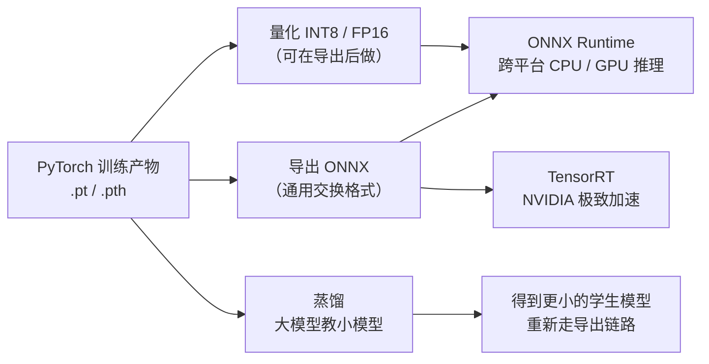
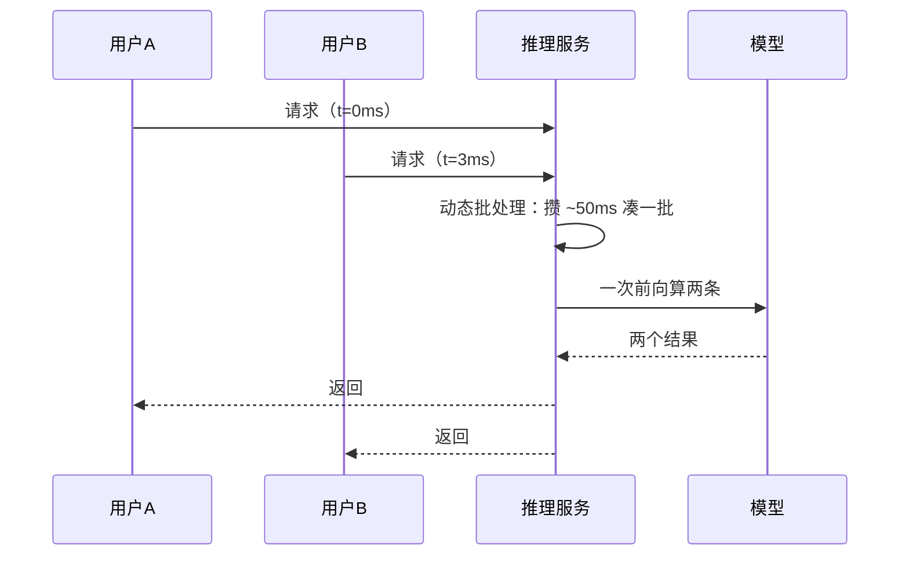

# 推理与部署

> **一句话理解**：训练是"运动员集训"，推理（Inference）是"比赛日"——部署解决的是怎么让训练好的模型变成一个**稳定、快速、便宜**的在线服务或离线流程，这一步的时间常占项目的一半。

[⬆️ 返回总目录](../../../README.md) · [⬆️ 返回本篇](../README.md) · [⬅️ 返回本章目录](./README.md)

| 属性 | 说明 |
|------|------|
| 难度 | ⭐⭐⭐（较难） |
| 所属分支 | 通用基础 |
| 前置知识 | [PyTorch快速上手](./03-PyTorch快速上手.md)；[分布式训练与模型规模](./04-分布式训练与模型规模.md) |

---

## 📌 这一节解决什么问题

实验室里 `model(x)` 一跑，准确率 95%，故事就结束了？生产环境紧接着会甩来一堆问题：用户请求一秒钟来 500 个怎么办？手机上没有 GPU、内存只有几百 MB 怎么办？老板说"接口响应必须 100 毫秒内"怎么办？

训练和推理对计算的要求几乎相反：训练要梯度、要大 batch、以"总耗时"论英雄；推理不要梯度、常常一次一条、以"单条延迟"和"整体吞吐"论英雄。理解这对矛盾，才能理解 ONNX、TensorRT、量化、蒸馏这些加速技术为什么长这样。

## 🌱 通俗理解

- **延迟（Latency）vs 吞吐（Throughput）**：延迟是**一位顾客从点单到上菜等多久**（单请求耗时）；吞吐是**这家店每小时能出多少道菜**（每秒能处理多少请求，QPS）。加桌子（并发）能提吞吐，但每位顾客的等待未必变短——两者不是一回事。
- **P99 延迟**：把所有请求的耗时排序，99% 的请求都快于这个数。看它而不看平均，是因为**平均值会撒谎**——100 个请求里 1 个卡了 5 秒，平均值几乎不动，但那 1 位用户已经卸载你的 App 了。
- **模型导出**：训练好的 PyTorch 模型像"Chef 的私房菜谱"，导出 ONNX 相当于译成**通用交换格式**——任何后厨（CPU、GPU、各种推理引擎）都能照着做；TensorRT 则是 NVIDIA 后厨的"特调版菜谱"，工序全部重排，快到极致。
- **量化（Quantization）**：把 32 位浮点数（FP32）压成 8 位整数（INT8）——像把无损音乐压成 MP3，体积小一档、速度提一截，音质略损但大多数人听不出来。
- **蒸馏（Distillation）**：让大模型当老师、小模型当学生，学生只学老师的"答题思路"（软标签），常常比自学（只看标准答案）成绩更好——大教小，小而精。

## 📋 举个例子

场景：评论情感分类模型上线，预算 P99 < 100ms。同一个模型，三种跑法（同一台 CPU 机器，经验参考量级）：

| 跑法 | 单条平均耗时（量级） | 说明 |
|------|---------------------|------|
| PyTorch 直接 `model(x)` | 基准 1× | 框架开销大：算子逐个解释执行，还要维护计算图那套"记账本"机制 |
| 导出 ONNX + ONNX Runtime | 约 0.2×~0.5×（**快 2~5 倍**） | 算子预先融合成图，专注前向计算，没有训练包袱 |
| ONNX + INT8 量化 | 在上一步基础上再提速、省内存 | 精度换速度，分类任务常见掉点在 1% 以内（需回测确认） |

⚠️ 以上为行业常见量级与经验参考，具体加速比取决于模型结构、序列长度与机器配置——正确姿势是**拿自己的模型实测**（下方代码就是计时模板）。结论：不换模型、不重训，仅靠"导出 + 推理引擎"就常能拿到数倍提速，这是性价比最高的一步。

## 🧠 核心原理

### 整体流程：从训练产物到加速服务



### 逐步拆解

**① 训练 vs 推理，差异在哪。**

| 维度 | 训练 | 推理 |
|------|------|------|
| 计算方向 | 前向 + 反向（要梯度） | 只前向（不建计算图） |
| batch | 大 batch 吃满 GPU | 常为 1 或动态凑批 |
| 关心指标 | 收敛速度、最终精度 | P99 延迟、QPS、单条成本 |
| 显存 | 权重+梯度+优化器态+激活 | 权重+少量激活（可用第 4 页的显存公式反推：约 2~4 字节/参数） |

**② 部署形态三选一。**

| 形态 | 典型场景 | 延迟要求 | 成本特征 |
|------|----------|----------|----------|
| 批量离线打分 | 每晚给百万商品重算排序分 | 不敏感（小时级） | 便宜：一次性跑完即释放资源 |
| 在线 API 服务 | 实时风控、搜索排序、对话 | 敏感（常 P99 < 100ms 级） | 贵：服务 7×24 常驻、要冗余 |
| 端侧边缘 | 手机相册分类、摄像头行人检测 | 敏感 + 离线可用 | 硬件受限：模型必须小（量化/蒸馏常客） |

**③ 服务化三要点**：**动态批处理**（攒几十毫秒把并发请求凑成一批再算，吞吐大幅提升）；**预热**（服务启动先跑几条假请求，避免第一波真实请求撞上冷启动的慢）；**监控**（QPS、P99 延迟、输出分布漂移，都是上线后每天要盯的仪表盘）。



**④ LLM 推理特殊在哪。** 生成式模型一次吐一个词，几百轮前向若每次都重算全部历史，慢到没法用——**KV Cache** 把历史 token 的中间结果缓存起来，每步只算新词；**continuous batching**（连续批处理）让长短不一的请求随时进随时出，GPU 不空转。这块展开见 [NLP 生产实战](../../4-专业方向/07-自然语言处理与LLM/99-生产实战.md)。

**⑤ 一个实用小公式**（Little 定律的直觉版）：

$$
\text{吞吐（QPS）} \approx \frac{\text{并发数}}{\text{平均延迟（秒）}}
$$

> 👉 **人话**：每位顾客平均等 0.1 秒、店里同时接待 10 桌，每小时能翻的台数自然就出来了。压测时拿它对照实测 QPS，偏差大说明瓶颈不在模型（多半在数据加载或序列化）。

<details>
<summary>🧮 展开看：量化为什么"通常"不掉多少点</summary>

FP32 用 32 位表示一个数，INT8 只用 8 位——直观感觉"精度暴跌"，但神经网络对权重扰动有天然鲁棒性：训练时它就在噪声梯度里摸爬滚打。量化做到"少掉点"的关键是**校准（Calibration）**：用几百条真实数据统计每层激活值的分布范围，让 8 位格子对齐数据真正密集的区间。做法上分训练后量化（PTQ，快）和量化感知训练（QAT，掉点更小但要重训）。经验参考：分类/检测任务 INT8 掉点常在 1% 以内；小模型或分布怪异的数据掉点会放大——所以**量化后必须回测指标**，这条写进流程，不要靠信仰。

</details>

## 💻 动手试试

```python
# 依赖：pip install torch onnx onnxruntime
import time
import numpy as np
import torch
import torch.nn as nn

torch.manual_seed(0)
model = nn.Sequential(
    nn.Linear(64, 128), nn.ReLU(),
    nn.Linear(128, 10),
)
model.eval()                                   # 导出前先切评估模式

# ---------- 第 1 步：导出 ONNX ----------
dummy = torch.randn(1, 64)                     # 导出需要一个样例输入来" tracing"
torch.onnx.export(
    model, dummy, "model.onnx",
    input_names=["input"], output_names=["logits"],
    dynamic_axes={"input": {0: "batch"}, "logits": {0: "batch"}},  # 批大小可变
)
# 注：较新版本 PyTorch 若提示 dynamo 相关告警，可加参数 dynamo=False 走经典导出

# ---------- 第 2 步：PyTorch 直接推理并计时 ----------
x = torch.randn(1, 64)
with torch.no_grad():                          # 推理不要梯度
    for _ in range(10):
        model(x)                               # 预热：首次运行包含各种初始化开销
    t0 = time.perf_counter()
    for _ in range(1000):
        model(x)
    t_torch = (time.perf_counter() - t0) / 1000

# ---------- 第 3 步：ONNX Runtime 推理并计时 ----------
import onnxruntime as ort
sess = ort.InferenceSession("model.onnx", providers=["CPUExecutionProvider"])
x_np = x.numpy()
for _ in range(10):
    sess.run(None, {"input": x_np})            # 预热
t0 = time.perf_counter()
for _ in range(1000):
    sess.run(None, {"input": x_np})
t_onnx = (time.perf_counter() - t0) / 1000

print(f"PyTorch   平均单次: {t_torch*1e3:.3f} ms")
print(f"ONNX Runtime 平均单次: {t_onnx*1e3:.3f} ms")
print(f"加速比: {t_torch/t_onnx:.1f}x")
# 典型量级：快 2~5 倍（经验参考；模型越小、机器越弱，差距往往越明显）
```

注意两个工程细节：**预热**（前几次调用含初始化开销，不预热测出来的是假数据）和 **no_grad**（推理不需要账本）。这两点分别对应"服务化要点"里的预热与"训练 vs 推理"差异。

## 🔥 炼丹小灶

> 🔥 **炼丹小灶**：部署优化的先后顺序（工业界常见做法）——
> - 配方：先测基线（P99 与 QPS 实测）→ 导出 ONNX 试跑 → 不够再上量化/TensorRT → 还不够才考虑换更小的模型或蒸馏；每一步都回测精度；
> - 玄学：加速 20% 改在数据加载（如预处理并行化）比改模型更常见地解决问题——先看瓶颈在哪再动手（profile 优先）；
> - ⚠️ 以上是经验参考值，不是圣旨；换场景请重新测。

## 🔗 在知识树中的位置

- **上游**：[PyTorch快速上手](./03-PyTorch快速上手.md)——导出的产物就是它训练出来的；[分布式训练与模型规模](./04-分布式训练与模型规模.md)——参数量决定推理显存/内存预算。
- **下游**：[生产实战](./99-生产实战.md)——部署环节放进完整项目生命里看；[NLP 生产实战](../../4-专业方向/07-自然语言处理与LLM/99-生产实战.md)与[视觉生产实战](../../4-专业方向/05-计算机视觉/99-生产实战.md)——两个方向各自的部署特有打法。
- **横向对比**：ONNX（通用、跨平台）vs TensorRT（NVIDIA 专属、极致性能）vs 原生框架直跑（零迁移成本、最慢）——按"要移植性还是要极致速度"选。

## ⚠️ 常见误区

- **误区一**：离线测得快，上线自然快 → 线上还有并发竞争、数据序列化、批处理策略，实测 P99 才算数。
- **误区二**：延迟和吞吐是一回事，提了吞吐延迟自然好 → 凑大批能提吞吐，但单条请求可能等得更久（被攒批）；两个指标要分别盯。
- **误区三**：量化必然大幅掉点 → 校准良好的 INT8 在分类/检测任务上掉点常在 1% 以内（经验参考），但必须回测确认，不能跳过。

## 📝 小结与自测

**要点回顾**

- 训练要梯度、推理只前向；推理关心的两个新指标：单请求 P99 延迟与整体吞吐 QPS；
- 三种部署形态：批量离线打分（便宜不赶时间）、在线 API（贵而快）、端侧边缘（模型必须小）；
- 加速四件套：ONNX 通用交换、TensorRT 极致加速、INT8/FP16 量化（精度换速度）、蒸馏（大教小）；
- 服务化要点：动态批处理、预热、监控；
- LLM 推理靠 KV Cache 和 continuous batching 续命，详见 NLP 生产实战页。

**自测一下**（点击展开答案）

<details>
<summary>问题 1：为什么上线指标常看 P99 延迟而不是平均延迟？</summary>

平均值会被大量快请求"稀释"少数慢请求：100 条里 99 条 10ms、1 条 2000ms，平均才 30ms 看着很健康，但每 100 个用户就有一个遭遇 2 秒卡顿。P99 表示 99% 的请求都快于该值，专抓"最差的那批用户体验"，是延迟预算（如 P99 < 100ms）的标准写法。

</details>

<details>
<summary>问题 2：部署前给模型做 INT8 量化，正确的流程是什么？</summary>

先用几百条真实数据做校准（让量化区间对齐真实分布），导出 INT8 模型后在**测试集上回测精度**，再压测 P99 延迟与 QPS——两者都达标才替换线上模型；任何一步不达标就退回 FP16 或原精度。跳过回测直接上线是典型事故来源。

</details>

## 📚 延伸阅读

- 工具：[ONNX 官网](https://onnx.ai) 与 [ONNX Runtime 文档](https://onnxruntime.ai)——本页代码的延伸
- 工具：NVIDIA TensorRT——NVIDIA 平台极致加速的事实标准
- 论文：Hinton, Vinyals & Dean, *Distilling the Knowledge in a Neural Network*（2015）——蒸馏开山之作
- 论文：Kwon et al., *Efficient Memory Management for LLM Serving with PagedAttention*（2023，vLLM）——continuous batching 的工业化代表

---

[⬅️ 上一页：分布式训练与模型规模](./04-分布式训练与模型规模.md) · [返回本章目录](./README.md) · [下一页：生产实战 ➡️](./99-生产实战.md)
