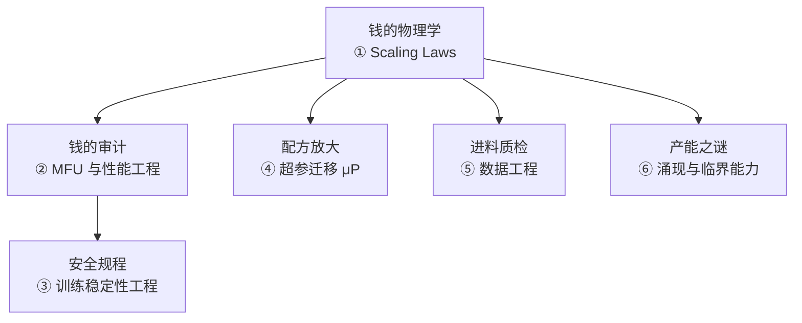
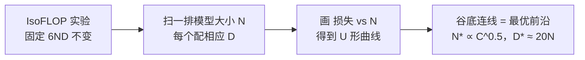
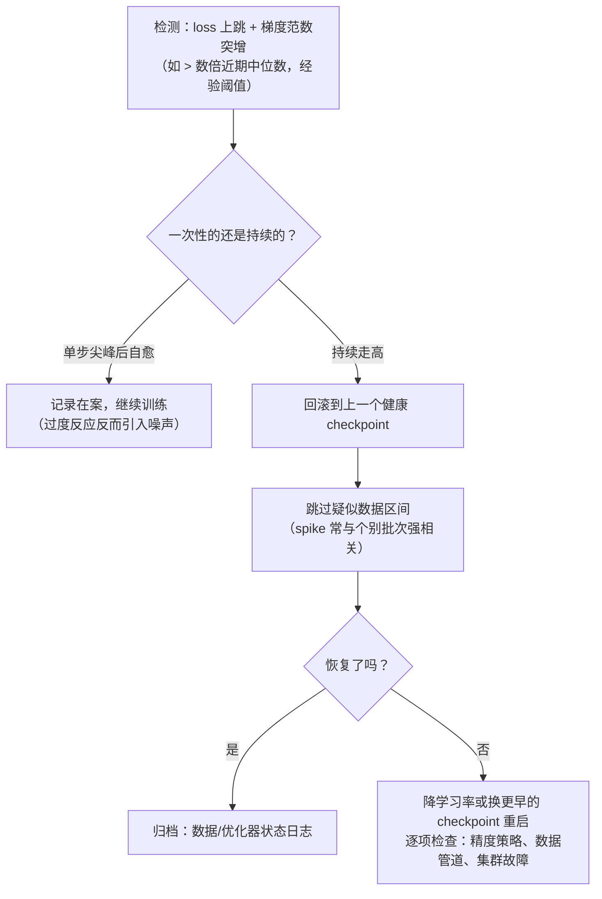
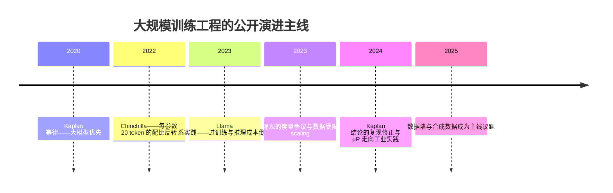

# 进阶专题：大规模训练工程

> **一句话理解**：前面五页解决"训得动"，本页解决"训得起、训得稳"——大模型预训练是一台烧钱机器，这一页讲的是**钱的物理学（Scaling Laws 与 MFU）、机器的安全规程（训练稳定性）、以及把小模型上炼出的配方安全放大到巨型模型的迁移理论（μP）**。

[⬆️ 返回总目录](../../../README.md) · [⬆️ 返回本篇](../README.md) · [⬅️ 返回本章目录](./README.md)

| 属性 | 说明 |
|------|------|
| 难度 | ⭐⭐⭐⭐（高阶） |
| 所属分支 | 通用基础 |
| 前置知识 | [训练一个模型的完整流程](./02-训练一个模型的完整流程.md)；[分布式训练与模型规模](./04-分布式训练与模型规模.md) |

---

## 📌 这一节解决什么问题

第 4 页算过账：7B 模型训 1T token ≈ 512 张 A100 跑一周。到了这个量级，工程问题换了一副面孔：

1. **预算怎么定？** 是训一个 70B 少喂数据，还是训一个 8B 多喂数据？——同样一笔算力，配比不同最终性能差得远。Scaling Laws（规模定律）就是回答"钱怎么花最值"的经验物理学。
2. **钱花了为什么还慢？** 买了 512 张卡，实测吞吐往往只有峰值算力的三四成——差的那部分去了哪、怎么抠回来？这是 MFU 与性能工程的问题。
3. **训到第 37 天 loss 突然炸了怎么办？** 大训练跑几周，一次 loss spike（损失尖峰）就可能废掉整次运行——回滚、跳数据、降学习率，处置是一门有体系的工程手艺。
4. **超参没法在大模型上搜索怎么办？** 网格扫一次学习率的成本等于烧掉几台服务器——μP（最大更新参数化）这类理论让"小模型扫参、公式放大"成为可能。

这四个问题加上数据工程与"涌现"之争，共同构成"大规模训练工程"的知识版图——它是第 7 章 [NLP 与大语言模型](../../4-专业方向/07-自然语言处理与LLM/README.md)所有预训练工作的地基。

## 🌱 通俗理解

把预训练大模型想成**开一家巨型工厂**：

- **Scaling Law = 产能规划**：预算固定时，"建多大的厂"与"进多少原料"有个最优配比。厂太大原料不够（参数多吃不饱）、原料太多厂太小（数据浪费在小学徒手里）——Chinchilla 就是那个说"每人配 20 斤原料"的规划师；
- **MFU = 油耗表**：仪表盘上"理论百公里油耗"和"实际油耗"的比值。油钱是真实支出，油耗高一个点，一年多烧几十万；
- **训练稳定性 = 安全生产规程**：大型装置跑几个月，偶发事故不可完全避免，重要的是**有预案**——出事时知道先按哪个按钮（回滚）、丢多少损失可以接受；
- **μP = 配方放大**：实验室里 100 毫升的配方，直接倒进 10 吨的反应釜会炸。μP 给出"哪些参数按什么比例放大"的换算表，让小试配方安全放大；
- **数据工程 = 进料质检**：原料里混着重复件（去重）、掺错比例（配比）、甚至混进了考题（污染检查）——产品指标全废。

## 📋 举个例子

**心算一题：1e23 FLOPs 的预算，该训多大的模型？** 用 Chinchilla 配比（每参数约 20 token）+ 第 4 页的 6ND 账本，心算三步：

| 步骤 | 计算 | 结果 |
|------|------|------|
| ① 写出约束 | C = 6ND，且 D = 20N（Chinchilla 配比） | — |
| ② 代入求解 | N = √(C/120) = √(1e23/120) | N ≈ 2.9e10 ≈ **29B 参数** |
| ③ 得到配比 | D = 20N | D ≈ **0.58T token（约 580B）** |

再看真实世界的公开数字（Llama 系技术报告）：7B 模型配 1T token，每参数约 **143 token**——是 Chinchilla 配比的 7 倍；Llama-3 的 8B 配 15T，每参数约 **1875 token**——近百倍。为什么行业集体"违抗"compute-optimal？答案在下方①的第三幕：**推理成本倒推**。这个例子说明 scaling law 不是教条，而是"知道自己在偏离什么、为什么偏离"的决策基准。

<details>
<summary>📊 展开完整算例：同一笔算力的三种花法（心算版）</summary>

设预算 C = 4.2e22 FLOPs（即第 4 页 7B/1T 的账单），比较三种配比（用 L(N,D) = E + A/N^α + B/D^β 的量级直觉即可，不必真算）：

1. **Chinchilla 最优**：N = √(C/120) ≈ 19B，D ≈ 0.37T token（约 370B）——理论上这钱花得"最值"；
2. **Kaplan 时代偏好**：更大的模型、更少的数据（按 Kaplan 的结论，最优模型比 Chinchilla 的大好几倍）——同一笔钱损失若干点性能；
3. **Llama 实践（过训练）**：小模型 + 远超配比的数据（7B 配 1T）——训练端不是最优，但**每次推理都便宜**，模型被调用几十亿次后总账大幅反超。

三者的分水岭只有一个问题：**这笔钱在训练端花，还是在推理端省？**

</details>

## 🧠 核心原理

### 整体流程：本页知识地图



### 逐步拆解

**① Scaling Laws：三幕剧。**

**第一幕（2020，Kaplan）**：OpenAI 的经典工作发现，语言模型损失随参数量 N、数据量 D、算力 C 呈**平滑幂律**：

$$
L(C) \propto C^{-\alpha_C},\quad \alpha_C \approx 0.05\quad(\text{论文拟合值，量级参考})
$$

> 👉 **人话**：算力每翻 10 倍，损失只降一点点（10^0.05 ≈ 1.12 倍量级）——进步贵得稳定、可预测。工程上最重要的推论是：**给定算力，该训一个"偏大的模型、且训到半路"**（大模型优先），因为小模型有不可逾越的损失下限。

**第二幕（2022，Chinchilla）**：DeepMind 用三种独立方法（固定模型尺寸扫数据量 / IsoFLOP 曲线 / 参数化损失函数拟合）重新做实验，结论反转：

$$
L(N, D) = E + \frac{A}{N^{\alpha}} + \frac{B}{D^{\beta}},\qquad \alpha \approx 0.34,\ \beta \approx 0.28\ (\text{论文拟合值})
$$

> 👉 **人话**：损失 = 不可约底噪 E（语言本身的熵）+ "模型太小"的罚分 + "数据太少"的罚分。两边的罚分平衡时，最优配比是 **D/N ≈ 20 token/参数**——同样算力下，"小模型喂饱"胜过"大模型挨饿"（Chinchilla 70B/1.4T 用与 Gopher 280B/0.3T 相当的算力取得了更好的效果）。

**IsoFLOP 曲线的直觉**（第二幕的核心实验方法）：把总算力固定为 C = 6ND（第 4 页的账本），训练一排不同大小的模型——每换一个 N，就相应调整 D 让 6ND 不变。把"损失 vs N"画出来是一条 **U 形曲线**：左边是"模型太小数据浪费"，右边是"模型太大学不动"，谷底就是这笔算力的最优 N。把不同算力级别的谷底连起来，就是 compute-optimal 前沿（N* ∝ C^0.5，参数与数据同步等比增长）。



**第三幕（2023 起，Llama 系实践）**：行业公开数字显示，主流模型的数据配比远超 20 token/参数（7B 配 1T ≈ 143，Llama-3 8B 配 15T ≈ 1875）。动机是**推理成本倒推**：模型上线后要被调用几十亿次，把参数做小、训练时多喂数据，训练端虽非最优，推理端每次调用都便宜——**总拥有成本（训练 + 海量推理）最优**。这被称为"过训练（over-training）"策略。配套的公开研究结论（量级参考）：同一份数据重复使用，头几个 epoch 内损失接近全新数据、之后收益快速衰减——所以"多喂"仍要以新数据为主。

**三幕对比，一张表看清分歧点：**

| 维度 | Kaplan（2020） | Chinchilla（2022） | Llama 实践（2023 起） |
|------|----------------|--------------------|------------------------|
| 最优配比（token/参数） | 远大于 20（模型偏大） | ≈ 20 | 上百到上千（模型偏小、数据偏多） |
| 优化目标 | 训练损失 / 训练算力 | 训练损失 / 训练算力 | **总拥有成本**（训练 + 海量推理） |
| 实验方法 | 幂律拟合（后被指出超参未随尺寸重调） | IsoFLOP 曲线 + 参数化拟合（双验证） | 工程决策 + 事后验证 |
| 一句话 | "把厂建大" | "把料喂够" | "厂建小一点，省下的钱付电费（推理）" |

<details>
<summary>🧮 展开看：从 compute-optimal 到 inference-optimal 的总账公式</summary>

Chinchilla 只优化训练端。把推理端也算进来，目标函数变成：

$$
\text{总成本} \approx \underbrace{6ND}_{\text{训练一次}} + Q \times \underbrace{2N L_{\text{avg}}}_{\text{每次查询}}\quad(Q=\text{累计调用量}，\ L_{\text{avg}}=\text{平均序列长度})
$$

> 👉 **人话**：左边是造车的钱（训一次），右边是油钱乘以总里程（每次调用都按参数量付费）。里程 Q 小（内部工具、低频服务），造大车不亏——接近 Chinchilla 配比；里程 Q 大（面向海量用户的通用模型），小车省油的优势会碾压训练端的一次性差异。

量级感受（经验参考）：8B 与 70B 相比，单次推理的计算量约为 1/9；当累计调用量达到训练 token 量的成千上万倍时（线上模型常态），推理端在总账里占据绝对主导——这就是"每参数几千 token"在总账意义上依然理性的来源。第 5 页的"每百万 token 成本"公式，算的正是这个右端项。

</details>

**实验方法论与陷阱**：scaling law 的标准做法是"**小模型拟合、外推大模型**"——在 1e18~1e21 FLOPs 量级扫几十个小模型，拟合幂律参数，外推到 1e23+。两个已知陷阱：① **超参未随尺寸重调**会系统性扭曲曲线（2024 年的复现研究指出，Kaplan 的部分结论高估了"大模型优先"的程度，原因之一正是没有对每个模型单独调优学习率调度——小模型的最优超参直接套在大模型上会偏悲观）；② 幂律只在**同架构族、同数据分布、同 tokenizer** 内有效——换了架构（如 MoE、SSM 类）要重新拟合，外推尤其要谨慎。

<details>
<summary>🧮 展开看：读 scaling law 图的三个习惯</summary>

1. **先看坐标轴是不是双对数**——幂律在双对数坐标下才是直线，斜率就是那个指数 α；线性坐标下画出的"陡增/平台"感常是视觉假象；
2. **看外推的距离**——拟合数据点到预测点隔几个数量级？隔一个数量级的预测可信，隔两三个数量级就只剩"趋势"意义（这正是 2024 年复现之争的战场：拟合细节能在远处放大成结论反转）；
3. **看损失口径**——token 级交叉熵怎么算：去不去掉 prompt 前若干 token、用什么 tokenizer、是否平滑？不同论文的"loss"数值不直接可比——跨论文对比曲线前先对齐口径。

</details>

**② MFU 与性能工程：钱花哪了。**

第 4 页用过"真实利用率 45%"——这里给出它的正式定义。MFU（Model FLOPs Utilization，模型算力利用率）：

$$
\mathrm{MFU} = \frac{\text{实际完成的前向+反向 FLOPs}}{\text{卡数} \times \text{时间} \times \text{峰值算力}}
$$

> 👉 **人话**：你付了 512 张卡的全款，MFU 告诉你实际吃到了几折。稠密 Transformer 预训练的公开常见区间在 **35%~50%**（经验参考）；MFU 每提升 10 个百分点，等价于预算省 10%——这是性能工程的全部商业逻辑。

实算一遍（复用第 4 页的数字）：7B × 1T token → 4.2e22 FLOPs；512 张 A100（峰值 312 TFLOPS）跑 7 天 = 512 × 7×86400 × 312e12 ≈ 9.66e22 峰值 FLOPs → **MFU ≈ 43%**。（另有 HFU 口径，把激活重计算的 FLOPs 也计入分母口径差异——对比 MFU 时先对齐口径。）

**Roofline 模型（屋顶线模型）直觉**：一张卡的性能上限被两条线卡住，取小者：

$$
\text{每秒 FLOPs 上限} = \min\big(\text{峰值算力},\ \text{显存带宽} \times \text{算术强度}\big)
$$

> 👉 **人话**：算术强度 = 每读一字节显存做多少次浮点运算。强度高 → 算力是瓶颈（屋顶平顶那段）；强度低 → 带宽是瓶颈（上坡那段），算力再强也在等数据。A100 的"屋脊点"约在 150 FLOP/字节（312 TFLOPS ÷ 2 TB/s）——而 LLM **解码阶段每 token 算术强度只有约 1**（每个权重读出来只用一次），这就是第 5 页"decode 是访存受限、批处理能救"的物理学根源；训练阶段（大 batch 前向反向）强度高，主要在屋顶平顶段，优化方向变成算子融合与通信。


**用 roofline 复算第 5 页的结论**——解码批大小为 B 时，权重被 B 条请求分摊，算术强度从 1 变为 B：

| 解码批大小 B | 算术强度 | 理论可达峰值占比（A100，屋脊点≈153） | 处境 |
|--------------|----------|--------------------------------------|------|
| 1 | 1 | ≈ 0.7% | 极度访存受限：算力大量闲置 |
| 16 | 16 | ≈ 10% | 仍受限：加批继续回本 |
| 64 | 64 | ≈ 42% | 逼近屋脊：收益开始放缓 |
| ≥153 | ≥153 | 100%（转入算力受限） | 再加批只涨延迟不涨吞吐 |

> 👉 **人话**：这张表就是第 5 页"批处理收益曲线有拐点"的物理学来源——拐点位置 ≈ 屋脊点对应的批大小。量化的作用是同类操作的另一头：把"每个数据的字节"减半，等于同一带宽多送一倍有效数。优化手段千千万，roofline 一张图看穿它们各自在挪哪个量。

<details>
<summary>🧮 展开看：A100 屋脊点怎么算 + MFU 实算的三个坑</summary>

**屋脊点**：峰值算力 312 TFLOPS（BF16 稠密）÷ 显存带宽 2039 GB/s ≈ **153 FLOP/字节**。算术强度低于它，性能 = 带宽 × 强度（上坡段）；高于它，性能 = 峰值（平顶段）。

**MFU 实算的三个坑**：① **口径**——分子用不含激活重计算的 6ND（MFU 口径）还是含重计算的实际执行 FLOPs（HFU 口径），后者天然更高，对比论文数字前先对齐口径；② **峰值表**——312 是 A100 的 BF16 稠密峰值，稀疏模式、FP8 各有自己的峰值，分母抄错直接差一倍；③ **计时窗口**——含数据加载与 checkpoint 时间的 MFU，和纯训练循环的 MFU 不可比——报数前写清楚时间窗从哪到哪。

</details>

**通信-计算重叠（overlap）的三种手段**——把第 4 页"通信税"藏进计算里：

| 手段 | 做法 | 典型实现 |
|------|------|----------|
| ① 分桶交错 | 把通信切成桶，算好一批就发起一批，与剩余计算流水执行 | DDP 的梯度桶（第 4 页⑤） |
| ② 独立通信流 | 计算和通信跑在不同的硬件流上，用事件同步——SM 在算、网卡在传，互不等待 | CUDA stream + event，FSDP 的通信即走独立流 |
| ③ 预取与重组 | 提前对"未来几层要用的参数"发起 all-gather（预取）；或改用 reduce-scatter+all-gather 的分解方式，让通信时机可排程 | FSDP/ZeRO-3 的参数预取、1F1B 调度 |

> 👉 **人话**：①是"把大任务切碎穿插做"，②是"左右手同时干活"，③是"提前把下道工序的料备好"。三者常叠加使用——大规模训练里通信不可能消除，只能藏。

**③ 训练稳定性工程：loss spike 的体系化处置。**

跑几周的训练，loss 突然跳升一个量级再缓慢恢复（甚至不恢复）——loss spike 是大训练的常态而非意外。体系化处置是一棵决策树：



**处置动作菜单（按代价从低到高）**：

| 动作 | 代价 | 何时用 |
|------|------|--------|
| 记录在案、继续训练 | 零 | 单步尖峰后自愈（多数情况） |
| 跳过疑似数据批次 | 数据分布微改 | 与回滚配套的常规组合拳 |
| 回滚到健康 checkpoint | 损失数小时训练进度 | 持续走高、梯度范数持续异常 |
| 降学习率重启 | 改变训练轨迹，实验对比要打标记 | 回滚 + 跳数据后仍复发 |
| 停机全量诊断 | 停机成本最高 | 反复复发，怀疑精度 bug / 数据管道 / 集群故障 |

三条经验（均标注经验参考）：**先回滚再归因**——几万卡时停在原地 debug 的机会成本太高；**跳数据是常规操作**——公开实践里"回滚 + 跳过若干批次"是标准姿势，不需要把每块坏数据都查清楚；**降 lr 重启是重武器**——它改变了训练轨迹，之后所有实验对比都要打上标记。

**bf16 与 fp32 的分工**——为什么"混合精度"不是"全用低精度"。哪些东西必须留在 FP32：

| 部件 | 精度 | 为什么 |
|------|------|--------|
| 优化器状态（Adam 的 m、v） | FP32 | 动量是长期统计量，7~8 位有效数字的 BF16 会把有用的历史抹平 |
| **主权重（master weights）** | FP32 | 见下方算例——BF16 下小更新会被"吞掉" |
| 梯度归约/累加 | FP32（或 BF16 传输 + FP32 累加） | 跨卡求平均、跨 micro-batch 累积都是长求和，精度损失会累积 |
| LayerNorm 的均值/方差统计 | FP32 | 方差计算对舍入误差敏感 |
| 前向/反向的矩阵乘、激活 | BF16 | 算子吞吐高、显存省，深度学习对范围比对精度敏感（第 4 页⑫） |

主权重为什么必须 FP32，一个算例看懂：权重约 0.01 量级时，BF16（7 位尾数）的分辨率约 0.01 × 2⁻⁷ ≈ **8e-5**；而一次 AdamW 更新量常在 1e-6~1e-5 量级——**比分辨率还小，加上去直接被舍掉**，这个参数永远不动。FP32 主权重 + BF16 计算（用时降精度、更新时回 FP32 累加）是标准解法。

**梯度范数监控的阈值经验**：裁剪默认值 1.0（全模型 L2 范数，经验参考）；监控看"当前值 / 近期滑动中位数"的倍数而非绝对值（训练各阶段基线漂移大）；warmup 结束处和 lr 衰减末段的范数抬升属正常现象，不要误报。健康曲线的特征是：范数随 loss 下降缓慢走低、无同步跳变。判读速查：

| 观察对象 | 健康形态 | 异常形态 | 常见归因与动作 |
|----------|----------|----------|----------------|
| 梯度范数（对数轴） | 随 loss 缓慢走低、无跳变 | 单步尖刺后回落 | 个别数据批次异常 → 记录 + 跳过 |
| loss 与范数联动 | 同向缓变 | loss 跳升但范数纹丝不动 | 先查数值口径/日志 bug，再怀疑数据 |
| 范数走势 | 平稳 | 连续数百步持续抬升 | lr 偏大或数据分布漂移 → 降 lr / 查管道 |
| 更新/权重比 $\eta\lVert g\rVert/\lVert w\rVert$ | 平稳的小比例（1e-3~1e-2 量级，经验参考） | 突然放大 | warmup 设置或优化器状态异常（μP 实践里也拿它做跨规模不变性的体检指标） |

**④ 超参迁移理论：μP（最大更新参数化）。**

问题：大模型上扫超参等于烧钱。μP（Maximal Update Parametrization，最大更新参数化，Yang & Hu 的 Tensor Programs 系列工作）的思路：给"初始化方差 × 学习率 × 宽度"选定一套联动缩放规则，使得**训练一步引起的函数变化量与网络宽度无关**——于是宽度不同（其他相同）的模型训练动力学相似，**最优超参也相似**。

$$
\eta_{\text{hidden}} \propto \frac{1}{\text{宽度}}\quad(\text{隐藏层权重的学习率按宽度反比缩放，输出层另有规则})
$$

> 👉 **人话**：标准参数化下，把网络加宽，每步更新会被"自己放大"，最优学习率跟着变——所以小模型扫出的 lr 不能直接搬。μP 像给每个宽度都装了"变速箱"，让不同宽度的车踩同样深的油门跑出同样的加速度；于是 1B 上扫好的超参可以近乎零成本迁到 70B（muTransfer，零样本超参迁移）。

**width vs depth 的调参不变性**：为什么 μP 主攻宽度？因为标准参数化（He/Kaiming 系）在**深度方向已经近似不变**——第 1 页讲过，方差守恒逐层成立，加深不改变每层的梯度尺度；而宽度通过"矩阵乘的求和维度"与梯度尺度耦合，才是非平凡的来源。工程现状（经验参考）：多个团队公开报告用"μP 化的小模型代理"为大模型扫超参，显著降低搜索成本；它没有改变"AdamW + 余弦调度"的默认地位，改变的是**搜索在哪里进行**。

标准参数化与 μP 的对照：

| 对比项 | 标准参数化 | μP |
|--------|-----------|-----|
| 宽度加倍后的最优 lr | 明显漂移（梯度尺度被求和维度放大） | 基本不变（这就是设计目标） |
| 小模型超参能否迁移 | 不能直接搬 | 按缩放规则近似迁移（muTransfer） |
| 实现成本 | 零（框架默认） | 要改初始化方差与各层学习率的宽度缩放，输出层另守一套规则 |
| 适用场景 | 只训一个规模 | 要跨规模扫参、用小代理替大模型时 |

<details>
<summary>🧮 展开看：一次 μP 式迁移实验的实操步骤</summary>

1. 把目标架构按 μP 规则参数化（初始化方差与各层学习率的宽度缩放、输出层单独规则）；
2. 在小宽度代理上做学习率/初始化网格搜索——预算只有目标模型的几百分之一；
3. 把最优超参按规则原样搬到目标宽度（零样本迁移），只在目标模型上跑极短验证（几个 checkpoint 落点确认无发散）；
4. 留一个对照组：把小模型在**标准参数化**下的最优 lr 直接搬到大模型——通常会发散或明显次优，这个对照就是迁移价值的直接证据（公开工作报告的做法，经验参考）。

边界条件：代理模型与目标模型必须**同架构、同数据管线、同 tokenizer**——任何一处不同步，迁移误差都会放大；有限宽度（尤其深而不宽的模型）下不变性只是近似成立，关键决策仍要中等规模模型复核。

</details>

**⑤ 数据工程：进料质检。**

- **去重**：网页语料天然大量重复，重复数据让模型"背题"而非"学规律"。主流方案一句话：**MinHash + 局部敏感哈希（LSH）**——把文档压成一组指纹签名、相似文档自动落进同一个桶，按桶清除。去重是性价比最高的数据操作之一（公开研究普遍报告去重改善下游指标，量级随语料而异）。
- **配比实验**：预训练语料是"网页 + 代码 + 书籍 + 论文……"的混合汤，各源比例是重要超参。做法仍是 scaling law 的老手艺：**小模型 + 短训练做 A/B**，把配比实验廉价化；也有自动搜索配比的方法路线（把"每源权重"当学习对象），工业界仍是"小模型人工扫 + 经验"为主（经验参考）。产出长这样（**示意结构，非任何具体模型的配方**）：

| 语料源 | 基线配比 | 实验组 A | 读法（示意） |
|--------|----------|----------|--------------|
| 网页 | 70% | 60% | 腾出来的份额给代码 |
| 代码 | 10% | 20% | 加代码常顺带抬推理类基准（公开研究常见报告） |
| 书籍 / 论文 / 对话等 | 20% | 20% | 不动的对照组 |
| 判读 | — | 下游基准矩阵逐项对比 | 提升集中在哪类任务，决定下一步往哪倾斜 |
- **污染检查（contamination check）与防泄漏**：评测集的答案混进训练数据 = 考前泄题，指标全部作废。两道防线：**n-gram 重叠检测**（常用 8~13 元组滑动窗口比对训练语料与评测集，命中即剔除，量级参考）；**时间切分**（训练数据只用评测集发布之前抓取的语料）。难点是"变体泄漏"——题目被改写、翻译后 n-gram 抓不住，所以头部团队还会做语义级检查（经验参考）。

**⑥ 涌现与临界能力：度量之争。**

涌现能力（emergent abilities）：小模型上接近随机、规模过某个临界点后性能陡增的能力（上下文学习、多步推理类任务上最常被引用）。争论的焦点是：**陡增是真的能力相变，还是度量方式的假象？** 反方论点（2023 年提出，Schaeffer et al.）：许多"涌现"出现在**非线性度量**上——比如"精确匹配全对才得分"的指标下，底层的对数似然其实在平滑改善，只是指标把连续进步折叠成了 0/1 门槛，看起来就像突变；换连续度量后曲线变平滑。

$$
\text{精确匹配得分} = \mathbb{1}\big[\text{所有 token 全对}\big]\quad\text{vs}\quad\text{对数似然}=\sum_i \log p(x_i)
$$

> 👉 **人话**：一个学生从 60 分稳步涨到 99 分，但考试规则是"满分才算过"——在"通过率"这条曲线上，他是在最后一夜突然"涌现"的。度量选择改变了故事的形状。

争论双方各自最强的一张牌：

| 立场 | 核心论点 | 自身弱点 |
|------|----------|----------|
| 涌现真实存在 | 某些能力在小模型上几乎为零、跨过规模阈值后跳升；下游任务的"可用性"确有质变 | 阈值随提示词/few-shot 设置漂移，不像物理相变那样有稳定临界点 |
| 度度假象 | 非线性指标把平滑的对数似然进步折叠成 0/1 突变；换连续度量后曲线变平滑 | "度量平滑"不自动等于"没有相变"——平滑化也可能只是掩盖了机制层面的真实跃迁 |

这个争论未决（见开放问题），但它已经改变了工程实践：报告新能力时倾向**同时给连续度量**，避免被指标制造幻觉。涌现与能力的进一步展开见第 7 章[大语言模型 LLM 全景](../../4-专业方向/07-自然语言处理与LLM/04-大语言模型LLM全景.md)；新架构与前沿方向的追踪见第 12 章[前沿技术地图](../../5-前沿与融合/12-生成模型与多模态/05-前沿技术地图.md)。

## 💻 动手试试

```python
# 依赖：pip install numpy
import numpy as np

# ---------- 1. Chinchilla 配比计算器：这笔算力该怎么花 ----------
def chinchilla_plan(compute_flops):
    # 约束：C = 6*N*D 且 D = 20*N（compute-optimal 配比，每参数 20 token）
    N = np.sqrt(compute_flops / (6 * 20))   # 解出 N
    return N, 20 * N                        # 返回 (参数量, token 数)

for C in [1e21, 4.2e22, 1e23, 1e25]:
    N, D = chinchilla_plan(C)
    print(f"算力 {C:.0e} FLOPs → 最优 {N/1e9:6.1f}B 参数 × {D/1e12:6.2f}T token")
# 预期输出（量级）：
#   1e21  →    2.9B ×  0.06T        4.2e22 →  18.7B ×  0.37T
#   1e23  →   28.9B ×  0.58T        1e25   → 288.7B ×  5.77T
# 对照公开实践：Llama-1 7B 配 1T（≈143 token/参数）、Llama-3 8B 配 15T（≈1875）——
# 远超 20 的配比，属"推理成本倒推"的过训练（①第三幕）

# ---------- 2. MFU 计算器：这次训练吃到了几折算力 ----------
def mfu(params, tokens, n_gpu, days, peak_tflops=312):
    achieved = 6 * params * tokens                          # 实际完成的 FLOPs（6ND）
    peak = n_gpu * days * 86400 * peak_tflops * 1e12        # 付了款的峰值 FLOPs
    return achieved / peak

print(f"7B×1T on 512×A100×7天: MFU = {mfu(7e9, 1e12, 512, 7):.1%}")   # 预期 ≈ 43.5%
print(f"同上但跑 10 天:        MFU = {mfu(7e9, 1e12, 512, 10):.1%}")  # 预期 ≈ 30.4%（拖慢=浪费）

# ---------- 3. 幂律的"贵"有多贵：算力翻 10 倍损失降多少 ----------
alpha_C = 0.05                                    # Kaplan 拟合值（量级参考）
for x in [10, 100, 1000]:
    loss_gain = 1 - x ** (-alpha_C)               # 损失相对下降
    print(f"算力 ×{x:>4} → 损失只降约 {loss_gain:.1%}")
# 预期：×10 → 10.9%，×100 → 20.6%，×1000 → 29.2%
# 这就是 scaling law 的"涨价曲线"：每翻十倍，新增收益递减
```

**改什么参数、看什么变化**：① 把 `chinchilla_plan` 里配比 20 改成 5 和 100，看最优参数量怎么变——体会"配比决定钱的去向"；② 把 `mfu` 的 days 从 7 改成 5（假设靠重叠优化提速），看 MFU 变化——"性能工程 = 直接改钱"；③ 把 `alpha_C` 改成 0.1，看收益曲线怎么陡峭化——体会"指数数字的敏感性"（这也是为什么拟合外推要谨慎）。

```python
# ---------- 4. IsoFLOP 思想的最小演示（合成数据，秒级跑完） ----------
# 真实 IsoFLOP 实验扫几十个真模型；这里用合成幂律复现"U 形曲线"的形状直觉
def loss(N, C=1e21, E=1.69, A=406.4, alpha=0.34, B=410.7, beta=0.28):
    D = C / (6 * N)                        # IsoFLOP：固定 C，N 变大则 D 变小
    return E + A / N**alpha + B / D**beta  # Chinchilla 参数化损失（论文拟合值）

Ns = np.logspace(8.5, 10.5, 41)            # 0.3B ~ 32B 扫一排模型
Ls = [loss(n) for n in Ns]
best = Ns[int(np.argmin(Ls))]
print(f"U 形谷底在 N ≈ {best:.1e}（{best/1e9:.1f}B）—— 偏小则数据浪费，偏大则学不动")
# 预期：C=1e21 时谷底在 1~3B 量级，与第 1 段 chinchilla_plan(1e21) 的 2.9B 同量级。
# 两种方法（配比法则 vs 参数化拟合）不必精确一致——"每参数 20 token"是量级共识，不是精确常数
```

```python
# ---------- 5. roofline 计算器：你的负载卡在算力还是带宽 ----------
def roofline_bound(arithmetic_intensity, peak_tflops=312, bandwidth_tbps=2.039):
    peak = peak_tflops * 1e12                     # 峰值算力 FLOPS
    bw = bandwidth_tbps * 1e12                    # 显存带宽 字节/秒
    ridge = peak / bw                             # 屋脊点（FLOP/字节）
    achievable = min(peak, bw * arithmetic_intensity)
    kind = "算力受限" if arithmetic_intensity >= ridge else "访存受限"
    return achievable / peak, kind, ridge

for B in [1, 16, 64, 128]:
    frac, kind, ridge = roofline_bound(B)         # 解码批大小 B ≈ 算术强度（权重被 B 条请求分摊）
    print(f"解码批大小 {B:>3} → 理论可达峰值 {frac:6.1%}（{kind}，屋脊点 ≈ {ridge:.0f}）")
# 预期：1 → 0.7% 访存受限；16 → 10% 访存受限；64 → 42% 访存受限；128 → 83% 逼近屋脊
# 改什么看什么：把 peak_tflops 与 bandwidth_tbps 同时换成 H100 量级（989, 3.35）——
# 屋脊点抬高到 ≈295，同样的批大小"可达占比"反而降到 ≈22%：
# 算力比带宽涨得更快的卡，越需要更大的批才喂得饱（换卡 ≠ 免费提速，这是第 5 页拐点随硬件漂移的原因）
```

## 🔥 炼丹小灶

> 🔥 **炼丹小灶**：大模型预训练的起点配方（Llama 系公开报告量级，经验参考）——
> - 优化器：AdamW（β₁=0.9、β₂=0.95，LLM 惯用比默认 0.999 更小的 β₂——二阶矩对突发梯度更敏感）、权重衰减 0.1 量级；
> - 学习率：峰值 1e-4~3e-4（随模型变大取小），warmup 数千步，余弦衰减到峰值的约 10%；
> - 稳定性：梯度裁剪 1.0；BF16 计算 + FP32 主权重/优化器态（③的分工表）；
> - 玄学：spike 后"回滚 + 跳数据"优先于"改超参重启"；改过 lr 轨迹的 run 不要与之前的 run 直接对比——这是论文级正确、实验级灾难的典型坑；
> - ⚠️ 以上是经验参考值，不是圣旨；换架构/数据请重新炼（并先重跑小模型 scaling 实验）。

## 🔗 在知识树中的位置

- **上游**：[训练一个模型的完整流程](./02-训练一个模型的完整流程.md)——优化器与调度的所有概念在本页被"规模化"；[分布式训练与模型规模](./04-分布式训练与模型规模.md)——6ND、显存账本、ZeRO/重叠是本页的直接地基；[推理与部署](./05-推理与部署.md)——roofline 与 decode 访存受限的解释在本页②闭环。
- **下游**：[生产实战](./99-生产实战.md)——把本页的算力账本放进真实项目；第 7 章[大语言模型 LLM 全景](../../4-专业方向/07-自然语言处理与LLM/04-大语言模型LLM全景.md)、[微调与对齐](../../4-专业方向/07-自然语言处理与LLM/05-微调与对齐.md)——预训练与微调的全部工程细节；第 12 章[前沿技术地图](../../5-前沿与融合/12-生成模型与多模态/05-前沿技术地图.md)——scaling 之墙与下一代架构的前沿追踪。
- **横向对比**：第 2 页的"调参"在单卡尺度靠耐心，在大模型尺度靠本页的 μP 与小模型代理——同一件事的两个预算档位。

## 🎓 深度视角

本页内容的**真实取舍**：scaling law 是"经验物理学"而不是定律——它是特定架构族、特定数据分布、特定 tokenizer 下的拟合曲线，置信度来自多个团队的独立复现，适用边界由"换族即失效"划定。用它做预算规划（量级判断）非常可靠，用它做精确预测（小数点后两位）则是自欺。

三个深问深答（研究生资格考试 / 高级面试级别）：

**深问一：为什么"性能工程"（MFU 提升）常被排在"算法创新"前面？**

答：算一笔账就懂：MFU 从 40% 提到 44%，等价于同一预算多训 10% 的 token——按幂律折算成确定的能力增益；而一个"有望提升 10%"的算法想法，验证成本是一次完整训练，且失败率不低。**系统改进是复利、可迁移、可积累的；算法改进是高风险、单点押注**。这不是轻视算法，而是风险组合管理——工业实验室两者都做，但基础建设的优先级由期望值决定。

**深问二：Chinchilla 的 20 token/参数，Llama 的上百 token/参数——谁"对"？**

答：都对，因为**目标函数不同**。Chinchilla 优化的是"单次训练损失/算力"，Llama 优化的是"总拥有成本/终身收益"。当推理调用量是训练 token 数的成千上万倍时，把参数压小、训练多花的钱会在推理端连本带利收回（第 5 页的成本公式算的就是这个分母）。方法论教训：**"最优"永远是某个显式目标函数的最优——先问优化什么，再问结论对不对**。推论：调用量小的专用模型（只服务内部）反而更接近 Chinchilla 配比。

**深问三：μP 这类超参迁移理论，为什么没有取代"在大模型上微调超参"？**

答：三个现实约束：① μP 的不变性在**无限宽极限**下严格成立，有限宽度（尤其深且不宽的模型）有偏差；② 迁移的前提是"小代理与目标模型同架构同数据管线"，任何一处不同步都会引入误差；③ 大团队往往有历史配方与基础设施惯性，切换参数化要重跑全部对照。所以现状是混合：**粗超参（lr、wd）用迁移定初值，关键决策（lr 调度形状、warmup 长度）仍用中等规模模型验证**（经验参考）。理论与工程之间永远隔着"最后一公里"。

## 🔬 SOTA 演进（2023–2026）



| 时间 | 工作 | 改进点 | 代价 | 适用边界 |
|------|------|--------|------|----------|
| 2020 | Kaplan scaling laws | 损失-算力幂律，可预测预算产出 | 拟合偏差（后续被指出高估大模型优先） | 同架构族内量级预测 |
| 2022 | Chinchilla | compute-optimal 配比 D/N≈20 | 结论只对"训练端最优"负责 | 预算规划基准 |
| 2023 | Llama 系（过训练实践） | 推理成本倒推配比，小模型长训 | 训练端非最优、周期拉长 | 高调用量模型 |
| 2023 | 数据受限 scaling（重复数据研究） | 重复 epoch 的边际收益递减规律（头几个 epoch 接近新数据） | 合成/重复数据的上限未知 | 数据墙逼近时的规划 |
| 2023 | 涌现度量争议 | 连续度量下"相变"多为平滑曲线 | 未终局：能力是否存在真临界点仍开放 | 评测设计与能力宣传的纠偏 |
| 2024 | Chinchilla 复现修正 + μP 工业化 | 修正 Kaplan 时代偏差；小模型代理调参成为公开实践 | 迁移误差与管线一致性成本 | 新架构需重拟合 |

主线一句话：**从"怎么训得最优"（Kaplan/Chinchilla 的纯训练视角）走到"怎么拥有得最优"（过训练、数据质量、推理成本联动的系统工程视角）**——这也是本页存在于"深度学习基础"章而非某个方向章的理由：它已经是所有方向共享的底层经济学。

## ❓ 开放问题

1. **Scaling 会不会撞墙？** 三面墙各撞各的：**数据墙**——高质量公开文本的存量对按当前速度的消耗而言是有限多年的（多项公开估计为"数年"量级，经验参考），合成数据能否接棒尚无定论；**算力墙**——能耗与资本开支的指数增长不可持续，但"墙"更可能是经济学形状而非物理学形状；**文本墙**——语言数据只是一种智能来源，多模态与交互数据的 scaling 行为还缺一条 Chinchilla 级别的定律。为什么难：三个问题都无法用隔离实验回答——数据、算力、能力是耦合变量。
2. **什么是"下一代架构"？** 注意力的 O(n²) 成本与 Decode 的访存瓶颈（第 5 页深问一）持续推动替代搜索（SSM/线性注意力类、稀疏激活/MoE 化），但"架构优势常在规模化后才显现、小规模实验信号弱"——验证成本本身就是创新瓶颈。追踪入口：第 12 章[前沿技术地图](../../5-前沿与融合/12-生成模型与多模态/05-前沿技术地图.md)。
3. **涌现是真实相变还是度量假象？** 为什么难：要回答它需要"能力存在但所有连续度量都平滑"或反之的证据，而度量空间本身无穷大——证伪比证实容易，共识难产。
4. **Loss spike 能被预防而不只是处置吗？** 为什么难：spike 的诱因（数据异常、数值格式、优化器状态共振）是低概率组合事件，公开的故障数据极少，机理研究缺乏素材——工程界只能靠"监控 + 预案"兜底。

## ⚠️ 常见误区

- **误区一**：Chinchilla 说 20 token/参数，所以配比不是 20 就是错 → 它只是"训练端最优"；推理成本倒推时上百 token/参数可能总账更优（见深问二）。
- **误区二**：scaling law 可以精确预测目标模型的损失 → 幂律给的是量级与趋势；换 tokenizer、数据分布、架构都要重拟合，小数点后的"预测"不可信。
- **误区三**：MFU 低说明代码写得烂、一定有 bug → 35%~50% 是稠密 Transformer 的公开常态（经验参考），通信、访存、同步的物理税有下限；先把 MFU 测准，再谈优化。
- **误区四**：混合精度就是全程 BF16 → 主权重、优化器状态、归约累加留在 FP32 是数值生命的保障（③的分工表），全 BF16 更新会让小步长参数"原地踏步"。
- **误区五**：μP 让大模型调参免费了 → 迁移有偏差、有前提（同架构同管线）；它把搜索成本降了一个量级，不是降到零。

## 📝 小结与自测

**要点回顾**

- Scaling 三幕剧：Kaplan 幂律（大模型优先）→ Chinchilla（每参数约 20 token 的 compute-optimal 配比，IsoFLOP 曲线是核心实验方法）→ Llama 实践（推理成本倒推的过训练，配比可达每参数数百上千 token）；
- 幂律的实验方法论是"小模型拟合、外推大模型"，陷阱是超参未随尺寸重调与跨架构外推；
- MFU = 实际 FLOPs /（卡数×时间×峰值），稠密 Transformer 常见 35%~50%（经验参考）；roofline 用"算术强度 vs 屋脊点（A100 约 150 FLOP/字节）"判断算力/带宽谁卡脖子；通信重叠三手段：分桶交错、独立通信流、预取重组；
- 训练稳定性：loss spike 处置决策树（单步自愈→记录；持续→回滚+跳数据→再不行降 lr）；BF16 计算配 FP32 主权重/优化器态/归约，否则小更新被分辨率吞掉；梯度范数看"相对近期中位数的倍数"；
- μP：让"训练一步的函数变化与宽度无关"，小模型扫参按公式迁移到大模型；宽度（而非深度）是与梯度尺度耦合的非平凡维度；
- 数据工程：MinHash+LSH 去重、小模型配比 A/B、n-gram 污染检查 + 时间切分；
- 涌现之争：非线性度量（如精确匹配）会把平滑进步折叠成"相变"，报告能力时应附连续度量。

**自测一下**（点击展开答案）

<details>
<summary>问题 1：预算固定时，Kaplan 和 Chinchilla 给出的"最优模型大小"为什么差好几倍？Llama 又为什么都不听？</summary>

Kaplan 的拟合（部分因超参未随尺寸重调而偏差）高估了"大模型优先"的程度；Chinchilla 用更严格的 IsoFLOP 方法得出每参数约 20 token 的均衡配比，最优模型因此小得多。Llama 系不听是因为目标函数换了：优化对象从"单次训练的损失/算力"变成"训练 + 海量推理的总拥有成本"——推理调用量巨大时，小模型长训的总账更优。三个答案对应三个显式目标函数，没有谁"错"。

</details>

<details>
<summary>问题 2：为什么混合精度训练里主权重必须 FP32？用一个数字说明。</summary>

BF16 只有 7 位尾数：权重在 0.01 量级时，其可分辨的最小变化约 0.01 × 2⁻⁷ ≈ 8e-5；而 AdamW 的单步更新量常在 1e-6~1e-5 量级——比分辨率还小，直接相加会被舍入吞掉，参数永远不更新。解法是维护 FP32 主权重（更新在 FP32 里做），前向反向时降精度到 BF16 换速度与显存。

</details>

<details>
<summary>问题 3：训到一半 loss 突然跳了 5 倍，你的前三步操作是什么？</summary>

① 看梯度范数是否同步突增、是否单步自愈（单步尖峰记录在案继续跑，过度反应反而引入噪声）；② 持续走高则回滚到上一个健康 checkpoint，跳过疑似数据区间重启（spike 常与个别批次强相关，先恢复再归因）；③ 若回滚+跳数据仍复现，降学习率或换更早 checkpoint，并逐项检查精度策略（BF16 归约 bug）、数据管道与集群日志。之后所有"改过 lr 轨迹"的 run 都要标注，避免污染实验对比。

</details>

<details>
<summary>问题 4：IsoFLOP 曲线为什么是 U 形的？谷底连线的斜率（N* ∝ C^0.5）说明什么？</summary>

固定 C = 6ND 扫 N：N 偏小时 D 被迫很大，损失由 A/N^α 主导（模型容量不足，数据浪费）；N 偏大时 D 被压小，损失由 B/D^β 主导（数据不足，模型学不动）——两头高、中间低即 U 形，谷底是这笔算力的最优配比。谷底随 C 增长沿 N* ∝ C^0.5 移动（参数与 token 同步等比增长）——算力翻倍时"厂和料各翻一倍"，这是 Chinchilla 配比结论的实验来源。

</details>

## 📚 延伸阅读

- 论文：Kaplan et al., *Scaling Laws for Neural Language Models*（2020）——幂律起点
- 论文：Hoffmann et al., *Training Compute-Optimal Large Language Models*（2022，Chinchilla）——配比反转，三种实证方法并读
- 论文：Touvron et al., *LLaMA: Open and Efficient Foundation Language Models*（2023）及其后继——过训练实践的公开账本
- 论文：Yang, Hu et al., *Tensor Programs V: Tuning Large Neural Networks via Zero-Shot Hyperparameter Transfer*（2022）——μP 与 muTransfer
- 论文：Wei et al., *Emergent Abilities of Large Language Models*（2022）；Schaeffer et al., *Are Emergent Abilities of Large Language Models a Mirage?*（2023）——一对儿读，涌现之争正反方
- 文档：PyTorch 官方 FSDP 教程与 HuggingFace *Efficient Training on a Single GPU / Multi-GPU*——本页工程手段的落地版

---

[⬅️ 上一页：推理与部署](./05-推理与部署.md) · [返回本章目录](./README.md) · [下一页：生产实战 ➡️](./99-生产实战.md)
