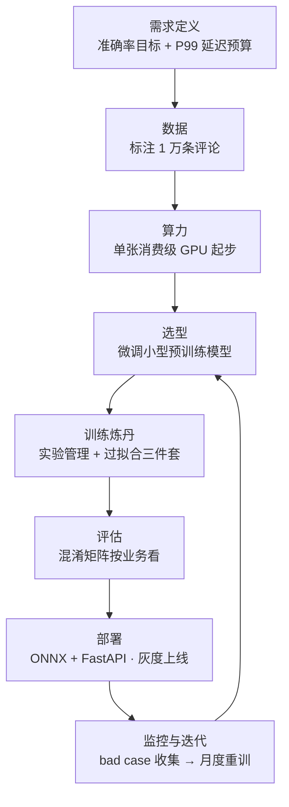
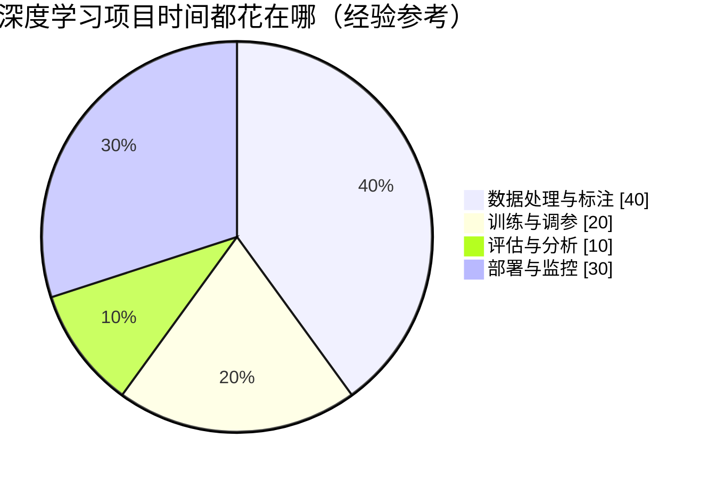
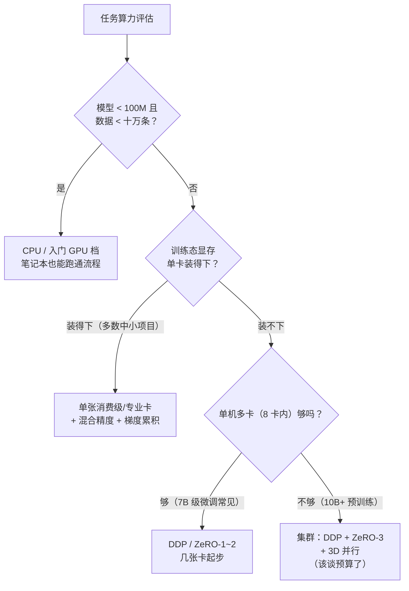

# 生产实战：一次深度学习项目的完整生命

> **一句话理解**：课本教的是"训练一个模型"，真实项目是"数据从哪来、卡从哪租、模型怎么选、服务怎么上线、上线之后怎么盯"——以一个评论文本情感分类小模型为例，从 0 到 1 走一遍完整生命。

[⬆️ 返回总目录](../../../README.md) · [⬆️ 返回本篇](../README.md) · [⬅️ 返回本章目录](./README.md)

| 属性 | 说明 |
|------|------|
| 难度 | ⭐⭐（进阶） |
| 所属分支 | 通用基础 |
| 前置知识 | 本章全部正文 |

---

## 🏭 一个真实项目从 0 到 1

**业务设定**：某电商 App 想自动把"愤怒差评"优先推给客服。定性成二分类任务：输入一条评论文本，输出"负面 / 非负面"。这不是玩具场景——绝大多数公司的第一个深度学习项目，长的就是这个样子。



先给一个时间分配的整体印象（经验参考，具体项目浮动很大）：



分阶段拆解（每阶段说清"做什么、花多久、常见卡点"；"花多久"均为量级感受，经验参考）：

- **需求定义**（约 1~2 周）
  - 和业务方对齐两件事：准确率目标（如"负面召回 ≥ 90%，误伤率可接受"）和延迟预算（**P99 < 100ms**）；
  - 明确验收口径：抽多少条线上流量人工复核、达到什么指标算验收通过；
  - 常见卡点：业务方说"越准越好"，等于没说——把"召回"和"准确"的取舍摆到台面上，写成一行验收标准。
- **数据**（约 2~4 周，最花时间的一环）
  - 从历史评论抽样 1 万条；渠道常见是"内部运营/客服打标 + 众包平台补量"；
  - 标注成本量级：每条几毛到几元（经验参考，按任务难度浮动），1 万条总成本几千到几万元；
  - 清洗占本阶段一半时间：去重、去水军、模糊样例仲裁、标注一致性抽查（两人背靠背标，分歧率高的规则要重写）；
  - 铁律：**数据质量上限就是模型上限**，这阶段偷的懒后面全要还。
- **设备与算力**（按需，不提前囤）
  - 这个规模的项目**一张消费级 GPU（如 RTX 4090）绰绰有余**，CPU 也能训只是慢；
  - 云租 vs 自建的常见决策：短期实验云租（单张专业卡每小时几美元量级，经验参考），长期稳定负载再谈自建；
  - 训练本身可能只要几小时——时间大头在数据和迭代，不在算力。
- **算法选型**（约 1 周）
  - 两条路：微调一个小型预训练语言模型（如 BERT-base 级，约 110M 参数）vs 从零自己训；
  - **几乎永远选前者**：预训练模型已自带语言知识，1 万条标注足够"教它这个业务"，从零训这个量级数据基本学不出通用表示；
  - 具体做法见[微调与对齐](../../4-专业方向/07-自然语言处理与LLM/05-微调与对齐.md)。
- **训练炼丹**（约 1~2 周）
  - 起步配方：微调常用 Adam + lr=2e-5 量级、batch=32、先小跑通再放大；
  - 每个实验记进实验管理工具（W&B 或 MLflow）——跑错版本找不回是最冤枉的翻车；
  - 过拟合三件套常备：早停、权重衰减（L2）、必要时数据增强（同义改写）；
  - 1 万条数据第 2~3 个 epoch 就可能过拟合，验证曲线盯紧。
- **评估**（约 3~5 天）
  - 不只看准确率，**混淆矩阵按业务看**：
  - "愤怒差评分成非负面"（漏报 → 客户流失）与"好评分成负面"（误报 → 客服白跑）代价不同；
  - 本业务里漏报贵，就盯召回；离线指标达标才进部署。
- **部署**（约 1~2 周）
  - 模型导出 ONNX，用 FastAPI 包一个 `/predict` 接口（输入评论文本，输出标签与置信度）；
  - Docker 打包，**灰度上线**：先放 5% 流量，对比线上指标与旧规则（或人工抽样），无异常再全量；
  - 方法与工具详见[推理与部署](./05-推理与部署.md)。
- **监控与迭代**（长期）
  - 每天盯 QPS、P99 延迟、预测分布（负面占比突然跳变 = 要么真有舆情、要么模型漂移）；
  - 线上 bad case 自动落盘，攒够一批人工复核，**月度重训**一次；
  - 深度学习模型不是交付物，是"需要喂养的服务"。

<details>
<summary>📊 展开看：评估阶段的混淆矩阵怎么"按业务看"（示例数字）</summary>

假设 2000 条验证集的预测结果如下：

| | 预测：负面 | 预测：非负面 |
|------|-----------|-------------|
| **真实：负面** | 855（抓住的愤怒差评） | 95（**漏报**：客户流失风险） |
| **真实：非负面** | 80（误报：客服白跑） | 970 |

- 整体准确率 = (855+970)/2000 = 91.25%——看着不错，但它会掩盖两种错的代价差异；
- 负面召回 = 855/950 = 90%——达到验收线；漏报的 95 条就是客服主管会来找你的那批；
- 非负面被误伤 = 80/1050 ≈ 7.6%——业务若嫌高，把判定阈值往"更敢报负面"的方向挪（阈值调低），召回上升、误报上升，**阈值是业务旋钮，不是技术参数**。

</details>

<details>
<summary>📋 展开一个真实的迭代故事</summary>

上线第三周，客服主管反馈"漏报变多了"。拉出近期 bad case 一看：一批新出的网络用语和缩写（评论区的"避雷""典中典"这类新表达）模型没见过——训练数据是一个季度前抽的，语言早进化了。处理三步：

1. 把这类样本补充进标注队列；
2. 重训时混入最新数据并加大其采样权重；
3. 把"预测置信度低的样本自动进复核池"加进监控。

两周后召回回到目标线。教训：文本业务的分布漂移是常态，**月度重训和数据滚动更新要写进流程，而不是等出事再救火**。

</details>

<details>
<summary>💰 展开看：这个项目大概花多少钱（量级估算，经验参考）</summary>

- 标注 1 万条：几千到几万元（渠道与难度浮动）；
- 训练算力：一张消费级 GPU 数小时 × 几十次实验 ≈ 单卡几天机时；云租专业卡的话，几十到几百小时量级；
- 部署：CPU 服务器或单张推理卡常驻即可（ONNX + CPU 对这个规模的模型够用）；
- 最贵的其实是人：以上所有环节的人力时间，远超标注和算力的账单。

</details>

## 🧮 算力账本：什么任务配什么档位的算力

上一节说"这个项目一张消费级 GPU 够了"——那什么时候不够？把决策画成流程图（配合[第 4 页](./04-分布式训练与模型规模.md)的显存与 FLOPs 公式使用）：



各档位的真实成本量级（经验参考，价格随地区与时间浮动）：

| 档位 | 典型任务 | 设备 | 成本量级 |
|------|----------|------|----------|
| CPU 档 | 表格模型（第 3 章路线）、小模型推理 | 笔记本/普通服务器 | 电费级，基本忽略 |
| 入门 GPU 档 | <100M 微调、小模型实验 | RTX 4090 级 | 自购万元级 / 云租约 $0.5~1/时 |
| 专业卡档 | BERT 级微调、7B 推理、LoRA 微调 | A100/H100 单卡或几张 | 云租约 $2~4/时 |
| 集群档 | 7B~70B 全参训练 | 数十~数百卡 × 数周 | 数万~数百万美元级 |

三条省钱经验（行业常见做法）：① **实验期用小模型替身**——超参搜索、数据管道调试都用小号模型跑，最后才在大模型上正式训练；② **云租按时计价**——Spot/竞价实例能再砍一半以上，代价是可能被中断（训练脚本要支持 checkpoint 续训）；③ **先算 FLOPs 账再开机**——用第 4 页的 6ND 公式心算，避免"跑了三天才发现预算不够"的悲剧。

## 🧭 场景选型表

| 场景 | 推荐 | 理由 | 不推荐 |
|------|------|------|--------|
| 数据少（万条级）、要快出结果 | 微调小型预训练模型 | 预训练自带知识，小数据可教 | 从零训练（数据量远不够） |
| 要低延迟 / 端侧部署 | 量化 + 小模型（必要时蒸馏） | INT8 推理快、体积小 | 直接上大模型裸跑 |
| 要极致精度、延迟不敏感 | 大模型 + 蒸馏落地 | 大模型定上限，蒸馏后小模型承接线上流量 | 小模型硬调参（天花板低） |
| 表格数据、要稳要可解释 | 梯度提升树（第 3 章路线） | 表格任务树模型快稳好调 | 强行套深度学习 |

## 🧰 真实工具链

| 环节 | 常用工具 | 一句话点评 |
|------|----------|-----------|
| 训练框架 | PyTorch | 科研与工业主流，"像写 Python" |
| 预训练模型 | HuggingFace transformers | 一行代码拿到社区模型，事实标准 |
| 推理引擎 | ONNX Runtime | 跨平台、上手快，本项目的部署首选 |
| 推理引擎 | TensorRT | NVIDIA 平台的极致性能档，延迟敏感时再上 |
| 实验跟踪 | W&B / MLflow | 记录超参、指标、模型版本；前者体验好，后者开源自托管方便 |
| 服务框架 | FastAPI | 异步、自带文档，Python 圈包模型接口的默认选择 |
| 打包部署 | Docker | 环境一致性的唯一答案，"我机器上能跑"的终结者 |
| 监控告警 | Prometheus + Grafana | 指标采集与仪表盘的事实标准组合 |

## ✅ 上线前评估清单（四组）

上线不是"准确率够了就发"，按四组过一遍（每条都是真实翻过车才写进来的）：

**功能组（模型对不对）**

- [ ] 离线指标用**最新一周**的数据复测过，而不是当初的训练集划分；
- [ ] 混淆矩阵按业务代价看过一遍，阈值与业务方**共同**确认；
- [ ] 极端输入试过一批：空文本、超长文本、emoji 刷屏、外语文本——不崩、有兜底输出；
- [ ] 输出置信度分布看过：低置信样本的比例符合预期（决定复核池流量）。

**性能组（扛不扛得住）**

- [ ] 延迟是**压测出来的 P99**，不是单条请求掐的秒表；
- [ ] 目标 QPS 的 1.5~2 倍压力下打过（留流量波动的余量）；
- [ ] 推理服务有预热逻辑，冷启动慢不会被第一波流量打爆；
- [ ] 扩容方案演练过：加副本后吞吐是否线性上涨（卡在哪：GPU？序列化？上游？）。

**安全组（会不会闯祸）**

- [ ] 对抗性输入抽查过：故意写"阴阳怪气""变体错别字"的差评，看漏报是否激增；
- [ ] 用户输入不回显、不做训练数据前先脱敏（隐私合规红线）；
- [ ] 模型输出不直接触发高危动作（自动退款/封号类动作必须有人审或二次规则）。

**回滚组（出事能不能退）**

- [ ] 灰度开关/回滚方案演练过一次（回到旧规则只需要改一行配置）；
- [ ] 新旧模型的预测日志分开落盘，出问题能对比"同一批输入两边各怎么判"；
- [ ] 回滚后数据管道兼容（新版多输出的字段，旧版消费者不会崩）。

## 📈 线上监控指标体系

上线只是开始，仪表盘上每天要看的四类指标（缺一类都算裸奔）：

| 类别 | 指标 | 健康的样子 | 异常时通常说明什么 |
|------|------|-----------|-------------------|
| 延迟 | P50 / P95 / P99 | 三条线平稳，P99 在预算内 | P50 升=模型/机器普遍变慢；只有 P99 抽高=排队、GC、抢占（见[推理与部署](./05-推理与部署.md)⑥） |
| 流量 | QPS、批大小分布 | 与业务节奏吻合（白天高夜里低） | 突增突降先查上游与爬虫，再查自己 |
| 资源 | GPU 利用率、显存占用、副本数 | GPU 利用率 60%~90% | 常年 <30% → 数据加载或序列化瓶颈；显存爬升 → 泄漏（缓存没清理） |
| 质量 | 预测分布、置信度分布、抽检准确率 | 负面占比、置信度直方图形状稳定 | 分布漂移（新词/舆情/刷单）；抽检准确率跌破线 → 触发重训流程 |

**输出质量抽检**的常见做法：每天自动抽样几百条线上预测（分层：高置信/低置信各抽一部分），人工或资深规则模型复核，准确率进仪表盘——这是唯一能发现"慢慢变坏"的指标，其他三类只能发现"突然坏"。

<details>
<summary>📋 展开看：故障复盘模板（附一个填好的示例）</summary>

每次线上事故（P99 超标、误报激增、服务不可用）后 48 小时内填一份，归档到团队 wiki：

```markdown
## 故障复盘：〔标题〕
- 日期 / 持续时间：
- 影响面：多少请求/用户受影响，业务损失量级
- 时间线：HH:MM 告警触发 → HH:MM 定位 → HH:MM 回滚/修复 → HH:MM 恢复
- 根因（技术）：为什么发生（往深挖到机制层，不停在"某人手滑"）
- 根因（流程）：为什么没拦住（缺哪个检查项/告警）
- 修复动作：短期（已做）+ 长期（待办，标 owner 和期限）
- 经验教训：一句话，能进新人培训的那种
```

填好的示例（虚构但典型）：**"双十一大促首小时，评论分类 P99 从 80ms 飙到 3s。"** 时间线：10:00 流量涨 5 倍告警 → 10:10 发现自动扩容上限配了 4 副本 → 10:15 手动扩到 12 副本 → 10:25 恢复。根因（技术）：动态批处理队列在高压下排队积压，延迟被攒批时间主导；根因（流程）：压测只按日常峰值 1.5 倍打，没按大促峰值。修复：扩容上限改为按 QPS 自动计算；压测场景补"大促 5 倍"档。教训：**容量测试的压力模型要跟业务日历走，不跟昨天的均值走。**

</details>

## 💣 踩坑实录

- **坑 1：离线 95%，线上 88%** → 分布偏移：训练数据是历史抽样的，线上是实时流量（新词、刷屏活动、表情符号打法不同）。救法：灰度期收集线上 bad case 回流训练集，滚动重训；上线前用最新一周数据做验证集再测一次。
- **坑 2：GPU 利用率常年 20%，还以为代码有 bug** → 瓶颈在数据加载：文本 tokenize、数据增强都在 CPU 上串行做，GPU 大部分时间在等喂数据。救法：DataLoader 开多进程（`num_workers`）、预处理缓存成张量，GPU 利用率立刻抬升。
- **坑 3：评估结果每次都不一样，一度怀疑显卡坏了** → 忘了 `model.eval()`：Dropout 还在随机丢弃，BatchNorm 还在用 batch 统计量。救法：评估块固定写 `model.eval() + torch.no_grad()` 两件套（见[PyTorch快速上手](./03-PyTorch快速上手.md)的坑清单）。

## 🗣️ 炼丹师大实话

> **"部署和监控占项目时间的一半，而课程只教训练那另一半。"** 训练出 95% 的模型只是拿到入场券；数据回流、分布漂移、延迟预算、灰度策略——这些"另一半"决定项目是 demo 还是资产。

---

[⬅️ 上一页：进阶专题：大规模训练工程](./06-进阶专题-大规模训练工程.md) · [返回本章目录](./README.md) · [下一页：第 5 章：计算机视觉 ➡️](../../4-专业方向/05-计算机视觉/README.md)
