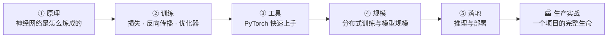

# 第 4 章：深度学习基础 🧠

> 第 3 章的世界里，喂给模型的特征要靠人手工设计；本章跨过这条分水岭——**特征交给神经网络自己学**，这就是表示学习（Representation Learning）。本章五页正文加一页生产实战，从"网络怎么算"一路讲到"多卡怎么训、上线怎么跑"，是第四篇所有专业方向共同的地基。

[⬆️ 返回总目录](../../../README.md) · [⬆️ 返回本篇](../README.md)

## 🧭 本章定位：从"手工设计特征"到"自动学特征"

在第 3 章的经典机器学习里，模型再强，也只能吃到人喂给它的特征：预测房价要先造"每平米单价"，识别垃圾邮件要先数"可疑词个数"。特征设计得好不好，直接决定模型上限——这一步被称为特征工程（Feature Engineering），也是过去算法工程师最花时间的地方。

深度学习（Deep Learning）换了一条路：把原始数据（像素、字符、声音采样）直接丢进一个多层神经网络，让**每一层自动把表示加工得更抽象**——从像素到边缘、从边缘到部件、从部件到物体。人不再告诉模型"该看什么"，模型自己学出"该看什么"。

那经典机器学习是不是被淘汰了？并没有，两边的地盘大致是这样的（经验法则）：

| 数据形态 | 通常更强的方案 | 原因 |
|----------|----------------|------|
| 图像、文本、语音等原始高维数据 | 深度学习 | 手工特征设计不动，自动学特征碾压人工 |
| 结构化表格数据（如用户行为表、金融特征表） | 梯度提升树（如 XGBoost / LightGBM） | 表格特征本来就"人类可读"，树模型快、稳、好调 |

所以本章不是"取代第 3 章"，而是补上另一件武器——遇到图像、文本这类原始数据时，你需要它。

## 🗺️ 本章知识树

五页环环相扣：先懂"网络怎么算"（前向传播），再懂"网络怎么学"（训练全流程，本章灵魂页），接着用 PyTorch 把原理落成四步复用模板，然后回答"模型大了怎么办"（分布式），最后走完"训练完怎么上线"（推理与部署）。

## 📖 推荐阅读顺序

| 顺序 | 页面 | 难度 | 一句话说明 |
|------|------|------|-----------|
| 1 | [神经网络是怎么炼成的](./01-神经网络是怎么炼成的.md) | ⭐⭐⭐ | 从感知机到多层网络：层是流水线车间，逐层把表示加工得更抽象 |
| 2 | [训练一个模型的完整流程](./02-训练一个模型的完整流程.md) | ⭐⭐⭐ | 本章灵魂页：损失、反向传播、优化器进化、过拟合对策全家桶 |
| 3 | [PyTorch快速上手](./03-PyTorch快速上手.md) | ⭐⭐ | 把前两页的原理变成可复用的四步代码模板 |
| 4 | [分布式训练与模型规模](./04-分布式训练与模型规模.md) | ⭐⭐⭐ | 模型为什么分小中大、多卡训练到底在并行什么 |
| 5 | [推理与部署](./05-推理与部署.md) | ⭐⭐⭐ | 训练完只是上半场：延迟、吞吐、ONNX、量化、蒸馏 |
| 收官 | [生产实战](./99-生产实战.md) | ⭐⭐ | 以"评论文本情感分类"为例，走一个项目从 0 到 1 的完整生命 |

## 🎯 读完本章你应该能

- 手算一个迷你神经网络的前向传播，并说清激活函数为什么必须非线性；
- 解释损失、反向传播、优化器各自在训练循环里干什么，独立写出"造数据→模型→损失→优化→训练→评估"的完整循环；
- 用 PyTorch 的 Tensor、autograd、nn.Module、DataLoader 四件套把循环工程化，并避开新手最常见的坑；
- 建立"参数量→显存→要不要多卡"的量级直觉，说清数据并行、模型并行各自在拆什么；
- 把训练好的模型导出 ONNX 并对比推理耗时，知道批量离线、在线 API、端侧三种部署形态怎么选。

## 🔗 与其他章节的关系

- **前置章节**：[第 3 章：机器学习](../../2-经典机器学习/03-机器学习/README.md)——"数据→模型→损失→评估"的世界观，逻辑回归就是单个神经元；[第 2 章：数学基础](../../1-起步准备/02-数学基础/README.md)——矩阵乘法、梯度和链式法则是本章的数学语言。
- **后续章节**：[第 5 章：计算机视觉](../../4-专业方向/05-计算机视觉/README.md)、[第 6 章：时间序列](../../4-专业方向/06-时间序列/README.md)、[第 7 章：NLP 与大语言模型](../../4-专业方向/07-自然语言处理与LLM/README.md)等——第四篇所有方向都在本章的训练循环、分布式与部署思路上展开。

---

[⬅️ 上一章：第 3 章 · 机器学习](../../2-经典机器学习/03-机器学习/README.md) · [返回总目录](../../../README.md) · [下一章：第 5 章 · 计算机视觉 ➡️](../../4-专业方向/05-计算机视觉/README.md)
